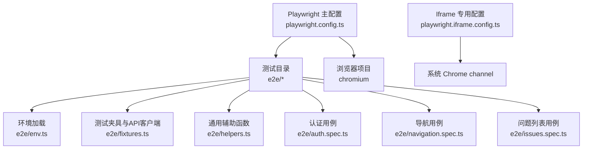
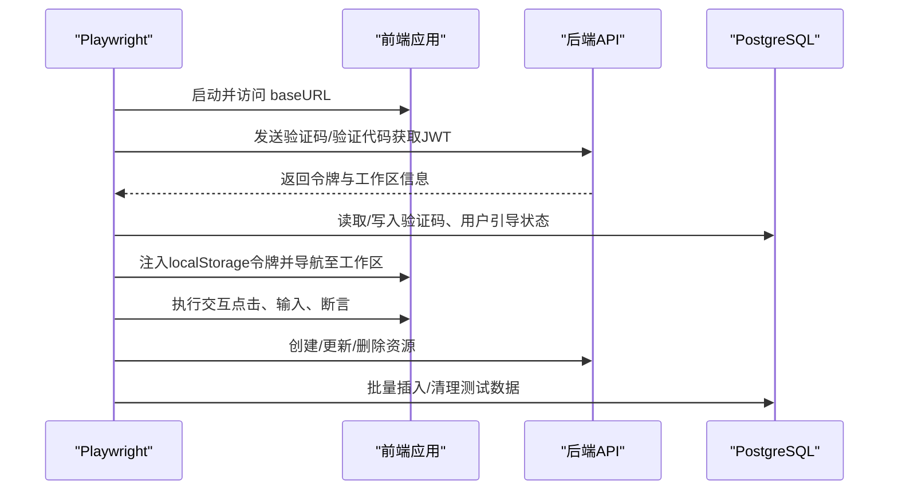
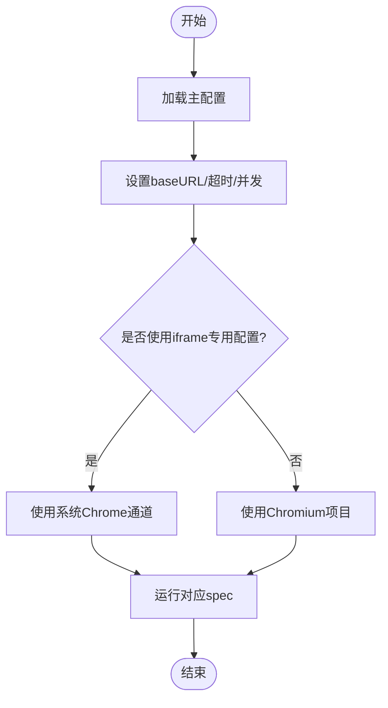
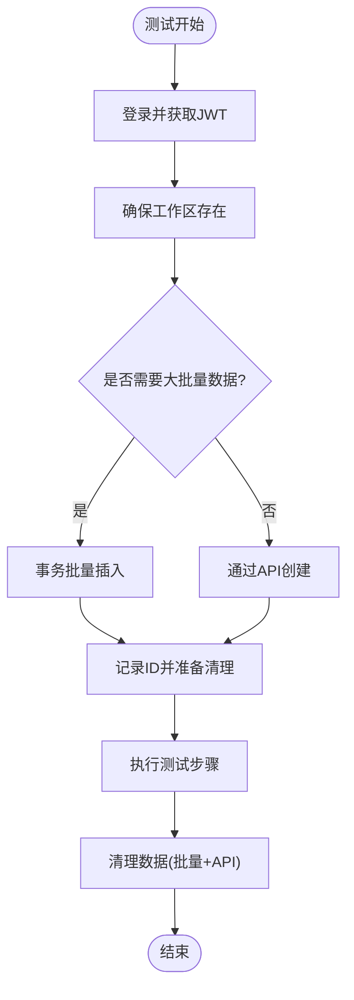
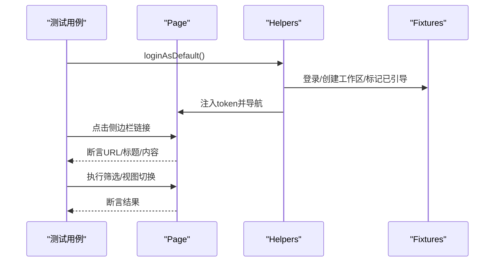
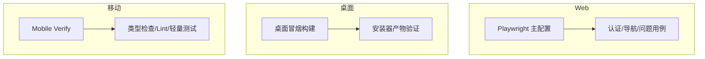
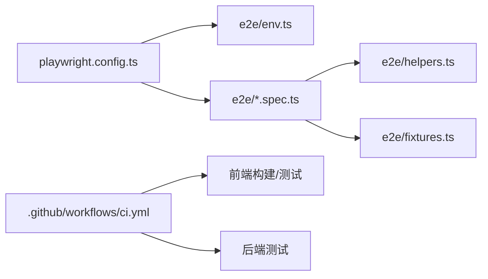

# 端到端测试

<cite>
**本文引用的文件**
- [playwright.config.ts](file://playwright.config.ts)
- [playwright.iframe.config.ts](file://playwright.iframe.config.ts)
- [e2e/env.ts](file://e2e/env.ts)
- [e2e/fixtures.ts](file://e2e/fixtures.ts)
- [e2e/helpers.ts](file://e2e/helpers.ts)
- [e2e/auth.spec.ts](file://e2e/auth.spec.ts)
- [e2e/navigation.spec.ts](file://e2e/navigation.spec.ts)
- [e2e/issues.spec.ts](file://e2e/issues.spec.ts)
- [.github/workflows/ci.yml](file://.github/workflows/ci.yml)
- [.github/workflows/desktop-smoke.yml](file://.github/workflows/desktop-smoke.yml)
- [.github/workflows/mobile-verify.yml](file://.github/workflows/mobile-verify.yml)
- [package.json](file://package.json)
</cite>

## 目录
1. [简介](#简介)
2. [项目结构](#项目结构)
3. [核心组件](#核心组件)
4. [架构总览](#架构总览)
5. [详细组件分析](#详细组件分析)
6. [依赖关系分析](#依赖关系分析)
7. [性能考量](#性能考量)
8. [故障排查指南](#故障排查指南)
9. [结论](#结论)
10. [附录](#附录)

## 简介
本文件面向 Multica 多平台应用的端到端（E2E）测试，聚焦 Playwright 配置与使用、测试场景设计原则、测试数据管理策略、调试技巧、跨平台一致性验证以及持续集成中的执行与失败处理。文档基于仓库中现有的 Playwright 配置、测试夹具与用例实现，并结合 CI 工作流说明如何在流水线中稳定运行 E2E 测试。

## 项目结构
- 根级 Playwright 配置位于根目录，指定测试目录、超时、并发、浏览器项目与基础 URL；默认以 headless 模式运行 Chromium。
- 独立的 iframe 专用配置用于本地隔离的滚动桥接测试，使用系统 Chrome channel，避免下载 Playwright 内置 headless shell。
- e2e 目录下包含环境加载、测试夹具、通用辅助函数与具体业务场景的 spec 文件。
- CI 通过 GitHub Actions 组织前端构建/测试、后端测试与平台相关任务；移动端与桌面端有独立或并行的校验流程。

**图表来源**
- [playwright.config.ts:1-22](file://playwright.config.ts#L1-L22)
- [playwright.iframe.config.ts:1-22](file://playwright.iframe.config.ts#L1-L22)
- [e2e/env.ts:1-14](file://e2e/env.ts#L1-L14)
- [e2e/fixtures.ts:1-366](file://e2e/fixtures.ts#L1-L366)
- [e2e/helpers.ts:1-91](file://e2e/helpers.ts#L1-L91)
- [e2e/auth.spec.ts:1-47](file://e2e/auth.spec.ts#L1-L47)
- [e2e/navigation.spec.ts:1-48](file://e2e/navigation.spec.ts#L1-L48)
- [e2e/issues.spec.ts:1-202](file://e2e/issues.spec.ts#L1-L202)

**章节来源**
- [playwright.config.ts:1-22](file://playwright.config.ts#L1-L22)
- [playwright.iframe.config.ts:1-22](file://playwright.iframe.config.ts#L1-L22)
- [e2e/env.ts:1-14](file://e2e/env.ts#L1-L14)

## 核心组件
- 测试入口与配置：定义测试目录、全局超时、并发数、重试策略、headless 模式与 baseURL；按项目划分浏览器。
- 环境加载：优先加载 .env.worktree，再回退到 .env，确保本地与 CI 环境变量一致。
- 测试 API 客户端：封装登录、工作区创建/选择、用户标记已引导、批量插入表格数据、清理等能力，直接调用后端 API 或通过数据库直连完成数据准备与清理。
- 通用辅助函数：提供默认用户登录注入 token、等待页面文本、重载应用、切换偏好设置、打开工作区菜单等。
- 典型用例：覆盖认证流程、侧边栏导航、问题视图切换、筛选、创建与跳转详情、取消创建等。

**章节来源**
- [playwright.config.ts:1-22](file://playwright.config.ts#L1-L22)
- [e2e/env.ts:1-14](file://e2e/env.ts#L1-L14)
- [e2e/fixtures.ts:1-366](file://e2e/fixtures.ts#L1-L366)
- [e2e/helpers.ts:1-91](file://e2e/helpers.ts#L1-L91)
- [e2e/auth.spec.ts:1-47](file://e2e/auth.spec.ts#L1-L47)
- [e2e/navigation.spec.ts:1-48](file://e2e/navigation.spec.ts#L1-L48)
- [e2e/issues.spec.ts:1-202](file://e2e/issues.spec.ts#L1-L202)

## 架构总览
E2E 测试由 Playwright 驱动，在 headless 模式下访问前端应用。测试夹具通过 HTTP 与数据库直连两种方式准备数据，并在测试结束后清理。CI 将前端构建、类型检查、Lint 与测试并行化，并通过路径过滤减少无关变更带来的开销。

**图表来源**
- [playwright.config.ts:1-22](file://playwright.config.ts#L1-L22)
- [e2e/fixtures.ts:1-366](file://e2e/fixtures.ts#L1-L366)
- [e2e/helpers.ts:1-91](file://e2e/helpers.ts#L1-L91)
- [e2e/auth.spec.ts:1-47](file://e2e/auth.spec.ts#L1-L47)
- [e2e/issues.spec.ts:1-202](file://e2e/issues.spec.ts#L1-L202)

## 详细组件分析

### Playwright 配置与浏览器选择
- 主配置启用 headless 模式，设置统一超时与单 worker，避免并发竞争；baseURL 支持从环境变量覆盖。
- 仅声明 chromium 项目，便于在 CI 中稳定执行；如需多浏览器矩阵，可在 projects 中扩展。
- Iframe 专用配置使用系统 Chrome channel，适合离线或沙箱环境，不依赖 Playwright 内置 headless shell。

**图表来源**
- [playwright.config.ts:1-22](file://playwright.config.ts#L1-L22)
- [playwright.iframe.config.ts:1-22](file://playwright.iframe.config.ts#L1-L22)

**章节来源**
- [playwright.config.ts:1-22](file://playwright.config.ts#L1-L22)
- [playwright.iframe.config.ts:1-22](file://playwright.iframe.config.ts#L1-L22)

### 测试数据管理策略
- 登录流程：通过后端 /auth/send-code 与 /auth/verify-code 接口获取 JWT，必要时更新用户名，并清理验证码记录以避免触发频率限制。
- 工作区保障：确保存在目标工作区，若不存在则创建；后续请求携带工作区标识头。
- 批量数据准备：对需要大量数据的表格视图，采用数据库事务批量插入，提升效率并保证原子性；同时维护插入 ID 列表以便清理。
- 清理策略：测试结束后按工作区范围删除批量插入的数据，并逐个删除通过 API 创建的条目，忽略已删除的错误以保证幂等。

**图表来源**
- [e2e/fixtures.ts:1-366](file://e2e/fixtures.ts#L1-L366)
- [e2e/helpers.ts:1-91](file://e2e/helpers.ts#L1-L91)

**章节来源**
- [e2e/fixtures.ts:1-366](file://e2e/fixtures.ts#L1-L366)
- [e2e/helpers.ts:1-91](file://e2e/helpers.ts#L1-L91)

### 测试场景设计原则
- 用户工作流：以真实用户操作为主线，如登录、进入工作区、创建/编辑/查看问题、退出登录等。
- 跨页面导航：验证侧边栏路由跳转、标题更新、URL 变化与页面内容可见性。
- 复杂交互：覆盖筛选器、视图切换（看板/列表）、键盘操作（Esc 取消）、弹窗/下拉菜单等。
- 稳定性：使用显式等待与断言，避免硬编码延时；通过 helpers 统一等待逻辑。

**图表来源**
- [e2e/auth.spec.ts:1-47](file://e2e/auth.spec.ts#L1-L47)
- [e2e/navigation.spec.ts:1-48](file://e2e/navigation.spec.ts#L1-L48)
- [e2e/issues.spec.ts:1-202](file://e2e/issues.spec.ts#L1-L202)
- [e2e/helpers.ts:1-91](file://e2e/helpers.ts#L1-L91)
- [e2e/fixtures.ts:1-366](file://e2e/fixtures.ts#L1-L366)

**章节来源**
- [e2e/auth.spec.ts:1-47](file://e2e/auth.spec.ts#L1-L47)
- [e2e/navigation.spec.ts:1-48](file://e2e/navigation.spec.ts#L1-L48)
- [e2e/issues.spec.ts:1-202](file://e2e/issues.spec.ts#L1-L202)

### 调试技巧
- 视频录制：可通过 Playwright 配置开启录制，便于定位 UI 时序与渲染问题。
- 网络拦截：结合 fixtures 的 API 调用与数据库直连，可模拟异常响应或固定数据，提高用例确定性。
- 性能分析：利用浏览器开发者工具与 Playwright 的 tracing，分析首屏加载与交互耗时。
- 本地隔离：使用 iframe 专用配置在无网络环境下运行，避免外部依赖影响。

[本节为通用指导，不直接分析具体文件]

### 多平台一致性测试
- Web：通过主 Playwright 配置在 Chromium 上运行，覆盖认证、导航、问题管理等核心流程。
- 桌面：CI 中包含桌面打包与冒烟构建流程，可用于验证桌面端产物可用性。
- 移动：CI 中有独立的 mobile-verify 工作流，负责 lint、类型检查与轻量测试；E2E 层可根据需要扩展 RN 自动化。

**图表来源**
- [playwright.config.ts:1-22](file://playwright.config.ts#L1-L22)
- [.github/workflows/desktop-smoke.yml:1-63](file://.github/workflows/desktop-smoke.yml#L1-L63)
- [.github/workflows/mobile-verify.yml:1-67](file://.github/workflows/mobile-verify.yml#L1-L67)

**章节来源**
- [.github/workflows/desktop-smoke.yml:1-63](file://.github/workflows/desktop-smoke.yml#L1-L63)
- [.github/workflows/mobile-verify.yml:1-67](file://.github/workflows/mobile-verify.yml#L1-L67)

## 依赖关系分析
- 配置依赖：主配置引入 e2e/env 以加载环境变量；iframe 配置独立，不依赖应用服务器。
- 用例依赖：各 spec 依赖 helpers 进行登录与页面等待，依赖 fixtures 进行数据准备与清理。
- CI 依赖：前端构建与测试通过 Turborepo 并行执行；后端测试依赖 Postgres 与 Redis 服务容器。

**图表来源**
- [playwright.config.ts:1-22](file://playwright.config.ts#L1-L22)
- [e2e/env.ts:1-14](file://e2e/env.ts#L1-L14)
- [e2e/helpers.ts:1-91](file://e2e/helpers.ts#L1-L91)
- [e2e/fixtures.ts:1-366](file://e2e/fixtures.ts#L1-L366)
- [.github/workflows/ci.yml:1-800](file://.github/workflows/ci.yml#L1-L800)

**章节来源**
- [playwright.config.ts:1-22](file://playwright.config.ts#L1-L22)
- [e2e/env.ts:1-14](file://e2e/env.ts#L1-L14)
- [e2e/helpers.ts:1-91](file://e2e/helpers.ts#L1-L91)
- [e2e/fixtures.ts:1-366](file://e2e/fixtures.ts#L1-L366)
- [.github/workflows/ci.yml:1-800](file://.github/workflows/ci.yml#L1-L800)

## 性能考量
- 并发与重试：当前配置使用单 worker 且无重试，有利于降低并发竞争与资源争用；如需加速，可增加 workers 并配合分片策略。
- 数据准备：大批量数据通过数据库事务批量插入，显著减少 HTTP 调用开销；清理时按工作区范围删除，避免全表扫描。
- 等待策略：使用显式等待与断言，避免盲目 sleep；helpers 统一等待逻辑，减少重复代码与不一致行为。
- CI 缓存：前端任务使用 Turbo 缓存，减少重复构建与测试时间；后端服务容器健康检查确保依赖就绪。

[本节为通用指导，不直接分析具体文件]

## 故障排查指南
- 登录失败：检查验证码发送与读取流程，确认数据库连接与邮箱唯一性；必要时使用开发环境变量覆盖验证码。
- 工作区不存在：确保登录后调用 ensureWorkspace；若创建失败，刷新工作区列表并选取已有项。
- 页面未就绪：使用 waitForPageText 或 page.waitForLoadState 确保 DOM 与网络空闲后再断言。
- 数据残留：在 afterEach 中调用 cleanup，确保批量插入与 API 创建的数据被清理；忽略已删除错误以保证幂等。
- CI 失败：根据工作流日志定位具体 job；前端问题关注构建/类型检查/Lint/测试输出；后端问题关注迁移与服务容器健康。

**章节来源**
- [e2e/fixtures.ts:1-366](file://e2e/fixtures.ts#L1-L366)
- [e2e/helpers.ts:1-91](file://e2e/helpers.ts#L1-L91)
- [.github/workflows/ci.yml:1-800](file://.github/workflows/ci.yml#L1-L800)

## 结论
本项目已具备完善的 E2E 测试基础设施：Playwright 配置简洁稳定，测试夹具提供强大的数据管理能力，用例覆盖关键用户路径。CI 通过路径过滤与并行化提升效率，并为桌面与移动端提供独立的校验流程。建议在此基础上逐步扩展多浏览器矩阵、增加截图/视频录制与性能分析，进一步完善跨平台一致性验证。

[本节为总结，不直接分析具体文件]

## 附录
- 运行方式：
  - 本地运行：确保应用与后端服务已启动，设置环境变量后执行 Playwright。
  - CI 运行：遵循 GitHub Actions 工作流，自动安装依赖、构建与执行测试。
- 环境变量：
  - 前端地址：PLAYWRIGHT_BASE_URL 或 FRONTEND_ORIGIN。
  - 后端地址：NEXT_PUBLIC_API_URL。
  - 数据库：DATABASE_URL。
  - 开发验证码：MULTICA_DEV_VERIFICATION_CODE。
- 常用命令：
  - 根脚本：参考 package.json 中的 scripts，结合 pnpm/Turborepo 执行。

**章节来源**
- [playwright.config.ts:1-22](file://playwright.config.ts#L1-L22)
- [e2e/env.ts:1-14](file://e2e/env.ts#L1-L14)
- [package.json:1-65](file://package.json#L1-L65)