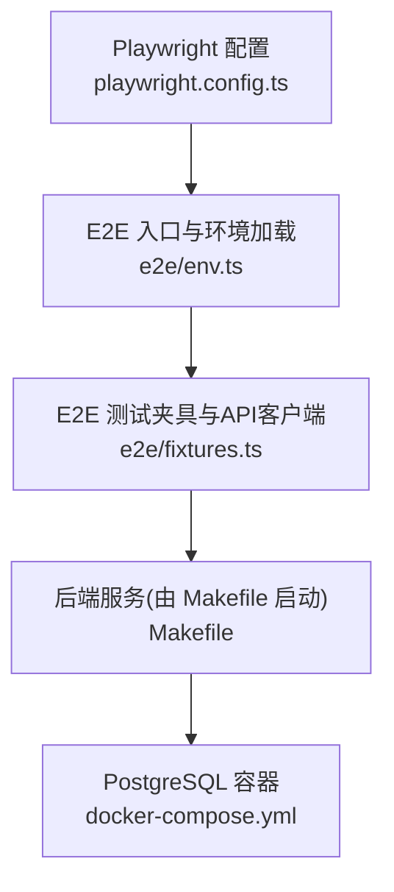
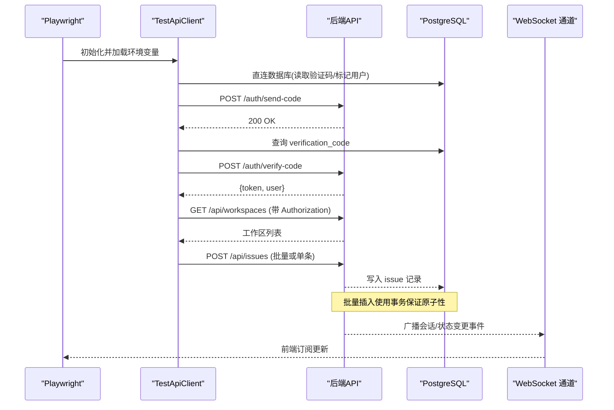
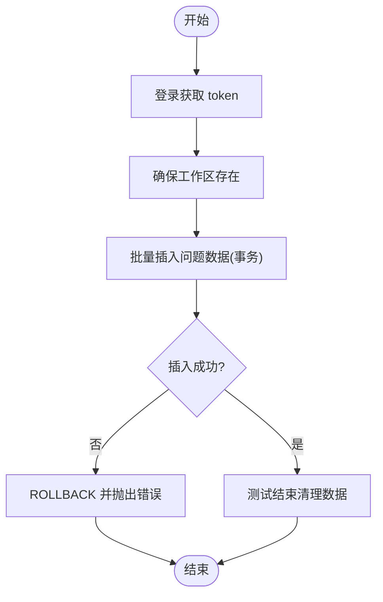
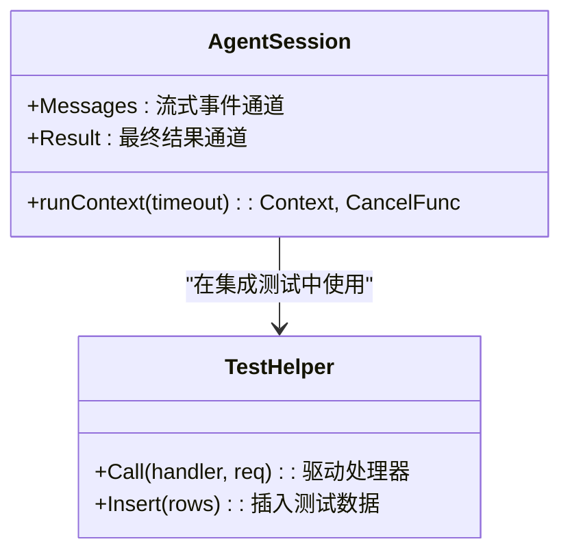
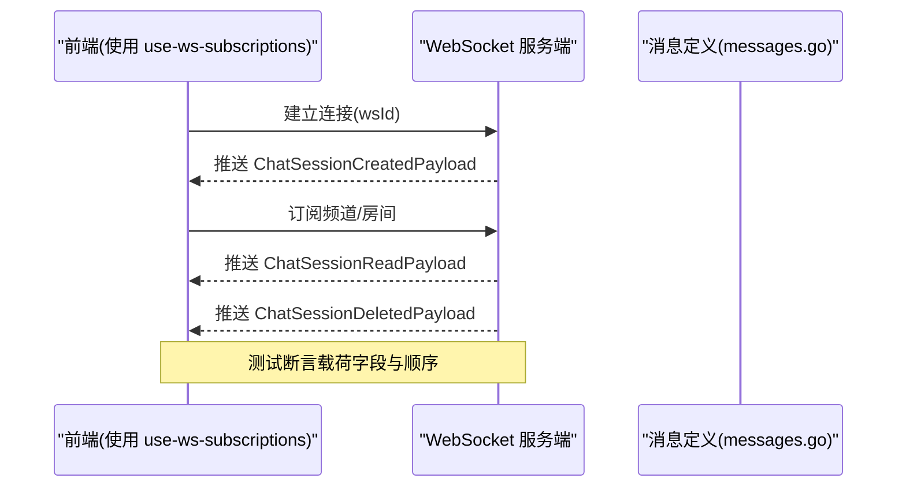
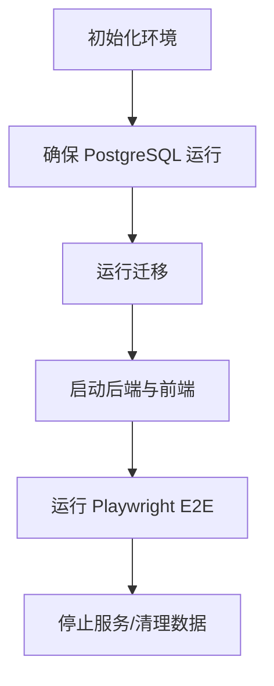
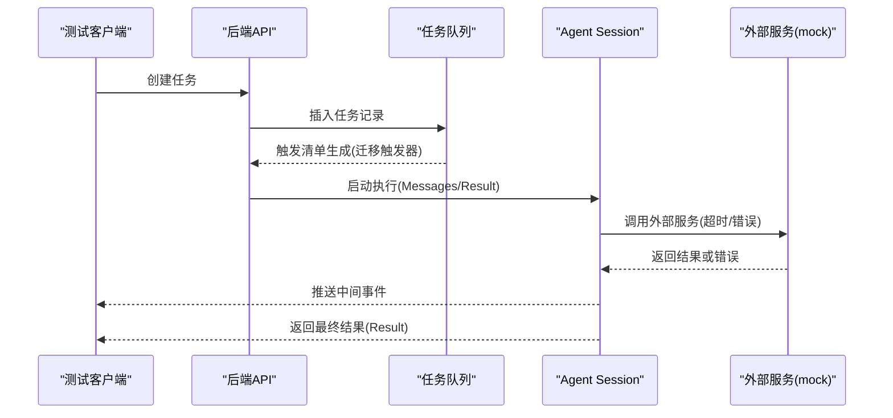
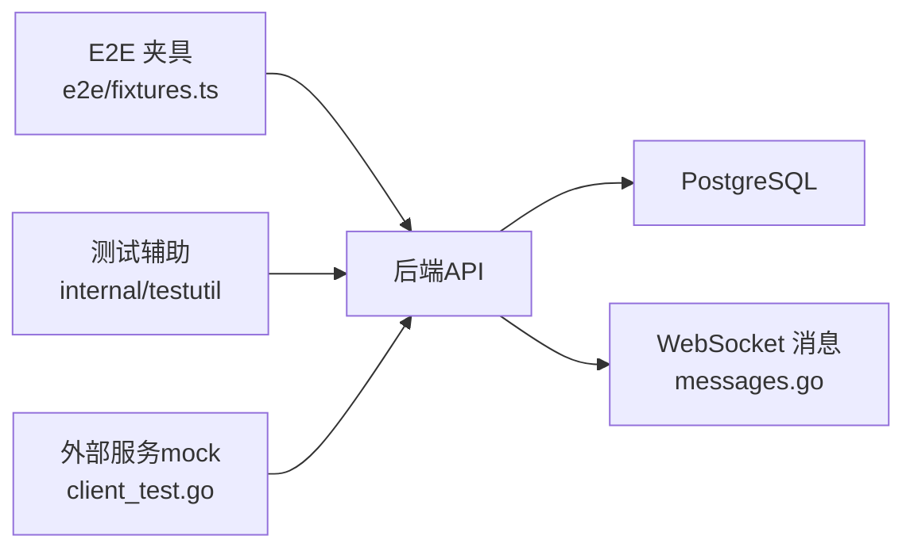

# 集成测试

<cite>
**本文引用的文件**
- [docker-compose.yml](file://docker-compose.yml)
- [Makefile](file://Makefile)
- [playwright.config.ts](file://playwright.config.ts)
- [e2e/env.ts](file://e2e/env.ts)
- [e2e/fixtures.ts](file://e2e/fixtures.ts)
- [CLAUDE.md](file://CLAUDE.md)
- [server/internal/testutil/http.go](file://server/internal/testutil/http.go)
- [server/internal/testutil/db.go](file://server/internal/testutil/db.go)
- [server/pkg/agent/agent.go](file://server/pkg/agent/agent.go)
- [server/pkg/composio/client_test.go](file://server/pkg/composio/client_test.go)
- [server/pkg/publicapi/v1/problem.go](file://server/pkg/publicapi/v1/problem.go)
- [apps/mobile/lib/request-id.ts](file://apps/mobile/lib/request-id.ts)
- [apps/mobile/lib/use-ws-subscriptions.ts](file://apps/mobile/lib/use-ws-subscriptions.ts)
- [server/pkg/protocol/messages.go](file://server/pkg/protocol/messages.go)
</cite>

## 目录
1. [简介](#简介)
2. [项目结构](#项目结构)
3. [核心组件](#核心组件)
4. [架构总览](#架构总览)
5. [详细组件分析](#详细组件分析)
6. [依赖关系分析](#依赖关系分析)
7. [性能考虑](#性能考虑)
8. [故障排查指南](#故障排查指南)
9. [结论](#结论)
10. [附录](#附录)

## 简介
本文件面向后端 Go 服务与前端 E2E 的集成测试实践，覆盖以下目标：
- API 层集成测试：HTTP 请求模拟、数据库事务回滚、外部服务 mock。
- 业务逻辑层集成测试：事务处理、并发控制、错误场景。
- WebSocket 连接集成测试：连接建立、消息收发、断开重连。
- 测试环境搭建：Docker Compose 配置、测试数据库初始化。
- AI 代理全链路验证：从任务创建到结果返回的端到端流程。

## 项目结构
仓库采用多包与多应用组织，测试分布在多个层级：
- E2E（浏览器级）：基于 Playwright，位于 e2e 目录，使用 TestApiClient 进行登录、工作区与问题数据准备。
- 后端 Go 测试：位于 server 下各包的 *_test.go，使用 internal/testutil 提供的 HTTP/DB 辅助工具。
- 前端单元测试：packages/views、apps/* 下的 .test.ts/.test.tsx，遵循 CLAUDE 规则避免不必要的 DOM 环境。
- 基础设施：docker-compose.yml 提供 PostgreSQL 容器；Makefile 提供统一的环境与迁移命令。

图表来源
- [playwright.config.ts:1-22](file://playwright.config.ts#L1-L22)
- [e2e/env.ts:1-14](file://e2e/env.ts#L1-L14)
- [e2e/fixtures.ts:1-366](file://e2e/fixtures.ts#L1-L366)
- [Makefile:175-266](file://Makefile#L175-L266)
- [docker-compose.yml:1-17](file://docker-compose.yml#L1-L17)

章节来源
- [playwright.config.ts:1-22](file://playwright.config.ts#L1-L22)
- [e2e/env.ts:1-14](file://e2e/env.ts#L1-L14)
- [e2e/fixtures.ts:1-366](file://e2e/fixtures.ts#L1-L366)
- [Makefile:175-266](file://Makefile#L175-L266)
- [docker-compose.yml:1-17](file://docker-compose.yml#L1-L17)

## 核心组件
- E2E 测试夹具 TestApiClient：封装登录、工作区确保、批量插入问题数据、清理等能力，直接操作数据库与调用后端 REST API。
- 后端测试辅助 internal/testutil：提供 DB 行构造与处理器驱动方法，简化 handler 集成测试。
- 外部服务 mock：通过 httptest.Server 将第三方客户端指向本地测试服务器，验证超时、错误码与协议交互。
- WebSocket 协议消息定义：集中定义聊天会话相关广播负载，便于在集成测试中校验事件一致性。

章节来源
- [e2e/fixtures.ts:1-366](file://e2e/fixtures.ts#L1-L366)
- [server/internal/testutil/http.go](file://server/internal/testutil/http.go)
- [server/internal/testutil/db.go](file://server/internal/testutil/db.go)
- [server/pkg/composio/client_test.go:1-57](file://server/pkg/composio/client_test.go#L1-L57)
- [server/pkg/protocol/messages.go:312-339](file://server/pkg/protocol/messages.go#L312-L339)

## 架构总览
下图展示 E2E 与后端服务的集成路径，包括数据库、认证、工作区与问题数据准备，以及 WebSocket 事件通道。

图表来源
- [e2e/fixtures.ts:56-114](file://e2e/fixtures.ts#L56-L114)
- [e2e/fixtures.ts:187-302](file://e2e/fixtures.ts#L187-L302)
- [server/pkg/protocol/messages.go:312-339](file://server/pkg/protocol/messages.go#L312-L339)

## 详细组件分析

### API 层集成测试
- HTTP 请求模拟：E2E 通过 TestApiClient.authedFetch 发送带 Authorization 与 X-Workspace-Slug/ID 的请求；后端公共错误码映射用于统一错误语义。
- 数据库事务回滚：批量插入使用 BEGIN/COMMIT/ROLLBACK，失败时回滚，保证测试隔离性与幂等性。
- 外部服务 mock：使用 httptest.NewServer 将第三方客户端指向本地测试服务器，断言请求体、响应体与错误路径。

图表来源
- [e2e/fixtures.ts:56-114](file://e2e/fixtures.ts#L56-L114)
- [e2e/fixtures.ts:206-302](file://e2e/fixtures.ts#L206-L302)
- [server/pkg/publicapi/v1/problem.go:36-75](file://server/pkg/publicapi/v1/problem.go#L36-L75)

章节来源
- [e2e/fixtures.ts:56-114](file://e2e/fixtures.ts#L56-L114)
- [e2e/fixtures.ts:206-302](file://e2e/fixtures.ts#L206-L302)
- [server/pkg/publicapi/v1/problem.go:36-75](file://server/pkg/publicapi/v1/problem.go#L36-L75)
- [server/pkg/composio/client_test.go:1-57](file://server/pkg/composio/client_test.go#L1-L57)

### 业务逻辑层集成测试
- 事务处理：服务层对多写操作使用应用事务，保证一致性与可回滚。
- 并发控制：AI 代理执行上下文支持超时与取消，避免长时间运行导致资源泄漏；测试中可通过设置超时与语义不活跃超时验证边界行为。
- 错误场景：通过 mock 外部服务返回不同错误码与消息，验证错误码映射与客户端重试策略。

图表来源
- [server/pkg/agent/agent.go:129-162](file://server/pkg/agent/agent.go#L129-L162)
- [server/internal/testutil/http.go](file://server/internal/testutil/http.go)
- [server/internal/testutil/db.go](file://server/internal/testutil/db.go)

章节来源
- [server/pkg/agent/agent.go:129-162](file://server/pkg/agent/agent.go#L129-L162)
- [server/internal/testutil/http.go](file://server/internal/testutil/http.go)
- [server/internal/testutil/db.go](file://server/internal/testutil/db.go)

### WebSocket 连接的集成测试
- 连接建立：前端通过 use-ws-subscriptions 管理 ws 实例与订阅生命周期，测试需确保 wsId 有效并在组件卸载时清理。
- 消息发送与接收：后端广播聊天会话相关事件（创建、删除、已读），测试应订阅并断言事件载荷字段。
- 断开重连：测试应模拟网络抖动与服务重启，验证客户端自动重连与状态恢复。

图表来源
- [apps/mobile/lib/use-ws-subscriptions.ts:40-51](file://apps/mobile/lib/use-ws-subscriptions.ts#L40-L51)
- [server/pkg/protocol/messages.go:312-339](file://server/pkg/protocol/messages.go#L312-L339)

章节来源
- [apps/mobile/lib/use-ws-subscriptions.ts:40-51](file://apps/mobile/lib/use-ws-subscriptions.ts#L40-L51)
- [server/pkg/protocol/messages.go:312-339](file://server/pkg/protocol/messages.go#L312-L339)

### 测试环境搭建指南
- Docker Compose：提供 PostgreSQL 容器，端口映射至 127.0.0.1:5432，持久化卷 pgdata。
- 环境初始化：Makefile 提供 setup、db-reset、up/down 等命令，自动安装依赖、确保数据库、运行迁移。
- E2E 配置：Playwright 指定 testDir 为 e2e，workers=1，headless=true，baseURL 取自环境变量。

图表来源
- [docker-compose.yml:1-17](file://docker-compose.yml#L1-L17)
- [Makefile:195-266](file://Makefile#L195-L266)
- [playwright.config.ts:1-22](file://playwright.config.ts#L1-L22)

章节来源
- [docker-compose.yml:1-17](file://docker-compose.yml#L1-L17)
- [Makefile:195-266](file://Makefile#L195-L266)
- [playwright.config.ts:1-22](file://playwright.config.ts#L1-L22)

### AI 代理完整执行流程测试
- 任务创建：通过后端 API 创建 agent_task_queue 记录，触发插件执行清单生成（迁移中的触发器）。
- 执行上下文：Agent Session 提供 Messages 与 Result 通道，支持超时与取消；测试可注入 fake CLI 或 mock 外部服务。
- 结果验证：断言最终结果状态、错误信息与会话 ID 保留；对于语义不活跃超时，验证错误包含特定提示。

图表来源
- [server/migrations/294_plugin_snapshot_execution_v1.up.sql:89-182](file://server/migrations/294_plugin_snapshot_execution_v1.up.sql#L89-L182)
- [server/pkg/agent/agent.go:129-162](file://server/pkg/agent/agent.go#L129-L162)
- [server/pkg/composio/client_test.go:1-57](file://server/pkg/composio/client_test.go#L1-L57)

章节来源
- [server/migrations/294_plugin_snapshot_execution_v1.up.sql:89-182](file://server/migrations/294_plugin_snapshot_execution_v1.up.sql#L89-L182)
- [server/pkg/agent/agent.go:129-162](file://server/pkg/agent/agent.go#L129-L162)
- [server/pkg/composio/client_test.go:1-57](file://server/pkg/composio/client_test.go#L1-L57)

## 依赖关系分析
- E2E 夹具依赖数据库直连与后端 REST API；后端依赖 PostgreSQL 与外部服务（通过 mock）。
- 后端测试辅助 internal/testutil 被 handler 测试广泛复用，降低样板代码。
- WebSocket 消息定义集中，便于前后端契约对齐与测试断言。

图表来源
- [e2e/fixtures.ts:1-366](file://e2e/fixtures.ts#L1-L366)
- [server/internal/testutil/http.go](file://server/internal/testutil/http.go)
- [server/pkg/protocol/messages.go:312-339](file://server/pkg/protocol/messages.go#L312-L339)
- [server/pkg/composio/client_test.go:1-57](file://server/pkg/composio/client_test.go#L1-L57)

章节来源
- [e2e/fixtures.ts:1-366](file://e2e/fixtures.ts#L1-L366)
- [server/internal/testutil/http.go](file://server/internal/testutil/http.go)
- [server/pkg/protocol/messages.go:312-339](file://server/pkg/protocol/messages.go#L312-L339)
- [server/pkg/composio/client_test.go:1-57](file://server/pkg/composio/client_test.go#L1-L57)

## 性能考虑
- E2E 批量数据插入使用事务与 SQL 批量语句，减少往返开销，提升测试稳定性。
- Playwright workers=1 避免并发竞争，适合端到端流程验证。
- 后端测试通过 httptest.Server 与内存对象，避免真实外部依赖带来的不确定性与延迟。

[本节为通用指导，无需具体文件引用]

## 故障排查指南
- 认证失败：检查 TestApiClient.login 流程是否正确读取验证码并调用 /auth/verify-code；确认 DATABASE_URL 与 PostgreSQL 可达。
- 工作区缺失：ensureWorkspace 会尝试创建或复用现有工作区；若失败，检查权限头 X-Workspace-Slug/ID 是否正确传递。
- 批量插入失败：查看 seedTableIssues 的事务分支，确认 ROLLBACK 是否触发；检查 workspace_id 与 creator_id 解析。
- 外部服务超时：使用 client_test.go 中的 newTestServer 模式，构造慢响应或错误响应，验证客户端超时与错误码映射。

章节来源
- [e2e/fixtures.ts:56-114](file://e2e/fixtures.ts#L56-L114)
- [e2e/fixtures.ts:206-302](file://e2e/fixtures.ts#L206-L302)
- [server/pkg/composio/client_test.go:1-57](file://server/pkg/composio/client_test.go#L1-L57)

## 结论
本集成测试体系以 E2E 夹具为核心，结合后端测试辅助与外部服务 mock，覆盖了 API 层、业务逻辑层与 WebSocket 通道的关键路径。通过 Docker Compose 与 Makefile 统一管理测试环境，确保数据库与迁移的一致性。AI 代理的全链路测试借助 Agent Session 的通道模型与迁移触发器，实现从任务创建到结果返回的闭环验证。建议持续完善错误场景与并发用例，保持测试的可维护性与稳定性。

[本节为总结性内容，无需具体文件引用]

## 附录
- 请求追踪：移动端每请求生成 X-Request-ID，便于前后端日志关联与问题定位。
- 测试规范：遵循 CLAUDE 规则，避免在共享组件测试中重复断言，优先在核心包编写 canonical 测试。

章节来源
- [apps/mobile/lib/request-id.ts:1-14](file://apps/mobile/lib/request-id.ts#L1-L14)
- [CLAUDE.md:216-232](file://CLAUDE.md#L216-L232)