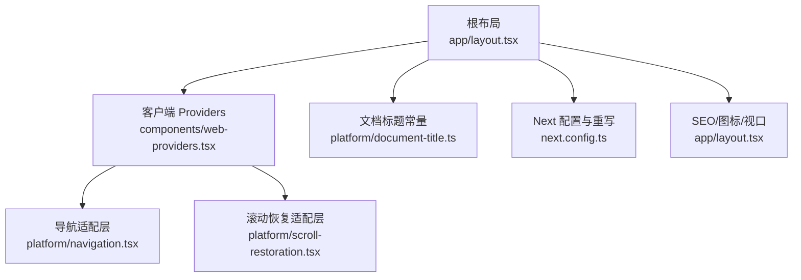
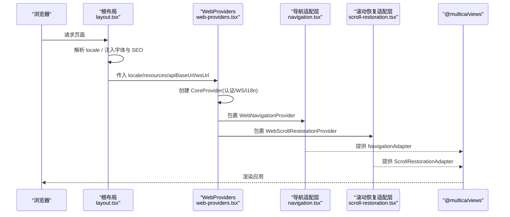
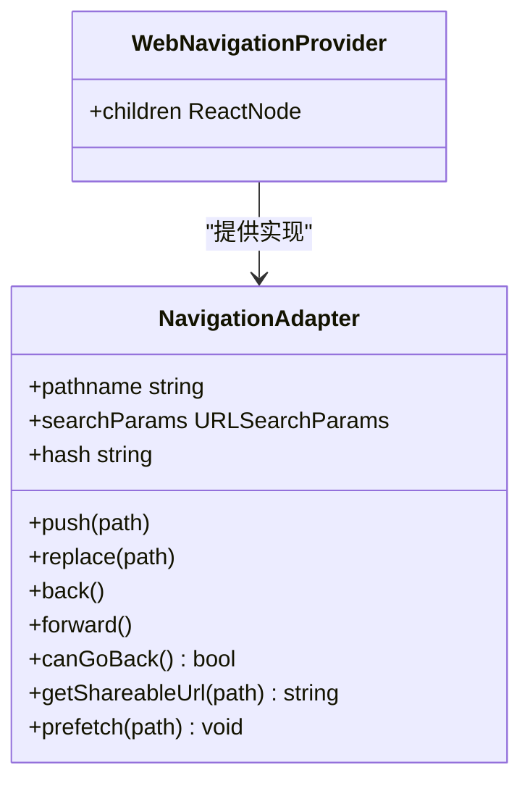
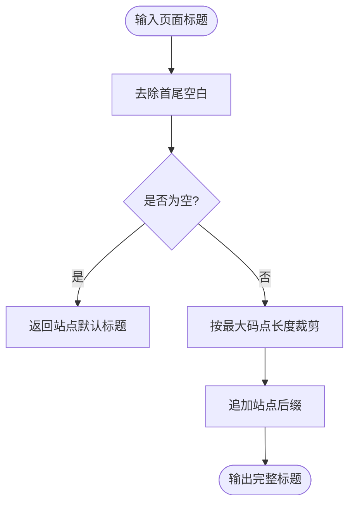
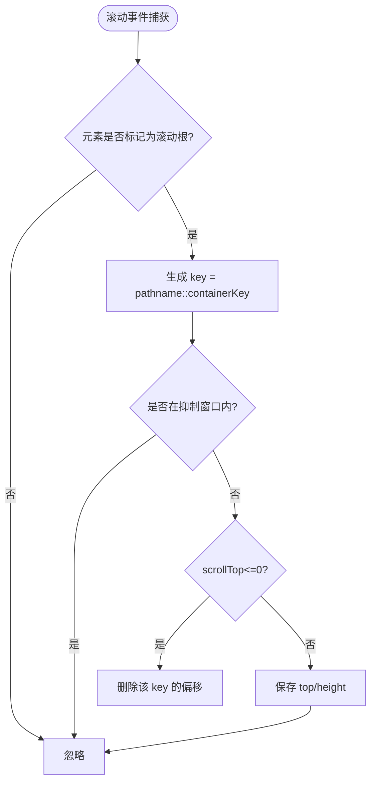
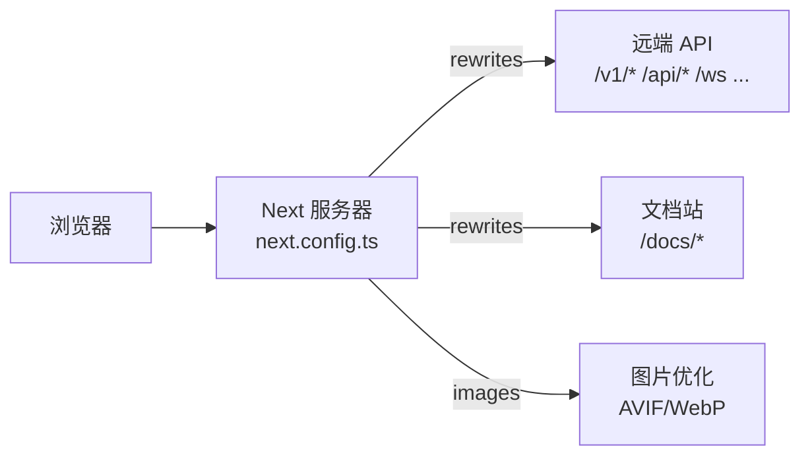

# Web 应用架构

<cite>
**本文引用的文件**
- [apps/web/package.json](file://apps/web/package.json)
- [apps/web/next.config.ts](file://apps/web/next.config.ts)
- [apps/web/app/layout.tsx](file://apps/web/app/layout.tsx)
- [apps/web/components/web-providers.tsx](file://apps/web/components/web-providers.tsx)
- [apps/web/platform/navigation.tsx](file://apps/web/platform/navigation.tsx)
- [apps/web/platform/document-title.ts](file://apps/web/platform/document-title.ts)
- [apps/web/platform/scroll-restoration.tsx](file://apps/web/platform/scroll-restoration.tsx)
</cite>

## 目录
1. [简介](#简介)
2. [项目结构](#项目结构)
3. [核心组件](#核心组件)
4. [架构总览](#架构总览)
5. [详细组件分析](#详细组件分析)
6. [依赖分析](#依赖分析)
7. [性能考虑](#性能考虑)
8. [故障排查指南](#故障排查指南)
9. [结论](#结论)
10. [附录](#附录)

## 简介
本文件面向 Multica Web 应用的现代化前端架构，基于 Next.js 16 + React 19，采用 App Router、平台适配层与跨端共享视图层的分层设计。重点覆盖：
- App Router 路由组织与页面布局结构
- 中间件机制（Next.js rewrites/proxy）
- 平台适配层（platform/）：NavigationAdapter、DocumentTitle、ScrollRestoration 等抽象接口在 Web 端的实现
- 国际化（i18n）、主题系统、错误边界处理
- 状态管理策略：TanStack Query 负责服务端数据缓存与同步，Zustand 管理客户端/视图状态（遵循包边界约束）
- 构建配置优化、性能优化、SEO 与 PWA 支持
- 组件开发规范与最佳实践示例路径

## 项目结构
Web 应用位于 apps/web，采用 Next.js App Router 的目录式路由组织；平台相关能力集中在 platform/ 目录，通过 @multica/views 暴露的抽象接口进行解耦；根布局 app/layout.tsx 统一注入主题、i18n、运行时 URL、字体与 SEO 元信息；web-providers 作为客户端 Provider 树，组合 CoreProvider、导航、滚动恢复等能力。

图表来源
- [apps/web/app/layout.tsx:1-172](file://apps/web/app/layout.tsx#L1-L172)
- [apps/web/components/web-providers.tsx:1-98](file://apps/web/components/web-providers.tsx#L1-L98)
- [apps/web/platform/navigation.tsx:1-111](file://apps/web/platform/navigation.tsx#L1-L111)
- [apps/web/platform/scroll-restoration.tsx:1-123](file://apps/web/platform/scroll-restoration.tsx#L1-L123)
- [apps/web/platform/document-title.ts:1-61](file://apps/web/platform/document-title.ts#L1-L61)
- [apps/web/next.config.ts:1-107](file://apps/web/next.config.ts#L1-L107)

章节来源
- [apps/web/package.json:1-48](file://apps/web/package.json#L1-L48)
- [apps/web/next.config.ts:1-107](file://apps/web/next.config.ts#L1-L107)
- [apps/web/app/layout.tsx:1-172](file://apps/web/app/layout.tsx#L1-L172)

## 核心组件
- 根布局与全局上下文
  - 提供字体变量、主题、i18n 资源、运行时 API/Ws 地址、SEO 元信息与 PWA 相关设置
  - 通过 WebProviders 注入 CoreProvider、导航与滚动恢复等能力
- 平台适配层
  - NavigationAdapter：将 Next.js router 封装为跨端一致的导航接口，并处理内部链接事件与哈希同步
  - DocumentTitle：统一的标题模板与截断策略，保证静态与动态标题一致
  - ScrollRestoration：捕获可滚动容器位置与视图状态，按 pathname::containerKey 持久化并在返回时恢复
- 客户端 Providers
  - 组装 CoreProvider（API/Ws、Cookie 认证、身份标识、i18n 适配器），并串联 WebNavigationProvider 与 WebScrollRestorationProvider

章节来源
- [apps/web/app/layout.tsx:1-172](file://apps/web/app/layout.tsx#L1-L172)
- [apps/web/components/web-providers.tsx:1-98](file://apps/web/components/web-providers.tsx#L1-L98)
- [apps/web/platform/navigation.tsx:1-111](file://apps/web/platform/navigation.tsx#L1-L111)
- [apps/web/platform/document-title.ts:1-61](file://apps/web/platform/document-title.ts#L1-L61)
- [apps/web/platform/scroll-restoration.tsx:1-123](file://apps/web/platform/scroll-restoration.tsx#L1-L123)

## 架构总览
下图展示从根布局到客户端 Provider 树的装配顺序，以及平台适配层如何桥接 Next.js 与跨端视图层。

图表来源
- [apps/web/app/layout.tsx:1-172](file://apps/web/app/layout.tsx#L1-L172)
- [apps/web/components/web-providers.tsx:1-98](file://apps/web/components/web-providers.tsx#L1-L98)
- [apps/web/platform/navigation.tsx:1-111](file://apps/web/platform/navigation.tsx#L1-L111)
- [apps/web/platform/scroll-restoration.tsx:1-123](file://apps/web/platform/scroll-restoration.tsx#L1-L123)

## 详细组件分析

### 导航适配层（NavigationAdapter）
- 职责
  - 将 Next.js useRouter/usePathname/useSearchParams 封装为跨端一致的 NavigationAdapter
  - 监听自定义事件 multica:navigate，将编辑器或内容中的链接解析为 push/openTab
  - 通过 useSyncExternalStore 订阅 hashchange/popstate，确保 adapter.hash 始终最新
  - 提供 prefetch 以预热 RSC 与路由 chunk
- 关键点
  - 使用 capture 阶段的事件监听与 window.open 兼容多标签打开场景
  - getShareableUrl 在服务端返回 path，客户端拼接 origin
  - canGoBackInApp 用于判断是否可在应用内后退

图表来源
- [apps/web/platform/navigation.tsx:1-111](file://apps/web/platform/navigation.tsx#L1-L111)

章节来源
- [apps/web/platform/navigation.tsx:1-111](file://apps/web/platform/navigation.tsx#L1-L111)

### 文档标题（DocumentTitle）
- 职责
  - 定义站点标题、后缀与模板，供 Next.js metadata.title.template 与动态页面标题统一使用
  - 提供 clipTitle 与 formatDocumentTitle，限制最大长度并按码点裁剪，避免表情符被截断
- 关键点
  - 纯函数且无 React 依赖，便于在服务端布局中直接引用
  - 统一分隔符与截断策略，避免 SEO 与书签体验不一致

图表来源
- [apps/web/platform/document-title.ts:1-61](file://apps/web/platform/document-title.ts#L1-L61)

章节来源
- [apps/web/platform/document-title.ts:1-61](file://apps/web/platform/document-title.ts#L1-L61)

### 滚动恢复（ScrollRestoration）
- 职责
  - 捕获所有标记为 data-tab-scroll-root 的可滚动容器的 scrollTop 与 scrollHeight
  - 以 pathname::containerKey 为键保存偏移量，并在返回或重新进入该路由时恢复
  - 提供 getViewState/setViewState 用于保存每路由的额外视图状态（如高亮锚点已命中）
- 关键点
  - 使用 capture 阶段的全局 scroll 监听，避免逐容器绑定
  - 恢复后短暂抑制写回，防止浏览器 clamp 触发的 scroll 事件覆盖刚恢复的值
  - 回到顶部时清理对应 memento，避免脏状态残留

图表来源
- [apps/web/platform/scroll-restoration.tsx:1-123](file://apps/web/platform/scroll-restoration.tsx#L1-L123)

章节来源
- [apps/web/platform/scroll-restoration.tsx:1-123](file://apps/web/platform/scroll-restoration.tsx#L1-L123)

### 根布局与全局上下文（Root Layout & Providers）
- 职责
  - 注入字体变量、主题、i18n 资源、运行时 API/Ws 地址、SEO 元信息与 PWA 相关设置
  - 通过 WebProviders 组合 CoreProvider、导航与滚动恢复
- 关键点
  - viewport 与 appleWebApp 配置支持移动端独立运行
  - Open Graph/Twitter 卡片与 robots 控制搜索引擎行为
  - 字体加载策略避免 FOUT，CJK 回退链在 CSS 中维护以保证 CSP 安全

章节来源
- [apps/web/app/layout.tsx:1-172](file://apps/web/app/layout.tsx#L1-L172)
- [apps/web/components/web-providers.tsx:1-98](file://apps/web/components/web-providers.tsx#L1-L98)

### 客户端 Providers（WebProviders）
- 职责
  - 初始化 CoreProvider：API 基础地址、WebSocket 地址、Cookie 认证模式、登录/登出回调、身份标识、i18n 适配器与用户语言同步开关
  - 串联 WebNavigationProvider 与 WebScrollRestorationProvider
- 关键点
  - 自动推导 wsUrl，使自托管/LAN 部署无需显式配置
  - 兼容旧版 localStorage token 的过渡逻辑，逐步迁移至 Cookie 模式
  - 登出时重置欢迎流程状态并清除登录态 Cookie

章节来源
- [apps/web/components/web-providers.tsx:1-98](file://apps/web/components/web-providers.tsx#L1-L98)

## 依赖分析
- 运行时依赖
  - Next.js 16、React 19、@tanstack/react-query、fumadocs-mdx、Tailwind/Shadcn 等
  - 通过 transpilePackages 将 @multica/core、@multica/ui、@multica/views 纳入编译管线
- 构建与重写
  - next.config.ts 中 rewrites 将 /v1/*、/api/*、/ws、/health、/auth/*、/uploads/* 代理到远端 API
  - /docs 前缀重写到外部文档服务
  - images 启用 AVIF/WebP 与质量档位
  - dev 环境允许 CORS 来源列表，便于 Tailscale 等远程调试

图表来源
- [apps/web/next.config.ts:1-107](file://apps/web/next.config.ts#L1-L107)

章节来源
- [apps/web/package.json:1-48](file://apps/web/package.json#L1-L48)
- [apps/web/next.config.ts:1-107](file://apps/web/next.config.ts#L1-L107)

## 性能考虑
- 构建与打包
  - 使用 --webpack 禁用 Turbopack 以兼容 fumadocs-mdx 当前版本
  - transpilePackages 减少重复编译开销
- 网络与缓存
  - rewrites 集中代理后端接口，减少跨域与证书配置复杂度
  - images 启用现代格式与压缩质量，降低首屏体积
- 导航预取
  - 通过 adapter.prefetch 预热路由与 RSC 负载，提升跳转速度
- 滚动恢复
  - 捕获与恢复策略避免列表/虚拟滚动容器回到顶部，提升交互连续性
- 字体与样式
  - next/font 合成 fallback 避免 FOUT；CJK 回退链在 CSS 中维护，保持 CSP 安全与桌面端一致性

[本节为通用性能建议，不直接分析具体代码文件]

## 故障排查指南
- 导航异常
  - 检查是否正确包裹 WebNavigationProvider，并确保 contenteditable 中的链接点击触发 multica:navigate 事件
  - 确认 hash 变化未被拦截，useSyncExternalStore 能正确订阅 hashchange/popstate
- 滚动恢复失效
  - 确认容器设置了 data-tab-scroll-root 属性
  - 若恢复后立即被覆盖，检查是否存在短时间内多次写入 scrollTop 的逻辑
- 标题显示异常
  - 检查页面是否通过 layout 的 metadata.title.template 渲染，或动态页面是否调用 formatDocumentTitle
  - 超长标题会被裁剪，注意关键信息应前置
- 代理与鉴权
  - 验证 next.config.ts 的 rewrites 目标地址是否正确，生产环境需确保进程环境变量可用
  - 检查 /auth/*、/ws 等路径是否被正确转发到后端

章节来源
- [apps/web/platform/navigation.tsx:1-111](file://apps/web/platform/navigation.tsx#L1-L111)
- [apps/web/platform/scroll-restoration.tsx:1-123](file://apps/web/platform/scroll-restoration.tsx#L1-L123)
- [apps/web/platform/document-title.ts:1-61](file://apps/web/platform/document-title.ts#L1-L61)
- [apps/web/next.config.ts:1-107](file://apps/web/next.config.ts#L1-L107)

## 结论
Multica Web 应用通过 Next.js App Router 与平台适配层实现了跨端一致的导航、标题与滚动恢复能力；根布局统一治理 i18n、主题、SEO 与 PWA；结合 TanStack Query 与 Zustand 的分层状态管理，满足复杂业务场景下的数据缓存与视图状态需求。构建与重写配置兼顾开发与生产环境的灵活性，同时通过现代图片格式与路由预取等手段优化性能。

[本节为总结性内容，不直接分析具体代码文件]

## 附录

### 国际化（i18n）方案
- 根布局根据请求 locale 注入 RESOURCES，并通过 createBrowserCookieLocaleAdapter 实现 Cookie 驱动的 locale 切换
- 通过 CoreProvider 将 locale 与 resources 下发到视图层，配合 views 的 i18n 工具完成文案渲染

章节来源
- [apps/web/app/layout.tsx:1-172](file://apps/web/app/layout.tsx#L1-L172)
- [apps/web/components/web-providers.tsx:1-98](file://apps/web/components/web-providers.tsx#L1-L98)

### 主题系统
- 通过 ThemeProvider 包裹应用，结合 Tailwind 与 Shadcn 组件库实现明暗主题切换
- 字体变量由 next/font 注入 CSS 变量，便于全局复用

章节来源
- [apps/web/app/layout.tsx:1-172](file://apps/web/app/layout.tsx#L1-L172)

### 错误边界处理
- 根级错误页面与全局错误页用于捕获未处理异常，保障用户体验与可观测性
- 建议在业务模块中补充细粒度错误边界，隔离失败区域

[本节为通用指导，不直接分析具体代码文件]

### 状态管理策略
- 服务端状态：使用 TanStack Query 进行数据获取、缓存与同步
- 客户端/视图状态：使用 Zustand 管理 UI 状态，共享 store 仅位于 packages/core
- 遵循包边界约束：packages/core 禁止引入 react-dom/localStorage/process.env；packages/ui 不得 import @multica/core 且不含业务逻辑；packages/views 禁止 next/* 与 react-router-dom，走 NavigationAdapter

[本节为通用指导，不直接分析具体代码文件]

### 构建配置优化与 SEO/PWA
- 构建优化：transpilePackages、images 格式与质量、rewrites 集中代理
- SEO：metadata.title/template、Open Graph、Twitter Card、robots 控制
- PWA：viewport.themeColor、appleWebApp.capable、manifest 图标与 display 模式

章节来源
- [apps/web/next.config.ts:1-107](file://apps/web/next.config.ts#L1-L107)
- [apps/web/app/layout.tsx:1-172](file://apps/web/app/layout.tsx#L1-L172)

### 组件开发规范与最佳实践（示例路径）
- 导航使用：通过 @multica/views/navigation 提供的 NavigationProvider/adapter，避免直接依赖 Next.js router
  - 参考：[apps/web/platform/navigation.tsx:1-111](file://apps/web/platform/navigation.tsx#L1-L111)
- 标题使用：统一通过 document-title 的工具函数格式化页面标题
  - 参考：[apps/web/platform/document-title.ts:1-61](file://apps/web/platform/document-title.ts#L1-L61)
- 滚动恢复：为可滚动容器添加 data-tab-scroll-root，并使用 views 提供的 useRestoredScrollOffset/useRestoredScrollRef
  - 参考：[apps/web/platform/scroll-restoration.tsx:1-123](file://apps/web/platform/scroll-restoration.tsx#L1-L123)
- 全局上下文：在根布局与 WebProviders 中注入 i18n、主题、API/Ws 地址与认证模式
  - 参考：[apps/web/app/layout.tsx:1-172](file://apps/web/app/layout.tsx#L1-L172)、[apps/web/components/web-providers.tsx:1-98](file://apps/web/components/web-providers.tsx#L1-L98)