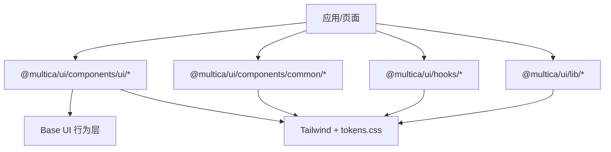
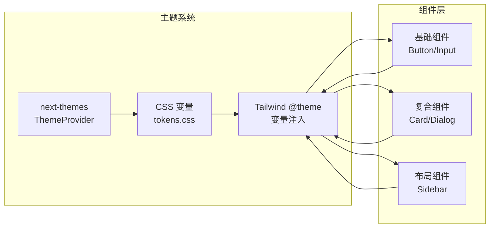
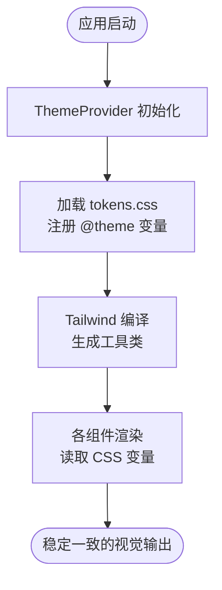
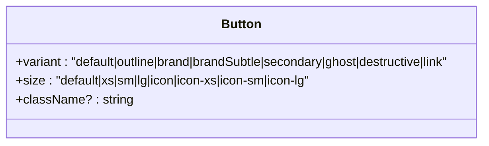
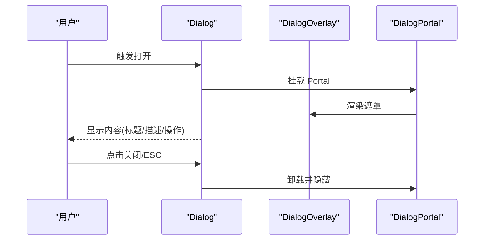
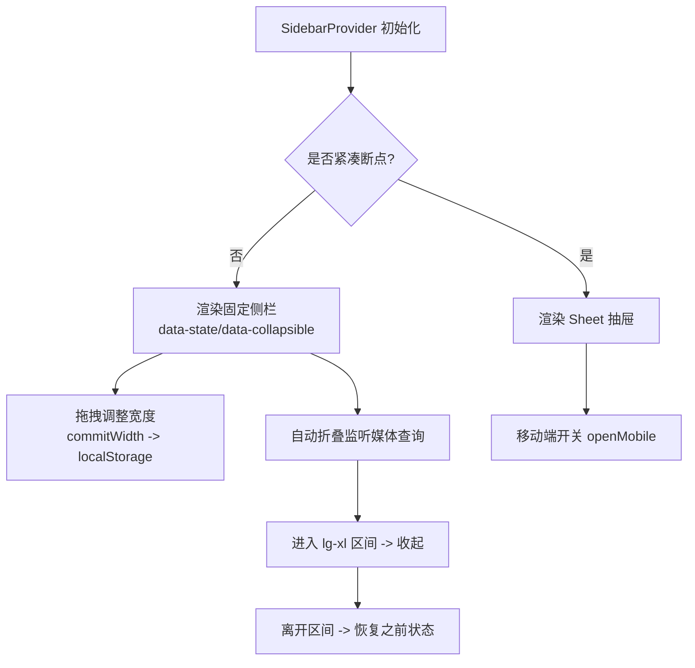
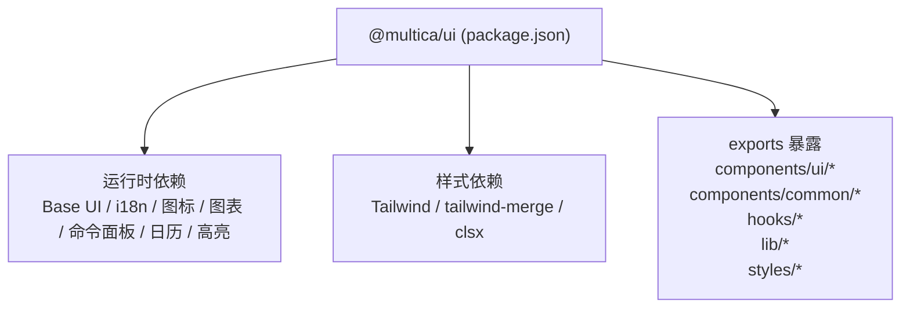

# UI 组件库 (@multica/ui)

<cite>
**本文引用的文件**
- [packages/ui/package.json](file://packages/ui/package.json)
- [packages/ui/components.json](file://packages/ui/components.json)
- [packages/ui/styles/tokens.css](file://packages/ui/styles/tokens.css)
- [packages/ui/styles/base.css](file://packages/ui/styles/base.css)
- [packages/ui/lib/utils.ts](file://packages/ui/lib/utils.ts)
- [packages/ui/components/common/theme-provider.tsx](file://packages/ui/components/common/theme-provider.tsx)
- [packages/ui/components/ui/button.tsx](file://packages/ui/components/ui/button.tsx)
- [packages/ui/components/ui/input.tsx](file://packages/ui/components/ui/input.tsx)
- [packages/ui/components/ui/card.tsx](file://packages/ui/components/ui/card.tsx)
- [packages/ui/components/ui/dialog.tsx](file://packages/ui/components/ui/dialog.tsx)
- [packages/ui/components/ui/sidebar.tsx](file://packages/ui/components/ui/sidebar.tsx)
- [packages/ui/components/common/error-boundary.tsx](file://packages/ui/components/common/error-boundary.tsx)
</cite>

## 目录
1. [简介](#简介)
2. [项目结构](#项目结构)
3. [核心组件](#核心组件)
4. [架构总览](#架构总览)
5. [详细组件分析](#详细组件分析)
6. [依赖关系分析](#依赖关系分析)
7. [性能考量](#性能考量)
8. [故障排查指南](#故障排查指南)
9. [结论](#结论)
10. [附录](#附录)

## 简介
@multica/ui 是 Multica 的前端 UI 组件库，遵循“无业务逻辑、纯展示组件、高度可定制”的设计原则。它基于 Base UI 提供无障碍与行为能力，使用 Tailwind CSS 与自定义设计令牌实现主题化与品牌定制；通过统一的样式策略（tokens + base + 工具类）确保跨 Web/Desktop/Mobile 的一致性体验。组件按基础组件、复合组件、布局组件分层组织，并提供主题切换、响应式适配、动画与可访问性支持。

## 项目结构
- 包入口与导出：通过 package.json 的 exports 字段暴露 components/ui/*、components/common/*、markdown/*、hooks/*、lib/*、styles/* 等路径，便于应用按需引入。
- 配置：components.json 声明 shadcn 风格、Tailwind 变量来源、图标库与别名，统一生成与引用约定。
- 样式体系：
  - tokens.css：集中定义设计令牌（颜色、字号、圆角、阴影、品牌色、图表色阶等），并映射到 Tailwind 的 @theme。
  - base.css：全局基础样式、动画、滚动条、移动端输入字体大小、侧边栏交互光标、查找高亮等。
- 公共能力：
  - lib/utils.ts：封装 cn()，扩展 tailwind-merge 以识别自定义字号步骤，避免冲突合并错误。
  - hooks/use-mobile.ts：用于判断紧凑断点（被 sidebar 等组件使用）。
- 组件分层：
  - 基础组件：Button、Input、Card、Dialog、Sidebar 等原子/半原子能力。
  - 复合组件：由基础组件组合而成的业务无关容器（如 CardHeader/CardContent 等）。
  - 布局组件：Sidebar 及其子部件，负责页面骨架与导航区域。

图示来源
- [packages/ui/package.json:10-28](file://packages/ui/package.json#L10-L28)
- [packages/ui/components.json:6-19](file://packages/ui/components.json#L6-L19)
- [packages/ui/styles/tokens.css:3-61](file://packages/ui/styles/tokens.css#L3-L61)

章节来源
- [packages/ui/package.json:1-74](file://packages/ui/package.json#L1-L74)
- [packages/ui/components.json:1-30](file://packages/ui/components.json#L1-L30)

## 核心组件
- Button：基于 Base UI 按钮，使用 class-variance-authority 管理 variant/size 变体，结合 Tailwind 类名与 tokens 实现多态外观与可访问性焦点环。
- Input：基于 Base UI 输入，统一尺寸、边框、禁用态、无效态与深色模式样式。
- Card：卡片复合组件，包含 Header/Title/Description/Content/Footer/Action，通过 data-slot 与 group 选择器控制间距与圆角。
- Dialog：对话框组合，含 Overlay/Portal/Popup/Header/Footer/Title/Description，内置关闭按钮与入场动画。
- Sidebar：复杂布局组件，提供 Provider/Context、宽度拖拽、自动折叠、移动端抽屉、轨道调整、菜单项与分组等。

章节来源
- [packages/ui/components/ui/button.tsx:1-82](file://packages/ui/components/ui/button.tsx#L1-L82)
- [packages/ui/components/ui/input.tsx:1-21](file://packages/ui/components/ui/input.tsx#L1-L21)
- [packages/ui/components/ui/card.tsx:1-104](file://packages/ui/components/ui/card.tsx#L1-L104)
- [packages/ui/components/ui/dialog.tsx:1-161](file://packages/ui/components/ui/dialog.tsx#L1-L161)
- [packages/ui/components/ui/sidebar.tsx:1-800](file://packages/ui/components/ui/sidebar.tsx#L1-L800)

## 架构总览
组件库采用“行为-样式-主题”三层解耦：
- 行为层：Base UI 提供可访问性与状态机（如 Dialog、Button、Input）。
- 样式层：Tailwind 原子类 + tokens.css 中的 @theme 变量，统一视觉语言。
- 主题层：next-themes 驱动 class 切换，dark/light 两套 token 值，品牌色与语义色贯穿全量组件。

图示来源
- [packages/ui/components/common/theme-provider.tsx:1-24](file://packages/ui/components/common/theme-provider.tsx#L1-L24)
- [packages/ui/styles/tokens.css:3-61](file://packages/ui/styles/tokens.css#L3-L61)
- [packages/ui/styles/tokens.css:120-222](file://packages/ui/styles/tokens.css#L120-L222)
- [packages/ui/styles/tokens.css:224-290](file://packages/ui/styles/tokens.css#L224-L290)

## 详细组件分析

### 主题系统与样式策略
- 主题切换：ThemeProvider 包裹应用根节点，启用 next-themes，默认跟随系统，切换时禁用过渡以避免闪烁；同时包裹 TooltipProvider 设置延迟。
- 设计令牌：tokens.css 中通过 @theme inline 将 CSS 变量映射为 Tailwind 可用的 design tokens（颜色、字号、圆角、阴影等），并在 :root 与 .dark 下分别定义明暗主题值。
- 基础样式：base.css 提供全局基础样式、动画、滚动条、移动端输入缩放保护、侧边栏拖拽光标、查找高亮等。
- 字号系统：tokens.css 定义了角色化的字号步骤（micro/caption/label/body/title/display 等），并在 utils.ts 中扩展 tailwind-merge 的 font-size 组，避免与颜色类冲突导致覆盖丢失。

图示来源
- [packages/ui/components/common/theme-provider.tsx:1-24](file://packages/ui/components/common/theme-provider.tsx#L1-L24)
- [packages/ui/styles/tokens.css:3-61](file://packages/ui/styles/tokens.css#L3-L61)
- [packages/ui/styles/tokens.css:87-118](file://packages/ui/styles/tokens.css#L87-L118)
- [packages/ui/styles/base.css:319-367](file://packages/ui/styles/base.css#L319-L367)
- [packages/ui/lib/utils.ts:17-38](file://packages/ui/lib/utils.ts#L17-L38)

章节来源
- [packages/ui/components/common/theme-provider.tsx:1-24](file://packages/ui/components/common/theme-provider.tsx#L1-L24)
- [packages/ui/styles/tokens.css:1-290](file://packages/ui/styles/tokens.css#L1-L290)
- [packages/ui/styles/base.css:1-382](file://packages/ui/styles/base.css#L1-L382)
- [packages/ui/lib/utils.ts:1-43](file://packages/ui/lib/utils.ts#L1-L43)

### 基础组件：Button
- 设计要点：
  - 使用 cva 管理 variant（default/outline/brand/brandSubtle/secondary/ghost/destructive/link）与 size（default/xs/sm/lg/icon/icon-xs/icon-sm/icon-lg）。
  - 通过 data-slot 与 group 选择器增强组合样式（如按钮组内圆角、图标尺寸）。
  - 可访问性：focus-visible 环、aria-invalid 状态、禁用态、键盘操作。
- 主题集成：所有颜色来自 tokens，无需 dark: 前缀重复处理，品牌色在明暗主题下自动翻转。

图示来源
- [packages/ui/components/ui/button.tsx:8-64](file://packages/ui/components/ui/button.tsx#L8-L64)
- [packages/ui/components/ui/button.tsx:66-82](file://packages/ui/components/ui/button.tsx#L66-L82)

章节来源
- [packages/ui/components/ui/button.tsx:1-82](file://packages/ui/components/ui/button.tsx#L1-L82)

### 基础组件：Input
- 设计要点：统一高度、边框、占位符、禁用态、无效态与深色背景；聚焦时显示 ring。
- 主题集成：使用 tokens 的颜色与边框变量，保证明暗一致。

章节来源
- [packages/ui/components/ui/input.tsx:1-21](file://packages/ui/components/ui/input.tsx#L1-L21)

### 复合组件：Card
- 组成：Card、CardHeader、CardTitle、CardDescription、CardContent、CardFooter、CardAction。
- 设计要点：通过 data-size 控制紧凑/默认间距；图片首尾圆角；footer 带分隔与悬浮背景；标题与描述字号层级清晰。

章节来源
- [packages/ui/components/ui/card.tsx:1-104](file://packages/ui/components/ui/card.tsx#L1-L104)

### 复合组件：Dialog
- 组成：Dialog、DialogTrigger、DialogPortal、DialogClose、DialogOverlay、DialogContent、DialogHeader、DialogFooter、DialogTitle、DialogDescription。
- 行为：弹出层定位、遮罩、入场/出场动画、右上角关闭按钮、底部操作区。
- 可访问性：使用 Base UI 的 Dialog 原语，确保键盘与屏幕阅读器友好。

图示来源
- [packages/ui/components/ui/dialog.tsx:10-81](file://packages/ui/components/ui/dialog.tsx#L10-L81)
- [packages/ui/components/ui/dialog.tsx:83-161](file://packages/ui/components/ui/dialog.tsx#L83-L161)

章节来源
- [packages/ui/components/ui/dialog.tsx:1-161](file://packages/ui/components/ui/dialog.tsx#L1-L161)

### 布局组件：Sidebar
- 能力：
  - 响应式：紧凑断点使用 Sheet 作为抽屉；宽屏使用固定侧栏。
  - 状态：展开/折叠、移动端 open、外部触发器标记。
  - 宽度：可拖拽调整，限制最小/最大宽度，持久化到 localStorage。
  - 自动折叠：在特定视口区间自动收起，离开区间恢复。
  - 菜单：分组、标签、动作、菜单项、菜单按钮（支持激活态、提示）。
- 交互细节：拖拽期间直接写入 DOM 属性避免重排抖动；鼠标/指针事件清理；右侧面板过渡动画。

图示来源
- [packages/ui/components/ui/sidebar.tsx:118-285](file://packages/ui/components/ui/sidebar.tsx#L118-L285)
- [packages/ui/components/ui/sidebar.tsx:287-392](file://packages/ui/components/ui/sidebar.tsx#L287-L392)
- [packages/ui/components/ui/sidebar.tsx:421-569](file://packages/ui/components/ui/sidebar.tsx#L421-L569)
- [packages/ui/components/ui/sidebar.tsx:571-800](file://packages/ui/components/ui/sidebar.tsx#L571-L800)

章节来源
- [packages/ui/components/ui/sidebar.tsx:1-800](file://packages/ui/components/ui/sidebar.tsx#L1-L800)

### 错误边界：ErrorBoundary
- 作用：捕获子树渲染期错误，避免整页崩溃；提供默认回退 UI 与自定义 fallback。
- 特性：支持 resetKeys 自动重置（例如路由参数变化后重试）；onError 回调用于遥测/日志。
- 可访问性：回退区域使用 alert role，提供“重试”按钮。

章节来源
- [packages/ui/components/common/error-boundary.tsx:1-102](file://packages/ui/components/common/error-boundary.tsx#L1-L102)

## 依赖关系分析
- 运行时依赖：Base UI（行为）、react-i18next（国际化）、lucide-react（图标）、sonner（通知）、recharts（图表）、cmdk（命令面板）、react-day-picker（日历）、shiki（代码高亮）等。
- 样式依赖：Tailwind CSS（通过 @theme 与工具类）、tailwind-merge（类名合并）、clsx（条件类）。
- 包导出：通过 package.json 的 exports 精确暴露子路径，避免意外引入未发布模块。

图示来源
- [packages/ui/package.json:29-58](file://packages/ui/package.json#L29-L58)
- [packages/ui/package.json:10-28](file://packages/ui/package.json#L10-L28)

章节来源
- [packages/ui/package.json:1-74](file://packages/ui/package.json#L1-L74)

## 性能考量
- 主题切换：ThemeProvider 启用 disableTransitionOnChange，避免切换时的闪烁与重绘。
- 拖拽优化：Sidebar 拖拽期间直接修改 DOM 样式与属性，减少 React 重渲染；仅在提交时写入 localStorage。
- 类名合并：通过 extendTailwindMerge 注册自定义字号步骤，避免误判为颜色类导致的覆盖丢失。
- 动画与过渡：合理使用 animate-in/out、motion-reduce 媒体查询，尊重用户减少动效偏好。
- 滚动条与输入：全局滚动条美化与移动端输入字体大小保护，避免 iOS Safari 放大。

[本节为通用指导，不直接分析具体文件]

## 故障排查指南
- 主题不生效：确认应用根节点已包裹 ThemeProvider，且 HTML 根元素允许 class 切换；检查 tokens.css 是否正确引入。
- 字号或颜色异常：检查 cn() 合并顺序与 tailwind-merge 扩展是否同步于 tokens.css 的字号步骤。
- 侧边栏无法拖拽：确认存在 sidebar-wrapper/sidebar-gap/sidebar-container 数据槽；检查 pointer 事件与 data-sidebar-resizing 标志。
- 对话框不可用：确认使用了正确的子组件组合（Trigger/Portal/Overlay/Content），并确保焦点与 ESC 关闭行为正常。
- 错误边界未捕获：确认 ErrorBoundary 包裹了可能出错的子树，必要时传入 resetKeys 以在资源切换时自动恢复。

章节来源
- [packages/ui/components/common/theme-provider.tsx:1-24](file://packages/ui/components/common/theme-provider.tsx#L1-L24)
- [packages/ui/lib/utils.ts:17-38](file://packages/ui/lib/utils.ts#L17-L38)
- [packages/ui/components/ui/sidebar.tsx:421-569](file://packages/ui/components/ui/sidebar.tsx#L421-L569)
- [packages/ui/components/ui/dialog.tsx:10-81](file://packages/ui/components/ui/dialog.tsx#L10-L81)
- [packages/ui/components/common/error-boundary.tsx:28-79](file://packages/ui/components/common/error-boundary.tsx#L28-L79)

## 结论
@multica/ui 以“无业务逻辑、纯展示、高度可定制”为核心原则，借助 Base UI 的行为能力与 Tailwind 的灵活样式体系，构建了稳定、可维护、可主题的 UI 组件库。通过 tokens 驱动的视觉系统、清晰的组件分层与完善的可访问性支持，能够在 Web/Desktop/Mobile 多端保持一致体验，并为品牌定制与二次扩展提供坚实基础。

## 附录

### 组件 API 速览（Props、事件、插槽）
- Button
  - Props：variant、size、className、以及 Base UI 透传属性
  - 事件：onClick、onKeyDown 等（由 Base UI 透传）
  - 插槽：无（可通过 className 与 children 定制）
- Input
  - Props：type、value、onChange、placeholder、disabled、className 等
  - 事件：onChange、onFocus、onBlur 等
  - 插槽：无
- Card
  - 子组件：Header、Title、Description、Content、Footer、Action
  - Props：size（default/sm）、children、className
  - 插槽：通过子组件组合
- Dialog
  - 子组件：Trigger、Portal、Overlay、Content、Header、Footer、Title、Description、Close
  - Props：open、onOpenChange、showCloseButton 等
  - 插槽：Content 内自由放置
- Sidebar
  - 子组件：Provider、Sidebar、Trigger、Rail、Inset、Header、Footer、Content、Group、Menu、MenuItem、MenuButton、Separator、Input
  - 关键状态：open、isCompact、state、openMobile
  - 事件：onOpenChange、toggleSidebar、拖拽 commitWidth
  - 插槽：各子组件均接受 children 与 className

章节来源
- [packages/ui/components/ui/button.tsx:66-82](file://packages/ui/components/ui/button.tsx#L66-L82)
- [packages/ui/components/ui/input.tsx:6-20](file://packages/ui/components/ui/input.tsx#L6-L20)
- [packages/ui/components/ui/card.tsx:5-104](file://packages/ui/components/ui/card.tsx#L5-L104)
- [packages/ui/components/ui/dialog.tsx:10-161](file://packages/ui/components/ui/dialog.tsx#L10-L161)
- [packages/ui/components/ui/sidebar.tsx:118-800](file://packages/ui/components/ui/sidebar.tsx#L118-L800)

### 自定义主题指南
- 品牌定制：在 tokens.css 的 :root 与 .dark 块中覆盖 --brand、--brand-foreground 及相关语义色，即可全局生效。
- 字号与圆角：通过 @theme 下的 --text-* 与 --radius-* 调整；确保 lib/utils.ts 的 tailwind-merge 扩展与之同步。
- 主题切换：在应用根包裹 ThemeProvider，并通过 next-themes 提供的 useTheme 进行切换。
- 注意事项：避免在组件内硬编码颜色，优先使用 tokens；保持明暗对比度符合 WCAG AA。

章节来源
- [packages/ui/styles/tokens.css:120-222](file://packages/ui/styles/tokens.css#L120-L222)
- [packages/ui/styles/tokens.css:224-290](file://packages/ui/styles/tokens.css#L224-L290)
- [packages/ui/components/common/theme-provider.tsx:1-24](file://packages/ui/components/common/theme-provider.tsx#L1-L24)
- [packages/ui/lib/utils.ts:17-38](file://packages/ui/lib/utils.ts#L17-L38)

### 扩展开发最佳实践
- 新增基础组件：复用 Base UI 原语，使用 cva 管理变体，通过 data-slot 标注以便组合样式。
- 新增复合组件：以 data-slot 与 group 命名组织样式，尽量无状态、无业务逻辑。
- 主题扩展：在 tokens.css 中新增变量并映射到 @theme；如需新字号，同步更新 utils.ts 的 font-size 扩展。
- 可访问性：确保焦点可见、键盘可达、ARIA 语义正确；使用 Base UI 的能力减少遗漏。
- 测试建议：对交互组件（Dialog/Sidebar）进行键盘与屏幕阅读器测试；对主题切换进行明暗双主题验证。

[本节为通用指导，不直接分析具体文件]