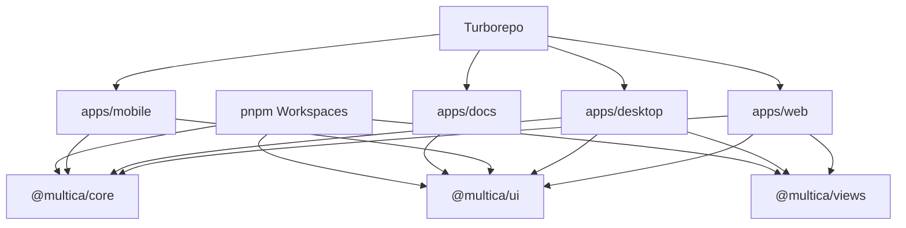
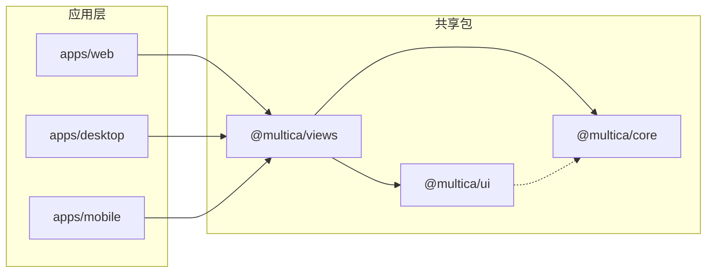
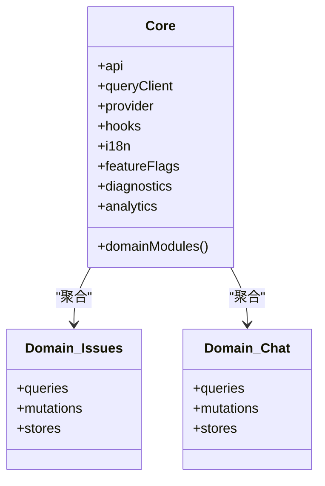
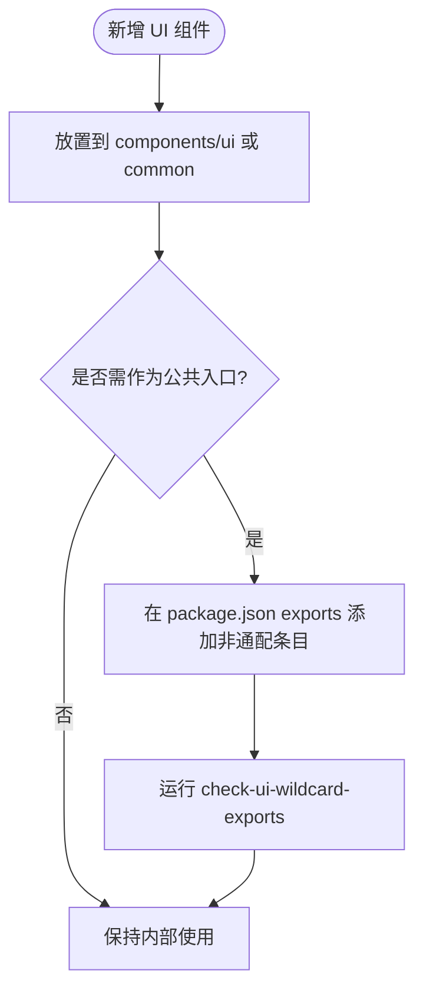
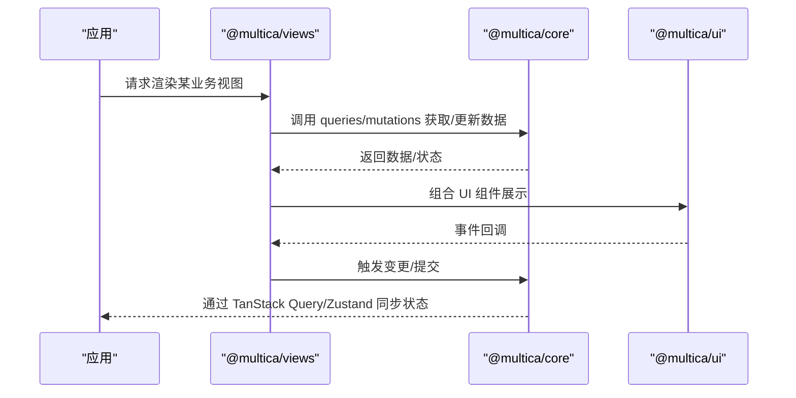
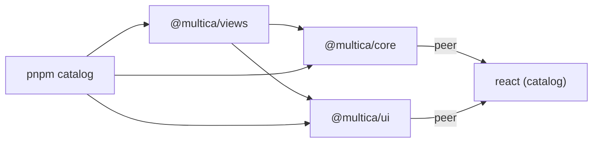

# 共享包架构

<cite>
**本文引用的文件**
- [package.json](file://package.json)
- [pnpm-workspace.yaml](file://pnpm-workspace.yaml)
- [turbo.json](file://turbo.json)
- [packages/core/package.json](file://packages/core/package.json)
- [packages/ui/package.json](file://packages/ui/package.json)
- [packages/views/package.json](file://packages/views/package.json)
- [packages/core/tsconfig.json](file://packages/core/tsconfig.json)
- [packages/ui/tsconfig.json](file://packages/ui/tsconfig.json)
- [packages/views/tsconfig.json](file://packages/views/tsconfig.json)
- [scripts/check-ui-wildcard-exports.mjs](file://scripts/check-ui-wildcard-exports.mjs)
</cite>

## 目录
1. [简介](#简介)
2. [项目结构](#项目结构)
3. [核心组件](#核心组件)
4. [架构总览](#架构总览)
5. [详细组件分析](#详细组件分析)
6. [依赖关系分析](#依赖关系分析)
7. [性能考量](#性能考量)
8. [故障排查指南](#故障排查指南)
9. [结论](#结论)
10. [附录](#附录)

## 简介
本文件面向 Multica Monorepo 的共享包架构，聚焦 packages/core、packages/ui、packages/views 三者的职责边界、约束与协作方式。核心目标：
- 明确包边界约束：core 禁用 react-dom/localStorage/process.env；ui 不得 import @multica/core 且无业务逻辑；views 禁用 next/* 与 react-router-dom，走 NavigationAdapter。
- 说明职责划分：core 提供 API 客户端与业务逻辑；ui 专注可复用 UI 组件；views 封装业务视图组件。
- 解释依赖管理：pnpm workspaces、版本控制策略、包间通信协议。
- 描述类型定义共享、常量管理、工具函数组织。
- 给出发布流程、版本兼容性与向后兼容策略。
- 提供开发规范与最佳实践示例。

## 项目结构
Monorepo 使用 pnpm workspaces + Turborepo 组织多应用与共享包：
- apps/*：桌面、Web、移动端、文档等具体应用。
- packages/*：共享包与配置（core、ui、views、eslint-config、plugin-sdk、tsconfig）。
- turbo.json：统一构建/类型检查/测试任务编排与缓存策略。
- pnpm-workspace.yaml：工作区范围与 catalog 集中管理依赖版本。

图表来源
- [pnpm-workspace.yaml:1-44](file://pnpm-workspace.yaml#L1-L44)
- [turbo.json:23-81](file://turbo.json#L23-L81)

章节来源
- [pnpm-workspace.yaml:1-44](file://pnpm-workspace.yaml#L1-L44)
- [turbo.json:1-84](file://turbo.json#L1-L84)
- [package.json:1-65](file://package.json#L1-L65)

## 核心组件
- @multica/core
  - 职责：API 客户端、WebSocket 客户端、领域模型、状态存储（Zustand）、查询与变更（TanStack Query）、特性开关、国际化、诊断与分析、平台适配等。
  - 暴露面：通过 package.json exports 精确导出子路径，避免隐式依赖。
  - 运行时限制：禁止引入 react-dom、localStorage、process.env（由团队规则与静态检查保障）。
- @multica/ui
  - 职责：纯 UI 组件库（基于 shadcn/base-ui），样式与主题、Markdown 渲染、通用交互控件。
  - 暴露面：以 wildcard exports 暴露 components/ui、components/common、markdown、hooks 等目录。
  - 约束：不依赖 @multica/core，不包含业务逻辑。
- @multica/views
  - 职责：按业务域组织的视图组件与页面组合（如 issues、chat、agents、billing 等），负责路由装配、导航与业务上下文组装。
  - 依赖：依赖 @multica/core 与 @multica/ui，但不直接依赖 Next.js 或 react-router-dom，通过 NavigationAdapter 抽象导航。

章节来源
- [packages/core/package.json:11-163](file://packages/core/package.json#L11-L163)
- [packages/ui/package.json:10-28](file://packages/ui/package.json#L10-L28)
- [packages/views/package.json:11-58](file://packages/views/package.json#L11-L58)

## 架构总览
三层共享包遵循“能力下沉、视图聚合”的原则：
- core 提供稳定契约（类型、API、状态、查询、变更、实时通信）。
- ui 提供无业务语义的原子/复合组件。
- views 将 core 的能力与 ui 的组件组合为业务视图，并通过 NavigationAdapter 解耦路由实现。

图表来源
- [packages/views/package.json:59-68](file://packages/views/package.json#L59-L68)
- [packages/ui/package.json:29-64](file://packages/ui/package.json#L29-L64)
- [packages/core/package.json:164-176](file://packages/core/package.json#L164-L176)

## 详细组件分析

### @multica/core：能力中心
- 关键模块
  - api：HTTP/WS 客户端与 schema 校验。
  - query-client：TanStack Query 客户端配置。
  - provider/hooks：React 上下文与自定义 Hook。
  - 领域模块：issues、chat、agents、workspace、billing、dashboard、plugins、skills 等，均提供 queries/mutations/stores。
  - i18n、feature-flags、diagnostics、analytics、platform 等横切能力。
- 类型与导出
  - 通过 exports 精确暴露子路径，便于按需引用与 tree-shaking。
- 运行时约束
  - 禁止 react-dom、localStorage、process.env（由工程规范与静态检查保障）。
- 状态分层
  - 服务端状态：TanStack Query 独占。
  - 客户端/视图状态：Zustand store 仅位于 core，避免在 ui/views 中重复镜像数据。

图表来源
- [packages/core/package.json:11-163](file://packages/core/package.json#L11-L163)

章节来源
- [packages/core/package.json:11-163](file://packages/core/package.json#L11-L163)
- [packages/core/tsconfig.json:1-10](file://packages/core/tsconfig.json#L1-L10)

### @multica/ui：UI 原子库
- 关键模块
  - components/ui：基础控件（按钮、表单、弹窗、表格等）。
  - components/common：通用业务无关组件（头像、上传、错误边界等）。
  - markdown：Markdown 渲染与扩展。
  - hooks/lib：跨组件复用的工具与 Hook。
- 暴露策略
  - 使用 wildcard exports 暴露目录级入口，便于按需导入。
- 约束
  - 不依赖 @multica/core，不包含业务逻辑。
  - 依赖 React、Tailwind、shadcn/base-ui 等 UI 基础设施。

图表来源
- [packages/ui/package.json:10-28](file://packages/ui/package.json#L10-L28)
- [scripts/check-ui-wildcard-exports.mjs:116-159](file://scripts/check-ui-wildcard-exports.mjs#L116-L159)

章节来源
- [packages/ui/package.json:10-28](file://packages/ui/package.json#L10-L28)
- [packages/ui/tsconfig.json:1-17](file://packages/ui/tsconfig.json#L1-L17)
- [scripts/check-ui-wildcard-exports.mjs:1-226](file://scripts/check-ui-wildcard-exports.mjs#L1-L226)

### @multica/views：业务视图聚合层
- 关键模块
  - navigation：导航适配器与路由装配。
  - 各业务域：issues、chat、agents、billing、dashboard、workspace、onboarding 等。
  - editor、modals、layout 等跨域视图能力。
- 依赖关系
  - 依赖 @multica/core 获取数据与状态。
  - 依赖 @multica/ui 使用 UI 组件。
  - 不直接依赖 next/* 与 react-router-dom，通过 NavigationAdapter 抽象。
- 职责边界
  - 组合业务逻辑与 UI，不承载底层 API 与领域模型。

图表来源
- [packages/views/package.json:59-68](file://packages/views/package.json#L59-L68)
- [packages/core/package.json:164-176](file://packages/core/package.json#L164-L176)
- [packages/ui/package.json:29-64](file://packages/ui/package.json#L29-L64)

章节来源
- [packages/views/package.json:11-58](file://packages/views/package.json#L11-L58)
- [packages/views/package.json:59-123](file://packages/views/package.json#L59-L123)

## 依赖关系分析
- 包间依赖
  - views 依赖 core 与 ui。
  - ui 不依赖 core。
  - core 不依赖 ui 与 views。
- 版本管理
  - 根 pnpm-workspace.yaml 的 catalog 集中声明常用依赖版本，确保跨包一致。
  - 各包通过 workspace:* 引用彼此，保证本地联调与一致性。
- 构建与缓存
  - turbo.json 定义 build/typecheck/test 任务及依赖边，确保修改下游包时上游正确重算。

图表来源
- [pnpm-workspace.yaml:5-44](file://pnpm-workspace.yaml#L5-L44)
- [packages/core/package.json:164-176](file://packages/core/package.json#L164-L176)
- [packages/ui/package.json:29-64](file://packages/ui/package.json#L29-L64)
- [packages/views/package.json:59-123](file://packages/views/package.json#L59-L123)

章节来源
- [pnpm-workspace.yaml:1-44](file://pnpm-workspace.yaml#L1-L44)
- [turbo.json:23-81](file://turbo.json#L23-L81)
- [packages/core/package.json:164-176](file://packages/core/package.json#L164-L176)
- [packages/ui/package.json:29-64](file://packages/ui/package.json#L29-L64)
- [packages/views/package.json:59-123](file://packages/views/package.json#L59-L123)

## 性能考量
- 依赖去重与树摇
  - 通过 pnpm catalog 锁定版本，减少重复依赖。
  - core 与 ui 使用精确 exports，利于打包器进行 tree-shaking。
- 构建缓存
  - turbo 对 build/typecheck/test 设置输出与依赖边，避免无效重建。
- 运行时开销
  - 将状态与查询集中在 core，避免在 ui/views 重复维护数据副本，降低内存与同步成本。
- 组件粒度
  - ui 组件尽量小而专，结合 Tailwind 与 base-ui，减少运行时负担。

[本节为通用指导，无需特定文件来源]

## 故障排查指南
- 包边界违规
  - 若 ui 误引 @multica/core 或 views 引入 next/*、react-router-dom，应在 ESLint/TS 配置中添加 no-restricted-imports 规则，并在 CI 中执行类型检查与 lint。
- 未使用导出
  - 使用 scripts/check-ui-wildcard-exports.mjs 检测 packages/ui 下未被实际引用的通配导出文件，及时清理死代码。
- 构建缓存不一致
  - 当修改下游包导致上游缓存命中异常时，检查 turbo.json 的任务依赖边是否正确覆盖输入变化。
- 类型与导出
  - 新增导出应优先采用精确路径而非通配，避免被误判为入口。

章节来源
- [scripts/check-ui-wildcard-exports.mjs:1-226](file://scripts/check-ui-wildcard-exports.mjs#L1-L226)
- [turbo.json:23-81](file://turbo.json#L23-L81)

## 结论
Multica 的共享包架构通过清晰的职责分层与严格的边界约束，实现了高内聚、低耦合的可维护前端体系：
- core 提供稳定的能力契约与领域逻辑。
- ui 专注可复用 UI，避免业务耦合。
- views 聚合业务视图，通过导航适配器解耦路由实现。
配合 pnpm catalog 与 Turborepo 的统一依赖与构建管理，以及严格的导出与检查脚本，保障了大型 Monorepo 的演进效率与质量。

[本节为总结性内容，无需特定文件来源]

## 附录

### 包边界约束清单
- @multica/core
  - 禁止：react-dom、localStorage、process.env。
  - 推荐：使用 TanStack Query 管理服务端状态，Zustand 管理客户端/视图状态。
- @multica/ui
  - 禁止：import @multica/core。
  - 要求：无业务逻辑，仅包含 UI 与通用工具。
- @multica/views
  - 禁止：next/*、react-router-dom。
  - 要求：通过 NavigationAdapter 进行导航。

[本节为规范摘要，无需特定文件来源]

### 依赖管理与版本策略
- 使用 pnpm catalog 集中声明依赖版本，确保跨包一致。
- 包间通过 workspace:* 引用，本地联调与 CI 保持一致。
- 通过 turbo 任务边保证增量构建与缓存正确性。

章节来源
- [pnpm-workspace.yaml:5-44](file://pnpm-workspace.yaml#L5-L44)
- [turbo.json:23-81](file://turbo.json#L23-L81)

### 类型定义共享与工具函数组织
- 类型定义集中于 core/types 与 domain 模块，供 views 消费。
- 工具函数按领域拆分，避免全局污染。
- ui 的 lib 提供跨组件工具，如 data-table、clipboard、motion 等。

章节来源
- [packages/core/package.json:11-163](file://packages/core/package.json#L11-L163)
- [packages/ui/package.json:10-28](file://packages/ui/package.json#L10-L28)

### 包发布流程与兼容性
- 发布前检查
  - 运行 typecheck/lint/test，确保类型与测试通过。
  - 运行 check-ui-wildcard-exports 清理未使用导出。
- 版本策略
  - 采用语义化版本，core 变更需评估对 views 的影响。
  - 向后兼容：在 core 中保留旧 API 并标记废弃，逐步迁移。
- 依赖升级
  - 通过 catalog 统一升级，避免碎片化。

[本节为流程建议，无需特定文件来源]

### 开发规范与最佳实践
- 新增导出
  - 优先精确导出，避免通配；确需通配时使用脚本检查。
- 状态管理
  - 服务端状态用 TanStack Query；客户端状态用 Zustand，且共享 store 仅在 core。
- 导航
  - views 通过 NavigationAdapter 抽象，避免绑定具体路由库。
- 组件设计
  - ui 组件保持无状态与可组合，复杂交互下沉到 core 或 views。

[本节为规范建议，无需特定文件来源]