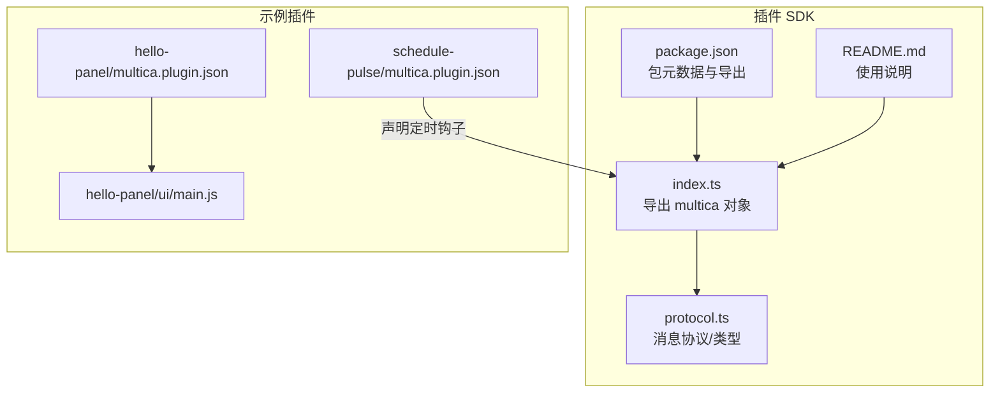
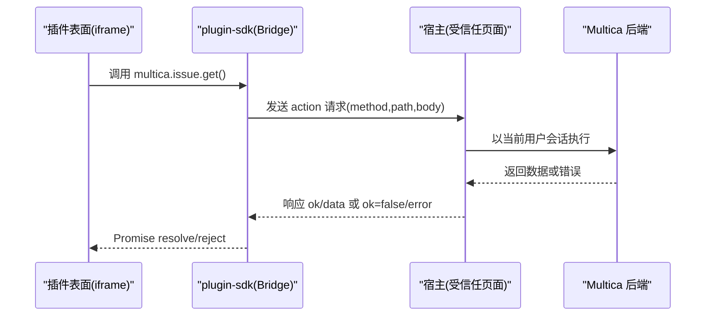
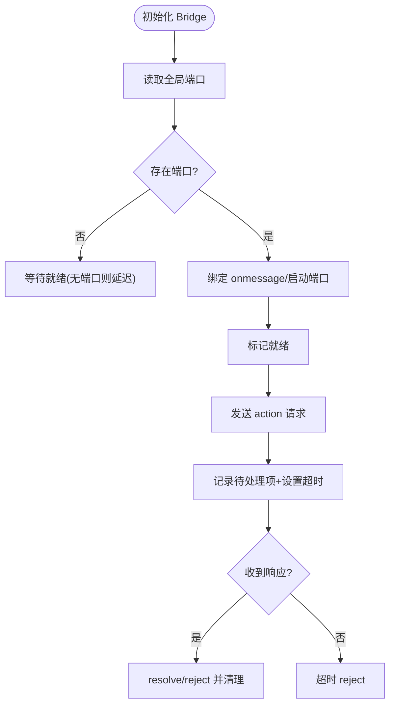
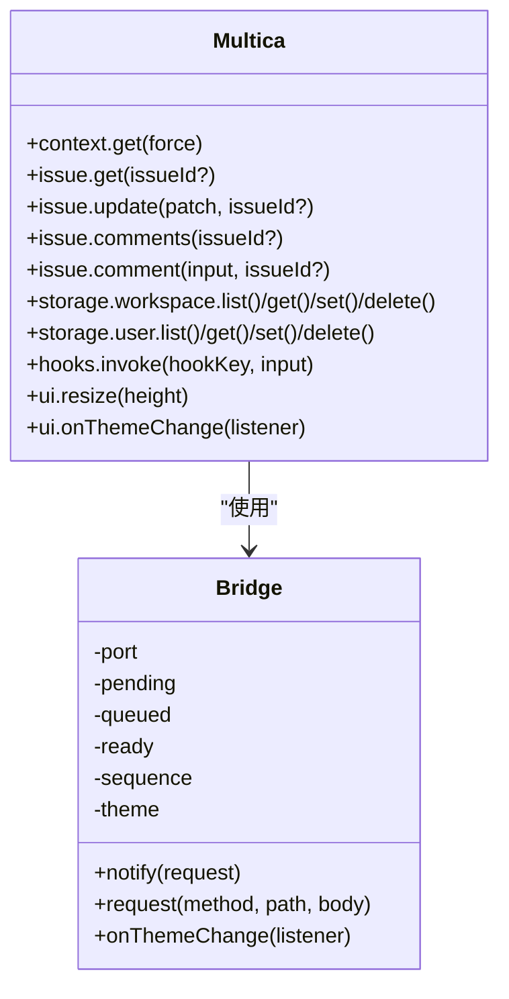
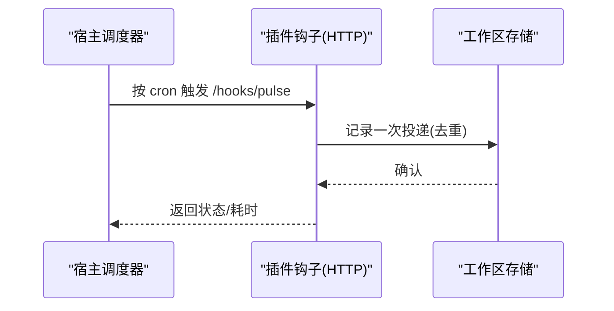
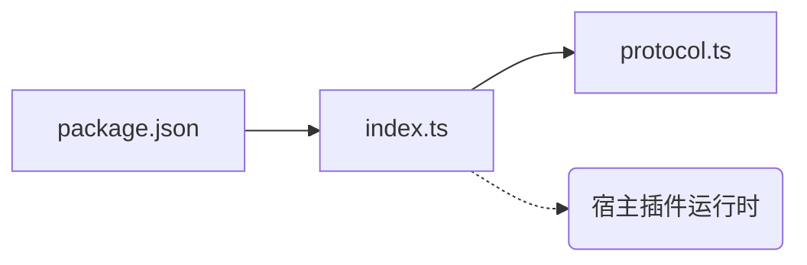

# 插件 SDK（@multica/plugin-sdk）

<cite>
**本文引用的文件**
- [packages/plugin-sdk/index.ts](file://packages/plugin-sdk/index.ts)
- [packages/plugin-sdk/protocol.ts](file://packages/plugin-sdk/protocol.ts)
- [packages/plugin-sdk/package.json](file://packages/plugin-sdk/package.json)
- [packages/plugin-sdk/README.md](file://packages/plugin-sdk/README.md)
- [examples/plugins/hello-panel/multica.plugin.json](file://examples/plugins/hello-panel/multica.plugin.json)
- [examples/plugins/hello-panel/ui/main.js](file://examples/plugins/hello-panel/ui/main.js)
- [examples/plugins/schedule-pulse/multica.plugin.json](file://examples/plugins/schedule-pulse/multica.plugin.json)
</cite>

## 目录
1. [简介](#简介)
2. [项目结构](#项目结构)
3. [核心组件](#核心组件)
4. [架构总览](#架构总览)
5. [详细组件分析](#详细组件分析)
6. [依赖关系分析](#依赖关系分析)
7. [性能与可靠性](#性能与可靠性)
8. [故障排查指南](#故障排查指南)
9. [结论](#结论)
10. [附录：开发教程、示例与发布指南](#附录开发教程示例与发布指南)

## 简介
本文件为 @multica/plugin-sdk 的权威技术文档，面向第三方开发者，目标是提供统一的插件开发接口与安全边界。SDK 通过“沙箱 iframe + 主机桥接”的方式，让插件在受限环境中运行，所有能力调用均经宿主代理执行，确保插件无法直接持有凭据或越权访问系统资源。

设计要点：
- 零运行时依赖，不引入业务包，避免供应链风险。
- 以 MessagePort 建立私有通道，身份绑定端口而非 origin。
- 所有 API 调用转为对宿主的请求，由宿主在已登录用户会话中执行并返回结果。
- 通过清单声明权限与作用域，结合网络白名单实现最小权限模型。

**章节来源**
- [packages/plugin-sdk/README.md:1-81](file://packages/plugin-sdk/README.md#L1-L81)

## 项目结构
插件 SDK 位于 packages/plugin-sdk，包含对外暴露的 SDK 入口与协议定义；示例插件位于 examples/plugins，展示清单与 UI 集成方式。

**图表来源**
- [packages/plugin-sdk/index.ts:1-282](file://packages/plugin-sdk/index.ts#L1-L282)
- [packages/plugin-sdk/protocol.ts:1-76](file://packages/plugin-sdk/protocol.ts#L1-L76)
- [packages/plugin-sdk/package.json:1-26](file://packages/plugin-sdk/package.json#L1-L26)
- [packages/plugin-sdk/README.md:1-81](file://packages/plugin-sdk/README.md#L1-L81)
- [examples/plugins/hello-panel/multica.plugin.json:1-21](file://examples/plugins/hello-panel/multica.plugin.json#L1-L21)
- [examples/plugins/hello-panel/ui/main.js:1-108](file://examples/plugins/hello-panel/ui/main.js#L1-L108)
- [examples/plugins/schedule-pulse/multica.plugin.json:1-49](file://examples/plugins/schedule-pulse/multica.plugin.json#L1-L49)

**章节来源**
- [packages/plugin-sdk/package.json:1-26](file://packages/plugin-sdk/package.json#L1-L26)
- [packages/plugin-sdk/README.md:1-81](file://packages/plugin-sdk/README.md#L1-L81)

## 核心组件
- 插件上下文与数据模型：工作区、用户、问题、评论、存储键等类型定义。
- 错误模型：统一错误类型，状态码映射 HTTP 语义。
- 通信桥：基于 MessagePort 的请求/响应、通知、主题事件处理。
- 能力封装：context、issue、storage、hooks、ui 五大能力域。

关键职责：
- 将插件侧调用转换为桥消息，等待宿主响应或超时。
- 缓存上下文以减少重复请求。
- 提供主题订阅与尺寸调整等 UI 交互能力。
- 通过 storageApi 工厂封装用户/工作区存储操作。

**章节来源**
- [packages/plugin-sdk/index.ts:26-81](file://packages/plugin-sdk/index.ts#L26-L81)
- [packages/plugin-sdk/index.ts:90-168](file://packages/plugin-sdk/index.ts#L90-L168)
- [packages/plugin-sdk/index.ts:172-282](file://packages/plugin-sdk/index.ts#L172-L282)

## 架构总览
插件在沙箱 iframe 中运行，通过私有 MessagePort 与宿主通信。宿主负责鉴权、权限校验、速率限制、网络白名单与审计记录。

**图表来源**
- [packages/plugin-sdk/index.ts:155-167](file://packages/plugin-sdk/index.ts#L155-L167)
- [packages/plugin-sdk/protocol.ts:34-56](file://packages/plugin-sdk/protocol.ts#L34-L56)

## 详细组件分析

### 通信桥与生命周期
- 启动：从全局变量获取 MessagePort，仅首个实例生效，防止竞争。
- 就绪：收到宿主主题事件即视为通道就绪。
- 请求：为每个请求分配唯一 id，维护 pending map 与超时定时器。
- 响应：按 id 匹配并解析成功或失败；失败抛出统一错误。
- 主题：接收主题变更并写入 CSS 自定义属性，支持订阅。

**图表来源**
- [packages/plugin-sdk/index.ts:90-168](file://packages/plugin-sdk/index.ts#L90-L168)
- [packages/plugin-sdk/protocol.ts:34-56](file://packages/plugin-sdk/protocol.ts#L34-L56)

**章节来源**
- [packages/plugin-sdk/index.ts:90-168](file://packages/plugin-sdk/index.ts#L90-L168)
- [packages/plugin-sdk/protocol.ts:1-76](file://packages/plugin-sdk/protocol.ts#L1-L76)

### 能力域：上下文、问题、存储、钩子、UI
- context：获取当前用户、工作区、挂载的问题及授予的网络域名列表；默认缓存。
- issue：读取/更新问题、列出/发表评论；未挂载问题时需显式传入 ID。
- storage：按作用域（user/workspace）提供 list/get/set/delete；缺失键返回 null 而非错误。
- hooks：通过宿主调用本插件声明的 ui 触发钩子，附带问题上下文与输入。
- ui：resize 通知宿主调整高度；onThemeChange 订阅主题变化。

**图表来源**
- [packages/plugin-sdk/index.ts:199-282](file://packages/plugin-sdk/index.ts#L199-L282)
- [packages/plugin-sdk/index.ts:90-168](file://packages/plugin-sdk/index.ts#L90-L168)

**章节来源**
- [packages/plugin-sdk/index.ts:199-282](file://packages/plugin-sdk/index.ts#L199-L282)

### 安全沙箱与权限模型
- 运行环境：sandbox="allow-scripts"，无同源策略，Origin 为 null。
- 通信安全：身份绑定 MessagePort，非 origin；仅接受已验证通道的消息。
- 权限控制：
  - 作用域 scopes：如 issues:read、comments:write、storage:user、storage:workspace、net:*。
  - 网络白名单：仅允许 manifest 中声明的 net: 域名。
  - 最小权限：插件只能做当前用户本身可做的事，且受管理员授权范围限制。
- 错误语义：统一错误携带 HTTP 风格 status，便于上层区分 403/404/408 等。

**章节来源**
- [packages/plugin-sdk/README.md:15-67](file://packages/plugin-sdk/README.md#L15-L67)
- [packages/plugin-sdk/index.ts:72-81](file://packages/plugin-sdk/index.ts#L72-L81)
- [examples/plugins/hello-panel/multica.plugin.json:1-21](file://examples/plugins/hello-panel/multica.plugin.json#L1-L21)
- [examples/plugins/schedule-pulse/multica.plugin.json:1-49](file://examples/plugins/schedule-pulse/multica.plugin.json#L1-L49)

### 插件契约：清单、版本与资源管理
- 清单字段：manifest_version、key、name、description、version、author、scopes、contributes（surfaces/hooks）。
- 版本兼容：安装时绑定具体版本，升级需管理员操作；新版本不影响已安装实例。
- 资源管理：
  - UI 入口：单文件打包，无模块图；宿主托管并注入到专用内容源。
  - 存储：按 user/workspace 隔离，跨帧持久化。
  - 网络：通过 net: 精确白名单控制 connect-src。

**章节来源**
- [examples/plugins/hello-panel/multica.plugin.json:1-21](file://examples/plugins/hello-panel/multica.plugin.json#L1-L21)
- [examples/plugins/schedule-pulse/multica.plugin.json:1-49](file://examples/plugins/schedule-pulse/multica.plugin.json#L1-L49)
- [packages/plugin-sdk/README.md:42-67](file://packages/plugin-sdk/README.md#L42-L67)

### 事件钩子与生命周期
- 表面生命周期：加载 → 渲染 → 主题/尺寸事件 → 卸载（由宿主管理）。
- 钩子生命周期：
  - 声明：在清单 contributes.hooks 中注册 trigger（如 schedule）、调度策略、传输方式与超时。
  - 触发：宿主按策略唤醒，调用插件端点（HTTP），并记录每次投递。
  - 幂等：同一 delivery_id 重试不重复计数。
- UI 触发：插件表面可通过 hooks.invoke 主动调用自身声明的 ui 触发钩子，由宿主签名与限流。

**图表来源**
- [examples/plugins/schedule-pulse/multica.plugin.json:28-46](file://examples/plugins/schedule-pulse/multica.plugin.json#L28-L46)

**章节来源**
- [examples/plugins/schedule-pulse/multica.plugin.json:28-46](file://examples/plugins/schedule-pulse/multica.plugin.json#L28-L46)
- [packages/plugin-sdk/index.ts:238-259](file://packages/plugin-sdk/index.ts#L238-L259)

## 依赖关系分析
- 包内依赖：index.ts 依赖 protocol.ts 的类型与常量；package.json 声明导出与脚本。
- 外部依赖：零运行时依赖，不引入业务库，降低供应链风险。
- 宿主耦合：通过协议常量与消息格式与宿主约定，保持解耦。

**图表来源**
- [packages/plugin-sdk/package.json:1-26](file://packages/plugin-sdk/package.json#L1-L26)
- [packages/plugin-sdk/index.ts:1-23](file://packages/plugin-sdk/index.ts#L1-L23)
- [packages/plugin-sdk/protocol.ts:1-18](file://packages/plugin-sdk/protocol.ts#L1-L18)

**章节来源**
- [packages/plugin-sdk/package.json:1-26](file://packages/plugin-sdk/package.json#L1-L26)
- [packages/plugin-sdk/index.ts:1-23](file://packages/plugin-sdk/index.ts#L1-L23)

## 性能与可靠性
- 超时控制：默认 15 秒超时，避免阻塞 UI。
- 上下文缓存：减少重复请求，支持强制刷新。
- 批量/队列：未就绪时的 notify 会排队，连接就绪后发送。
- 主题与尺寸：CSS 自定义属性即时应用；resize 由宿主钳制，避免过度抖动。
- 存储语义：缺失键返回 null，避免异常分支。

优化建议：
- 合理拆分请求，合并小粒度调用。
- 使用 onThemeChange 仅在必要时重绘。
- 对高频操作增加本地节流/防抖。

**章节来源**
- [packages/plugin-sdk/index.ts:83-168](file://packages/plugin-sdk/index.ts#L83-L168)
- [packages/plugin-sdk/index.ts:197-206](file://packages/plugin-sdk/index.ts#L197-L206)
- [packages/plugin-sdk/index.ts:172-195](file://packages/plugin-sdk/index.ts#L172-L195)

## 故障排查指南
- 408 超时：检查网络与宿主响应时间，必要时增大超时或优化后端。
- 403 权限不足：核对清单 scopes 是否包含所需能力；确认管理员已授权。
- 404 资源不存在：检查 issueId、存储 key 是否正确；注意 get 缺失键返回 null。
- 400 上下文缺失：在未挂载问题的表面调用 issue API 时需显式传入 issueId。
- 主题/尺寸异常：确认 onThemeChange 订阅与 resize 调用时机。

定位方法：
- 观察 MulticaPluginError.status 与 message。
- 检查清单中的 net: 白名单是否覆盖目标域名。
- 在示例 hello-panel 中对照最小实现进行对比。

**章节来源**
- [packages/plugin-sdk/index.ts:72-81](file://packages/plugin-sdk/index.ts#L72-L81)
- [packages/plugin-sdk/index.ts:273-279](file://packages/plugin-sdk/index.ts#L273-L279)
- [examples/plugins/hello-panel/ui/main.js:1-108](file://examples/plugins/hello-panel/ui/main.js#L1-L108)

## 结论
@multica/plugin-sdk 以极简、安全的桥接模式为插件提供一致的开发体验。通过清单驱动的权限与网络白名单、沙箱 iframe 与 MessagePort 私有通道，实现了“插件能力受控、用户会话安全、调用可审计”的目标。配合示例插件与清晰的错误模型，开发者可以快速构建稳定可靠的插件。

## 附录：开发教程、示例与发布指南

### 快速开始
- 导入 SDK 并获取上下文、问题信息、存储与 UI 能力。
- 在单文件中打包所有依赖，作为静态资源发布。

参考路径：
- [packages/plugin-sdk/README.md:5-13](file://packages/plugin-sdk/README.md#L5-L13)

### 示例项目
- Hello Panel：最小可用面板，演示上下文读取、存储读写、评论发表与尺寸自适应。
- Schedule Pulse：声明定时钩子，按 cron 触发并通过 HTTP 上报，记录工作区存储。

参考路径：
- [examples/plugins/hello-panel/ui/main.js:1-108](file://examples/plugins/hello-panel/ui/main.js#L1-L108)
- [examples/plugins/hello-panel/multica.plugin.json:1-21](file://examples/plugins/hello-panel/multica.plugin.json#L1-L21)
- [examples/plugins/schedule-pulse/multica.plugin.json:1-49](file://examples/plugins/schedule-pulse/multica.plugin.json#L1-L49)

### 发布与安装
- 将清单与所有引用文件打包为 zip，上传至设置页的插件管理。
- 安装后绑定固定版本，升级需管理员操作。

参考路径：
- [packages/plugin-sdk/README.md:42-50](file://packages/plugin-sdk/README.md#L42-L50)

### 调试与测试
- 使用 hello-panel 的最小实现对照排查桥接、主题与存储问题。
- 通过 MulticaPluginError.status 判断权限、资源与超时问题。
- 在本地启用 net: 白名单以允许必要的外部请求。

参考路径：
- [examples/plugins/hello-panel/ui/main.js:1-108](file://examples/plugins/hello-panel/ui/main.js#L1-L108)
- [packages/plugin-sdk/index.ts:72-81](file://packages/plugin-sdk/index.ts#L72-L81)