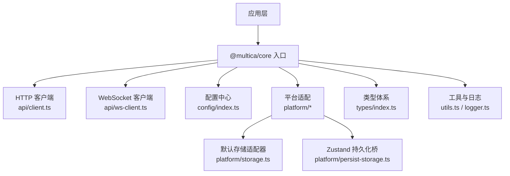
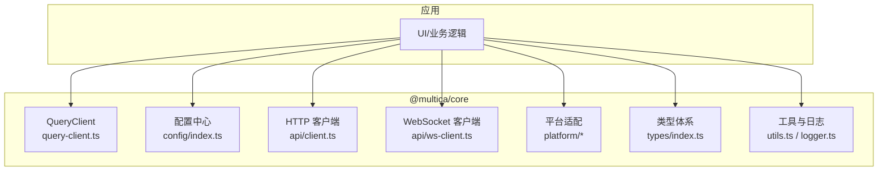
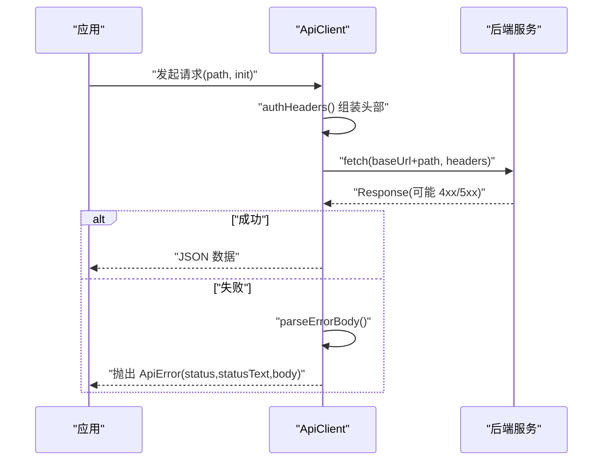
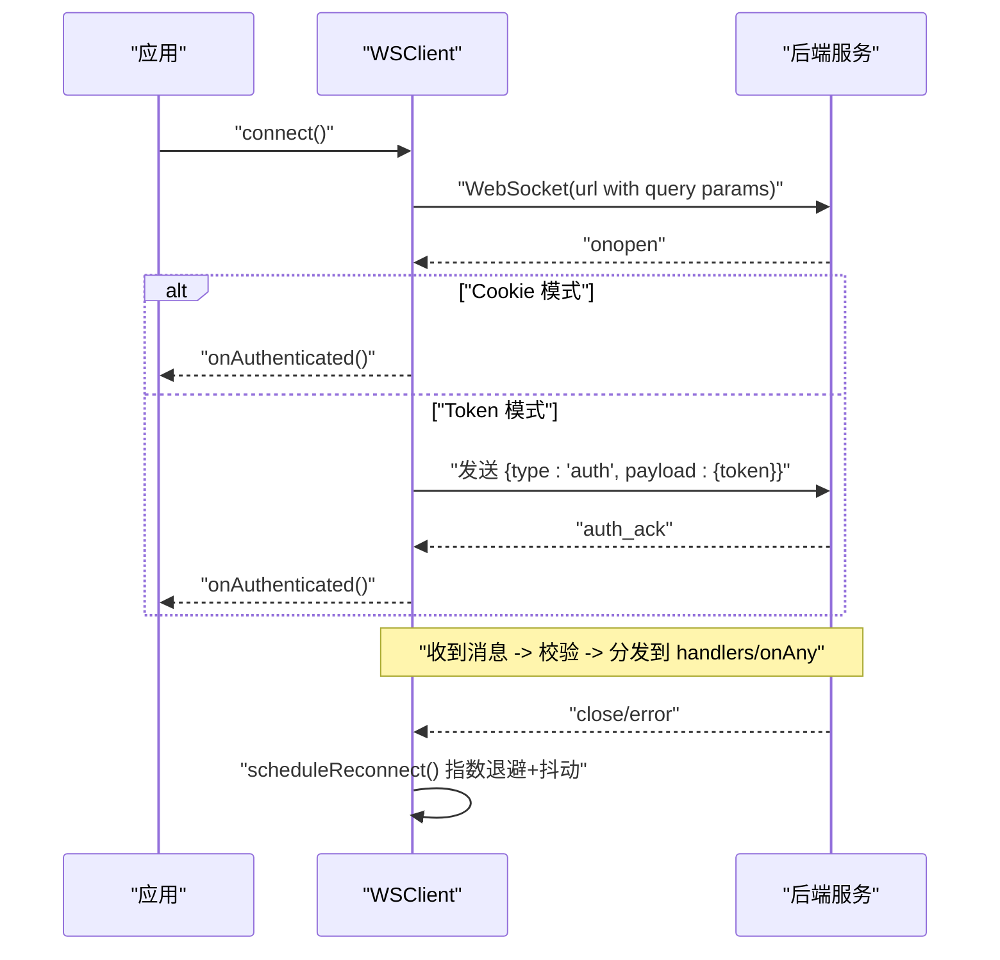
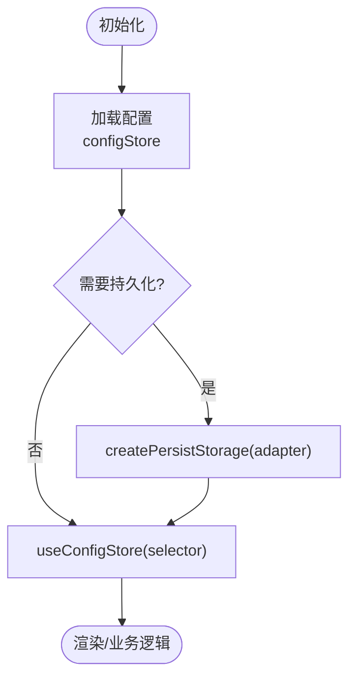
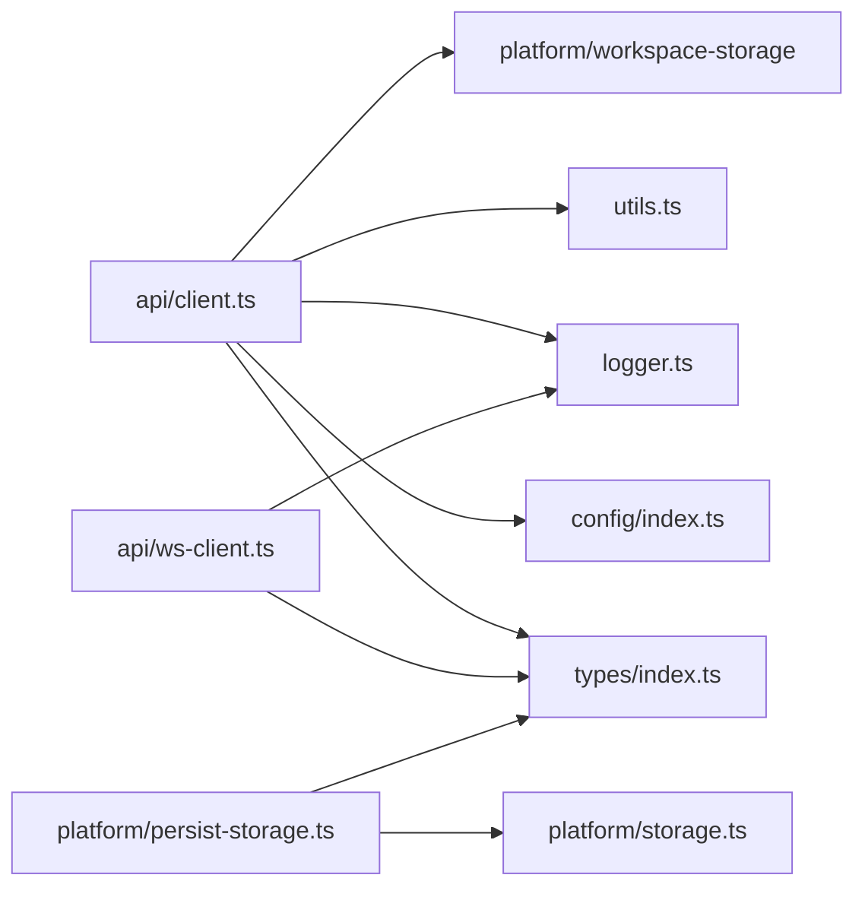

# 核心包 (@multica/core)

<cite>
**本文引用的文件**
- [packages/core/package.json](file://packages/core/package.json)
- [packages/core/index.ts](file://packages/core/index.ts)
- [packages/core/query-client.ts](file://packages/core/query-client.ts)
- [packages/core/api/client.ts](file://packages/core/api/client.ts)
- [packages/core/api/ws-client.ts](file://packages/core/api/ws-client.ts)
- [packages/core/config/index.ts](file://packages/core/config/index.ts)
- [packages/core/platform/index.ts](file://packages/core/platform/index.ts)
- [packages/core/platform/storage.ts](file://packages/core/platform/storage.ts)
- [packages/core/platform/persist-storage.ts](file://packages/core/platform/persist-storage.ts)
- [packages/core/utils.ts](file://packages/core/utils.ts)
- [packages/core/logger.ts](file://packages/core/logger.ts)
- [packages/core/types/index.ts](file://packages/core/types/index.ts)
</cite>

## 目录
1. [简介](#简介)
2. [项目结构](#项目结构)
3. [核心组件](#核心组件)
4. [架构总览](#架构总览)
5. [详细组件分析](#详细组件分析)
6. [依赖关系分析](#依赖关系分析)
7. [性能考量](#性能考量)
8. [故障排查指南](#故障排查指南)
9. [结论](#结论)
10. [附录：使用示例与最佳实践](#附录使用示例与最佳实践)

## 简介
@multica/core 是跨平台（Web/桌面/移动端）共享的核心能力层，提供统一的 API 客户端、WebSocket 实时通信、状态管理基础设施、类型定义体系与工具函数库。该包严格遵循“禁止使用 react-dom、localStorage、process.env 等平台特定 API”的约束，通过 platform 适配层注入存储与运行时能力，确保在 SSR、Electron、React Native 等环境中可安全运行。

## 项目结构
- 入口与导出
  - 根入口暴露 QueryClient 创建器与 Provider，供上层应用装配。
- API 层
  - HTTP 客户端封装：统一鉴权、CSRF、请求追踪、错误处理与结构化响应解析。
  - WebSocket 客户端：连接管理、认证、事件分发、断线重连与抖动退避。
- 配置与特性开关
  - Zustand 驱动的轻量配置中心，集中管理 CDN、鉴权、功能开关、服务端版本等。
- 平台适配
  - StorageAdapter 抽象 localStorage，配合 createPersistStorage 桥接 Zustand 持久化中间件。
  - 工作区感知存储与清理工具。
- 类型体系
  - types/index.ts 聚合所有业务模型、API 请求/响应、事件类型，作为全仓单一事实来源。
- 工具与日志
  - 通用工具（UUID、IME 检测、文本截断）、结构化日志器。

图表来源
- [packages/core/index.ts:1-4](file://packages/core/index.ts#L1-L4)
- [packages/core/api/client.ts:664-788](file://packages/core/api/client.ts#L664-L788)
- [packages/core/api/ws-client.ts:35-156](file://packages/core/api/ws-client.ts#L35-L156)
- [packages/core/config/index.ts:56-84](file://packages/core/config/index.ts#L56-L84)
- [packages/core/platform/storage.ts:4-17](file://packages/core/platform/storage.ts#L4-L17)
- [packages/core/platform/persist-storage.ts:8-14](file://packages/core/platform/persist-storage.ts#L8-L14)

章节来源
- [packages/core/index.ts:1-4](file://packages/core/index.ts#L1-L4)
- [packages/core/package.json:11-162](file://packages/core/package.json#L11-L162)

## 核心组件
- HTTP 客户端
  - 统一构造请求头（Authorization、X-Workspace-Slug、X-CSRF-Token、X-Client-* 标识）。
  - 统一错误路径：401 触发未授权回调并清空 token；非 2xx 抛出 ApiError，携带 status/statusText/body。
  - 支持 204 No Content 与 JSON 响应解析；为附件预览等场景保留原始 Response。
- WebSocket 客户端
  - 连接建立后支持 Cookie 或首帧 Token 认证；事件按 type 分发，支持 onAny 监听任意消息。
  - 指数退避 + 抖动重连，最大延迟上限；连接恢复时触发 onReconnect 回调。
  - 对非法帧进行边界校验与降级，避免下游崩溃。
- 配置中心
  - 基于 Zustand vanilla store 维护全局配置（CDN、鉴权、功能开关、服务端版本、工作区能力等）。
  - 提供 useConfigStore 选择器 Hook 与 featureFlagEnabled/useFeatureEnabled 便捷方法。
- 平台适配与持久化
  - defaultStorage 在 SSR/客户端环境下安全访问 localStorage。
  - createPersistStorage 将 StorageAdapter 适配为 Zustand persist middleware 所需接口。
- 类型体系
  - 集中导出业务模型、API 请求/响应、事件类型，保证全仓类型一致性与可追溯性。
- 工具与日志
  - generateUUID/createSafeId/createRequestId 生成稳定 ID；isImeComposing 处理输入法组合；truncateWithEllipsis 安全截断。
  - Logger 提供带时间戳与命名空间的 debug/info/warn/error 输出，并提供 noopLogger 用于测试或禁用日志。

章节来源
- [packages/core/api/client.ts:492-788](file://packages/core/api/client.ts#L492-L788)
- [packages/core/api/ws-client.ts:35-247](file://packages/core/api/ws-client.ts#L35-L247)
- [packages/core/config/index.ts:4-105](file://packages/core/config/index.ts#L4-L105)
- [packages/core/platform/storage.ts:4-17](file://packages/core/platform/storage.ts#L4-L17)
- [packages/core/platform/persist-storage.ts:8-14](file://packages/core/platform/persist-storage.ts#L8-L14)
- [packages/core/types/index.ts:1-333](file://packages/core/types/index.ts#L1-L333)
- [packages/core/utils.ts:1-95](file://packages/core/utils.ts#L1-L95)
- [packages/core/logger.ts:1-52](file://packages/core/logger.ts#L1-L52)

## 架构总览
核心包采用“分层 + 适配”的架构：
- 表现层不直接依赖平台 API，通过 platform 适配层注入存储与通知能力。
- 数据层以 @tanstack/react-query 管理服务端状态，Zustand 仅管理客户端/视图状态。
- 通信层由 HTTP 客户端与 WebSocket 客户端组成，统一鉴权、追踪与错误处理。
- 类型层集中定义，贯穿前后端契约。

图表来源
- [packages/core/query-client.ts:3-18](file://packages/core/query-client.ts#L3-L18)
- [packages/core/config/index.ts:56-84](file://packages/core/config/index.ts#L56-L84)
- [packages/core/api/client.ts:664-788](file://packages/core/api/client.ts#L664-L788)
- [packages/core/api/ws-client.ts:35-156](file://packages/core/api/ws-client.ts#L35-L156)
- [packages/core/platform/index.ts:1-18](file://packages/core/platform/index.ts#L1-L18)
- [packages/core/types/index.ts:1-333](file://packages/core/types/index.ts#L1-L333)
- [packages/core/utils.ts:1-95](file://packages/core/utils.ts#L1-L95)
- [packages/core/logger.ts:1-52](file://packages/core/logger.ts#L1-L52)

## 详细组件分析

### HTTP 客户端设计
- 请求封装
  - 统一附加 X-Request-ID、鉴权、工作区、CSRF、客户端身份头等。
  - fetchRaw 负责发送与错误处理；fetch 统一解析 JSON 并处理 204。
- 错误处理策略
  - 401：清空本地 token 并调用 onUnauthorized 回调。
  - 非 2xx：抛出 ApiError，包含 status/statusText/body，便于上层按 code 分支。
  - 提供 errorCode/dispatchReasonCode/clientErrorMessage 辅助提取结构化信息。
- 集成点
  - 从 configStore 读取能力标志（如 agentConversationStartersSupported），在写入前做兼容性检查。
  - 从 platform/workspace-storage 获取当前工作区 slug，自动附加到请求头。

图表来源
- [packages/core/api/client.ts:692-788](file://packages/core/api/client.ts#L692-L788)

章节来源
- [packages/core/api/client.ts:492-788](file://packages/core/api/client.ts#L492-L788)

### WebSocket 连接管理
- 连接流程
  - 构建 URL，附加 workspace_slug 与 client_* 查询参数。
  - 打开连接后，若启用 Cookie 认证则直接进入已认证态；否则首帧发送 auth token。
- 事件分发与健壮性
  - 解析消息体，要求必须为对象且 type 为字符串；否则记录警告并丢弃，防止下游异常。
  - 按 type 分派到处理器集合；onAny 可订阅所有消息。
- 断线重连
  - 指数退避 + ±20% 抖动，最大延迟上限；重连成功后触发 onReconnect 回调。
  - 断开时清除定时器与处理器，避免重复重连。

图表来源
- [packages/core/api/ws-client.ts:73-156](file://packages/core/api/ws-client.ts#L73-L156)
- [packages/core/api/ws-client.ts:158-196](file://packages/core/api/ws-client.ts#L158-L196)

章节来源
- [packages/core/api/ws-client.ts:35-247](file://packages/core/api/ws-client.ts#L35-L247)

### 状态管理与持久化
- 配置中心（Zustand）
  - 使用 vanilla store 维护全局配置，提供 set* 方法与 useConfigStore 选择器。
  - 提供 featureFlagEnabled/useFeatureEnabled 便捷读取功能开关。
- 持久化桥
  - createPersistStorage 将 StorageAdapter 适配为 Zustand persist middleware 所需的 StateStorage。
  - defaultStorage 在 SSR/客户端下安全读写 localStorage。
- 工作区感知
  - platform/workspace-storage 提供 getCurrentSlug、setCurrentWorkspace、registerForWorkspaceRehydration 等能力，确保多工作区隔离与重建。

图表来源
- [packages/core/config/index.ts:56-105](file://packages/core/config/index.ts#L56-L105)
- [packages/core/platform/persist-storage.ts:8-14](file://packages/core/platform/persist-storage.ts#L8-L14)
- [packages/core/platform/storage.ts:4-17](file://packages/core/platform/storage.ts#L4-L17)

章节来源
- [packages/core/config/index.ts:4-105](file://packages/core/config/index.ts#L4-L105)
- [packages/core/platform/storage.ts:4-17](file://packages/core/platform/storage.ts#L4-L17)
- [packages/core/platform/persist-storage.ts:8-14](file://packages/core/platform/persist-storage.ts#L8-L14)

### 类型定义体系
- 集中式导出
  - types/index.ts 汇总 Issue、Agent、Chat、Billing、Plugin、VCS、Integration 等全部业务模型与 API 类型。
- 作用
  - 作为前后端契约的唯一来源，确保 API 客户端、查询、变更与 UI 的类型一致性。
  - 通过 re-export 方式组织模块，便于按需导入与 IDE 提示。

章节来源
- [packages/core/types/index.ts:1-333](file://packages/core/types/index.ts#L1-L333)

### 工具函数库
- 通用工具
  - generateUUID/createSafeId/createRequestId：安全、稳定的 ID 生成，兼容不同环境。
  - isImeComposing：正确处理输入法组合键，避免误提交。
  - truncateWithEllipsis：按 Unicode 码点安全截断，避免破坏代理对。
- 日志
  - createLogger：带时间戳与命名空间的结构化日志；noopLogger 用于测试或关闭日志。

章节来源
- [packages/core/utils.ts:1-95](file://packages/core/utils.ts#L1-L95)
- [packages/core/logger.ts:1-52](file://packages/core/logger.ts#L1-L52)

## 依赖关系分析
- 外部依赖
  - @tanstack/react-query：服务端状态缓存与重试策略。
  - zustand：轻量级状态管理，用于配置中心与客户端状态。
  - zod：用于响应数据的校验与回退（在 schemas 中广泛使用）。
  - i18next/react-i18next：国际化能力（通过上层消费）。
- 内部耦合
  - api/client.ts 依赖 configStore、logger、utils、platform/workspace-storage。
  - api/ws-client.ts 依赖 logger、types/events。
  - platform/* 提供 StorageAdapter 抽象，被 persist-storage 与上层 store 使用。
  - types/index.ts 被 api/client.ts 大量引用，形成强类型契约。

图表来源
- [packages/core/api/client.ts:1-240](file://packages/core/api/client.ts#L1-L240)
- [packages/core/api/ws-client.ts:1-52](file://packages/core/api/ws-client.ts#L1-L52)
- [packages/core/platform/persist-storage.ts:1-15](file://packages/core/platform/persist-storage.ts#L1-L15)
- [packages/core/platform/storage.ts:1-18](file://packages/core/platform/storage.ts#L1-L18)
- [packages/core/types/index.ts:1-333](file://packages/core/types/index.ts#L1-L333)

章节来源
- [packages/core/package.json:164-176](file://packages/core/package.json#L164-L176)
- [packages/core/api/client.ts:1-240](file://packages/core/api/client.ts#L1-L240)
- [packages/core/api/ws-client.ts:1-52](file://packages/core/api/ws-client.ts#L1-L52)

## 性能考量
- HTTP 客户端
  - 单次读取响应体同时提取 message 与 body，避免流重复消费。
  - 统一日志记录耗时与请求 ID，便于链路追踪与性能分析。
- WebSocket 客户端
  - 指数退避 + 抖动重连，降低雪崩风险；限制不可解析消息日志长度，避免控制台溢出。
- QueryClient
  - 默认 staleTime=Infinity，减少频繁刷新；gcTime=10 分钟，控制内存占用；refetchOnReconnect=true 保障数据新鲜度。
- 工具函数
  - truncateWithEllipsis 优先走快速路径（code units），再回退到 Unicode 码点计算，兼顾性能与正确性。

[本节为通用指导，无需具体文件来源]

## 故障排查指南
- 常见错误与定位
  - 401 未授权：检查 Authorization 头是否正确设置；确认 onUnauthorized 回调是否触发登录流程。
  - WebSocket 无法认证：确认首帧 auth 消息格式；检查 cookieAuth 模式与服务端会话。
  - 非法帧导致崩溃：查看 ws 客户端对 type 字段的边界校验日志；确认上游协议合规。
  - 配置缺失：检查 configStore 的 set* 方法是否在服务启动时被调用；featureFlagEnabled 默认值是否符合预期。
- 调试建议
  - 使用 createLogger(namespace) 为各模块添加命名空间日志。
  - 利用 createRequestId 关联请求链路；在浏览器网络面板与后端日志中对照 RID。
  - 使用 noopLogger 屏蔽日志干扰，或在测试中替换自定义 logger。

章节来源
- [packages/core/api/client.ts:706-788](file://packages/core/api/client.ts#L706-L788)
- [packages/core/api/ws-client.ts:102-156](file://packages/core/api/ws-client.ts#L102-L156)
- [packages/core/logger.ts:24-52](file://packages/core/logger.ts#L24-L52)

## 结论
@multica/core 以“平台无关、类型安全、可观测、可扩展”为核心目标，通过统一的 HTTP/WebSocket 客户端、Zustand 配置中心、平台适配层与集中类型体系，为上层应用提供稳定可靠的基础设施。其严格的约束（禁用平台特定 API）与清晰的边界（core/ui/views 职责分离）确保了在多端环境下的可移植性与可维护性。

[本节为总结，无需具体文件来源]

## 附录：使用示例与最佳实践
- 初始化 QueryClient
  - 在应用根节点调用 createQueryClient() 并包裹 QueryProvider，以获得统一的服务端状态缓存与重试策略。
- 配置中心使用
  - 在应用启动时调用 configStore 的 set* 方法注入 CDN、鉴权、功能开关与服务端版本。
  - 使用 useFeatureEnabled(key, defaultValue) 在组件中读取功能开关。
- HTTP 客户端使用
  - 实例化 ApiClient 并设置 baseUrl、identity、onUnauthorized。
  - 调用 sendCode/verifyCode 等方法完成认证；后续请求自动携带鉴权与工作区信息。
  - 捕获 ApiError，使用 errorCode/dispatchReasonCode/clientErrorMessage 进行用户友好提示。
- WebSocket 使用
  - 实例化 WSClient，设置 setAuth(token, workspaceSlug)，调用 connect。
  - 使用 on(event, handler) 订阅事件；onAny 用于全局监控；onReconnect 用于恢复后同步。
  - 注意：不要直接操作底层 WebSocket，始终通过 WSClient 发送消息。
- 持久化与存储
  - 使用 createPersistStorage(defaultStorage) 为 Zustand store 开启持久化。
  - 在工作区切换时，使用 platform/workspace-storage 提供的能力进行状态重建与清理。
- 工具函数
  - 使用 createSafeId/createRequestId 生成唯一标识；isImeComposing 避免输入法误提交；truncateWithEllipsis 安全截断显示文本。
- 最佳实践
  - 保持 core 包无平台特定实现，所有平台差异通过 platform/* 注入。
  - 所有对外暴露的类型集中在 types/index.ts，避免散落定义。
  - 对服务端返回数据进行 zod 校验（在 schemas 中），客户端只信任解析后的数据。
  - 对关键路径添加结构化日志与请求 ID，便于问题定位。

[本节为实践指导，无需具体文件来源]