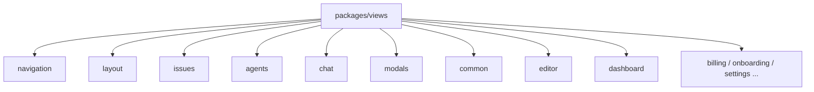
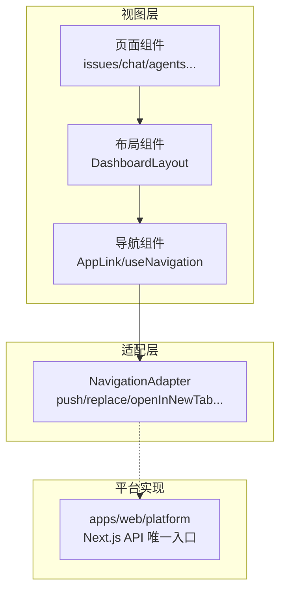
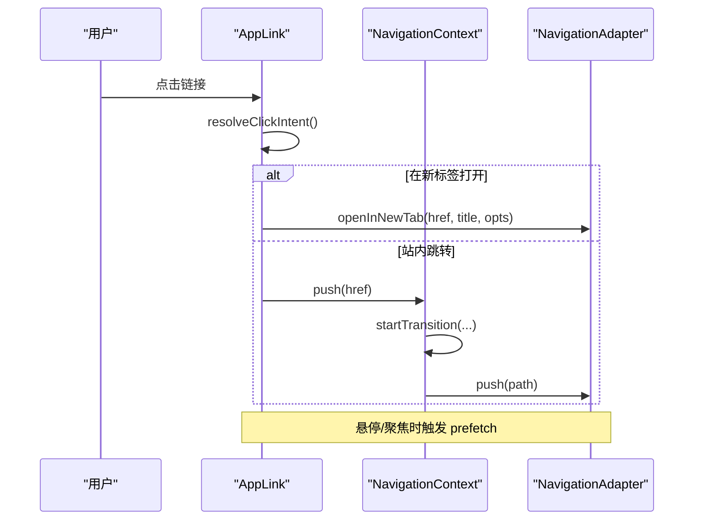
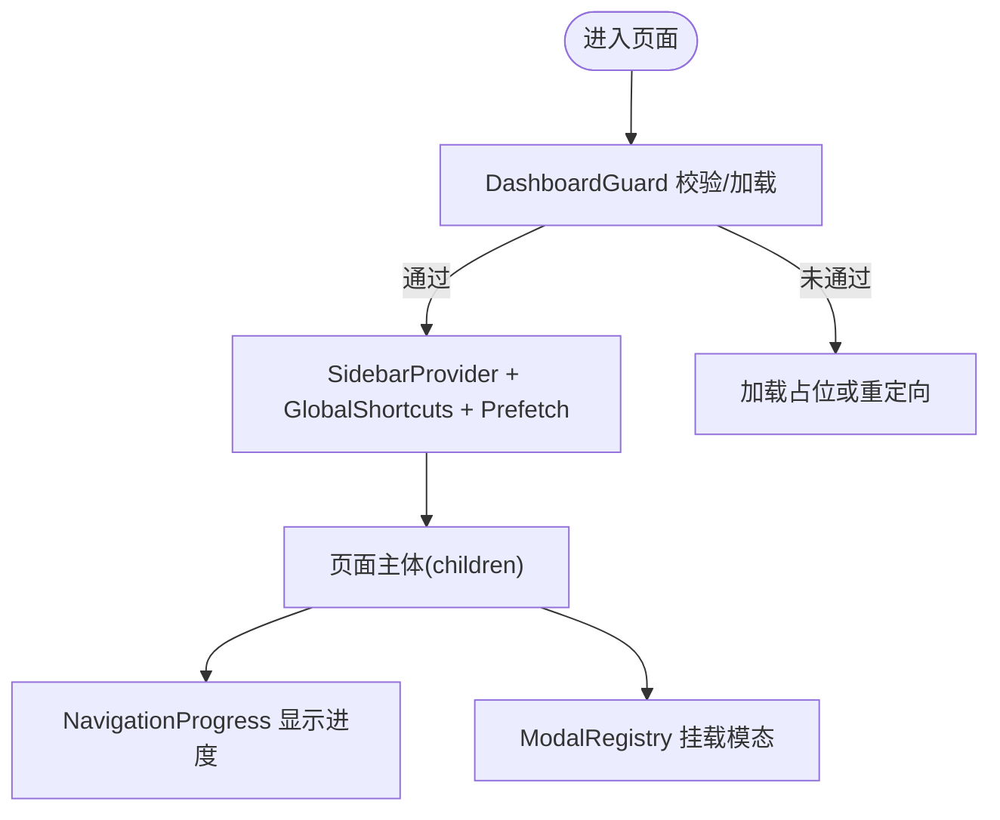
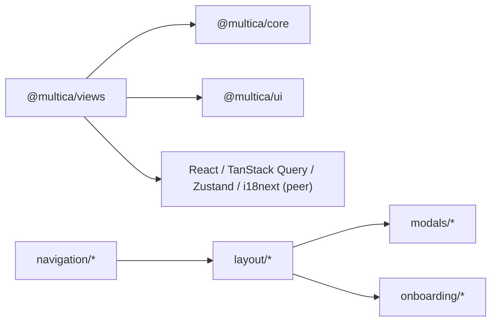

# 视图包 (@multica/views)

<cite>
**本文引用的文件**
- [packages/views/package.json](file://packages/views/package.json)
- [packages/views/navigation/index.ts](file://packages/views/navigation/index.ts)
- [packages/views/navigation/types.ts](file://packages/views/navigation/types.ts)
- [packages/views/navigation/context.tsx](file://packages/views/navigation/context.tsx)
- [packages/views/navigation/app-link.tsx](file://packages/views/navigation/app-link.tsx)
- [packages/views/layout/index.ts](file://packages/views/layout/index.ts)
- [packages/views/layout/dashboard-layout.tsx](file://packages/views/layout/dashboard-layout.tsx)
- [packages/views/layout/collection-page.tsx](file://packages/views/layout/collection-page.tsx)
</cite>

## 目录
1. [简介](#简介)
2. [项目结构](#项目结构)
3. [核心组件](#核心组件)
4. [架构总览](#架构总览)
5. [详细组件分析](#详细组件分析)
6. [依赖分析](#依赖分析)
7. [性能考虑](#性能考虑)
8. [故障排查指南](#故障排查指南)
9. [结论](#结论)
10. [附录](#附录)

## 简介
本文件为 @multica/views 视图包的权威技术文档。该包是前端应用的可复用视图层，负责页面、布局、导航与通用 UI 组合。其关键约束如下：
- 禁止在视图包内使用 next/* 与 react-router-dom；所有路由必须通过 NavigationAdapter 抽象进行。
- 业务视图以“页面组件 + Hook”的方式组织，数据获取由 TanStack Query（服务端状态）与 Zustand（客户端/视图状态）分层管理，共享 store 仅位于 packages/core。
- 布局系统提供 DashboardLayout、CollectionPageHeader/State 等模板化能力，统一侧边栏、全局快捷键、导航进度、模态注册等横切关注点。
- Hook 设计聚焦业务逻辑封装、数据订阅与副作用处理，避免在组件中直接耦合平台细节。

## 项目结构
@multica/views 采用按领域划分的目录组织方式，每个子目录对应一个功能域（如 agents、issues、chat、layout、navigation 等），并通过 package.json 的 exports 暴露稳定入口。导航与布局作为跨领域的基础设施，独立成目录并集中导出。

图表来源
- [packages/views/package.json:11-57](file://packages/views/package.json#L11-L57)

章节来源
- [packages/views/package.json:1-144](file://packages/views/package.json#L1-L144)

## 核心组件
- 导航适配器与上下文
  - NavigationAdapter：定义 push/replace/back/hash/searchParams/openInNewTab/getShareableUrl/prefetch/canGoBack/forward 等能力，屏蔽 Web/Desktop 差异。
  - NavigationProvider：将 push/replace 包裹在 React Transition 中，结合 useReportNavigating 实现统一的“导航进行中”信号，供导航进度条等消费。
  - AppLink：统一锚点行为，解析点击意图（push/new tab/foreground-tab），在桌面端走 openInNewTab，Web 端保持原生行为，支持预取。
- 布局模板
  - DashboardLayout：装配 SidebarProvider、GlobalShortcuts、WorkspacePresencePrefetch、NavigationProgress、ModalRegistry 等横切能力，承载页面内容。
  - CollectionPageHeader/State：集合类页面的标准头部与空态/错误态模板，统一视觉与交互。

章节来源
- [packages/views/navigation/types.ts:1-61](file://packages/views/navigation/types.ts#L1-L61)
- [packages/views/navigation/context.tsx:1-112](file://packages/views/navigation/context.tsx#L1-L112)
- [packages/views/navigation/app-link.tsx:1-151](file://packages/views/navigation/app-link.tsx#L1-L151)
- [packages/views/layout/dashboard-layout.tsx:1-52](file://packages/views/layout/dashboard-layout.tsx#L1-L52)
- [packages/views/layout/collection-page.tsx:1-173](file://packages/views/layout/collection-page.tsx#L1-L173)

## 架构总览
视图包遵循“平台无关 + 适配层”的设计：
- 视图层不感知具体路由实现，只消费 NavigationAdapter。
- 平台侧（apps/web/platform）提供 NavigationAdapter 的具体实现，并在根节点注入 NavigationProvider。
- 布局层聚合全局能力（快捷键、工作区存在性预取、导航进度、模态注册）。
- 业务页以“页面组件 + Hook”形式组织，数据通过 TanStack Query 拉取，Zustand 仅用于视图级状态。

图表来源
- [packages/views/navigation/types.ts:1-61](file://packages/views/navigation/types.ts#L1-L61)
- [packages/views/navigation/context.tsx:23-64](file://packages/views/navigation/context.tsx#L23-L64)
- [packages/views/layout/dashboard-layout.tsx:23-50](file://packages/views/layout/dashboard-layout.tsx#L23-L50)

## 详细组件分析

### 导航子系统
- 类型契约
  - NavigationAdapter 明确定义了路由能力与可选能力（prefetch、canGoBack、forward），确保视图层可安全调用。
- 上下文与过渡
  - NavigationProvider 将 push/replace 用 startTransition 包裹，使路由提交期间能正确显示进度；useReportNavigating 允许页面内部“内容切换”也上报 pending，保证进度条一致性。
- 链接与意图解析
  - AppLink 根据事件与修饰键解析点击意图，桌面端通过 openInNewTab 打开新标签，Web 端保留浏览器原生行为；同时支持 prefetch 预热。

图表来源
- [packages/views/navigation/app-link.tsx:43-126](file://packages/views/navigation/app-link.tsx#L43-L126)
- [packages/views/navigation/context.tsx:30-52](file://packages/views/navigation/context.tsx#L30-L52)
- [packages/views/navigation/types.ts:1-61](file://packages/views/navigation/types.ts#L1-L61)

章节来源
- [packages/views/navigation/types.ts:1-61](file://packages/views/navigation/types.ts#L1-L61)
- [packages/views/navigation/context.tsx:1-112](file://packages/views/navigation/context.tsx#L1-L112)
- [packages/views/navigation/app-link.tsx:1-151](file://packages/views/navigation/app-link.tsx#L1-L151)
- [packages/views/navigation/index.ts:1-17](file://packages/views/navigation/index.ts#L1-L17)

### 布局系统
- DashboardLayout
  - 统一装配 SidebarProvider、GlobalShortcuts、WorkspacePresencePrefetch、NavigationProgress、ModalRegistry，以及可选 extra/searchSlot/loadingIndicator。
  - 通过 DashboardGuard 控制加载态与权限相关的前置检查。
- 集合页面模板
  - CollectionPageHeader：图标+标题+计数+描述+动作按钮，响应式展示。
  - CollectionPageState：统一的空态/错误态/未找到态，支持 tone 与 role。

图表来源
- [packages/views/layout/dashboard-layout.tsx:23-50](file://packages/views/layout/dashboard-layout.tsx#L23-L50)

章节来源
- [packages/views/layout/index.ts:1-20](file://packages/views/layout/index.ts#L1-L20)
- [packages/views/layout/dashboard-layout.tsx:1-52](file://packages/views/layout/dashboard-layout.tsx#L1-L52)
- [packages/views/layout/collection-page.tsx:1-173](file://packages/views/layout/collection-page.tsx#L1-L173)

### 页面组件设计
- 业务视图封装
  - 页面组件专注于渲染与交互编排，数据通过 TanStack Query 获取，视图状态通过 Zustand（位于 packages/core）管理。
  - 列表/详情/看板/甘特等多视图共用同一数据源，通过选择器与缓存键区分。
- 页面状态管理
  - 服务端状态：TanStack Query 负责缓存、去重、重试、增量更新。
  - 客户端状态：Zustand store 仅存放视图级状态（如展开/折叠、选中项、分页参数），避免与服务端数据重复。
- 数据获取策略
  - 优先使用查询缓存与预取（AppLink 的 prefetch），减少首屏与跳转时的请求。
  - 对大列表采用虚拟滚动与无限滚动（issues 模块中的虚拟列表与哨兵组件）。

章节来源
- [packages/views/navigation/app-link.tsx:118-126](file://packages/views/navigation/app-link.tsx#L118-L126)
- [packages/views/issues/components/list-view.tsx](file://packages/views/issues/components/list-view.tsx)
- [packages/views/issues/components/table-view.tsx](file://packages/views/issues/components/table-view.tsx)

### Hook 设计
- 业务逻辑封装
  - 将复杂交互（如批量操作、评论触发、拖拽落定）下沉到 Hook，组件仅做最小渲染。
- 数据订阅
  - 基于 TanStack Query 的 hooks 订阅查询结果，利用 staleTime/gcTime 优化刷新频率。
- 副作用处理
  - 使用 useEffect/useTransition/useDeferredValue 组合，避免阻塞主线程；导航进度通过 useReportNavigating 上报。

章节来源
- [packages/views/navigation/context.tsx:83-111](file://packages/views/navigation/context.tsx#L83-L111)
- [packages/views/issues/hooks/use-drag-settle.ts](file://packages/views/issues/hooks/use-drag-settle.ts)
- [packages/views/issues/hooks/use-comment-trigger-preview.ts](file://packages/views/issues/hooks/use-comment-trigger-preview.ts)

### 组件组合模式
- 高阶组件
  - 通过 Provider/Guard 组合（如 DashboardGuard、SidebarProvider）注入横切能力。
- 渲染属性
  - DashboardLayout 通过 children/extra/searchSlot 等插槽扩展内容。
- 自定义 Hook
  - useNavigation/useOptionalNavigation/useIsNavigating/useReportNavigating 提供一致的导航能力与状态。

章节来源
- [packages/views/layout/dashboard-layout.tsx:13-50](file://packages/views/layout/dashboard-layout.tsx#L13-L50)
- [packages/views/navigation/context.tsx:66-111](file://packages/views/navigation/context.tsx#L66-L111)

## 依赖分析
- 包边界与外部依赖
  - 视图包依赖 @multica/core 与 @multica/ui，peerDependencies 声明了 React、TanStack Query、Zustand、i18next 等运行时依赖。
  - 严格禁止引入 next/* 与 react-router-dom，路由通过 NavigationAdapter 解耦。
- 内部模块关系
  - layout 依赖 modals、onboarding、ui/sidebar 等；navigation 被 layout 与业务组件广泛使用。

图表来源
- [packages/views/package.json:59-123](file://packages/views/package.json#L59-L123)
- [packages/views/layout/index.ts:1-20](file://packages/views/layout/index.ts#L1-L20)
- [packages/views/navigation/index.ts:1-17](file://packages/views/navigation/index.ts#L1-L17)

章节来源
- [packages/views/package.json:59-123](file://packages/views/package.json#L59-L123)

## 性能考虑
- 导航过渡与进度
  - 使用 React Transition 包裹 push/replace，结合 useReportNavigating 保证进度条覆盖站内内容切换场景。
- 预取与缓存
  - AppLink 在 hover/focus 时触发 prefetch；TanStack Query 合理配置 staleTime/gcTime，减少重复请求。
- 列表与虚拟化
  - 大数据集使用虚拟滚动（react-virtuoso/@tanstack/react-virtual）与无限滚动哨兵，降低首屏渲染压力。
- 资源拆分与懒加载
  - 将重型编辑器/富文本组件按需加载，避免阻塞首屏。

[本节为通用指导，不直接分析具体文件]

## 故障排查指南
- 导航进度不显示
  - 确认已包裹 NavigationProvider，且 push/replace 通过 context 调用；对于站内内容切换，需调用 useReportNavigating(true) 上报。
- 新标签打开无效
  - 检查 NavigationAdapter 是否实现 openInNewTab；桌面端需确保 getShareableUrl 返回有效 URL。
- 链接行为异常
  - 确认 AppLink 未被 onClick/onAuxClick 覆盖；如需阻止跳转，请在回调中调用 preventDefault。
- 布局缺失横切能力
  - 确保页面由 DashboardLayout 包裹，以便启用 GlobalShortcuts、NavigationProgress、ModalRegistry 等。

章节来源
- [packages/views/navigation/context.tsx:23-64](file://packages/views/navigation/context.tsx#L23-L64)
- [packages/views/navigation/app-link.tsx:43-126](file://packages/views/navigation/app-link.tsx#L43-L126)
- [packages/views/layout/dashboard-layout.tsx:23-50](file://packages/views/layout/dashboard-layout.tsx#L23-L50)

## 结论
@multica/views 通过 NavigationAdapter 将路由与平台解耦，借助 DashboardLayout 提供一致的布局与横切能力，并以“页面组件 + Hook”的模式组织业务视图。配合 TanStack Query 与 Zustand 的分层状态管理，实现了高内聚、低耦合、可测试、可扩展的视图层。遵循本文规范与最佳实践，可在多平台（Web/Desktop）下保持一致的用户体验与开发效率。

## 附录
- 视图开发规范
  - 禁止在视图包内 import next/* 与 react-router-dom；路由一律通过 NavigationAdapter。
  - 页面组件只做渲染与交互编排，数据获取与持久化逻辑放入 Hook 或 services。
  - 共享状态仅放在 packages/core 的 Zustand store，视图层不维护与服务端镜像的状态。
- 测试策略
  - 使用 Vitest + Testing Library 对组件与 Hook 进行单元测试；对导航行为使用 NavigationProvider 的 mock adapter。
  - 对复杂交互（如拖拽、批量操作）编写集成测试，验证状态流转与副作用。
- 性能优化清单
  - 合理使用预取与缓存；对长列表启用虚拟化；避免在渲染路径中进行昂贵计算；必要时使用 useDeferredValue 延迟非关键更新。

[本节为通用指导，不直接分析具体文件]