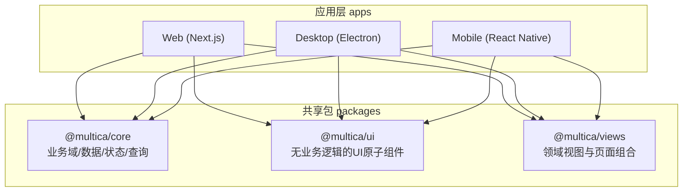
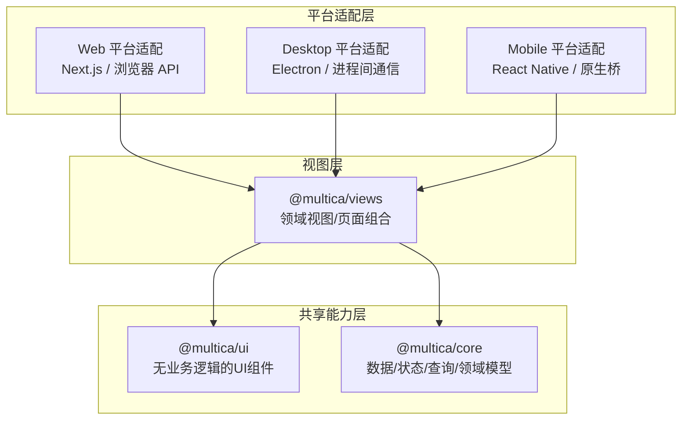
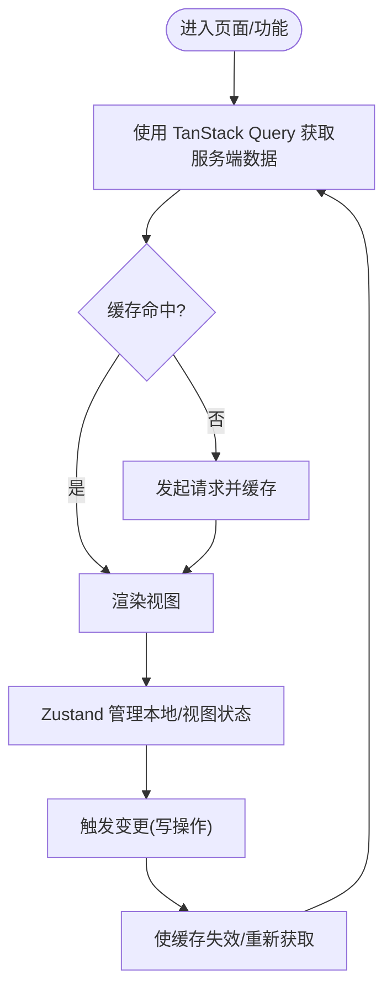
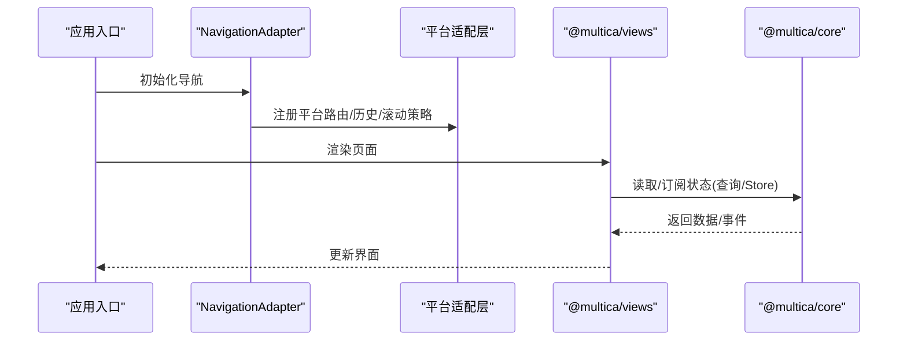
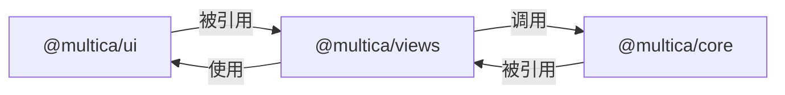
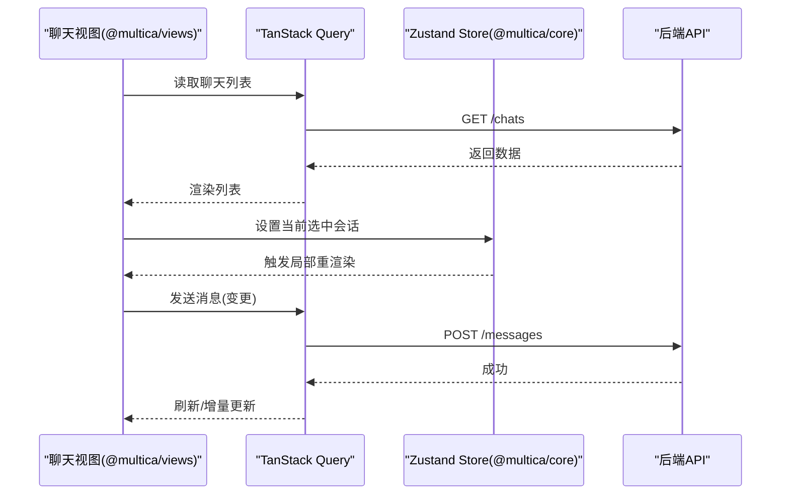
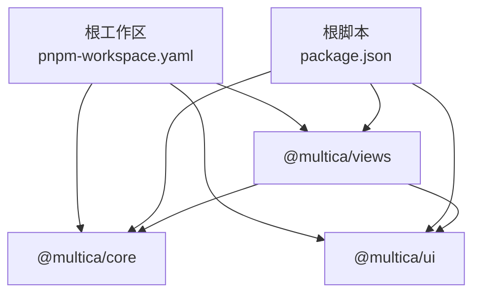

# 前端架构

<cite>
**本文引用的文件**
- [package.json](file://package.json)
- [pnpm-workspace.yaml](file://pnpm-workspace.yaml)
- [packages/core/package.json](file://packages/core/package.json)
- [packages/ui/package.json](file://packages/ui/package.json)
- [packages/views/package.json](file://packages/views/package.json)
- [packages/core/index.ts](file://packages/core/index.ts)
- [packages/core/query-client.ts](file://packages/core/query-client.ts)
- [packages/core/provider.tsx](file://packages/core/provider.tsx)
- [packages/ui/components.json](file://packages/ui/components.json)
- [apps/web/platform/navigation.tsx](file://apps/web/platform/navigation.tsx)
- [apps/web/platform/in-app-history.ts](file://apps/web/platform/in-app-history.ts)
- [apps/desktop/electron.vite.config.ts](file://apps/desktop/electron.vite.config.ts)
- [apps/mobile/app.config.ts](file://apps/mobile/app.config.ts)
</cite>

## 目录
1. [简介](#简介)
2. [项目结构](#项目结构)
3. [核心组件](#核心组件)
4. [架构总览](#架构总览)
5. [详细组件分析](#详细组件分析)
6. [依赖关系分析](#依赖关系分析)
7. [性能考量](#性能考量)
8. [故障排查指南](#故障排查指南)
9. [结论](#结论)
10. [附录](#附录)

## 简介
本文件面向 Multica 前端工程，系统性阐述多平台（Next.js Web、Electron 桌面、React Native 移动）的架构设计与实现策略。重点覆盖：
- 包边界约束与共享代码策略
- 状态管理分层：TanStack Query 独占服务端状态，Zustand 独占客户端/视图状态
- 跨平台适配方案与差异化实现
- 组件依赖图、状态流转图与关键流程时序

## 项目结构
Multica 采用 pnpm workspaces + Turborepo 单体仓库组织，apps 下包含多平台应用，packages 下为可复用能力层。

图表来源
- [pnpm-workspace.yaml:1-4](file://pnpm-workspace.yaml#L1-L4)
- [package.json:6-25](file://package.json#L6-L25)

章节来源
- [package.json:6-25](file://package.json#L6-L25)
- [pnpm-workspace.yaml:1-4](file://pnpm-workspace.yaml#L1-L4)

## 核心组件
- @multica/core：业务域模型、API 客户端、查询与变更、实时通信、特性开关、国际化、诊断、平台抽象等；通过 exports 暴露细粒度子路径；提供 TanStack Query 客户端创建与 Provider。
- @multica/ui：纯 UI 组件库（基于 shadcn/base-nova），不含业务逻辑；通过 components.json 配置别名与样式；仅依赖 React 生态与展示型库。
- @multica/views：按领域组织的视图与页面组合，依赖 core 与 ui，但不直接依赖 next/* 或 react-router-dom，统一通过 NavigationAdapter 进行导航。

章节来源
- [packages/core/package.json:11-162](file://packages/core/package.json#L11-L162)
- [packages/ui/package.json:10-28](file://packages/ui/package.json#L10-L28)
- [packages/views/package.json:11-58](file://packages/views/package.json#L11-L58)

## 架构总览
整体遵循“共享能力下沉、平台差异上移”的分层原则：
- 共享层：core 负责数据与状态契约、查询与变更、领域模型、平台抽象；ui 提供跨平台一致的 UI 原语；views 聚合领域视图。
- 平台层：web/desktop/mobile 各自实现平台相关能力（路由、存储、系统 API、构建产物）。

图表来源
- [packages/core/package.json:11-162](file://packages/core/package.json#L11-L162)
- [packages/ui/package.json:10-28](file://packages/ui/package.json#L10-L28)
- [packages/views/package.json:11-58](file://packages/views/package.json#L11-L58)

## 详细组件分析

### 包边界与约束
- @multica/core
  - 禁止引入 react-dom、localStorage、process.env，确保跨平台可复用。
  - 通过 exports 精确导出子模块，避免隐式耦合。
- @multica/ui
  - 不得 import @multica/core，不包含业务逻辑，仅承载展示与交互原语。
  - 使用 shadcn 配置与 Tailwind 主题变量，保证视觉一致性。
- @multica/views
  - 禁用 next/* 与 react-router-dom，统一通过 NavigationAdapter 完成导航，便于在桌面/移动端复用。
  - 依赖 @multica/core 与 @multica/ui，形成稳定的上层视图层。

章节来源
- [packages/core/package.json:11-162](file://packages/core/package.json#L11-L162)
- [packages/ui/package.json:10-28](file://packages/ui/package.json#L10-L28)
- [packages/views/package.json:11-58](file://packages/views/package.json#L11-L58)

### 状态管理分层策略
- 服务端状态：由 TanStack Query 统一管理，所有服务端数据读取、缓存、失效、重试均通过 QueryClient 配置与 hooks 完成。
- 客户端/视图状态：由 Zustand 管理，用于 UI 局部状态、表单临时状态、视图级开关等；所有共享 store 必须位于 @multica/core，避免在 views 中散落全局状态。
- 不将服务端数据镜像进 store，保持单一事实源。

图表来源
- [packages/core/query-client.ts:1-19](file://packages/core/query-client.ts#L1-L19)
- [packages/core/provider.tsx:1-16](file://packages/core/provider.tsx#L1-L16)

章节来源
- [packages/core/query-client.ts:1-19](file://packages/core/query-client.ts#L1-L19)
- [packages/core/provider.tsx:1-16](file://packages/core/provider.tsx#L1-L16)

### 共享代码策略与 UI 组件库设计原则
- 共享策略
  - 领域模型、API 客户端、查询/变更、实时消息、特性开关、国际化、诊断工具集中在 @multica/core。
  - 视图组合与页面编排集中在 @multica/views，屏蔽平台差异。
  - 纯 UI 组件集中在 @multica/ui，不携带业务语义。
- UI 组件库原则
  - 无业务逻辑、可组合、可主题化、可测试。
  - 通过 shadcn 配置与 Tailwind 变量统一风格。
  - 以子路径导出，限制隐式依赖。

章节来源
- [packages/ui/components.json:1-30](file://packages/ui/components.json#L1-L30)
- [packages/core/package.json:11-162](file://packages/core/package.json#L11-L162)
- [packages/views/package.json:11-58](file://packages/views/package.json#L11-L58)

### 各平台差异化实现
- Web（Next.js）
  - 平台适配集中在 apps/web/platform，封装路由、滚动恢复、文档标题、语言同步等。
  - 导航通过 NavigationAdapter 注入，避免直接依赖 next/router。
- Desktop（Electron）
  - 通过 electron.vite.config.ts 构建主/渲染进程，平台能力（如文件系统、进程通信）在 desktop 内实现。
- Mobile（React Native）
  - 通过 app.config.ts 配置应用元信息与原生能力接入，平台差异在 mobile 内实现。

图表来源
- [apps/web/platform/navigation.tsx:1-200](file://apps/web/platform/navigation.tsx#L1-L200)
- [apps/web/platform/in-app-history.ts:1-200](file://apps/web/platform/in-app-history.ts#L1-L200)
- [apps/desktop/electron.vite.config.ts:1-200](file://apps/desktop/electron.vite.config.ts#L1-L200)
- [apps/mobile/app.config.ts:1-200](file://apps/mobile/app.config.ts#L1-L200)

章节来源
- [apps/web/platform/navigation.tsx:1-200](file://apps/web/platform/navigation.tsx#L1-L200)
- [apps/web/platform/in-app-history.ts:1-200](file://apps/web/platform/in-app-history.ts#L1-L200)
- [apps/desktop/electron.vite.config.ts:1-200](file://apps/desktop/electron.vite.config.ts#L1-L200)
- [apps/mobile/app.config.ts:1-200](file://apps/mobile/app.config.ts#L1-L200)

### 组件依赖图

图表来源
- [packages/core/package.json:11-162](file://packages/core/package.json#L11-L162)
- [packages/ui/package.json:10-28](file://packages/ui/package.json#L10-L28)
- [packages/views/package.json:11-58](file://packages/views/package.json#L11-L58)

章节来源
- [packages/core/package.json:11-162](file://packages/core/package.json#L11-L162)
- [packages/ui/package.json:10-28](file://packages/ui/package.json#L10-L28)
- [packages/views/package.json:11-58](file://packages/views/package.json#L11-L58)

### 状态流转图（示例：聊天列表）

图表来源
- [packages/core/query-client.ts:1-19](file://packages/core/query-client.ts#L1-L19)
- [packages/core/provider.tsx:1-16](file://packages/core/provider.tsx#L1-L16)

章节来源
- [packages/core/query-client.ts:1-19](file://packages/core/query-client.ts#L1-L19)
- [packages/core/provider.tsx:1-16](file://packages/core/provider.tsx#L1-L16)

## 依赖关系分析
- 顶层工作区与脚本
  - 通过 pnpm workspace 管理 apps/* 与 packages/*。
  - 根 package.json 提供 dev/build/test/lint 等脚本，统一多包协作。
- 包间依赖
  - @multica/views 依赖 @multica/core 与 @multica/ui。
  - @multica/ui 不依赖 @multica/core，保持无业务逻辑。
  - @multica/core 仅依赖 React 生态与通用库，不绑定具体框架。

图表来源
- [pnpm-workspace.yaml:1-4](file://pnpm-workspace.yaml#L1-L4)
- [package.json:6-25](file://package.json#L6-L25)
- [packages/views/package.json:59-68](file://packages/views/package.json#L59-L68)
- [packages/ui/package.json:29-64](file://packages/ui/package.json#L29-L64)
- [packages/core/package.json:164-176](file://packages/core/package.json#L164-L176)

章节来源
- [pnpm-workspace.yaml:1-4](file://pnpm-workspace.yaml#L1-L4)
- [package.json:6-25](file://package.json#L6-L25)
- [packages/views/package.json:59-68](file://packages/views/package.json#L59-L68)
- [packages/ui/package.json:29-64](file://packages/ui/package.json#L29-L64)
- [packages/core/package.json:164-176](file://packages/core/package.json#L164-L176)

## 性能考量
- 服务端状态缓存
  - 默认 staleTime 设为 Infinity，减少重复请求；gcTime 10 分钟，平衡内存与时效性。
  - refetchOnWindowFocus 关闭，refetchOnReconnect 开启，提升离线/切换场景体验。
- 变更重试策略
  - mutations 默认不重试，避免幂等性问题与副作用放大。
- 虚拟列表与大数据渲染
  - 使用 @tanstack/react-virtual 与 react-virtuoso 优化长列表性能。
- 组件懒加载与代码分割
  - 结合 Next.js 路由与动态导入，降低首屏体积。
- 网络与并发
  - 合理设置 QueryClient 并发与去重，避免雪崩请求。

章节来源
- [packages/core/query-client.ts:1-19](file://packages/core/query-client.ts#L1-L19)

## 故障排查指南
- 状态不一致
  - 检查是否错误地将服务端数据放入 Zustand store；应通过 QueryClient 缓存与失效机制保持一致。
  - 确认变更成功后是否主动使缓存失效，确保后续读取能拿到最新数据。
- 导航异常
  - Web 端确认 NavigationAdapter 是否正确注册平台路由与滚动恢复策略。
  - 桌面/移动端确认平台路由与历史栈是否与视图层约定一致。
- 构建与依赖
  - 确认包边界未被破坏（例如 ui 误引 core、views 误引 next/*）。
  - 使用根脚本统一 lint/typecheck/test，快速定位问题包。

章节来源
- [packages/core/query-client.ts:1-19](file://packages/core/query-client.ts#L1-L19)
- [packages/core/provider.tsx:1-16](file://packages/core/provider.tsx#L1-L16)
- [apps/web/platform/navigation.tsx:1-200](file://apps/web/platform/navigation.tsx#L1-L200)
- [apps/web/platform/in-app-history.ts:1-200](file://apps/web/platform/in-app-history.ts#L1-L200)

## 结论
Multica 前端通过清晰的包边界与分层策略，实现了跨平台的一致性与可维护性：
- @multica/core 专注领域与数据契约，@multica/ui 专注无业务 UI，@multica/views 专注领域视图组合。
- 状态管理严格分层：TanStack Query 管理服务端状态，Zustand 管理客户端/视图状态。
- 平台差异收敛在 apps 下的 platform 适配层，最大化共享代码复用。
该架构有助于团队协作、持续演进与多端一致性交付。

## 附录
- 开发命令
  - 根脚本提供 dev:web、dev:desktop、dev:mobile 等命令，配合 Turborepo 并行开发。
- 版本与引擎
  - Node 版本要求与 pnpm 版本在根 package.json 中声明，确保环境一致性。

章节来源
- [package.json:6-25](file://package.json#L6-L25)
- [package.json:32-35](file://package.json#L32-L35)