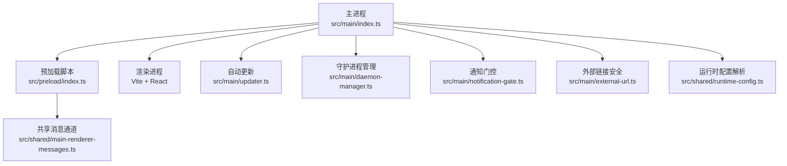
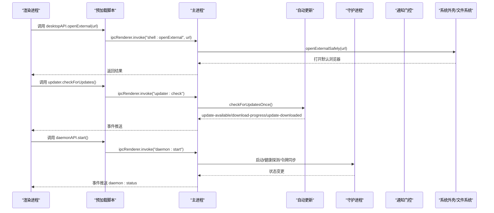
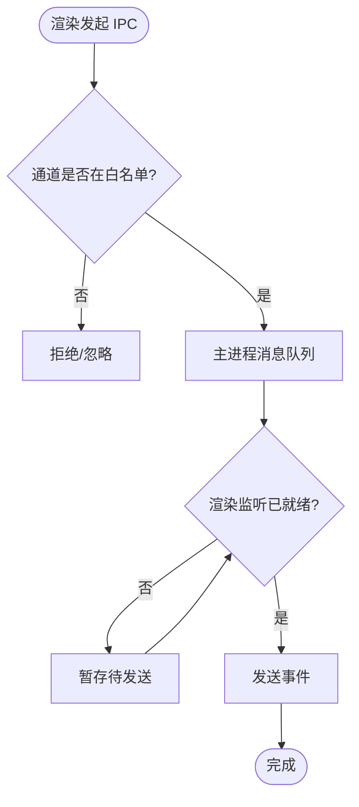
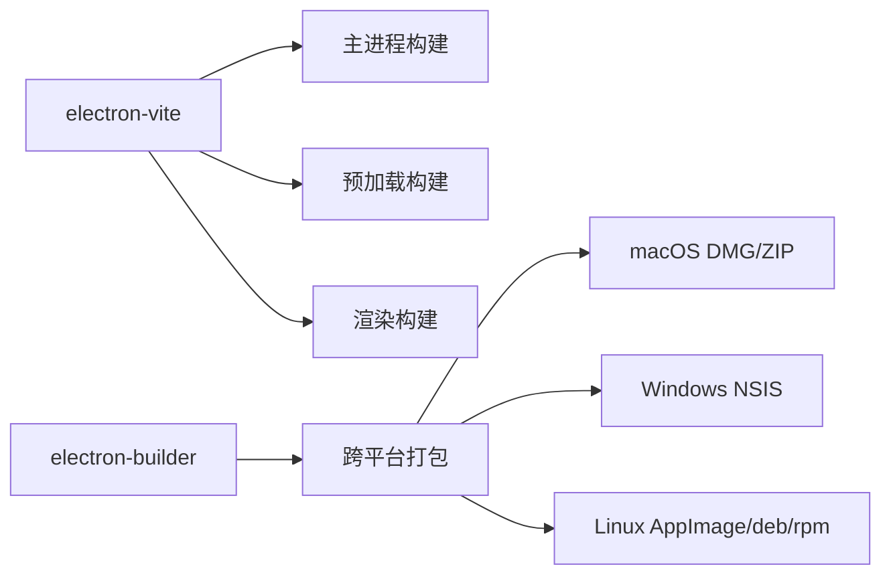
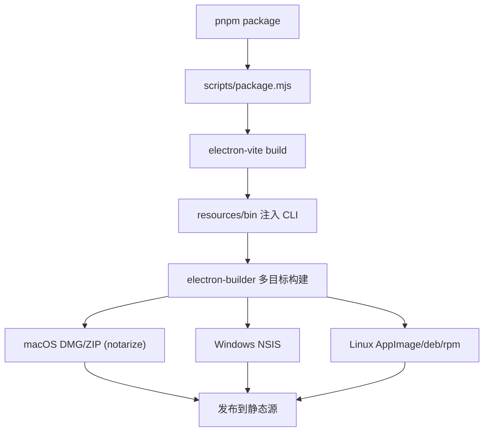

# 桌面应用架构

<cite>
**本文引用的文件**
- [apps/desktop/package.json](file://apps/desktop/package.json)
- [apps/desktop/electron.vite.config.ts](file://apps/desktop/electron.vite.config.ts)
- [apps/desktop/electron-builder.yml](file://apps/desktop/electron-builder.yml)
- [apps/desktop/src/main/index.ts](file://apps/desktop/src/main/index.ts)
- [apps/desktop/src/preload/index.ts](file://apps/desktop/src/preload/index.ts)
- [apps/desktop/src/main/updater.ts](file://apps/desktop/src/main/updater.ts)
- [apps/desktop/src/main/daemon-manager.ts](file://apps/desktop/src/main/daemon-manager.ts)
- [apps/desktop/src/main/renderer-web-preferences.ts](file://apps/desktop/src/main/renderer-web-preferences.ts)
- [apps/desktop/src/shared/main-renderer-messages.ts](file://apps/desktop/src/shared/main-renderer-messages.ts)
- [apps/desktop/src/shared/runtime-config.ts](file://apps/desktop/src/shared/runtime-config.ts)
- [apps/desktop/src/main/notification-gate.ts](file://apps/desktop/src/main/notification-gate.ts)
- [apps/desktop/src/main/external-url.ts](file://apps/desktop/src/main/external-url.ts)
- [apps/desktop/scripts/dev.mjs](file://apps/desktop/scripts/dev.mjs)
- [apps/desktop/scripts/package.mjs](file://apps/desktop/scripts/package.mjs)
</cite>

## 目录
1. [简介](#简介)
2. [项目结构](#项目结构)
3. [核心组件](#核心组件)
4. [架构总览](#架构总览)
5. [详细组件分析](#详细组件分析)
6. [依赖关系分析](#依赖关系分析)
7. [性能与内存管理](#性能与内存管理)
8. [打包与发布流程](#打包与发布流程)
9. [安全最佳实践](#安全最佳实践)
10. [故障排查指南](#故障排查指南)
11. [结论](#结论)

## 简介
本文件面向 Multica 桌面端（Electron + Vite）的架构设计与实现，聚焦主进程与渲染进程的通信、预加载脚本的安全隔离、系统集成能力（文件系统、原生对话框、通知、自动更新）、多窗口管理、IPC 模式、内存与性能优化、打包发布（electron-builder 配置、跨平台构建、签名验证），以及安全实践与调试技巧。文档以仓库源码为依据，提供可追溯的文件级引用与图示。

## 项目结构
Multica 桌面端位于 apps/desktop，采用 Electron 主进程 + Vite 渲染工程的双入口模式：
- 主进程：负责应用生命周期、窗口管理、系统能力桥接、自动更新、守护进程（Daemon）协调、通知门控、外部链接安全放行等。
- 预加载脚本：在沙箱中运行，通过 contextBridge 暴露最小化 API 给渲染进程，屏蔽底层 IPC。
- 渲染进程：基于 React/Vite/Tailwind，使用 Zustand/TanStack Query 进行状态与服务端数据管理。
- 共享类型：main 与 preload 之间通过 shared 模块定义消息通道与类型契约，确保强类型 IPC。

**图表来源**
- [apps/desktop/src/main/index.ts:1-800](file://apps/desktop/src/main/index.ts#L1-L800)
- [apps/desktop/src/preload/index.ts:1-347](file://apps/desktop/src/preload/index.ts#L1-L347)
- [apps/desktop/src/main/updater.ts:1-275](file://apps/desktop/src/main/updater.ts#L1-L275)
- [apps/desktop/src/main/daemon-manager.ts:1-800](file://apps/desktop/src/main/daemon-manager.ts#L1-L800)
- [apps/desktop/src/main/notification-gate.ts:1-60](file://apps/desktop/src/main/notification-gate.ts#L1-L60)
- [apps/desktop/src/main/external-url.ts:1-52](file://apps/desktop/src/main/external-url.ts#L1-L52)
- [apps/desktop/src/shared/main-renderer-messages.ts:1-121](file://apps/desktop/src/shared/main-renderer-messages.ts#L1-L121)
- [apps/desktop/src/shared/runtime-config.ts:1-180](file://apps/desktop/src/shared/runtime-config.ts#L1-L180)

**章节来源**
- [apps/desktop/package.json:1-82](file://apps/desktop/package.json#L1-L82)
- [apps/desktop/electron.vite.config.ts:1-36](file://apps/desktop/electron.vite.config.ts#L1-L36)

## 核心组件
- 主进程入口与窗口管理：创建主窗口与问题详情专用窗口，统一注入 webPreferences、导航守卫、快捷键、下载保存对话框、崩溃恢复与诊断、路由上下文同步等。
- 预加载脚本：在沙箱内暴露 desktopAPI/daemonAPI/updater 等最小接口，封装 IPC 调用，保证渲染进程无法直接访问 Node/Electron 敏感 API。
- 自动更新：基于 electron-updater，支持后台静默下载、周期检查、手动检查、偏好设置持久化、跨架构通道选择。
- 守护进程协调：负责 CLI 发现/安装、健康探测、令牌交换（JWT→PAT）、用户切换重启、版本匹配与延迟重启、日志尾随等。
- 通知门控：集中判定是否展示系统通知，避免重复与前台干扰。
- 外部链接安全：统一白名单校验 http/https，禁止任意协议打开或下载。
- 运行时配置：解析并校验 desktop.json/环境变量，导出 apiUrl/wsUrl/appUrl，供主/预加载/渲染一致消费。

**章节来源**
- [apps/desktop/src/main/index.ts:1-800](file://apps/desktop/src/main/index.ts#L1-L800)
- [apps/desktop/src/preload/index.ts:1-347](file://apps/desktop/src/preload/index.ts#L1-L347)
- [apps/desktop/src/main/updater.ts:1-275](file://apps/desktop/src/main/updater.ts#L1-L275)
- [apps/desktop/src/main/daemon-manager.ts:1-800](file://apps/desktop/src/main/daemon-manager.ts#L1-L800)
- [apps/desktop/src/main/notification-gate.ts:1-60](file://apps/desktop/src/main/notification-gate.ts#L1-L60)
- [apps/desktop/src/main/external-url.ts:1-52](file://apps/desktop/src/main/external-url.ts#L1-L52)
- [apps/desktop/src/shared/runtime-config.ts:1-180](file://apps/desktop/src/shared/runtime-config.ts#L1-L180)

## 架构总览
下图展示了从渲染进程到主进程再到系统能力的调用链路与职责边界。

**图表来源**
- [apps/desktop/src/preload/index.ts:103-330](file://apps/desktop/src/preload/index.ts#L103-L330)
- [apps/desktop/src/main/index.ts:652-799](file://apps/desktop/src/main/index.ts#L652-L799)
- [apps/desktop/src/main/updater.ts:112-275](file://apps/desktop/src/main/updater.ts#L112-L275)
- [apps/desktop/src/main/daemon-manager.ts:643-763](file://apps/desktop/src/main/daemon-manager.ts#L643-L763)
- [apps/desktop/src/main/notification-gate.ts:1-60](file://apps/desktop/src/main/notification-gate.ts#L1-L60)
- [apps/desktop/src/main/external-url.ts:1-52](file://apps/desktop/src/main/external-url.ts#L1-L52)

## 详细组件分析

### 主进程与渲染进程通信（IPC）
- 通道模型：通过 shared 模块声明受管通道列表与类型，预加载侧订阅时上报 ready 状态，主进程维护队列，确保深链/快捷键等事件在监听就绪后投递。
- 同步/异步：关键初始化信息（appInfo、runtimeConfig）使用 sendSync 在预加载阶段获取，避免竞态；业务交互使用 invoke/on。
- 安全边界：所有渲染可控的外部 URL 必须经过 openExternalSafely/downloadURLSafely 白名单校验；窗口打开由 setWindowOpenHandler 拦截并转发至安全函数。

**图表来源**
- [apps/desktop/src/shared/main-renderer-messages.ts:1-121](file://apps/desktop/src/shared/main-renderer-messages.ts#L1-L121)
- [apps/desktop/src/preload/index.ts:83-101](file://apps/desktop/src/preload/index.ts#L83-L101)
- [apps/desktop/src/main/index.ts:176-183](file://apps/desktop/src/main/index.ts#L176-L183)

**章节来源**
- [apps/desktop/src/shared/main-renderer-messages.ts:1-121](file://apps/desktop/src/shared/main-renderer-messages.ts#L1-L121)
- [apps/desktop/src/preload/index.ts:83-101](file://apps/desktop/src/preload/index.ts#L83-L101)
- [apps/desktop/src/main/index.ts:155-183](file://apps/desktop/src/main/index.ts#L155-L183)

### 预加载脚本的安全隔离
- 沙箱启用：webPreferences.sandbox=true，preload 仅允许 require electron 与少量内置模块，因此 @electron-toolkit/preload 被打包进 preload 输出。
- 最小暴露：contextBridge.exposeInMainWorld 仅暴露 desktopAPI/daemonAPI/updater，不暴露 Node/Electron 内部对象。
- 同步初始化：在预加载阶段读取 appInfo/runtimeConfig/systemLocale，确保首次请求携带正确头信息。

**章节来源**
- [apps/desktop/src/main/renderer-web-preferences.ts:16-65](file://apps/desktop/src/main/renderer-web-preferences.ts#L16-L65)
- [apps/desktop/electron.vite.config.ts:10-18](file://apps/desktop/electron.vite.config.ts#L10-L18)
- [apps/desktop/src/preload/index.ts:35-81](file://apps/desktop/src/preload/index.ts#L35-L81)
- [apps/desktop/src/preload/index.ts:332-347](file://apps/desktop/src/preload/index.ts#L332-L347)

### 多窗口管理与路由上下文
- 主窗口与问题详情窗口：统一通过 createWindow/createIssueWindow 创建，注入相同的安全 webPreferences 与恢复处理。
- 路由上下文：通过 RENDERER_ROUTE_CONTEXT_CHANNEL 将渲染侧内存路由上报主进程，用于崩溃恢复与诊断。
- 会话协调：AuthSessionCoordinator 根据主/子窗口的认证状态关闭过期会话窗口，避免凭证泄露。

**章节来源**
- [apps/desktop/src/main/index.ts:283-542](file://apps/desktop/src/main/index.ts#L283-L542)
- [apps/desktop/src/main/index.ts:722-764](file://apps/desktop/src/main/index.ts#L722-L764)

### 自动更新机制
- 后台静默：autoDownload=true，autoInstallOnAppQuit=true，减少用户干预。
- 周期检查：启动延时 + 每小时轮询，支持开关偏好。
- 跨架构通道：Windows arm64 与 macOS x64 使用独立 channel，避免元数据冲突。
- 事件透传：update-available/download-progress/update-downloaded 推送到渲染 UI。

**章节来源**
- [apps/desktop/src/main/updater.ts:14-52](file://apps/desktop/src/main/updater.ts#L14-L52)
- [apps/desktop/src/main/updater.ts:112-196](file://apps/desktop/src/main/updater.ts#L112-L196)
- [apps/desktop/src/main/updater.ts:208-275](file://apps/desktop/src/main/updater.ts#L208-L275)

### 守护进程集成（CLI/Daemon）
- CLI 发现优先级：内置 → 用户数据目录 → PATH，支持并发去重与缓存。
- 健康探测：按 profile 端口轮询 /health，识别 starting/running/stopped/auth_expired。
- 令牌交换：用 JWT 换取长期 PAT 写入 profile config，用户切换时重启守护以确保内存 token 一致。
- 版本匹配：比较运行守护 cli_version 与本地 CLI 版本，必要时延迟重启直到无活跃任务。
- 日志流：支持 start/stop 日志尾随与 onLogLine 事件推送。

**章节来源**
- [apps/desktop/src/main/daemon-manager.ts:420-564](file://apps/desktop/src/main/daemon-manager.ts#L420-L564)
- [apps/desktop/src/main/daemon-manager.ts:583-641](file://apps/desktop/src/main/daemon-manager.ts#L583-L641)
- [apps/desktop/src/main/daemon-manager.ts:643-763](file://apps/desktop/src/main/daemon-manager.ts#L643-L763)
- [apps/desktop/src/preload/index.ts:253-301](file://apps/desktop/src/preload/index.ts#L253-L301)

### 通知系统与门控
- 主进程权威：只有主进程能判断是否有任意窗口在前台，避免重复通知。
- 去重策略：seenItemIds 集合限制最大记录数，防止无限增长。
- 载荷校验：字段长度与必填项严格校验，非法载荷直接丢弃。

**章节来源**
- [apps/desktop/src/main/notification-gate.ts:1-60](file://apps/desktop/src/main/notification-gate.ts#L1-L60)
- [apps/desktop/src/main/index.ts:776-800](file://apps/desktop/src/main/index.ts#L776-L800)

### 系统集成能力
- 外部链接与下载：统一通过 external-url 白名单校验 http/https，禁止任意协议。
- 文件选择与目录校验：通过 local-directory 相关 IPC 暴露 pickDirectory/validateLocalDirectory。
- 原生对话框：下载保存对话框、崩溃恢复提示等。
- 协议注册：multica:// 深度链接，支持 auth/callback 与 invite 场景。

**章节来源**
- [apps/desktop/src/main/external-url.ts:1-52](file://apps/desktop/src/main/external-url.ts#L1-L52)
- [apps/desktop/src/main/index.ts:573-615](file://apps/desktop/src/main/index.ts#L573-L615)
- [apps/desktop/src/preload/index.ts:208-213](file://apps/desktop/src/preload/index.ts#L208-L213)

## 依赖关系分析
- 构建工具链：electron-vite 分别构建 main/preload/renderer，preload 必须内联 @electron-toolkit/preload 以满足 sandbox 环境。
- 运行时依赖：electron-updater、@electron-toolkit/utils、fix-path 等。
- 包管理器与工作区：workspace:* 引用 core/ui/views，便于复用 UI 与视图逻辑。

**图表来源**
- [apps/desktop/electron.vite.config.ts:1-36](file://apps/desktop/electron.vite.config.ts#L1-L36)
- [apps/desktop/electron-builder.yml:1-128](file://apps/desktop/electron-builder.yml#L1-L128)
- [apps/desktop/scripts/package.mjs:361-476](file://apps/desktop/scripts/package.mjs#L361-L476)

**章节来源**
- [apps/desktop/package.json:35-80](file://apps/desktop/package.json#L35-L80)
- [apps/desktop/electron.vite.config.ts:1-36](file://apps/desktop/electron.vite.config.ts#L1-L36)
- [apps/desktop/electron-builder.yml:1-128](file://apps/desktop/electron-builder.yml#L1-L128)

## 性能与内存管理
- 窗口状态持久化：resize/move/close 时保存尺寸/位置/最大化/全屏状态，减少启动开销与布局抖动。
- 消息队列：主进程对渲染通道消息进行排队与就绪控制，避免早期事件丢失。
- 资源释放：WeakSet 跟踪 session 避免重复注册下载处理器；WeakMap 存储 WebContents 路由上下文。
- 网络优化：开发模式下移除 Origin 头以兼容后端白名单；WebSocket 连接保持单实例。
- 守护进程健康探测：超时控制与重试，避免阻塞 UI。

**章节来源**
- [apps/desktop/src/main/index.ts:293-347](file://apps/desktop/src/main/index.ts#L293-L347)
- [apps/desktop/src/main/index.ts:65-79](file://apps/desktop/src/main/index.ts#L65-L79)
- [apps/desktop/src/main/index.ts:143-146](file://apps/desktop/src/main/index.ts#L143-L146)
- [apps/desktop/src/main/index.ts:356-364](file://apps/desktop/src/main/index.ts#L356-L364)
- [apps/desktop/src/main/daemon-manager.ts:186-203](file://apps/desktop/src/main/daemon-manager.ts#L186-L203)

## 打包与发布流程
- 版本推导：scripts/package.mjs 通过 git describe 生成 semver 兼容版本，注入 electron-builder extraMetadata.version。
- 构建矩阵：支持 --all-platforms 或在 macOS 主机上并行构建 mac/win/linux 多架构产物。
- CLI 捆绑：为每个目标平台编译 Go CLI 放入 resources/bin，优先使用内置二进制以保证与 TS 侧同步。
- 排除规则：electron-builder.yml 排除 dist/** 防止多架构交叉污染；asarUnpack 提取资源以便 Linux 图标路径解析。
- 签名与公证：macOS 开启 notarize；Windows/Linux 使用 nsis/AppImage/deb/rpm；publish 指向通用静态源。
- 更新通道：Windows arm64 与 macOS x64 使用独立 channel，客户端运行时根据平台/架构选择对应 feed。

**图表来源**
- [apps/desktop/scripts/package.mjs:361-476](file://apps/desktop/scripts/package.mjs#L361-L476)
- [apps/desktop/electron-builder.yml:1-128](file://apps/desktop/electron-builder.yml#L1-L128)
- [apps/desktop/src/main/updater.ts:20-52](file://apps/desktop/src/main/updater.ts#L20-L52)

**章节来源**
- [apps/desktop/scripts/package.mjs:1-486](file://apps/desktop/scripts/package.mjs#L1-L486)
- [apps/desktop/electron-builder.yml:1-128](file://apps/desktop/electron-builder.yml#L1-L128)
- [apps/desktop/src/main/updater.ts:20-52](file://apps/desktop/src/main/updater.ts#L20-L52)

## 安全最佳实践
- 上下文隔离：sandbox=true，contextIsolation=true（默认），nodeIntegration=false（默认）。
- 预加载最小暴露：仅暴露必要 API，屏蔽 Node/Electron 内部对象。
- 内容安全策略：webSecurity=false 为当前权衡（需迁移到自定义协议以恢复），但通过 setWindowOpenHandler 与外部链接白名单严格控制攻击面。
- 敏感数据处理：JWT→PAT 转换在主进程完成，仅传递 userId 与 token 摘要；profile 配置加密/权限由 OS 保护。
- 协议与外链：仅允许 http/https 打开或下载，其他协议一律拒绝。

**章节来源**
- [apps/desktop/src/main/renderer-web-preferences.ts:21-63](file://apps/desktop/src/main/renderer-web-preferences.ts#L21-L63)
- [apps/desktop/src/main/external-url.ts:1-52](file://apps/desktop/src/main/external-url.ts#L1-L52)
- [apps/desktop/src/main/index.ts:380-383](file://apps/desktop/src/main/index.ts#L380-L383)
- [apps/desktop/src/main/daemon-manager.ts:643-763](file://apps/desktop/src/main/daemon-manager.ts#L643-L763)

## 故障排查指南
- 渲染崩溃恢复：主进程记录冻结面包屑，下次启动渲染读取并上报；dev 模式转发 console/did-fail-load 到 dev log。
- 深链丢失：通过 MainRendererMessageQueue 等待渲染监听就绪再投递，避免竞态。
- 守护进程卡住：健康探测 + 令牌有效性探测，区分“starting”与“auth_expired”，引导重新登录。
- 更新失败：捕获 downloadPromise 异常并记录；手动检查返回 current/latest/available 三要素。
- 多工作树冲突：dev 脚本注入 DESKTOP_APP_SUFFIX 与 DESKTOP_RENDERER_PORT，避免锁与端口冲突。

**章节来源**
- [apps/desktop/src/main/index.ts:389-453](file://apps/desktop/src/main/index.ts#L389-L453)
- [apps/desktop/src/shared/main-renderer-messages.ts:68-121](file://apps/desktop/src/shared/main-renderer-messages.ts#L68-L121)
- [apps/desktop/src/main/daemon-manager.ts:318-418](file://apps/desktop/src/main/daemon-manager.ts#L318-L418)
- [apps/desktop/src/main/updater.ts:83-110](file://apps/desktop/src/main/updater.ts#L83-L110)
- [apps/desktop/scripts/dev.mjs:1-54](file://apps/desktop/scripts/dev.mjs#L1-L54)

## 结论
Multica 桌面端采用清晰的 Electron + Vite 分层架构：主进程专注系统能力与安全边界，预加载脚本作为最小化桥接层，渲染进程专注于 UI 与业务逻辑。通过严格的 IPC 通道治理、沙箱隔离、外部链接白名单、通知门控与守护进程协调，实现了高安全、高可用的桌面体验。打包发布流程覆盖多平台与签名公证，自动更新机制兼顾用户体验与稳定性。建议后续逐步将 webSecurity 恢复为 true，并通过自定义协议承载渲染资源，进一步收敛攻击面。