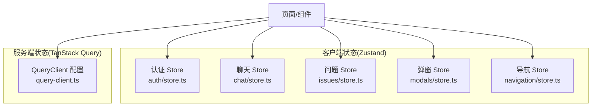
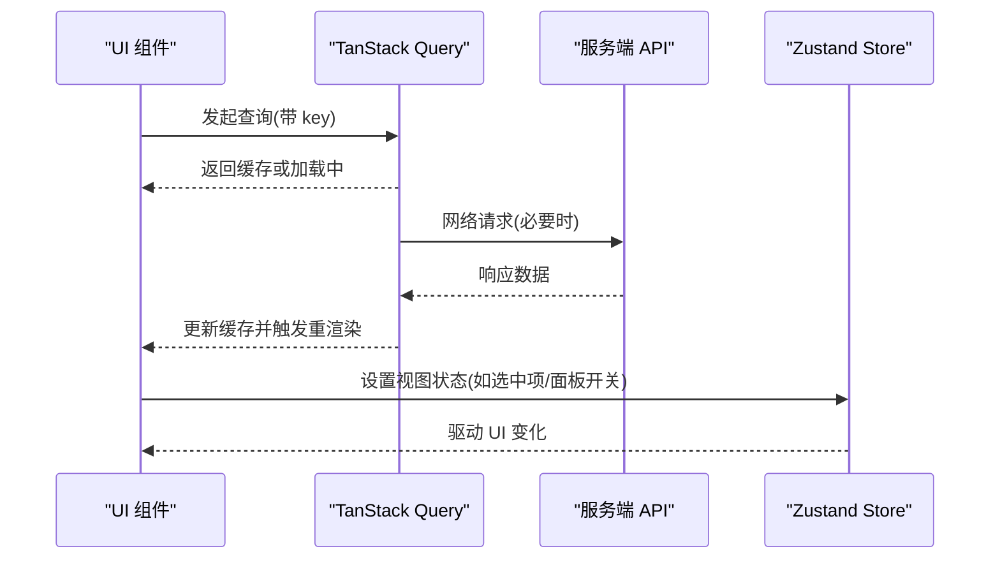
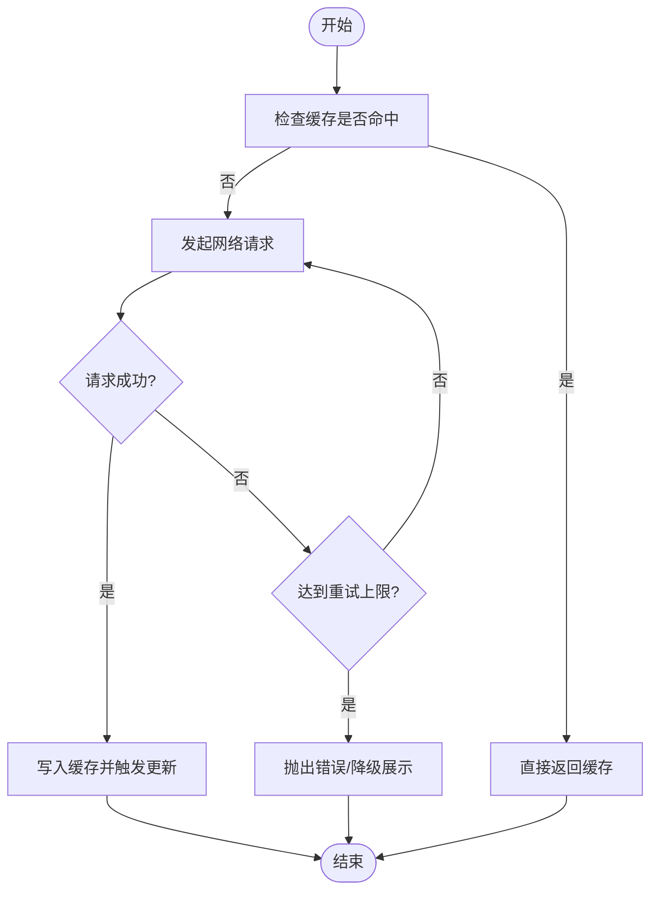
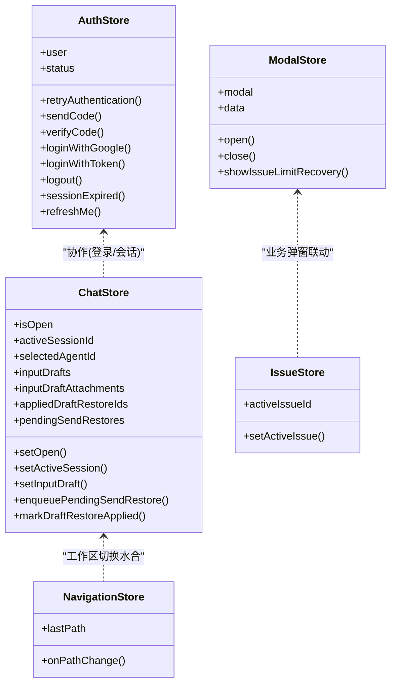
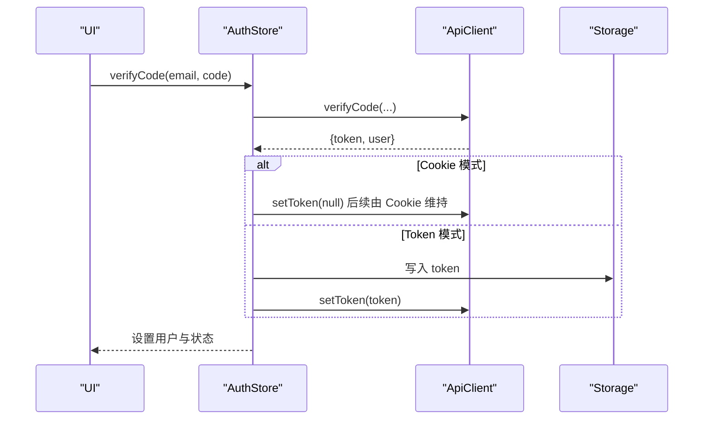
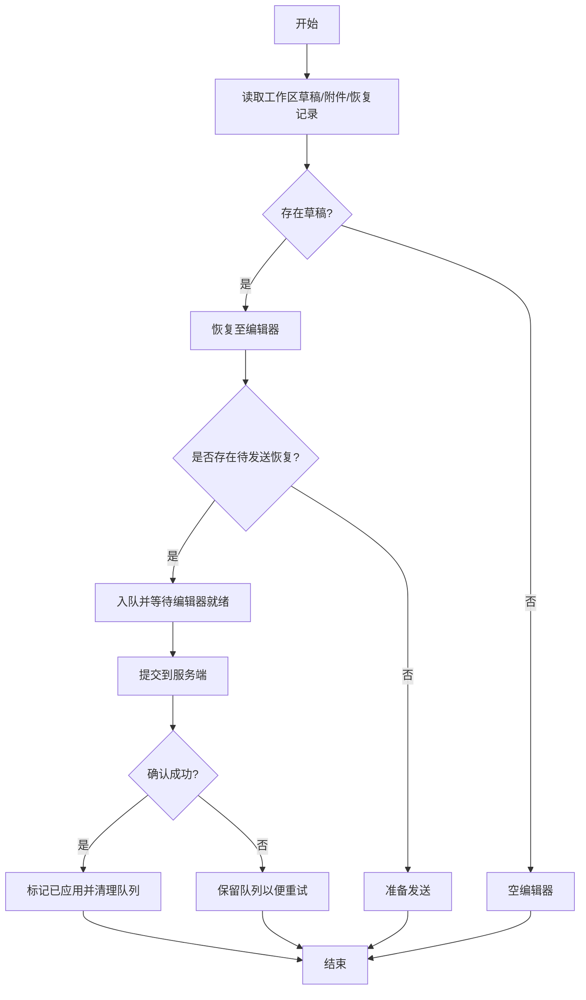
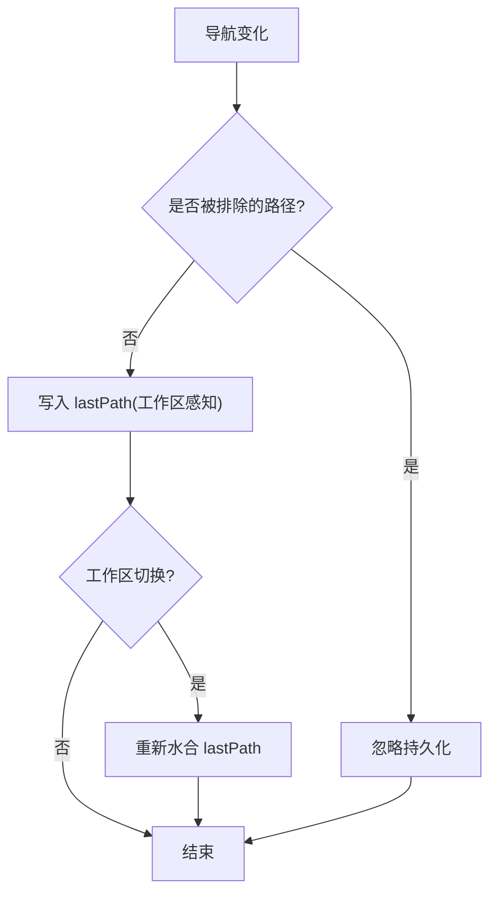
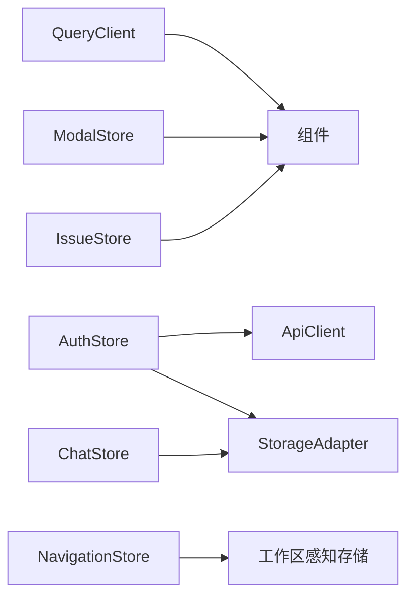

# 状态管理策略

<cite>
**本文引用的文件**
- [packages/core/query-client.ts](file://packages/core/query-client.ts)
- [packages/core/auth/store.ts](file://packages/core/auth/store.ts)
- [packages/core/chat/store.ts](file://packages/core/chat/store.ts)
- [packages/core/issues/store.ts](file://packages/core/issues/store.ts)
- [packages/core/modals/store.ts](file://packages/core/modals/store.ts)
- [packages/core/navigation/store.ts](file://packages/core/navigation/store.ts)
</cite>

## 目录
1. [简介](#简介)
2. [项目结构](#项目结构)
3. [核心组件](#核心组件)
4. [架构总览](#架构总览)
5. [详细组件分析](#详细组件分析)
6. [依赖关系分析](#依赖关系分析)
7. [性能考虑](#性能考虑)
8. [故障排查指南](#故障排查指南)
9. [结论](#结论)
10. [附录](#附录)

## 简介
本文件系统化阐述 Multica 的前端状态管理策略：TanStack Query 独占服务端状态，Zustand 独占客户端/视图状态。围绕数据获取、缓存与重试、乐观更新、错误处理、持久化、实时同步与一致性保证等主题，给出可落地的模式与最佳实践，并配合图示帮助理解。

## 项目结构
- 服务端状态由 TanStack Query 统一管理，集中配置在 QueryClient 中，负责请求缓存、失效与重试策略。
- 客户端/视图状态由多个 Zustand store 分别承担：认证、聊天草稿与面板、问题（Issue）选择、弹窗控制、导航历史等。
- 所有共享的 Zustand store 位于 packages/core，遵循包边界约束，不引入平台特定实现。

**图表来源**
- [packages/core/query-client.ts:1-19](file://packages/core/query-client.ts#L1-L19)
- [packages/core/auth/store.ts:1-189](file://packages/core/auth/store.ts#L1-L189)
- [packages/core/chat/store.ts:1-686](file://packages/core/chat/store.ts#L1-L686)
- [packages/core/issues/store.ts:1-14](file://packages/core/issues/store.ts#L1-L14)
- [packages/core/modals/store.ts:1-51](file://packages/core/modals/store.ts#L1-L51)
- [packages/core/navigation/store.ts:1-50](file://packages/core/navigation/store.ts#L1-L50)

**章节来源**
- [packages/core/query-client.ts:1-19](file://packages/core/query-client.ts#L1-L19)
- [packages/core/auth/store.ts:1-189](file://packages/core/auth/store.ts#L1-L189)
- [packages/core/chat/store.ts:1-686](file://packages/core/chat/store.ts#L1-L686)
- [packages/core/issues/store.ts:1-14](file://packages/core/issues/store.ts#L1-L14)
- [packages/core/modals/store.ts:1-51](file://packages/core/modals/store.ts#L1-L51)
- [packages/core/navigation/store.ts:1-50](file://packages/core/navigation/store.ts#L1-L50)

## 核心组件
- TanStack Query 客户端：统一配置默认查询与变更行为（如 staleTime、gcTime、refetchOnReconnect、重试次数）。
- 认证 Store：维护登录态、用户信息、会话过期处理、Token 持久化与清理。
- 聊天 Store：维护会话选择、草稿、附件上传协调、面板尺寸与展开偏好、恢复队列与已应用恢复记录。
- 问题 Store：维护当前激活的问题 ID。
- 弹窗 Store：全局弹窗类型与数据承载。
- 导航 Store：记录最近访问路径，支持工作区感知持久化。

**章节来源**
- [packages/core/query-client.ts:1-19](file://packages/core/query-client.ts#L1-L19)
- [packages/core/auth/store.ts:1-189](file://packages/core/auth/store.ts#L1-L189)
- [packages/core/chat/store.ts:1-686](file://packages/core/chat/store.ts#L1-L686)
- [packages/core/issues/store.ts:1-14](file://packages/core/issues/store.ts#L1-L14)
- [packages/core/modals/store.ts:1-51](file://packages/core/modals/store.ts#L1-L51)
- [packages/core/navigation/store.ts:1-50](file://packages/core/navigation/store.ts#L1-L50)

## 架构总览
分层职责清晰：
- 服务端状态：由 TanStack Query 负责数据获取、缓存、失效与重试；组件通过 hooks 订阅，避免将服务端数据镜像到 store。
- 客户端/视图状态：Zustand store 仅保存界面与交互所需的状态（如选中项、面板开关、弹窗、导航历史），必要时与 Query 结果协同。

**图表来源**
- [packages/core/query-client.ts:1-19](file://packages/core/query-client.ts#L1-L19)
- [packages/core/auth/store.ts:1-189](file://packages/core/auth/store.ts#L1-L189)
- [packages/core/chat/store.ts:1-686](file://packages/core/chat/store.ts#L1-L686)

## 详细组件分析

### TanStack Query 使用模式
- 数据获取：通过 QueryClient 默认配置，启用连接后自动 refetch、合理的垃圾回收时间与最小重试次数，降低重复请求与内存占用。
- 缓存策略：以查询 key 为粒度缓存，结合 staleTime/gcTime 控制新鲜度与生命周期。
- 乐观更新：在 mutation 前本地先更新视图状态（例如聊天输入、面板开关），成功后再同步服务端；失败时回滚。
- 错误重试：mutation 默认关闭自动重试，避免幂等性风险；查询可按需开启重试。

**图表来源**
- [packages/core/query-client.ts:1-19](file://packages/core/query-client.ts#L1-L19)

**章节来源**
- [packages/core/query-client.ts:1-19](file://packages/core/query-client.ts#L1-L19)

### Zustand Store 设计
- 全局状态：认证、弹窗、导航历史等跨页面共享。
- 局部状态：聊天面板开关、尺寸、展开状态、活跃会话等。
- 状态持久化：
  - 认证 Token：根据模式使用 HttpOnly Cookie 或 localStorage。
  - 聊天草稿与附件：按工作区隔离存储，支持迁移与清理。
  - 导航历史：工作区感知的持久化，排除敏感路由。
- 状态同步机制：
  - 工作区切换时重新水合（rehydration）相关状态。
  - 聊天“无服务器副本”的恢复队列确保中断后可恢复。
  - 已应用恢复记录防止重复投递。

**图表来源**
- [packages/core/auth/store.ts:1-189](file://packages/core/auth/store.ts#L1-L189)
- [packages/core/chat/store.ts:1-686](file://packages/core/chat/store.ts#L1-L686)
- [packages/core/modals/store.ts:1-51](file://packages/core/modals/store.ts#L1-L51)
- [packages/core/navigation/store.ts:1-50](file://packages/core/navigation/store.ts#L1-L50)
- [packages/core/issues/store.ts:1-14](file://packages/core/issues/store.ts#L1-L14)

#### 认证流程（序列图）

**图表来源**
- [packages/core/auth/store.ts:71-108](file://packages/core/auth/store.ts#L71-L108)

**章节来源**
- [packages/core/auth/store.ts:1-189](file://packages/core/auth/store.ts#L1-L189)

#### 聊天草稿与恢复（流程图）

**图表来源**
- [packages/core/chat/store.ts:78-268](file://packages/core/chat/store.ts#L78-L268)
- [packages/core/chat/store.ts:443-495](file://packages/core/chat/store.ts#L443-L495)

**章节来源**
- [packages/core/chat/store.ts:1-686](file://packages/core/chat/store.ts#L1-L686)

#### 导航历史持久化（流程图）

**图表来源**
- [packages/core/navigation/store.ts:11-50](file://packages/core/navigation/store.ts#L11-L50)

**章节来源**
- [packages/core/navigation/store.ts:1-50](file://packages/core/navigation/store.ts#L1-L50)

## 依赖关系分析
- QueryClient 提供统一的查询/变更默认行为，被各功能模块复用。
- AuthStore 依赖 ApiClient 与 StorageAdapter，负责认证生命周期与会话清理。
- ChatStore 依赖 StorageAdapter 与工作区水合机制，管理草稿、附件上传与恢复队列。
- NavigationStore 使用 zustand/middleware 的 persist 与工作区感知存储，保障跨工作区的导航历史隔离。
- IssueStore 与 ModalStore 为轻量级视图状态，服务于具体业务场景。

**图表来源**
- [packages/core/query-client.ts:1-19](file://packages/core/query-client.ts#L1-L19)
- [packages/core/auth/store.ts:1-189](file://packages/core/auth/store.ts#L1-L189)
- [packages/core/chat/store.ts:1-686](file://packages/core/chat/store.ts#L1-L686)
- [packages/core/navigation/store.ts:1-50](file://packages/core/navigation/store.ts#L1-L50)
- [packages/core/modals/store.ts:1-51](file://packages/core/modals/store.ts#L1-L51)
- [packages/core/issues/store.ts:1-14](file://packages/core/issues/store.ts#L1-L14)

**章节来源**
- [packages/core/query-client.ts:1-19](file://packages/core/query-client.ts#L1-L19)
- [packages/core/auth/store.ts:1-189](file://packages/core/auth/store.ts#L1-L189)
- [packages/core/chat/store.ts:1-686](file://packages/core/chat/store.ts#L1-L686)
- [packages/core/navigation/store.ts:1-50](file://packages/core/navigation/store.ts#L1-L50)
- [packages/core/modals/store.ts:1-51](file://packages/core/modals/store.ts#L1-L51)
- [packages/core/issues/store.ts:1-14](file://packages/core/issues/store.ts#L1-L14)

## 性能考虑
- 状态选择器：在组件层按需订阅 store 的最小切片，减少不必要重渲染。
- 懒加载：对非首屏状态（如聊天面板内容、详情数据）延迟初始化或按需拉取。
- 内存管理：
  - QueryClient 的 gcTime 控制缓存存活时间，避免长期驻留。
  - 聊天草稿与附件按工作区隔离，定期清理空条目与失败上传。
  - 导航历史排除敏感路径，减少无效持久化。
- 并发与冲突：
  - 聊天恢复队列按会话隔离，FIFO 顺序保证一致性。
  - 已应用恢复记录去重，避免重复投递导致的数据不一致。

[本节为通用指导，不直接分析具体文件]

## 故障排查指南
- 认证异常：
  - 401 时调用 sessionExpired，清理本地 token 与 workspace 信息，重置分析标识，进入未认证状态。
  - 若使用 Cookie 模式，服务端登出会清除 HttpOnly Cookie；否则需手动移除本地 token。
- 聊天草稿丢失：
  - 检查工作区切换时的 rehydration 是否触发，确认存储键是否按工作区隔离。
  - 查看 pending send restores 队列是否被正确入队/出队，以及 applied restore ledger 是否及时清理。
- 导航历史异常：
  - 确认 onPathChange 是否正确过滤排除路径，并在工作区切换时重新水合。

**章节来源**
- [packages/core/auth/store.ts:128-177](file://packages/core/auth/store.ts#L128-L177)
- [packages/core/chat/store.ts:443-495](file://packages/core/chat/store.ts#L443-L495)
- [packages/core/navigation/store.ts:30-50](file://packages/core/navigation/store.ts#L30-L50)

## 结论
Multica 采用“TanStack Query 独占服务端状态、Zustand 独占客户端/视图状态”的分层策略，职责清晰、扩展性强。通过工作区感知的持久化、恢复队列与已应用记录，保证了复杂交互下的一致性；通过合理的缓存与重试策略，兼顾了性能与可靠性。建议在新功能开发中继续遵循该分层原则，优先使用 Query 管理服务端数据，仅在必要处使用 Zustand 管理视图与交互状态。

## 附录
- 最佳实践清单
  - 服务端数据一律走 Query，不要复制到 store。
  - 视图状态尽量细粒度拆分 store，便于测试与维护。
  - 持久化键按工作区隔离，避免跨工作区污染。
  - 对幂等写操作谨慎开启自动重试；非幂等操作关闭重试并明确错误处理。
  - 使用选择器订阅最小状态切片，避免全量重渲染。
  - 对大对象或列表进行分页/虚拟滚动，结合 gcTime 控制内存。
  - 对关键路径（如登录、发送消息）增加日志与埋点，便于定位问题。

[本节为通用指导，不直接分析具体文件]