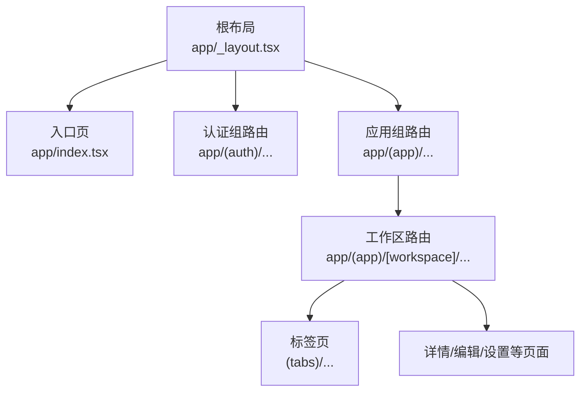
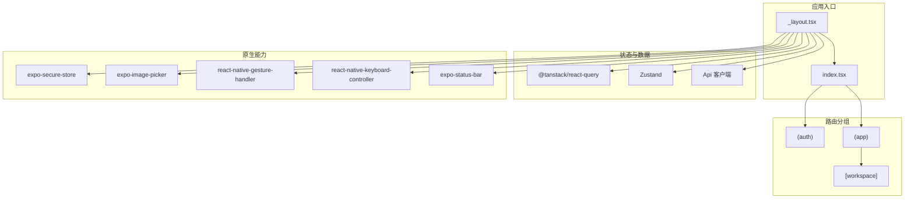
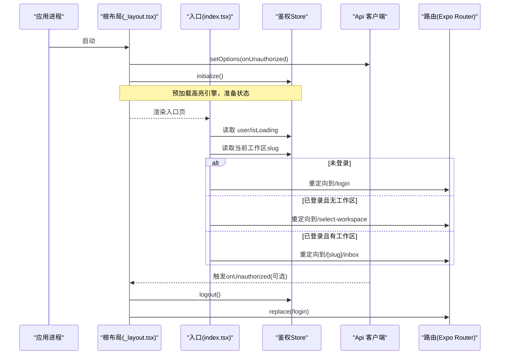
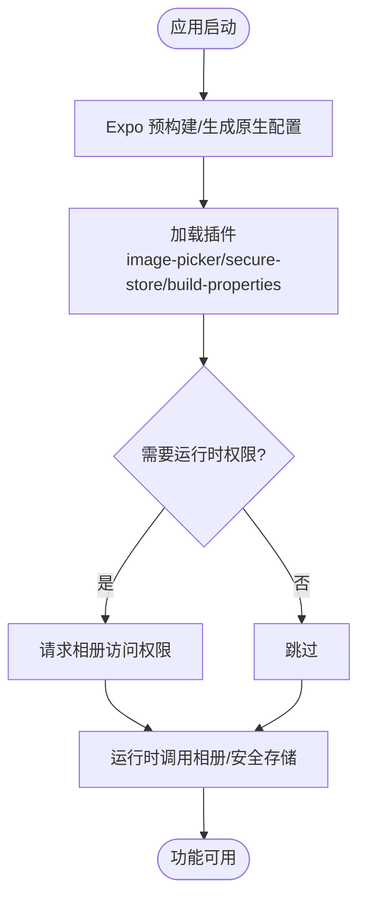
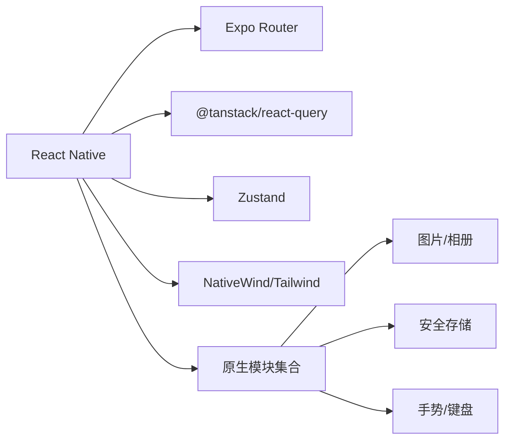

# 移动应用架构

<cite>
**本文引用的文件**
- [apps/mobile/package.json](file://apps/mobile/package.json)
- [apps/mobile/app.config.ts](file://apps/mobile/app.config.ts)
- [apps/mobile/README.md](file://apps/mobile/README.md)
- [apps/mobile/app/_layout.tsx](file://apps/mobile/app/_layout.tsx)
- [apps/mobile/app/index.tsx](file://apps/mobile/app/index.tsx)
- [apps/mobile/app/(app)/_layout.tsx](file://apps/mobile/app/(app)/_layout.tsx)
</cite>

## 目录
1. [简介](#简介)
2. [项目结构](#项目结构)
3. [核心组件](#核心组件)
4. [架构总览](#架构总览)
5. [详细组件分析](#详细组件分析)
6. [依赖分析](#依赖分析)
7. [性能考虑](#性能考虑)
8. [故障排查指南](#故障排查指南)
9. [结论](#结论)
10. [附录](#附录)

## 简介
本文件面向 Multica 移动应用（基于 React Native + Expo）的架构与实现，聚焦以下目标：
- 应用入口结构与导航系统（Expo Router 路由分组、鉴权守卫、工作区路由）
- 原生模块集成（相机/相册、安全存储、状态栏、手势、键盘等）
- 跨平台适配策略（iOS/Android 差异、权限配置、签名与构建）
- 移动端状态管理（TanStack Query 服务端状态、Zustand 客户端状态、离线与持久化、网络优化）
- UI 组件库的移动端适配（触摸交互、响应式布局、动画）
- 发布流程（设备调试、模拟器、Release 包、版本管理与热更新思路）
- 最佳实践与调试方法

## 项目结构
移动应用位于 apps/mobile，采用 Expo Router 的文件路由组织方式，根布局负责全局上下文装配与鉴权初始化，子路由按功能域分组。

**图表来源**
- [apps/mobile/app/_layout.tsx:1-86](file://apps/mobile/app/_layout.tsx#L1-L86)
- [apps/mobile/app/index.tsx:1-31](file://apps/mobile/app/index.tsx#L1-L31)
- [apps/mobile/app/(app)/_layout.tsx:1-16](file://apps/mobile/app/(app)/_layout.tsx#L1-L16)

**章节来源**
- [apps/mobile/app/_layout.tsx:1-86](file://apps/mobile/app/_layout.tsx#L1-L86)
- [apps/mobile/app/index.tsx:1-31](file://apps/mobile/app/index.tsx#L1-L31)
- [apps/mobile/app/(app)/_layout.tsx:1-16](file://apps/mobile/app/(app)/_layout.tsx#L1-L16)

## 核心组件
- 根布局与全局上下文
  - 提供 GestureHandlerRootView、SafeAreaProvider、KeyboardProvider、QueryClientProvider、ThemeProvider、LightboxProvider、PortalHost
  - 在启动时预加载 Shiki 高亮引擎，避免首次渲染卡顿
  - 统一处理 401 未授权：登出、清空工作区、清理查询缓存并跳转到登录页
- 入口重定向
  - 根据用户登录态与工作区 slug 决定跳转至 /login、/select-workspace 或 /[slug]/inbox
- 应用组路由守卫
  - 无用户时重定向到 /login；工作区成员校验在更深层路由完成

**章节来源**
- [apps/mobile/app/_layout.tsx:20-58](file://apps/mobile/app/_layout.tsx#L20-L58)
- [apps/mobile/app/index.tsx:6-30](file://apps/mobile/app/index.tsx#L6-L30)
- [apps/mobile/app/(app)/_layout.tsx:4-15](file://apps/mobile/app/(app)/_layout.tsx#L4-L15)

## 架构总览
整体采用“分层 + 分组路由”的架构：
- 表现层：React Native + Expo Router + NativeWind/Tailwind
- 状态层：TanStack Query（服务端数据）、Zustand（客户端/视图状态）
- 数据层：封装的 ApiClient（共享实例），集中处理鉴权失败与错误
- 原生层：通过 Expo 插件与 RN 模块访问系统能力（相册、安全存储、状态栏、手势、键盘等）
- 构建与运行：Expo Dev Client（Debug 热重载）与 Release 独立包

**图表来源**
- [apps/mobile/app/_layout.tsx:1-86](file://apps/mobile/app/_layout.tsx#L1-L86)
- [apps/mobile/app/index.tsx:1-31](file://apps/mobile/app/index.tsx#L1-L31)
- [apps/mobile/app/(app)/_layout.tsx:1-16](file://apps/mobile/app/(app)/_layout.tsx#L1-L16)
- [apps/mobile/package.json:22-82](file://apps/mobile/package.json#L22-L82)

## 详细组件分析

### 应用入口与导航系统
- 根布局装配顺序：手势 → 安全区域 → 键盘 → 查询客户端 → 主题 → 鉴权初始化 → 灯箱/弹窗宿主 → 状态栏 → Stack 路由
- 鉴权初始化：
  - 在 Api 客户端上注册 onUnauthorized 回调，集中处理会话过期
  - 使用防重复登出的引用标记，避免并发 401 导致多次跳转
- 入口重定向逻辑：
  - 加载中显示 ActivityIndicator
  - 未登录 → /login
  - 已登录但无工作区 → /select-workspace
  - 已登录且有工作区 → /[slug]/inbox

**图表来源**
- [apps/mobile/app/_layout.tsx:26-58](file://apps/mobile/app/_layout.tsx#L26-L58)
- [apps/mobile/app/index.tsx:14-30](file://apps/mobile/app/index.tsx#L14-L30)

**章节来源**
- [apps/mobile/app/_layout.tsx:20-86](file://apps/mobile/app/_layout.tsx#L20-L86)
- [apps/mobile/app/index.tsx:1-31](file://apps/mobile/app/index.tsx#L1-L31)
- [apps/mobile/app/(app)/_layout.tsx:4-15](file://apps/mobile/app/(app)/_layout.tsx#L4-L15)

### 原生模块集成与权限
- 相册/图片选择：通过 expo-image-picker 插件注入 iOS 相册访问描述，禁用相机与麦克风权限
- 安全存储：expo-secure-store 用于敏感信息持久化（如 token）
- 状态栏：expo-status-bar 控制深色/浅色样式
- 手势与键盘：react-native-gesture-handler、react-native-keyboard-controller 提升交互体验
- 构建属性：expo-build-properties 指定从源码构建 React Native，便于调试与兼容性

**图表来源**
- [apps/mobile/app.config.ts:63-88](file://apps/mobile/app.config.ts#L63-L88)
- [apps/mobile/package.json:46-58](file://apps/mobile/package.json#L46-L58)

**章节来源**
- [apps/mobile/app.config.ts:1-93](file://apps/mobile/app.config.ts#L1-L93)
- [apps/mobile/package.json:22-82](file://apps/mobile/package.json#L22-L82)

### 跨平台适配策略（iOS/Android）
- 多环境变体：通过 APP_ENV 切换名称、Bundle Identifier、Scheme，支持 dev/staging/prod 共存
- iOS 专属：
  - supportsTablet 开启 iPad 多任务
  - appleTeamId 固定签名团队，避免非交互式终端选错身份
  - 不同变体的 bundleIdentifier 后缀隔离，防止冲突
  - 从源码构建 RN，便于问题定位
- Android 适配要点（通用建议）：
  - 使用 Platform 判断与条件导入，避免引入仅 iOS 可用的模块
  - 针对刘海屏/底部安全区使用 SafeAreaProvider
  - 键盘遮挡使用 KeyboardProvider 与滚动容器组合
  - 权限模型差异：Android 需在运行时申请相机/存储等权限，并在清单中声明

**章节来源**
- [apps/mobile/app.config.ts:12-62](file://apps/mobile/app.config.ts#L12-L62)
- [apps/mobile/package.json:46-88](file://apps/mobile/package.json#L46-L88)

### 状态管理在移动端的特殊考虑
- 服务端状态：由 TanStack Query 统一管理，适合列表、详情、分页、缓存与重试
- 客户端状态：Zustand 管理登录态、工作区、UI 临时状态；所有共享 store 应放在 packages/core（遵循项目约束）
- 离线支持：
  - 利用 Query 的 staleTime/gcTime 与本地缓存减少网络请求
  - 结合网络监听（@react-native-community/netinfo）做断网提示与请求重试
  - 对关键写操作进行队列化与失败重试
- 数据持久化：
  - 敏感数据使用 expo-secure-store
  - 非敏感配置可落盘（如上次工作区、主题偏好）
- 网络优化：
  - 合并请求、去抖/节流输入
  - 合理设置缓存策略与失效时间
  - 大列表使用 @shopify/flash-list 提升滚动性能

**章节来源**
- [apps/mobile/package.json:22-82](file://apps/mobile/package.json#L22-L82)
- [apps/mobile/app/_layout.tsx:26-58](file://apps/mobile/app/_layout.tsx#L26-L58)

### UI 组件库的移动端适配
- 触摸交互：手势处理器、长按、滑动删除、下拉刷新等
- 响应式设计：NativeWind/Tailwind 类名驱动布局，适配不同屏幕尺寸与方向
- 动画效果：react-native-reanimated 提供高性能动画；图片查看使用 react-native-image-viewing
- 代码高亮：Shiki 预加载引擎，首屏快速渲染代码块

**章节来源**
- [apps/mobile/package.json:42-82](file://apps/mobile/package.json#L42-L82)
- [apps/mobile/app/_layout.tsx:20-24](file://apps/mobile/app/_layout.tsx#L20-L24)

### 发布流程与版本管理
- 开发调试：
  - Debug 构建嵌入 expo-dev-launcher，每次启动探测 Metro 以拉取最新 JS，支持热重载
  - 模拟器构建更快，无需签名与 Provisioning
- 独立 Release 包：
  - 不依赖 Metro，Splash 直接进应用，适合分发与试用
- 版本与环境：
  - 通过 APP_ENV 切换后端地址与 Bundle ID
  - 生产环境需配置正确的 Apple Team 与 Bundle ID
- 热更新机制：
  - Debug 模式天然具备热重载
  - Release 模式可通过 EAS Update 等方案实现增量更新（本项目未内置，按需接入）

**章节来源**
- [apps/mobile/README.md:37-113](file://apps/mobile/README.md#L37-L113)
- [apps/mobile/app.config.ts:12-62](file://apps/mobile/app.config.ts#L12-L62)

## 依赖分析
- 运行时依赖
  - 路由与导航：expo-router、@react-navigation/*
  - 状态：@tanstack/react-query、zustand
  - 原生能力：expo-* 系列、react-native-* 系列
  - UI：nativewind、tailwindcss、@rn-primitives/*、@shopify/flash-list
- 构建与工具：babel、eslint、vitest、typescript

**图表来源**
- [apps/mobile/package.json:22-82](file://apps/mobile/package.json#L22-L82)

**章节来源**
- [apps/mobile/package.json:22-82](file://apps/mobile/package.json#L22-L82)

## 性能考虑
- 首屏优化：预加载 Shiki 高亮引擎，避免首次渲染阻塞
- 列表性能：使用 @shopify/flash-list 替代 FlatList，降低内存占用与掉帧
- 网络优化：合理设置 Query 缓存与失效策略，减少重复请求
- 原生桥接：尽量减少频繁的原生调用，批量处理
- 资源管理：图片压缩与懒加载，避免大图阻塞主线程

## 故障排查指南
- 401 未授权循环跳转
  - 现象：会话过期后反复触发 onUnauthorized
  - 解决：确保只执行一次登出与跳转，使用引用标记防重入
- 相册崩溃（iOS 14+）
  - 现象：调用相册硬崩溃
  - 解决：在 app.config.ts 中配置相册权限描述，并确保未启用相机/麦克风
- 签名与团队问题
  - 现象：Xcode 拒绝签名或绑定错误的团队
  - 解决：设置 EXPO_APPLE_TEAM_ID 与合适的 Bundle ID，必要时清理 ios/ 重新 prebuild
- 本地后端连通性
  - 现象：设备无法连接本机后端
  - 解决：使用局域网 IP 而非 localhost，确认 .env.* 中的 API 地址正确

**章节来源**
- [apps/mobile/app/_layout.tsx:26-58](file://apps/mobile/app/_layout.tsx#L26-L58)
- [apps/mobile/app.config.ts:63-88](file://apps/mobile/app.config.ts#L63-L88)
- [apps/mobile/README.md:19-33](file://apps/mobile/README.md#L19-L33)
- [apps/mobile/README.md:106-113](file://apps/mobile/README.md#L106-L113)

## 结论
Multica 移动应用基于 Expo + React Native 构建了清晰的分层架构：根布局负责全局上下文与鉴权初始化，Expo Router 提供模块化路由，状态管理以 TanStack Query 与 Zustand 分工明确，原生能力通过 Expo 插件与 RN 模块稳定接入。通过多环境变体与脚本体系，实现了从开发调试到 Release 分发的完整闭环。建议在后续迭代中持续完善离线策略、网络重试与性能监控，以提升用户体验与稳定性。

## 附录
- 常用命令参考
  - 开发：pnpm dev:mobile（仅 Metro）
  - 模拟器：pnpm ios:mobile:staging（完整构建并安装到模拟器）
  - 真机调试：pnpm ios:mobile:device:staging（Debug 构建，支持热重载）
  - 独立包：pnpm ios:mobile:device:staging:release（Release 构建，无 Metro 依赖）
- 环境变量
  - APP_ENV：development/staging/production，影响名称、Bundle ID、Scheme
  - EXPO_BUNDLE_IDENTIFIER_*：覆盖对应环境的 Bundle ID
  - EXPO_APPLE_TEAM_ID：固定签名团队
  - EXPO_PUBLIC_API_URL：后端地址（各环境 .env.* 中配置）

**章节来源**
- [apps/mobile/README.md:37-113](file://apps/mobile/README.md#L37-L113)
- [apps/mobile/app.config.ts:12-62](file://apps/mobile/app.config.ts#L12-L62)