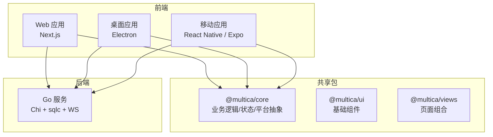
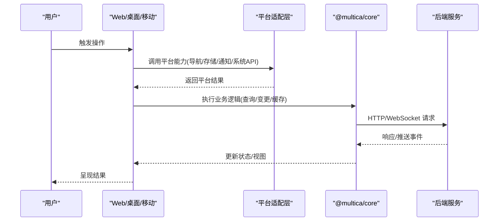
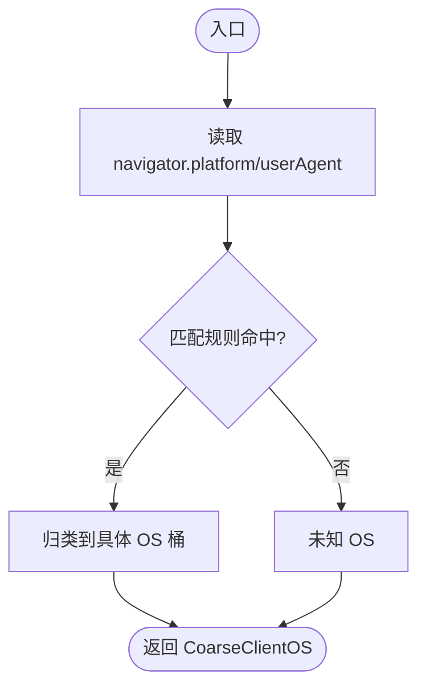
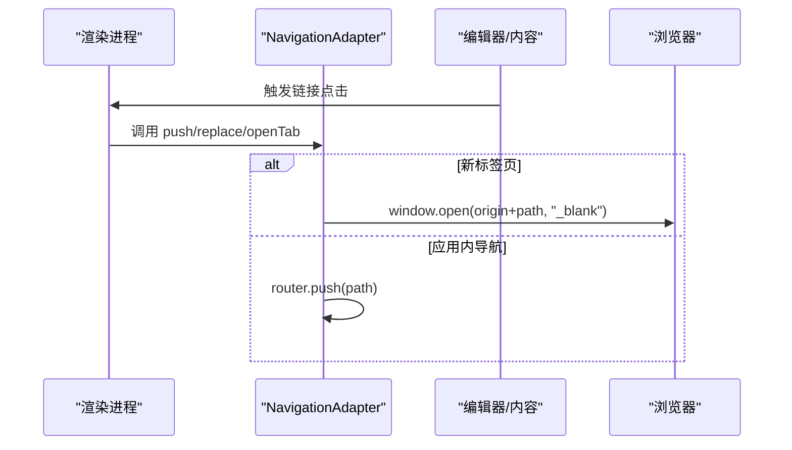
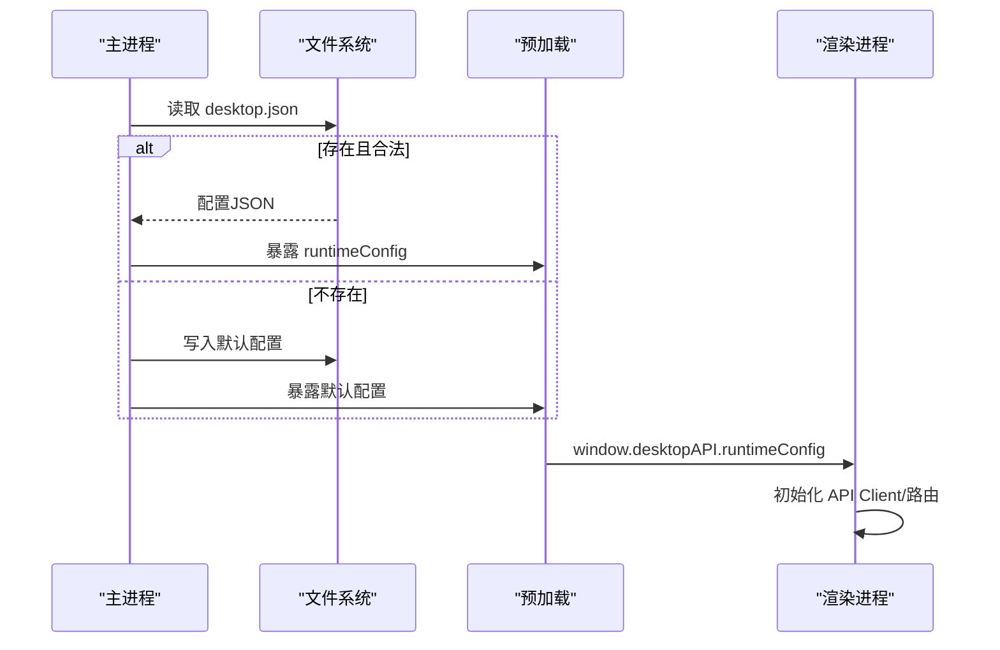
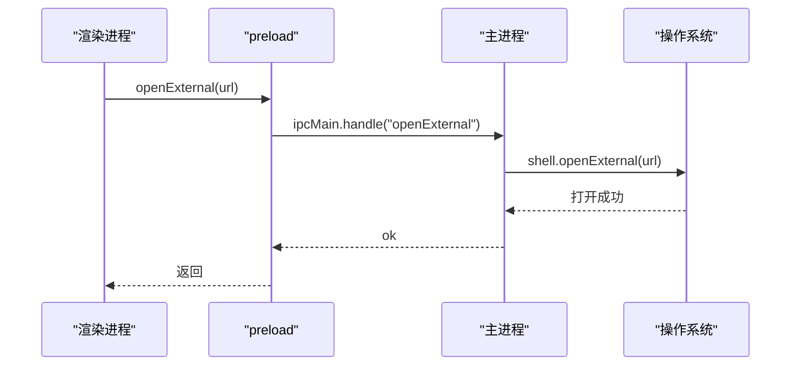
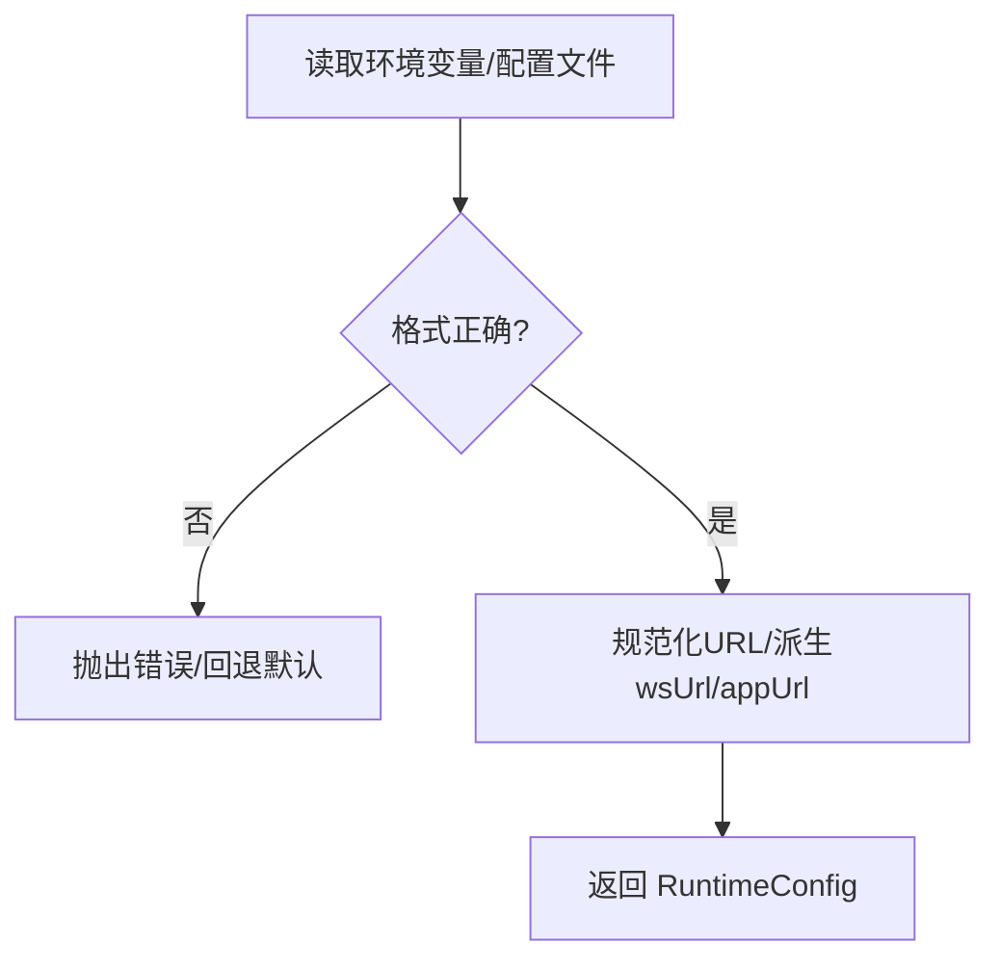
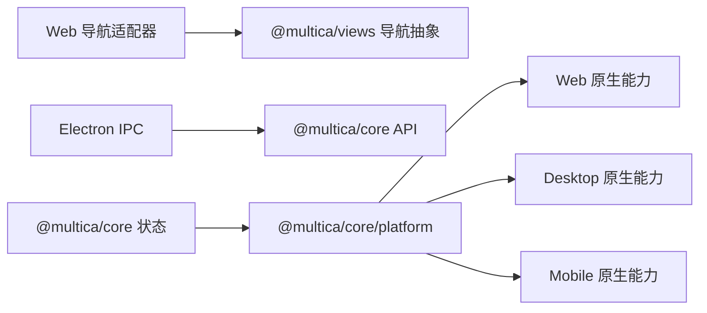

# 跨平台适配

<cite>
**本文引用的文件**
- [apps/web/platform/client-os.ts](file://apps/web/platform/client-os.ts)
- [apps/web/platform/navigation.tsx](file://apps/web/platform/navigation.tsx)
- [apps/web/platform/in-app-history.ts](file://apps/web/platform/in-app-history.ts)
- [apps/desktop/src/shared/runtime-config.ts](file://apps/desktop/src/shared/runtime-config.ts)
- [apps/desktop/src/main/runtime-config-loader.ts](file://apps/desktop/src/main/runtime-config-loader.ts)
- [apps/desktop/src/main/index.ts](file://apps/desktop/src/main/index.ts)
- [apps/desktop/src/preload/index.ts](file://apps/desktop/src/preload/index.ts)
- [apps/desktop/src/preload/index.d.ts](file://apps/desktop/src/preload/index.d.ts)
- [apps/desktop/src/main/navigation-gestures.ts](file://apps/desktop/src/main/navigation-gestures.ts)
- [apps/desktop/src/renderer/src/App.tsx](file://apps/desktop/src/renderer/src/App.tsx)
- [apps/desktop/src/renderer/src/pages/login.tsx](file://apps/desktop/src/renderer/src/pages/login.tsx)
- [packages/core/platform/index.ts](file://packages/core/platform/index.ts)
- [server/pkg/featureflag/env_provider.go](file://server/pkg/featureflag/env_provider.go)
- [server/pkg/featureflag/env_provider_test.go](file://server/pkg/featureflag/env_provider_test.go)
- [apps/docs/content/docs/developers/architecture.mdx](file://apps/docs/content/docs/developers/architecture.mdx)
- [CLAUDE.md](file://CLAUDE.md)
</cite>

## 目录
1. [简介](#简介)
2. [项目结构](#项目结构)
3. [核心组件](#核心组件)
4. [架构总览](#架构总览)
5. [详细组件分析](#详细组件分析)
6. [依赖关系分析](#依赖关系分析)
7. [性能考量](#性能考量)
8. [故障排查指南](#故障排查指南)
9. [结论](#结论)
10. [附录](#附录)

## 简介
本文件系统性梳理 Multica 的跨平台适配方案，覆盖多平台抽象层设计、条件编译与运行时检测策略、Web/桌面/移动三端的差异化实现、共享代码边界与环境配置管理，并给出渐进增强、降级与兼容性处理的最佳实践。文档同时提供关键流程的时序图与流程图，帮助读者快速定位问题与优化点。

## 项目结构
Multica 采用“应用层 + 共享包”的分层组织：
- 应用层（apps）：web、desktop、mobile 各自负责平台能力接入（路由、系统 API、原生模块等）。
- 共享包（packages）：core/ui/views 承载平台无关的业务逻辑、UI 与页面组合；platform 子模块暴露平台抽象（如存储、通知、工作区感知等）。
- 后端（server）：Go 服务，包含特性开关、运行时装配等。

图表来源
- [apps/docs/content/docs/developers/architecture.mdx:40-68](file://apps/docs/content/docs/developers/architecture.mdx#L40-L68)
- [CLAUDE.md:49-72](file://CLAUDE.md#L49-L72)

章节来源
- [apps/docs/content/docs/developers/architecture.mdx:40-68](file://apps/docs/content/docs/developers/architecture.mdx#L40-L68)
- [CLAUDE.md:49-72](file://CLAUDE.md#L49-L72)

## 核心组件
- Web 平台适配
  - 客户端操作系统探测：基于 Navigator 的 platform/userAgent 进行粗略 OS 分类，避免保留完整 UA。
  - 导航适配器：封装 Next.js Router，统一 push/replace/back/forward/hash/prefetch 等能力，并提供“应用内返回”判断。
  - 应用内历史：利用 Navigation API 判断是否可安全“返回到应用内”，防止从外部链接进入时误退出。
- 桌面平台适配
  - 运行期配置加载：主进程读取 desktop.json 或开发环境变量，解析并校验 apiUrl/wsUrl/appUrl，缺失时写入默认配置。
  - 预加载桥接：通过 contextBridge 暴露 desktopAPI/electronAPI/daemonAPI/updater，供渲染进程同步获取 appInfo、系统语言、窗口上下文等。
  - 系统集成：IPC 打开外部浏览器、下载文件、监听系统手势（macOS swipe）、注入 X-Client-Version/X-Client-OS 请求头。
- 移动平台适配
  - 独立实现：拥有自己的 UI、状态、实时订阅与发布流程，仅复用 @multica/core 的类型与纯函数。
- 共享平台抽象
  - packages/core/platform 暴露存储、通知、工作区感知等跨端一致接口，屏蔽具体平台差异。

章节来源
- [apps/web/platform/client-os.ts:1-25](file://apps/web/platform/client-os.ts#L1-L25)
- [apps/web/platform/navigation.tsx:1-111](file://apps/web/platform/navigation.tsx#L1-L111)
- [apps/web/platform/in-app-history.ts:1-40](file://apps/web/platform/in-app-history.ts#L1-L40)
- [apps/desktop/src/shared/runtime-config.ts:1-180](file://apps/desktop/src/shared/runtime-config.ts#L1-L180)
- [apps/desktop/src/main/runtime-config-loader.ts:1-42](file://apps/desktop/src/main/runtime-config-loader.ts#L1-L42)
- [apps/desktop/src/preload/index.ts:103-346](file://apps/desktop/src/preload/index.ts#L103-L346)
- [apps/desktop/src/preload/index.d.ts:21-45](file://apps/desktop/src/preload/index.d.ts#L21-L45)
- [apps/desktop/src/main/index.ts:667-696](file://apps/desktop/src/main/index.ts#L667-L696)
- [packages/core/platform/index.ts:1-18](file://packages/core/platform/index.ts#L1-L18)

## 架构总览
下图展示 Web/桌面/移动三端如何以“平台无关业务逻辑 + 平台特定适配”的方式协作，并通过后端服务完成数据与实时通信。

图表来源
- [apps/docs/content/docs/developers/architecture.mdx:40-68](file://apps/docs/content/docs/developers/architecture.mdx#L40-L68)
- [packages/core/platform/index.ts:1-18](file://packages/core/platform/index.ts#L1-L18)

## 详细组件分析

### Web 平台适配
- 客户端操作系统探测
  - 通过 navigator.platform 与 userAgent 拼接字符串进行正则匹配，输出 macos/windows/linux/ios/android/chromeos/unknown。
  - 优点：不保留完整 UA，隐私友好；缺点：为粗略分类，无法区分同族设备细分型号。
- 导航适配器
  - 封装 Next.js 路由，提供 push/replace/back/forward/canGoBack/hash/getShareableUrl/prefetch。
  - 通过自定义事件 multica:navigate 统一内容编辑器的跳转行为，支持“新标签页/前台标签页”分发。
  - hash 使用 useSyncExternalStore 订阅 window.hashchange/popstate，保证 React 渲染一致性。
- 应用内历史
  - 借助 Navigation API 的 entries() 判断“应用内可返回”，避免从外部链接进入时误退到浏览器上一页。

图表来源
- [apps/web/platform/client-os.ts:1-25](file://apps/web/platform/client-os.ts#L1-L25)

图表来源
- [apps/web/platform/navigation.tsx:1-111](file://apps/web/platform/navigation.tsx#L1-L111)

章节来源
- [apps/web/platform/client-os.ts:1-25](file://apps/web/platform/client-os.ts#L1-L25)
- [apps/web/platform/navigation.tsx:1-111](file://apps/web/platform/navigation.tsx#L1-L111)
- [apps/web/platform/in-app-history.ts:1-40](file://apps/web/platform/in-app-history.ts#L1-L40)

### 桌面平台适配（Electron）
- 运行期配置加载
  - 开发模式：从环境变量构造 RuntimeConfig，自动推导 wsUrl/appUrl。
  - 生产模式：读取 desktop.json，严格校验 schemaVersion/字段类型/URL 协议；缺失时写入默认配置并返回默认值。
  - URL 规范化：去除尾部斜杠、清理 search/hash，wsUrl 由 apiUrl 派生（http→ws，https→wss）。
- 预加载桥接与渲染进程访问
  - 主进程通过 IPC 同步返回 appInfo（version/os），并在 preload 中挂载到 window.desktopAPI。
  - 暴露 onSystemLocaleChanged、runtimeConfig、windowContext、getLastFreeze/ackFreeze、onAuthToken 等能力。
- 系统集成
  - 打开外部浏览器登录、安全下载文件、macOS 侧滑手势转发到渲染进程、注入客户端版本与 OS 标识到请求头。

图表来源
- [apps/desktop/src/main/runtime-config-loader.ts:1-42](file://apps/desktop/src/main/runtime-config-loader.ts#L1-L42)
- [apps/desktop/src/shared/runtime-config.ts:1-180](file://apps/desktop/src/shared/runtime-config.ts#L1-L180)
- [apps/desktop/src/preload/index.ts:103-346](file://apps/desktop/src/preload/index.ts#L103-L346)

图表来源
- [apps/desktop/src/main/index.ts:667-696](file://apps/desktop/src/main/index.ts#L667-L696)

章节来源
- [apps/desktop/src/shared/runtime-config.ts:1-180](file://apps/desktop/src/shared/runtime-config.ts#L1-L180)
- [apps/desktop/src/main/runtime-config-loader.ts:1-42](file://apps/desktop/src/main/runtime-config-loader.ts#L1-L42)
- [apps/desktop/src/preload/index.ts:103-346](file://apps/desktop/src/preload/index.ts#L103-L346)
- [apps/desktop/src/preload/index.d.ts:21-45](file://apps/desktop/src/preload/index.d.ts#L21-L45)
- [apps/desktop/src/main/index.ts:667-696](file://apps/desktop/src/main/index.ts#L667-L696)
- [apps/desktop/src/main/navigation-gestures.ts:1-18](file://apps/desktop/src/main/navigation-gestures.ts#L1-L18)
- [apps/desktop/src/renderer/src/App.tsx:395-426](file://apps/desktop/src/renderer/src/App.tsx#L395-L426)
- [apps/desktop/src/renderer/src/pages/login.tsx:1-38](file://apps/desktop/src/renderer/src/pages/login.tsx#L1-L38)

### 移动平台适配（React Native/Expo）
- 独立实现：拥有独立的 UI、状态、实时订阅与发布流程，不直接复用 Web/Desktop 的 React 页面。
- 复用范围：仅导入 @multica/core 的类型与纯函数（import type 用于类型），保持构建与发布解耦。
- 平台能力：通过 lib 下的工具函数与 hooks 实现主题、搜索栏、滚动、未读数等业务相关能力。

章节来源
- [apps/docs/content/docs/developers/architecture.mdx:40-68](file://apps/docs/content/docs/developers/architecture.mdx#L40-L68)
- [CLAUDE.md:49-72](file://CLAUDE.md#L49-L72)

### 共享代码策略
- 边界约束
  - packages/core：禁止引入 react-dom/localStorage/process.env 等运行时绑定，使用 StorageAdapter 等抽象。
  - packages/ui：不得 import @multica/core，不包含业务逻辑。
  - packages/views：禁用 next/* 与 react-router-dom，走 NavigationAdapter。
  - apps/web/platform：唯一允许使用 Next.js 平台 API 的位置。
  - apps/desktop/src/renderer/src/platform：唯一允许 react-router-dom 绑定的位置。
- 共享层级
  - packages/core：API、缓存、权限、平台无关状态。
  - packages/ui：基础组件。
  - packages/views：页面组合与业务视图。
- 移动端
  - 独立 UI/状态/发布流程，仅复用 core 的类型与纯函数。

章节来源
- [CLAUDE.md:49-72](file://CLAUDE.md#L49-L72)
- [apps/docs/content/docs/developers/architecture.mdx:40-68](file://apps/docs/content/docs/developers/architecture.mdx#L40-L68)

### 环境配置管理
- 桌面运行期配置
  - 输入：desktop.json 或开发环境变量。
  - 校验：schemaVersion、必填字段、URL 协议合法性。
  - 派生：wsUrl 由 apiUrl 派生；appUrl 按约定从 api.* 主机推导；本地开发回退到固定端口。
- 后端特性开关
  - EnvProvider：从环境变量读取 FF_* 标志，支持 true/false/on/off/百分比 rollout/任意变体字符串。
  - 空值语义：显式空值视为“关闭”，便于运维通过 ConfigMap 做紧急开关。

图表来源
- [apps/desktop/src/shared/runtime-config.ts:1-180](file://apps/desktop/src/shared/runtime-config.ts#L1-L180)
- [apps/desktop/src/main/runtime-config-loader.ts:1-42](file://apps/desktop/src/main/runtime-config-loader.ts#L1-L42)
- [server/pkg/featureflag/env_provider.go:1-36](file://server/pkg/featureflag/env_provider.go#L1-L36)
- [server/pkg/featureflag/env_provider_test.go:1-58](file://server/pkg/featureflag/env_provider_test.go#L1-L58)

章节来源
- [apps/desktop/src/shared/runtime-config.ts:1-180](file://apps/desktop/src/shared/runtime-config.ts#L1-L180)
- [apps/desktop/src/main/runtime-config-loader.ts:1-42](file://apps/desktop/src/main/runtime-config-loader.ts#L1-L42)
- [server/pkg/featureflag/env_provider.go:1-36](file://server/pkg/featureflag/env_provider.go#L1-L36)
- [server/pkg/featureflag/env_provider_test.go:1-58](file://server/pkg/featureflag/env_provider_test.go#L1-L58)

## 依赖关系分析
- 耦合与内聚
  - Web/桌面在各自 platform 层内聚平台能力，对外仅暴露 NavigationAdapter、StorageAdapter 等稳定接口，降低与业务层的耦合。
  - Core 作为共享层，向上提供稳定的领域模型与状态管理，向下通过平台抽象隔离差异。
- 外部依赖
  - Web：Next.js 路由、Navigation API。
  - Desktop：Electron main/preload/renderer 三层 IPC、shell、fs。
  - Mobile：React Native/Expo 生态。
  - Server：Go 标准库与内部 featureflag 模块。

图表来源
- [apps/web/platform/navigation.tsx:1-111](file://apps/web/platform/navigation.tsx#L1-L111)
- [packages/core/platform/index.ts:1-18](file://packages/core/platform/index.ts#L1-L18)

章节来源
- [apps/web/platform/navigation.tsx:1-111](file://apps/web/platform/navigation.tsx#L1-L111)
- [packages/core/platform/index.ts:1-18](file://packages/core/platform/index.ts#L1-L18)

## 性能考量
- Web
  - 使用 Next.js prefetch 预热路由，减少首次导航网络开销。
  - 通过 Navigation API 精确判断“应用内返回”，避免无谓的 back 失败与重渲染。
- Desktop
  - 预加载阶段同步注入 appInfo，确保首个请求携带正确的客户端标识，减少重试。
  - 运行期配置解析集中化，避免重复计算与多次 I/O。
- Mobile
  - 独立构建与发布，避免不必要的平台依赖引入，减小包体积。
- 通用
  - 将平台无关逻辑下沉至 packages/core，减少重复实现与维护成本。

[本节为通用指导，无需引用具体文件]

## 故障排查指南
- 桌面运行期配置错误
  - 现象：启动时报 JSON 解析失败或 schemaVersion 不支持。
  - 排查：检查 desktop.json 是否存在、字段是否为非空字符串、URL 协议是否正确；确认 wsUrl 与 apiUrl 的对应关系。
  - 参考路径
    - [apps/desktop/src/shared/runtime-config.ts:53-83](file://apps/desktop/src/shared/runtime-config.ts#L53-L83)
    - [apps/desktop/src/main/runtime-config-loader.ts:13-42](file://apps/desktop/src/main/runtime-config-loader.ts#L13-L42)
- 登录后回调与深链
  - 现象：桌面端 Google 登录无法回到 App。
  - 排查：确认 openExternal 打开的 webUrl 带 platform=desktop；确认 deep link 已注册并被主进程捕获。
  - 参考路径
    - [apps/desktop/src/renderer/src/pages/login.tsx:5-23](file://apps/desktop/src/renderer/src/pages/login.tsx#L5-L23)
    - [apps/desktop/src/preload/index.ts:103-126](file://apps/desktop/src/preload/index.ts#L103-L126)
- Web 导航异常
  - 现象：从外部链接进入后“返回”跳出应用。
  - 排查：确认 canGoBackInApp 返回 false 时走降级路径；检查 Navigation API 可用性。
  - 参考路径
    - [apps/web/platform/in-app-history.ts:25-39](file://apps/web/platform/in-app-history.ts#L25-L39)
    - [apps/web/platform/navigation.tsx:78-95](file://apps/web/platform/navigation.tsx#L78-L95)
- 特性开关无效
  - 现象：设置 FF_XXX 后功能未按预期启用/关闭。
  - 排查：确认变量名大小写与前缀；空值表示关闭；百分比格式必须合法。
  - 参考路径
    - [server/pkg/featureflag/env_provider.go:10-36](file://server/pkg/featureflag/env_provider.go#L10-L36)
    - [server/pkg/featureflag/env_provider_test.go:17-58](file://server/pkg/featureflag/env_provider_test.go#L17-L58)

章节来源
- [apps/desktop/src/shared/runtime-config.ts:53-83](file://apps/desktop/src/shared/runtime-config.ts#L53-L83)
- [apps/desktop/src/main/runtime-config-loader.ts:13-42](file://apps/desktop/src/main/runtime-config-loader.ts#L13-L42)
- [apps/desktop/src/renderer/src/pages/login.tsx:5-23](file://apps/desktop/src/renderer/src/pages/login.tsx#L5-L23)
- [apps/desktop/src/preload/index.ts:103-126](file://apps/desktop/src/preload/index.ts#L103-L126)
- [apps/web/platform/in-app-history.ts:25-39](file://apps/web/platform/in-app-history.ts#L25-L39)
- [apps/web/platform/navigation.tsx:78-95](file://apps/web/platform/navigation.tsx#L78-L95)
- [server/pkg/featureflag/env_provider.go:10-36](file://server/pkg/featureflag/env_provider.go#L10-L36)
- [server/pkg/featureflag/env_provider_test.go:17-58](file://server/pkg/featureflag/env_provider_test.go#L17-L58)

## 结论
Multica 通过清晰的“平台无关业务逻辑 + 平台特定适配”分层，实现了 Web/桌面/移动三端的一致体验与高效维护。Web 端聚焦浏览器 API 与路由适配，桌面端通过 Electron IPC 与运行期配置管理打通系统与后端，移动端保持独立但复用核心能力。配合严格的包边界约束、健壮的配置校验与特性开关机制，整体架构具备良好的可扩展性与可观测性。

[本节为总结，无需引用具体文件]

## 附录
- 最佳实践清单
  - 渐进增强：优先使用现代 API（如 Navigation API），不可用时降级到兼容路径。
  - 降级策略：当平台能力缺失时，提供最小可用体验（如禁用某些交互、提示用户）。
  - 兼容性处理：对 UA/平台检测采用“粗略分类 + 白名单”策略，避免过度依赖不稳定信息。
  - 配置治理：集中解析与校验运行期配置，明确默认值与派生规则。
  - 调试方法：在主进程/预加载/渲染进程之间建立清晰日志通道；利用测试用例验证配置解析与导航行为。

[本节为通用指导，无需引用具体文件]