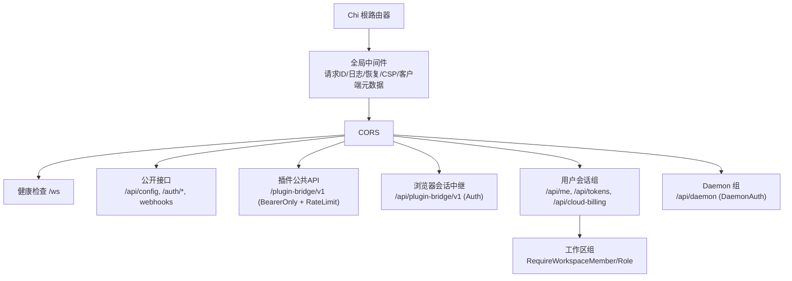
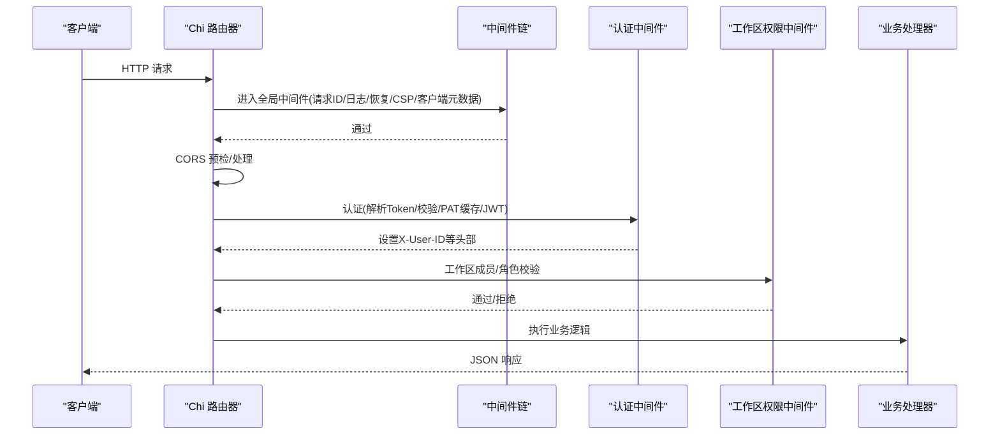
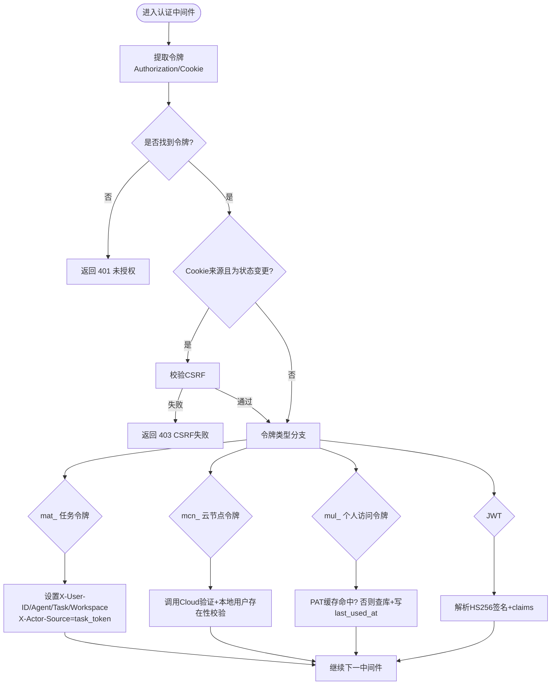
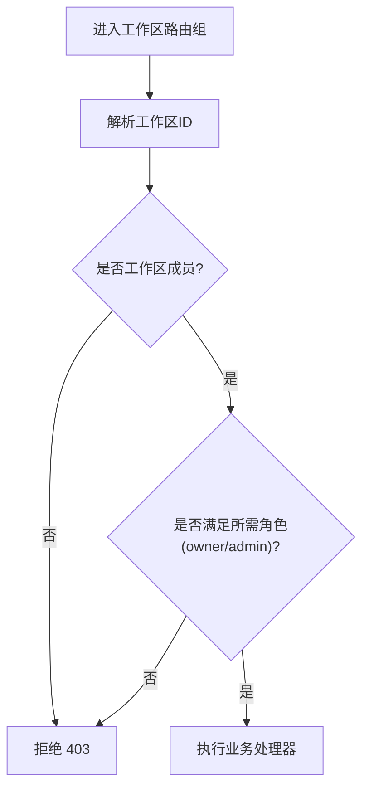
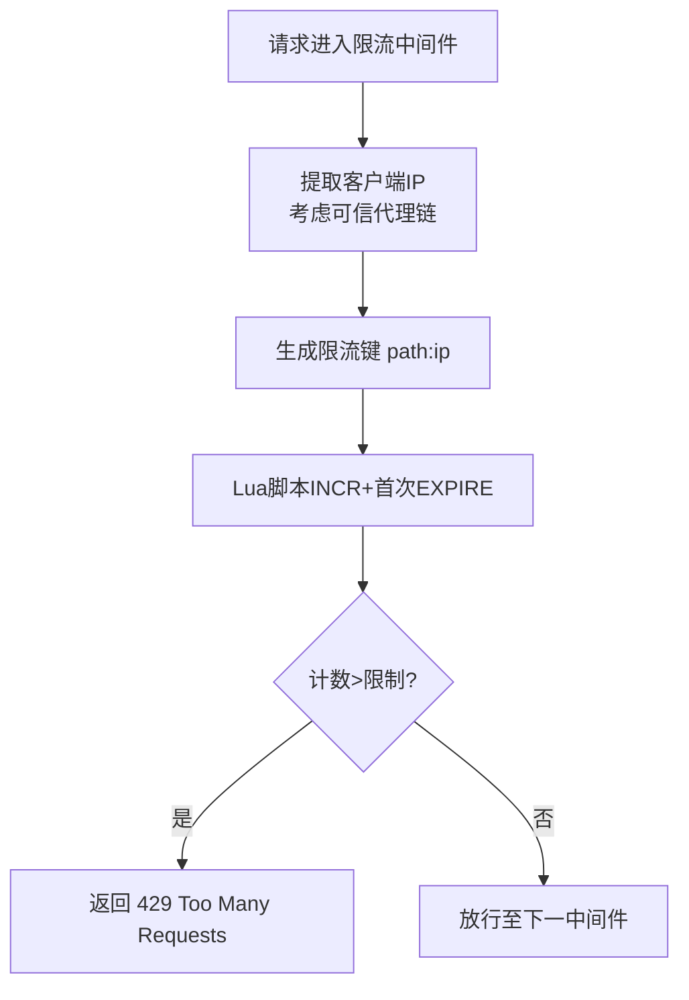
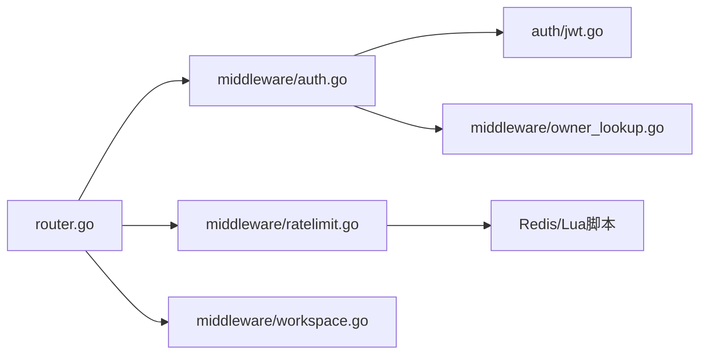

# HTTP 路由与中间件

<cite>
**本文引用的文件**
- [router.go](file://server/cmd/server/router.go)
- [auth.go](file://server/internal/middleware/auth.go)
- [jwt.go](file://server/internal/auth/jwt.go)
- [ratelimit.go](file://server/internal/middleware/ratelimit.go)
- [owner_lookup.go](file://server/internal/middleware/owner_lookup.go)
- [workspace.go](file://server/internal/middleware/workspace.go)
</cite>

## 目录
1. [简介](#简介)
2. [项目结构](#项目结构)
3. [核心组件](#核心组件)
4. [架构总览](#架构总览)
5. [详细组件分析](#详细组件分析)
6. [依赖关系分析](#依赖关系分析)
7. [性能考量](#性能考量)
8. [故障排查指南](#故障排查指南)
9. [结论](#结论)
10. [附录](#附录)

## 简介
本文件聚焦 Multica 后端基于 Chi 的 HTTP 路由与中间件体系，系统性说明请求从进入服务器到返回响应的完整生命周期，重点覆盖：
- 认证与授权：JWT、个人访问令牌（PAT）、云节点令牌（Cloud PAT）、工作空间成员与角色校验。
- 安全能力：CORS、内容安全策略（CSP）、请求限流、可信代理、CSRF。
- 路由组织：公共接口、插件桥接、工作区隔离、版本化 API、WebSocket。
- 性能与可观测性：Redis 原子限流、指标埋点、日志与请求 ID。

## 项目结构
后端使用 Chi 路由器集中装配全局中间件与分组路由，按“公开接口 → 插件桥接 → 用户会话 → 工作区”逐层收紧权限；同时提供 Daemon 专用通道与 WebSocket 实时通道。

图表来源
- [router.go:1282-1310](file://server/cmd/server/router.go#L1282-L1310)
- [router.go:1378-1514](file://server/cmd/server/router.go#L1378-L1514)
- [router.go:1516-1855](file://server/cmd/server/router.go#L1516-L1855)
- [router.go:1433-1486](file://server/cmd/server/router.go#L1433-L1486)

章节来源
- [router.go:1282-1310](file://server/cmd/server/router.go#L1282-L1310)
- [router.go:1378-1514](file://server/cmd/server/router.go#L1378-L1514)
- [router.go:1516-1855](file://server/cmd/server/router.go#L1516-L1855)
- [router.go:1433-1486](file://server/cmd/server/router.go#L1433-L1486)

## 核心组件
- 认证中间件：统一解析令牌来源（Authorization/Bearer、HttpOnly Cookie），支持任务令牌（mat_）、云节点令牌（mcn_）、个人访问令牌（mul_）与 JWT，并设置 X-User-ID/X-User-Email 等下游可用头。
- 工作区权限中间件：基于 URL 参数或上下文解析工作区，校验成员身份与角色（member/admin/owner）。
- 请求限流中间件：基于 Redis Lua 脚本实现固定窗口限流，支持可信代理链解析真实客户端 IP。
- 安全中间件：CORS、CSP、CSRF 校验、请求 ID、日志、恢复。
- 路由分组：按信任边界划分公开接口、插件公共 API、浏览器会话中继、用户会话与工作区资源。

章节来源
- [auth.go:34-267](file://server/internal/middleware/auth.go#L34-L267)
- [workspace.go:171-183](file://server/internal/middleware/workspace.go#L171-L183)
- [ratelimit.go:51-87](file://server/internal/middleware/ratelimit.go#L51-L87)
- [router.go:1282-1310](file://server/cmd/server/router.go#L1282-L1310)

## 架构总览
下图展示一个典型受保护请求的生命周期：请求进入 → 全局中间件 → CORS → 认证 → 工作区权限 → 处理器 → 响应。

图表来源
- [router.go:1282-1310](file://server/cmd/server/router.go#L1282-L1310)
- [auth.go:34-267](file://server/internal/middleware/auth.go#L34-L267)
- [workspace.go:171-183](file://server/internal/middleware/workspace.go#L171-L183)

## 详细组件分析

### 认证与授权中间件（JWT、PAT、Cloud PAT、任务令牌）
- 令牌来源优先级：Authorization: Bearer > HttpOnly Cookie（状态变更需 CSRF 校验）。
- 任务令牌（mat_）：由服务端签发，注入 agent 进程，强制写入 X-Agent-ID/X-Task-ID/X-Workspace-ID，并标记 X-Actor-Source=task_token，防止下游被伪造。
- 云节点令牌（mcn_）：委托 Cloud Fleet 验证，并通过本地用户存在性校验（Owner Lookup）做纵深防御。
- 个人访问令牌（mul_）：哈希后查询数据库，带 TTL 缓存命中时跳过 DB 与 last_used_at 更新，降低热点开销。
- JWT：HS256 签名校验，读取 sub/email 并设置用户头。
- 临时禁用用户拦截：在多个分支中统一检查并返回 403。

图表来源
- [auth.go:34-267](file://server/internal/middleware/auth.go#L34-L267)
- [owner_lookup.go:13-59](file://server/internal/middleware/owner_lookup.go#L13-L59)

章节来源
- [auth.go:34-267](file://server/internal/middleware/auth.go#L34-L267)
- [owner_lookup.go:13-59](file://server/internal/middleware/owner_lookup.go#L13-L59)

### 工作区隔离与角色权限
- 成员校验：RequireWorkspaceMemberFromURL/RequireWorkspaceMember 根据 URL 参数或上下文解析工作区，校验当前用户是否为成员。
- 角色校验：RequireWorkspaceRoleFromURL/RequireWorkspaceRole 限定 owner/admin 才能执行敏感操作。
- 路由组织：工作区相关路由集中在 /api/workspaces/{id}... 下，按 member/admin/owner 分层挂载中间件，确保最小权限原则。

图表来源
- [workspace.go:171-183](file://server/internal/middleware/workspace.go#L171-L183)
- [router.go:1567-1743](file://server/cmd/server/router.go#L1567-L1743)

章节来源
- [workspace.go:171-183](file://server/internal/middleware/workspace.go#L171-L183)
- [router.go:1567-1743](file://server/cmd/server/router.go#L1567-L1743)

### 请求限流（Redis 固定窗口）
- 使用 Redis Lua 脚本原子 INCR+EXPIRE，避免网络抖动导致 key 永久存活。
- 支持可信代理：当直连地址属于配置的可信 CIDR 时，从 X-Forwarded-For 自右向左取首个非可信 IP 作为限速键。
- 超限返回 429 并附带 Retry-After。

图表来源
- [ratelimit.go:15-87](file://server/internal/middleware/ratelimit.go#L15-L87)

章节来源
- [ratelimit.go:15-87](file://server/internal/middleware/ratelimit.go#L15-L87)

### CORS、CSP 与安全头
- CORS：允许的来源与方法、自定义请求头与暴露响应头，启用凭据；与 WebSocket 同源策略共享配置。
- CSP：全局启用内容安全策略，配合上传预览等场景减少 frame-ancestors 'none' 的影响。
- CSRF：Cookie 认证的状态变更请求必须携带有效 CSRF Token。

章节来源
- [router.go:1282-1310](file://server/cmd/server/router.go#L1282-L1310)
- [auth.go:70-75](file://server/internal/middleware/auth.go#L70-L75)

### 路由组织与版本控制
- 公开接口：/api/config、/auth/*、各类 webhook（GitHub/Stripe/VCS/Autopilots）。
- 插件公共 API：/plugin-bridge/v1，仅接受 mpi_/mpc_ Bearer，独立限流与鉴权边界。
- 浏览器会话中继：/api/plugin-bridge/v1 下的内部路径，复用用户会话，禁止 iframe 直接持有凭证。
- 用户与会话：/api/me、/api/tokens、/api/cloud-billing（人类账户级，拒绝任务令牌 actor）。
- 工作区资源：/api/workspaces/{id}... 及 /api/issues、/api/projects 等，按成员/角色分层。
- Daemon 通道：/api/daemon，要求 daemon token 或有效用户 token。

章节来源
- [router.go:1378-1514](file://server/cmd/server/router.go#L1378-L1514)
- [router.go:1516-1855](file://server/cmd/server/router.go#L1516-L1855)
- [router.go:1433-1486](file://server/cmd/server/router.go#L1433-L1486)

### 常见路由模式与最佳实践
- 将跨域与通用安全头置于最外层中间件，保证所有路径一致生效。
- 按信任边界分组路由：公开 → 插件公共 → 会话中继 → 用户 → 工作区。
- 对高价值动作（登录、验证码、销售联系）单独限流。
- 工作区路由统一以 RequireWorkspaceMember/Role 包裹，再细分 admin/owner 子组。
- 对需要强隔离的子系统（如 billing）显式拒绝任务令牌 actor，避免横向移动。

章节来源
- [router.go:1282-1310](file://server/cmd/server/router.go#L1282-L1310)
- [router.go:1378-1514](file://server/cmd/server/router.go#L1378-L1514)
- [router.go:1516-1855](file://server/cmd/server/router.go#L1516-L1855)

## 依赖关系分析
- 认证中间件依赖 auth 包中的 JWT 密钥管理、PAT 缓存、Cloud PAT 验证器与 Owner Lookup。
- 限流中间件依赖 Redis 与 Lua 脚本，结合可信代理配置解析真实客户端 IP。
- 路由组装依赖 handler、realtime、storage、featureflags 等服务对象，并在构造阶段完成能力开关与集成注册。

图表来源
- [router.go:1282-1514](file://server/cmd/server/router.go#L1282-L1514)
- [auth.go:34-267](file://server/internal/middleware/auth.go#L34-L267)
- [jwt.go:21-31](file://server/internal/auth/jwt.go#L21-L31)
- [ratelimit.go:51-87](file://server/internal/middleware/ratelimit.go#L51-L87)
- [owner_lookup.go:13-59](file://server/internal/middleware/owner_lookup.go#L13-L59)

章节来源
- [router.go:1282-1514](file://server/cmd/server/router.go#L1282-L1514)
- [auth.go:34-267](file://server/internal/middleware/auth.go#L34-L267)
- [jwt.go:21-31](file://server/internal/auth/jwt.go#L21-L31)
- [ratelimit.go:51-87](file://server/internal/middleware/ratelimit.go#L51-L87)
- [owner_lookup.go:13-59](file://server/internal/middleware/owner_lookup.go#L13-L59)

## 性能考量
- 认证缓存：PAT 命中缓存时跳过 DB 查询与 last_used_at 更新，降低热点令牌带来的写放大。
- 限流原子性：Redis Lua 脚本保证 INCR 与 EXPIRE 的原子性，避免异常导致 key 永久存活。
- 可信代理：仅在直连来自可信 CIDR 时才信任 XFF，默认保守策略避免误判。
- 指标与日志：全局 RequestID、HTTP 指标中间件与结构化日志便于定位问题。

章节来源
- [auth.go:177-227](file://server/internal/middleware/auth.go#L177-L227)
- [ratelimit.go:15-87](file://server/internal/middleware/ratelimit.go#L15-L87)
- [router.go:1282-1293](file://server/cmd/server/router.go#L1282-L1293)

## 故障排查指南
- 401 未授权：检查 Authorization/Cookie 是否存在且格式正确；确认 JWT 密钥与签名算法；PAT 是否过期或被撤销。
- 403 禁止：Cookie 状态变更缺少 CSRF；工作区成员/角色不足；任务令牌访问了仅限人类的账户级接口。
- 429 限流：核对 RATE_LIMIT_* 配置与 Redis 连接；检查可信代理配置是否正确识别真实客户端 IP。
- CORS 预检失败：确认请求头是否在 AllowedHeaders 白名单内；跨域来源是否在 AllowedOrigins。
- Cloud PAT 不可用：当 Cloud 服务不可达时返回 503，应重试而非丢弃令牌。

章节来源
- [auth.go:70-75](file://server/internal/middleware/auth.go#L70-L75)
- [auth.go:137-175](file://server/internal/middleware/auth.go#L137-L175)
- [ratelimit.go:60-87](file://server/internal/middleware/ratelimit.go#L60-L87)
- [router.go:1303-1310](file://server/cmd/server/router.go#L1303-L1310)

## 结论
Multica 的后端路由与中间件体系以 Chi 为核心，围绕“认证→授权→限流→安全头”的分层设计，实现了清晰的信任边界与可扩展的 API 组织方式。通过 PAT 缓存、Redis 原子限流、可信代理与严格的角色/成员校验，系统在安全性与性能之间取得良好平衡。建议新增路由时遵循现有分组与中间件组合模式，确保最小权限与一致的体验。

## 附录
- 环境变量要点（节选）：
  - CORS_ALLOWED_ORIGINS / FRONTEND_ORIGIN：决定允许的跨域来源。
  - MULTICA_TRUSTED_PROXIES：定义可信代理 CIDR，影响 XFF 解析与限流键。
  - RATE_LIMIT_AUTH / RATE_LIMIT_AUTH_VERIFY / RATE_LIMIT_CONTACT_SALES：各接口的限流阈值。
  - JWT_SECRET：生产环境必须替换为强随机值，避免默认密钥。
  - MULTICA_CLOUD_URL：启用 Cloud PAT 验证与订阅能力。
- 参考路径（示例）：
  - 路由装配与全局中间件：[router.go:1282-1310](file://server/cmd/server/router.go#L1282-L1310)
  - 认证中间件实现：[auth.go:34-267](file://server/internal/middleware/auth.go#L34-L267)
  - 工作区权限中间件：[workspace.go:171-183](file://server/internal/middleware/workspace.go#L171-L183)
  - 请求限流中间件：[ratelimit.go:51-87](file://server/internal/middleware/ratelimit.go#L51-L87)
  - JWT 密钥与工具：[jwt.go:21-31](file://server/internal/auth/jwt.go#L21-L31)
  - Cloud PAT 本地用户校验：[owner_lookup.go:13-59](file://server/internal/middleware/owner_lookup.go#L13-L59)