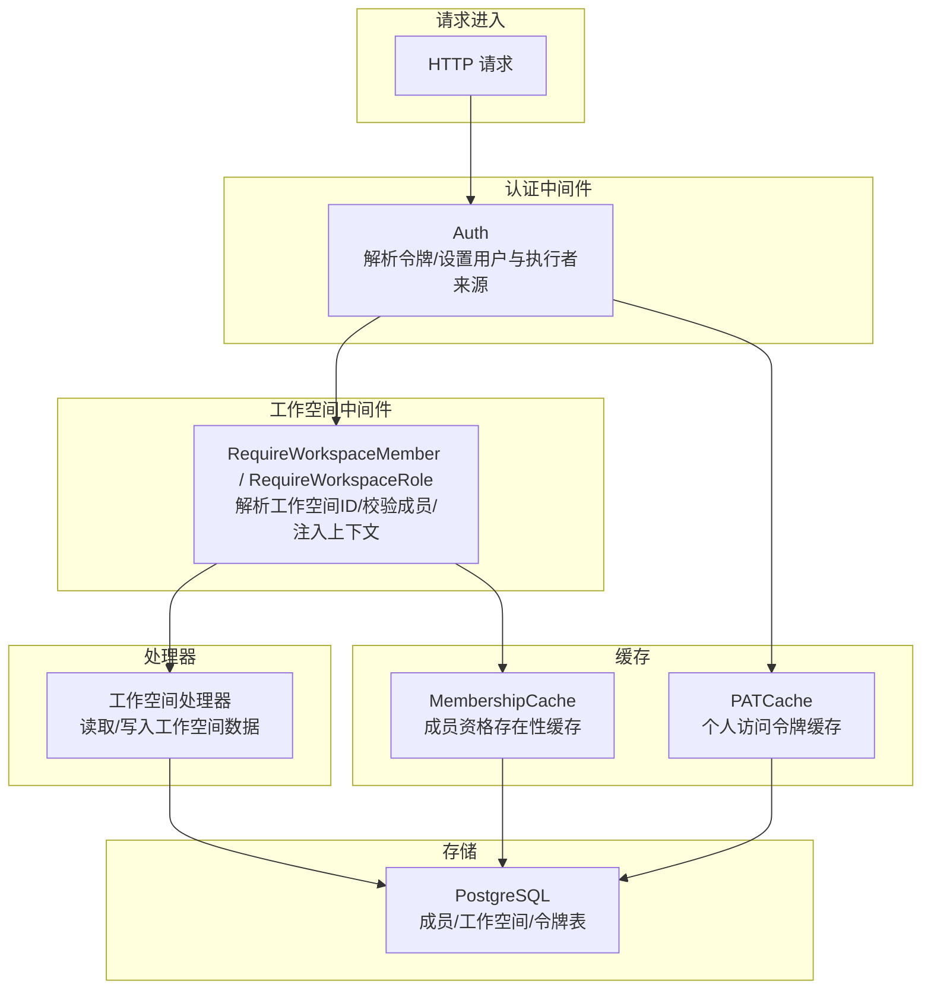
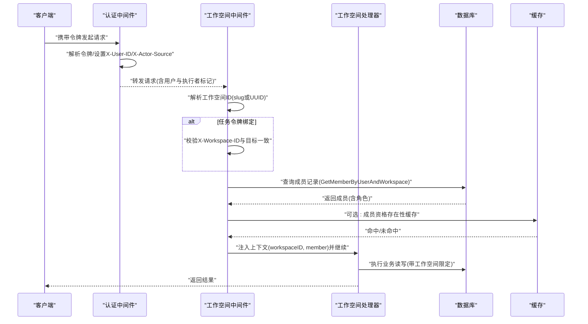
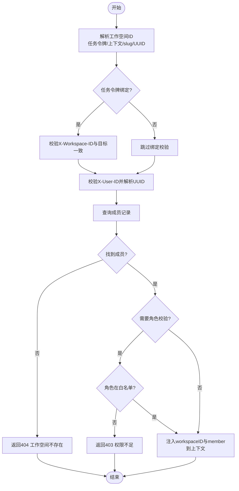
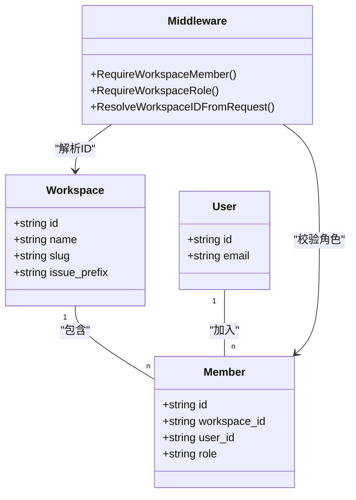
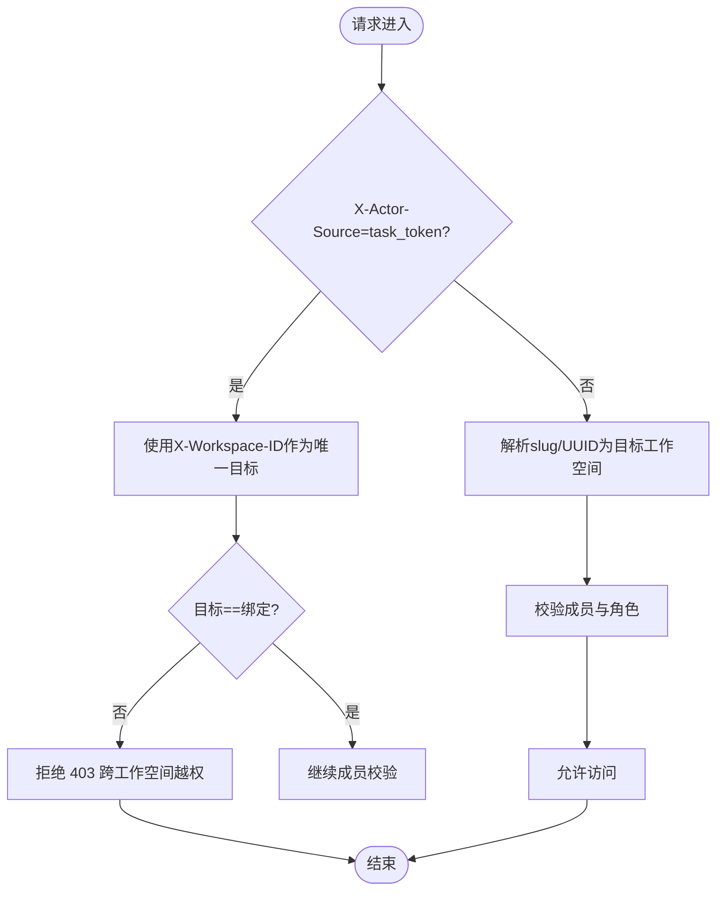
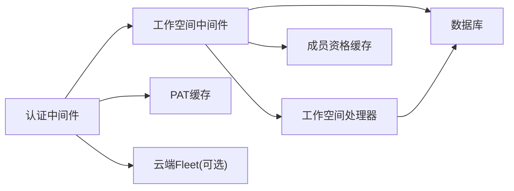

# 工作空间中间件

<cite>
**本文引用的文件**
- [workspace.go](file://server/internal/middleware/workspace.go)
- [auth.go](file://server/internal/middleware/auth.go)
- [owner_lookup.go](file://server/internal/middleware/owner_lookup.go)
- [membership_cache.go](file://server/internal/auth/membership_cache.go)
- [workspace_handler.go](file://server/internal/handler/workspace.go)
</cite>

## 目录
1. [简介](#简介)
2. [项目结构](#项目结构)
3. [核心组件](#核心组件)
4. [架构总览](#架构总览)
5. [详细组件分析](#详细组件分析)
6. [依赖关系分析](#依赖关系分析)
7. [性能考虑](#性能考虑)
8. [故障排查指南](#故障排查指南)
9. [结论](#结论)
10. [附录](#附录)

## 简介
本文件聚焦 Multica 后端的工作空间中间件，系统性说明工作空间隔离机制、成员资格验证与资源访问控制实现。重点覆盖：
- 工作空间上下文构建流程：工作空间 ID 提取 → 成员资格检查 → 权限级别确定 → 上下文注入
- 角色与权限模型（所有者、成员等）及资源访问范围
- 跨工作空间操作的安全限制与工作空间切换逻辑
- 缓存策略（成员资格缓存、令牌缓存）对授权延迟的影响
- 权限配置示例与常见问题解决方案

## 项目结构
工作空间相关能力由“认证中间件 + 工作空间中间件 + 处理器 + 缓存”共同构成：
- 认证中间件负责身份鉴别（JWT/PAT/任务令牌/云节点令牌），并设置 X-User-ID、X-Agent-ID、X-Task-ID、X-Workspace-ID、X-Actor-Source 等请求头
- 工作空间中间件负责解析目标工作空间、校验成员资格与角色、将工作空间与成员信息注入请求上下文
- 处理器基于上下文进行业务处理，并在成员变更时失效缓存
- 缓存层提供成员资格存在性缓存与 PAT 缓存，降低数据库压力

图表来源
- [auth.go:34-267](file://server/internal/middleware/auth.go#L34-L267)
- [workspace.go:158-265](file://server/internal/middleware/workspace.go#L158-L265)
- [membership_cache.go:14-87](file://server/internal/auth/membership_cache.go#L14-L87)
- [workspace_handler.go:159-744](file://server/internal/handler/workspace.go#L159-L744)

章节来源
- [auth.go:34-267](file://server/internal/middleware/auth.go#L34-L267)
- [workspace.go:158-265](file://server/internal/middleware/workspace.go#L158-L265)
- [membership_cache.go:14-87](file://server/internal/auth/membership_cache.go#L14-L87)
- [workspace_handler.go:159-744](file://server/internal/handler/workspace.go#L159-L744)

## 核心组件
- 工作空间上下文键与注入
  - 通过 context 键保存 workspaceID 与 member，供下游 handler 快速读取
  - 提供 SetMemberContext 用于非中间件路径的上下文注入
- 工作空间 ID 解析器
  - 统一优先级：任务令牌绑定 > 上下文快路径 > slug（Header/Query）> UUID（Header/Query）
  - 针对任务令牌强制使用绑定的工作空间，防止越权扩大作用域
- 成员与角色校验
  - 从请求头获取 X-User-ID，解析为 UUID 后查询成员记录
  - 支持按角色白名单校验（如 owner/admin/member）
- 错误响应
  - 区分未提供标识（400）、标识无效（404）、无权限（401/403）等场景

章节来源
- [workspace.go:13-40](file://server/internal/middleware/workspace.go#L13-L40)
- [workspace.go:47-150](file://server/internal/middleware/workspace.go#L47-L150)
- [workspace.go:158-265](file://server/internal/middleware/workspace.go#L158-L265)

## 架构总览
下图展示一次受保护的工作空间 API 调用在中间件链中的流转过程，包括身份认证、工作空间解析、成员与角色校验、上下文注入以及处理器执行业务逻辑。

图表来源
- [auth.go:34-267](file://server/internal/middleware/auth.go#L34-L267)
- [workspace.go:158-265](file://server/internal/middleware/workspace.go#L158-L265)
- [membership_cache.go:14-87](file://server/internal/auth/membership_cache.go#L14-L87)
- [workspace_handler.go:159-744](file://server/internal/handler/workspace.go#L159-L744)

## 详细组件分析

### 工作空间上下文构建流程
- 工作空间 ID 提取
  - 任务令牌优先：当 X-Actor-Source == "task_token" 时，必须使用 X-Workspace-ID，禁止客户端伪造或覆盖
  - 上下文快路径：若已存在于上下文则直接复用
  - Slug 优先：优先从 Header 或 Query 的 workspace_slug 解析为 UUID
  - UUID 回退：兼容 CLI/daemon 的 X-Workspace-ID 与 workspace_id
- 成员资格检查
  - 从请求头取 X-User-ID，解析为 UUID 后查询成员表
  - 未找到成员视为工作空间不存在（404）
- 权限级别确定
  - 根据传入的角色白名单校验成员角色是否允许
  - 未满足要求返回 403
- 上下文注入
  - 将 workspaceID 与 member 注入到请求上下文，供后续 handler 使用

图表来源
- [workspace.go:47-150](file://server/internal/middleware/workspace.go#L47-L150)
- [workspace.go:158-265](file://server/internal/middleware/workspace.go#L158-L265)

章节来源
- [workspace.go:47-150](file://server/internal/middleware/workspace.go#L47-L150)
- [workspace.go:158-265](file://server/internal/middleware/workspace.go#L158-L265)

### 工作空间权限模型图
- 角色定义
  - owner：工作空间所有者，可管理成员、修改工作空间设置、删除工作空间等
  - admin：管理员（若启用），具备部分管理权限
  - member：普通成员，可访问工作空间内资源但不可管理
- 权限边界
  - 所有工作空间级操作均需在中间件中完成成员与角色校验
  - 任务令牌严格绑定单一工作空间，禁止跨工作空间越权
  - 成员变更（更新/删除/离开）需保证至少保留一个 owner

图表来源
- [workspace.go:158-265](file://server/internal/middleware/workspace.go#L158-L265)
- [workspace_handler.go:547-639](file://server/internal/handler/workspace.go#L547-L639)

章节来源
- [workspace_handler.go:547-639](file://server/internal/handler/workspace.go#L547-L639)
- [workspace.go:158-265](file://server/internal/middleware/workspace.go#L158-L265)

### 访问控制流程图（跨工作空间安全限制）
- 任务令牌路径
  - 认证阶段设置 X-Actor-Source = "task_token" 与 X-Workspace-ID
  - 工作空间中间件强制校验目标工作空间与令牌绑定一致，否则拒绝
- 人类用户路径
  - 通过 JWT/PAT/Cookie 认证，设置 X-User-ID
  - 工作空间中间件依据 slug/UUID 解析目标工作空间并校验成员与角色
- 跨工作空间操作
  - 任何试图通过 Header/Query/URL 参数覆盖目标工作空间的行为均被忽略或拒绝
  - 任务令牌路径下，即使 URL 参数指定其他工作空间，仍只允许操作绑定工作空间

图表来源
- [auth.go:77-115](file://server/internal/middleware/auth.go#L77-L115)
- [workspace.go:113-150](file://server/internal/middleware/workspace.go#L113-L150)
- [workspace.go:195-220](file://server/internal/middleware/workspace.go#L195-L220)

章节来源
- [auth.go:77-115](file://server/internal/middleware/auth.go#L77-L115)
- [workspace.go:113-150](file://server/internal/middleware/workspace.go#L113-L150)
- [workspace.go:195-220](file://server/internal/middleware/workspace.go#L195-L220)

### 数据隔离机制说明
- 请求级隔离
  - 通过上下文注入 workspaceID 与 member，确保每个请求仅能访问其所属工作空间的数据
- 查询级隔离
  - 处理器在执行数据库操作时必须以 workspaceID 为过滤条件（例如 ListMembers、UpdateWorkspace 等）
- 任务令牌隔离
  - 任务令牌绑定单一工作空间，禁止跨工作空间执行任何操作
- 成员变更隔离
  - 成员角色更新或删除需校验当前请求者的角色，且保证至少保留一个 owner

章节来源
- [workspace.go:158-265](file://server/internal/middleware/workspace.go#L158-L265)
- [workspace_handler.go:467-744](file://server/internal/handler/workspace.go#L467-L744)

### 工作空间切换逻辑
- 前端/客户端切换工作空间
  - 通过传递不同的 workspace_slug 或 workspace_id 切换目标工作空间
  - 对于任务令牌路径，切换无效，始终使用绑定工作空间
- 服务器端校验
  - 工作空间中间件会重新解析目标工作空间并校验成员资格
  - 若新工作空间不包含当前用户，则返回 404/403

章节来源
- [workspace.go:47-150](file://server/internal/middleware/workspace.go#L47-L150)
- [workspace.go:158-265](file://server/internal/middleware/workspace.go#L158-L265)

### 缓存策略
- 成员资格缓存
  - 使用 Redis 缓存用户在工作空间的成员资格存在性（不缓存角色）
  - TTL 为 5 分钟；成员移除后最多延迟 5 分钟失效
- PAT 缓存
  - 个人访问令牌缓存减少数据库查询与 last_used_at 更新频率
  - 结合令牌过期时间动态调整 TTL
- 失效时机
  - 成员角色更新、删除、离开工作空间等操作会主动失效对应缓存条目

章节来源
- [membership_cache.go:14-87](file://server/internal/auth/membership_cache.go#L14-L87)
- [workspace_handler.go:625-639](file://server/internal/handler/workspace.go#L625-L639)
- [auth.go:177-226](file://server/internal/middleware/auth.go#L177-L226)

## 依赖关系分析
- 中间件依赖
  - 工作空间中间件依赖认证中间件设置的 X-User-ID 与 X-Actor-Source
  - 工作空间中间件依赖数据库查询 GetMemberByUserAndWorkspace
  - 处理器依赖工作空间中间件注入的上下文
- 缓存依赖
  - 成员资格缓存依赖 Redis；PAT 缓存依赖内存缓存
- 外部服务
  - 云节点 PAT 验证依赖云端 Fleet 服务（mcn_ 前缀）

图表来源
- [auth.go:34-267](file://server/internal/middleware/auth.go#L34-L267)
- [workspace.go:158-265](file://server/internal/middleware/workspace.go#L158-L265)
- [membership_cache.go:14-87](file://server/internal/auth/membership_cache.go#L14-L87)

章节来源
- [auth.go:34-267](file://server/internal/middleware/auth.go#L34-L267)
- [workspace.go:158-265](file://server/internal/middleware/workspace.go#L158-L265)
- [membership_cache.go:14-87](file://server/internal/auth/membership_cache.go#L14-L87)

## 性能考虑
- 减少数据库查询
  - 使用 slug→UUID 解析与上下文快路径避免重复解析
  - 成员资格缓存降低高频请求的 DB 压力
- 令牌缓存
  - PAT 缓存减少 last_used_at 更新频率，提升吞吐
- 锁超时与重试
  - 工作空间删除等重操作设置锁等待上限，避免长时间阻塞
- 并发安全
  - 任务令牌绑定确保并发场景下的作用域一致性

[本节为通用性能建议，不直接分析具体文件]

## 故障排查指南
- 常见错误码
  - 400：未提供工作空间标识或标识格式非法
  - 401：未认证（缺少令牌或令牌无效）
  - 403：权限不足（角色不在白名单或跨工作空间越权）
  - 404：工作空间不存在或成员不存在
- 排查步骤
  - 确认请求头中是否包含正确的 X-User-ID、X-Actor-Source、X-Workspace-ID
  - 检查工作空间 slug/UUID 是否正确解析
  - 查看成员表中是否存在该用户在目标工作空间的记录
  - 检查缓存是否及时失效（成员变更后是否调用 Invalidate）
- 任务令牌相关问题
  - 确认任务令牌绑定的工作空间与请求目标一致
  - 确认认证中间件正确设置了 X-Actor-Source 与 X-Workspace-ID

章节来源
- [workspace.go:158-265](file://server/internal/middleware/workspace.go#L158-L265)
- [auth.go:34-267](file://server/internal/middleware/auth.go#L34-L267)
- [workspace_handler.go:547-744](file://server/internal/handler/workspace.go#L547-L744)

## 结论
Multica 的工作空间中间件通过严格的身份认证、工作空间 ID 解析、成员与角色校验以及上下文注入，实现了可靠的工作空间隔离与访问控制。任务令牌绑定机制有效防止了跨工作空间越权，成员资格缓存提升了性能并控制了撤销延迟。建议在开发中始终遵循中间件的解析优先级与角色白名单策略，确保所有工作空间级操作都经过统一的鉴权链路。

[本节为总结性内容，不直接分析具体文件]

## 附录

### 权限配置示例
- 路由级角色白名单
  - 使用 RequireWorkspaceRole 指定允许的角色集合（如 ["owner", "admin"]）
  - 适用于管理接口（成员管理、工作空间设置等）
- 上下文注入
  - 在非中间件路径可通过 SetMemberContext 注入 workspaceID 与 member
  - 适用于上传等非受保护但需工作空间上下文的场景

章节来源
- [workspace.go:165-193](file://server/internal/middleware/workspace.go#L165-L193)
- [workspace.go:33-40](file://server/internal/middleware/workspace.go#L33-L40)

### 常见问题解决方案
- 问题：切换工作空间后无法访问
  - 解决：确认新工作空间包含当前用户；检查 slug/UUID 解析是否正确
- 问题：任务令牌无法跨工作空间操作
  - 解决：任务令牌绑定单一工作空间，无法切换；如需跨工作空间请使用人类用户令牌
- 问题：成员变更后立即失效
  - 解决：检查是否调用了 MembershipCache.Invalidate；确认 TTL 设置合理

章节来源
- [workspace.go:113-150](file://server/internal/middleware/workspace.go#L113-L150)
- [membership_cache.go:14-87](file://server/internal/auth/membership_cache.go#L14-L87)
- [workspace_handler.go:625-639](file://server/internal/handler/workspace.go#L625-L639)