# 授权系统

<cite>
**本文引用的文件**
- [server/internal/middleware/auth.go](file://server/internal/middleware/auth.go)
- [server/internal/middleware/plugin_auth.go](file://server/internal/middleware/plugin_auth.go)
- [server/internal/middleware/workspace.go](file://server/internal/middleware/workspace.go)
- [server/cmd/server/scope_authorizer.go](file://server/cmd/server/scope_authorizer.go)
- [server/internal/handler/agent_permission.go](file://server/internal/handler/agent_permission.go)
- [server/internal/auth/jwt.go](file://server/internal/auth/jwt.go)
</cite>

## 目录
1. [简介](#简介)
2. [项目结构](#项目结构)
3. [核心组件](#核心组件)
4. [架构总览](#架构总览)
5. [详细组件分析](#详细组件分析)
6. [依赖关系分析](#依赖关系分析)
7. [性能考虑](#性能考虑)
8. [故障排查指南](#故障排查指南)
9. [结论](#结论)
10. [附录](#附录)

## 简介
本文件系统性阐述 Multica 的授权体系，围绕“基于作用域的授权模型、细粒度权限控制、插件权限隔离”展开。重点说明权限检查流程：作用域解析 → 权限验证 → 访问决策 → 审计日志；并解释用户级、工作空间级、项目级（任务）、聊天会话等资源的权限模型。文档包含授权决策流程图、权限层次结构图与作用域映射关系图，覆盖插件权限隔离、API 密钥（PAT）权限控制、临时权限授予等高级特性，并提供配置示例与安全最佳实践。

## 项目结构
后端采用 Go + Chi 路由，认证与授权以中间件形式贯穿请求链路；作用域校验在实时通道层通过 ScopeAuthorizer 实现；资源级权限由处理器层根据上下文与数据库记录进行判定；插件 API 使用独立的 Bearer 前缀进行边界隔离。

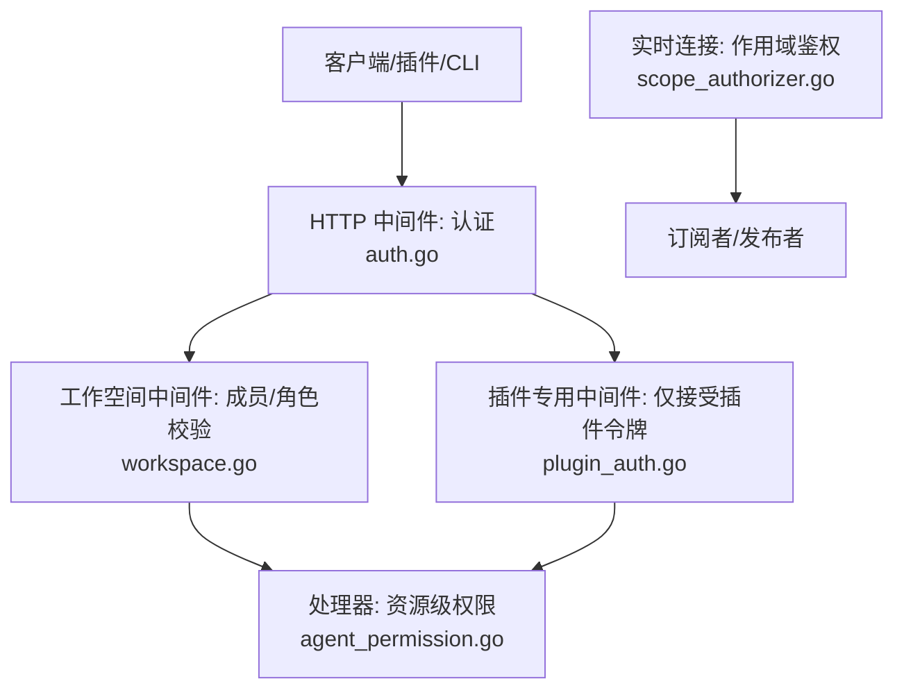

**图表来源**
- [server/internal/middleware/auth.go:34-267](file://server/internal/middleware/auth.go#L34-L267)
- [server/internal/middleware/workspace.go:158-266](file://server/internal/middleware/workspace.go#L158-L266)
- [server/internal/middleware/plugin_auth.go:10-47](file://server/internal/middleware/plugin_auth.go#L10-L47)
- [server/cmd/server/scope_authorizer.go:23-112](file://server/cmd/server/scope_authorizer.go#L23-L112)

**章节来源**
- [server/internal/middleware/auth.go:34-267](file://server/internal/middleware/auth.go#L34-L267)
- [server/internal/middleware/workspace.go:158-266](file://server/internal/middleware/workspace.go#L158-L266)
- [server/internal/middleware/plugin_auth.go:10-47](file://server/internal/middleware/plugin_auth.go#L10-L47)
- [server/cmd/server/scope_authorizer.go:23-112](file://server/cmd/server/scope_authorizer.go#L23-L112)

## 核心组件
- 认证中间件：统一处理 JWT、个人访问令牌（PAT）、云节点 PAT、任务令牌（mat_），并注入 X-User-ID、X-Agent-ID、X-Task-ID、X-Workspace-ID、X-Actor-Source 等头部，作为后续权限判断的依据。
- 工作空间中间件：解析目标工作空间（支持 slug/ID/查询参数），校验用户是否为成员或具备指定角色，并将成员信息注入上下文。
- 插件认证中间件：对公共 Action API 强制要求插件 Bearer 令牌（mpi_/mpc_），将插件流量与人类会话隔离。
- 作用域鉴权器：针对实时通道中的任务/聊天作用域进行细粒度校验，确保订阅/发布仅在合法范围内。
- 代理调用权限：为智能体（Agent）提供“私有/公开到指定范围”的调用许可模型，支持工作空间、成员、团队三类目标。

**章节来源**
- [server/internal/middleware/auth.go:34-267](file://server/internal/middleware/auth.go#L34-L267)
- [server/internal/middleware/workspace.go:158-266](file://server/internal/middleware/workspace.go#L158-L266)
- [server/internal/middleware/plugin_auth.go:10-47](file://server/internal/middleware/plugin_auth.go#L10-L47)
- [server/cmd/server/scope_authorizer.go:23-112](file://server/cmd/server/scope_authorizer.go#L23-L112)
- [server/internal/handler/agent_permission.go:22-187](file://server/internal/handler/agent_permission.go#L22-L187)

## 架构总览
下图展示从请求进入、身份识别、作用域解析、权限验证到访问决策的整体流程，以及插件与人类流量的隔离点。

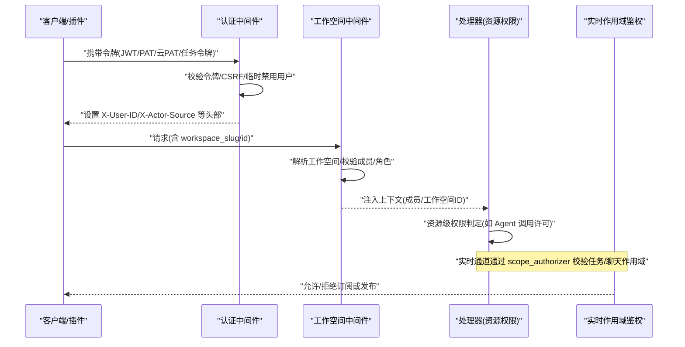

**图表来源**
- [server/internal/middleware/auth.go:34-267](file://server/internal/middleware/auth.go#L34-L267)
- [server/internal/middleware/workspace.go:158-266](file://server/internal/middleware/workspace.go#L158-L266)
- [server/cmd/server/scope_authorizer.go:23-112](file://server/cmd/server/scope_authorizer.go#L23-L112)

## 详细组件分析

### 认证中间件（JWT、PAT、云PAT、任务令牌）
- 令牌优先级：Authorization Bearer > HttpOnly Cookie（状态变更需 CSRF）。
- 任务令牌（mat_）：绑定 (user_id, agent_id, task_id, workspace_id)，写入权威头部，下游不可伪造。
- 云节点 PAT（mcn_）：委托云端 Fleet 服务验证，失败返回 503 以便重试。
- 个人访问令牌（mul_）：本地缓存命中可跳过 DB 与 last_used_at 更新，降低热点压力。
- JWT：HS256 签名，校验子字段 sub/email，拒绝临时禁用用户。

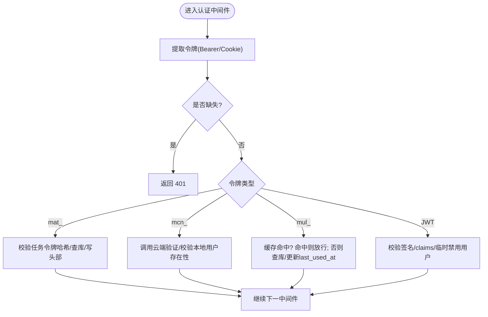

**图表来源**
- [server/internal/middleware/auth.go:34-267](file://server/internal/middleware/auth.go#L34-L267)

**章节来源**
- [server/internal/middleware/auth.go:34-267](file://server/internal/middleware/auth.go#L34-L267)
- [server/internal/auth/jwt.go:21-96](file://server/internal/auth/jwt.go#L21-L96)

### 工作空间中间件（成员与角色）
- 工作空间解析优先级：任务令牌绑定的工作空间 > 上下文注入 > slug（头/查询）> ID（头/查询）。
- 任务令牌场景下，任何客户端传入的工作空间标识均被忽略，防止越界。
- 校验用户是否为该工作空间成员，并可要求特定角色。
- 将成员与工作空间 ID 注入上下文供下游使用。

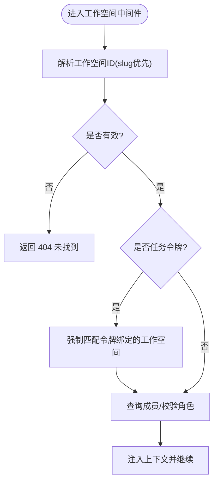

**图表来源**
- [server/internal/middleware/workspace.go:47-150](file://server/internal/middleware/workspace.go#L47-L150)
- [server/internal/middleware/workspace.go:158-266](file://server/internal/middleware/workspace.go#L158-L266)

**章节来源**
- [server/internal/middleware/workspace.go:47-150](file://server/internal/middleware/workspace.go#L47-L150)
- [server/internal/middleware/workspace.go:158-266](file://server/internal/middleware/workspace.go#L158-L266)

### 插件权限隔离（公共 Action API）
- 公共 /v1 接口仅接受插件 Bearer 令牌（mpi_/mpc_），浏览器会话走独立桥接路由。
- 前缀匹配仅用于路由分流，具体令牌有效性由处理器进一步校验。

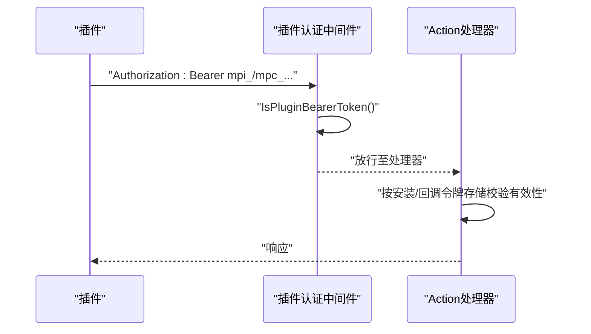

**图表来源**
- [server/internal/middleware/plugin_auth.go:10-47](file://server/internal/middleware/plugin_auth.go#L10-L47)

**章节来源**
- [server/internal/middleware/plugin_auth.go:10-47](file://server/internal/middleware/plugin_auth.go#L10-L47)

### 实时作用域鉴权（任务/聊天）
- 任务作用域：若任务关联问题，则同工作空间成员可见；若关联聊天会话，仅创建者可订阅（与 HTTP 层一致）。
- 聊天作用域：仅创建者可订阅，避免跨成员泄露私密聊天事件。
- 查找失败区分：无行视为拒绝（403），其他错误向上抛出以便上层报告“查找失败”。

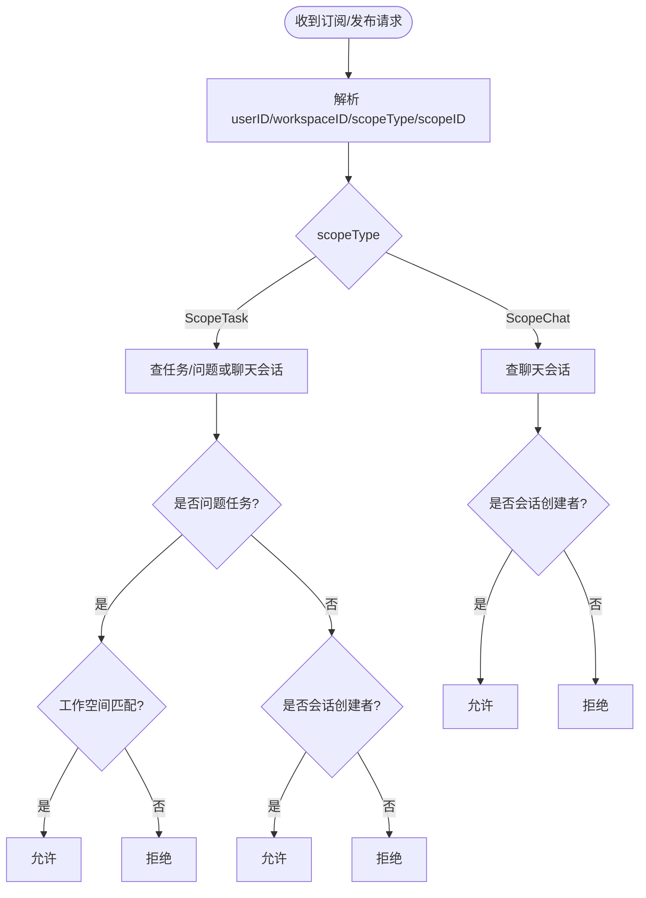

**图表来源**
- [server/cmd/server/scope_authorizer.go:47-112](file://server/cmd/server/scope_authorizer.go#L47-L112)

**章节来源**
- [server/cmd/server/scope_authorizer.go:47-112](file://server/cmd/server/scope_authorizer.go#L47-L112)

### 智能体（Agent）调用许可（细粒度权限）
- 模式：private（默认拒绝）与 public_to（显式白名单）。
- 目标类型：workspace（工作空间内所有成员）、member（指定用户）、team（指定团队）。
- 兼容旧版 visibility 字段，自动推导 legacy 值，保证向后兼容。
- 更新时比较当前与期望的目标集合，避免非拥有者的误改。

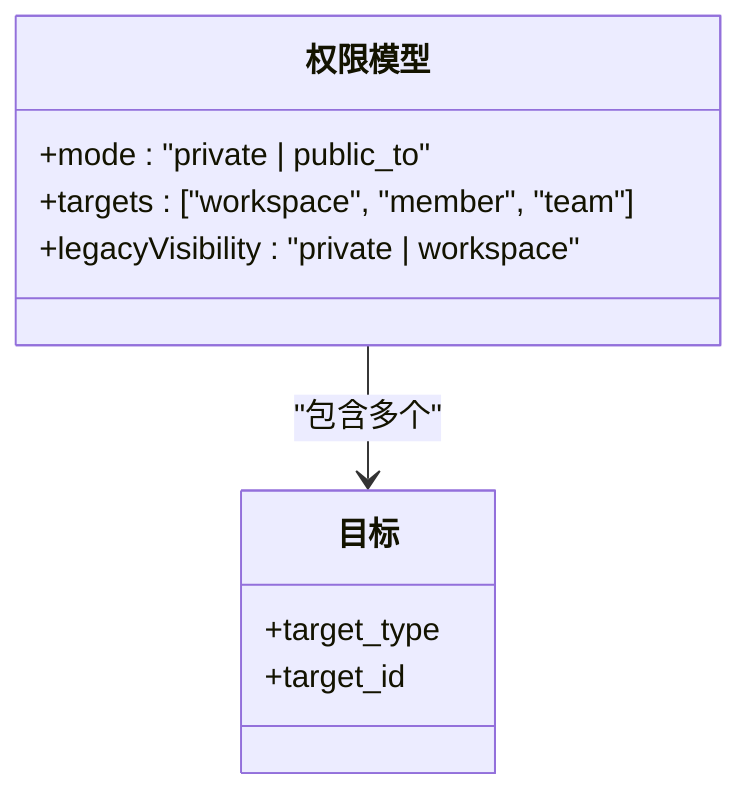

**图表来源**
- [server/internal/handler/agent_permission.go:22-187](file://server/internal/handler/agent_permission.go#L22-L187)

**章节来源**
- [server/internal/handler/agent_permission.go:22-187](file://server/internal/handler/agent_permission.go#L22-L187)

### 权限层次结构与资源模型
- 用户级：JWT/PAT 持有者身份；任务令牌限定 (user, agent, task, workspace)。
- 工作空间级：成员/角色决定能否访问工作空间资源。
- 项目/任务级：任务作用域由问题归属工作空间决定；聊天任务仅限创建者。
- 聊天会话级：严格限制为创建者。

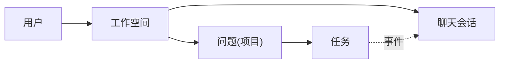

[此图为概念示意，不直接映射具体代码文件]

## 依赖关系分析
- 认证中间件依赖：
  - 令牌生成/哈希：jwt.go
  - 数据库查询：通过 db.Queries 获取任务令牌、PAT、工作空间、成员等
  - 云端验证：可选 cloudPAT 验证器
- 工作空间中间件依赖：
  - 解析 slug→UUID，校验成员/角色
- 作用域鉴权器依赖：
  - 查询任务、问题、聊天会话，判断归属与创建者
- 插件认证中间件：
  - 仅做前缀分流，处理器负责最终校验

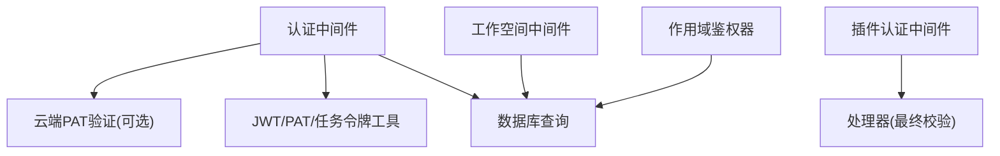

**图表来源**
- [server/internal/middleware/auth.go:34-267](file://server/internal/middleware/auth.go#L34-L267)
- [server/internal/middleware/workspace.go:158-266](file://server/internal/middleware/workspace.go#L158-L266)
- [server/cmd/server/scope_authorizer.go:47-112](file://server/cmd/server/scope_authorizer.go#L47-L112)
- [server/internal/middleware/plugin_auth.go:10-47](file://server/internal/middleware/plugin_auth.go#L10-L47)
- [server/internal/auth/jwt.go:21-96](file://server/internal/auth/jwt.go#L21-L96)

**章节来源**
- [server/internal/middleware/auth.go:34-267](file://server/internal/middleware/auth.go#L34-L267)
- [server/internal/middleware/workspace.go:158-266](file://server/internal/middleware/workspace.go#L158-L266)
- [server/cmd/server/scope_authorizer.go:47-112](file://server/cmd/server/scope_authorizer.go#L47-L112)
- [server/internal/middleware/plugin_auth.go:10-47](file://server/internal/middleware/plugin_auth.go#L10-L47)
- [server/internal/auth/jwt.go:21-96](file://server/internal/auth/jwt.go#L21-L96)

## 性能考虑
- PAT 缓存：命中时跳过 DB 查询与 last_used_at 更新，减少热点写入。
- 任务令牌：一次性绑定，避免重复校验开销。
- 工作空间 slug 解析：建议短期缓存（slug 不可变，安全）。
- 作用域鉴权：快速失败（无行即拒绝），异常路径区分“查找失败”，便于上层重试与降级。

[本节为通用指导，不直接分析具体文件]

## 故障排查指南
- 401 未认证：
  - 检查 Authorization 头或 Cookie 是否存在且格式正确。
  - 任务令牌 mat_ 必须来自服务端签发并被注入；禁止客户端伪造 X-Actor-Source。
- 403 权限不足：
  - 工作空间中间件未通过成员/角色校验。
  - 作用域鉴权器拒绝（非创建者订阅聊天、跨工作空间访问）。
  - 插件令牌前缀不符或被处理器拒绝。
- 404 未找到：
  - 工作空间 slug 不存在或任务/聊天资源不存在。
- 503 服务不可用：
  - 云端 PAT 验证器不可达，应重试而非丢弃令牌。

**章节来源**
- [server/internal/middleware/auth.go:34-267](file://server/internal/middleware/auth.go#L34-L267)
- [server/internal/middleware/workspace.go:158-266](file://server/internal/middleware/workspace.go#L158-L266)
- [server/cmd/server/scope_authorizer.go:47-112](file://server/cmd/server/scope_authorizer.go#L47-L112)
- [server/internal/middleware/plugin_auth.go:10-47](file://server/internal/middleware/plugin_auth.go#L10-L47)

## 结论
Multica 的授权系统以“认证中间件 + 工作空间中间件 + 作用域鉴权器 + 处理器资源权限”的分层架构实现，结合插件隔离与任务令牌绑定，形成从身份到作用域再到资源的完整闭环。通过细粒度的 Agent 调用许可模型与严格的聊天/任务作用域控制，既满足多租户协作需求，又保障数据隐私与安全性。

[本节为总结，不直接分析具体文件]

## 附录

### 权限检查流程（端到端）
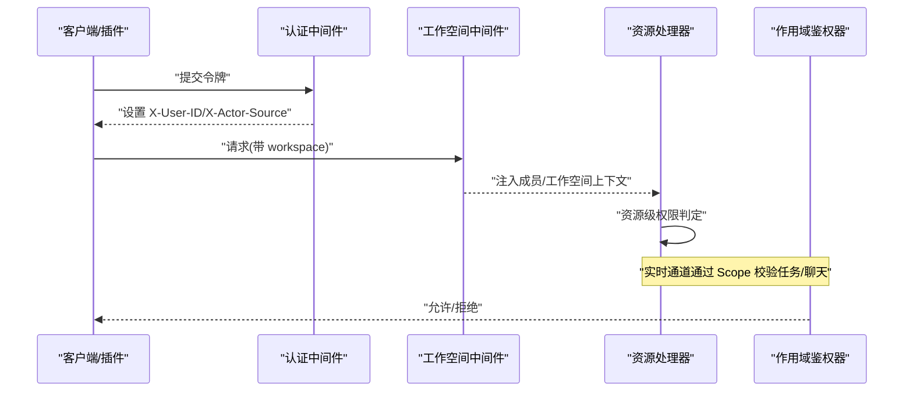

**图表来源**
- [server/internal/middleware/auth.go:34-267](file://server/internal/middleware/auth.go#L34-L267)
- [server/internal/middleware/workspace.go:158-266](file://server/internal/middleware/workspace.go#L158-L266)
- [server/cmd/server/scope_authorizer.go:47-112](file://server/cmd/server/scope_authorizer.go#L47-L112)

### 作用域映射关系图
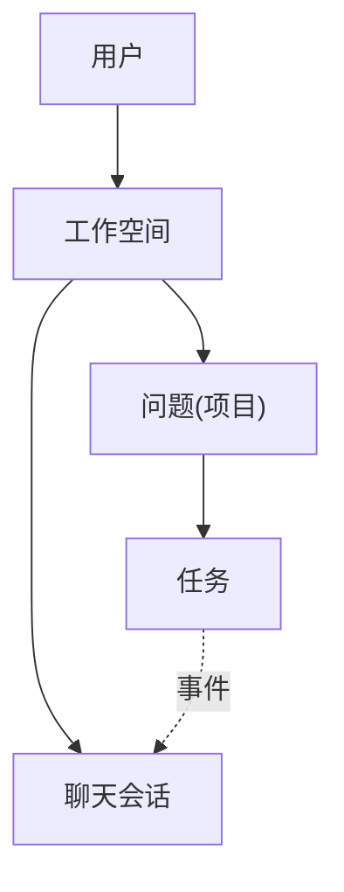

[此图为概念示意，不直接映射具体代码文件]

### 配置示例与安全最佳实践
- 环境变量
  - JWT_SECRET：生产环境必须设置为强随机值，禁止使用默认或模板占位符。
  - MULTICA_CLOUD_URL：启用云端 PAT 验证（mcn_ 令牌）时必须配置。
- 令牌策略
  - 优先使用任务令牌（mat_）运行智能体，最小化权限面。
  - 个人访问令牌（mul_）设置过期时间，定期轮换；利用缓存降低查询压力。
  - 插件使用 mpi_/mpc_ 前缀的 Bearer 令牌，并通过处理器进行最终校验。
- 访问控制
  - 工作空间 slug 优先于 ID，便于迁移与可读性。
  - 对敏感操作启用角色要求（如管理员/编辑者）。
  - 聊天会话严格限制为创建者；任务作用域遵循工作空间与创建者规则。
- 审计与可观测性
  - 记录认证失败、CSRF 失败、临时禁用用户拒绝、云端验证失败等关键事件。
  - 对作用域查找失败与网络异常进行区分上报，便于快速定位。

**章节来源**
- [server/internal/auth/jwt.go:21-58](file://server/internal/auth/jwt.go#L21-L58)
- [server/internal/middleware/auth.go:34-267](file://server/internal/middleware/auth.go#L34-L267)
- [server/internal/middleware/plugin_auth.go:10-47](file://server/internal/middleware/plugin_auth.go#L10-L47)
- [server/internal/middleware/workspace.go:158-266](file://server/internal/middleware/workspace.go#L158-L266)
- [server/cmd/server/scope_authorizer.go:47-112](file://server/cmd/server/scope_authorizer.go#L47-L112)