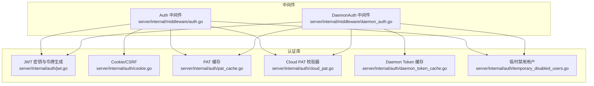
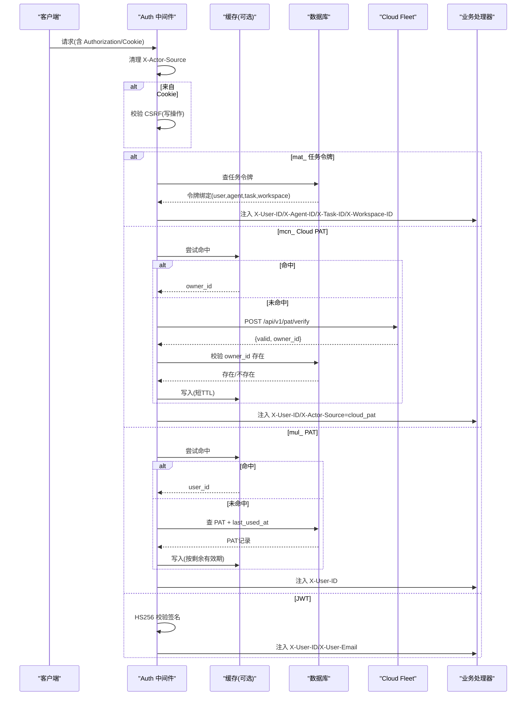
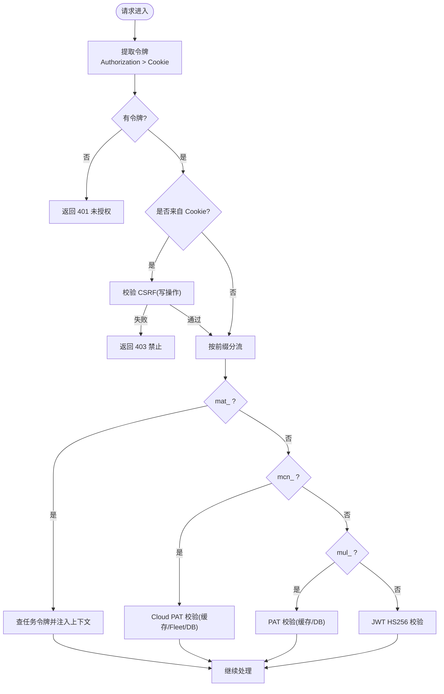
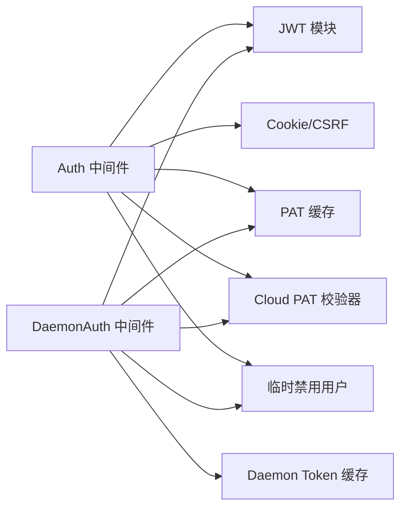

# 认证中间件

<cite>
**本文引用的文件**
- [server/internal/middleware/auth.go](file://server/internal/middleware/auth.go)
- [server/internal/middleware/daemon_auth.go](file://server/internal/middleware/daemon_auth.go)
- [server/internal/auth/jwt.go](file://server/internal/auth/jwt.go)
- [server/internal/auth/cookie.go](file://server/internal/auth/cookie.go)
- [server/internal/auth/cloud_pat.go](file://server/internal/auth/cloud_pat.go)
- [server/internal/auth/pat_cache.go](file://server/internal/auth/pat_cache.go)
- [server/internal/auth/daemon_token_cache.go](file://server/internal/auth/daemon_token_cache.go)
- [server/internal/auth/temporary_disabled_users.go](file://server/internal/auth/temporary_disabled_users.go)
</cite>

## 目录
1. [简介](#简介)
2. [项目结构](#项目结构)
3. [核心组件](#核心组件)
4. [架构总览](#架构总览)
5. [详细组件分析](#详细组件分析)
6. [依赖关系分析](#依赖关系分析)
7. [性能考虑](#性能考虑)
8. [故障排除指南](#故障排除指南)
9. [结论](#结论)
10. [附录：配置与令牌说明](#附录：令牌与配置)

## 简介
本文件面向 Multica 后端的认证中间件，系统性阐述 JWT 令牌验证、Cookie 管理与会话处理机制，覆盖用户身份认证流程（令牌解析 → 权限检查 → 上下文注入），并详细说明多认证方式支持：Bearer Token、Cookie Session、Personal Access Token（PAT）、Cloud PAT、Agent Task Token。文档包含认证流程图、令牌结构与缓存策略、安全注意事项，以及刷新机制、多设备登录支持与认证状态同步的实践建议。

## 项目结构
认证能力由“中间件层 + 认证库”组成：
- 中间件层：负责从请求中提取令牌、校验来源、执行 CSRF、设置响应头与上下文。
- 认证库：提供 JWT 密钥管理、Cookie 生成与校验、PAT/Cloud PAT/Daemon Token 的缓存与校验逻辑。

**图表来源**
- [server/internal/middleware/auth.go:34-267](file://server/internal/middleware/auth.go#L34-L267)
- [server/internal/middleware/daemon_auth.go:62-268](file://server/internal/middleware/daemon_auth.go#L62-L268)
- [server/internal/auth/jwt.go:21-95](file://server/internal/auth/jwt.go#L21-L95)
- [server/internal/auth/cookie.go:148-255](file://server/internal/auth/cookie.go#L148-L255)
- [server/internal/auth/pat_cache.go:12-109](file://server/internal/auth/pat_cache.go#L12-L109)
- [server/internal/auth/cloud_pat.go:159-294](file://server/internal/auth/cloud_pat.go#L159-L294)
- [server/internal/auth/daemon_token_cache.go:27-99](file://server/internal/auth/daemon_token_cache.go#L27-L99)
- [server/internal/auth/temporary_disabled_users.go:8-44](file://server/internal/auth/temporary_disabled_users.go#L8-L44)

**章节来源**
- [server/internal/middleware/auth.go:34-267](file://server/internal/middleware/auth.go#L34-L267)
- [server/internal/middleware/daemon_auth.go:62-268](file://server/internal/middleware/daemon_auth.go#L62-L268)

## 核心组件
- Auth 中间件：统一入口，按优先级提取令牌（Authorization Bearer > Cookie），对 Cookie 路径强制 CSRF 校验；根据令牌前缀分流至任务令牌、Cloud PAT、PAT、JWT 分支；设置 X-User-ID/X-User-Email/X-Actor-Source 等下游可用标识。
- DaemonAuth 中间件：面向守护进程/内部通道，优先 mdt_ 任务令牌，其次 mcn_ Cloud PAT、mul_ PAT、JWT；将工作区与守护进程 ID 注入上下文。
- JWT 模块：HS256 签名校验、密钥加载与安全校验、令牌生成与哈希。
- Cookie 模块：HttpOnly 认证 Cookie、CSRF Cookie 生成与校验、TTL 与 Secure/SameSite 策略。
- 缓存模块：PAT 缓存、Daemon Token 缓存、Cloud PAT 缓存（Redis）；统一 TTL 与失效策略。
- 临时禁用用户：在认证各分支前置拦截，返回明确错误码。

**章节来源**
- [server/internal/middleware/auth.go:34-267](file://server/internal/middleware/auth.go#L34-L267)
- [server/internal/middleware/daemon_auth.go:62-268](file://server/internal/middleware/daemon_auth.go#L62-L268)
- [server/internal/auth/jwt.go:21-95](file://server/internal/auth/jwt.go#L21-L95)
- [server/internal/auth/cookie.go:148-255](file://server/internal/auth/cookie.go#L148-L255)
- [server/internal/auth/pat_cache.go:12-109](file://server/internal/auth/pat_cache.go#L12-L109)
- [server/internal/auth/cloud_pat.go:159-294](file://server/internal/auth/cloud_pat.go#L159-L294)
- [server/internal/auth/daemon_token_cache.go:27-99](file://server/internal/auth/daemon_token_cache.go#L27-L99)
- [server/internal/auth/temporary_disabled_users.go:8-44](file://server/internal/auth/temporary_disabled_users.go#L8-L44)

## 架构总览
认证中间件采用“令牌前缀路由 + 分层校验”的架构：
- 令牌来源优先级：Authorization: Bearer > multica_auth Cookie
- 前缀路由：mat_（Agent Task Token）、mcn_（Cloud PAT）、mul_（PAT）、其他（JWT）
- 公共安全门：X-Actor-Source 清理、临时禁用用户检查、CSRF（Cookie 路径）
- 上下文注入：X-User-ID/X-User-Email（人类会话）、X-Agent-ID/X-Task-ID/X-Workspace-ID（任务令牌）、X-Actor-Source（来源标记）

**图表来源**
- [server/internal/middleware/auth.go:52-267](file://server/internal/middleware/auth.go#L52-L267)
- [server/internal/auth/cloud_pat.go:222-294](file://server/internal/auth/cloud_pat.go#L222-L294)
- [server/internal/auth/pat_cache.go:43-97](file://server/internal/auth/pat_cache.go#L43-L97)

**章节来源**
- [server/internal/middleware/auth.go:52-267](file://server/internal/middleware/auth.go#L52-L267)

## 详细组件分析

### 令牌解析与来源优先级
- 来源优先级：Authorization Bearer > multica_auth Cookie
- Cookie 路径：所有写操作必须携带 X-CSRF-Token，服务端以 HMAC-SHA256(authToken, nonce) 校验
- 失败策略：无令牌 → 401；CSRF 失败 → 403

**章节来源**
- [server/internal/middleware/auth.go:63-75](file://server/internal/middleware/auth.go#L63-L75)
- [server/internal/auth/cookie.go:148-185](file://server/internal/auth/cookie.go#L148-L185)
- [server/internal/auth/cookie.go:217-255](file://server/internal/auth/cookie.go#L217-L255)

### 任务令牌（mat_）
- 用途：Agent 任务专用，单用途且绑定 (user_id, agent_id, task_id, workspace_id)
- 流程：哈希 → 数据库查询 → 注入 X-User-ID/X-Agent-ID/X-Task-ID/X-Workspace-ID/X-Actor-Source=task_token
- 安全：上游禁止伪造 X-Actor-Source；人类专属端点拒绝该来源

**章节来源**
- [server/internal/middleware/auth.go:77-115](file://server/internal/middleware/auth.go#L77-L115)

### Cloud PAT（mcn_）
- 权威方：Multica Cloud Fleet；本地仅做 owner_id 存在性校验
- 缓存：Redis，短 TTL（约 60s），不缓存负结果，避免撤销延迟扩大
- 失败映射：无效 → 401；不可用/网络错误 → 503（便于重试）

**章节来源**
- [server/internal/auth/cloud_pat.go:18-85](file://server/internal/auth/cloud_pat.go#L18-L85)
- [server/internal/auth/cloud_pat.go:222-294](file://server/internal/auth/cloud_pat.go#L222-L294)
- [server/internal/middleware/auth.go:117-175](file://server/internal/middleware/auth.go#L117-L175)

### Personal Access Token（mul_）
- 流程：哈希 → 缓存命中或数据库查询 → 更新 last_used_at（异步）→ 写入缓存（TTL ≤ 剩余有效期）
- 缓存：Redis，TTL 上限 10 分钟；撤销时主动失效

**章节来源**
- [server/internal/middleware/auth.go:177-227](file://server/internal/middleware/auth.go#L177-L227)
- [server/internal/auth/pat_cache.go:12-109](file://server/internal/auth/pat_cache.go#L12-L109)

### JWT（HS256）
- 校验：仅允许 HS256；密钥来自环境变量或默认值（生产需校验非弱密钥）
- 载荷：sub 为必需；email 可选
- 注入：X-User-ID/X-User-Email

**章节来源**
- [server/internal/middleware/auth.go:229-264](file://server/internal/middleware/auth.go#L229-L264)
- [server/internal/auth/jwt.go:21-58](file://server/internal/auth/jwt.go#L21-L58)

### 守护进程认证（DaemonAuth）
- 优先 mdt_ 守护令牌：哈希 → 缓存/数据库 → 注入 WorkspaceID/DaemonID 到上下文
- 兼容回退：mcn_、mul_、JWT
- 上下文键：用于遥测与归属判断

**章节来源**
- [server/internal/middleware/daemon_auth.go:62-268](file://server/internal/middleware/daemon_auth.go#L62-L268)
- [server/internal/auth/daemon_token_cache.go:27-99](file://server/internal/auth/daemon_token_cache.go#L27-L99)

### 临时禁用用户拦截
- 在所有认证分支中统一调用，命中则返回 403 并记录告警

**章节来源**
- [server/internal/auth/temporary_disabled_users.go:8-44](file://server/internal/auth/temporary_disabled_users.go#L8-L44)
- [server/internal/middleware/auth.go:20-32](file://server/internal/middleware/auth.go#L20-L32)

### 认证流程图（综合）

**图表来源**
- [server/internal/middleware/auth.go:52-267](file://server/internal/middleware/auth.go#L52-L267)
- [server/internal/auth/cloud_pat.go:222-294](file://server/internal/auth/cloud_pat.go#L222-L294)
- [server/internal/auth/pat_cache.go:43-97](file://server/internal/auth/pat_cache.go#L43-L97)

**章节来源**
- [server/internal/middleware/auth.go:52-267](file://server/internal/middleware/auth.go#L52-L267)

## 依赖关系分析
- 中间件依赖认证库：
  - Auth 中间件依赖 JWT、Cookie、PAT 缓存、Cloud PAT 校验器、临时禁用用户检查
  - DaemonAuth 中间件依赖 JWT、PAT 缓存、Daemon Token 缓存、Cloud PAT 校验器、临时禁用用户检查
- 外部依赖：
  - Redis：PAT/Cloud PAT/Daemon Token 缓存
  - PostgreSQL：PAT/任务令牌/守护令牌查询
  - Cloud Fleet：Cloud PAT 校验

**图表来源**
- [server/internal/middleware/auth.go:34-267](file://server/internal/middleware/auth.go#L34-L267)
- [server/internal/middleware/daemon_auth.go:62-268](file://server/internal/middleware/daemon_auth.go#L62-L268)

**章节来源**
- [server/internal/middleware/auth.go:34-267](file://server/internal/middleware/auth.go#L34-L267)
- [server/internal/middleware/daemon_auth.go:62-268](file://server/internal/middleware/daemon_auth.go#L62-L268)

## 性能考虑
- 缓存命中率：
  - PAT：TTL 上限 10 分钟，减少高频 CLI/守护进程的 DB 压力
  - Cloud PAT：TTL 约 60 秒，平衡撤销延迟与性能
  - Daemon Token：同 PAT 策略
- 写放大控制：
  - PAT last_used_at 仅在缓存未命中时异步更新
- 降级策略：
  - Redis 不可用时，自动回退到直接 DB 查询，不影响可用性
- 超时控制：
  - Cloud PAT 校验使用短超时，避免阻塞请求

**章节来源**
- [server/internal/auth/pat_cache.go:12-109](file://server/internal/auth/pat_cache.go#L12-L109)
- [server/internal/auth/cloud_pat.go:32-71](file://server/internal/auth/cloud_pat.go#L32-L71)
- [server/internal/auth/daemon_token_cache.go:27-99](file://server/internal/auth/daemon_token_cache.go#L27-L99)

## 故障排除指南
- 401 未授权
  - 无令牌或令牌格式错误：检查 Authorization 或 Cookie
  - JWT 签名无效：确认 JWT_SECRET 配置正确且非弱密钥
  - PAT/任务令牌无效：检查数据库记录与过期时间
  - Cloud PAT 无效：Fleet 返回 invalid；检查 token 状态与绑定
- 403 禁止
  - Cookie 写操作缺少有效 CSRF：确保前端发送 X-CSRF-Token
  - 账户被临时禁用：检查临时禁用列表
- 503 服务不可用
  - Cloud PAT 校验器不可达：网络或 Fleet 异常；稍后重试
  - Redis 不可用：自动回退到 DB；关注日志中的降级提示

**章节来源**
- [server/internal/middleware/auth.go:63-75](file://server/internal/middleware/auth.go#L63-L75)
- [server/internal/middleware/auth.go:117-175](file://server/internal/middleware/auth.go#L117-L175)
- [server/internal/auth/cloud_pat.go:73-85](file://server/internal/auth/cloud_pat.go#L73-L85)
- [server/internal/auth/temporary_disabled_users.go:8-44](file://server/internal/auth/temporary_disabled_users.go#L8-L44)

## 结论
Multica 认证中间件通过统一的令牌提取与分层校验，实现了高内聚、可扩展的身份认证体系。借助缓存与短 TTL 策略，在保证撤销及时性的同时显著降低后端压力。多认证方式（Bearer、Cookie、PAT、Cloud PAT、任务令牌）满足人类用户、CLI、守护进程与云端节点的不同场景。配合 CSRF、X-Actor-Source 与临时禁用用户机制，系统在安全性与可用性之间取得良好平衡。

## 附录：令牌与配置

### 令牌类型与前缀
- mat_：Agent 任务令牌，绑定 (user, agent, task, workspace)，单用途
- mcn_：Cloud PAT，由 Cloud Fleet 权威校验
- mul_：Personal Access Token，本地数据库校验
- JWT：HS256 签名，sub/email 载荷
- mdt_：守护进程令牌（DaemonAuth 专用）

**章节来源**
- [server/internal/middleware/auth.go:77-267](file://server/internal/middleware/auth.go#L77-L267)
- [server/internal/middleware/daemon_auth.go:106-268](file://server/internal/middleware/daemon_auth.go#L106-L268)
- [server/internal/auth/jwt.go:60-89](file://server/internal/auth/jwt.go#L60-L89)

### Cookie 与会话
- 名称：multica_auth（HttpOnly）、multica_csrf（可读）
- 属性：Secure（基于 FRONTEND_ORIGIN 方案）、SameSite=Strict、TTL 可配置
- CSRF：HMAC-SHA256(authToken, nonce)，写操作强制校验

**章节来源**
- [server/internal/auth/cookie.go:148-185](file://server/internal/auth/cookie.go#L148-L185)
- [server/internal/auth/cookie.go:217-255](file://server/internal/auth/cookie.go#L217-L255)

### 关键环境变量
- JWT_SECRET：JWT 签名密钥（生产必须为非弱值）
- AUTH_TOKEN_TTL：Cookie 会话 TTL（Go duration 或秒数）
- COOKIE_DOMAIN：Cookie Domain（不能为 IP）
- FRONTEND_ORIGIN：决定 Secure Cookie 标志
- MULTICA_CLOUD_URL：Cloud PAT 校验器基地址（为空则不支持 mcn_）

**章节来源**
- [server/internal/auth/jwt.go:21-58](file://server/internal/auth/jwt.go#L21-L58)
- [server/internal/auth/cookie.go:70-128](file://server/internal/auth/cookie.go#L70-L128)
- [server/internal/auth/cloud_pat.go:174-213](file://server/internal/auth/cloud_pat.go#L174-L213)

### 刷新机制与多设备登录
- Cookie 刷新：通过 SetAuthCookies 设置新会话；ClearAuthCookies 登出
- PAT 刷新：客户端重新申请 PAT；服务端缓存按剩余有效期与撤销立即失效
- Cloud PAT 刷新：由 Cloud Fleet 管理；本地缓存短 TTL 保障撤销时效
- 多设备登录：每个设备持有独立 Cookie/PAT/JWT；互不影响
- 认证状态同步：撤销 PAT/任务令牌/守护令牌时主动失效缓存；Cloud PAT 依赖短 TTL 与 Fleet 权威

**章节来源**
- [server/internal/auth/cookie.go:148-215](file://server/internal/auth/cookie.go#L148-L215)
- [server/internal/auth/pat_cache.go:59-109](file://server/internal/auth/pat_cache.go#L59-L109)
- [server/internal/auth/cloud_pat.go:222-294](file://server/internal/auth/cloud_pat.go#L222-L294)
- [server/internal/auth/daemon_token_cache.go:69-99](file://server/internal/auth/daemon_token_cache.go#L69-L99)

### 安全注意事项
- 仅接受 HS256 JWT；拒绝未知算法
- 严格清理 X-Actor-Source，防止伪造来源
- Cookie 写操作强制 CSRF；Secure 与 SameSite 严格模式
- Cloud PAT 不可用返回 503，避免误判为 401 导致客户端丢弃有效令牌
- 临时禁用用户统一拦截，快速下线风险账户

**章节来源**
- [server/internal/middleware/auth.go:54-75](file://server/internal/middleware/auth.go#L54-L75)
- [server/internal/middleware/auth.go:117-175](file://server/internal/middleware/auth.go#L117-L175)
- [server/internal/auth/jwt.go:21-58](file://server/internal/auth/jwt.go#L21-L58)
- [server/internal/auth/temporary_disabled_users.go:8-44](file://server/internal/auth/temporary_disabled_users.go#L8-L44)