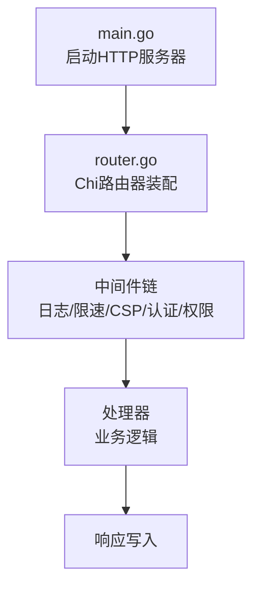
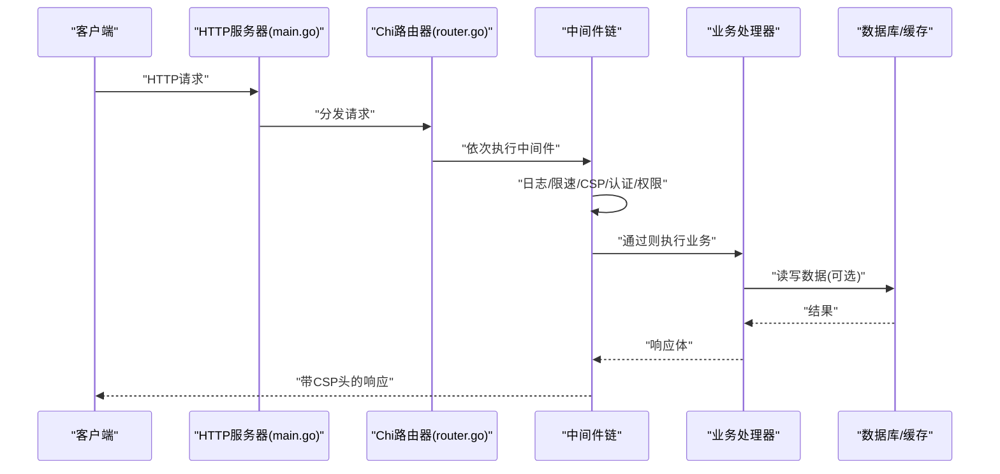
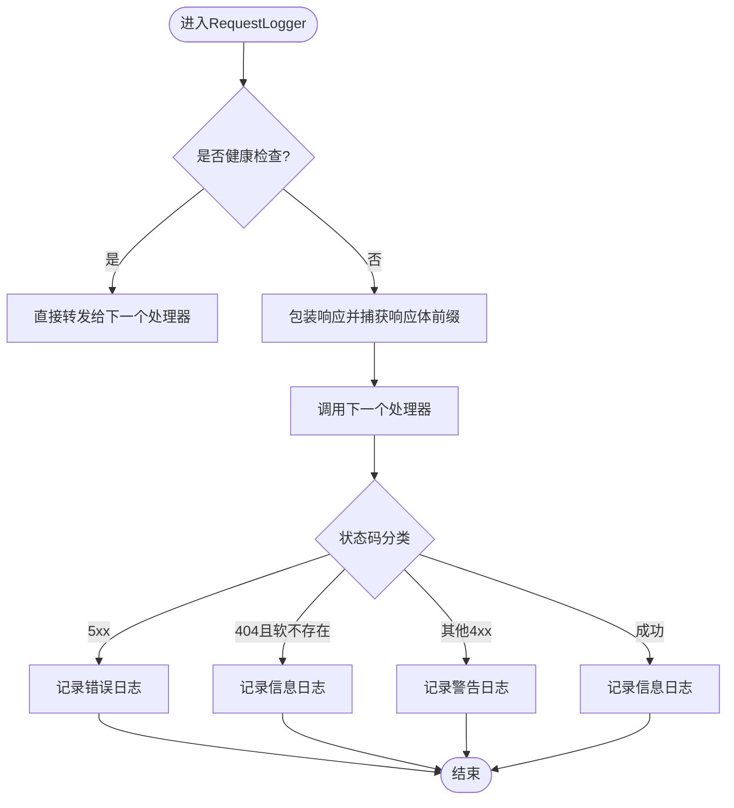
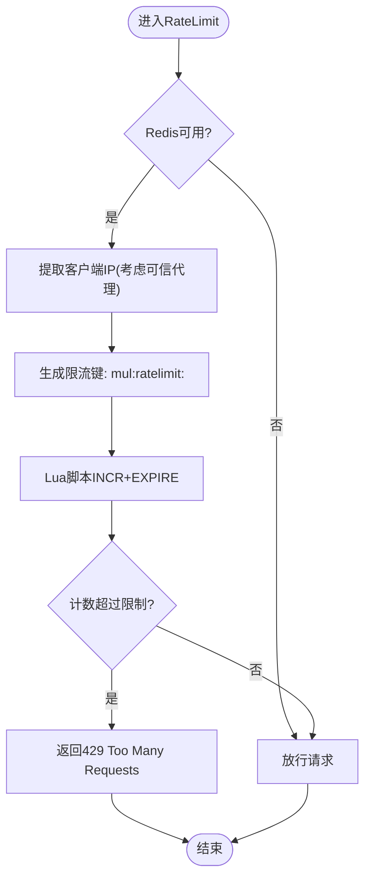
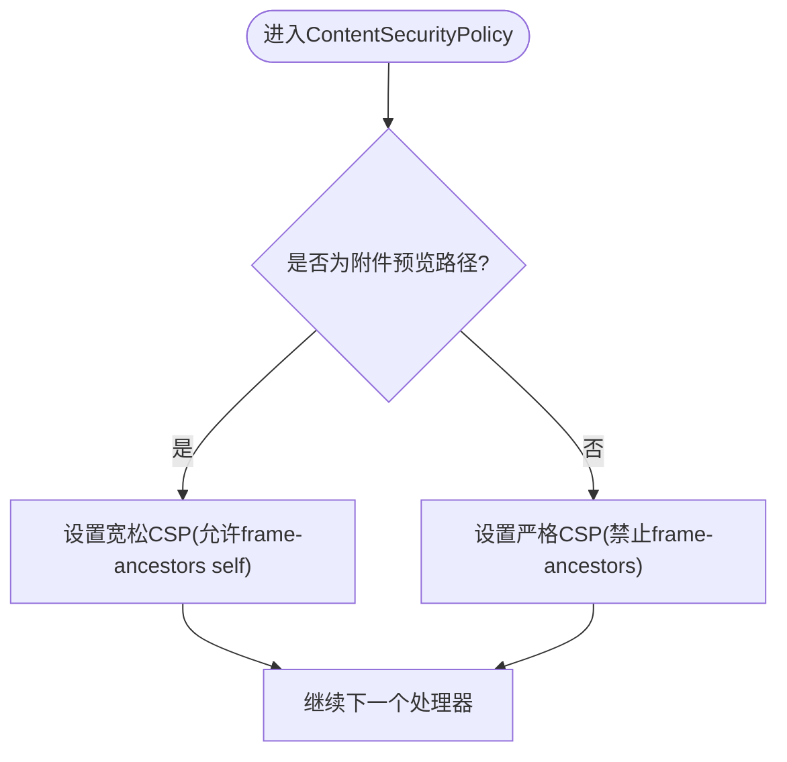
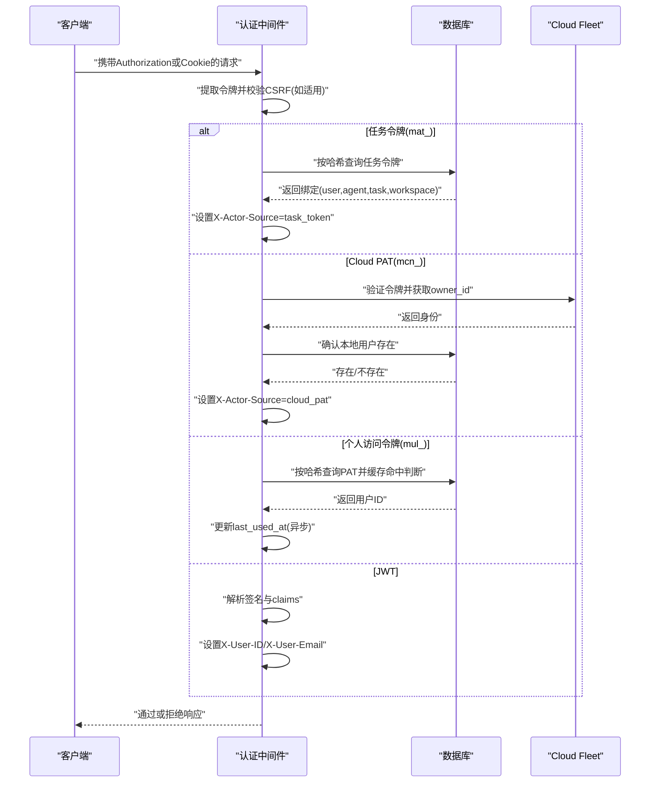
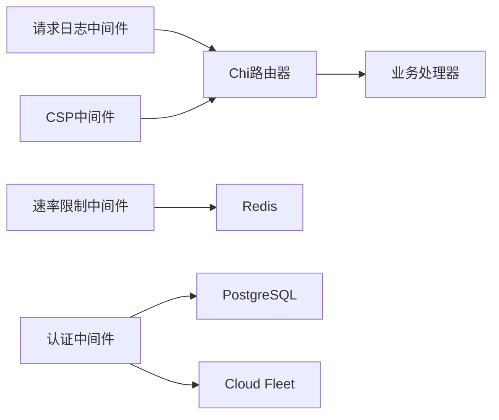
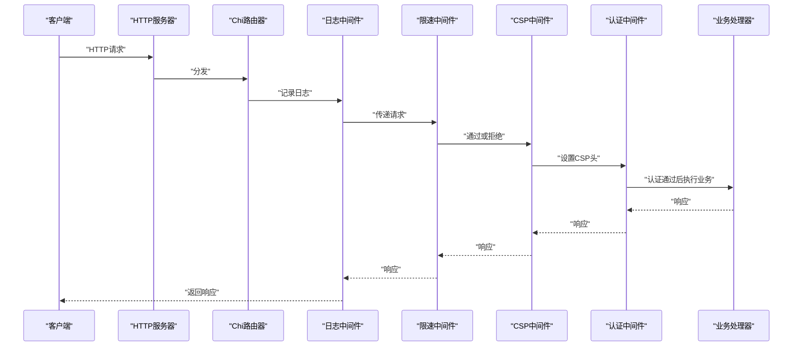

# 请求生命周期

<cite>
**本文引用的文件**
- [server/cmd/server/main.go](file://server/cmd/server/main.go)
- [server/cmd/server/router.go](file://server/cmd/server/router.go)
- [server/internal/middleware/request_logger.go](file://server/internal/middleware/request_logger.go)
- [server/internal/middleware/ratelimit.go](file://server/internal/middleware/ratelimit.go)
- [server/internal/middleware/csp.go](file://server/internal/middleware/csp.go)
- [server/internal/middleware/auth.go](file://server/internal/middleware/auth.go)
- [server/internal/middleware/owner_lookup.go](file://server/internal/middleware/owner_lookup.go)
</cite>

## 目录
1. [简介](#简介)
2. [项目结构](#项目结构)
3. [核心组件](#核心组件)
4. [架构总览](#架构总览)
5. [详细组件分析](#详细组件分析)
6. [依赖关系分析](#依赖关系分析)
7. [性能考量](#性能考量)
8. [故障排查指南](#故障排查指南)
9. [结论](#结论)
10. [附录](#附录)

## 简介
本文面向 Multica 后端（Go + Chi）的 HTTP 请求生命周期，系统化阐述从请求接收到响应返回的全链路：请求接收、中间件链执行、业务逻辑处理、响应生成。重点覆盖以下主题：
- 中间件执行顺序与作用：请求日志记录、速率限制、CSP 头设置、认证鉴权等
- 请求上下文的生命周期管理、错误传播机制、性能监控集成
- 请求限流算法与安全防护措施
- 调试工具集成与自定义中间件开发指南
- 性能优化建议

## 项目结构
Multica 后端以 Go 实现，入口在 server/cmd/server，路由与中间件装配在 router.go，通用中间件位于 server/internal/middleware。启动流程由 main.go 负责，构建 HTTP Server、注册路由、启动后台任务与指标服务。

图表来源
- [server/cmd/server/main.go:275-290](file://server/cmd/server/main.go#L275-L290)
- [server/cmd/server/router.go:204-214](file://server/cmd/server/router.go#L204-L214)

章节来源
- [server/cmd/server/main.go:275-290](file://server/cmd/server/main.go#L275-L290)
- [server/cmd/server/router.go:204-214](file://server/cmd/server/router.go#L204-L214)

## 核心组件
- 请求日志记录器：结构化日志、敏感路径脱敏、软 404 分类、请求 ID/用户信息/客户端元数据输出
- 速率限制中间件：基于 Redis 固定窗口计数、Lua 原子脚本、可信代理 IP 解析、失败开放策略
- CSP 安全策略：默认严格策略，附件预览放宽 frame-ancestors
- 认证中间件：支持 PAT/JWT/Cloud PAT/任务令牌，CSRF 校验，临时禁用用户拦截，X-Actor-Source 标记
- 所有者校验辅助：将 Cloud 返回的 owner_id 映射到本地用户存在性检查

章节来源
- [server/internal/middleware/request_logger.go:113-179](file://server/internal/middleware/request_logger.go#L113-L179)
- [server/internal/middleware/ratelimit.go:15-87](file://server/internal/middleware/ratelimit.go#L15-L87)
- [server/internal/middleware/csp.go:8-43](file://server/internal/middleware/csp.go#L8-L43)
- [server/internal/middleware/auth.go:34-267](file://server/internal/middleware/auth.go#L34-L267)
- [server/internal/middleware/owner_lookup.go:13-59](file://server/internal/middleware/owner_lookup.go#L13-L59)

## 架构总览
请求进入 HTTP 服务器后，经过 Chi 路由器的中间件链，最终到达具体处理器。关键阶段如下：
- 请求接收：main.go 创建 http.Server，设置读超时与空闲超时，避免慢连接攻击；WebSocket 升级路径不设置写超时以保证长连接
- 中间件链：按顺序执行日志、CSP、认证、权限、速率限制等（具体顺序取决于路由组装配）
- 业务处理：处理器调用服务层完成领域逻辑
- 响应生成：中间件统一记录状态码、耗时、请求 ID 等；CSP 头在响应前注入

图表来源
- [server/cmd/server/main.go:275-290](file://server/cmd/server/main.go#L275-L290)
- [server/cmd/server/router.go:204-214](file://server/cmd/server/router.go#L204-L214)
- [server/internal/middleware/request_logger.go:113-179](file://server/internal/middleware/request_logger.go#L113-L179)
- [server/internal/middleware/csp.go:26-31](file://server/internal/middleware/csp.go#L26-L31)

## 详细组件分析

### 请求日志记录中间件
- 功能要点
  - 跳过健康检查路径以减少噪音
  - 使用 WrapResponseWriter 捕获响应体前缀用于软 404 分类
  - 记录方法、路径（自动脱敏 webhook 令牌）、状态码、耗时、请求 ID、用户 ID、Webhook 触发 ID、客户端平台/版本/OS
  - 根据状态码分级输出：5xx 为错误，404 且匹配“软不存在”标记则为 Info，其他 4xx 为 Warn
- 安全注意
  - Webhook 路径中的令牌段会被替换为脱敏标记，避免泄露凭证

图表来源
- [server/internal/middleware/request_logger.go:113-179](file://server/internal/middleware/request_logger.go#L113-L179)
- [server/internal/middleware/request_logger.go:44-70](file://server/internal/middleware/request_logger.go#L44-L70)

章节来源
- [server/internal/middleware/request_logger.go:113-179](file://server/internal/middleware/request_logger.go#L113-L179)
- [server/internal/middleware/request_logger.go:44-70](file://server/internal/middleware/request_logger.go#L44-L70)

### 速率限制中间件
- 算法与实现
  - 基于 Redis 固定窗口计数，使用 Lua 脚本原子执行 INCR+EXPIRE，防止网络故障导致 key 永久存活
  - 支持可信代理白名单：当直连来自可信 CIDR 时，从 X-Forwarded-For 中自右向左提取最后一个非可信 IP 作为客户端标识
  - 超限返回 429 并附带 Retry-After 与 JSON 错误体
  - 失败开放：Redis 不可用时放行请求，避免单点故障影响可用性
- 键生成
  - 将 URL 路径规范化为键的一部分，结合客户端 IP，形成唯一限流键

图表来源
- [server/internal/middleware/ratelimit.go:15-87](file://server/internal/middleware/ratelimit.go#L15-L87)
- [server/internal/middleware/ratelimit.go:89-134](file://server/internal/middleware/ratelimit.go#L89-L134)

章节来源
- [server/internal/middleware/ratelimit.go:15-87](file://server/internal/middleware/ratelimit.go#L15-L87)
- [server/internal/middleware/ratelimit.go:89-134](file://server/internal/middleware/ratelimit.go#L89-L134)

### 内容安全策略(CSP)中间件
- 默认策略
  - 严格限制脚本、样式、图片、连接来源，禁止嵌套框架与对象，表单仅允许同源提交
- 附件预览放宽
  - 针对附件下载/内容路径放宽 frame-ancestors，允许自身页面嵌入预览文档
- 作用时机
  - 在请求进入下一个处理器之前设置响应头 Content-Security-Policy

图表来源
- [server/internal/middleware/csp.go:8-43](file://server/internal/middleware/csp.go#L8-L43)

章节来源
- [server/internal/middleware/csp.go:8-43](file://server/internal/middleware/csp.go#L8-L43)

### 认证中间件
- 支持的令牌类型与优先级
  - Authorization: Bearer <token>（PAT 或 JWT）优先于 Cookie
  - Cookie 认证需 CSRF 校验（状态变更请求）
- 令牌分支
  - 任务令牌 mat_：查询任务令牌表，设置 X-User-ID/X-Agent-ID/X-Task-ID/X-Workspace-ID，并标记 X-Actor-Source=task_token
  - Cloud PAT mcn_：调用 Cloud Fleet 验证，确认本地用户存在，标记 X-Actor-Source=cloud_pat
  - 个人访问令牌 mul_：哈希查找，支持缓存减少 DB 压力，更新 last_used_at
  - JWT：解析签名与 claims，设置 X-User-ID/X-User-Email
- 安全控制
  - 删除客户端可能伪造的 X-Actor-Source，仅由中间件设置权威值
  - 临时禁用用户拦截，返回 403
- 错误处理
  - 无效令牌返回 401；Cloud 不可用返回 503；CSRF 失败返回 403

图表来源
- [server/internal/middleware/auth.go:34-267](file://server/internal/middleware/auth.go#L34-L267)
- [server/internal/middleware/owner_lookup.go:13-59](file://server/internal/middleware/owner_lookup.go#L13-L59)

章节来源
- [server/internal/middleware/auth.go:34-267](file://server/internal/middleware/auth.go#L34-L267)
- [server/internal/middleware/owner_lookup.go:13-59](file://server/internal/middleware/owner_lookup.go#L13-L59)

### 路由与中间件装配
- 路由器提供 NewRouterWithOptions，组装 handler、存储、渠道集成、指标、限流器等
- 各渠道（Slack/Lark/DingTalk/WeCom/Telegram）在路由器内注册 ResolverSet 与 Outbound，共享引擎 ChatSession 与 IssueService/TaskService
- 工作区范围路由通过分组中间件进行成员/角色校验，确保资源隔离

章节来源
- [server/cmd/server/router.go:390-509](file://server/cmd/server/router.go#L390-L509)
- [server/cmd/server/router.go:800-1200](file://server/cmd/server/router.go#L800-L1200)
- [server/cmd/server/router.go:1600-2000](file://server/cmd/server/router.go#L1600-L2000)

## 依赖关系分析
- 中间件耦合与内聚
  - 日志中间件独立，仅依赖 Chi 的响应包装器与 slog
  - 速率限制依赖 Redis 与 Lua 脚本，具备失败开放特性
  - CSP 中间件无外部依赖，纯响应头设置
  - 认证中间件依赖数据库与可选 Cloud 服务，具备强安全边界（X-Actor-Source 权威设置）
- 外部依赖
  - Redis：限流、实时中继、通道租约、指标采集等
  - PostgreSQL：用户/PAT/任务令牌等业务数据
  - Cloud Fleet：Cloud PAT 验证与配额/容量策略
- 潜在循环依赖
  - 中间件之间无直接相互引用，通过 Chi 链式组合，降低耦合风险

图表来源
- [server/internal/middleware/ratelimit.go:15-87](file://server/internal/middleware/ratelimit.go#L15-L87)
- [server/internal/middleware/auth.go:34-267](file://server/internal/middleware/auth.go#L34-L267)

章节来源
- [server/internal/middleware/ratelimit.go:15-87](file://server/internal/middleware/ratelimit.go#L15-L87)
- [server/internal/middleware/auth.go:34-267](file://server/internal/middleware/auth.go#L34-L267)

## 性能考量
- 请求日志
  - 健康检查路径被跳过，减少日志噪音
  - 响应体仅捕获有限前缀，避免大响应体导致的内存膨胀
- 速率限制
  - Lua 脚本保证原子性，减少竞争条件
  - 失败开放策略避免 Redis 故障引发级联拒绝
  - 可信代理配置可提升跨网段场景下的限流准确性
- 认证
  - PAT 缓存减少重复 DB 查询，last_used_at 更新频率受 TTL 限制
  - Cloud PAT 验证失败时返回 503，便于客户端重试
- 服务器超时
  - ReadHeaderTimeout 防慢连接攻击；WebSocket 路径不设置写超时保障长连接

章节来源
- [server/internal/middleware/request_logger.go:72-100](file://server/internal/middleware/request_logger.go#L72-L100)
- [server/internal/middleware/ratelimit.go:15-87](file://server/internal/middleware/ratelimit.go#L15-L87)
- [server/internal/middleware/auth.go:177-226](file://server/internal/middleware/auth.go#L177-L226)
- [server/cmd/server/main.go:275-290](file://server/cmd/server/main.go#L275-L290)

## 故障排查指南
- 常见问题定位
  - 401 未授权：检查 Authorization 头或 Cookie 是否存在；确认令牌类型与签名有效；JWT 密钥是否正确
  - 403 禁止：CSRF 校验失败；临时禁用用户；Cloud PAT 本地用户不存在
  - 429 过多请求：检查 Redis 限流键与阈值；确认可信代理配置是否正确
  - 503 服务不可用：Cloud PAT 验证器不可用；Redis 不可用（限流降级为放行）
- 日志分析
  - 关注 RequestLogger 输出的状态码与耗时；软 404 会记录为 Info，避免误报
  - 认证失败会记录警告日志，包含路径与错误原因
- 调试工具
  - pprof 与 /metrics 端点在启动时按需启用，可用于性能分析与指标观测
  - 请求 ID 可通过 chi 中间件获取，便于跨中间件追踪

章节来源
- [server/internal/middleware/auth.go:20-32](file://server/internal/middleware/auth.go#L20-L32)
- [server/internal/middleware/ratelimit.go:60-87](file://server/internal/middleware/ratelimit.go#L60-L87)
- [server/cmd/server/main.go:776-790](file://server/cmd/server/main.go#L776-L790)

## 结论
Multica 的后端请求生命周期以 Chi 路由器为核心，通过模块化中间件实现日志、限流、安全与认证等横切关注点。设计强调安全性（CSP、CSRF、X-Actor-Source 权威设置）、可靠性（失败开放、超时保护）与可观测性（结构化日志、指标）。在生产环境中，合理配置 Redis、可信代理与限流阈值，可有效平衡性能与安全。

## 附录

### 请求处理时序图（端到端）

图表来源
- [server/cmd/server/main.go:275-290](file://server/cmd/server/main.go#L275-L290)
- [server/internal/middleware/request_logger.go:113-179](file://server/internal/middleware/request_logger.go#L113-L179)
- [server/internal/middleware/ratelimit.go:60-87](file://server/internal/middleware/ratelimit.go#L60-L87)
- [server/internal/middleware/csp.go:26-31](file://server/internal/middleware/csp.go#L26-L31)
- [server/internal/middleware/auth.go:34-267](file://server/internal/middleware/auth.go#L34-L267)

### 自定义中间件开发指南
- 基本步骤
  - 实现 http.Handler 包装函数，接受 next http.Handler 并返回新的 http.HandlerFunc
  - 在中间件中读取/修改请求与响应，必要时设置响应头或提前返回错误
  - 将中间件注册到 Chi 路由器的 Group 或全局链中
- 最佳实践
  - 保持幂等性与短小职责，避免阻塞操作
  - 对敏感信息进行脱敏（如路径中的令牌）
  - 对外部依赖（Redis/DB）做失败开放或降级处理
  - 记录结构化日志，包含请求 ID、用户 ID、耗时等关键维度

章节来源
- [server/internal/middleware/request_logger.go:113-179](file://server/internal/middleware/request_logger.go#L113-L179)
- [server/internal/middleware/ratelimit.go:60-87](file://server/internal/middleware/ratelimit.go#L60-L87)
- [server/internal/middleware/csp.go:26-31](file://server/internal/middleware/csp.go#L26-L31)
- [server/internal/middleware/auth.go:34-267](file://server/internal/middleware/auth.go#L34-L267)