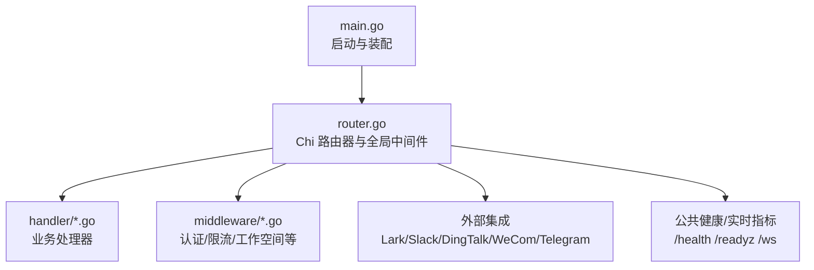
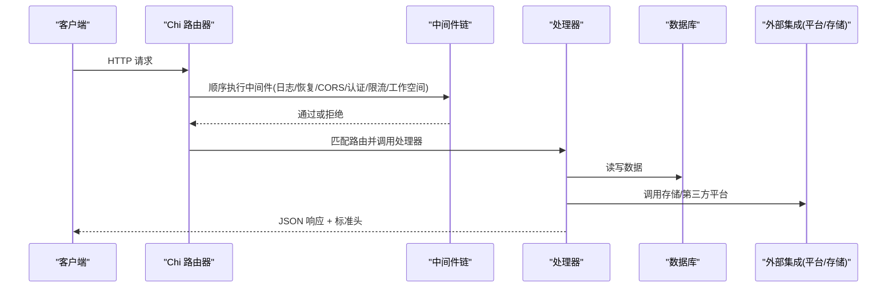
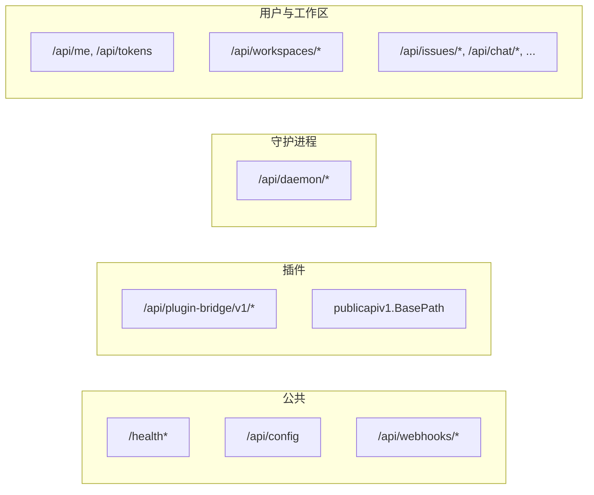
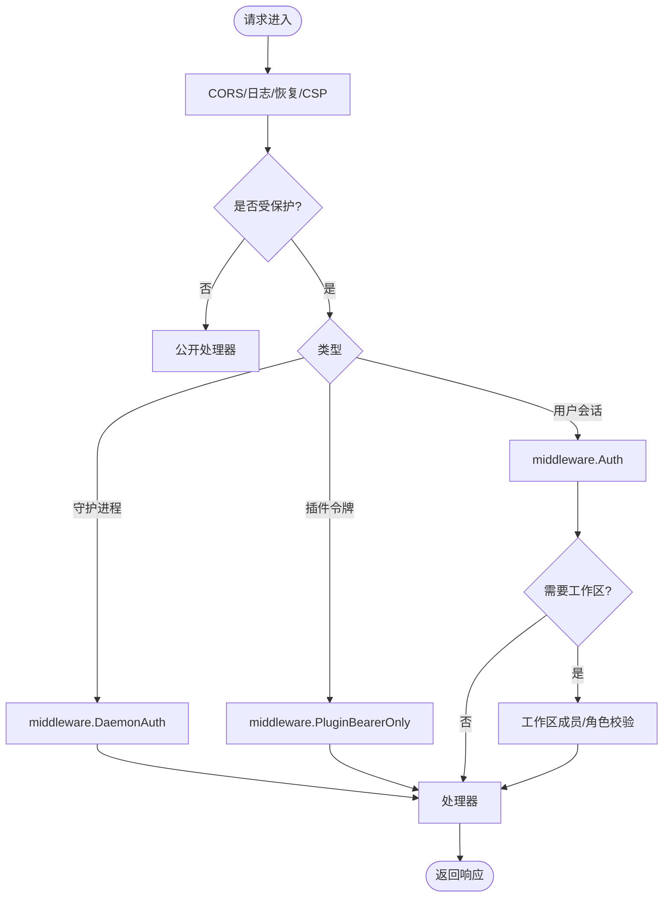
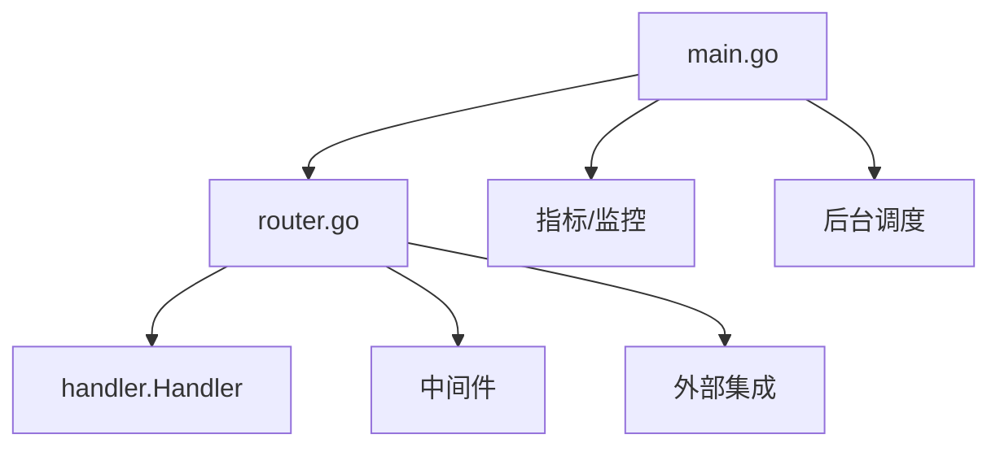

# 路由设计

<cite>
**本文引用的文件**
- [server/cmd/server/main.go](file://server/cmd/server/main.go)
- [server/cmd/server/router.go](file://server/cmd/server/router.go)
- [server/internal/handler/handler.go](file://server/internal/handler/handler.go)
- [server/internal/middleware/auth.go](file://server/internal/middleware/auth.go)
- [server/internal/middleware/daemon_auth.go](file://server/internal/middleware/daemon_auth.go)
- [server/internal/middleware/workspace.go](file://server/internal/middleware/workspace.go)
- [server/internal/middleware/ratelimit.go](file://server/internal/middleware/ratelimit.go)
</cite>

## 目录
1. [简介](#简介)
2. [项目结构](#项目结构)
3. [核心组件](#核心组件)
4. [架构总览](#架构总览)
5. [详细组件分析](#详细组件分析)
6. [依赖关系分析](#依赖关系分析)
7. [性能考量](#性能考量)
8. [故障排查指南](#故障排查指南)
9. [结论](#结论)
10. [附录：路由配置与最佳实践](#附录：路由配置与最佳实践)

## 简介
本文件系统性梳理 Multica 后端基于 Chi 的 HTTP 路由设计与端点组织模式，覆盖 API 版本控制策略、RESTful 规范、URL 命名约定、路由分组、参数绑定、请求验证、响应格式化、工作空间相关路由设计、动态路由参数处理、错误处理机制，并给出路由架构图、API 端点分类图与请求处理流程图。文档同时提供可操作的路由配置示例与最佳实践建议，帮助开发者在保持扩展性的前提下高效维护与演进 API。

## 项目结构
Multica 的后端服务入口位于 server/cmd/server，核心路由注册集中在 router.go，业务处理器集中于 server/internal/handler，通用中间件位于 server/internal/middleware。启动流程在 main.go 中完成依赖装配、后台任务与指标服务启动，随后构建路由器并监听端口。

**图表来源**
- [server/cmd/server/main.go:292-350](file://server/cmd/server/main.go#L292-L350)
- [server/cmd/server/router.go:1282-1340](file://server/cmd/server/router.go#L1282-L1340)

**章节来源**
- [server/cmd/server/main.go:292-350](file://server/cmd/server/main.go#L292-L350)
- [server/cmd/server/router.go:1282-1340](file://server/cmd/server/router.go#L1282-L1340)

## 核心组件
- 路由器与中间件链：使用 Chi 构建，统一注入 RequestID、客户端元数据、日志、恢复、CSP、CORS、认证、限流、工作空间鉴权等中间件。
- 处理器集合：按领域划分（Issue、Agent、Task、Chat、Workspace、Plugins、Integrations、Cloud Billing 等），通过路由分组集中挂载。
- 版本化与边界：
  - 插件公共 API 采用稳定版本路径前缀 publicapiv1.BasePath，并通过专用鉴权中间件隔离浏览器会话与机器令牌。
  - 内部桥接路径 /api/plugin-bridge/v1 用于宿主页面代理 iframe 调用，避免将会话 Cookie 暴露给公共 API 域。
- 工作空间上下文：通过 X-Workspace-ID/X-Workspace-Slug 与 URL 参数 id/slug 双重方式解析，配合中间件进行成员/角色校验。
- 动态参数：大量使用 Chi 路径参数（如 {id}、{workspaceId}、{taskId}、{sessionId}）实现 RESTful 资源定位。
- 请求验证与响应：处理器内对输入进行校验；响应包含分页、截断指示头（评论/时间线/活动运行）、ETag、X-Request-ID 等。

**章节来源**
- [server/cmd/server/router.go:1282-1340](file://server/cmd/server/router.go#L1282-L1340)
- [server/cmd/server/router.go:1488-1514](file://server/cmd/server/router.go#L1488-L1514)
- [server/cmd/server/router.go:1516-2300](file://server/cmd/server/router.go#L1516-L2300)
- [server/internal/handler/handler.go:68-152](file://server/internal/handler/handler.go#L68-L152)

## 架构总览
下图展示从请求进入、中间件处理、到具体处理器执行的完整链路，以及关键的外部集成与实时通道。

**图表来源**
- [server/cmd/server/router.go:1282-1340](file://server/cmd/server/router.go#L1282-L1340)
- [server/cmd/server/router.go:1516-2300](file://server/cmd/server/router.go#L1516-L2300)
- [server/internal/handler/handler.go:191-200](file://server/internal/handler/handler.go#L191-L200)

## 详细组件分析

### 路由分组与端点分类
- 公共与健康检查
  - /health、/readyz、/healthz：存活与就绪探针。
  - /health/realtime：实时子系统指标（可选鉴权）。
  - /ws：WebSocket 升级入口。
- 公开 API
  - /api/config、/api/contact-sales、/api/share-links/{code}：无需登录的配置与分享信息。
  - Webhook 入口：/api/webhooks/*（Autopilot、GitHub、VCS、Stripe），以路径中的 token/connectionId 作为凭据。
- 插件公共 API（v1）
  - 路径前缀 publicapiv1.BasePath，仅接受 mpi_/mpc_ Bearer Token，具备独立限流与 NotFound/MethodNotAllowed 处理。
- 插件桥接（浏览器会话）
  - /api/plugin-bridge/v1/*：受用户会话保护，供宿主页面转发 iframe 调用。
- 守护进程 API
  - /api/daemon/*：需 DaemonAuth（支持 PAT/云 PAT/守护令牌），提供任务生命周期、工作区仓库、运行时信息等。
- 用户级 API
  - /api/me、/api/tokens、/api/upload-file、/api/feedback、/api/client-usage 等。
- 工作区级 API（需成员身份）
  - /api/workspaces/*：成员/管理员/所有者多级权限控制。
  - /api/issues/*、/api/tasks/*、/api/chat/*、/api/inbox/*、/api/agents/*、/api/skills/*、/api/projects/*、/api/squads/*、/api/autopilots/*、/api/dashboard/*、/api/runtimes/*、/api/cloud-runtime/*、/api/cloud-billing/*、/api/cloud-subscriptions/* 等。

**图表来源**
- [server/cmd/server/router.go:1312-1431](file://server/cmd/server/router.go#L1312-L1431)
- [server/cmd/server/router.go:1488-1514](file://server/cmd/server/router.go#L1488-L1514)
- [server/cmd/server/router.go:1516-2300](file://server/cmd/server/router.go#L1516-L2300)

**章节来源**
- [server/cmd/server/router.go:1312-1431](file://server/cmd/server/router.go#L1312-L1431)
- [server/cmd/server/router.go:1488-1514](file://server/cmd/server/router.go#L1488-L1514)
- [server/cmd/server/router.go:1516-2300](file://server/cmd/server/router.go#L1516-L2300)

### 认证、授权与限流
- 全局中间件：RequestID、客户端元数据、请求日志、Recoverer、CSP、CORS。
- 认证中间件：
  - 普通用户会话：middleware.Auth（支持 PAT、云 PAT 校验）。
  - 守护进程：middleware.DaemonAuth（PAT/云 PAT/守护令牌）。
  - 插件：middleware.PluginBearerOnly（仅接受特定前缀的 Bearer Token）。
- 工作空间鉴权：
  - middleware.RequireWorkspaceMemberFromURL/RequireWorkspaceRoleFromURL：基于 URL 参数 id 解析工作区并校验成员/角色。
  - middleware.RequireWorkspaceMember：基于请求上下文的工作区成员校验。
- 限流：
  - 认证相关端点：/auth/* 使用 per-IP 限流。
  - 插件 API：/api/plugin-bridge/v1 与 publicapiv1.BasePath 具备独立限流。
  - 销售联系：/api/contact-sales 限流。

**图表来源**
- [server/cmd/server/router.go:1282-1340](file://server/cmd/server/router.go#L1282-L1340)
- [server/cmd/server/router.go:1433-1514](file://server/cmd/server/router.go#L1433-L1514)
- [server/cmd/server/router.go:1516-2300](file://server/cmd/server/router.go#L1516-L2300)
- [server/internal/middleware/auth.go](file://server/internal/middleware/auth.go)
- [server/internal/middleware/daemon_auth.go](file://server/internal/middleware/daemon_auth.go)
- [server/internal/middleware/workspace.go](file://server/internal/middleware/workspace.go)
- [server/internal/middleware/ratelimit.go](file://server/internal/middleware/ratelimit.go)

**章节来源**
- [server/cmd/server/router.go:1282-1340](file://server/cmd/server/router.go#L1282-L1340)
- [server/cmd/server/router.go:1433-1514](file://server/cmd/server/router.go#L1433-L1514)
- [server/cmd/server/router.go:1516-2300](file://server/cmd/server/router.go#L1516-L2300)
- [server/internal/middleware/auth.go](file://server/internal/middleware/auth.go)
- [server/internal/middleware/daemon_auth.go](file://server/internal/middleware/daemon_auth.go)
- [server/internal/middleware/workspace.go](file://server/internal/middleware/workspace.go)
- [server/internal/middleware/ratelimit.go](file://server/internal/middleware/ratelimit.go)

### 动态路由参数与工作空间上下文
- 动态参数：广泛使用 {id}、{workspaceId}、{taskId}、{sessionId}、{issueId}、{runtimeId}、{installationId}、{surfaceKey}、{connectionId} 等路径参数，结合 Chi 自动解析为处理器入参。
- 工作空间上下文：
  - 通过 URL 参数 id 解析工作区，并由 RequireWorkspaceMemberFromURL/RequireWorkspaceRoleFromURL 进行成员/角色校验。
  - 部分端点通过 X-Workspace-ID/X-Workspace-Slug 头部传递工作区标识，处理器据此选择上下文。
- 安全边界：
  - 绑定令牌兑换（/api/*/binding/redeem）在工作区上下文之前完成，身份来自会话，令牌仅证明“该外部用户请求绑定”。
  - 附件下载 /api/attachments/{id}/download 不要求工作区头，处理器从附件行自解析工作区并校验成员。

**章节来源**
- [server/cmd/server/router.go:1567-1743](file://server/cmd/server/router.go#L1567-L1743)
- [server/cmd/server/router.go:1745-1768](file://server/cmd/server/router.go#L1745-L1768)
- [server/cmd/server/router.go:1857-2300](file://server/cmd/server/router.go#L1857-L2300)

### 请求验证与响应格式化
- 请求验证：处理器内部对输入进行校验（例如 Issue、Agent、Skill、Project、Squad、Autopilot 等），失败时返回相应错误码与消息。
- 响应头：
  - ETag、X-Request-ID：缓存与追踪。
  - 截断指示头：评论/时间线/活动运行的截断标志，便于前端增量加载。
- 分页与查询：
  - Issues 列表支持 GET /api/issues 与 POST /api/issues/query（大数据量过滤集场景）。
  - 表视图：/api/issues/table/* 提供分组、行、维度聚合能力。

**章节来源**
- [server/cmd/server/router.go:1864-1917](file://server/cmd/server/router.go#L1864-L1917)
- [server/cmd/server/router.go:1919-2300](file://server/cmd/server/router.go#L1919-L2300)
- [server/internal/handler/handler.go:68-152](file://server/internal/handler/handler.go#L68-L152)

### 工作空间相关路由的设计模式
- 分层权限：
  - 成员可见：列出安装、连接、MCP 服务器、运行时资料等。
  - 管理员/所有者：创建/更新/删除成员、邀请、分享链接、插件包发布、运行时资料变更、VCS/Lark/Slack/WeCom/DingTalk/Telegram 管理。
- 资源归属：
  - 工作区资源（Issues、Projects、Squads、Skills、Pins、Views、Dashboard、Runtimes、Cloud Runtime、Billing/Subscriptions）均置于 /api/workspaces/{id} 下或通过 RequireWorkspaceMember 保护。
- 集成管理：
  - Lark/Slack/WeCom/DingTalk/Telegram 的安装、撤销、BYO 注册、组管理等，遵循成员可见、管理员/所有者操作的统一模式。

**章节来源**
- [server/cmd/server/router.go:1567-1743](file://server/cmd/server/router.go#L1567-L1743)
- [server/cmd/server/router.go:1857-2300](file://server/cmd/server/router.go#L1857-L2300)

### 错误处理机制
- 全局恢复：chi/middleware.Recoverer 捕获 panic，避免进程崩溃。
- 健康检查：/health、/readyz、/healthz 暴露服务状态。
- 实时指标：/health/realtime 提供连接数、慢客户端驱逐、事件发送 QPS 等指标（可选鉴权）。
- 插件 API：未命中返回 publicapiv1.NotFound，方法不支持返回 MethodNotAllowed。
- 限流与认证失败：根据中间件返回 401/403/429 等标准状态码。

**章节来源**
- [server/cmd/server/router.go:1312-1327](file://server/cmd/server/router.go#L1312-L1327)
- [server/cmd/server/router.go:1488-1514](file://server/cmd/server/router.go#L1488-L1514)

## 依赖关系分析
- 路由器依赖：
  - handler.Handler：业务逻辑入口，持有 Queries、Hub、Bus、存储、邮件服务等。
  - 中间件：认证、限流、工作空间鉴权、CSP、CORS、日志等。
  - 外部集成：Lark、Slack、DingTalk、WeCom、Telegram、Composio、VCS、Cloud Runtime、Storage。
- 启动期装配：
  - main.go 负责数据库连接池、Redis 客户端、实时中继、后台调度器、指标服务、监控服务器的初始化与启动。
  - router.go 在 NewRouterWithOptions 中组装 Handler 与所有集成模块，并注册路由。

**图表来源**
- [server/cmd/server/main.go:292-350](file://server/cmd/server/main.go#L292-L350)
- [server/cmd/server/router.go:397-510](file://server/cmd/server/router.go#L397-L510)
- [server/internal/handler/handler.go:191-200](file://server/internal/handler/handler.go#L191-L200)

**章节来源**
- [server/cmd/server/main.go:292-350](file://server/cmd/server/main.go#L292-L350)
- [server/cmd/server/router.go:397-510](file://server/cmd/server/router.go#L397-L510)
- [server/internal/handler/handler.go:191-200](file://server/internal/handler/handler.go#L191-L200)

## 性能考量
- 超时与连接：主 HTTP 服务器设置 ReadHeaderTimeout 与 IdleTimeout，保留 WebSocket 升级所需的零超时策略以避免连接被中断。
- 并发与队列：
  - 实时中继（Redis）支持分片与回放窗口，提升多节点广播与重放能力。
  - 心跳调度器批量上报，降低数据库压力。
- 缓存与限流：
  - Redis 支持的更新存储、模型列表缓存、本地技能列表、存活检测、Webhook/IP 限流、邀请限流等。
  - 认证与插件 API 的 per-IP 限流防止滥用。
- 只读副本：可选的只读副本池与读取选择器，减轻主库压力。

**章节来源**
- [server/cmd/server/main.go:275-290](file://server/cmd/server/main.go#L275-L290)
- [server/cmd/server/router.go:498-509](file://server/cmd/server/router.go#L498-L509)
- [server/cmd/server/router.go:1378-1386](file://server/cmd/server/router.go#L1378-L1386)

## 故障排查指南
- 启动阶段：
  - JWT_SECRET 与 APP_ENV 安全检查，生产环境禁止空密钥。
  - 数据库连接重试与回退策略，确保启动鲁棒性。
  - Redis 配置无效时降级为内存 Hub，不影响基本功能。
- 运行时：
  - 健康检查端点用于探测服务状态。
  - 实时指标端点用于诊断连接与事件投递问题。
  - 插件 API 的 NotFound/MethodNotAllowed 快速定位路由问题。
- 常见错误：
  - 认证失败：检查中间件链与令牌类型（用户/PAT/守护/插件）。
  - 工作区权限：确认 URL 参数 id 与头部 X-Workspace-ID 一致性。
  - 限流触发：查看 RATE_LIMIT_* 配置与可信代理设置。

**章节来源**
- [server/cmd/server/main.go:292-350](file://server/cmd/server/main.go#L292-L350)
- [server/cmd/server/router.go:1312-1327](file://server/cmd/server/router.go#L1312-L1327)
- [server/cmd/server/router.go:1488-1514](file://server/cmd/server/router.go#L1488-L1514)

## 结论
Multica 的 Chi 路由系统通过清晰的分层与分组、严格的认证与授权、完善的限流与错误处理、以及可扩展的外部集成，提供了高可用、高性能且易维护的 API 基础设施。工作空间相关路由采用统一的成员/角色权限模型，动态参数与 RESTful 风格使资源访问直观一致。建议在新增端点时遵循本文的命名约定、分组策略与安全边界，充分利用中间件与处理器职责分离，确保系统的长期可演进性。

## 附录：路由配置与最佳实践
- 路由分组建议
  - 公共端点：/health*、/api/config、/api/webhooks/*。
  - 插件公共 API：publicapiv1.BasePath，仅接受指定前缀的 Bearer Token。
  - 插件桥接：/api/plugin-bridge/v1/*，受用户会话保护。
  - 守护进程：/api/daemon/*，使用 DaemonAuth。
  - 用户与工作区：/api/me、/api/workspaces/{id}/*。
- 版本控制策略
  - 插件公共 API 使用稳定版本前缀，避免破坏性变更影响现有集成。
  - 内部桥接路径与公共 API 严格隔离，避免会话泄露。
- RESTful 与 URL 命名
  - 资源名词复数形式（issues、tasks、agents、projects 等）。
  - 子资源嵌套（/api/issues/{id}/comments、/api/agents/{id}/skills）。
  - 动词尽量使用 HTTP 方法表达（GET/POST/PUT/PATCH/DELETE）。
- 参数绑定与验证
  - 使用 Chi 路径参数绑定 {id}、{workspaceId}、{taskId} 等。
  - 处理器内对输入进行校验，返回明确错误信息。
- 请求验证与响应格式
  - 统一使用 ETag、X-Request-ID 与截断指示头。
  - 大数据查询优先使用 POST /api/issues/query。
- 工作空间路由最佳实践
  - 成员可见：列出安装、连接、MCP 服务器、运行时资料。
  - 管理员/所有者：敏感操作（成员管理、插件包发布、运行时资料变更）。
- 错误处理最佳实践
  - 利用 Recoverer 捕获异常。
  - 健康检查与实时指标用于运维监控。
  - 插件 API 使用 NotFound/MethodNotAllowed 明确错误语义。
- 配置示例（环境变量）
  - CORS_ALLOWED_ORIGINS、FRONTEND_ORIGIN：跨域白名单。
  - MULTICA_PUBLIC_URL、MULTICA_APP_URL：公共与应用基础地址。
  - MULTICA_TRUSTED_PROXIES：可信代理 CIDR。
  - REDIS_URL、REALTIME_RELAY_REDIS_URL：实时中继与缓存。
  - RATE_LIMIT_AUTH、RATE_LIMIT_AUTH_VERIFY、RATE_LIMIT_CONTACT_SALES、RATE_LIMIT_PLUGIN_API：限流阈值。
  - CHANNEL_WS_LEASE_BACKEND、CHANNEL_WS_LEASE_TTL、CHANNEL_WS_LEASE_RENEW_INTERVAL、CHANNEL_WS_LEASE_POLL_INTERVAL：频道租约配置。
  - MULTICA_LARK_SECRET_KEY、MULTICA_SLACK_SECRET_KEY、MULTICA_DINGTALK_SECRET_KEY、MULTICA_WECOM_SECRET_KEY、MULTICA_TELEGRAM_SECRET_KEY：集成开关与密钥。
  - COMPOSIO_API_KEY、COMPOSIO_CALLBACK_BASE_URL、COMPOSIO_STATE_SECRET：Composio 集成配置。
  - MULTICA_VCS_SECRET_KEY：VCS 集成加密密钥。
  - MULTICA_PLUGIN_SECRET_KEY：插件密钥与签名。

**章节来源**
- [server/cmd/server/router.go:114-161](file://server/cmd/server/router.go#L114-L161)
- [server/cmd/server/router.go:1378-1386](file://server/cmd/server/router.go#L1378-L1386)
- [server/cmd/server/router.go:1488-1514](file://server/cmd/server/router.go#L1488-L1514)
- [server/cmd/server/router.go:1516-2300](file://server/cmd/server/router.go#L1516-L2300)
- [server/internal/handler/handler.go:68-152](file://server/internal/handler/handler.go#L68-L152)