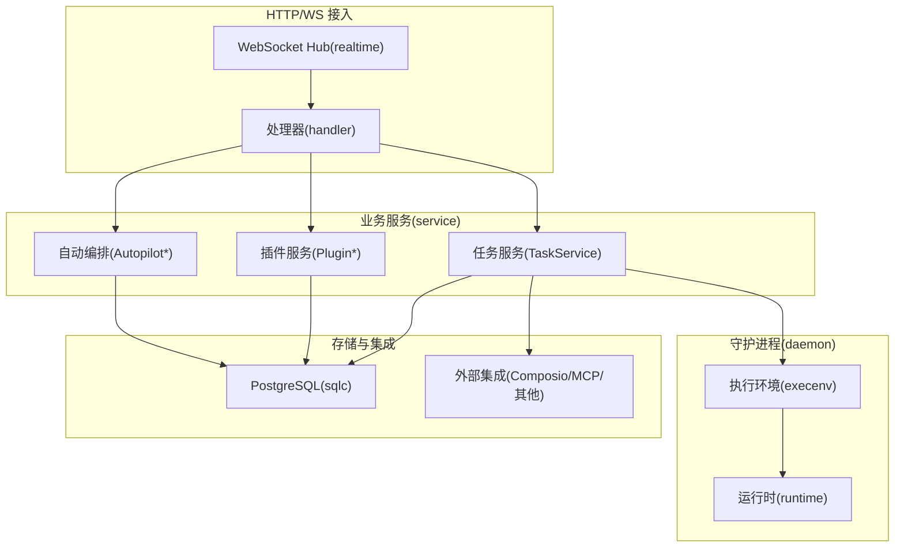
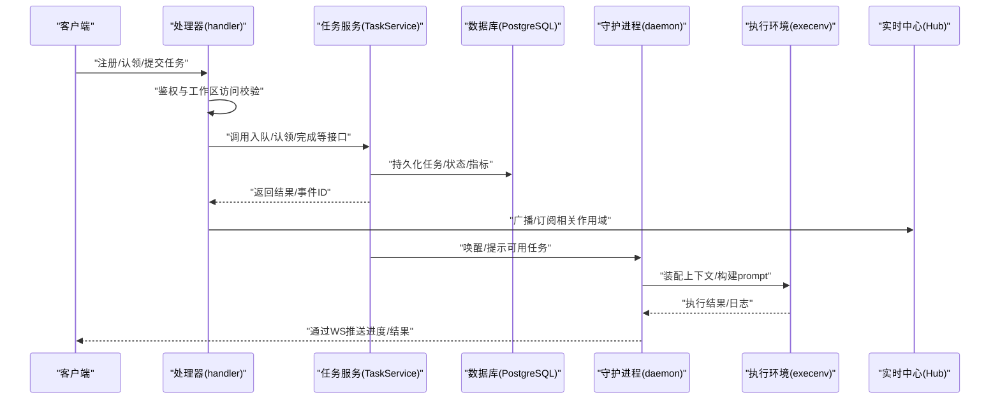
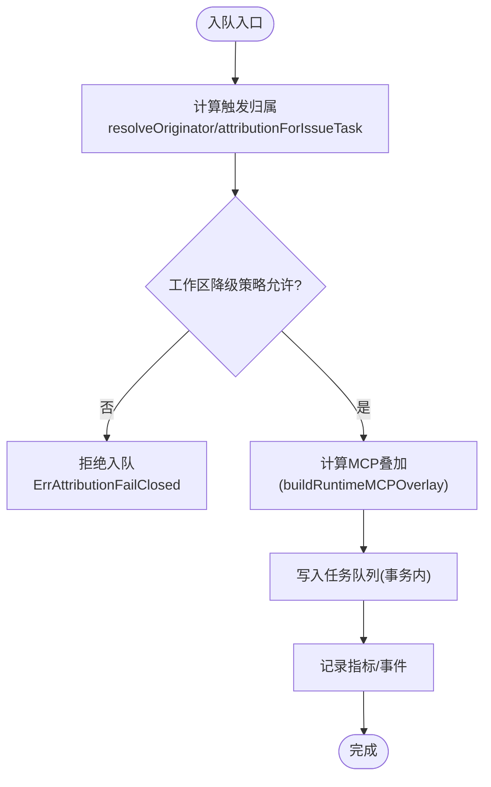
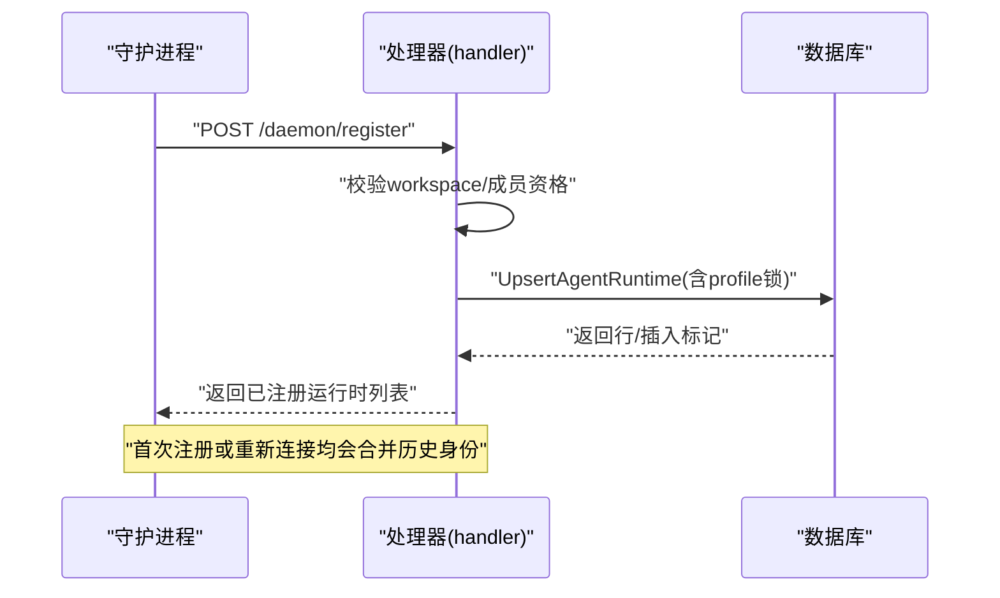
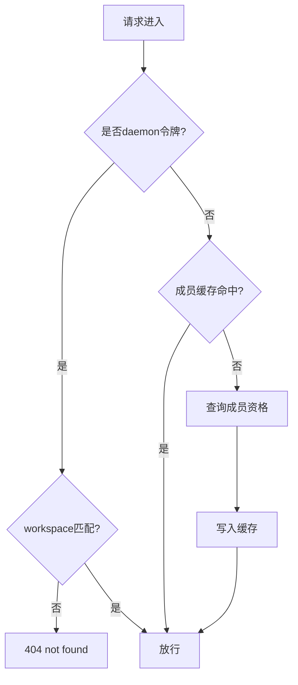
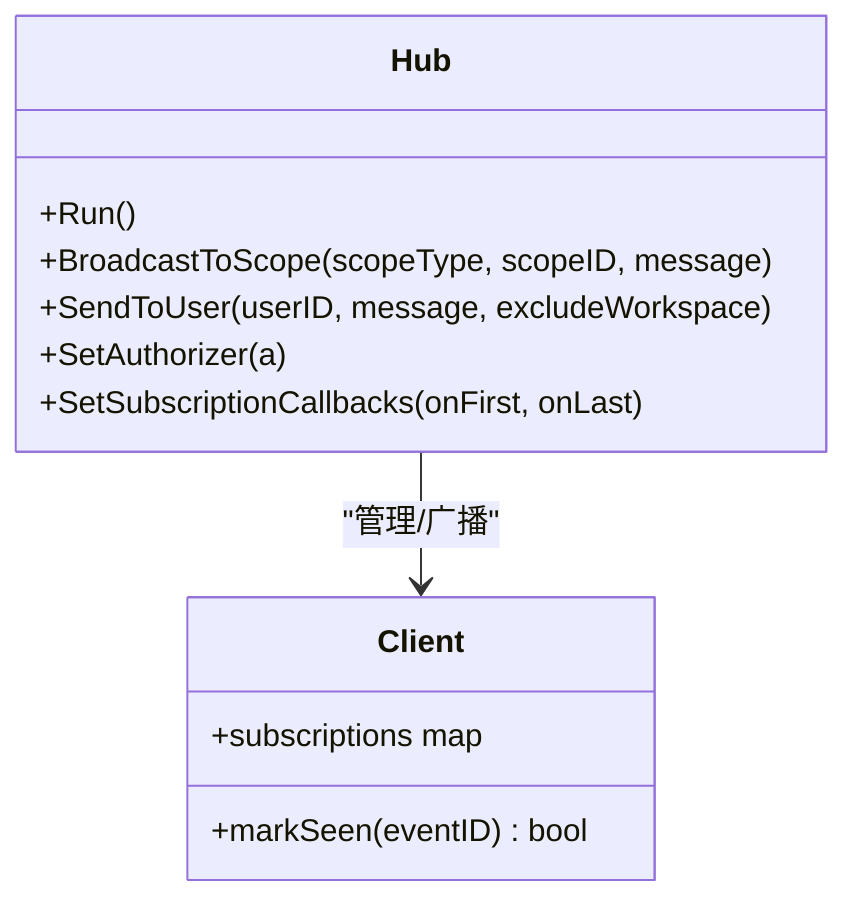
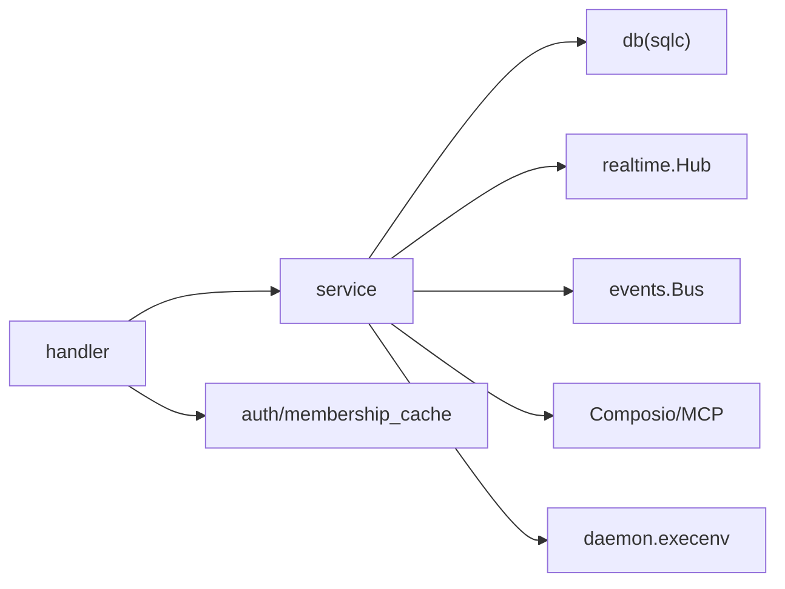

# 业务逻辑层

<cite>
**本文引用的文件**
- [server/internal/service/task.go](file://server/internal/service/task.go)
- [server/internal/handler/daemon.go](file://server/internal/handler/daemon.go)
- [server/internal/realtime/hub.go](file://server/internal/realtime/hub.go)
- [server/internal/auth/membership_cache.go](file://server/internal/auth/membership_cache.go)
- [server/internal/daemon/execenv/execenv.go](file://server/internal/daemon/execenv/execenv.go)
</cite>

## 目录
1. [简介](#简介)
2. [项目结构](#项目结构)
3. [核心组件](#核心组件)
4. [架构总览](#架构总览)
5. [详细组件分析](#详细组件分析)
6. [依赖关系分析](#依赖关系分析)
7. [性能考量](#性能考量)
8. [故障排查指南](#故障排查指南)
9. [结论](#结论)
10. [附录](#附录)

## 简介
本文件聚焦 Multica 后端业务逻辑层，围绕“任务管理、智能体调度、工作空间与权限、实时通信”等核心模块，系统阐述服务层职责划分、事务边界、错误处理策略，以及状态机转换、并发控制与数据一致性保证。文档同时覆盖智能体任务的执行流程、工作流自动化（自动编排）、插件调用机制及与外部系统集成模式，并提供典型场景的参考路径与性能优化建议。

## 项目结构
Multica 后端采用 Go + Chi 路由，服务层位于 server/internal/service，处理器位于 server/internal/handler，实时通信在 server/internal/realtime，认证与成员资格在 server/internal/auth，智能体执行环境在 server/internal/daemon/execenv。数据库通过 sqlc 生成查询对象，使用 PostgreSQL 17。

图表来源
- [server/internal/handler/daemon.go:392-732](file://server/internal/handler/daemon.go#L392-L732)
- [server/internal/service/task.go:39-91](file://server/internal/service/task.go#L39-L91)
- [server/internal/realtime/hub.go:276-318](file://server/internal/realtime/hub.go#L276-L318)
- [server/internal/daemon/execenv/execenv.go:1-200](file://server/internal/daemon/execenv/execenv.go#L1-L200)

章节来源
- [server/internal/handler/daemon.go:392-732](file://server/internal/handler/daemon.go#L392-L732)
- [server/internal/service/task.go:39-91](file://server/internal/service/task.go#L39-L91)
- [server/internal/realtime/hub.go:276-318](file://server/internal/realtime/hub.go#L276-L318)

## 核心组件
- 任务服务 TaskService：负责任务入队、认领、完成、失败、去重、归属判定、MCP 叠加、指标与事件发布。
- 处理器 Handler：封装 HTTP/WS 协议、鉴权、工作区访问校验、与服务的交互。
- 实时中心 Hub：WebSocket 连接管理、作用域订阅、消息广播与去重。
- 认证与成员资格：JWT/PAT 解析、工作区成员缓存、临时禁用用户检查。
- 守护进程执行环境 execenv：装配智能体运行上下文、技能水合、prompt 构建、工作树隔离与复用。

章节来源
- [server/internal/service/task.go:39-91](file://server/internal/service/task.go#L39-L91)
- [server/internal/handler/daemon.go:51-153](file://server/internal/handler/daemon.go#L51-L153)
- [server/internal/realtime/hub.go:221-318](file://server/internal/realtime/hub.go#L221-L318)
- [server/internal/auth/membership_cache.go:1-200](file://server/internal/auth/membership_cache.go#L1-L200)
- [server/internal/daemon/execenv/execenv.go:1-200](file://server/internal/daemon/execenv/execenv.go#L1-L200)

## 架构总览
下图展示从请求到执行的端到端链路：处理器进行鉴权与工作区校验，调用服务层完成业务；任务服务将任务写入队列并通知守护进程；守护进程在本地执行智能体，并通过 WebSocket 推送实时事件。

图表来源
- [server/internal/handler/daemon.go:392-732](file://server/internal/handler/daemon.go#L392-L732)
- [server/internal/service/task.go:326-332](file://server/internal/service/task.go#L326-L332)
- [server/internal/realtime/hub.go:773-800](file://server/internal/realtime/hub.go#L773-L800)
- [server/internal/daemon/execenv/execenv.go:1-200](file://server/internal/daemon/execenv/execenv.go#L1-L200)

## 详细组件分析

### 任务管理（TaskService）
- 职责边界
  - 入队：计算触发归属（评论/指派/自动编排），应用工作区降级策略，生成 MCP 叠加（可选），写入队列并记录指标。
  - 认领：基于运行时心跳新鲜度与抢占保护，避免重复认领与悬挂任务。
  - 完成/失败：合成回退评论（限制长度），清理源上下文，广播事件。
- 事务边界
  - 所有写操作通过 TxStarter 开启事务，确保“任务状态变更 + 指标/事件 + 资源清理”原子性。
- 错误处理
  - 明确区分“可恢复/不可恢复”错误：如重复待执行任务（唯一索引冲突）视为良性竞争；归属判定失败时 fail-closed 拒绝入队。
- 并发控制
  - 利用数据库唯一约束与重试窗口（claimResponseRecoveryWindow、prepareLeaseDuration）防止重复执行；使用 ReclaimCheck 缓存减少空闲轮询开销。
- 数据一致性
  - 归属判定与授权一致：同一入口（ResolveAutopilotTriggerPrincipal）保证“谁触发即谁授权”，避免越权。

图表来源
- [server/internal/service/task.go:492-584](file://server/internal/service/task.go#L492-L584)
- [server/internal/service/task.go:366-406](file://server/internal/service/task.go#L366-L406)
- [server/internal/service/task.go:740-779](file://server/internal/service/task.go#L740-L779)

章节来源
- [server/internal/service/task.go:39-91](file://server/internal/service/task.go#L39-L91)
- [server/internal/service/task.go:492-584](file://server/internal/service/task.go#L492-L584)
- [server/internal/service/task.go:740-779](file://server/internal/service/task.go#L740-L779)

### 智能体调度（Handler + Daemon）
- 职责划分
  - 处理器：负责注册/心跳/工作区访问校验、任务生命周期 API 的鉴权与参数校验，调用服务层。
  - 守护进程：负责任务认领、执行、结果上报、资源回收。
- 事务边界
  - 自定义运行时注册与配置更新使用事务锁（LockRuntimeProfileForRegistration），避免竞态。
- 错误处理
  - 对“运行时不存在/任务不存在”统一映射为 404，便于守护进程自愈；注册失败记录指标并返回 500。
- 并发控制
  - 合并历史 daemon_id 时按工作区与提供程序范围锁定，避免跨租户污染。

图表来源
- [server/internal/handler/daemon.go:392-732](file://server/internal/handler/daemon.go#L392-L732)
- [server/internal/handler/daemon.go:329-363](file://server/internal/handler/daemon.go#L329-L363)

章节来源
- [server/internal/handler/daemon.go:51-153](file://server/internal/handler/daemon.go#L51-L153)
- [server/internal/handler/daemon.go:329-363](file://server/internal/handler/daemon.go#L329-L363)
- [server/internal/handler/daemon.go:392-732](file://server/internal/handler/daemon.go#L392-L732)

### 工作空间管理与权限
- 工作区访问校验
  - 处理器层通过 requireDaemonWorkspaceAccess/verifyDaemonWorkspaceAccess 校验令牌或成员资格，命中缓存则直接放行。
- 成员资格缓存
  - 使用 MembershipCache 降低热点查询压力，提升认领/注册路径性能。
- 安全边界
  - 所有涉及跨租户的数据读取都带 workspaceID 限定，避免泄漏。

图表来源
- [server/internal/handler/daemon.go:51-82](file://server/internal/handler/daemon.go#L51-L82)
- [server/internal/auth/membership_cache.go:1-200](file://server/internal/auth/membership_cache.go#L1-L200)

章节来源
- [server/internal/handler/daemon.go:51-82](file://server/internal/handler/daemon.go#L51-L82)
- [server/internal/auth/membership_cache.go:1-200](file://server/internal/auth/membership_cache.go#L1-L200)

### 实时通信（WebSocket Hub）
- 连接与会话
  - 支持 cookie/JWT/PAT 认证，首帧鉴权；自动订阅工作区与用户作用域。
- 作用域广播
  - 按 scopeType/scopeID 组织房间，支持去重投递（eventID）与慢客户端驱逐。
- 扩展点
  - 订阅回调用于 Redis 中继按需启动/停止消费者循环，实现多实例扩缩容。

图表来源
- [server/internal/realtime/hub.go:276-318](file://server/internal/realtime/hub.go#L276-L318)
- [server/internal/realtime/hub.go:489-527](file://server/internal/realtime/hub.go#L489-L527)
- [server/internal/realtime/hub.go:773-800](file://server/internal/realtime/hub.go#L773-L800)

章节来源
- [server/internal/realtime/hub.go:221-318](file://server/internal/realtime/hub.go#L221-L318)
- [server/internal/realtime/hub.go:489-527](file://server/internal/realtime/hub.go#L489-L527)
- [server/internal/realtime/hub.go:773-800](file://server/internal/realtime/hub.go#L773-L800)

### 插件调用机制与外部集成
- 插件能力
  - 插件包、动作、技能、调度、存储、MCP 传输、事件桥接等能力由 service 层暴露，供上层处理器与守护进程调用。
- Composio 集成
  - 任务入队前计算 per-task MCP 叠加（BuildTaskOverlay），失败不阻塞入队（best-effort）。
- 事件总线
  - 通过 events.Bus 发布领域事件，供审计、指标、下游系统消费。

章节来源
- [server/internal/service/plugin.go:1-200](file://server/internal/service/plugin.go#L1-L200)
- [server/internal/service/task.go:366-406](file://server/internal/service/task.go#L366-L406)

### 工作流自动化（Autopilot）
- 触发器与规则版本
  - 自动编排通过 schedule/webhook 触发，归属判定统一到 ResolveAutopilotTriggerPrincipal，确保“创建者即授权者”。
- 执行模式
  - run_only 与 create_issue 两种模式共享归属逻辑，保证行为一致。

章节来源
- [server/internal/service/task.go:586-637](file://server/internal/service/task.go#L586-L637)
- [server/internal/service/task.go:639-688](file://server/internal/service/task.go#L639-L688)

## 依赖关系分析
- 处理器依赖服务层完成业务，服务层依赖数据库、实时中心、事件总线与可选的外部集成。
- 守护进程通过 HTTP/WS 与服务交互，执行环境负责本地资源隔离与 prompt 组装。
- 认证与成员资格贯穿各层，确保跨租户安全。

图表来源
- [server/internal/handler/daemon.go:392-732](file://server/internal/handler/daemon.go#L392-L732)
- [server/internal/service/task.go:39-91](file://server/internal/service/task.go#L39-L91)
- [server/internal/realtime/hub.go:276-318](file://server/internal/realtime/hub.go#L276-L318)

章节来源
- [server/internal/handler/daemon.go:392-732](file://server/internal/handler/daemon.go#L392-L732)
- [server/internal/service/task.go:39-91](file://server/internal/service/task.go#L39-L91)
- [server/internal/realtime/hub.go:276-318](file://server/internal/realtime/hub.go#L276-L318)

## 性能考量
- 数据库
  - 使用唯一约束与并发索引（CONCURRENTLY）避免锁争用；任务认领路径结合心跳新鲜度阈值减少无效扫描。
- 缓存
  - 成员资格缓存、空任务缓存（EmptyClaimCache）、ReclaimCheck 缓存降低热点读与无意义轮询。
- 实时
  - Hub 对慢客户端进行驱逐，避免阻塞广播；事件 ID 去重避免重复投递。
- 执行环境
  - 代码仓库通过共享裸缓存 checkout 为 git worktree，同 (agent, issue) 多轮复用 workdir，不同任务并行隔离。

章节来源
- [server/internal/service/task.go:180-196](file://server/internal/service/task.go#L180-L196)
- [server/internal/realtime/hub.go:489-527](file://server/internal/realtime/hub.go#L489-L527)
- [server/internal/auth/membership_cache.go:1-200](file://server/internal/auth/membership_cache.go#L1-L200)
- [server/internal/daemon/execenv/execenv.go:1-200](file://server/internal/daemon/execenv/execenv.go#L1-L200)

## 故障排查指南
- 常见错误
  - 重复待执行任务：唯一索引冲突，属正常竞争，应返回结构化 409 而非 500。
  - 归属判定失败：fail-closed 策略下拒绝入队，需检查工作区策略与代理所有者。
  - 运行时/任务不存在：统一 404，守护进程据此自愈。
- 定位步骤
  - 查看任务归属判定链（comment/issue/autopilot origin）与降级策略。
  - 检查 MCP 叠加是否成功（失败不影响入队但影响能力）。
  - 核对 Hub 订阅与作用域是否正确，确认 eventID 去重未误删。

章节来源
- [server/internal/service/task.go:690-724](file://server/internal/service/task.go#L690-L724)
- [server/internal/service/task.go:740-779](file://server/internal/service/task.go#L740-L779)
- [server/internal/handler/daemon.go:90-109](file://server/internal/handler/daemon.go#L90-L109)
- [server/internal/realtime/hub.go:489-527](file://server/internal/realtime/hub.go#L489-L527)

## 结论
Multica 的业务逻辑层以 TaskService 为核心，配合处理器、守护进程与实时中心，形成“入队—认领—执行—反馈”的闭环。通过严格的归属判定、fail-closed 策略、事务边界与缓存优化，系统在多租户、高并发与可扩展性方面具备良好保障。插件与外部集成以可选方式注入，保持部署灵活性。

## 附录
- 典型业务场景参考路径
  - 任务入队与归属判定：[server/internal/service/task.go:492-584](file://server/internal/service/task.go#L492-L584)
  - 守护进程注册与运行时管理：[server/internal/handler/daemon.go:392-732](file://server/internal/handler/daemon.go#L392-L732)
  - WebSocket 鉴权与广播：[server/internal/realtime/hub.go:773-800](file://server/internal/realtime/hub.go#L773-L800)
  - 执行环境装配与 prompt 构建：[server/internal/daemon/execenv/execenv.go:1-200](file://server/internal/daemon/execenv/execenv.go#L1-L200)
- 性能优化建议
  - 合理设置 claimResponseRecoveryWindow 与 prepareLeaseDuration，平衡吞吐与安全性。
  - 启用 EmptyClaimCache 与 ReclaimCheck 以减少空闲轮询。
  - 对 Hub 慢客户端及时驱逐，避免广播阻塞。
  - 使用 git worktree 与 PriorWorkDir 复用策略，提升多轮执行效率。