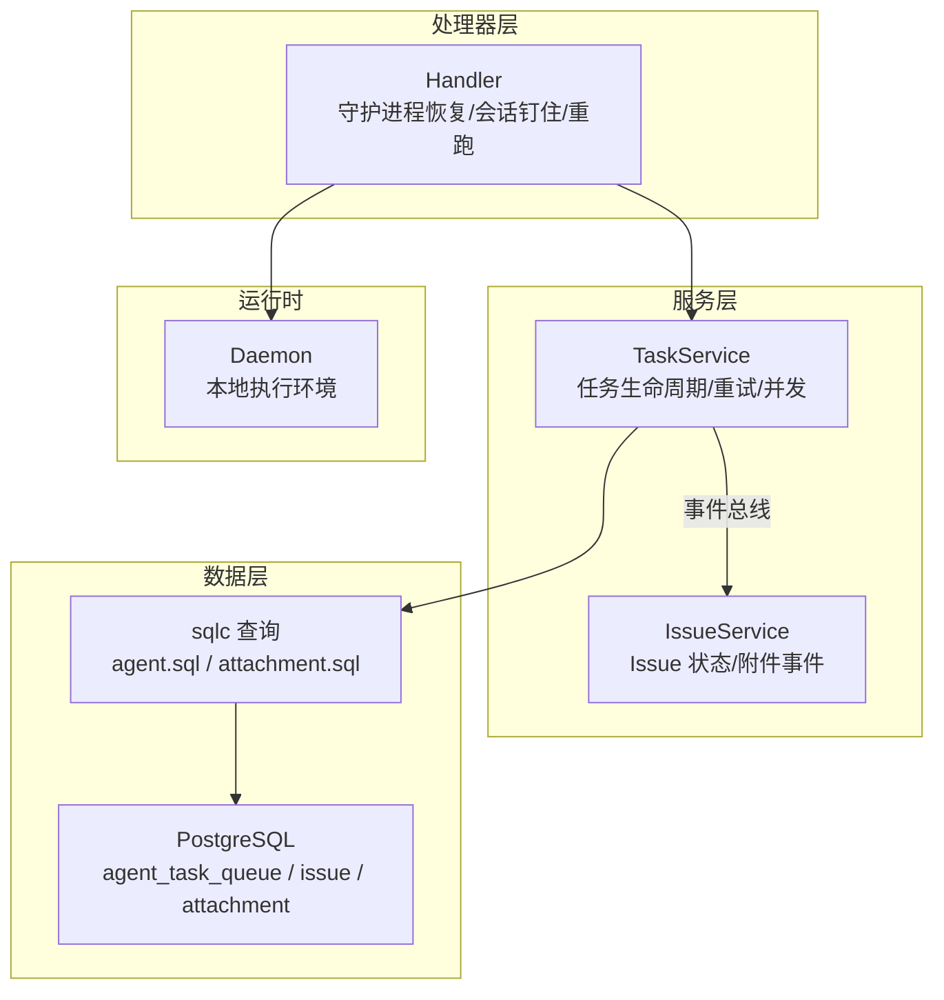
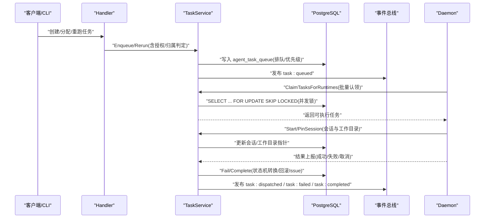
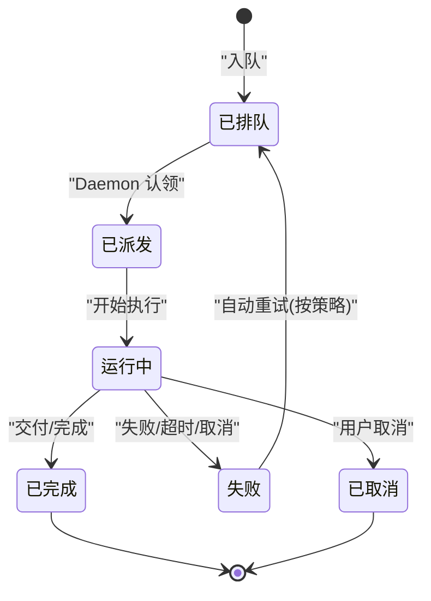
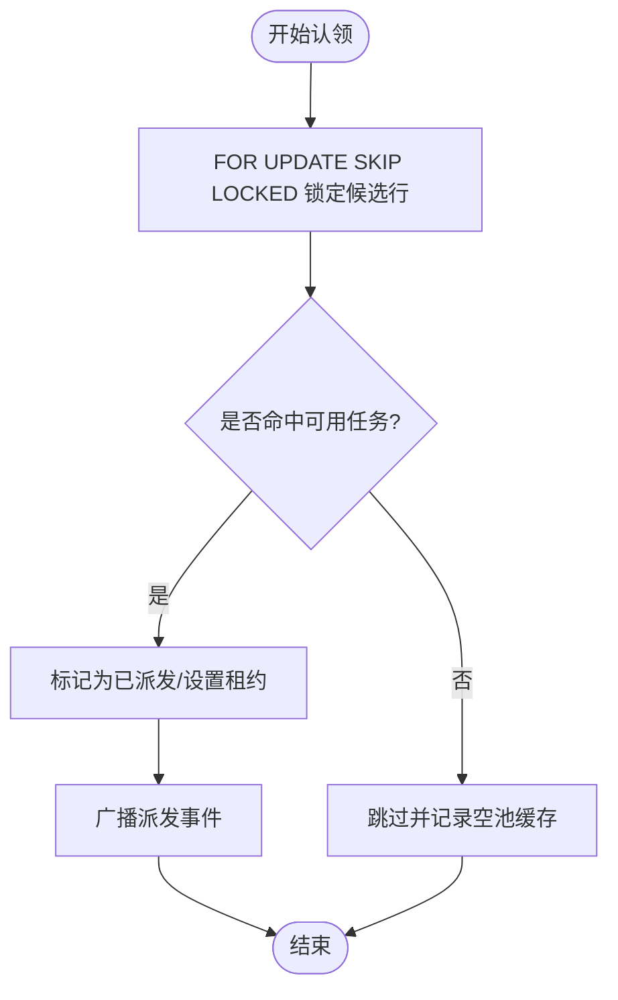
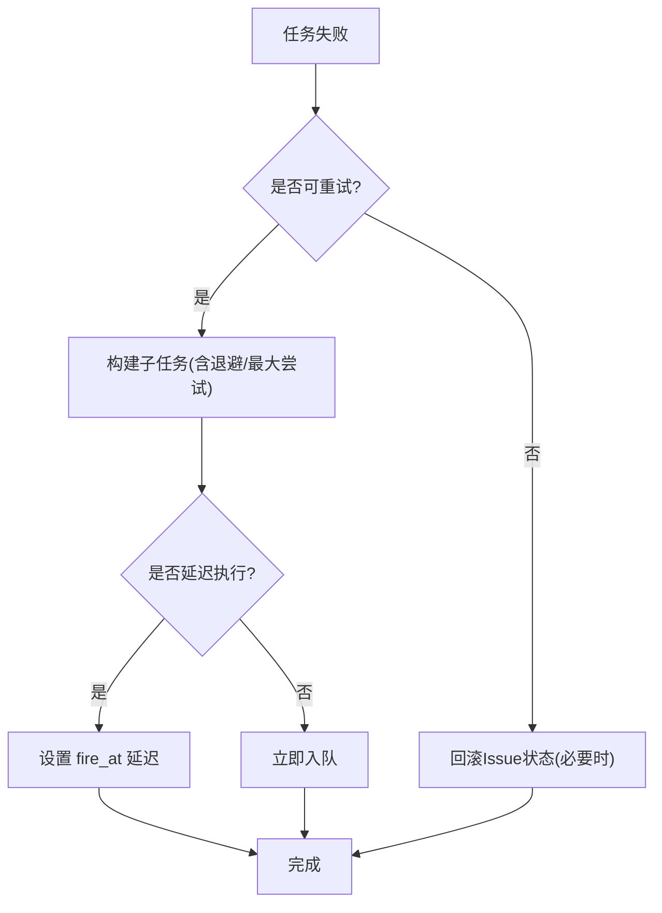
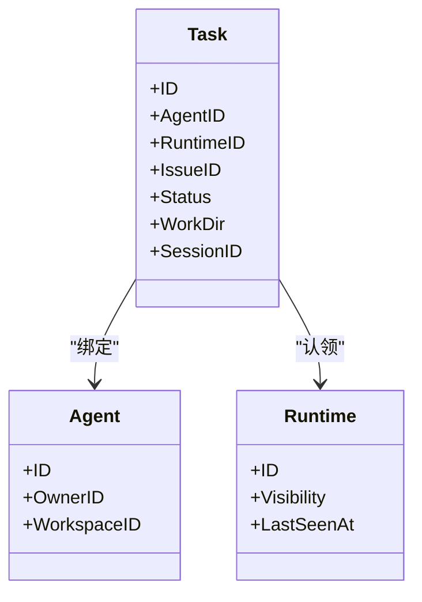
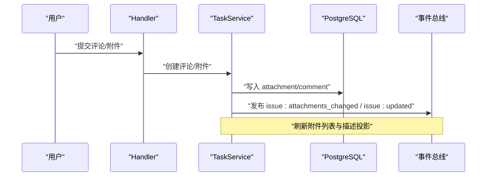
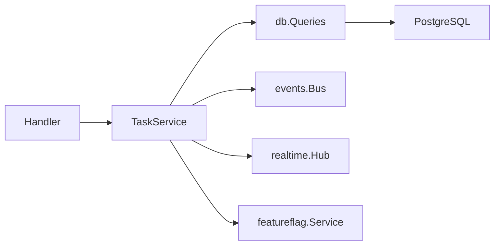

# 任务管理

<cite>
**本文引用的文件**
- [server/internal/service/task.go](file://server/internal/service/task.go)
- [server/internal/handler/task_lifecycle.go](file://server/internal/handler/task_lifecycle.go)
- [server/internal/service/issue.go](file://server/internal/service/issue.go)
- [server/pkg/db/queries/attachment.sql](file://server/pkg/db/queries/attachment.sql)
- [server/migrations/390_agent_task_queue_dispatched_reclaim_v2_index.up.sql](file://server/migrations/390_agent_task_queue_dispatched_reclaim_v2_index.up.sql)
- [server/migrations/391_drop_agent_task_queue_dispatched_prepare_index.down.sql](file://server/migrations/391_drop_agent_task_queue_dispatched_prepare_index.down.sql)
- [server/pkg/db/queries/agent.sql](file://server/pkg/db/queries/agent.sql)
- [apps/docs/content/docs/assigning-issues.zh.mdx](file://apps/docs/content/docs/assigning-issues.zh.mdx)
- [apps/docs/content/docs/squads.zh.mdx](file://apps/docs/content/docs/squads.zh.mdx)
- [server/internal/service/builtin_skills/multica-platform/references/issues.md](file://server/internal/service/builtin_skills/multica-platform/references/issues.md)
- [server/internal/service/builtin_skills/multica-platform/references/runtimes.md](file://server/internal/service/builtin_skills/multica-platform/references/runtimes.md)
</cite>

## 目录
1. [简介](#简介)
2. [项目结构](#项目结构)
3. [核心组件](#核心组件)
4. [架构总览](#架构总览)
5. [详细组件分析](#详细组件分析)
6. [依赖关系分析](#依赖关系分析)
7. [性能考量](#性能考量)
8. [故障排查指南](#故障排查指南)
9. [结论](#结论)
10. [附录](#附录)

## 简介
本文件面向 Multica 任务管理系统，聚焦“任务”的生命周期与运行机制：从创建、分配、执行到完成的全链路；任务状态机与 Issue 状态的映射；并发控制、重试策略与失败处理；智能体绑定与工作目录管理；代码仓库 checkout 机制；队列管理与优先级调度；以及评论、附件与通知等集成点。文档同时提供 API 使用指引与监控调试方法，帮助开发者与运维人员高效排障与优化。

## 项目结构
Multica 后端以 Go 实现，采用 Chi 路由 + sqlc + gorilla/websocket；数据库为 PostgreSQL。任务相关能力主要分布在以下位置：
- 服务层：server/internal/service/task.go（任务生命周期、重试、并发控制、事件广播）
- 处理器层：server/internal/handler/task_lifecycle.go（守护进程恢复、会话钉住、手动重跑）
- 数据访问：server/pkg/db/queries/*.sql（任务/代理/附件等 SQL 查询）
- 迁移：server/migrations/*（索引与表结构变更）
- 文档参考：apps/docs/content/docs/*（Issue 状态与小队派活规则）

图表来源
- [server/internal/service/task.go:39-91](file://server/internal/service/task.go#L39-L91)
- [server/internal/handler/task_lifecycle.go:17-59](file://server/internal/handler/task_lifecycle.go#L17-L59)
- [server/pkg/db/queries/agent.sql:918-939](file://server/pkg/db/queries/agent.sql#L918-L939)
- [server/pkg/db/queries/attachment.sql:1-40](file://server/pkg/db/queries/attachment.sql#L1-L40)

章节来源
- [server/internal/service/task.go:39-91](file://server/internal/service/task.go#L39-L91)
- [server/internal/handler/task_lifecycle.go:17-59](file://server/internal/handler/task_lifecycle.go#L17-L59)

## 核心组件
- 任务服务 TaskService：负责任务入队、认领、派发、失败处理、自动重试、工作目录与会话持久化、事件广播等。
- 处理器 Handler：暴露守护进程恢复、会话钉住、手动重跑等接口，桥接外部调用与服务层。
- 数据访问层：通过 sqlc 生成的查询封装对 agent_task_queue、issue、attachment 等表的读写。
- 事件总线：用于任务派发、附件变更、Issue 更新等实时广播。
- 运行时 Daemon：在本地执行智能体任务，维护工作目录、会话、Brief 注入与技能水合。

章节来源
- [server/internal/service/task.go:39-91](file://server/internal/service/task.go#L39-L91)
- [server/internal/handler/task_lifecycle.go:17-59](file://server/internal/handler/task_lifecycle.go#L17-L59)
- [server/pkg/db/queries/agent.sql:918-939](file://server/pkg/db/queries/agent.sql#L918-L939)

## 架构总览
下图展示了任务从创建到执行的端到端流程，包括状态机转换、并发控制、重试与失败回滚、以及与 Issue/评论/附件的联动。

图表来源
- [server/internal/handler/task_lifecycle.go:17-59](file://server/internal/handler/task_lifecycle.go#L17-L59)
- [server/internal/service/task.go:354-406](file://server/internal/service/task.go#L354-L406)
- [server/pkg/db/queries/agent.sql:918-939](file://server/pkg/db/queries/agent.sql#L918-L939)

## 详细组件分析

### 任务生命周期与状态机
- 任务状态：queued → dispatched → running → completed/failed/cancelled。
- Issue 状态：backlog/in_progress/in_review/done/cancelled。Agent 在执行过程中主动更新 Issue 状态，而非由运行生命周期自动驱动。
- 关键规则：
  - backlog 中分配不触发执行；移出 backlog 或继续评论才会产生后续执行。
  - in_progress/in_review 由 Agent 在工作变化时写入；仅答疑不改变状态。
  - 子任务 done 会在父 Issue 上写系统评论；PR 带关闭意图可在合并时推进 to done。
  - 失败且无活跃任务/重试时，可能将 Issue 从 in_progress 回滚到 todo。

图表来源
- [apps/docs/content/docs/assigning-issues.zh.mdx:30-47](file://apps/docs/content/docs/assigning-issues.zh.mdx#L30-L47)
- [server/internal/service/builtin_skills/multica-platform/references/issues.md:206-244](file://server/internal/service/builtin_skills/multica-platform/references/issues.md#L206-L244)
- [server/internal/service/task.go:5881-5908](file://server/internal/service/task.go#L5881-L5908)

章节来源
- [apps/docs/content/docs/assigning-issues.zh.mdx:30-47](file://apps/docs/content/docs/assigning-issues.zh.mdx#L30-L47)
- [server/internal/service/builtin_skills/multica-platform/references/issues.md:206-244](file://server/internal/service/builtin_skills/multica-platform/references/issues.md#L206-L244)
- [server/internal/service/task.go:5881-5908](file://server/internal/service/task.go#L5881-L5908)

### 并发控制与队列调度
- 并发安全：
  - 使用 SELECT ... FOR UPDATE SKIP LOCKED 进行任务抢占，避免重复认领。
  - 通过 Redis/内存缓存减少空轮询开销（EmptyClaimCache）。
  - ReclaimCheck 跟踪已派发但未启动的任务，支持过期回收。
- 优先级与调度：
  - 队列按 priority DESC, dispatched_at ASC 排序，确保高优先先取。
  - 支持 DEFERRED 任务延迟触发（fire_at），最终尝试与退避策略结合。
- 索引优化：
  - 针对 reclaimed/prepare 路径建立专用索引，提升扫描效率。

图表来源
- [server/pkg/db/queries/agent.sql:918-939](file://server/pkg/db/queries/agent.sql#L918-L939)
- [server/migrations/390_agent_task_queue_dispatched_reclaim_v2_index.up.sql:1-5](file://server/migrations/390_agent_task_queue_dispatched_reclaim_v2_index.up.sql#L1-L5)
- [server/migrations/391_drop_agent_task_queue_dispatched_prepare_index.down.sql:1-3](file://server/migrations/391_drop_agent_task_queue_dispatched_prepare_index.down.sql#L1-L3)

章节来源
- [server/pkg/db/queries/agent.sql:918-939](file://server/pkg/db/queries/agent.sql#L918-L939)
- [server/migrations/390_agent_task_queue_dispatched_reclaim_v2_index.up.sql:1-5](file://server/migrations/390_agent_task_queue_dispatched_reclaim_v2_index.up.sql#L1-L5)
- [server/migrations/391_drop_agent_task_queue_dispatched_prepare_index.down.sql:1-3](file://server/migrations/391_drop_agent_task_queue_dispatched_prepare_index.down.sql#L1-L3)

### 重试策略与失败处理
- 自动重试：
  - 根据失败原因（如 provider_network、timeout、context_overflow）决定是否重试及退避时间。
  - 原子创建子任务，保证失败与重试在同一事务内，避免竞态。
  - 最终尝试延迟执行（fire_at），并在子任务中记录 reason-aware 的最大尝试次数。
- 失败回滚：
  - 当失败且无活跃任务/重试时，可能将 Issue 从 in_progress 回滚到 todo。
  - 守护进程重启后，通过 RecoverOrphanedTasks 清理孤儿任务并进入统一失败处理管线。
- 手动重试：
  - RerunIssue 支持指定历史任务 ID 重跑，强制新会话以避免污染状态。

图表来源
- [server/internal/service/task.go:4754-5403](file://server/internal/service/task.go#L4754-L5403)
- [server/internal/service/task.go:5881-5908](file://server/internal/service/task.go#L5881-L5908)
- [server/internal/handler/task_lifecycle.go:17-59](file://server/internal/handler/task_lifecycle.go#L17-L59)

章节来源
- [server/internal/service/task.go:4754-5403](file://server/internal/service/task.go#L4754-L5403)
- [server/internal/service/task.go:5881-5908](file://server/internal/service/task.go#L5881-L5908)
- [server/internal/handler/task_lifecycle.go:17-59](file://server/internal/handler/task_lifecycle.go#L17-L59)

### 智能体绑定与工作目录管理
- 智能体绑定：
  - 每个任务绑定一个 Agent，Daemon 通过 runtime_id 认领任务。
  - 支持小队派活：分配给小队会向队长智能体入队一次运行，队长再 @ 成员派活。
- 工作目录：
  - WorkspacesRoot 下每个任务一个 env root，代码从共享裸缓存 .repos 通过 git worktree checkout。
  - PriorWorkDir 复用同一 workdir（同 agent+issue 多轮），不同任务并行隔离。
  - PinTaskSession 持久化 session_id 与 work_dir，崩溃后可恢复对话指针。
- 仓库 Checkout：
  - 运行时 brief 列出可用仓库；以 brief 为准进行 checkout，除非用户显式绑定新项目资源。

图表来源
- [server/internal/service/task.go:39-91](file://server/internal/service/task.go#L39-L91)
- [server/internal/handler/task_lifecycle.go:61-141](file://server/internal/handler/task_lifecycle.go#L61-L141)
- [server/pkg/db/queries/agent.sql:918-939](file://server/pkg/db/queries/agent.sql#L918-L939)
- [server/internal/service/builtin_skills/multica-platform/references/runtimes.md:121-139](file://server/internal/service/builtin_skills/multica-platform/references/runtimes.md#L121-L139)

章节来源
- [apps/docs/content/docs/squads.zh.mdx:31-40](file://apps/docs/content/docs/squads.zh.mdx#L31-L40)
- [server/internal/handler/task_lifecycle.go:61-141](file://server/internal/handler/task_lifecycle.go#L61-L141)
- [server/internal/service/builtin_skills/multica-platform/references/runtimes.md:121-139](file://server/internal/service/builtin_skills/multica-platform/references/runtimes.md#L121-L139)

### 任务与 Issue 的关系映射、评论与附件
- 关系映射：
  - 任务通常关联 Issue；Agent 在执行中主动更新 Issue 状态。
  - 子任务完成时在父 Issue 写系统评论；PR 关闭意图可直接推进 to done。
- 评论系统：
  - 评论可触发任务入队；归属判定遵循评论链规则，保留人类责任主体。
- 附件处理：
  - 附件插入后更新 issue/comment revision，并发布附件变更事件，刷新前端投影。

图表来源
- [server/internal/service/issue.go:590-625](file://server/internal/service/issue.go#L590-L625)
- [server/pkg/db/queries/attachment.sql:1-40](file://server/pkg/db/queries/attachment.sql#L1-L40)

章节来源
- [server/internal/service/issue.go:590-625](file://server/internal/service/issue.go#L590-L625)
- [server/pkg/db/queries/attachment.sql:1-40](file://server/pkg/db/queries/attachment.sql#L1-L40)

### API 示例（创建、查询、更新、删除、重跑）
- 创建/分配任务：
  - 通过 Issue 分配或评论触发入队；服务端完成归属判定与 MCP overlay 计算。
  - 参考：[server/internal/service/task.go:354-406](file://server/internal/service/task.go#L354-L406)
- 查询任务：
  - 通过任务 ID 或 Issue 维度查询；支持过滤状态、优先级、运行时长等。
  - 参考：[server/pkg/db/queries/agent.sql:918-939](file://server/pkg/db/queries/agent.sql#L918-L939)
- 更新任务：
  - 会话钉住（PinTaskSession）：保存 session_id 与 work_dir，支持崩溃恢复。
  - 参考：[server/internal/handler/task_lifecycle.go:61-141](file://server/internal/handler/task_lifecycle.go#L61-L141)
- 删除任务：
  - 通常通过取消任务或清理历史执行记录实现；具体删除逻辑依业务策略而定。
- 重跑任务：
  - 手动重跑（RerunIssue）：支持指定历史任务 ID，强制新会话。
  - 参考：[server/internal/handler/task_lifecycle.go:143-224](file://server/internal/handler/task_lifecycle.go#L143-L224)

章节来源
- [server/internal/service/task.go:354-406](file://server/internal/service/task.go#L354-L406)
- [server/internal/handler/task_lifecycle.go:61-141](file://server/internal/handler/task_lifecycle.go#L61-L141)
- [server/internal/handler/task_lifecycle.go:143-224](file://server/internal/handler/task_lifecycle.go#L143-L224)
- [server/pkg/db/queries/agent.sql:918-939](file://server/pkg/db/queries/agent.sql#L918-L939)

### 监控与调试
- 事件总线：
  - 监听 task:queued、task:dispatched、task:failed、task:completed 等事件，用于前端状态同步与告警。
  - 参考：[server/internal/service/task.go:6973-7003](file://server/internal/service/task.go#L6973-L7003)
- 守护进程恢复：
  - RecoverOrphanedTasks：守护进程启动时清理孤儿任务，进入统一失败处理管线。
  - 参考：[server/internal/handler/task_lifecycle.go:17-59](file://server/internal/handler/task_lifecycle.go#L17-L59)
- 工作目录与会话：
  - PinTaskSession：持久化会话与工作目录，支持崩溃后恢复对话指针。
  - 参考：[server/internal/handler/task_lifecycle.go:61-141](file://server/internal/handler/task_lifecycle.go#L61-L141)

章节来源
- [server/internal/service/task.go:6973-7003](file://server/internal/service/task.go#L6973-L7003)
- [server/internal/handler/task_lifecycle.go:17-59](file://server/internal/handler/task_lifecycle.go#L17-L59)
- [server/internal/handler/task_lifecycle.go:61-141](file://server/internal/handler/task_lifecycle.go#L61-L141)

## 依赖关系分析
- 组件耦合：
  - TaskService 依赖 db.Queries、events.Bus、realtime.Hub、featureflag.Service 等。
  - Handler 依赖 TaskService 与 TxStarter，负责鉴权与请求解析。
- 外部依赖：
  - PostgreSQL：任务队列、Issue、附件等核心数据。
  - Redis/内存缓存：空池缓存与 reclaim 提示，降低 DB 压力。
- 循环依赖：
  - 未发现直接循环依赖；服务层与处理器层职责清晰分离。

图表来源
- [server/internal/service/task.go:39-91](file://server/internal/service/task.go#L39-L91)
- [server/internal/handler/task_lifecycle.go:17-59](file://server/internal/handler/task_lifecycle.go#L17-L59)

章节来源
- [server/internal/service/task.go:39-91](file://server/internal/service/task.go#L39-L91)
- [server/internal/handler/task_lifecycle.go:17-59](file://server/internal/handler/task_lifecycle.go#L17-L59)

## 性能考量
- 队列扫描优化：
  - 使用专用索引（dispatched_reclaim_v2）提升 reclaimed/prepare 路径性能。
- 并发控制：
  - FOR UPDATE SKIP LOCKED 避免锁竞争；EmptyClaimCache 减少空轮询。
- 重试退避：
  - 最终尝试延迟执行，避免雪崩；reason-aware 最大尝试次数防止无限重试。
- 事件广播：
  - 事件异步发布，避免阻塞主流程；前端按需订阅。

章节来源
- [server/migrations/390_agent_task_queue_dispatched_reclaim_v2_index.up.sql:1-5](file://server/migrations/390_agent_task_queue_dispatched_reclaim_v2_index.up.sql#L1-L5)
- [server/pkg/db/queries/agent.sql:918-939](file://server/pkg/db/queries/agent.sql#L918-L939)
- [server/internal/service/task.go:4754-5403](file://server/internal/service/task.go#L4754-L5403)

## 故障排查指南
- 任务卡住：
  - 检查守护进程是否存活；使用 RecoverOrphanedTasks 清理孤儿任务。
  - 参考：[server/internal/handler/task_lifecycle.go:17-59](file://server/internal/handler/task_lifecycle.go#L17-L59)
- 重试失败：
  - 查看失败原因与最大尝试次数；确认是否达到最终尝试退避。
  - 参考：[server/internal/service/task.go:4754-5403](file://server/internal/service/task.go#L4754-L5403)
- 附件未刷新：
  - 检查附件变更事件是否发布；确认前端订阅正确。
  - 参考：[server/internal/service/issue.go:590-625](file://server/internal/service/issue.go#L590-L625)
- 会话丢失：
  - 确认 PinTaskSession 是否成功；检查会话指针是否被覆盖。
  - 参考：[server/internal/handler/task_lifecycle.go:61-141](file://server/internal/handler/task_lifecycle.go#L61-L141)

章节来源
- [server/internal/handler/task_lifecycle.go:17-59](file://server/internal/handler/task_lifecycle.go#L17-L59)
- [server/internal/service/task.go:4754-5403](file://server/internal/service/task.go#L4754-L5403)
- [server/internal/service/issue.go:590-625](file://server/internal/service/issue.go#L590-L625)
- [server/internal/handler/task_lifecycle.go:61-141](file://server/internal/handler/task_lifecycle.go#L61-L141)

## 结论
Multica 任务管理系统通过清晰的状态机、严格的并发控制、灵活的重试策略与完善的集成点（Issue、评论、附件、通知），实现了从创建到完成的完整任务生命周期管理。开发者可通过事件总线与 API 进行监控与调试，运维人员可利用守护进程恢复与会话钉住提升系统韧性。建议在生产环境中关注队列索引、重试退避与事件广播的性能与健康度。

## 附录
- 术语表：
  - 任务（Task）：智能体执行的最小工作单元。
  - Issue：问题/需求载体，与任务状态联动。
  - 智能体（Agent）：执行任务的 AI 实体。
  - 守护进程（Daemon）：本地执行环境，负责任务执行与工作目录管理。
- 最佳实践：
  - 合理设置重试策略与最大尝试次数。
  - 使用专用索引优化队列扫描。
  - 通过事件总线实现前端实时状态同步。