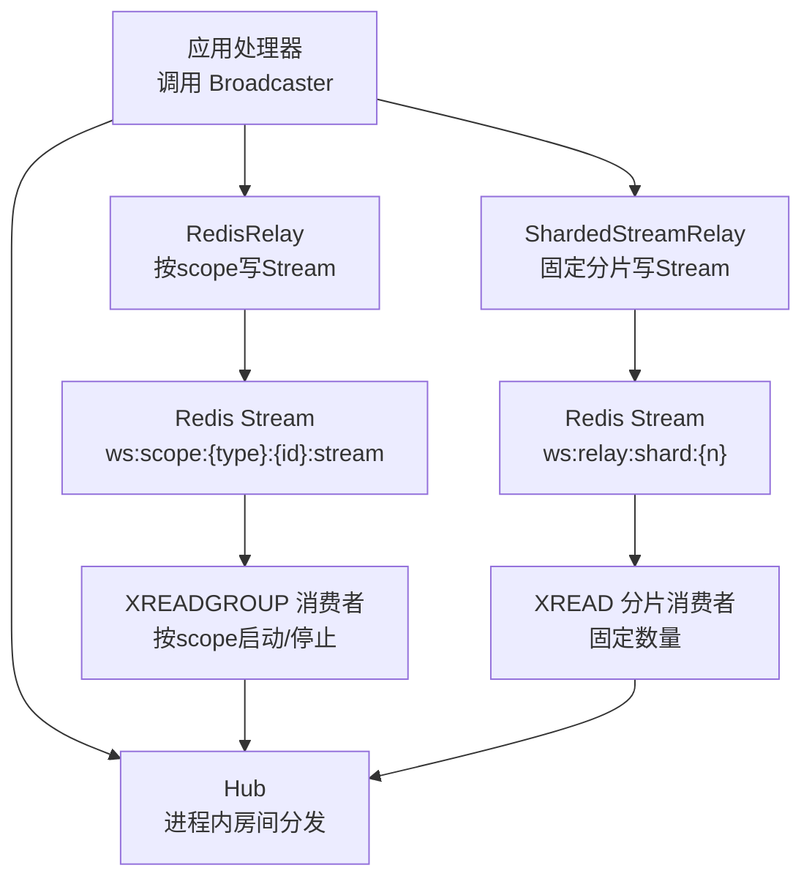
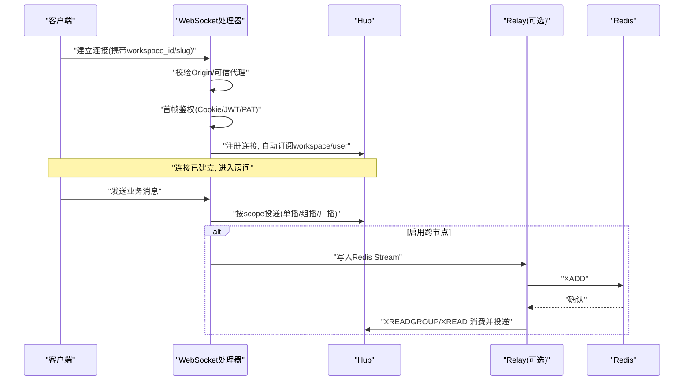
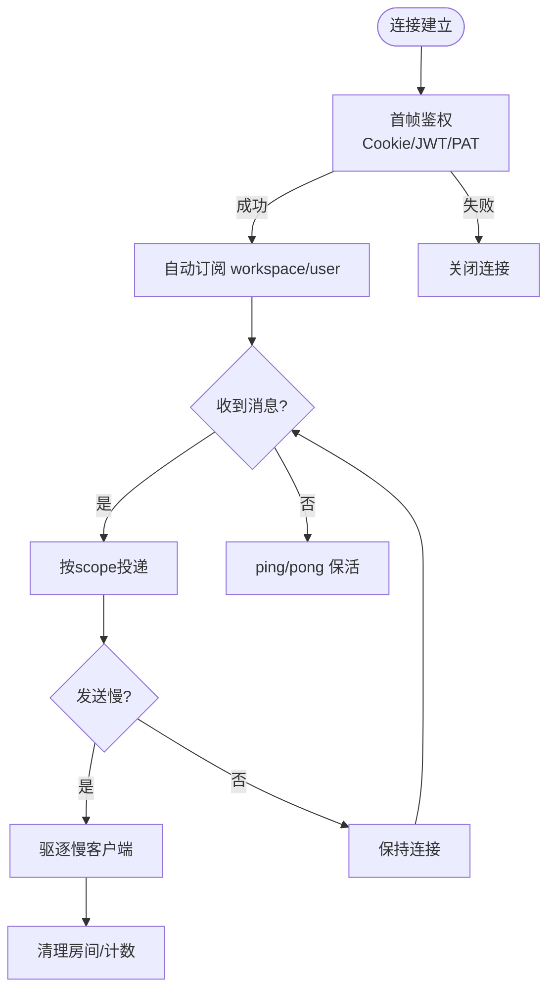
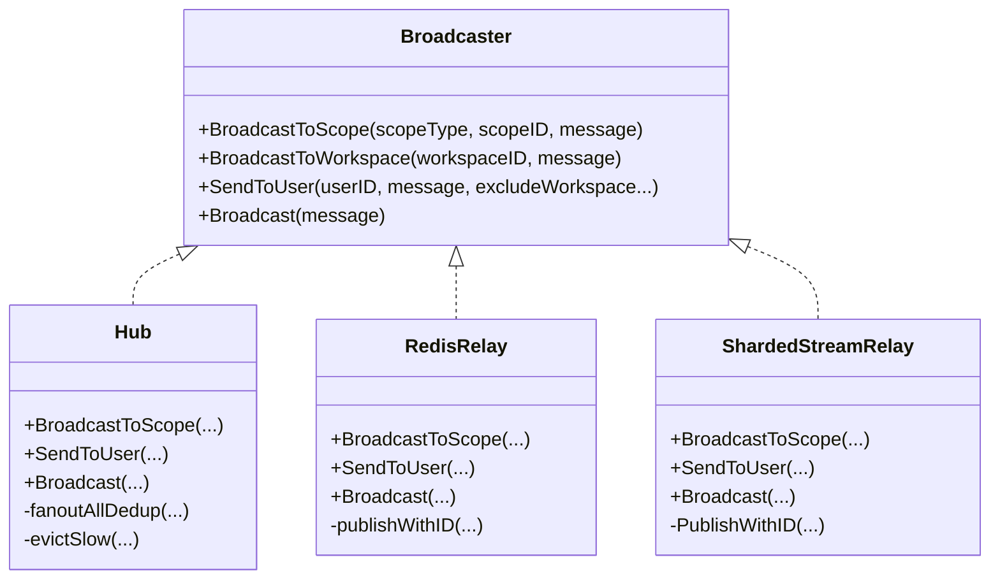
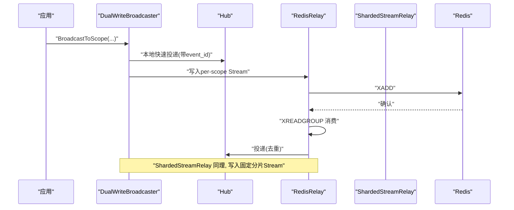
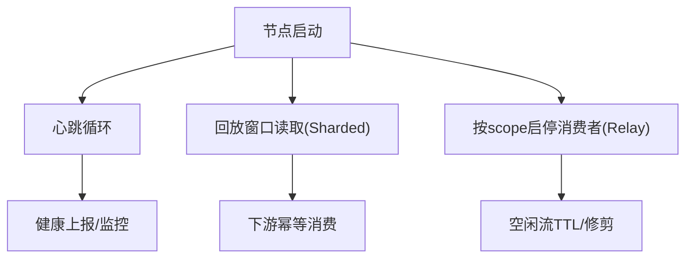
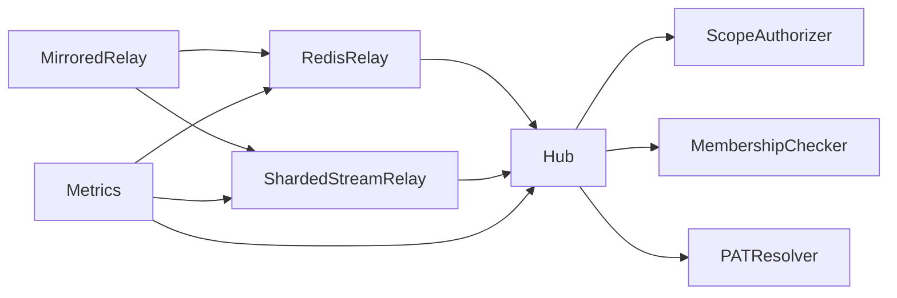

# 实时通信

<cite>
**本文引用的文件**
- [hub.go](file://server/internal/realtime/hub.go)
- [broadcaster.go](file://server/internal/realtime/broadcaster.go)
- [redis_relay.go](file://server/internal/realtime/redis_relay.go)
- [sharded_stream_relay.go](file://server/internal/realtime/sharded_stream_relay.go)
- [relay_lifecycle.go](file://server/internal/realtime/relay_lifecycle.go)
- [stream_retention.go](file://server/internal/realtime/stream_retention.go)
- [metrics.go](file://server/internal/realtime/metrics.go)
</cite>

## 目录
1. [简介](#简介)
2. [项目结构](#项目结构)
3. [核心组件](#核心组件)
4. [架构总览](#架构总览)
5. [详细组件分析](#详细组件分析)
6. [依赖关系分析](#依赖关系分析)
7. [性能考量](#性能考量)
8. [故障排查指南](#故障排查指南)
9. [结论](#结论)
10. [附录](#附录)

## 简介
本文件面向 Multica 实时通信系统，聚焦 WebSocket 连接管理、消息路由与广播机制、Redis Stream 消息队列实现、水平扩展与故障恢复、客户端集成示例、错误处理策略与性能优化建议。内容基于 server/internal/realtime 包中的 Hub、Broadcaster、RedisRelay、ShardedStreamRelay、流保留与指标等模块进行系统化梳理。

## 项目结构
实时子系统位于 server/internal/realtime，采用“Hub + Broadcaster + Relay”的分层设计：
- Hub：进程内 WebSocket 连接管理与房间（按 scope 类型+ID）订阅分发。
- Broadcaster：事件生产者使用的统一接口，屏蔽本地直发与跨节点 Redis 中继的差异。
- RedisRelay：每 scope 一个 Redis Stream 的“按需消费者”模式，适合高并发但热点分散的场景。
- ShardedStreamRelay：固定数量分片 Stream 的“全局读取”模式，便于控制阻塞连接数与回放窗口。
- stream_retention：统一的流保留配置与 TTL 刷新/修复逻辑。
- metrics：轻量级原子计数器与快照导出。

**图示来源**
- [broadcaster.go:32-58](file://server/internal/realtime/broadcaster.go#L32-L58)
- [redis_relay.go:131-155](file://server/internal/realtime/redis_relay.go#L131-L155)
- [sharded_stream_relay.go:152-174](file://server/internal/realtime/sharded_stream_relay.go#L152-L174)
- [hub.go:276-301](file://server/internal/realtime/hub.go#L276-L301)

**章节来源**
- [broadcaster.go:32-58](file://server/internal/realtime/broadcaster.go#L32-L58)
- [hub.go:276-301](file://server/internal/realtime/hub.go#L276-L301)
- [redis_relay.go:131-155](file://server/internal/realtime/redis_relay.go#L131-L155)
- [sharded_stream_relay.go:152-174](file://server/internal/realtime/sharded_stream_relay.go#L152-L174)

## 核心组件
- Hub：维护 rooms（scopeKey->Client集合）、clients（全局连接集合），提供 subscribe/unsubscribe、BroadcastToScope/SendToUser/Broadcast、慢客户端驱逐、去重投递等能力。
- Broadcaster：定义 BroadcastToScope、BroadcastToWorkspace、SendToUser、Broadcast 四个方法，供业务侧统一调用。
- RedisRelay：将消息写入 per-scope Stream，按 Hub 订阅生命周期启停 XREADGROUP 消费者；支持心跳、TTL 维护、遗留流扫描修复。
- ShardedStreamRelay：将消息写入固定数量的 shard Stream，每个 Pod 启动固定数量的 XREAD 消费者；支持回放窗口、TTL 维护与观测。
- stream_retention：统一配置 StreamMaxLen、TrimHorizon、StreamTTL、TTLRefreshInterval、MaintenanceInterval，并提供 TTL 刷新与修复。
- metrics：统计连接、消息、订阅、Redis 操作、流状态等指标，并暴露快照。

**章节来源**
- [hub.go:221-301](file://server/internal/realtime/hub.go#L221-L301)
- [broadcaster.go:32-58](file://server/internal/realtime/broadcaster.go#L32-L58)
- [redis_relay.go:131-155](file://server/internal/realtime/redis_relay.go#L131-L155)
- [sharded_stream_relay.go:152-174](file://server/internal/realtime/sharded_stream_relay.go#L152-L174)
- [stream_retention.go:21-44](file://server/internal/realtime/stream_retention.go#L21-L44)
- [metrics.go:14-71](file://server/internal/realtime/metrics.go#L14-L71)

## 架构总览
实时通信的关键路径：
- 连接建立：HTTP 升级 WebSocket，首帧鉴权（Cookie/JWT/PAT），自动订阅 workspace/user 范围。
- 消息路由：通过 Broadcaster 抽象，选择本地 Hub 直发或经 Redis 中继；Hub 根据 scope 精确投递。
- 跨节点同步：RedisRelay/ShardedStreamRelay 负责持久化与消费，保证多副本一致性。
- 断线重连：客户端可基于 event_id 做幂等处理；服务端对慢客户端进行驱逐。
- 心跳检测：节点定期向 Redis 写入心跳键，用于健康检查与存活感知。

**图示来源**
- [hub.go:773-800](file://server/internal/realtime/hub.go#L773-L800)
- [redis_relay.go:270-326](file://server/internal/realtime/redis_relay.go#L270-L326)
- [sharded_stream_relay.go:250-299](file://server/internal/realtime/sharded_stream_relay.go#L250-L299)

**章节来源**
- [hub.go:773-800](file://server/internal/realtime/hub.go#L773-L800)
- [redis_relay.go:270-326](file://server/internal/realtime/redis_relay.go#L270-L326)
- [sharded_stream_relay.go:250-299](file://server/internal/realtime/sharded_stream_relay.go#L250-L299)

## 详细组件分析

### WebSocket 连接管理（建立、鉴权、心跳、断线重连）
- 连接建立与鉴权
  - 支持 workspace_id 或 workspace_slug 解析。
  - 首帧必须为 auth 消息，支持 Cookie/JWT/PAT 三种方式。
  - Origin 校验与反向代理信任白名单。
- 房间订阅
  - 连接建立后自动订阅 workspace 与 user 范围。
  - 支持按 scopeType/scopeID 的细粒度订阅（task/chat 等）。
- 心跳与保活
  - 读超时、写超时、ping/pong 周期配置。
  - 入站消息大小限制，防止 OOM。
- 断线与清理
  - 断开时从所有房间移除，触发 onLastSubscriber 回调，释放资源。
  - 慢客户端（send 通道满）会被驱逐，避免拖垮整体吞吐。

**图示来源**
- [hub.go:194-211](file://server/internal/realtime/hub.go#L194-L211)
- [hub.go:720-753](file://server/internal/realtime/hub.go#L720-L753)
- [hub.go:347-383](file://server/internal/realtime/hub.go#L347-L383)
- [hub.go:616-662](file://server/internal/realtime/hub.go#L616-L662)

**章节来源**
- [hub.go:194-211](file://server/internal/realtime/hub.go#L194-L211)
- [hub.go:720-753](file://server/internal/realtime/hub.go#L720-L753)
- [hub.go:347-383](file://server/internal/realtime/hub.go#L347-L383)
- [hub.go:616-662](file://server/internal/realtime/hub.go#L616-L662)

### 消息路由与广播（单播、组播、广播）
- 单播：SendToUser 投递到用户范围，支持排除特定 workspace。
- 组播：BroadcastToScope 投递到指定 scope（如 task/chat）。
- 广播：Broadcast 投递到所有连接（daemon 事件）。
- 去重：DualWriteBroadcaster 在本地快速路径与 Redis 回环之间通过 event_id 去重，避免重复投递。

**图示来源**
- [broadcaster.go:32-58](file://server/internal/realtime/broadcaster.go#L32-L58)
- [hub.go:489-614](file://server/internal/realtime/hub.go#L489-L614)
- [redis_relay.go:270-326](file://server/internal/realtime/redis_relay.go#L270-L326)
- [sharded_stream_relay.go:250-299](file://server/internal/realtime/sharded_stream_relay.go#L250-L299)

**章节来源**
- [broadcaster.go:32-58](file://server/internal/realtime/broadcaster.go#L32-L58)
- [hub.go:489-614](file://server/internal/realtime/hub.go#L489-L614)
- [redis_relay.go:270-326](file://server/internal/realtime/redis_relay.go#L270-L326)
- [sharded_stream_relay.go:250-299](file://server/internal/realtime/sharded_stream_relay.go#L250-L299)

### Redis Stream 消息队列（双写、回放、保留）
- 双写模式：DualWriteBroadcaster 同时写入本地 Hub 与 Redis，利用 event_id 去重，兼顾低延迟与跨节点一致性。
- 回放窗口：ShardedStreamRelay 启动时从 (now - ReplayGrace) 开始回放，确保重启不丢消息。
- 流保留：统一使用 StreamRetentionConfig，支持 MAXLEN、TrimHorizon、TTL 刷新与维护任务。
- 消费者生命周期：RedisRelay 基于 Hub 的订阅回调按需启停 XREADGROUP 消费者，节省资源。

**图示来源**
- [redis_relay.go:646-709](file://server/internal/realtime/redis_relay.go#L646-L709)
- [sharded_stream_relay.go:270-299](file://server/internal/realtime/sharded_stream_relay.go#L270-L299)
- [stream_retention.go:21-44](file://server/internal/realtime/stream_retention.go#L21-L44)

**章节来源**
- [redis_relay.go:646-709](file://server/internal/realtime/redis_relay.go#L646-L709)
- [sharded_stream_relay.go:270-299](file://server/internal/realtime/sharded_stream_relay.go#L270-L299)
- [stream_retention.go:21-44](file://server/internal/realtime/stream_retention.go#L21-L44)

### 水平扩展与故障恢复
- 水平扩展
  - RedisRelay：按活跃 scope 动态启停消费者，适合热点分散场景。
  - ShardedStreamRelay：固定分片 + 固定消费者数，便于控制 Redis 阻塞连接与回放窗口。
- 故障恢复
  - 心跳键：节点周期性写入心跳，便于外部监控。
  - 回放窗口：ShardedStreamRelay 支持 ReplayGrace，Pod 重启后可回放近期事件。
  - 流保留：TTL 与 TrimHorizon 配合，避免无限增长；维护任务修复缺失 TTL。
  - 镜像模式：MirroredRelay 可同时写入主备两个后端，观察差异并告警。

**图示来源**
- [redis_relay.go:477-503](file://server/internal/realtime/redis_relay.go#L477-L503)
- [sharded_stream_relay.go:309-337](file://server/internal/realtime/sharded_stream_relay.go#L309-L337)
- [stream_retention.go:66-152](file://server/internal/realtime/stream_retention.go#L66-L152)
- [relay_lifecycle.go:23-111](file://server/internal/realtime/relay_lifecycle.go#L23-L111)

**章节来源**
- [redis_relay.go:477-503](file://server/internal/realtime/redis_relay.go#L477-L503)
- [sharded_stream_relay.go:309-337](file://server/internal/realtime/sharded_stream_relay.go#L309-L337)
- [stream_retention.go:66-152](file://server/internal/realtime/stream_retention.go#L66-L152)
- [relay_lifecycle.go:23-111](file://server/internal/realtime/relay_lifecycle.go#L23-L111)

### 实时消息类型与格式（聊天、评论、通知、状态同步）
- 消息类型与范围
  - 工作区范围：workspace
  - 用户范围：user
  - 任务范围：task
  - 聊天范围：chat
  - 守护进程运行时：daemon_runtime
  - 企业微信出站：wecom_outbound
- 消息格式
  - 客户端与服务端交互的 WebSocket 帧为 JSON 对象，包含 type、payload 等字段。
  - 经 Redis 中继的消息会注入 event_id，便于客户端去重与幂等处理。
  - 特殊范围（daemon_runtime、wecom_outbound）由专用 Deliverer 处理。

说明：具体业务消息体（如聊天消息、评论更新、通知推送、状态同步）的结构由各业务处理器定义；实时子系统仅负责路由与投递，并在必要时注入 event_id。

**章节来源**
- [broadcaster.go:6-29](file://server/internal/realtime/broadcaster.go#L6-L29)
- [redis_relay.go:35-47](file://server/internal/realtime/redis_relay.go#L35-L47)
- [redis_relay.go:108-129](file://server/internal/realtime/redis_relay.go#L108-L129)

### 客户端集成示例与最佳实践
- 连接建立
  - 通过 HTTP 升级 WebSocket，附带 workspace_id 或 workspace_slug。
  - 首帧发送鉴权消息（token），支持 Cookie/JWT/PAT。
- 订阅与接收
  - 连接建立后自动订阅 workspace 与 user 范围；可按需订阅 task/chat 等。
  - 使用 event_id 做客户端去重，避免重复渲染。
- 断线重连
  - 监听连接关闭事件，指数退避重连。
  - 重连后可请求历史消息（由上层 API 提供），或使用回放窗口保障最近事件不丢失。
- 错误处理
  - 鉴权失败：返回错误帧并关闭连接。
  - 入站过大：超过限制直接关闭，记录指标。
  - 慢客户端：服务端主动驱逐，客户端应重试。

**章节来源**
- [hub.go:773-800](file://server/internal/realtime/hub.go#L773-L800)
- [hub.go:720-753](file://server/internal/realtime/hub.go#L720-L753)
- [redis_relay.go:646-709](file://server/internal/realtime/redis_relay.go#L646-L709)

### 错误处理策略与性能优化建议
- 错误处理
  - 鉴权失败：返回明确错误帧并关闭连接。
  - Redis 异常：记录错误、降低连接健康度，必要时降级为本地直发。
  - 流缺失/组不存在：自动重建消费者组并继续消费。
- 性能优化
  - 限制入站消息大小，防止 OOM。
  - 慢客户端驱逐，避免阻塞广播。
  - 合理设置 StreamMaxLen、ReplayGrace、ReadBlock 等参数，平衡内存与延迟。
  - 使用 DualWriteBroadcaster 获得更低延迟的本地投递。

**章节来源**
- [hub.go:194-211](file://server/internal/realtime/hub.go#L194-L211)
- [hub.go:616-662](file://server/internal/realtime/hub.go#L616-L662)
- [redis_relay.go:391-451](file://server/internal/realtime/redis_relay.go#L391-L451)
- [sharded_stream_relay.go:444-479](file://server/internal/realtime/sharded_stream_relay.go#L444-L479)

## 依赖关系分析
- Hub 依赖 ScopeAuthorizer、MembershipChecker、PATResolver 完成鉴权与授权。
- RedisRelay/ShardedStreamRelay 依赖 Redis 客户端与 Hub，实现跨节点消息同步。
- MirroredRelay 包装两个 ManagedRelay，用于灰度与对比。
- 指标模块 Metrics 被各组件使用，提供可观测性。

**图示来源**
- [hub.go:23-43](file://server/internal/realtime/hub.go#L23-L43)
- [relay_lifecycle.go:11-21](file://server/internal/realtime/relay_lifecycle.go#L11-L21)
- [metrics.go:14-71](file://server/internal/realtime/metrics.go#L14-L71)

**章节来源**
- [hub.go:23-43](file://server/internal/realtime/hub.go#L23-L43)
- [relay_lifecycle.go:11-21](file://server/internal/realtime/relay_lifecycle.go#L11-L21)
- [metrics.go:14-71](file://server/internal/realtime/metrics.go#L14-L71)

## 性能考量
- 连接与房间
  - 使用房间（rooms）索引减少广播时的遍历成本。
  - 慢客户端驱逐避免阻塞写通道。
- 消息投递
  - DualWriteBroadcaster 优先本地投递，降低端到端延迟。
  - 批量读取（Count）与阻塞读取（Block）提升吞吐。
- Redis 流
  - 合理设置 StreamMaxLen 与 TrimHorizon，控制内存占用。
  - TTL 刷新与维护任务避免无界增长。
- 监控与调优
  - 关注指标：连接数、消息发送/丢弃、Redis XADD/XREAD 延迟与错误、流长度与内存。
  - 根据负载调整 ReadBlock、ReadCount、Shards、ReplayGrace 等参数。

[本节为通用指导，无需特定文件引用]

## 故障排查指南
- 常见问题
  - 鉴权失败：检查首帧 token 格式与有效期；确认 Cookie/JWT/PAT 配置。
  - 连接被拒：检查 Origin 与可信代理配置。
  - 消息未到达：确认 scope 是否正确；检查 Redis 连通性与流是否存在。
  - 重复消息：确认客户端是否基于 event_id 去重。
- 定位手段
  - 查看指标快照：连接、消息、Redis 错误、流状态。
  - 检查心跳与健康度：确认节点是否存活。
  - 回放窗口：确认 ReplayGrace 是否覆盖故障时段。

**章节来源**
- [metrics.go:197-239](file://server/internal/realtime/metrics.go#L197-L239)
- [redis_relay.go:477-503](file://server/internal/realtime/redis_relay.go#L477-L503)
- [sharded_stream_relay.go:309-337](file://server/internal/realtime/sharded_stream_relay.go#L309-L337)

## 结论
Multica 实时通信系统通过 Hub + Broadcaster + Relay 的分层设计，实现了高效的进程内消息路由与可靠的跨节点同步。Redis Stream 作为可靠消息总线，结合回放窗口与流保留策略，保障了水平扩展与故障恢复能力。通过完善的指标与错误处理，系统具备可观测性与韧性。生产部署中应根据负载特征选择合适的 Relay 模式与参数，并结合客户端幂等与去重策略，达到稳定、低延迟的实时体验。

## 附录
- 关键常量与键名
  - Scope 类型：workspace、user、task、chat、daemon_runtime、wecom_outbound。
  - Redis 键：ws:scope:{type}:{id}:stream、ws:node:{node}:heartbeat、ws:scope:{type}:{id}:nodes。
- 推荐参数
  - StreamMaxLen：根据平均消息大小估算，控制内存占用。
  - ReplayGrace：覆盖 Pod 重启期间的回放窗口。
  - ReadBlock/ReadCount：平衡延迟与吞吐。
  - TTL/TrimHorizon：确保流不会无限增长。

[本节为补充信息，无需特定文件引用]