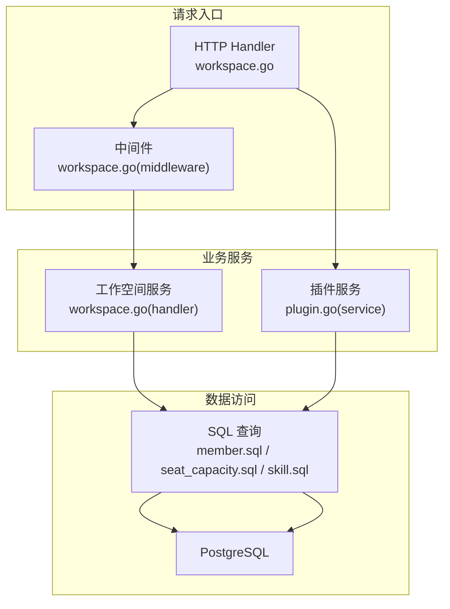
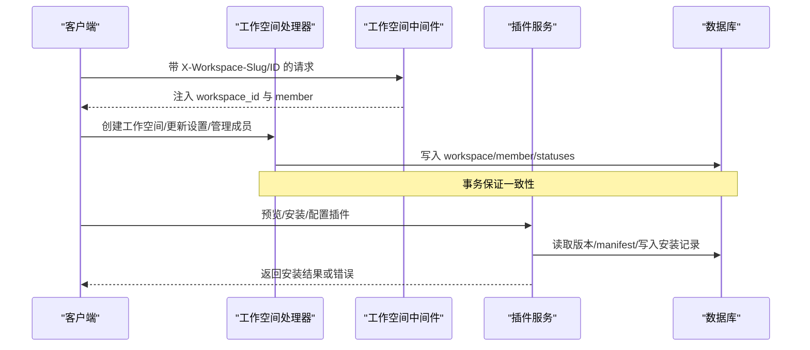
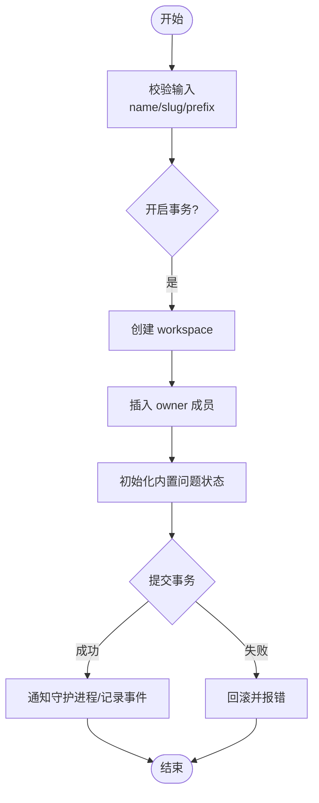
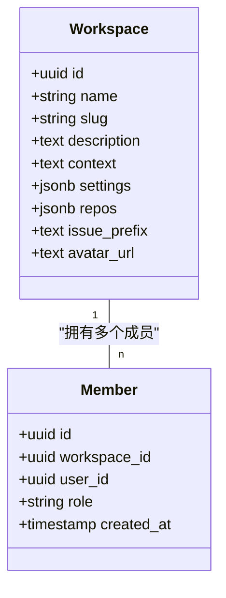
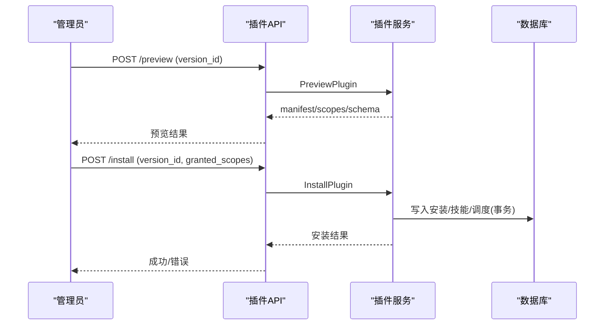
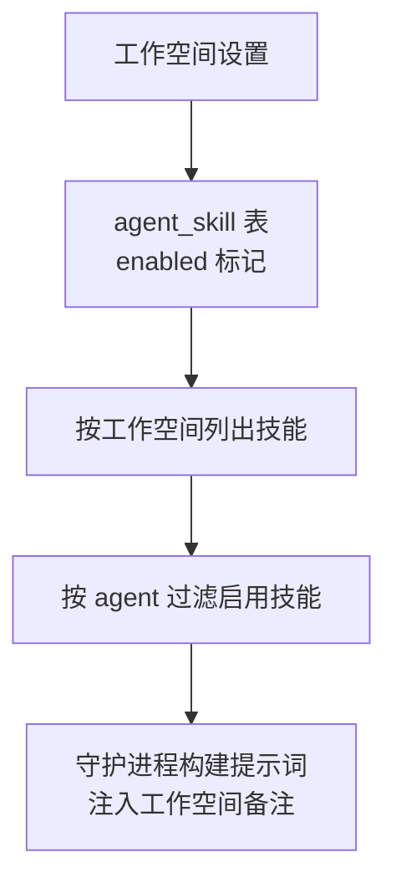
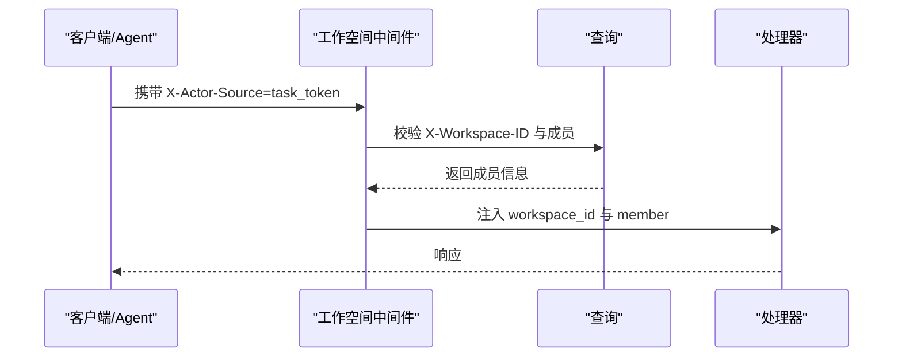
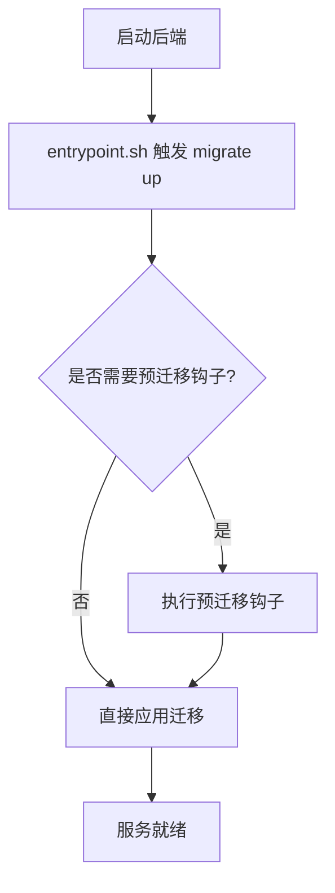
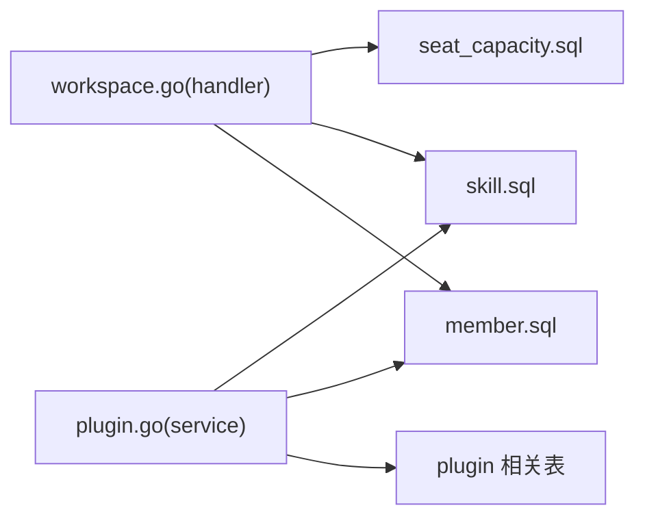

# 工作空间管理

<cite>
**本文引用的文件**
- [server/internal/handler/workspace.go](file://server/internal/handler/workspace.go)
- [server/internal/middleware/workspace.go](file://server/internal/middleware/workspace.go)
- [server/pkg/db/queries/member.sql](file://server/pkg/db/queries/member.sql)
- [apps/docs/content/docs/members-roles.zh.mdx](file://apps/docs/content/docs/members-roles.zh.mdx)
- [server/internal/service/plugin.go](file://server/internal/service/plugin.go)
- [server/internal/handler/plugin.go](file://server/internal/handler/plugin.go)
- [server/pkg/db/queries/skill.sql](file://server/pkg/db/queries/skill.sql)
- [server/migrations/161_agent_skill_enabled.up.sql](file://server/migrations/161_agent_skill_enabled.up.sql)
- [server/migrations/206_agent_disabled_runtime_skills.up.sql](file://server/migrations/206_agent_disabled_runtime_skills.up.sql)
- [server/migrations/415_seat_capacity_outbox.up.sql](file://server/migrations/415_seat_capacity_outbox.up.sql)
- [server/pkg/db/queries/seat_capacity.sql](file://server/pkg/db/queries/seat_capacity.sql)
- [server/migrations/318_drop_workspace_mcp_config.down.sql](file://server/migrations/318_drop_workspace_mcp_config.down.sql)
- [server/migrations/314_workspace_mcp_config.down.sql](file://server/migrations/314_workspace_mcp_config.down.sql)
- [server/cmd/migrate/main.go](file://server/cmd/migrate/main.go)
- [apps/docs/content/docs/self-host-quickstart.zh.mdx](file://apps/docs/content/docs/self-host-quickstart.zh.mdx)
- [apps/docs/content/docs/security-model.zh.mdx](file://apps/docs/content/docs/security-model.zh.mdx)
</cite>

## 目录
1. [简介](#简介)
2. [项目结构](#项目结构)
3. [核心组件](#核心组件)
4. [架构总览](#架构总览)
5. [详细组件分析](#详细组件分析)
6. [依赖关系分析](#依赖关系分析)
7. [性能考量](#性能考量)
8. [故障排查指南](#故障排查指南)
9. [结论](#结论)
10. [附录](#附录)

## 简介
本文件系统性说明 Multica 工作空间管理能力，覆盖创建、配置、成员与权限、数据隔离与租户隔离、智能体与技能集成、工作空间级插件生命周期（安装/配置/版本控制/依赖）、外部集成关联、数据迁移策略与备份恢复。文档面向不同技术背景的读者，提供从高层到代码级的可视化与可操作指引。

## 项目结构
后端以 Go + Chi 路由组织，工作空间相关能力集中在 handler、middleware、service 与 db queries 层；前端通过 Next.js/Web/Mobile/Demo 等应用调用 API；数据库使用 PostgreSQL，迁移由 migrate 工具驱动。

图表来源
- [server/internal/handler/workspace.go:159-320](file://server/internal/handler/workspace.go#L159-L320)
- [server/internal/middleware/workspace.go:158-266](file://server/internal/middleware/workspace.go#L158-L266)
- [server/internal/service/plugin.go:260-471](file://server/internal/service/plugin.go#L260-L471)
- [server/pkg/db/queries/member.sql:1-38](file://server/pkg/db/queries/member.sql#L1-L38)

章节来源
- [server/internal/handler/workspace.go:159-320](file://server/internal/handler/workspace.go#L159-L320)
- [server/internal/middleware/workspace.go:158-266](file://server/internal/middleware/workspace.go#L158-L266)

## 核心组件
- 工作空间 CRUD：创建时校验 slug、任务前缀，写入 workspace 并初始化默认问题状态，自动授予创建者为 owner。
- 成员与角色：支持 owner/admin/member 三种角色，限制 owner 数量至少为 1，变更角色需满足权限矩阵。
- 插件管理：预览/安装/升级/配置/启用禁用/卸载，严格绑定已发布版本，按 manifest 的 scopes 精确授权，配置项类型校验与密钥加密存储。
- 技能集成：工作空间内 agent_skill 表维护启用的技能集合，支持按工作空间列出与按 agent 过滤。
- 容量与席位：seat_capacity_outbox 记录跨服务幂等意图，支持邀请/分享链接加入/释放等操作。
- MCP 配置：工作空间保留 mcp_config JSONB 字段用于外部集成配置。

章节来源
- [server/internal/handler/workspace.go:202-320](file://server/internal/handler/workspace.go#L202-L320)
- [server/internal/handler/workspace.go:547-639](file://server/internal/handler/workspace.go#L547-L639)
- [server/internal/service/plugin.go:260-471](file://server/internal/service/plugin.go#L260-L471)
- [server/pkg/db/queries/skill.sql:140-170](file://server/pkg/db/queries/skill.sql#L140-L170)
- [server/migrations/415_seat_capacity_outbox.up.sql:1-34](file://server/migrations/415_seat_capacity_outbox.up.sql#L1-L34)
- [server/migrations/318_drop_workspace_mcp_config.down.sql:1-1](file://server/migrations/318_drop_workspace_mcp_config.down.sql#L1-L1)

## 架构总览
工作空间请求经中间件解析目标工作空间并校验成员/角色，随后进入处理器执行业务逻辑；插件流程在独立 service 中完成版本锁定、manifest 校验、配置与密钥落库、调度器同步；数据访问统一通过 sqlc 生成的查询。

图表来源
- [server/internal/middleware/workspace.go:158-266](file://server/internal/middleware/workspace.go#L158-L266)
- [server/internal/handler/workspace.go:202-320](file://server/internal/handler/workspace.go#L202-L320)
- [server/internal/service/plugin.go:260-471](file://server/internal/service/plugin.go#L260-L471)

## 详细组件分析

### 工作空间创建与配置
- 创建流程：
  - 校验名称、slug（小写字母/数字/连字符）、是否保留字。
  - 计算或规范化任务前缀（issue_prefix），默认从 slug 派生。
  - 开启事务：创建 workspace、插入 owner 成员、初始化内置问题状态。
  - 提交后记录事件并通知守护进程刷新工作空间列表。
- 更新流程：
  - 支持修改名称、描述、上下文、settings、repos、avatar_url、issue_prefix。
  - repos 数组会去重并校验 URL 格式。
  - 变更 name/settings 会广播给所有成员以唤醒 daemon。

图表来源
- [server/internal/handler/workspace.go:202-320](file://server/internal/handler/workspace.go#L202-L320)

章节来源
- [server/internal/handler/workspace.go:202-320](file://server/internal/handler/workspace.go#L202-L320)
- [server/internal/handler/workspace.go:373-465](file://server/internal/handler/workspace.go#L373-L465)

### 成员管理与权限矩阵
- 角色定义：owner、admin、member。日常协作对所有成员开放，角色仅控制工作区设置与团队管理。
- 权限要点：
  - 只有 owner/admin 可邀请 admin/member。
  - 只有 owner 可授予/收回/移除 owner。
  - 工作区必须始终保留至少一名 owner。
  - 删除/离开工作区时需确保 owner 数量不少于 1。
- 数据访问：成员列表、按用户与工作空间查询、更新角色、删除成员等 SQL 查询封装于 member.sql。

图表来源
- [server/pkg/db/queries/member.sql:1-38](file://server/pkg/db/queries/member.sql#L1-L38)

章节来源
- [apps/docs/content/docs/members-roles.zh.mdx:1-31](file://apps/docs/content/docs/members-roles.zh.mdx#L1-L31)
- [server/internal/handler/workspace.go:547-744](file://server/internal/handler/workspace.go#L547-L744)
- [server/pkg/db/queries/member.sql:1-38](file://server/pkg/db/queries/member.sql#L1-L38)

### 插件管理（安装/配置/版本控制/依赖）
- 预览与安装：
  - PreviewPlugin 读取已发布版本的 manifest，展示 scopes 与配置 schema，不写库。
  - InstallPlugin 将安装绑定到具体版本，校验 host 能力与 exact scopes，写入安装记录、技能资源、钩子调度，全部在事务中完成。
- 配置与密钥：
  - SetConfig 按 manifest 校验字段类型，普通值写入安装行，secret 值加密后存入独立表。
  - 支持部分更新合并，空 secret 清空对应密钥。
- 启用/禁用与卸载：
  - SetEnabled 立即隐藏贡献但保留存储与密钥。
  - Uninstall 原子删除调度、存储、密钥、调用记录、技能与安装记录。
- 版本控制：
  - 每次 publish 生成新版本，安装行固定版本；升级需再次显式同意。

图表来源
- [server/internal/handler/plugin.go:210-270](file://server/internal/handler/plugin.go#L210-L270)
- [server/internal/service/plugin.go:260-471](file://server/internal/service/plugin.go#L260-L471)

章节来源
- [server/internal/service/plugin.go:260-471](file://server/internal/service/plugin.go#L260-L471)
- [server/internal/handler/plugin.go:180-356](file://server/internal/handler/plugin.go#L180-L356)

### 智能体与技能集成
- 工作空间级别技能：
  - agent_skill.enabled 标记技能是否启用。
  - 可按工作空间列出技能，按 agent 过滤已启用技能。
- 运行时技能控制：
  - agent.disabled_runtime_skills 允许在工作空间层面禁用某些运行时技能。
- 提示词装配：
  - 守护进程在每轮 prompt 中注入工作空间备注与偏好，技能水合至 provider 原生 skills 目录。

图表来源
- [server/migrations/161_agent_skill_enabled.up.sql:1-2](file://server/migrations/161_agent_skill_enabled.up.sql#L1-L2)
- [server/pkg/db/queries/skill.sql:140-170](file://server/pkg/db/queries/skill.sql#L140-L170)
- [server/migrations/206_agent_disabled_runtime_skills.up.sql:1-2](file://server/migrations/206_agent_disabled_runtime_skills.up.sql#L1-L2)

章节来源
- [server/pkg/db/queries/skill.sql:140-170](file://server/pkg/db/queries/skill.sql#L140-L170)
- [server/migrations/161_agent_skill_enabled.up.sql:1-2](file://server/migrations/161_agent_skill_enabled.up.sql#L1-L2)
- [server/migrations/206_agent_disabled_runtime_skills.up.sql:1-2](file://server/migrations/206_agent_disabled_runtime_skills.up.sql#L1-L2)

### 数据隔离与租户隔离
- 请求级工作空间解析：
  - 优先 task-token 绑定的 workspace（不可被客户端篡改）。
  - 其次 X-Workspace-Slug/Query 参数解析为 UUID。
  - 最后兼容 X-Workspace-ID/Query workspace_id。
- 成员鉴权：
  - 中间件根据用户与工作空间查询成员，校验角色，注入上下文供后续处理器使用。
- 安全边界说明：
  - 运行级 token 绑定到智能体与运行，避免越权。
  - 每个运行拥有独立 workdir 与 CODEX_HOME，避免互相污染。
  - 系统不提供沙箱逃逸防护，建议部署在容器/虚拟机/专用用户下收敛影响面。

图表来源
- [server/internal/middleware/workspace.go:47-150](file://server/internal/middleware/workspace.go#L47-L150)
- [server/internal/middleware/workspace.go:158-266](file://server/internal/middleware/workspace.go#L158-L266)

章节来源
- [server/internal/middleware/workspace.go:47-150](file://server/internal/middleware/workspace.go#L47-L150)
- [server/internal/middleware/workspace.go:158-266](file://server/internal/middleware/workspace.go#L158-L266)
- [apps/docs/content/docs/security-model.zh.mdx:20-42](file://apps/docs/content/docs/security-model.zh.mdx#L20-L42)

### 外部集成与 MCP 配置
- 工作空间保留 mcp_config JSONB 字段，用于承载外部集成的配置项（例如 MCP 服务器地址、认证信息等）。
- 迁移历史显示该列曾被添加/删除，部署时应关注当前 schema 状态。

章节来源
- [server/migrations/318_drop_workspace_mcp_config.down.sql:1-1](file://server/migrations/318_drop_workspace_mcp_config.down.sql#L1-L1)
- [server/migrations/314_workspace_mcp_config.down.sql:1-1](file://server/migrations/314_workspace_mcp_config.down.sql#L1-L1)

### 数据迁移策略与备份恢复
- 迁移执行：
  - 启动时自动执行 migrate up，逐步推进 schema。
  - 预迁移钩子可在特定迁移前执行幂等工作（如修复索引、准备数据）。
- 备份建议：
  - 升级前对 Postgres 进行 pg_dump 导出，注意管道退出码与压缩顺序。
  - 数据卷在 docker compose down 时不会删除，但 down -v 会清理。

图表来源
- [server/cmd/migrate/main.go:23-33](file://server/cmd/migrate/main.go#L23-L33)
- [apps/docs/content/docs/self-host-quickstart.zh.mdx:329-350](file://apps/docs/content/docs/self-host-quickstart.zh.mdx#L329-L350)

章节来源
- [server/cmd/migrate/main.go:23-33](file://server/cmd/migrate/main.go#L23-L33)
- [apps/docs/content/docs/self-host-quickstart.zh.mdx:329-350](file://apps/docs/content/docs/self-host-quickstart.zh.mdx#L329-L350)

## 依赖关系分析
- 工作空间处理器依赖中间件解析工作空间与成员，依赖 sqlc 查询写入 workspace/member/statuses。
- 插件服务依赖版本/manifest/能力检查、配置 schema 校验、加密存储与调度器同步。
- 席位容量通过 outbox 表实现跨服务幂等，支持邀请/分享链接加入与释放。

图表来源
- [server/internal/handler/workspace.go:159-320](file://server/internal/handler/workspace.go#L159-L320)
- [server/internal/service/plugin.go:260-471](file://server/internal/service/plugin.go#L260-L471)
- [server/pkg/db/queries/seat_capacity.sql:73-131](file://server/pkg/db/queries/seat_capacity.sql#L73-L131)

章节来源
- [server/pkg/db/queries/seat_capacity.sql:73-131](file://server/pkg/db/queries/seat_capacity.sql#L73-L131)
- [server/migrations/415_seat_capacity_outbox.up.sql:1-34](file://server/migrations/415_seat_capacity_outbox.up.sql#L1-L34)

## 性能考量
- 删除工作空间锁等待：
  - 删除流程持有工作空间行、会话行与全局 advisory lock，为避免长时间阻塞，设置锁超时预算，遇到锁冲突返回可重试错误。
- 并发安装插件：
  - 基于唯一键冲突识别重复安装，返回冲突以便上层重试。
- 席位容量 outbox：
  - 通过唯一索引与幂等 action 保证并发下的正确性。

章节来源
- [server/internal/handler/workspace.go:746-800](file://server/internal/handler/workspace.go#L746-L800)
- [server/internal/service/plugin.go:395-401](file://server/internal/service/plugin.go#L395-L401)
- [server/migrations/419_seat_capacity_share_join_index.up.sql:1-5](file://server/migrations/419_seat_capacity_share_join_index.up.sql#L1-L5)

## 故障排查指南
- 工作空间创建失败：
  - 检查 slug 是否符合规则且未被保留；确认未开启实例级禁止创建开关。
- 成员角色更新失败：
  - 确保非 owner 不能操作 owner；确保工作区至少保留一个 owner。
- 插件安装失败：
  - 检查 manifest 能力是否与宿主匹配；granted_scopes 必须与 manifest 完全一致；若出现唯一键冲突，属于并发安装，应重试。
- 席位容量异常：
  - 查看 seat_capacity_outbox 中的 action 与 attempt_count，必要时重新投递或释放。
- 迁移卡住：
  - 检查预迁移钩子是否成功；必要时手动执行 backfill 命令后再重启后端。

章节来源
- [server/internal/handler/workspace.go:202-320](file://server/internal/handler/workspace.go#L202-L320)
- [server/internal/handler/workspace.go:547-744](file://server/internal/handler/workspace.go#L547-L744)
- [server/internal/service/plugin.go:260-471](file://server/internal/service/plugin.go#L260-L471)
- [server/pkg/db/queries/seat_capacity.sql:73-131](file://server/pkg/db/queries/seat_capacity.sql#L73-L131)
- [apps/docs/content/docs/self-host-quickstart.zh.mdx:329-350](file://apps/docs/content/docs/self-host-quickstart.zh.mdx#L329-L350)

## 结论
Multica 的工作空间管理以严格的中间件鉴权、事务化数据操作与版本化的插件体系为核心，实现了清晰的租户隔离、安全的成员权限模型与可扩展的智能体/技能生态。通过席位容量 outbox 与迁移钩子机制，系统在多租户与运维稳定性方面具备良好保障。建议在生产环境遵循最小权限原则、定期备份数据库，并在升级前验证迁移与钩子行为。

## 附录

### 工作空间配置 YAML 示例（概念性）
以下为工作空间配置的常见键位示意，实际存储为 JSONB 字段，键名与含义应与产品设置页保持一致：
- name：工作区名称
- slug：工作区 URL 前缀（创建后不可更改）
- description：工作区描述
- context：工作区上下文与约定
- issue_prefix：任务编号前缀（如 MUL）
- settings：工作区级开关与默认值（例如 GitHub 集成开关、Co-authored-by 开关等）
- repos：仓库引用列表（url、description）
- avatar_url：工作区头像地址
- mcp_config：外部集成配置（JSONB）

章节来源
- [server/internal/handler/workspace.go:97-139](file://server/internal/handler/workspace.go#L97-L139)
- [server/internal/handler/workspace.go:322-465](file://server/internal/handler/workspace.go#L322-L465)
- [server/migrations/318_drop_workspace_mcp_config.down.sql:1-1](file://server/migrations/318_drop_workspace_mcp_config.down.sql#L1-L1)

### 成员角色定义与权限矩阵
- owner：可修改工作区设置、邀请/调整 admin/member、授予/收回/移除 owner、删除工作区。
- admin：可修改工作区设置、邀请/调整 admin/member。
- member：可查看工作区并参与日常协作。
- 约束：工作区必须始终保留至少一名 owner。

章节来源
- [apps/docs/content/docs/members-roles.zh.mdx:1-31](file://apps/docs/content/docs/members-roles.zh.mdx#L1-L31)
- [server/internal/handler/workspace.go:547-744](file://server/internal/handler/workspace.go#L547-L744)

### 工作空间级插件管理 API 概览
- 列表：GET /api/workspaces/{id}/plugins
- 预览：POST /api/workspaces/{id}/plugins/preview
- 安装：POST /api/workspaces/{id}/plugins
- 配置：PUT /api/workspaces/{id}/plugins/{installationId}/config
- 启用/禁用：POST /api/workspaces/{id}/plugins/{installationId}/enable | disable
- 卸载：DELETE /api/workspaces/{id}/plugins/{installationId}

章节来源
- [server/internal/handler/plugin.go:180-356](file://server/internal/handler/plugin.go#L180-L356)