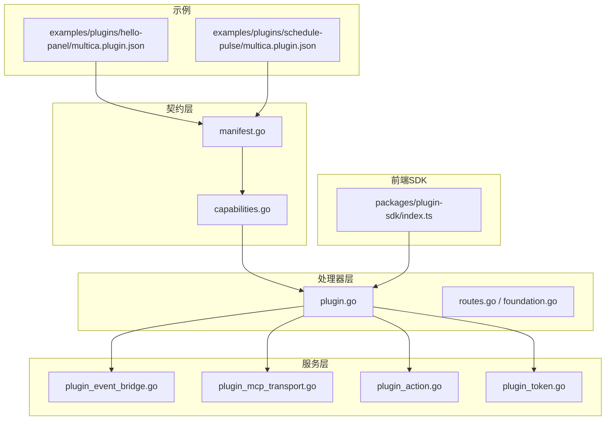
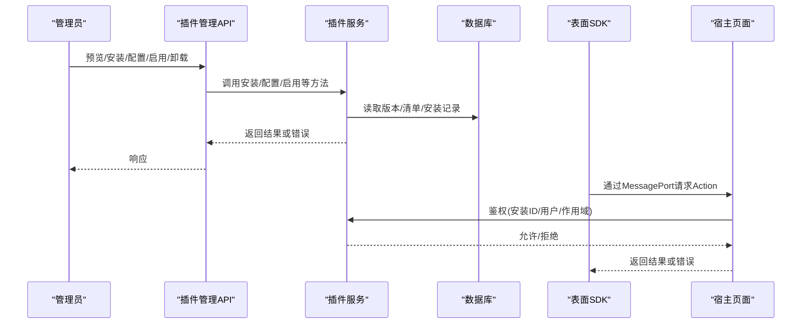
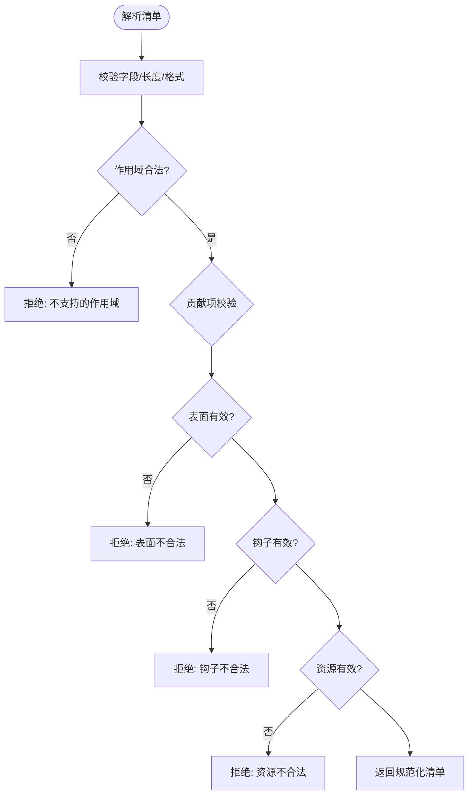
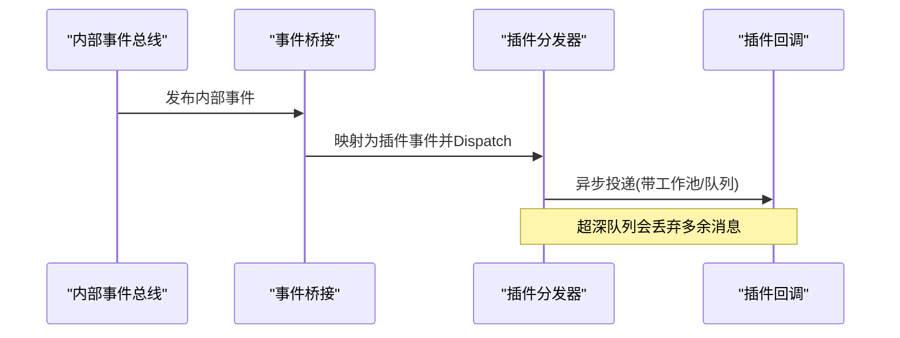
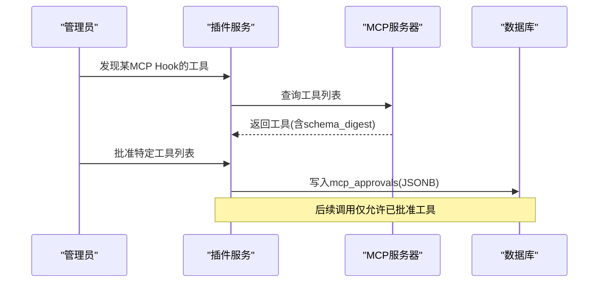
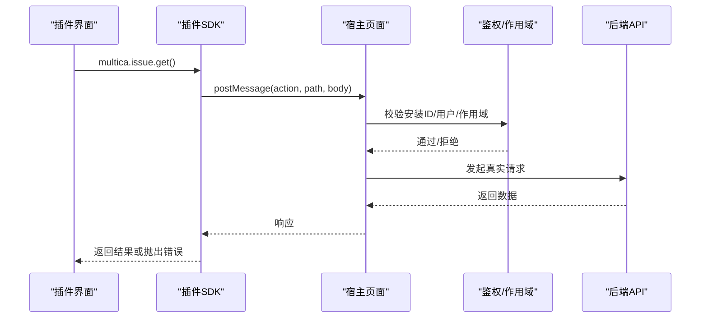
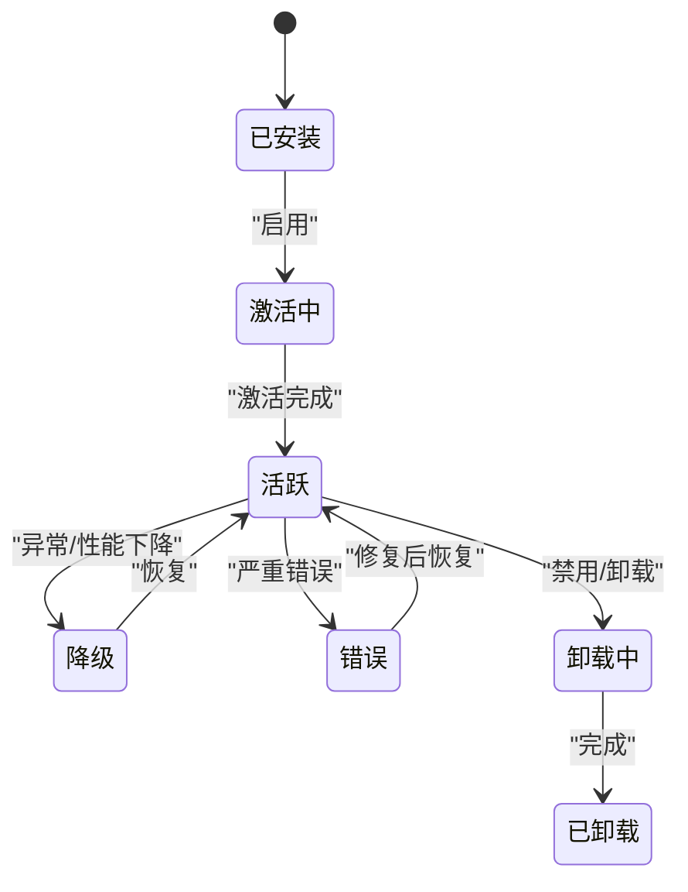
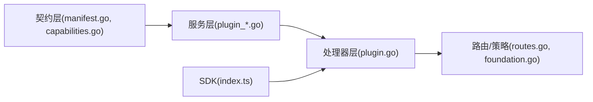

# 插件系统

<cite>
**本文引用的文件**
- [manifest.go](file://server/pkg/plugincontract/manifest.go)
- [capabilities.go](file://server/pkg/plugincontract/capabilities.go)
- [plugin_event_bridge.go](file://server/internal/service/plugin_event_bridge.go)
- [plugin_mcp_transport.go](file://server/internal/service/plugin_mcp_transport.go)
- [plugin_action.go](file://server/internal/service/plugin_action.go)
- [plugin_token.go](file://server/internal/service/plugin_token.go)
- [plugin.go](file://server/internal/handler/plugin.go)
- [routes.go](file://server/pkg/publicapi/v1/routes.go)
- [foundation.go](file://server/pkg/publicapi/v1/foundation.go)
- [index.ts](file://packages/plugin-sdk/index.ts)
- [multica.plugin.json（hello-panel）](file://examples/plugins/hello-panel/multica.plugin.json)
- [multica.plugin.json（schedule-pulse）](file://examples/plugins/schedule-pulse/multica.plugin.json)
- [285_plugin_lifecycle_v1.up.sql](file://server/migrations/285_plugin_lifecycle_v1.up.sql)
- [369_plugin_mcp_approvals.up.sql](file://server/migrations/369_plugin_mcp_approvals.up.sql)
</cite>

## 目录
1. [简介](#简介)
2. [项目结构](#项目结构)
3. [核心组件](#核心组件)
4. [架构总览](#架构总览)
5. [详细组件分析](#详细组件分析)
6. [依赖关系分析](#依赖关系分析)
7. [性能考量](#性能考量)
8. [故障排查指南](#故障排查指南)
9. [结论](#结论)
10. [附录](#附录)

## 简介
本文件系统性阐述 Multica 插件系统的契约、生命周期与沙箱隔离机制，覆盖四类插件类型：动作插件（Action）、钩子插件（Hook）、MCP 插件与表面插件（Surface）。文档解释事件驱动模型（订阅、消息传递、回调处理），并给出安装、升级、配置与监控流程。重点说明安全模型：权限控制、资源限制、网络访问与数据隔离。所有说明均基于仓库内源码与迁移脚本，便于开发者快速定位实现位置。

## 项目结构
Multica 的插件系统由“契约层 + 服务层 + 处理器层 + SDK + 示例”构成：
- 契约层：定义清单 manifest、能力集、作用域、触发器、传输方式等，确保插件与宿主之间的稳定边界。
- 服务层：负责安装、授权、事件桥接、MCP 工具审批、令牌签发等核心逻辑。
- 处理器层：暴露管理 API（预览、安装、配置、启用/禁用、卸载）以及运行时调用入口（如存储、上下文、问题操作等）。
- SDK：面向表面插件的前端 SDK，通过 MessagePort 与宿主通信，执行受限的 Action API 调用。
- 示例：提供可安装的插件样例，用于验证契约与能力。

图表来源
- [manifest.go:1-120](file://server/pkg/plugincontract/manifest.go#L1-L120)
- [capabilities.go:23-51](file://server/pkg/plugincontract/capabilities.go#L23-L51)
- [plugin_event_bridge.go:1-37](file://server/internal/service/plugin_event_bridge.go#L1-L37)
- [plugin_mcp_transport.go:1-68](file://server/internal/service/plugin_mcp_transport.go#L1-L68)
- [plugin_action.go:39-65](file://server/internal/service/plugin_action.go#L39-L65)
- [plugin_token.go:35-68](file://server/internal/service/plugin_token.go#L35-L68)
- [plugin.go:16-356](file://server/internal/handler/plugin.go#L16-L356)
- [routes.go:64-67](file://server/pkg/publicapi/v1/routes.go#L64-L67)
- [foundation.go:48-79](file://server/pkg/publicapi/v1/foundation.go#L48-L79)
- [index.ts:1-282](file://packages/plugin-sdk/index.ts#L1-L282)
- [multica.plugin.json（hello-panel）:1-21](file://examples/plugins/hello-panel/multica.plugin.json#L1-L21)
- [multica.plugin.json（schedule-pulse）:1-49](file://examples/plugins/schedule-pulse/multica.plugin.json#L1-L49)

章节来源
- [manifest.go:1-120](file://server/pkg/plugincontract/manifest.go#L1-L120)
- [capabilities.go:23-51](file://server/pkg/plugincontract/capabilities.go#L23-L51)
- [plugin.go:16-356](file://server/internal/handler/plugin.go#L16-L356)
- [index.ts:1-282](file://packages/plugin-sdk/index.ts#L1-L282)

## 核心组件
- 插件契约与清单：定义插件声明式能力（作用域、贡献项、触发器、传输方式、配置字段），并在解析时进行严格校验与规范化，防止未知字段或越权声明进入系统。
- 能力矩阵：宿主声明当前支持的能力集合（表面类型、触发器、传输方式），安装前进行兼容性检查。
- 事件桥接：将内部事件总线映射为插件可订阅的七种事件，保证发布词汇与插件契约解耦。
- MCP 传输与审批：对指向外部 MCP 服务器的 Hook 进行工具发现与管理员审批，按 schema digest 固定可用工具列表，避免“安装即永久授权”。
- 动作授权：对插件调用的 Action API 进行安装存在性、启用状态与作用域校验，继承用户权限而不复制规则。
- 令牌与安全：为插件安装与回调生成一次性令牌，仅哈希存储，丢失不可恢复，遵循产品统一的凭据策略。
- 管理 API：提供预览、安装、配置、启用/禁用、卸载等接口，统一错误码与审计策略。

章节来源
- [manifest.go:176-781](file://server/pkg/plugincontract/manifest.go#L176-L781)
- [capabilities.go:23-51](file://server/pkg/plugincontract/capabilities.go#L23-L51)
- [plugin_event_bridge.go:12-69](file://server/internal/service/plugin_event_bridge.go#L12-L69)
- [plugin_mcp_transport.go:14-68](file://server/internal/service/plugin_mcp_transport.go#L14-L68)
- [plugin_action.go:39-65](file://server/internal/service/plugin_action.go#L39-L65)
- [plugin_token.go:35-68](file://server/internal/service/plugin_token.go#L35-L68)
- [plugin.go:180-356](file://server/internal/handler/plugin.go#L180-L356)

## 架构总览
插件系统围绕“声明式契约 + 受控执行”展开：
- 插件以清单声明能力；宿主在预览/安装阶段校验并固化快照。
- 运行时通过 SDK（表面）或 Hook（服务端）双向交互，所有调用经宿主鉴权、限流与审计。
- 事件驱动通过桥接层将内部事件转换为插件可见事件，保持契约稳定。
- MCP 传输引入管理员审批，锁定工具列表与 schema，保障动态能力的可控性。

图表来源
- [plugin.go:180-356](file://server/internal/handler/plugin.go#L180-L356)
- [plugin_action.go:39-65](file://server/internal/service/plugin_action.go#L39-L65)
- [index.ts:150-167](file://packages/plugin-sdk/index.ts#L150-L167)
- [routes.go:64-67](file://server/pkg/publicapi/v1/routes.go#L64-L67)
- [foundation.go:48-79](file://server/pkg/publicapi/v1/foundation.go#L48-L79)

## 详细组件分析

### 插件契约与清单（Manifest）
- 清单字段：键、名称、描述、版本、作者、图标、作用域、配置、贡献项（表面、钩子、资源）。
- 作用域：固定作用域与 net: 域名白名单，后者同时约束 iframe CSP connect-src 与 Hook 出站目标。
- 贡献项校验：
  - 表面：限定类型（issue_panel、sidebar_panel、modal），入口必须为 .js/.mjs，平台限定 web/desktop。
  - 钩子：触发器（ui、manual、agent、event、schedule）、事件订阅、调度表达式、传输方式（http、mcp）、超时。
  - 资源：目前仅 skill，路径强制为 skills/<key>/SKILL.md。
- 调度约束：最小间隔 5 分钟，cron 表达式需合法且不含内联时区。
- 传输约束：URL 必须 HTTPS，且主机必须在已授予的 net: 作用域中。

图表来源
- [manifest.go:356-781](file://server/pkg/plugincontract/manifest.go#L356-L781)

章节来源
- [manifest.go:176-781](file://server/pkg/plugincontract/manifest.go#L176-L781)

### 能力矩阵与兼容性检查
- 宿主能力：声明支持的表面类型、触发器、传输方式。
- 安装前检查：清单能力必须被宿主支持，否则拒绝安装，避免“能装不能用”的静默失败。

章节来源
- [capabilities.go:23-51](file://server/pkg/plugincontract/capabilities.go#L23-L51)
- [plugin.go:331-358](file://server/internal/service/plugin.go#L331-L358)

### 事件驱动模型（订阅、消息传递、回调）
- 事件桥接：将内部事件总线事件映射为插件可订阅的七种事件（issue.created/updated/status_changed、comment.created、task.started/completed/failed）。
- issue.status_changed 由 issue.updated 派生，减少重复发布，让插件订阅更精确的事件。
- 桥接监听轻量：仅提取 workspaceID 与 payload，转发到分发器，实际网络调用在 worker 上执行，避免阻塞请求 goroutine。
- 队列与丢弃：当队列深度超过阈值时，超出部分被丢弃，保证系统稳定性。

图表来源
- [plugin_event_bridge.go:12-69](file://server/internal/service/plugin_event_bridge.go#L12-L69)

章节来源
- [plugin_event_bridge.go:12-69](file://server/internal/service/plugin_event_bridge.go#L12-L69)

### 钩子插件（Hook）与调度
- 触发器：ui、manual、agent、event、schedule。
- 事件订阅：需显式声明 event 触发器及具体事件，且需具备对应读作用域。
- 调度：使用 cron 表达式与独立时区字段，最小间隔 5 分钟，仅支持 http 传输。
- 超时：可选，范围 100ms~30000ms。

章节来源
- [manifest.go:52-77](file://server/pkg/plugincontract/manifest.go#L52-L77)
- [manifest.go:624-683](file://server/pkg/plugincontract/manifest.go#L624-L683)
- [multica.plugin.json（schedule-pulse）:1-49](file://examples/plugins/schedule-pulse/multica.plugin.json#L1-L49)

### MCP 插件（Transport=mcp）
- 风险点：MCP 服务器动态决定工具列表，可能随时变化。
- 审批机制：管理员先发现工具，再按名称与 schema digest 批准固定列表；后续变更的工具不会自动采用，schema 漂移则停止调用。
- 网络限制：仅允许访问已授予的 net: 域名。
- 持久化：审批信息存储在安装记录的 JSONB 列中，随安装整体读取。

图表来源
- [plugin_mcp_transport.go:14-68](file://server/internal/service/plugin_mcp_transport.go#L14-L68)
- [369_plugin_mcp_approvals.up.sql:1-25](file://server/migrations/369_plugin_mcp_approvals.up.sql#L1-L25)

章节来源
- [plugin_mcp_transport.go:14-68](file://server/internal/service/plugin_mcp_transport.go#L14-L68)
- [369_plugin_mcp_approvals.up.sql:1-25](file://server/migrations/369_plugin_mcp_approvals.up.sql#L1-L25)

### 表面插件（Surface）与 SDK
- 表面：宿主在固定位置挂载 iframe，插件仅负责渲染内容。
- 安全：iframe 无凭据，不能直接访问 Multica API；所有调用通过 MessagePort 交由宿主代理，继承登录用户的权限。
- SDK 能力：获取上下文、问题读写、评论、存储（user/workspace）、调用本插件 ui 触发器、UI 尺寸调整与主题订阅。
- 错误模型：抛出带 HTTP 语义的状态码错误，便于上层统一处理。

图表来源
- [index.ts:150-167](file://packages/plugin-sdk/index.ts#L150-L167)
- [index.ts:199-282](file://packages/plugin-sdk/index.ts#L199-L282)
- [plugin_action.go:39-65](file://server/internal/service/plugin_action.go#L39-L65)

章节来源
- [index.ts:1-282](file://packages/plugin-sdk/index.ts#L1-L282)
- [multica.plugin.json（hello-panel）:1-21](file://examples/plugins/hello-panel/multica.plugin.json#L1-L21)

### 动作插件（Action）授权
- 授权三要素：安装存在且启用、持有所需作用域、继承用户资源权限（不在插件层复制规则）。
- 禁用即停：即使 iframe 仍打开，禁用后也会立即拒绝调用。

章节来源
- [plugin_action.go:39-65](file://server/internal/service/plugin_action.go#L39-L65)

### 令牌与安全
- 安装令牌：随机熵 + 前缀，仅哈希存储，明文只返回一次；丢失不可恢复，需轮换。
- 回调令牌：短 TTL，用于回调场景的安全凭证。

章节来源
- [plugin_token.go:35-68](file://server/internal/service/plugin_token.go#L35-L68)

### 插件部署与管理（安装、升级、配置、监控）
- 预览：在不写入的情况下展示清单与作用域，供管理员审阅同意。
- 安装：绑定到某个已发布版本，作用域必须与清单完全一致，二次同意升级。
- 配置：非机密字段通过配置表单设置；机密字段单独加密存储，读取时仅返回名称。
- 启用/禁用：即时生效，禁用后 iframe 与调用立即失效。
- 卸载：清理安装记录。
- 监控：可通过安装记录的生命周期状态与调度表查看运行状况。

图表来源
- [285_plugin_lifecycle_v1.up.sql:73-103](file://server/migrations/285_plugin_lifecycle_v1.up.sql#L73-L103)

章节来源
- [plugin.go:180-356](file://server/internal/handler/plugin.go#L180-L356)
- [285_plugin_lifecycle_v1.up.sql:73-103](file://server/migrations/285_plugin_lifecycle_v1.up.sql#L73-L103)

## 依赖关系分析
- 契约层对服务层与处理器层提供稳定的数据结构与常量，避免私有实现泄露。
- 服务层依赖契约层进行清单解析与能力检查，依赖数据库生成的查询对象进行安装/版本/调度等操作。
- 处理器层将 HTTP 路由与策略（认证、速率限制、审计）组合，统一错误映射。
- SDK 与宿主通过 MessagePort 通信，不直接依赖后端库，降低第三方插件耦合。

图表来源
- [manifest.go:1-120](file://server/pkg/plugincontract/manifest.go#L1-L120)
- [capabilities.go:23-51](file://server/pkg/plugincontract/capabilities.go#L23-L51)
- [plugin.go:16-356](file://server/internal/handler/plugin.go#L16-L356)
- [routes.go:64-67](file://server/pkg/publicapi/v1/routes.go#L64-L67)
- [foundation.go:48-79](file://server/pkg/publicapi/v1/foundation.go#L48-L79)
- [index.ts:1-282](file://packages/plugin-sdk/index.ts#L1-L282)

章节来源
- [manifest.go:1-120](file://server/pkg/plugincontract/manifest.go#L1-L120)
- [plugin.go:16-356](file://server/internal/handler/plugin.go#L16-L356)

## 性能考量
- 事件桥接在发布 goroutine 上做最轻量的转发，避免大对象序列化阻塞请求链路。
- 调度最小间隔 5 分钟，防止高频出站流量与过度负载。
- 队列深度有限制，超出部分丢弃，保护系统稳定性。
- 清单大小上限与字段长度限制，防止恶意或错误清单导致解析开销过大。

[本节为通用指导，无需引用具体文件]

## 故障排查指南
- 安装失败：检查清单是否通过解析与能力检查；确认作用域与 net: 域名匹配；核对 MCP 审批是否完成。
- 调用被拒：确认插件已启用、用户具备所需作用域；检查 iframe 是否在禁用后被复用。
- 事件未到达：确认事件桥接订阅了正确事件；检查队列是否溢出导致丢弃。
- 调度不触发：校验 cron 表达式与时区；确认最小间隔满足要求；检查传输 URL 是否在网域白名单内。
- 错误码映射：处理器将服务层错误映射为标准 HTTP 状态码，便于前端统一处理。

章节来源
- [plugin.go:28-52](file://server/internal/handler/plugin.go#L28-L52)
- [plugin_event_bridge.go:29-69](file://server/internal/service/plugin_event_bridge.go#L29-L69)
- [manifest.go:709-751](file://server/pkg/plugincontract/manifest.go#L709-L751)

## 结论
Multica 插件系统以严格的契约与能力矩阵为基础，结合事件桥接、MCP 审批、作用域与网络白名单、令牌与审计，构建了安全可控的扩展生态。表面插件通过 SDK 在沙箱中运行，钩子插件在服务端受控执行，二者共同形成“声明即能力、授权即边界”的体系。通过预览-安装-配置的渐进式流程，管理员可在充分知情的前提下启用插件，确保生产环境的稳定性与安全性。

## 附录
- 示例插件参考：
  - hello-panel：展示 surface 的最小可用清单与 UI 入口。
  - schedule-pulse：展示 schedule 触发器的 cron 配置与出站网络限制。
- 数据库迁移要点：
  - 安装记录包含生命周期状态、版本绑定、启用标记与时间戳。
  - MCP 审批以 JSONB 存储，随安装整体读取，避免额外表维护成本。

章节来源
- [multica.plugin.json（hello-panel）:1-21](file://examples/plugins/hello-panel/multica.plugin.json#L1-L21)
- [multica.plugin.json（schedule-pulse）:1-49](file://examples/plugins/schedule-pulse/multica.plugin.json#L1-L49)
- [285_plugin_lifecycle_v1.up.sql:73-103](file://server/migrations/285_plugin_lifecycle_v1.up.sql#L73-L103)
- [369_plugin_mcp_approvals.up.sql:1-25](file://server/migrations/369_plugin_mcp_approvals.up.sql#L1-L25)