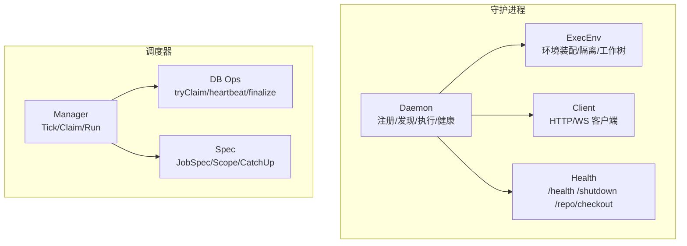
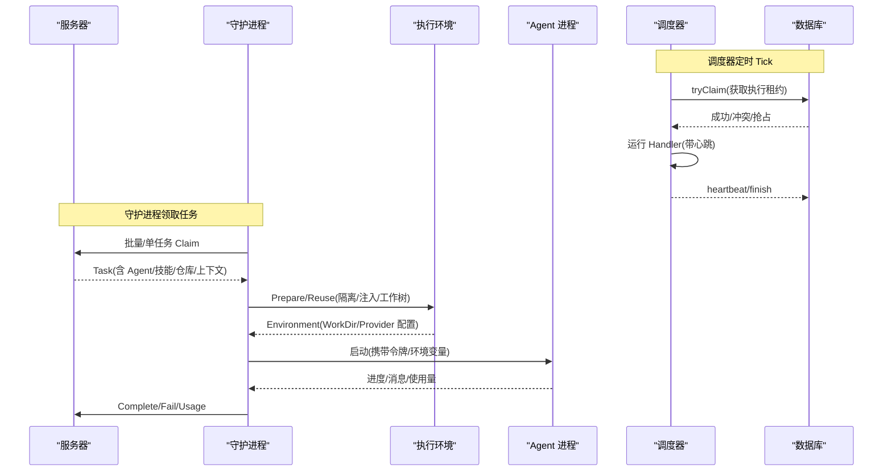
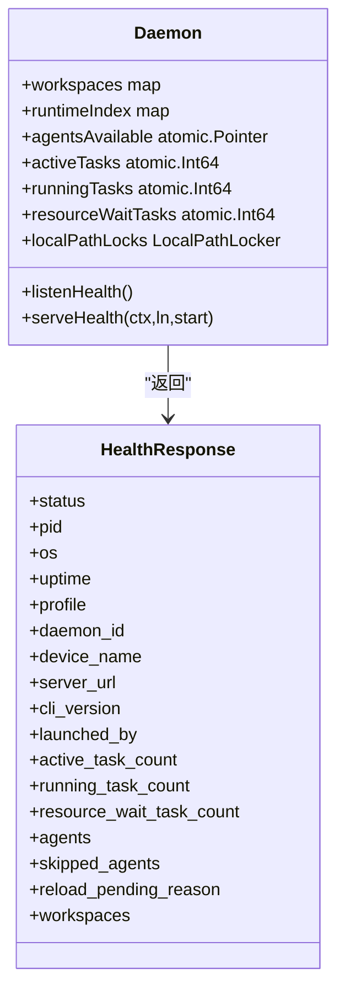
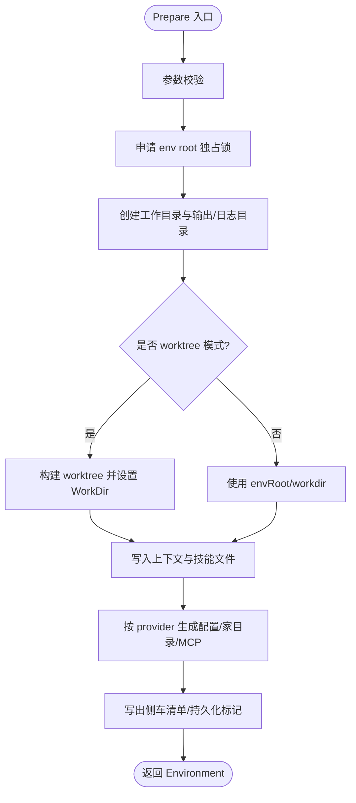
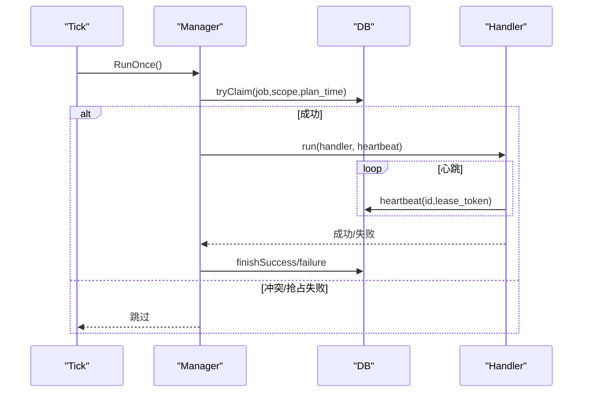
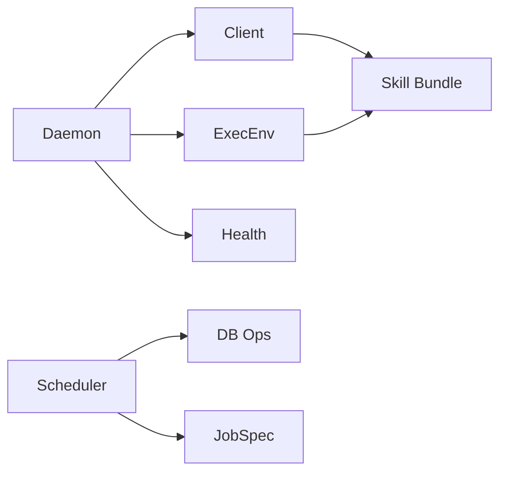
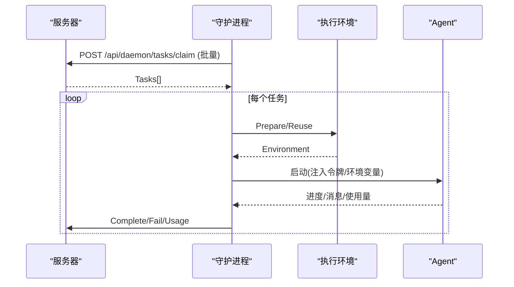
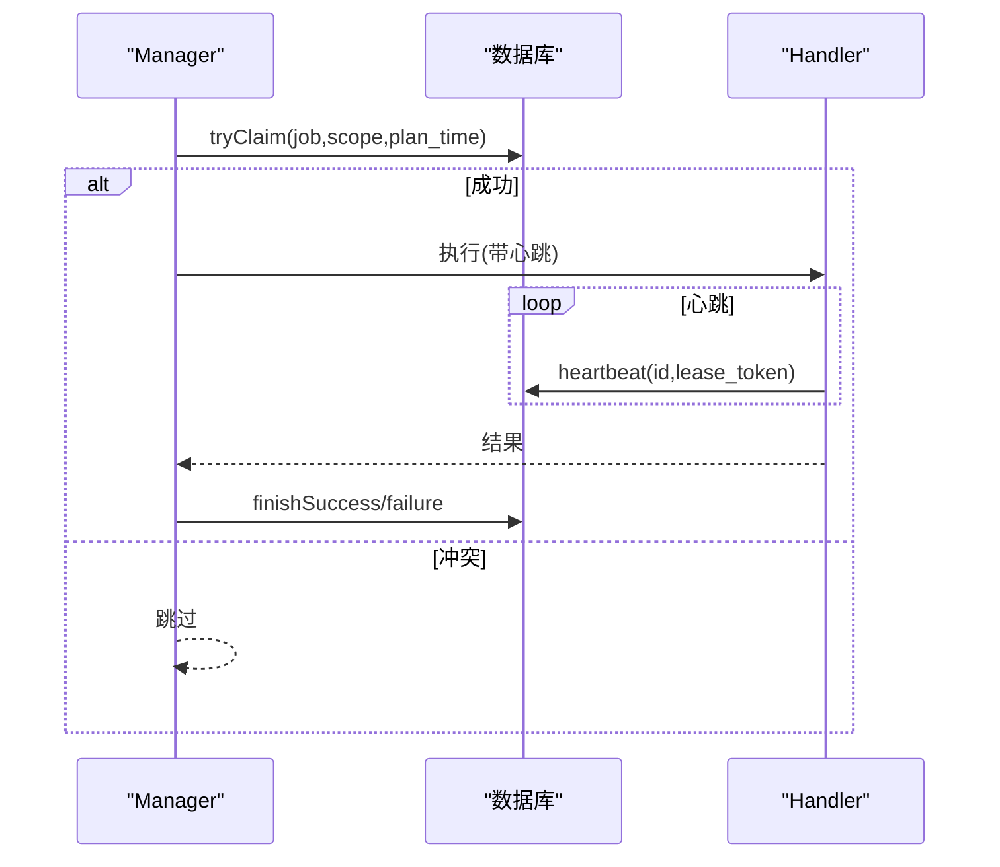

# 智能体调度

<cite>
**本文引用的文件**
- [daemon.go](file://server/internal/daemon/daemon.go)
- [health.go](file://server/internal/daemon/health.go)
- [client.go](file://server/internal/daemon/client.go)
- [types.go](file://server/internal/daemon/types.go)
- [execenv.go](file://server/internal/daemon/execenv/execenv.go)
- [manager.go](file://server/internal/scheduler/manager.go)
- [spec.go](file://server/internal/scheduler/spec.go)
- [db_ops.go](file://server/internal/scheduler/db_ops.go)
- [binary.go](file://server/internal/skill/binary.go)
</cite>

## 目录
1. [简介](#简介)
2. [项目结构](#项目结构)
3. [核心组件](#核心组件)
4. [架构总览](#架构总览)
5. [详细组件分析](#详细组件分析)
6. [依赖关系分析](#依赖关系分析)
7. [性能考量](#性能考量)
8. [故障排查指南](#故障排查指南)
9. [结论](#结论)
10. [附录](#附录)

## 简介
本文件系统性梳理 Multica 智能体调度系统，覆盖智能体的注册与发现、健康检查、资源隔离与复用、任务调度算法（负载均衡、优先级、并发限制、资源隔离）、运行时启动与环境准备、技能系统与版本控制、守护进程通信协议、错误恢复、日志与监控指标，以及配置示例与调优建议。文档以代码级事实为依据，配合时序图、类图和流程图帮助读者快速理解并落地实践。

## 项目结构
Multica 后端由“守护进程（Daemon）”和“调度器（Scheduler）”两大子系统构成：
- 守护进程负责本地智能体生命周期管理、执行环境装配、与服务器通信、健康与仓库操作接口等。
- 调度器基于数据库的分布式锁与审计表，实现周期性任务的抢占式执行、心跳续租、失败重试与追赶策略。

图表来源
- [daemon.go:373-686](file://server/internal/daemon/daemon.go#L373-L686)
- [execenv.go:38-127](file://server/internal/daemon/execenv/execenv.go#L38-L127)
- [client.go:93-129](file://server/internal/daemon/client.go#L93-L129)
- [health.go:86-95](file://server/internal/daemon/health.go#L86-L95)
- [manager.go:33-61](file://server/internal/scheduler/manager.go#L33-L61)
- [spec.go:99-192](file://server/internal/scheduler/spec.go#L99-L192)
- [db_ops.go:50-163](file://server/internal/scheduler/db_ops.go#L50-L163)

章节来源
- [daemon.go:373-686](file://server/internal/daemon/daemon.go#L373-L686)
- [manager.go:33-61](file://server/internal/scheduler/manager.go#L33-L61)

## 核心组件
- 守护进程 Daemon：维护工作区状态、运行时代码路径、Agent 可用性、任务槽位与资源等待、自动更新与重启、本地仓库缓存与 checkout 接口。
- 执行环境 ExecEnv：为每个任务创建隔离目录、注入 brief 与技能、按 provider 生成配置、支持 worktree 模式与本地目录直跑。
- 调度器 Manager/Spec/DB Ops：以 sys_cron_executions 表为分布式锁与审计源，提供计划时间计算、抢占、心跳续租、失败重试与追赶。
- 客户端 Client：封装与服务器 HTTP/WS 交互，包括批量 claim、技能包下载、进度/消息上报、会话钉住、取消确认等。
- 健康服务 Health：暴露 /health、/shutdown、/repo/checkout，用于存活探测、优雅停机与受控仓库 checkout。

章节来源
- [daemon.go:373-686](file://server/internal/daemon/daemon.go#L373-L686)
- [execenv.go:409-744](file://server/internal/daemon/execenv/execenv.go#L409-L744)
- [manager.go:93-136](file://server/internal/scheduler/manager.go#L93-L136)
- [spec.go:99-192](file://server/internal/scheduler/spec.go#L99-L192)
- [db_ops.go:50-163](file://server/internal/scheduler/db_ops.go#L50-L163)
- [client.go:226-310](file://server/internal/daemon/client.go#L226-L310)
- [health.go:296-398](file://server/internal/daemon/health.go#L296-L398)

## 架构总览
守护进程周期性地从服务器领取任务，准备执行环境并启动对应 Agent；同时通过心跳与回调向服务器汇报状态。调度器在后台驱动内部作业（如用量汇总、插件钩子触发等），通过数据库行级锁保证多实例安全执行。

图表来源
- [manager.go:124-189](file://server/internal/scheduler/manager.go#L124-L189)
- [db_ops.go:50-163](file://server/internal/scheduler/db_ops.go#L50-L163)
- [client.go:226-310](file://server/internal/daemon/client.go#L226-L310)
- [execenv.go:409-744](file://server/internal/daemon/execenv/execenv.go#L409-L744)
- [daemon.go:163-179](file://server/internal/daemon/daemon.go#L163-L179)

## 详细组件分析

### 守护进程：注册、发现与健康检查
- 注册与发现：守护进程启动时扫描可用 Agent CLI，记录版本与可执行路径；按工作区维度注册运行时代码，维护 runtimeIndex 与 agentsAvailable 快照，避免并发竞态。
- 健康检查：/health 返回进程信息、就绪状态、活跃任务计数、跳过 Agent 原因、仓库维护活动与工作区/运行时代码列表；/shutdown 触发优雅关闭；/repo/checkout 提供受控仓库 checkout。
- 资源与并发：activeTasks/runningTasks/resourceWaitTasks 分别统计 claimed、provider 执行中、等待本地目录锁的任务；localPathLocks 对同一本地目录串行化执行。

图表来源
- [daemon.go:373-626](file://server/internal/daemon/daemon.go#L373-L626)
- [health.go:19-79](file://server/internal/daemon/health.go#L19-L79)

章节来源
- [daemon.go:373-626](file://server/internal/daemon/daemon.go#L373-L626)
- [health.go:86-398](file://server/internal/daemon/health.go#L86-L398)

### 执行环境：启动、配置注入、环境准备与进程管理
- 环境根目录：每任务一个 env root，包含 workdir/output/logs/multica-config；可选 worktree 模式将用户仓库以 git worktree 形式挂载到 env root，便于并行与回滚。
- Provider 适配：针对 Codex/Hermes/OpenClaw/Cursor/QwenPaw/Reasonix 等 provider 生成专属配置与 home 目录，注入技能、MCP 配置、会话存储与权限约束。
- 安全与隔离：严格的工作目录校验、侧车文件清单与回滚、本地目录锁定、失败时清理或保留策略。
- 进程管理：通过环境变量注入任务令牌、工作区/任务标识、临时目录等；结合 daemon 的生命周期与超时控制保障健壮性。

图表来源
- [execenv.go:409-744](file://server/internal/daemon/execenv/execenv.go#L409-L744)

章节来源
- [execenv.go:38-127](file://server/internal/daemon/execenv/execenv.go#L38-L127)
- [execenv.go:409-744](file://server/internal/daemon/execenv/execenv.go#L409-L744)

### 调度器：负载均衡、优先级、并发限制与资源隔离
- 计划与抢占：基于 Cadence 网格或 PlansForScope 钩子计算 plan_time；tryClaim 通过唯一键插入或抢占过期/可重试的行，实现跨实例互斥。
- 追赶策略：CatchUpLatestOnly 仅追最新；CatchUpEveryPlan 按窗口回放历史，受 MaxPlansPerTick 限制。
- 心跳与续租：runHeartbeats 定期续租 stale_after，防止长任务被误判为卡死。
- 失败重试：finishFailure 记录 error_code 与 next_retry_at，支持退避重试；允许抢占非幂等任务需显式开启 AllowStaleReentry。
- 范围与优先级：Scope 提供全局/分片维度；Handler 内可依据业务逻辑实现优先级排序（例如按 issue 权重、SLA 等级）。

图表来源
- [manager.go:124-189](file://server/internal/scheduler/manager.go#L124-L189)
- [db_ops.go:50-163](file://server/internal/scheduler/db_ops.go#L50-L163)
- [manager.go:319-430](file://server/internal/scheduler/manager.go#L319-L430)

章节来源
- [manager.go:93-189](file://server/internal/scheduler/manager.go#L93-L189)
- [spec.go:23-192](file://server/internal/scheduler/spec.go#L23-L192)
- [db_ops.go:50-163](file://server/internal/scheduler/db_ops.go#L50-L163)

### 技能系统：包管理、依赖解析、版本控制与热更新
- 技能包解析：ResolveSkillBundle 按引用下载技能包，支持独立下载与缓存，提升弱网下的增量进度。
- 二进制过滤：IsLikelyBinaryFilePath 识别图片/字体/归档/媒体/可执行/数据库等二进制扩展名，避免通过文本通道传输导致损坏。
- Provider 注入：Prepare 阶段根据 provider 将技能水合到各自 skills 目录或 workspace，确保原生发现机制生效。
- 版本与热更新：守护进程维护 agentVersions 与 resolvedPaths，支持自修复与在线升级；/health 暴露 skippedAgents 诊断不可用原因。

章节来源
- [client.go:408-430](file://server/internal/daemon/client.go#L408-L430)
- [binary.go:8-41](file://server/internal/skill/binary.go#L8-L41)
- [execenv.go:632-744](file://server/internal/daemon/execenv/execenv.go#L632-L744)
- [daemon.go:689-724](file://server/internal/daemon/daemon.go#L689-L724)

### 守护进程与服务器通信协议
- 能力协商：X-Client-Capabilities 声明支持的协议特性（技能包、远程 MCP、本地 worktree、RPC 等）。
- 任务领取：优先批量 claim（短超时），失败回退到逐运行时 claim；WS 连接支持 hint-driven 即时唤醒。
- 状态上报：Complete/Fail/Progress/Usage/CancelAck/PinSession 等回调，具备重试与幂等保护。
- 令牌与安全：任务级令牌注入到 Agent 环境，避免泄露守护进程凭据；/repo/checkout 通过 Bearer 绑定当前任务上下文。

章节来源
- [client.go:184-214](file://server/internal/daemon/client.go#L184-L214)
- [client.go:226-310](file://server/internal/daemon/client.go#L226-L310)
- [client.go:525-600](file://server/internal/daemon/client.go#L525-L600)
- [health.go:163-245](file://server/internal/daemon/health.go#L163-L245)

### 错误恢复与日志监控
- 错误分类：调度器将 handler 错误归类为 run_timeout/canceled/lease_lost/handler_panic/handler_error，便于观测与告警。
- 失败重试：next_retry_at 与 MaxAttempts 控制重试节奏；stale-steal 保障长任务崩溃后的自愈。
- 健康指标：/health 暴露 active/running/waiting 任务数、仓库维护活动、跳过 Agent 原因、重载挂起原因等。
- 日志与审计：调度器所有执行均落库（sys_cron_executions），守护进程关键路径记录结构化日志。

章节来源
- [manager.go:464-490](file://server/internal/scheduler/manager.go#L464-L490)
- [db_ops.go:165-189](file://server/internal/scheduler/db_ops.go#L165-L189)
- [health.go:296-355](file://server/internal/daemon/health.go#L296-L355)

## 依赖关系分析
- 守护进程依赖执行环境模块完成隔离与注入，依赖客户端模块与服务器交互，依赖健康模块对外暴露运维接口。
- 调度器依赖数据库原语实现分布式锁与审计，JobSpec 定义执行语义（Cadence、CatchUp、Timeout、Retry 等）。
- 技能系统贯穿客户端下载与执行环境注入，二进制检测保障数据完整性。

图表来源
- [daemon.go:373-686](file://server/internal/daemon/daemon.go#L373-L686)
- [execenv.go:409-744](file://server/internal/daemon/execenv/execenv.go#L409-L744)
- [client.go:408-430](file://server/internal/daemon/client.go#L408-L430)
- [manager.go:93-189](file://server/internal/scheduler/manager.go#L93-L189)
- [spec.go:99-192](file://server/internal/scheduler/spec.go#L99-L192)
- [db_ops.go:50-163](file://server/internal/scheduler/db_ops.go#L50-L163)

章节来源
- [daemon.go:373-686](file://server/internal/daemon/daemon.go#L373-L686)
- [manager.go:93-189](file://server/internal/scheduler/manager.go#L93-L189)

## 性能考量
- 批量领取与短超时：ClaimTasks 使用短请求超时，避免头阻塞；WS hint 降低首次打开延迟。
- 计划追赶上限：MaxPlansPerTick 限制单次 tick 的最大计划数，防止雪崩。
- 心跳间隔与过期：HeartbeatInterval < StaleTimeout，确保长任务不被误杀。
- 环境复用与隔离：worktree 模式与本地目录锁减少磁盘竞争；env root 独占锁避免并发破坏。
- 技能包下载：按引用独立下载与缓存，弱网下仍可增量推进。

[本节为通用指导，不直接分析具体文件]

## 故障排查指南
- 无法领取任务：检查 /health 中的 Agents 与 SkippedAgents；确认工作区与运行时代码已注册；核对服务器端路由是否支持批量 claim。
- 任务长时间无进展：查看调度器审计行（RUNNING/FAILED）与心跳；确认 Handler 是否调用 Heartbeat；检查 StaleTimeout 与 RunTimeout 配置。
- 仓库 checkout 失败：确认 /repo/checkout 鉴权头与任务上下文匹配；关注 Busy 重试头；检查工作区是否配置了该仓库 URL。
- 技能包下载失败：检查网络与带宽；观察 TransferStats 的 ResponseStarted/BytesRead；必要时增大上下文超时。
- 进程异常退出：通过 /health 的 ActiveTaskCount/RunningTaskCount 判断是否仍有任务在执行；必要时调用 /shutdown 进行优雅停机。

章节来源
- [health.go:296-398](file://server/internal/daemon/health.go#L296-L398)
- [client.go:226-310](file://server/internal/daemon/client.go#L226-L310)
- [manager.go:124-189](file://server/internal/scheduler/manager.go#L124-L189)
- [db_ops.go:50-163](file://server/internal/scheduler/db_ops.go#L50-L163)

## 结论
Multica 的智能体调度系统以守护进程与调度器为核心，围绕“隔离的执行环境、可靠的分布式锁、可扩展的技能注入与健壮的通信协议”，实现了高吞吐、低延迟与强一致的任务执行。通过合理的追赶策略、心跳续租与失败重试，系统在多实例环境下保持稳定；通过 /health 与审计行提供完善的可观测性。生产部署应结合业务 SLA 调整 Cadence、CatchUpWindow、MaxPlansPerTick、RunTimeout 与 StaleTimeout，并启用本地目录锁与 worktree 模式以提升并发与安全性。

## 附录

### 配置与调优要点
- 调度器 JobSpec
  - Cadence：决定计划桶粒度，应与业务批处理频率匹配。
  - CatchUpMode/CatchUpWindow：latest_only 适合有自身水位线的聚合任务；every_plan 适合每桶独立意义的任务。
  - MaxPlansPerTick：限制单次 tick 最大计划数，防止突发放大。
  - RunTimeout/StaleTimeout/HeartbeatInterval：确保长任务不被误杀，心跳足够频繁。
  - MaxAttempts/RetryBackoff：控制失败重试次数与退避曲线。
  - Scopes/PlansForScope：全局或分片维度；自定义计划函数适用于非均匀调度（如 cron 触发）。
- 守护进程
  - 工作区与仓库：确保工作区已配置仓库 URL；必要时使用 isolated checkout 模式。
  - 本地目录：启用 local_directory 锁以避免并发写冲突。
  - 技能包：按需启用远程技能包解析与缓存；注意二进制文件过滤。
  - 健康与停机：通过 /health 监控指标；/shutdown 触发优雅关闭。

章节来源
- [spec.go:99-192](file://server/internal/scheduler/spec.go#L99-L192)
- [manager.go:93-189](file://server/internal/scheduler/manager.go#L93-L189)
- [health.go:296-398](file://server/internal/daemon/health.go#L296-L398)

### 典型流程时序

#### 任务领取与执行

图表来源
- [client.go:226-310](file://server/internal/daemon/client.go#L226-L310)
- [execenv.go:409-744](file://server/internal/daemon/execenv/execenv.go#L409-L744)
- [client.go:525-600](file://server/internal/daemon/client.go#L525-L600)

#### 调度器抢占与心跳

图表来源
- [manager.go:124-189](file://server/internal/scheduler/manager.go#L124-L189)
- [db_ops.go:50-163](file://server/internal/scheduler/db_ops.go#L50-L163)