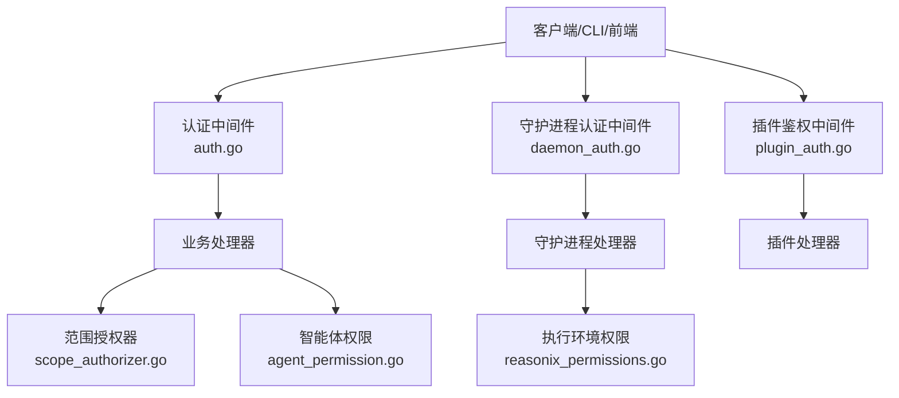
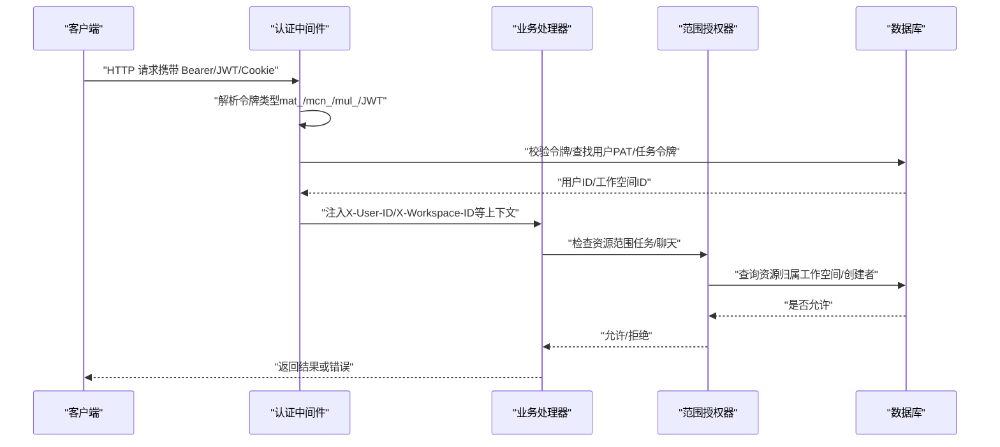
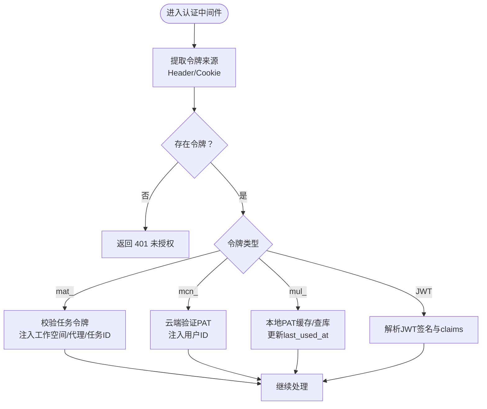
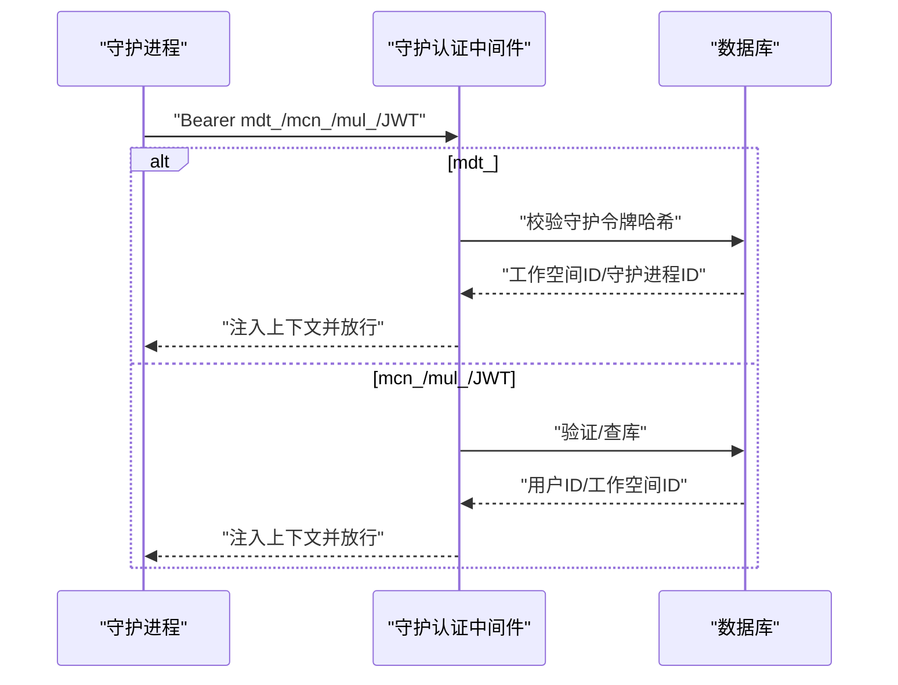
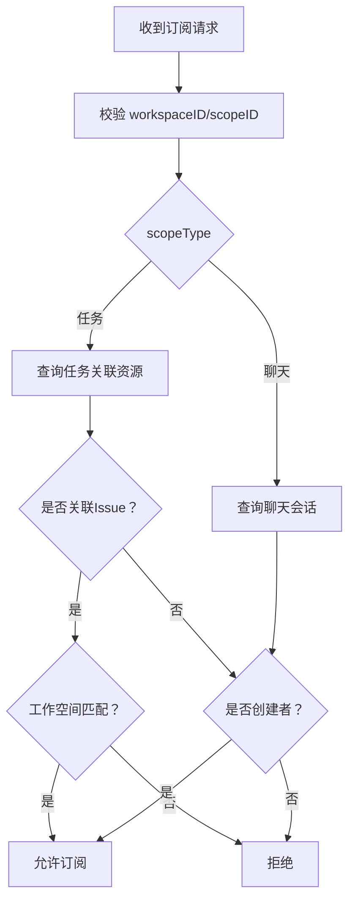
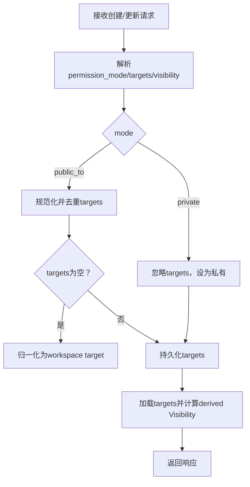
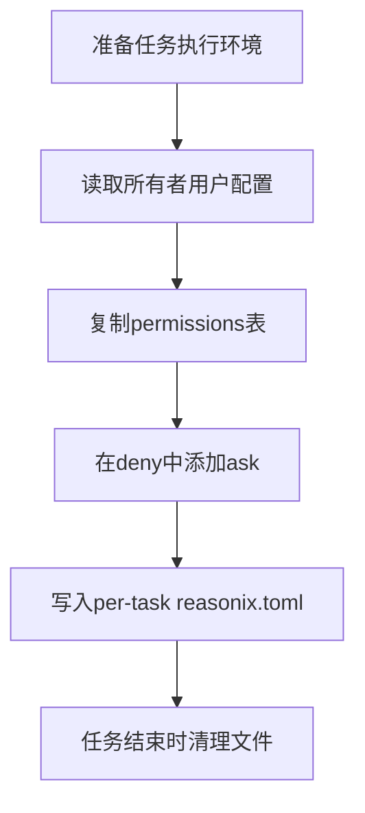
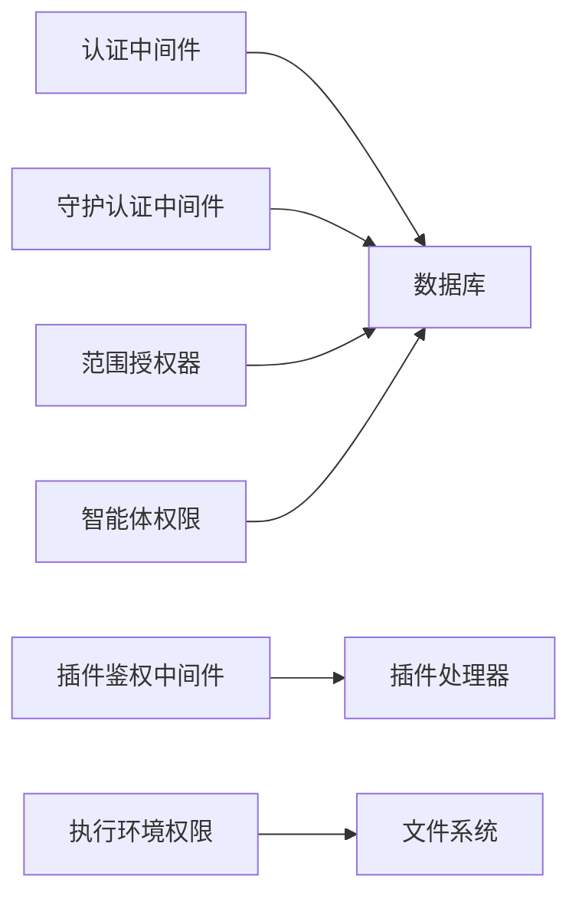

# 权限控制

<cite>
**本文引用的文件**
- [server/internal/handler/agent_permission.go](file://server/internal/handler/agent_permission.go)
- [server/internal/middleware/auth.go](file://server/internal/middleware/auth.go)
- [server/internal/middleware/daemon_auth.go](file://server/internal/middleware/daemon_auth.go)
- [server/internal/middleware/plugin_auth.go](file://server/internal/middleware/plugin_auth.go)
- [server/cmd/server/scope_authorizer.go](file://server/cmd/server/scope_authorizer.go)
- [server/internal/daemon/execenv/reasonix_permissions.go](file://server/internal/daemon/execenv/reasonix_permissions.go)
</cite>

## 目录
1. [简介](#简介)
2. [项目结构](#项目结构)
3. [核心组件](#核心组件)
4. [架构总览](#架构总览)
5. [详细组件分析](#详细组件分析)
6. [依赖关系分析](#依赖关系分析)
7. [性能考虑](#性能考虑)
8. [故障排查指南](#故障排查指南)
9. [结论](#结论)
10. [附录](#附录)

## 简介
本文件系统性梳理 Multica 的权限控制系统，围绕基于角色的访问控制（RBAC）与资源级授权展开，覆盖用户角色、工作空间角色与资源级权限；详述请求拦截、上下文构建、权限验证与审计日志的执行流程；解释多租户环境下的权限隔离（工作空间边界、数据可见性、操作授权）；并给出动态权限策略（条件判断、时间窗口、IP 白名单、会话管理）的设计建议。文档同时提供权限配置示例、API 鉴权流程与调试方法，重点说明权限继承机制、缓存策略与高可用架构设计。

## 项目结构
后端采用 Go + Chi 路由，认证与鉴权以中间件形式贯穿请求链路：
- 通用认证中间件：统一解析 Bearer/JWT/Cookie，校验 PAT、任务令牌、云节点令牌，注入用户与工作空间上下文。
- 守护进程专用认证中间件：支持 mdt_ 守护令牌与兼容的用户令牌路径，注入守护进程身份与工作空间。
- 插件 API 鉴权：限定仅接受安装/回调令牌前缀，避免与人类 PAT/JWT 混淆。
- 实时范围授权器：对任务与聊天资源的订阅进行工作空间与创建者校验。
- 智能体调用权限：将“私有/公开到”模式与目标列表规范化存储，并兼容历史 visibility 字段。
- 执行环境权限：为无交互任务强制禁用 ask 工具，确保无人值守场景安全。

**图示来源**
- [server/internal/middleware/auth.go:34-267](file://server/internal/middleware/auth.go#L34-L267)
- [server/internal/middleware/daemon_auth.go:62-269](file://server/internal/middleware/daemon_auth.go#L62-L269)
- [server/internal/middleware/plugin_auth.go:10-47](file://server/internal/middleware/plugin_auth.go#L10-L47)
- [server/cmd/server/scope_authorizer.go:23-112](file://server/cmd/server/scope_authorizer.go#L23-L112)
- [server/internal/handler/agent_permission.go:88-186](file://server/internal/handler/agent_permission.go#L88-L186)
- [server/internal/daemon/execenv/reasonix_permissions.go:131-192](file://server/internal/daemon/execenv/reasonix_permissions.go#L131-L192)

**章节来源**
- [server/internal/middleware/auth.go:34-267](file://server/internal/middleware/auth.go#L34-L267)
- [server/internal/middleware/daemon_auth.go:62-269](file://server/internal/middleware/daemon_auth.go#L62-L269)
- [server/internal/middleware/plugin_auth.go:10-47](file://server/internal/middleware/plugin_auth.go#L10-L47)
- [server/cmd/server/scope_authorizer.go:23-112](file://server/cmd/server/scope_authorizer.go#L23-L112)
- [server/internal/handler/agent_permission.go:88-186](file://server/internal/handler/agent_permission.go#L88-L186)
- [server/internal/daemon/execenv/reasonix_permissions.go:131-192](file://server/internal/daemon/execenv/reasonix_permissions.go#L131-L192)

## 核心组件
- 认证中间件（Auth）：统一处理 Bearer/JWT/Cookie，识别任务令牌（mat_）、云节点 PAT（mcn_）、个人访问令牌（mul_）与 JWT，设置 X-User-ID/X-User-Email/X-Actor-Source 等头部，供下游鉴权使用。
- 守护进程认证中间件（DaemonAuth）：优先处理守护令牌（mdt_），回退至 PAT/JWT，注入守护进程工作空间与 ID，便于按工作空间隔离。
- 插件鉴权中间件（PluginBearerOnly）：限定公共 Action API 仅接受 mpi_/mpc_ 前缀令牌，避免与人类凭证混淆。
- 范围授权器（ScopeAuthorizer）：针对实时订阅的任务与聊天资源，校验工作空间归属与创建者权限。
- 智能体调用权限（Agent Permission）：将 permission_mode（private/public_to）与 invocation_targets（workspace/member/team）规范化存储，兼容历史 visibility 字段。
- 执行环境权限（Reasonix Permissions）：为无交互任务写入 per-task 配置文件，禁止 ask 工具，防止无人值守时模型询问人类。

**章节来源**
- [server/internal/middleware/auth.go:34-267](file://server/internal/middleware/auth.go#L34-L267)
- [server/internal/middleware/daemon_auth.go:62-269](file://server/internal/middleware/daemon_auth.go#L62-L269)
- [server/internal/middleware/plugin_auth.go:10-47](file://server/internal/middleware/plugin_auth.go#L10-L47)
- [server/cmd/server/scope_authorizer.go:23-112](file://server/cmd/server/scope_authorizer.go#L23-L112)
- [server/internal/handler/agent_permission.go:88-186](file://server/internal/handler/agent_permission.go#L88-L186)
- [server/internal/daemon/execenv/reasonix_permissions.go:131-192](file://server/internal/daemon/execenv/reasonix_permissions.go#L131-L192)

## 架构总览
下图展示从请求进入、认证、鉴权到资源访问的完整链路，以及多租户隔离的关键点。

**图示来源**
- [server/internal/middleware/auth.go:34-267](file://server/internal/middleware/auth.go#L34-L267)
- [server/cmd/server/scope_authorizer.go:47-112](file://server/cmd/server/scope_authorizer.go#L47-L112)

## 详细组件分析

### 认证中间件（Auth）
- 令牌优先级与来源：Authorization Bearer > multica_auth Cookie（状态变更需 CSRF）。
- 令牌类型分支：
  - 任务令牌 mat_：校验任务令牌哈希，注入 X-Agent-ID/X-Task-ID/X-Workspace-ID，标记 X-Actor-Source=task_token。
  - 云节点 PAT mcn_：委托云端验证，注入 X-User-ID，标记 X-Actor-Source=cloud_pat。
  - 个人访问令牌 mul_：本地缓存命中则跳过 DB，未命中则查库并更新 last_used_at，设置 TTL 与缓存。
  - JWT：解析签名与 claims，注入 X-User-ID/X-User-Email。
- 临时禁用用户拦截：在多个分支中统一检查并拒绝。

**图示来源**
- [server/internal/middleware/auth.go:34-267](file://server/internal/middleware/auth.go#L34-L267)

**章节来源**
- [server/internal/middleware/auth.go:34-267](file://server/internal/middleware/auth.go#L34-L267)

### 守护进程认证中间件（DaemonAuth）
- 优先处理守护令牌 mdt_，缓存命中直接注入工作空间与守护进程 ID。
- 回退路径：mcn_（云端 PAT）、mul_（PAT 缓存/查库）、JWT。
- 与通用认证保持一致的 X-Actor-Source 标记，便于下游守卫区分机器与人类凭证。

**图示来源**
- [server/internal/middleware/daemon_auth.go:62-269](file://server/internal/middleware/daemon_auth.go#L62-L269)

**章节来源**
- [server/internal/middleware/daemon_auth.go:62-269](file://server/internal/middleware/daemon_auth.go#L62-L269)

### 插件鉴权中间件（PluginBearerOnly）
- 仅接受 mpi_/mpc_ 前缀的插件令牌，避免与人类 PAT/JWT 混用。
- 前置路由匹配，实际令牌有效性由后续处理器校验。

**章节来源**
- [server/internal/middleware/plugin_auth.go:10-47](file://server/internal/middleware/plugin_auth.go#L10-L47)

### 范围授权器（ScopeAuthorizer）
- 针对实时订阅的 scopeType：
  - 任务（ScopeTask）：若关联 Issue，则同工作空间成员可订阅；若关联 ChatSession，仅创建者可订阅。
  - 聊天（ScopeChat）：仅创建者可订阅，防止跨成员泄露。
- 资源不存在视为合法拒绝（404 语义），其他错误传播以便上层区分故障与权限拒绝。

**图示来源**
- [server/cmd/server/scope_authorizer.go:47-112](file://server/cmd/server/scope_authorizer.go#L47-L112)

**章节来源**
- [server/cmd/server/scope_authorizer.go:47-112](file://server/cmd/server/scope_authorizer.go#L47-L112)

### 智能体调用权限（Agent Permission）
- 权限模型：
  - permission_mode：private（默认不可被调用）或 public_to（允许指定目标）。
  - invocation_targets：workspace（整个工作空间）、member（特定用户）、team（团队占位符）。
- 输入解析与兼容性：
  - 若仅提供 legacy visibility："private"→private；"workspace"→public_to+workspace target。
  - public_to 空目标集会被归一化为 single workspace target，保证前端渲染一致。
- 响应增强：加载 targets 并计算 derived Visibility，保持新旧视图一致。
- 更新检测：比较当前与期望的目标集合，避免非拥有者的无意义降级/升级尝试。

**图示来源**
- [server/internal/handler/agent_permission.go:88-186](file://server/internal/handler/agent_permission.go#L88-L186)
- [server/internal/handler/agent_permission.go:31-61](file://server/internal/handler/agent_permission.go#L31-L61)

**章节来源**
- [server/internal/handler/agent_permission.go:31-61](file://server/internal/handler/agent_permission.go#L31-L61)
- [server/internal/handler/agent_permission.go:88-186](file://server/internal/handler/agent_permission.go#L88-L186)
- [server/internal/handler/agent_permission.go:189-215](file://server/internal/handler/agent_permission.go#L189-L215)
- [server/internal/handler/agent_permission.go:217-282](file://server/internal/handler/agent_permission.go#L217-L282)

### 执行环境权限（Reasonix Permissions）
- 为每个任务生成 per-task reasonix.toml，复制所有者用户配置的 permissions，并在 deny 列表中加入 ask 工具。
- 若无法读取或解析用户配置，记录警告但不覆盖仓库自带文件，确保任务仍可运行但 ask 仍受后端拒绝逻辑保护。
- 通过 sidecar 清理机制删除生成的配置文件，避免污染运行时环境。

**图示来源**
- [server/internal/daemon/execenv/reasonix_permissions.go:131-192](file://server/internal/daemon/execenv/reasonix_permissions.go#L131-L192)

**章节来源**
- [server/internal/daemon/execenv/reasonix_permissions.go:131-192](file://server/internal/daemon/execenv/reasonix_permissions.go#L131-L192)

## 依赖关系分析
- 中间件层依赖：
  - auth.go 依赖 JWT 库、数据库 Queries、PAT 缓存与云端 PAT 验证器。
  - daemon_auth.go 依赖守护令牌缓存、PAT 缓存与云端 PAT 验证器。
  - plugin_auth.go 依赖公共 API 的错误输出与令牌前缀判定。
- 业务层依赖：
  - scope_authorizer.go 依赖数据库 Queries 获取任务与聊天会话信息。
  - agent_permission.go 依赖数据库 Queries 读写智能体调用目标。
  - reasonix_permissions.go 依赖文件系统与 TOML 编解码。

**图示来源**
- [server/internal/middleware/auth.go:34-267](file://server/internal/middleware/auth.go#L34-L267)
- [server/internal/middleware/daemon_auth.go:62-269](file://server/internal/middleware/daemon_auth.go#L62-L269)
- [server/internal/middleware/plugin_auth.go:10-47](file://server/internal/middleware/plugin_auth.go#L10-L47)
- [server/cmd/server/scope_authorizer.go:47-112](file://server/cmd/server/scope_authorizer.go#L47-L112)
- [server/internal/handler/agent_permission.go:88-186](file://server/internal/handler/agent_permission.go#L88-L186)
- [server/internal/daemon/execenv/reasonix_permissions.go:131-192](file://server/internal/daemon/execenv/reasonix_permissions.go#L131-L192)

**章节来源**
- [server/internal/middleware/auth.go:34-267](file://server/internal/middleware/auth.go#L34-L267)
- [server/internal/middleware/daemon_auth.go:62-269](file://server/internal/middleware/daemon_auth.go#L62-L269)
- [server/internal/middleware/plugin_auth.go:10-47](file://server/internal/middleware/plugin_auth.go#L10-L47)
- [server/cmd/server/scope_authorizer.go:47-112](file://server/cmd/server/scope_authorizer.go#L47-L112)
- [server/internal/handler/agent_permission.go:88-186](file://server/internal/handler/agent_permission.go#L88-L186)
- [server/internal/daemon/execenv/reasonix_permissions.go:131-192](file://server/internal/daemon/execenv/reasonix_permissions.go#L131-L192)

## 性能考虑
- 令牌缓存：
  - PAT 缓存：TTL 内命中跳过 DB 与 last_used_at 更新，降低热点令牌压力。
  - 守护令牌缓存：mdt_ 命中直接注入上下文，减少 DB 查询。
- 云端验证：
  - mcn_ 令牌失败时返回 503，便于客户端重试；配置缺失时严格拒绝，避免降级风险。
- 资源查询：
  - 范围授权器对不存在的资源返回“合法拒绝”，避免将数据库故障误判为权限拒绝。
- 文件 I/O：
  - 执行环境权限写入 per-task 配置文件，若冲突或不可读则记录警告并继续，避免阻塞任务启动。

[本节为通用性能指导，无需具体文件引用]

## 故障排查指南
- 常见错误码与原因：
  - 401 未授权：缺少令牌、令牌无效、JWT 签名无效、云端验证失败。
  - 403 禁止：CSRF 校验失败、临时禁用用户、范围授权拒绝（非工作空间或非创建者）。
  - 503 服务不可用：云端 PAT 验证器不可达。
- 排查步骤：
  - 确认令牌类型与前缀（mat_/mcn_/mul_/mdt_/mpi_/mpc_）。
  - 检查中间件日志中的认证路径标签（task_token/cloud_pat/pat/jwt）。
  - 对于范围授权问题，核对工作空间 ID 与资源创建者。
  - 对于执行环境问题，查看 per-task 配置文件是否存在及 ask 工具是否被拒绝。

**章节来源**
- [server/internal/middleware/auth.go:34-267](file://server/internal/middleware/auth.go#L34-L267)
- [server/internal/middleware/daemon_auth.go:62-269](file://server/internal/middleware/daemon_auth.go#L62-L269)
- [server/cmd/server/scope_authorizer.go:47-112](file://server/cmd/server/scope_authorizer.go#L47-L112)
- [server/internal/daemon/execenv/reasonix_permissions.go:131-192](file://server/internal/daemon/execenv/reasonix_permissions.go#L131-L192)

## 结论
Multica 的权限系统通过分层中间件与细粒度范围授权实现强隔离与高可用：
- 认证层统一令牌解析与注入，保障上下文一致性。
- 范围授权层确保工作空间边界与创建者约束不被绕过。
- 智能体调用权限提供灵活的“私有/公开到”模型，兼容历史字段。
- 执行环境权限在无交互任务中强制最小权限，防止模型询问人类。
结合缓存策略与云端验证容错，系统在多租户环境下具备良好性能与可靠性。

[本节为总结性内容，无需具体文件引用]

## 附录

### 权限配置示例（概念性）
- 智能体调用权限：
  - 私有：仅拥有者可调用。
  - 公开到工作空间：工作空间内所有成员可调用。
  - 公开到成员/团队：指定用户或团队可调用。
- 实时订阅权限：
  - 任务：同工作空间成员可订阅（Issue 任务），或仅创建者可订阅（Chat 任务）。
  - 聊天：仅创建者可订阅。
- 执行环境权限：
  - 禁止 ask 工具，确保无人值守任务安全。

[本节为概念性示例，无需具体文件引用]

### API 调用鉴权流程（概念性）
- 浏览器/客户端：
  - 携带 Bearer Token 或 Cookie（状态变更需 CSRF）。
  - 中间件解析令牌并注入用户上下文。
- 守护进程：
  - 使用 mdt_ 令牌或回退到 PAT/JWT。
  - 注入工作空间与守护进程 ID。
- 插件：
  - 仅接受 mpi_/mpc_ 前缀令牌。

[本节为概念性流程，无需具体文件引用]

### 权限调试工具使用方法（概念性）
- 启用详细日志：关注认证路径标签与错误消息。
- 检查令牌缓存：观察 PAT/守护令牌命中情况。
- 验证范围授权：核对工作空间 ID 与资源创建者。
- 检查执行环境：确认 per-task 配置文件是否正确生成与清理。

[本节为概念性指导，无需具体文件引用]