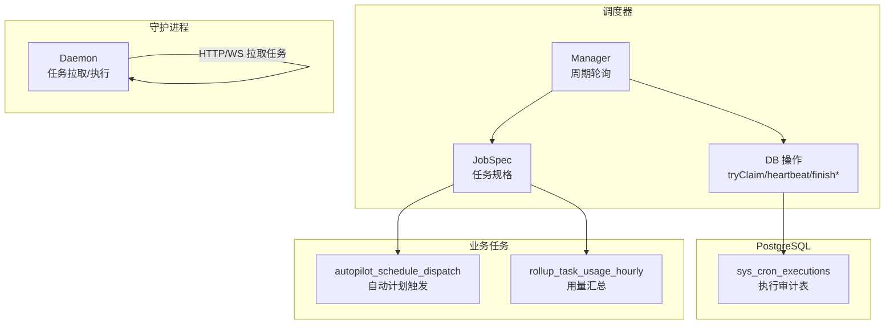
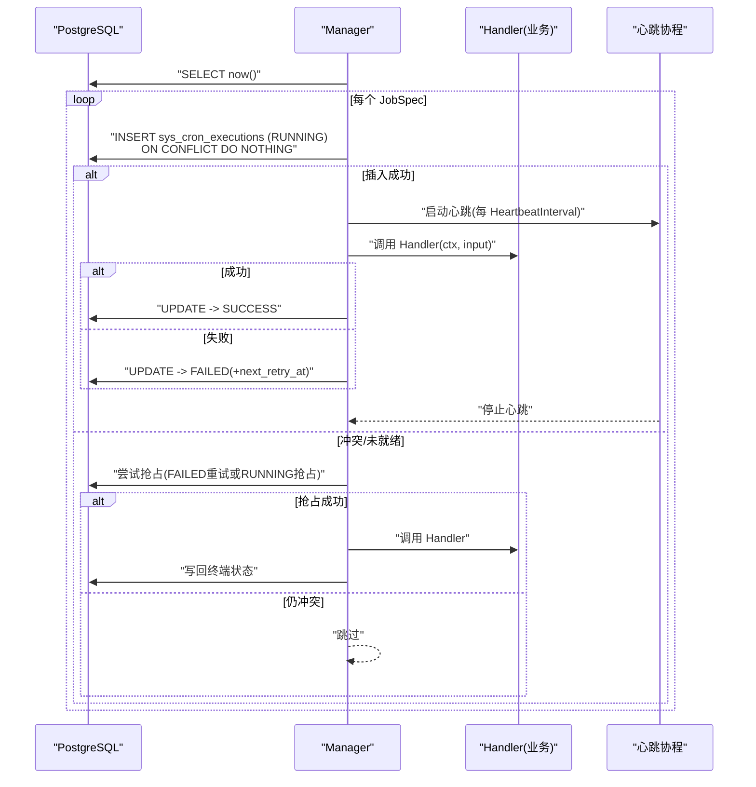
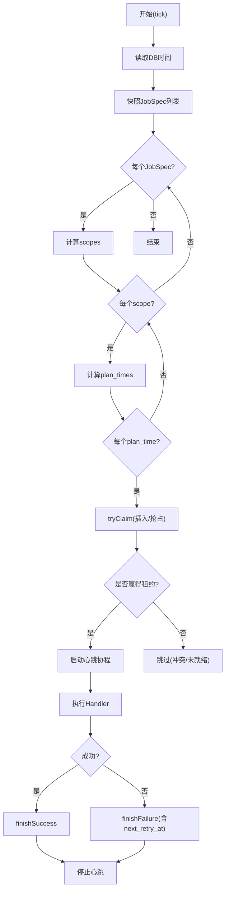
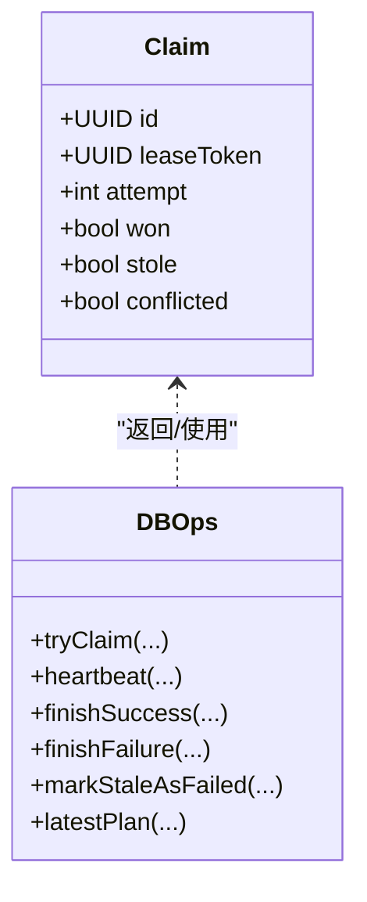
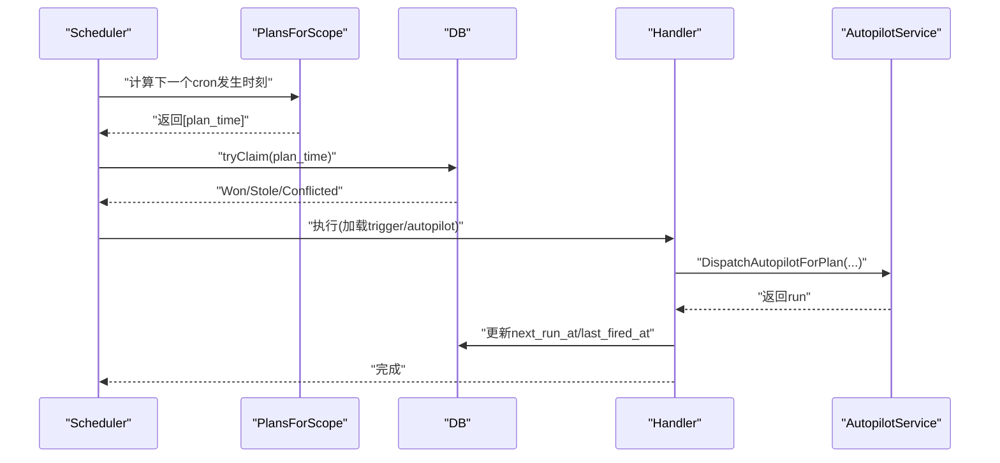
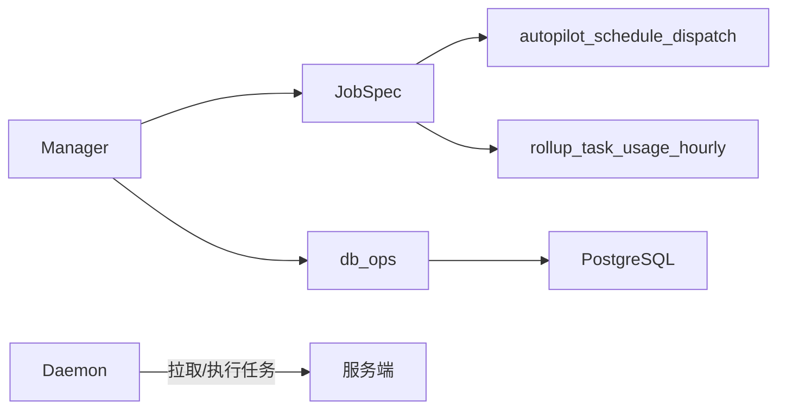

# 后台任务与调度器

<cite>
**本文引用的文件**
- [manager.go](file://server/internal/scheduler/manager.go)
- [spec.go](file://server/internal/scheduler/spec.go)
- [db_ops.go](file://server/internal/scheduler/db_ops.go)
- [jobs_autopilot.go](file://server/internal/scheduler/jobs_autopilot.go)
- [jobs_task_usage.go](file://server/internal/scheduler/jobs_task_usage.go)
- [daemon.go](file://server/internal/daemon/daemon.go)
</cite>

## 目录
1. [简介](#简介)
2. [项目结构](#项目结构)
3. [核心组件](#核心组件)
4. [架构总览](#架构总览)
5. [详细组件分析](#详细组件分析)
6. [依赖关系分析](#依赖关系分析)
7. [性能与高并发策略](#性能与高并发策略)
8. [监控与告警](#监控与告警)
9. [故障恢复与重试机制](#故障恢复与重试机制)
10. [自定义任务开发指南](#自定义任务开发指南)
11. [排错指南](#排错指南)
12. [结论](#结论)

## 简介
本文件面向 Multica 的后台任务与分布式调度系统，系统性说明基于 PostgreSQL 的可靠调度、任务重试与故障恢复、以及多类后台任务的实现方式。重点覆盖：
- 分布式任务调度器的设计与实现（锁、审计、心跳、抢占）
- 定时任务、异步处理、数据同步、清理任务等典型场景
- 执行状态跟踪、指标收集、失败通知
- 高并发下的任务分配、负载均衡与资源限制
- 自定义任务开发与调试技巧

## 项目结构
调度子系统位于 server/internal/scheduler，提供以数据库为协调中心的分布式调度能力；守护进程位于 server/internal/daemon，负责拉取并执行智能体任务。二者通过服务层与数据库协作，形成“计划—抢占—执行—审计”的闭环。

图表来源
- [manager.go:93-136](file://server/internal/scheduler/manager.go#L93-L136)
- [db_ops.go:50-163](file://server/internal/scheduler/db_ops.go#L50-L163)
- [jobs_autopilot.go:89-121](file://server/internal/scheduler/jobs_autopilot.go#L89-L121)
- [jobs_task_usage.go:36-56](file://server/internal/scheduler/jobs_task_usage.go#L36-L56)

章节来源
- [manager.go:93-136](file://server/internal/scheduler/manager.go#L93-L136)
- [spec.go:99-192](file://server/internal/scheduler/spec.go#L99-L192)
- [db_ops.go:50-163](file://server/internal/scheduler/db_ops.go#L50-L163)

## 核心组件
- Manager：进程内调度器，按 TickInterval 周期性扫描已注册 JobSpec，计算待执行 plan_time 并尝试抢占执行。
- JobSpec：任务规格定义，包含 Cadence、CatchUpMode、RunTimeout、StaleTimeout、HeartbeatInterval、MaxAttempts、RetryBackoff、Scopes、PlansForScope、Handler 等。
- DB 操作：基于 sys_cron_executions 表的 tryClaim、heartbeat、finishSuccess、finishFailure、markStaleAsFailed 等原语，实现分布式锁、心跳续租、终端状态写入与过期回收。
- 内置任务：
  - autopilot_schedule_dispatch：基于 cron 表达式与时间区的自动计划触发任务。
  - rollup_task_usage_hourly：小时级用量汇总任务，使用 SQL 函数与内部 advisory lock 保证幂等与互斥。

章节来源
- [manager.go:15-62](file://server/internal/scheduler/manager.go#L15-L62)
- [spec.go:99-192](file://server/internal/scheduler/spec.go#L99-L192)
- [db_ops.go:50-163](file://server/internal/scheduler/db_ops.go#L50-L163)
- [jobs_autopilot.go:89-121](file://server/internal/scheduler/jobs_autopilot.go#L89-L121)
- [jobs_task_usage.go:36-56](file://server/internal/scheduler/jobs_task_usage.go#L36-L56)

## 架构总览
调度器以 PostgreSQL 作为分布式协调中心，所有实例共享同一张执行审计表。每个 tick 会：
- 读取 DB 当前时间，避免时钟漂移导致的不一致
- 对每个 JobSpec 计算 scope 列表与 plan_time 集合
- 尝试插入 RUNNING 行（唯一键约束确保单实例独占）
- 启动心跳协程，定期续租 stale_after
- 执行业务 Handler，成功或失败后写回终端状态
- 若运行中长时间无心跳且不允许抢占，则标记 FAILED；允许抢占时由其他实例抢占并重试

图表来源
- [manager.go:124-189](file://server/internal/scheduler/manager.go#L124-L189)
- [db_ops.go:50-163](file://server/internal/scheduler/db_ops.go#L50-L163)
- [db_ops.go:191-220](file://server/internal/scheduler/db_ops.go#L191-L220)
- [db_ops.go:222-303](file://server/internal/scheduler/db_ops.go#L222-L303)

## 详细组件分析

### 调度管理器 Manager
- 生命周期：NewManager 初始化连接池、RunnerID、TickInterval、Logger；Run 启动定时器循环；RunOnce 执行一次全量 tick。
- 任务发现：snapshot 获取已注册 JobSpec 列表，避免持锁遍历。
- 过期回收：每次 tick 先标记超时的 RUNNING 行为 FAILED（当 AllowStaleReentry=false），防止僵尸锁长期占用。
- 计划计算：plansForTick 根据 CatchUpMode 决定是仅追最新还是回放历史；支持 PlansForScope 钩子替代固定 Cadence。
- 执行流程：processPlan 尝试抢占 lease，runClaimed 启动心跳并执行 Handler，最终写回 SUCCESS/FAILED。
- 错误分类：classifyError 将上下文超时、取消、租约丢失、panic 等映射为 error_code，便于观测与告警。

图表来源
- [manager.go:93-189](file://server/internal/scheduler/manager.go#L93-L189)
- [manager.go:287-430](file://server/internal/scheduler/manager.go#L287-L430)
- [db_ops.go:50-163](file://server/internal/scheduler/db_ops.go#L50-L163)

章节来源
- [manager.go:93-189](file://server/internal/scheduler/manager.go#L93-L189)
- [manager.go:287-430](file://server/internal/scheduler/manager.go#L287-L430)
- [manager.go:432-489](file://server/internal/scheduler/manager.go#L432-L489)

### 任务规格 JobSpec
- 关键参数：
  - Cadence/ScheduleDelay/CatchUpMode/CatchUpWindow/MaxPlansPerTick：控制计划粒度、延迟、追赶策略与上限。
  - RunTimeout/StaleTimeout/HeartbeatInterval：执行超时、心跳续租窗口与频率。
  - MaxAttempts/RetryBackoff：最大尝试次数与退避策略。
  - Scopes/PlansForScope：作用域与计划生成钩子。
  - Handler：业务逻辑入口。
- 校验：validate 强制必填项与合理范围（如 StaleTimeout > RunTimeout）。
- 辅助：FloorPlan 对齐到 Cadence 边界；retryDelay 计算下次重试等待时长。

章节来源
- [spec.go:23-63](file://server/internal/scheduler/spec.go#L23-L63)
- [spec.go:99-192](file://server/internal/scheduler/spec.go#L99-L192)
- [spec.go:204-262](file://server/internal/scheduler/spec.go#L204-L262)

### 数据库原语 db_ops
- tryClaim：优先 INSERT 新 RUNNING 行（唯一键保障单实例），冲突时尝试从 FAILED 重试或抢占过期 RUNNING；返回 Won/Stole/Conflicted 三种结果。
- markStaleAsFailed：将超时的 RUNNING 转为 FAILED（error_code=stale_timeout），用于非可重入任务的安全回收。
- heartbeat：续租 stale_after，若影响行数为 0 表示租约丢失（ErrLeaseLost）。
- finishSuccess/finishFailure：写回终端状态，携带 duration_ms、rows_affected、result JSONB、error_code/error_msg、next_retry_at。
- latestPlan：读取最近一条执行记录，供 catch-up 规划与重试判断。

图表来源
- [db_ops.go:39-48](file://server/internal/scheduler/db_ops.go#L39-L48)
- [db_ops.go:50-163](file://server/internal/scheduler/db_ops.go#L50-L163)
- [db_ops.go:165-220](file://server/internal/scheduler/db_ops.go#L165-L220)
- [db_ops.go:222-303](file://server/internal/scheduler/db_ops.go#L222-L303)
- [db_ops.go:324-403](file://server/internal/scheduler/db_ops.go#L324-L403)

章节来源
- [db_ops.go:50-163](file://server/internal/scheduler/db_ops.go#L50-L163)
- [db_ops.go:165-220](file://server/internal/scheduler/db_ops.go#L165-L220)
- [db_ops.go:222-303](file://server/internal/scheduler/db_ops.go#L222-L303)
- [db_ops.go:324-403](file://server/internal/scheduler/db_ops.go#L324-L403)

### 内置任务：自动计划触发 autopilot_schedule_dispatch
- 目标：将基于 cron 表达式的自动计划触发迁移到统一调度器，替换旧 goroutine。
- 设计要点：
  - 每个启用的 schedule trigger 为一个 scope（kind=autopilot_trigger，id=trigger UUID）。
  - plan_time 为 UTC 规范化的 cron 发生时刻；PlansForScope 仅在 (lastPlan, now] 范围内枚举，并折叠为最近一次。
  - 允许抢占（AllowStaleReentry=true），结合 handler 幂等性避免重复执行。
  - 捕获窗口 CatchUpWindow=24h，lateness 保护避免过晚触发。
- 执行：handler 加载 trigger 与 autopilot，调用服务层派发，更新 next_run_at 与 last_fired_at。

图表来源
- [jobs_autopilot.go:89-121](file://server/internal/scheduler/jobs_autopilot.go#L89-L121)
- [jobs_autopilot.go:220-317](file://server/internal/scheduler/jobs_autopilot.go#L220-L317)
- [jobs_autopilot.go:323-412](file://server/internal/scheduler/jobs_autopilot.go#L323-L412)

章节来源
- [jobs_autopilot.go:89-121](file://server/internal/scheduler/jobs_autopilot.go#L89-L121)
- [jobs_autopilot.go:220-317](file://server/internal/scheduler/jobs_autopilot.go#L220-L317)
- [jobs_autopilot.go:323-412](file://server/internal/scheduler/jobs_autopilot.go#L323-L412)

### 内置任务：用量汇总 rollup_task_usage_hourly
- 目标：小时级任务用量汇总，使用 SQL 函数 rollup_task_usage_hourly，内部持有 advisory lock 保证互斥。
- 配置：Cadence=5m，ScheduleDelay=5m，CatchUpMode=latest_only，RunTimeout=25m，StaleTimeout=30m，MaxAttempts=3，允许抢占。
- 执行：在调用前后读取 watermark，记录是否推进了水位；短任务末尾补发一次心跳保持 stale_after 新鲜。

章节来源
- [jobs_task_usage.go:15-56](file://server/internal/scheduler/jobs_task_usage.go#L15-L56)
- [jobs_task_usage.go:58-121](file://server/internal/scheduler/jobs_task_usage.go#L58-L121)

### 守护进程 Daemon（任务执行侧）
- 职责：从服务端拉取任务、准备执行环境、启动智能体进程、汇报结果。
- 关键点：
  - 任务准备阶段有独立超时（defaultTaskPrepareTimeout），与 provider 执行超时分离。
  - 工作区与仓库采用 worktree 隔离，复用 PriorWorkDir 提升效率。
  - 本地路径锁（LocalPathLocker）串行化访问同一磁盘路径的任务，避免竞争。
  - 健康检查与指标上报，便于运维观察。

章节来源
- [daemon.go:69-99](file://server/internal/daemon/daemon.go#L69-L99)
- [daemon.go:163-179](file://server/internal/daemon/daemon.go#L163-L179)
- [daemon.go:373-626](file://server/internal/daemon/daemon.go#L373-L626)

## 依赖关系分析
- Manager 依赖 JobSpec 提供的 Scopes/PlansForScope/Handler，并通过 db_ops 与 PostgreSQL 交互。
- 内置任务通过 JobSpec 注册到 Manager，利用统一的抢占、心跳、重试与审计机制。
- Daemon 与服务端交互拉取任务，与调度器解耦但共同构成“计划—执行—审计”闭环。

图表来源
- [manager.go:93-189](file://server/internal/scheduler/manager.go#L93-L189)
- [spec.go:99-192](file://server/internal/scheduler/spec.go#L99-L192)
- [jobs_autopilot.go:89-121](file://server/internal/scheduler/jobs_autopilot.go#L89-L121)
- [jobs_task_usage.go:36-56](file://server/internal/scheduler/jobs_task_usage.go#L36-L56)
- [db_ops.go:50-163](file://server/internal/scheduler/db_ops.go#L50-L163)

章节来源
- [manager.go:93-189](file://server/internal/scheduler/manager.go#L93-L189)
- [spec.go:99-192](file://server/internal/scheduler/spec.go#L99-L192)
- [db_ops.go:50-163](file://server/internal/scheduler/db_ops.go#L50-L163)

## 性能与高并发策略
- 分布式锁与幂等：
  - 通过 sys_cron_executions 的唯一键 (job_name, scope_kind, scope_id, plan_time) 保证同一计划仅一个实例执行。
  - 失败重试与抢占均在同一语句中评估，减少竞争开销。
- 心跳与租约：
  - 心跳间隔小于 StaleTimeout，确保长任务不被误判为过期。
  - 允许抢占时，其他实例可接管过期租约；禁止抢占时直接标记 FAILED，需人工修复。
- 追赶策略：
  - latest_only：适合带水位的聚合任务，只追最新，避免回放风暴。
  - every_plan：按 Cadence 回放历史，受 CatchUpWindow 与 MaxPlansPerTick 限制，防止雪崩。
- 资源限制：
  - RunTimeout 限制单次执行时长。
  - MaxPlansPerTick 限制单次 tick 的最大计划数。
  - Daemon 的 LocalPathLocker 串行化同路径任务，避免磁盘竞争。
- 负载均衡：
  - 多实例共享 DB，天然水平扩展；通过 ScopeProvider 将全局任务拆分为多个 scope（如 per-trigger）实现并行。

章节来源
- [spec.go:23-63](file://server/internal/scheduler/spec.go#L23-L63)
- [spec.go:118-192](file://server/internal/scheduler/spec.go#L118-L192)
- [db_ops.go:50-163](file://server/internal/scheduler/db_ops.go#L50-L163)
- [jobs_autopilot.go:89-121](file://server/internal/scheduler/jobs_autopilot.go#L89-L121)
- [jobs_task_usage.go:36-56](file://server/internal/scheduler/jobs_task_usage.go#L36-L56)
- [daemon.go:594-599](file://server/internal/daemon/daemon.go#L594-L599)

## 监控与告警
- 执行状态跟踪：
  - sys_cron_executions 记录每条执行的 status、attempt、duration_ms、rows_affected、result、error_code、error_msg、next_retry_at。
  - classifyError 将常见错误归类为 run_timeout、canceled、lease_lost、handler_panic、handler_error，便于统计与告警。
- 性能指标：
  - 可通过 duration_ms、rows_affected、watermark_before/after（汇总任务）等字段评估吞吐与进度。
  - Daemon 暴露健康端点与运行时指标（如 activeTasks、runningTasks），便于观察负载。
- 失败通知：
  - 失败行带有 error_code 与 error_msg，结合 next_retry_at 可区分瞬时错误与需要人工介入的错误。
  - 对于非可重入任务，stale_timeout 标记的 FAILED 建议设置告警阈值，及时人工干预。

章节来源
- [manager.go:464-489](file://server/internal/scheduler/manager.go#L464-L489)
- [db_ops.go:222-303](file://server/internal/scheduler/db_ops.go#L222-L303)
- [jobs_task_usage.go:58-121](file://server/internal/scheduler/jobs_task_usage.go#L58-L121)
- [daemon.go:544-555](file://server/internal/daemon/daemon.go#L544-L555)

## 故障恢复与重试机制
- 过期回收：
  - 每次 tick 先标记超时的 RUNNING 为 FAILED（当 AllowStaleReentry=false），避免僵尸锁。
- 抢占与重试：
  - tryClaim 支持从 FAILED 重试（满足 attempts < max_attempts 且 next_retry_at <= now）与抢占过期 RUNNING。
  - 心跳期间若检测到 ErrLeaseLost，应立即停止并退出。
- 幂等性：
  - autopilot 派发接口对 (trigger_id, planned_at) 幂等，结合唯一键避免重复执行。
  - 汇总任务通过 SQL 内部 advisory lock 保证互斥。
- 恢复策略：
  - latest_only：依赖业务水位（如 task_usage_hourly_rollup_state.watermark_at）恢复缺失数据。
  - every_plan：按 Cadence 回放，受 CatchUpWindow 限制，避免无限回放。

章节来源
- [manager.go:138-189](file://server/internal/scheduler/manager.go#L138-L189)
- [db_ops.go:50-163](file://server/internal/scheduler/db_ops.go#L50-L163)
- [db_ops.go:165-220](file://server/internal/scheduler/db_ops.go#L165-L220)
- [jobs_autopilot.go:220-317](file://server/internal/scheduler/jobs_autopilot.go#L220-L317)
- [jobs_task_usage.go:58-121](file://server/internal/scheduler/jobs_task_usage.go#L58-L121)

## 自定义任务开发指南
- 注册任务：
  - 定义 JobSpec，设置 Name、Cadence（或 PlansForScope）、Scopes、Handler 等。
  - 通过 Manager.Register 注册，并在 Run 前完成。
- 计划生成：
  - 固定 Cadence：使用 Cadence 与 CatchUpMode 组合，配合 ScheduleDelay 与 CatchUpWindow。
  - 动态计划：实现 PlansForScope 钩子，基于业务规则（如 cron、事件）计算 plan_time。
- 执行逻辑：
  - Handler 应幂等，避免重复执行造成副作用。
  - 长任务需定期调用 Heartbeat，避免被判定为过期。
  - 返回 HandlerResult 中的 RowsAffected 与 Result（小体积 JSONB），大结果请走日志。
- 重试与超时：
  - 设置 MaxAttempts 与 RetryBackoff，合理配置 RunTimeout 与 StaleTimeout（StaleTimeout > RunTimeout）。
  - 对非幂等任务设置 AllowStaleReentry=false，避免抢占导致重复执行。
- 调试技巧：
  - 通过 sys_cron_executions 查询最近执行记录，关注 status、error_code、duration_ms、next_retry_at。
  - 使用 RunnerID 与 execution_id 关联日志，定位具体实例与执行。
  - 单元测试中可注入 mock 的 Service 与 DB，验证计划与执行路径。

章节来源
- [spec.go:99-192](file://server/internal/scheduler/spec.go#L99-L192)
- [spec.go:204-262](file://server/internal/scheduler/spec.go#L204-L262)
- [db_ops.go:222-303](file://server/internal/scheduler/db_ops.go#L222-L303)
- [manager.go:64-79](file://server/internal/scheduler/manager.go#L64-L79)

## 排错指南
- 常见问题：
  - 任务不执行：检查 Scopes 是否正确返回；确认 CatchUpMode 与 CatchUpWindow 是否过滤掉计划；查看是否有 Conflicted 冲突。
  - 任务频繁失败：查看 error_code 与 error_msg；确认是否因超时（run_timeout）或租约丢失（lease_lost）；调整 MaxAttempts 与 RetryBackoff。
  - 僵尸锁：若 AllowStaleReentry=false，超时会标记 FAILED；若为 true，可能被抢占；检查心跳是否正常。
  - 重复执行：确认 Handler 是否幂等；检查唯一键约束与抢占逻辑。
- 排查步骤：
  - 查询 sys_cron_executions 最近记录，关注 status、attempt、next_retry_at。
  - 核对 JobSpec 配置（Cadence、ScheduleDelay、CatchUpMode、MaxPlansPerTick）。
  - 检查心跳间隔与 StaleTimeout 的关系，确保 HeartbeatInterval < StaleTimeout。
  - 对动态计划任务，验证 PlansForScope 返回值是否符合预期。

章节来源
- [manager.go:138-189](file://server/internal/scheduler/manager.go#L138-L189)
- [db_ops.go:50-163](file://server/internal/scheduler/db_ops.go#L50-L163)
- [db_ops.go:165-220](file://server/internal/scheduler/db_ops.go#L165-L220)
- [spec.go:204-262](file://server/internal/scheduler/spec.go#L204-L262)

## 结论
Multica 的后台任务与调度系统以 PostgreSQL 为核心，实现了可靠的分布式锁、心跳续租、失败重试与故障恢复。通过 JobSpec 抽象与 Manager 编排，支持多种任务类型（定时、异步、汇总、清理等），并提供完善的审计与可观测性。在高并发场景下，通过唯一键约束、追赶策略与资源限制，确保系统稳定与高效。开发者可基于 JobSpec 快速实现自定义任务，并利用现有机制获得一致的可靠性与可维护性。