# 后端架构

<cite>
**本文引用的文件**
- [server/go.mod](file://server/go.mod)
- [server/cmd/multica/main.go](file://server/cmd/multica/main.go)
- [server/internal/handler/handler.go](file://server/internal/handler/handler.go)
- [server/internal/middleware/auth.go](file://server/internal/middleware/auth.go)
- [server/sqlc.yaml](file://server/sqlc.yaml)
- [CLAUDE.md](file://CLAUDE.md)
- [apps/docs/content/docs/developers/architecture.zh.mdx](file://apps/docs/content/docs/developers/architecture.zh.mdx)
- [server/internal/daemon/execenv/execenv.go](file://server/internal/daemon/execenv/execenv.go)
- [server/internal/daemon/wsrpc.go](file://server/internal/daemon/wsrpc.go)
- [server/internal/realtime/hub.go](file://server/internal/realtime/hub.go)
- [server/internal/daemonws/hub.go](file://server/internal/daemonws/hub.go)
- [server/internal/service/task.go](file://server/internal/service/task.go)
- [server/internal/scheduler/cron.go](file://server/internal/scheduler/cron.go)
- [server/pkg/db/queries/plugin.sql](file://server/pkg/db/queries/plugin.sql)
</cite>

## 目录
1. [简介](#简介)
2. [项目结构](#项目结构)
3. [核心组件](#核心组件)
4. [架构总览](#架构总览)
5. [详细组件分析](#详细组件分析)
6. [依赖关系分析](#依赖关系分析)
7. [性能考虑](#性能考虑)
8. [故障排查指南](#故障排查指南)
9. [结论](#结论)
10. [附录](#附录)

## 简介
本文件面向 Multica 后端（Go）的分层架构与关键机制，覆盖路由层、中间件层、处理器层、服务层、数据访问层；说明 Chi 路由器使用方式、认证授权中间件、错误处理策略；解释业务逻辑分层、事务策略与 PostgreSQL 17 集成；描述后台任务调度、实时通信、插件系统后端实现；并重点阐述守护进程通信、智能体任务执行、工作空间权限控制等核心流程。文档同时提供架构图、数据流图与组件交互图，帮助不同技术背景的读者快速理解系统全貌与细节。

## 项目结构
后端代码位于 server 目录，采用清晰的分层组织：
- cmd：可执行程序入口（API 服务、CLI、迁移工具等）
- internal：内部实现（handler、middleware、service、daemon、realtime、scheduler 等）
- pkg：对外或跨包共享能力（如 sqlc 生成的数据库访问层）
- migrations：PostgreSQL 迁移脚本
- sqlc.yaml：sqlc 配置，定义 SQL 到 Go 类型映射

请求典型流向为：router → middleware → handler → service → sqlc query → PostgreSQL。中间件负责认证、限流、工作区上下文等横切关注点；handler 解析 HTTP 输入并调用服务；service 封装业务流程与事务；sqlc 生成类型安全的查询；PostgreSQL 作为权威数据源。

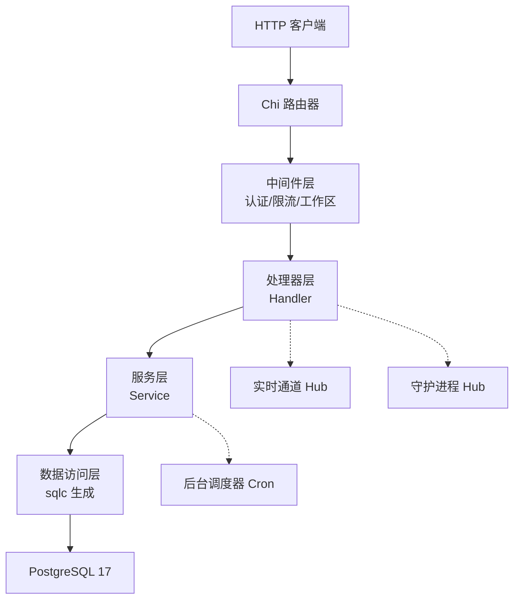

图表来源
- [server/internal/handler/handler.go:17-48](file://server/internal/handler/handler.go#L17-L48)
- [server/internal/middleware/auth.go:1-16](file://server/internal/middleware/auth.go#L1-L16)
- [server/sqlc.yaml:1-12](file://server/sqlc.yaml#L1-L12)

章节来源
- [apps/docs/content/docs/developers/architecture.zh.mdx:74-108](file://apps/docs/content/docs/developers/architecture.zh.mdx#L74-L108)
- [server/go.mod:11-18](file://server/go.mod#L11-L18)

## 核心组件
- 路由与入口
  - Chi 路由器用于注册 HTTP 路由，结合中间件链完成鉴权、限流、CSP、工作区解析等。
  - CLI 入口 main.go 通过 Cobra 组织命令，支持本地守护进程与运行时管理。
- 中间件层
  - 认证中间件统一处理 JWT、PAT、云节点 PAT、任务令牌等身份来源，设置请求头供下游识别。
  - 其他中间件包括速率限制、CSP、工作区上下文注入、插件鉴权等。
- 处理器层
  - Handler 聚合服务、事件总线、实时通道、存储、LLM、渠道集成等能力，提供统一的 JSON 响应与错误编码。
- 服务层
  - Service 封装跨表/跨资源的事务性业务逻辑，协调任务、问题、自动计划、插件等。
- 数据访问层
  - 使用 sqlc 将手写 SQL 编译为类型安全的 Go 函数，配合 pgx/v5 连接 PostgreSQL。
- 实时与守护进程
  - realtime.Hub 推送用户端实时事件；daemonws.Hub 维护与本地/远程守护进程的 WebSocket 长连接。
- 调度与插件
  - 基于 cron 的后台任务调度；插件系统包含 Hook、Schedule、Storage、MCP 传输等。

章节来源
- [server/internal/handler/handler.go:68-152](file://server/internal/handler/handler.go#L68-L152)
- [server/internal/middleware/auth.go:34-51](file://server/internal/middleware/auth.go#L34-L51)
- [server/sqlc.yaml:1-12](file://server/sqlc.yaml#L1-L12)
- [server/cmd/multica/main.go:26-97](file://server/cmd/multica/main.go#L26-L97)

## 架构总览
下图展示从 HTTP 请求到数据库写入与实时广播的整体路径，以及守护进程与后台任务的协作。

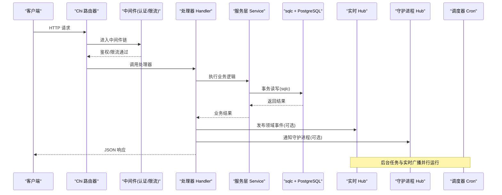

图表来源
- [server/internal/handler/handler.go:191-228](file://server/internal/handler/handler.go#L191-L228)
- [server/internal/realtime/hub.go:1-200](file://server/internal/realtime/hub.go#L1-L200)
- [server/internal/daemonws/hub.go:1-200](file://server/internal/daemonws/hub.go#L1-L200)
- [server/internal/scheduler/cron.go:1-200](file://server/internal/scheduler/cron.go#L1-L200)

## 详细组件分析

### 路由层与中间件层
- 路由层
  - 使用 go-chi/chi/v5 构建 REST API，按资源划分路由组，集中挂载中间件。
  - 健康检查、WebSocket 升级路径（/ws、/api/daemon/ws）由反向代理直通后端。
- 中间件层
  - 认证中间件 Auth 支持多种令牌来源：
    - Authorization: Bearer <token>
    - HttpOnly cookie（状态变更需 CSRF 校验）
    - 任务令牌 mat_（服务端签发，绑定 user/agent/task/workspace）
    - 云节点 PAT mcn_（远端 Fleet 验证）
    - 个人访问令牌 mul_（本地缓存 last_used_at 更新）
    - JWT（HMAC 签名，提取 sub/email）
  - 中间件在请求头中注入 X-User-ID、X-Agent-ID、X-Task-ID、X-Workspace-ID、X-Actor-Source 等，供下游权限判定。
  - 其他中间件包括速率限制、CSP、工作区解析、插件鉴权等。

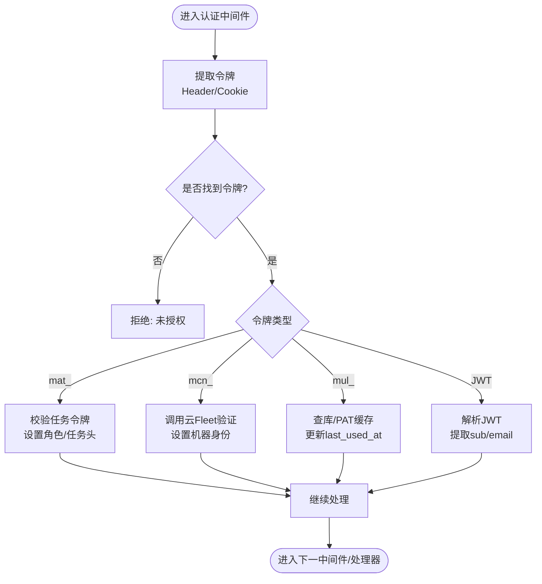

图表来源
- [server/internal/middleware/auth.go:34-285](file://server/internal/middleware/auth.go#L34-L285)

章节来源
- [server/internal/middleware/auth.go:34-285](file://server/internal/middleware/auth.go#L34-L285)
- [apps/docs/content/docs/developers/architecture.zh.mdx:101-108](file://apps/docs/content/docs/developers/architecture.zh.mdx#L101-L108)

### 处理器层（Handler）
- Handler 聚合服务、事件总线、实时通道、存储、LLM、渠道集成等，提供统一的 JSON 输出与错误码。
- 关键职责：
  - 构造 LLM 客户端与重试策略
  - 初始化任务服务、插件服务、问题服务、自动计划服务
  - 管理 webhook 投递、邀请限流、模型列表缓存、本地技能导入等
  - 声明渠道文件投递能力（channelFileDelivery），影响 agent 每轮提示行为
  - 发布领域事件（publish/publishTask/publishChat）
  - 统一错误响应（writeError/writeErrorCode/writeRevisionConflict）

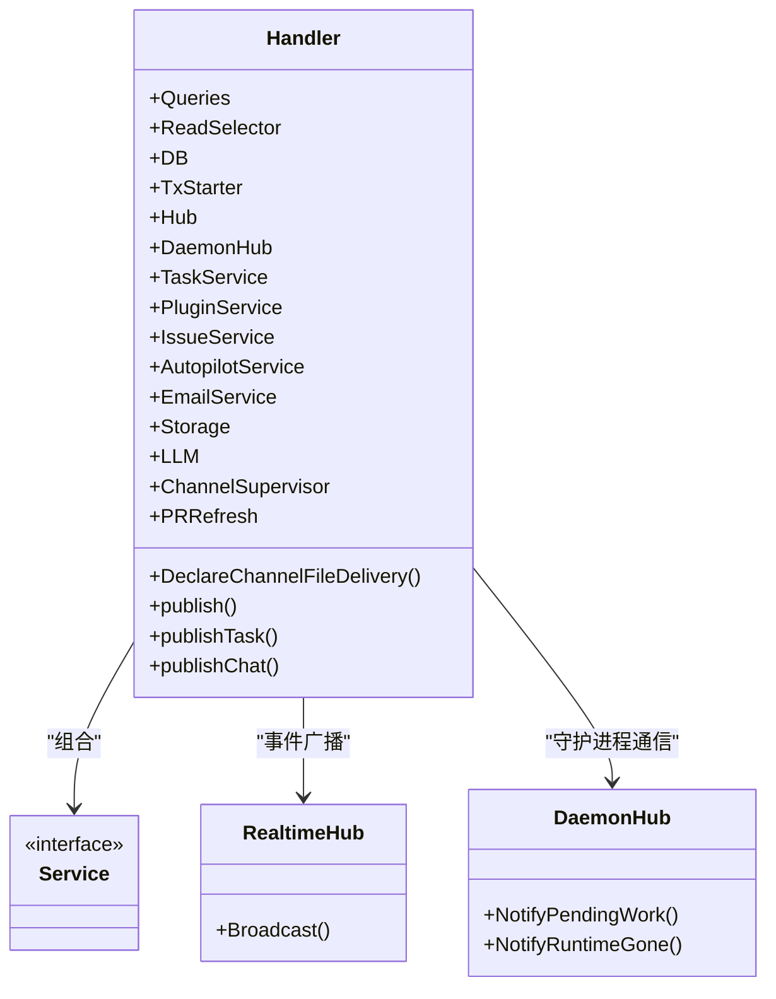

图表来源
- [server/internal/handler/handler.go:191-405](file://server/internal/handler/handler.go#L191-L405)
- [server/internal/handler/handler.go:407-522](file://server/internal/handler/handler.go#L407-L522)
- [server/internal/handler/handler.go:723-794](file://server/internal/handler/handler.go#L723-L794)

章节来源
- [server/internal/handler/handler.go:68-152](file://server/internal/handler/handler.go#L68-L152)
- [server/internal/handler/handler.go:191-405](file://server/internal/handler/handler.go#L191-L405)
- [server/internal/handler/handler.go:407-522](file://server/internal/handler/handler.go#L407-L522)
- [server/internal/handler/handler.go:524-593](file://server/internal/handler/handler.go#L524-L593)
- [server/internal/handler/handler.go:723-794](file://server/internal/handler/handler.go#L723-L794)

### 服务层（Service）与事务策略
- 服务层封装跨表/跨资源的事务性操作，确保一致性。
- 事务策略遵循“应用层事务”原则：数据库不定义外键与级联，所有关系校验与清理在应用层用事务完成；每个并发索引创建在独立迁移文件中。
- 任务服务、问题服务、自动计划服务等通过 TxStarter 开启事务，保证多写操作的原子性。

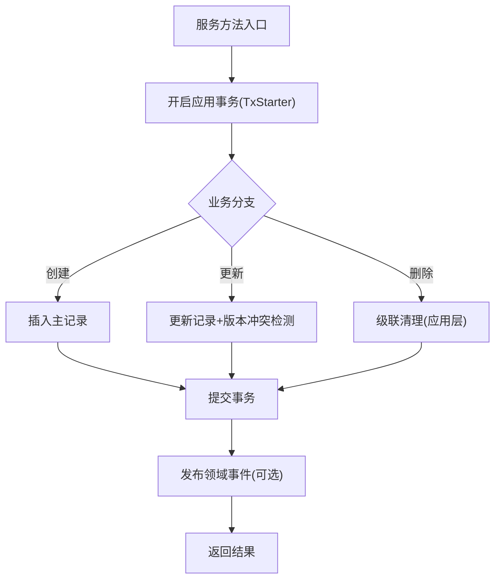

图表来源
- [CLAUDE.md:110-116](file://CLAUDE.md#L110-L116)
- [server/internal/handler/handler.go:58-66](file://server/internal/handler/handler.go#L58-L66)

章节来源
- [CLAUDE.md:110-116](file://CLAUDE.md#L110-L116)
- [server/internal/handler/handler.go:58-66](file://server/internal/handler/handler.go#L58-L66)

### 数据访问层（sqlc + PostgreSQL）
- 使用 sqlc 将手写 SQL 编译为类型安全的 Go 函数，配合 pgx/v5 驱动 PostgreSQL。
- 迁移规则：
  - 禁止外键与级联，关系与清理在应用层处理
  - 所有索引使用 CREATE INDEX CONCURRENTLY / CREATE UNIQUE INDEX CONCURRENTLY
  - 每个并发索引在单独迁移文件中
- 插件钩子调度相关查询示例：启用/禁用、更新表达式与时区、重新激活等。

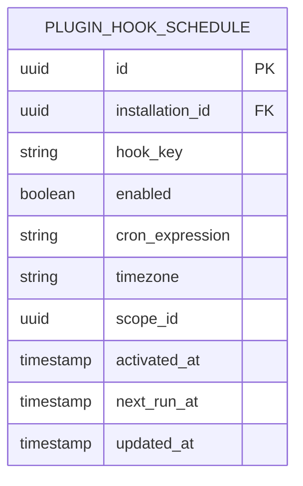

图表来源
- [server/sqlc.yaml:1-12](file://server/sqlc.yaml#L1-L12)
- [server/pkg/db/queries/plugin.sql:156-198](file://server/pkg/db/queries/plugin.sql#L156-L198)

章节来源
- [server/sqlc.yaml:1-12](file://server/sqlc.yaml#L1-L12)
- [server/pkg/db/queries/plugin.sql:156-198](file://server/pkg/db/queries/plugin.sql#L156-L198)
- [CLAUDE.md:110-116](file://CLAUDE.md#L110-L116)

### 守护进程通信与智能体任务执行
- 守护进程通信
  - daemonws.Hub 维护与本地/远程守护进程的 WebSocket 连接，支持心跳、唤醒、RPC 调用。
  - Handler 通过 DaemonHub 发送“待处理工作”提示，避免等待下一次心跳周期。
- 智能体任务执行
  - execenv 装配智能体上下文：运行时 brief 以标记块写入 CLAUDE.md/AGENTS.md，技能水合到 provider 原生 skills 目录。
  - 每轮 prompt 由 daemon.BuildPrompt 生成；易变字段（发起人、连接应用、续接提示）放在每轮消息而非 brief，以保护 prompt 缓存前缀。
  - 磁盘/仓库模型：WorkspacesRoot 下每个任务一个 env root，代码从共享裸缓存 checkout 出 git worktree；同一 (agent, issue) 的多轮复用同一 workdir，不同任务各占目录并行。

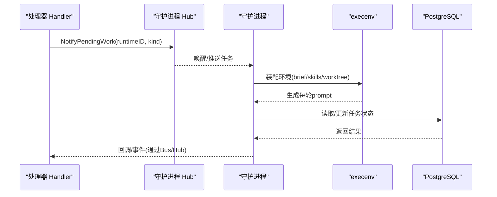

图表来源
- [server/internal/daemonws/hub.go:1-200](file://server/internal/daemonws/hub.go#L1-L200)
- [server/internal/daemon/execenv/execenv.go:1-200](file://server/internal/daemon/execenv/execenv.go#L1-L200)
- [server/internal/daemon/wsrpc.go:1-200](file://server/internal/daemon/wsrpc.go#L1-L200)

章节来源
- [server/internal/handler/handler.go:167-189](file://server/internal/handler/handler.go#L167-L189)
- [server/internal/daemon/execenv/execenv.go:1-200](file://server/internal/daemon/execenv/execenv.go#L1-L200)
- [server/internal/daemon/wsrpc.go:1-200](file://server/internal/daemon/wsrpc.go#L1-L200)

### 实时通信处理
- 两条 WebSocket 路径：
  - /ws：浏览器实时通信，推送任务、评论、收件箱等变化
  - /api/daemon/ws：守护进程长连接，用于唤醒运行时和执行 daemon RPC
- realtime.Hub 负责用户端事件广播；daemonws.Hub 负责守护进程连接管理。

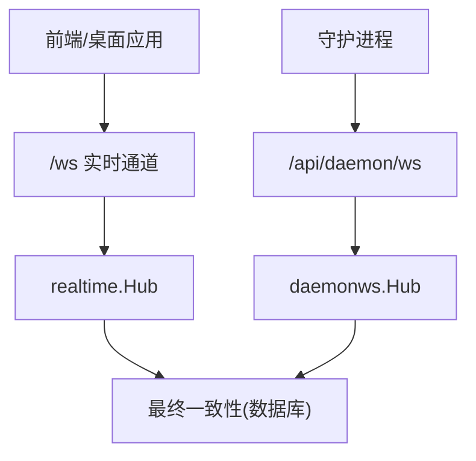

图表来源
- [apps/docs/content/docs/developers/architecture.zh.mdx:101-108](file://apps/docs/content/docs/developers/architecture.zh.mdx#L101-L108)
- [server/internal/realtime/hub.go:1-200](file://server/internal/realtime/hub.go#L1-L200)
- [server/internal/daemonws/hub.go:1-200](file://server/internal/daemonws/hub.go#L1-L200)

章节来源
- [apps/docs/content/docs/developers/architecture.zh.mdx:101-108](file://apps/docs/content/docs/developers/architecture.zh.mdx#L101-L108)

### 后台任务调度与插件系统
- 后台任务调度
  - 基于 robfig/cron 的调度器，支持插件 Hook 的定时触发。
  - 插件钩子调度记录包含表达式、时区、生效时间、下次运行时间等。
- 插件系统后端
  - 插件服务提供 Hook、Schedule、Storage、MCP 传输、Agent Tools 等能力。
  - 插件安装、绑定、事件桥接、存储隔离等由服务层统一管理。

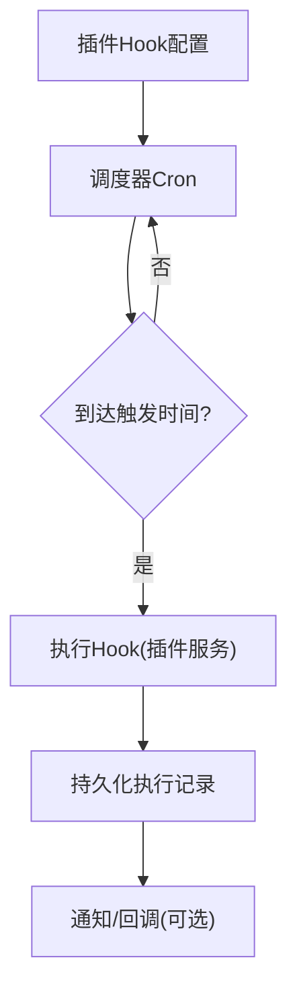

图表来源
- [server/internal/scheduler/cron.go:1-200](file://server/internal/scheduler/cron.go#L1-L200)
- [server/pkg/db/queries/plugin.sql:156-198](file://server/pkg/db/queries/plugin.sql#L156-L198)
- [server/internal/service/plugin.go:1-200](file://server/internal/service/plugin.go#L1-L200)

章节来源
- [server/pkg/db/queries/plugin.sql:156-198](file://server/pkg/db/queries/plugin.sql#L156-L198)
- [server/internal/service/plugin.go:1-200](file://server/internal/service/plugin.go#L1-L200)

### 工作空间权限控制
- 权限控制贯穿中间件与处理器：
  - 认证中间件设置 X-User-ID、X-Workspace-ID、X-Actor-Source 等头部
  - 处理器根据 Actor 来源（人类、任务令牌、云节点）决定可访问的资源范围
  - 工作区上下文注入后，后续查询与服务调用均受工作区边界约束
- 任务令牌 mat_ 具有最高权威性，覆盖下游 actor 解析，防止伪造。

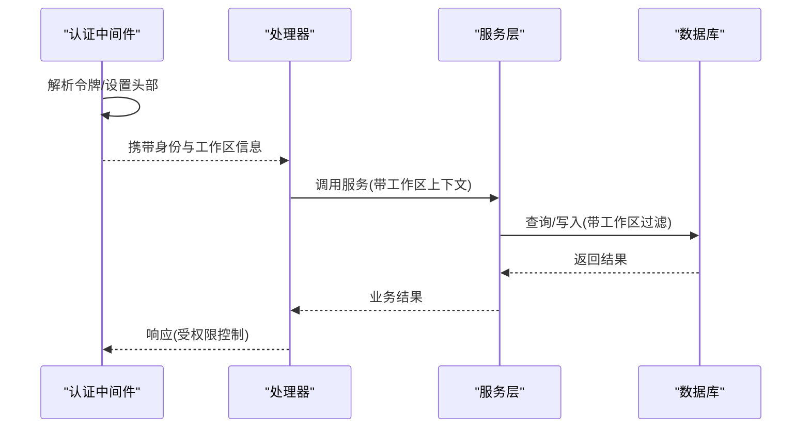

图表来源
- [server/internal/middleware/auth.go:77-115](file://server/internal/middleware/auth.go#L77-L115)
- [server/internal/handler/handler.go:191-228](file://server/internal/handler/handler.go#L191-L228)

章节来源
- [server/internal/middleware/auth.go:77-115](file://server/internal/middleware/auth.go#L77-L115)
- [server/internal/handler/handler.go:191-228](file://server/internal/handler/handler.go#L191-L228)

## 依赖关系分析
- 外部依赖
  - go-chi/chi/v5：HTTP 路由与中间件
  - gorilla/websocket：WebSocket 支持
  - jackc/pgx/v5：PostgreSQL 驱动
  - redis/go-redis：可选 Redis 支持（实时事件、缓存、协调）
  - robfig/cron：后台任务调度
  - golang-jwt/jwt/v5：JWT 验证
- 内部依赖
  - handler 依赖 service、realtime、daemonws、storage、llm 等
  - service 依赖 db.Queries（sqlc 生成）、events.Bus、task 管理等
  - daemon 依赖 execenv、repocache、wakeup 等

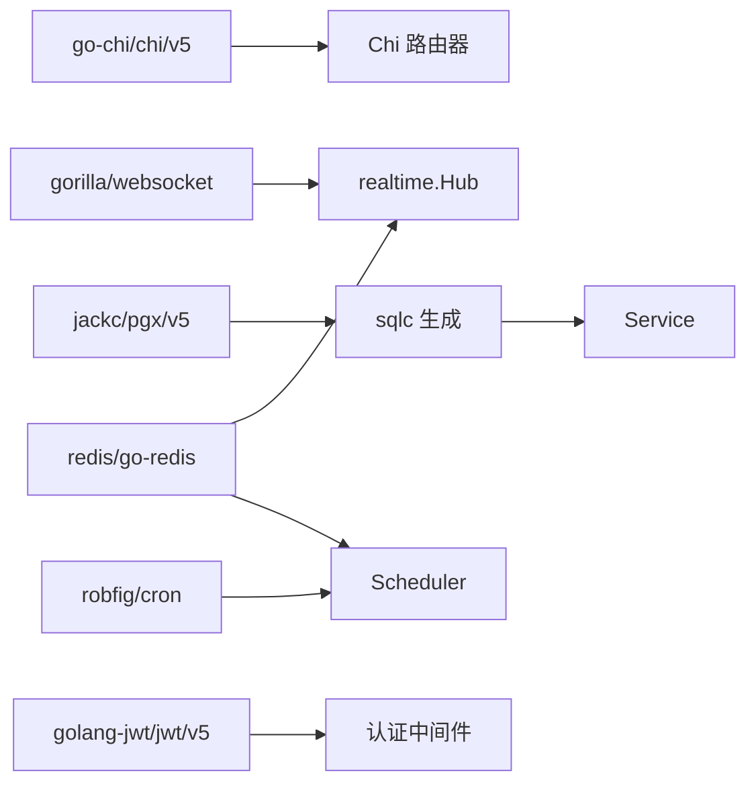

图表来源
- [server/go.mod:11-28](file://server/go.mod#L11-L28)
- [server/sqlc.yaml:1-12](file://server/sqlc.yaml#L1-L12)

章节来源
- [server/go.mod:11-28](file://server/go.mod#L11-L28)
- [server/sqlc.yaml:1-12](file://server/sqlc.yaml#L1-L12)

## 性能考虑
- 认证缓存：PAT 使用短 TTL 缓存，减少 DB 查询与 last_used_at 更新频率
- 模型列表缓存：InMemoryModelCatalogCache 提供 stale-while-revalidate，降低 daemon 往返
- 并发索引：迁移中使用 CREATE INDEX CONCURRENTLY，避免锁表
- 实时广播：Hub 批量广播，减少网络开销
- 守护进程唤醒：NotifyPendingWork 立即唤醒，避免等待心跳周期
- 附件下载：Content-Length 预计算，避免分块传输导致的长度缺失

[本节为通用性能建议，无需特定文件引用]

## 故障排查指南
- 认证失败
  - 检查令牌来源（Header/Cookie）、CSRF 校验、令牌类型分支（mat_/mcn_/mul_/JWT）
  - 查看日志中的“auth: invalid token”、“CSRF validation failed”等提示
- 任务执行异常
  - 检查守护进程连接状态、心跳、唤醒信号
  - 确认 execenv 装配是否正确（brief/skills/worktree）
- 数据库迁移问题
  - 确认迁移文件是否单语句、是否使用 CONCURRENTLY
  - 检查 schema_migrations 记录与对象存在性
- 实时通信中断
  - 检查 /ws 与 /api/daemon/ws 反向代理配置
  - 确认 Hub 订阅与广播是否正常

章节来源
- [server/internal/middleware/auth.go:20-32](file://server/internal/middleware/auth.go#L20-L32)
- [server/internal/middleware/auth.go:63-75](file://server/internal/middleware/auth.go#L63-L75)
- [server/internal/middleware/auth.go:87-115](file://server/internal/middleware/auth.go#L87-L115)
- [server/internal/middleware/auth.go:137-175](file://server/internal/middleware/auth.go#L137-L175)
- [server/internal/middleware/auth.go:177-227](file://server/internal/middleware/auth.go#L177-L227)
- [server/internal/middleware/auth.go:229-265](file://server/internal/middleware/auth.go#L229-L265)
- [CLAUDE.md:110-116](file://CLAUDE.md#L110-L116)

## 结论
Multica 后端采用清晰的分层架构：Chi 路由 + 中间件 + Handler + Service + sqlc + PostgreSQL，结合实时通道与守护进程通信，形成高内聚、低耦合的系统。认证中间件统一处理多种令牌来源，服务层封装事务性业务逻辑，数据访问层通过 sqlc 保证类型安全。后台调度与插件系统扩展了系统的自动化能力。整体设计兼顾可扩展性、可维护性与性能，适合团队协作与智能体任务执行的复杂场景。

[本节为总结性内容，无需特定文件引用]

## 附录
- 术语
  - 守护进程（daemon）：本地执行智能体任务的进程
  - 智能体（agent）：AI 助手，可作为指派人
  - 工作区（workspace）：资源与权限的边界
  - 插件（plugin）：可扩展的 Hook、Schedule、Storage 等能力
- 参考
  - 后端分层文档：apps/docs/content/docs/developers/architecture.zh.mdx
  - 数据库规则：CLAUDE.md
  - sqlc 配置：server/sqlc.yaml

[本节为补充信息，无需特定文件引用]