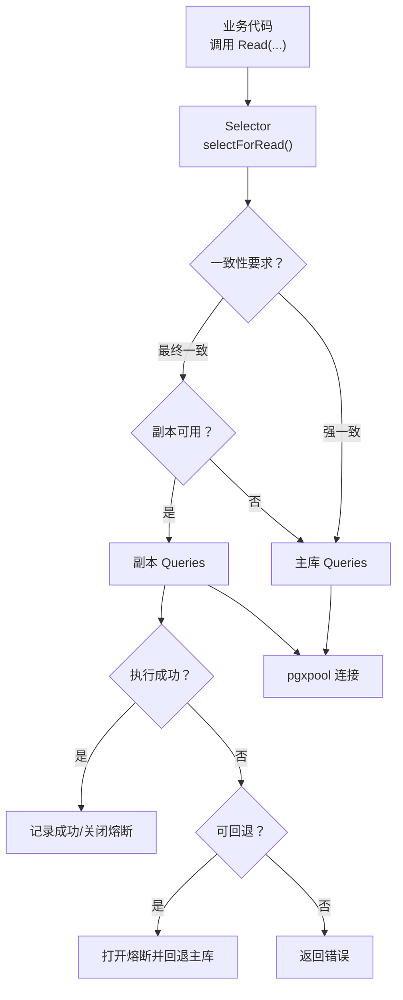
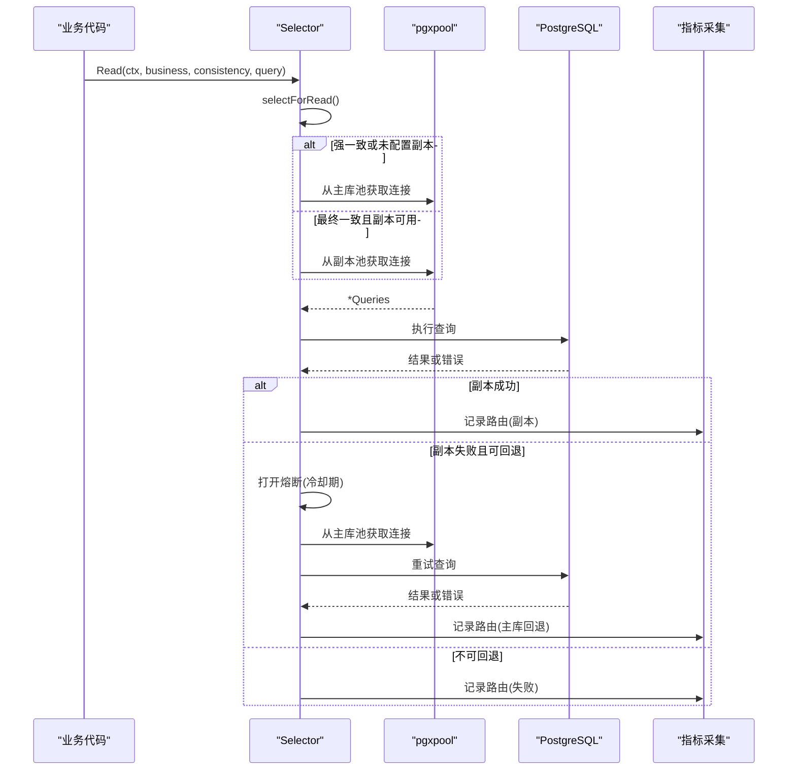
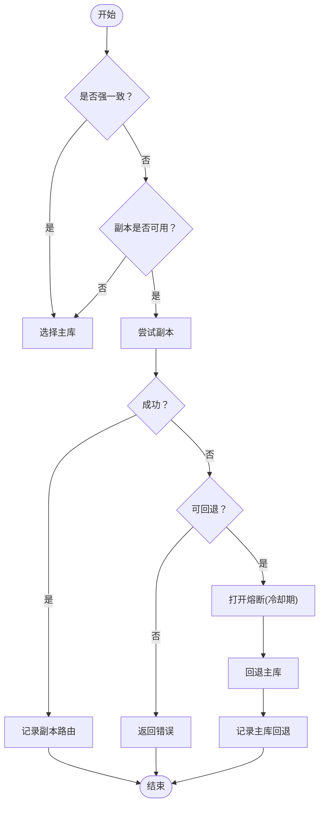
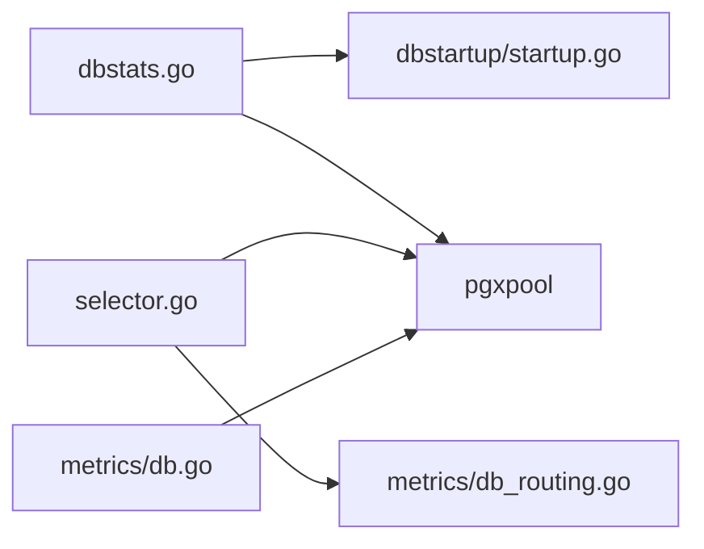

# 数据库连接管理

<cite>
**本文引用的文件**
- [selector.go](file://server/internal/dbreader/selector.go)
- [dbstats.go](file://server/cmd/server/dbstats.go)
- [db.go](file://server/internal/metrics/db.go)
- [db_routing.go](file://server/internal/metrics/db_routing.go)
- [startup.go](file://server/internal/dbstartup/startup.go)
</cite>

## 目录
1. [简介](#简介)
2. [项目结构](#项目结构)
3. [核心组件](#核心组件)
4. [架构总览](#架构总览)
5. [详细组件分析](#详细组件分析)
6. [依赖关系分析](#依赖关系分析)
7. [性能考量与调优](#性能考量与调优)
8. [故障排查指南](#故障排查指南)
9. [结论](#结论)
10. [附录：配置示例与最佳实践](#附录配置示例与最佳实践)

## 简介
本文件面向 Multica 后端（Go + pgx/pgxpool + sqlc）的数据库连接管理，聚焦 PostgreSQL 17 的连接池配置、连接复用策略与读写分离实现。文档覆盖连接生命周期（建立、健康检查、故障转移、泄漏检测）、连接选择器（主从路由、负载均衡、故障切换）、监控指标、性能调优参数、连接数限制策略，以及高并发场景下的稳定性保证与常见问题排查。

## 项目结构
Multica 的后端将数据库连接池创建、尺寸与日志统计放在启动阶段；读写分离的选择逻辑集中在 dbreader 包；Prometheus 指标采集在 metrics 包中完成。关键路径如下：
- 连接池创建与尺寸应用：server/cmd/server/dbstats.go
- 连接池解析与校验：server/internal/dbstartup/startup.go
- 读写选择与熔断：server/internal/dbreader/selector.go
- 指标采集：server/internal/metrics/db.go、server/internal/metrics/db_routing.go

图表来源
- [selector.go:121-179](file://server/internal/dbreader/selector.go#L121-L179)
- [dbstats.go:97-112](file://server/cmd/server/dbstats.go#L97-L112)

章节来源
- [dbstats.go:17-52](file://server/cmd/server/dbstats.go#L17-L52)
- [dbstats.go:97-112](file://server/cmd/server/dbstats.go#L97-L112)
- [selector.go:121-179](file://server/internal/dbreader/selector.go#L121-L179)

## 核心组件
- 连接池工厂与尺寸控制：负责根据环境变量与 URL 参数设置 MaxConns/MinConns/MaxConnLifetime，并对副本强制只读校验。
- 连接选择器：封装主/从路由、一致性语义、熔断保护与回退策略。
- 指标采集：暴露连接池状态与路由决策计数，便于观测与告警。
- 启动期配置解析：解析连接串中的连接池参数并应用默认值。

章节来源
- [dbstats.go:82-154](file://server/cmd/server/dbstats.go#L82-L154)
- [selector.go:67-119](file://server/internal/dbreader/selector.go#L67-L119)
- [db.go:8-56](file://server/internal/metrics/db.go#L8-L56)
- [db_routing.go:5-30](file://server/internal/metrics/db_routing.go#L5-L30)
- [startup.go:1-200](file://server/internal/dbstartup/startup.go#L1-L200)

## 架构总览
下图展示从业务侧到数据库连接的完整链路：业务通过 Selector.Read 发起读请求；Selector 依据一致性策略选择主或从；若走从且失败，按错误类型决定是否打开熔断并回退主库；所有连接均通过 pgxpool 获取；指标系统持续采集池状态与路由计数。

图表来源
- [selector.go:121-179](file://server/internal/dbreader/selector.go#L121-L179)
- [dbstats.go:97-112](file://server/cmd/server/dbstats.go#L97-L112)
- [db.go:82-102](file://server/internal/metrics/db.go#L82-L102)
- [db_routing.go:25-30](file://server/internal/metrics/db_routing.go#L25-L30)

## 详细组件分析

### 连接池配置与复用策略（主/从）
- 主库池默认尺寸：MaxConns=25，MinConns=5；副本池默认：MaxConns=10，MinConns=0，最大连接生命周期 5 分钟。
- 优先级：环境变量 > URL pool_* 参数 > 代码默认值；禁止使用 pgx 内置默认（避免生产事故）。
- 副本强制只读：未显式指定 standby 时，自动设置为 read-only 验证，确保 fail-closed。
- 健康检查：通过 pgxpool 的健康检查周期与连接生命周期控制，结合 ValidateConnect 在连接建立时校验角色。
- 复用策略：连接由 pgxpool 统一管理，短事务/高频读取受益于 MinConns 预热；长事务需评估对池占用的影响。

章节来源
- [dbstats.go:17-52](file://server/cmd/server/dbstats.go#L17-L52)
- [dbstats.go:82-154](file://server/cmd/server/dbstats.go#L82-L154)
- [dbstats.go:213-227](file://server/cmd/server/dbstats.go#L213-L227)
- [startup.go:1-200](file://server/internal/dbstartup/startup.go#L1-L200)

### 连接选择器：主从路由、负载均衡与故障切换
- 一致性语义：强一致直接走主库；最终一致优先走副本，否则回退主库。
- 熔断机制：副本连续失败会打开熔断，进入冷却期；半开探测一次成功即恢复。
- 回退判定：基于 pgx 错误分类（连接错误、网络错误、PG 错误码），区分“可安全重试”的错误与“业务/权限/取消”等不可回退错误。
- 指标记录：每次路由决策都会记录 business/role/reason，便于定位流量分布与异常原因。

图表来源
- [selector.go:121-179](file://server/internal/dbreader/selector.go#L121-L179)
- [selector.go:212-257](file://server/internal/dbreader/selector.go#L212-L257)
- [selector.go:295-361](file://server/internal/dbreader/selector.go#L295-L361)

章节来源
- [selector.go:67-119](file://server/internal/dbreader/selector.go#L67-L119)
- [selector.go:121-179](file://server/internal/dbreader/selector.go#L121-L179)
- [selector.go:212-257](file://server/internal/dbreader/selector.go#L212-L257)
- [selector.go:259-361](file://server/internal/dbreader/selector.go#L259-L361)

### 连接生命周期管理
- 连接建立：通过 pgxpool.NewWithConfig 创建；解析连接串并应用池尺寸与只读校验。
- 健康检查：利用 pgxpool 健康检查周期与连接生命周期；副本连接在 promotion 后通过 ValidateConnect 快速失效。
- 故障转移：Selector 在副本失败时按错误类型决定是否打开熔断并回退主库。
- 连接泄漏检测：通过定期采样池统计（EmptyAcquireCount、CanceledAcquireCount、AcquireDuration）识别等待与取消增长，辅助发现泄漏或容量不足。

章节来源
- [dbstats.go:97-112](file://server/cmd/server/dbstats.go#L97-L112)
- [dbstats.go:213-227](file://server/cmd/server/dbstats.go#L213-L227)
- [dbstats.go:229-291](file://server/cmd/server/dbstats.go#L229-L291)
- [selector.go:212-257](file://server/internal/dbreader/selector.go#L212-L257)

### 监控指标与可视化
- 连接池指标：acquired_conns、idle_conns、max_conns、total_conns、constructing_conns、acquire_count、acquire_duration_seconds_total、empty_acquire_count、empty_acquire_wait_seconds_total、canceled_acquire_count、new_conns_count、max_idle_destroy_count、max_lifetime_destroy_count。
- 路由指标：multica_db_read_routes_total，标签包含 business、role、reason，用于观察主从路由分布与回退原因。
- 日志观测：启动时打印有效池配置；周期性输出池压力指标（空等待/取消增长为警告）。

章节来源
- [db.go:8-56](file://server/internal/metrics/db.go#L8-L56)
- [db.go:82-102](file://server/internal/metrics/db.go#L82-L102)
- [db_routing.go:5-30](file://server/internal/metrics/db_routing.go#L5-L30)
- [dbstats.go:213-227](file://server/cmd/server/dbstats.go#L213-L227)
- [dbstats.go:229-291](file://server/cmd/server/dbstats.go#L229-L291)

## 依赖关系分析
- dbstats.go 依赖 dbstartup 解析连接串与池配置，并创建 pgxpool；同时提供日志与统计。
- selector.go 依赖 pgx 错误类型进行回退判断，并通过可选的 Recorder 接口上报路由指标。
- metrics/db.go 与 metrics/db_routing.go 分别采集池状态与路由计数，供 Prometheus 拉取。

图表来源
- [dbstats.go:97-112](file://server/cmd/server/dbstats.go#L97-L112)
- [selector.go:121-179](file://server/internal/dbreader/selector.go#L121-L179)
- [db.go:82-102](file://server/internal/metrics/db.go#L82-L102)
- [db_routing.go:25-30](file://server/internal/metrics/db_routing.go#L25-L30)

章节来源
- [dbstats.go:97-112](file://server/cmd/server/dbstats.go#L97-L112)
- [selector.go:121-179](file://server/internal/dbreader/selector.go#L121-L179)
- [db.go:82-102](file://server/internal/metrics/db.go#L82-L102)
- [db_routing.go:25-30](file://server/internal/metrics/db_routing.go#L25-L30)

## 性能考量与调优
- 连接池尺寸
  - 主库：建议 MaxConns≈25、MinConns≈5，以应对守护进程的高频心跳与任务领取峰值。
  - 副本：MaxConns≈10、MinConns=0，避免空闲连接浪费；首次流量时冷启动成本可控。
- 连接生命周期
  - 副本连接最大生命周期建议 5 分钟，以便在提升为主后尽快失效旧连接。
- 只读校验
  - 副本强制 read-only/standby 校验，防止写入误发至从库。
- 高并发优化
  - 保持 MinConns>0 预热连接，降低首请求延迟。
  - 合理设置查询超时与上下文取消，避免长时间占用连接导致饥饿。
  - 对热点读采用最终一致+副本分流，减轻主库压力。
- 监控与告警
  - 关注 empty_acquire_count、canceled_acquire_count、acquire_duration 的增长趋势。
  - 观察 multica_db_read_routes_total 中 replica_selected 与 primary 回退比例，评估副本可用性。

章节来源
- [dbstats.go:17-52](file://server/cmd/server/dbstats.go#L17-L52)
- [dbstats.go:82-154](file://server/cmd/server/dbstats.go#L82-L154)
- [dbstats.go:229-291](file://server/cmd/server/dbstats.go#L229-L291)
- [db.go:82-102](file://server/internal/metrics/db.go#L82-L102)
- [db_routing.go:25-30](file://server/internal/metrics/db_routing.go#L25-L30)

## 故障排查指南
- 症状：请求延迟升高、出现大量 acquire 等待或取消
  - 检查池压力日志：EmptyAcquireCount/CanceledAcquireCount 是否持续增长；平均 acquire 时长是否上升。
  - 核对 MaxConns/MinConns 是否符合预期；确认未启用 pgx 默认小池。
- 症状：副本读频繁回退主库
  - 查看路由指标中 reason 为 connection_failed/recovery_conflict 的比例。
  - 确认副本只读校验是否生效；检查副本是否被提升为主但连接未失效。
- 症状：连接泄漏怀疑
  - 对比 TotalConns/AcquiredConns/IdleConns 长期不回落；结合业务事务边界排查未释放连接。
- 症状：启动后副本不可用
  - 确认 DATABASE_REPLICA_MAX_CONNS/MIN_CONNS 与环境变量优先级；检查 URL 中 pool_* 参数是否被覆盖。

章节来源
- [dbstats.go:213-227](file://server/cmd/server/dbstats.go#L213-L227)
- [dbstats.go:229-291](file://server/cmd/server/dbstats.go#L229-L291)
- [selector.go:212-257](file://server/internal/dbreader/selector.go#L212-L257)
- [db_routing.go:25-30](file://server/internal/metrics/db_routing.go#L25-L30)

## 结论
Multica 的数据库连接管理通过“明确的池尺寸默认值 + 严格的副本只读校验 + 细粒度的路由与熔断 + 完善的指标与日志”，在高并发场景下实现了稳定、可观测、易调优的连接体系。配合最终一致的读路径分流与主库兜底，既提升了吞吐又保障了数据正确性。

## 附录：配置示例与最佳实践
- 环境变量
  - DATABASE_MAX_CONNS / DATABASE_MIN_CONNS：主库池尺寸
  - DATABASE_REPLICA_MAX_CONNS / DATABASE_REPLICA_MIN_CONNS：副本池尺寸
  - DATABASE_URL：可携带 pool_max_conns、pool_min_conns、pool_max_conn_lifetime 等参数
- 最佳实践
  - 始终显式设置池尺寸，避免依赖 pgx 默认值。
  - 副本必须开启 read-only/standby 校验，确保 fail-closed。
  - 对读多写少的场景，优先使用最终一致读走副本，减少主库压力。
  - 结合指标与日志，持续观察池压力与路由分布，及时扩容或调整 MinConns。
  - 长事务尽量拆分，避免长时间占用连接导致整体吞吐下降。

章节来源
- [dbstats.go:82-154](file://server/cmd/server/dbstats.go#L82-L154)
- [dbstats.go:213-227](file://server/cmd/server/dbstats.go#L213-L227)
- [dbstats.go:229-291](file://server/cmd/server/dbstats.go#L229-L291)
- [db.go:82-102](file://server/internal/metrics/db.go#L82-L102)
- [db_routing.go:25-30](file://server/internal/metrics/db_routing.go#L25-L30)
- [selector.go:121-179](file://server/internal/dbreader/selector.go#L121-L179)