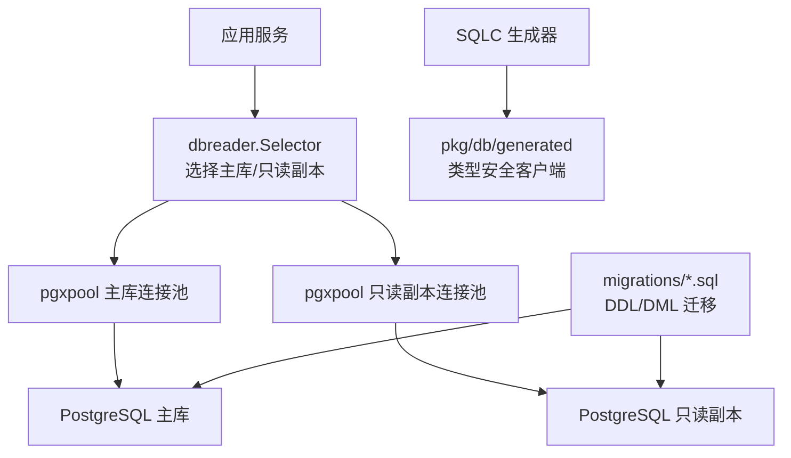
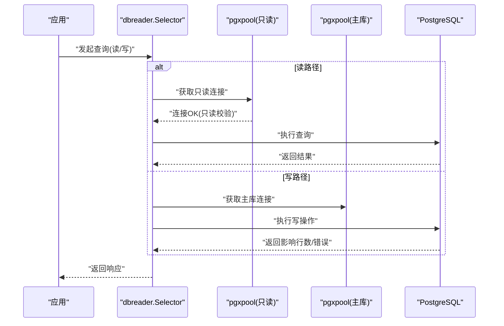
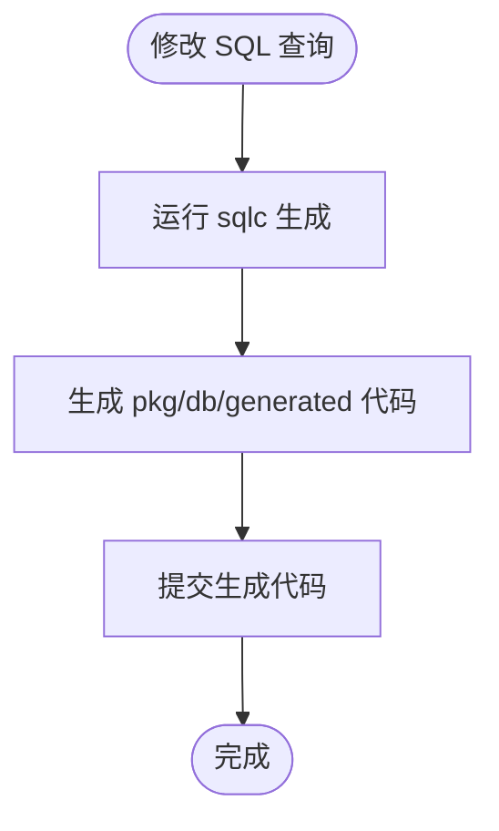
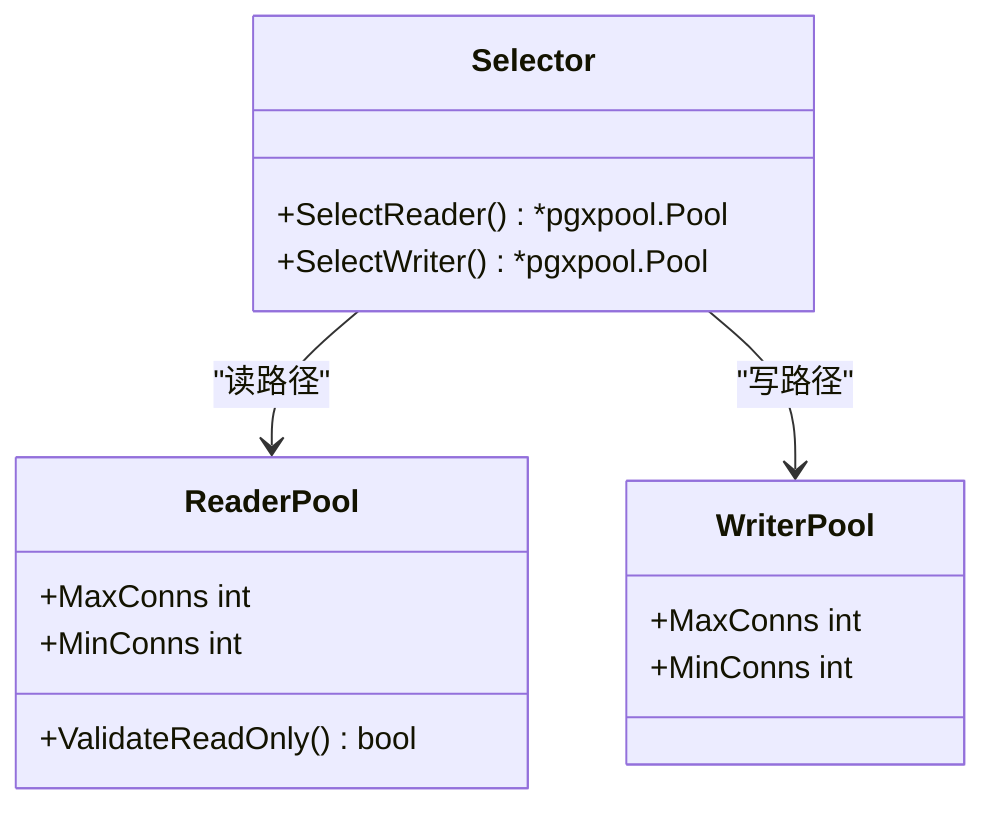
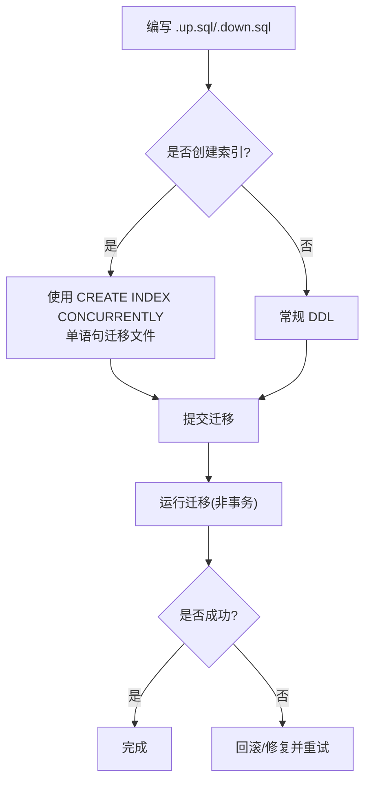
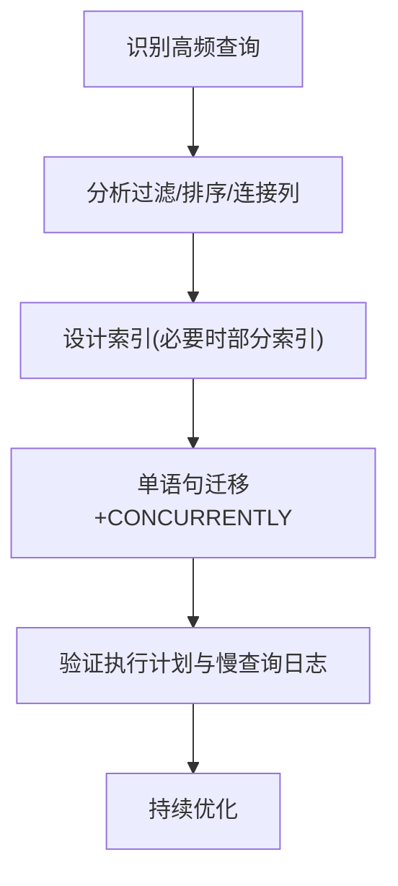
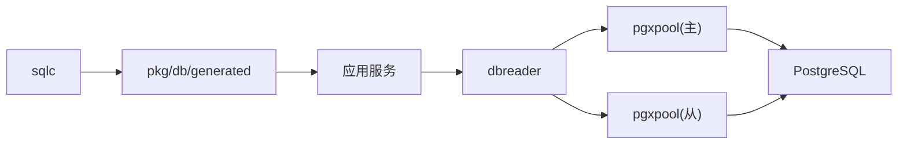

# 数据访问层

<cite>
**本文引用的文件**
- [sqlc.yaml](file://server/sqlc.yaml)
- [selector.go](file://server/internal/dbreader/selector.go)
- [219_vcs_pull_request_connection_index.up.sql](file://server/migrations/219_vcs_pull_request_connection_index.up.sql)
- [220_issue_vcs_pull_request_pr_index.up.sql](file://server/migrations/220_issue_vcs_pull_request_pr_index.up.sql)
- [218_vcs_pull_request_workspace_index.up.sql](file://server/migrations/218_vcs_pull_request_workspace_index.up.sql)
- [221_vcs_commit_status_lookup_index.up.sql](file://server/migrations/221_vcs_commit_status_lookup_index.up.sql)
- [074_task_usage_updated_at_index.up.sql](file://server/migrations/074_task_usage_updated_at_index.up.sql)
- [231_agent_task_queue_terminal_completed_at_index.up.sql](file://server/migrations/231_agent_task_queue_terminal_completed_at_index.up.sql)
- [SELF_HOSTING_ADVANCED.md](file://SELF_HOSTING_ADVANCED.md)
- [CLAUDE.md](file://CLAUDE.md)
</cite>

## 目录
1. [简介](#简介)
2. [项目结构](#项目结构)
3. [核心组件](#核心组件)
4. [架构总览](#架构总览)
5. [详细组件分析](#详细组件分析)
6. [依赖分析](#依赖分析)
7. [性能考虑](#性能考虑)
8. [故障排查指南](#故障排查指南)
9. [结论](#结论)
10. [附录](#附录)

## 简介
本文件聚焦 Multica 后端的数据访问层，围绕 SQLC 代码生成、PostgreSQL 连接池与读写分离、事务与锁机制、迁移策略与并发安全、索引优化与复杂查询性能、大数据量处理与缓存策略、以及数据一致性保证进行系统化说明。目标是为开发者提供从架构到实践的可操作指南，帮助在生产环境中稳定高效地运行 PostgreSQL 17。

## 项目结构
数据访问相关的关键位置：
- SQLC 配置与生成产物：server/sqlc.yaml 定义引擎、SQL 目录、Schema 目录与 Go 生成路径；生成代码位于 server/pkg/db/generated（由 sqlc 产出）。
- SQL 查询文件：server/pkg/db/queries/*.sql 存放按领域划分的 SQL 查询，供 sqlc 生成类型安全的 Go 客户端。
- 数据库迁移：server/migrations/*.sql 使用编号前缀的 up/down 脚本管理版本演进；新增索引采用单语句迁移并配合 CONCURRENTLY 避免阻塞。
- 读路由选择器：server/internal/dbreader/selector.go 负责在运行时选择主库或只读副本执行查询。
- 环境配置与连接池参数：通过环境变量控制主/从连接池大小与行为，详见“性能考虑”。

图表来源
- [sqlc.yaml:1-13](file://server/sqlc.yaml#L1-L13)
- [selector.go](file://server/internal/dbreader/selector.go)

章节来源
- [sqlc.yaml:1-13](file://server/sqlc.yaml#L1-L13)

## 核心组件
- SQLC 代码生成
  - 引擎：postgresql
  - 查询目录：pkg/db/queries/
  - Schema 目录：migrations/
  - 生成包名：db，输出至 pkg/db/generated
  - 驱动：pgx/v5，启用 JSON 标签与空切片发射
- 连接池与读写分离
  - 主库连接池：可通过 DATABASE_MAX_CONNS / DATABASE_MIN_CONNS 配置
  - 只读副本连接池：DATABASE_REPLICA_URL、DATABASE_REPLICA_MAX_CONNS / DATABASE_REPLICA_MIN_CONNS
  - 副本连接周期性校验只读状态，失败时透明回退主库并短暂熔断
- 迁移与索引
  - 禁止外键与级联，关系与清理在应用层用事务完成
  - 所有索引必须使用 CREATE INDEX CONCURRENTLY 或 CREATE UNIQUE INDEX CONCURRENTLY
  - 每个并发索引构建放在独立单语句迁移文件中，迁移执行不在显式事务中

章节来源
- [sqlc.yaml:1-13](file://server/sqlc.yaml#L1-L13)
- [SELF_HOSTING_ADVANCED.md:17-27](file://SELF_HOSTING_ADVANCED.md#L17-L27)
- [CLAUDE.md:110-116](file://CLAUDE.md#L110-L116)

## 架构总览
下图展示请求如何经 dbreader 选择主/从连接池，并通过 pgx 访问 PostgreSQL。SQLC 生成的客户端封装了具体查询调用，迁移脚本维护 schema 与索引。

图表来源
- [selector.go](file://server/internal/dbreader/selector.go)
- [SELF_HOSTING_ADVANCED.md:17-27](file://SELF_HOSTING_ADVANCED.md#L17-L27)

## 详细组件分析

### SQLC 代码生成与查询组织
- 作用：将 SQL 查询编译为类型安全的 Go 函数与模型，减少手写映射错误，提升可维护性。
- 工程约定：
  - 查询按领域拆分到 pkg/db/queries/*.sql
  - 每次变更 SQL 后需运行 make sqlc，提交生成的 pkg/db/generated 代码
  - 禁止直接编辑生成代码
- 集成点：
  - 生成包名为 db，使用 pgx/v5 作为底层驱动
  - 开启 JSON 标签便于序列化/反序列化
  - 开启空切片发射，避免 nil 切片导致的 JSON 差异

图表来源
- [sqlc.yaml:1-13](file://server/sqlc.yaml#L1-L13)

章节来源
- [sqlc.yaml:1-13](file://server/sqlc.yaml#L1-L13)

### 数据库连接池与读写分离
- 主库连接池
  - 最大连接数：DATABASE_MAX_CONNS（默认 25）
  - 最小预热连接：DATABASE_MIN_CONNS（默认 5）
  - 建议 pod_count × DATABASE_MAX_CONNS 低于 Postgres max_connections
- 只读副本连接池
  - 连接串：DATABASE_REPLICA_URL
  - 最大/最小连接：DATABASE_REPLICA_MAX_CONNS（默认 10）、DATABASE_REPLICA_MIN_CONNS（默认 0）
  - 副本连接会定期校验只读属性；失败时自动回退主库并短暂熔断
  - 副本数据存在复制延迟，强一致读应走主库
- 选择策略
  - 读路径可选择副本以分担压力；写路径强制主库
  - 业务层对关键读场景决定是否走副本

图表来源
- [selector.go](file://server/internal/dbreader/selector.go)
- [SELF_HOSTING_ADVANCED.md:17-27](file://SELF_HOSTING_ADVANCED.md#L17-L27)

章节来源
- [SELF_HOSTING_ADVANCED.md:17-27](file://SELF_HOSTING_ADVANCED.md#L17-L27)

### 事务管理与锁机制
- 事务边界
  - 多步写操作应在 service 层使用应用事务，确保原子性与一致性
  - 禁止在迁移中使用外键与级联，关系校验与清理在应用层完成
- 锁策略
  - 利用行级锁/唯一约束在应用事务内保护关键更新
  - 长事务与热点行竞争需结合业务重试与退避
  - 对高吞吐队列类表，优先使用条件更新与幂等键避免重复处理

章节来源
- [CLAUDE.md:110-116](file://CLAUDE.md#L110-L116)

### 数据迁移策略与并发安全
- 版本控制
  - 使用数字前缀的 .up.sql/.down.sql 成对管理
  - 迁移执行不在显式事务中，支持并发索引构建
- 并发安全
  - 所有索引创建必须使用 CONCURRENTLY，且每个索引独占一个单语句迁移文件
  - 条件跳过迁移仍记录到 schema_migrations，后续迁移需幂等 DDL（IF EXISTS/IF NOT EXISTS）
- 回滚方案
  - 提供对应的 .down.sql 用于回滚
  - 对不可逆变更需谨慎设计 down 脚本与恢复流程

图表来源
- [CLAUDE.md:110-116](file://CLAUDE.md#L110-L116)

章节来源
- [CLAUDE.md:110-116](file://CLAUDE.md#L110-L116)

### 索引优化策略与典型模式
- 并发索引原则
  - 所有索引使用 CONCURRENTLY，避免阻塞在线写入
  - 每个索引单独迁移文件，满足 PG 限制
- 典型索引示例
  - vcs_pull_request.connection_id、workspace_id
  - issue_vcs_pull_request.pull_request_id
  - vcs_commit_status(connection_id, sha)
  - task_usage.updated_at 支撑增量扫描
  - agent_task_queue.completed_at 部分索引过滤 terminal 状态，降低热路径开销
- 设计要点
  - 针对高频过滤列建立索引
  - 对大表时间范围查询使用分区或合适的时间索引
  - 部分索引仅包含必要行，减少维护成本

图表来源
- [219_vcs_pull_request_connection_index.up.sql:1-4](file://server/migrations/219_vcs_pull_request_connection_index.up.sql#L1-L4)
- [220_issue_vcs_pull_request_pr_index.up.sql:1-4](file://server/migrations/220_issue_vcs_pull_request_pr_index.up.sql#L1-L4)
- [218_vcs_pull_request_workspace_index.up.sql:1-4](file://server/migrations/218_vcs_pull_request_workspace_index.up.sql#L1-L4)
- [221_vcs_commit_status_lookup_index.up.sql:1-4](file://server/migrations/221_vcs_commit_status_lookup_index.up.sql#L1-L4)
- [074_task_usage_updated_at_index.up.sql:1-5](file://server/migrations/074_task_usage_updated_at_index.up.sql#L1-L5)
- [231_agent_task_queue_terminal_completed_at_index.up.sql:1-18](file://server/migrations/231_agent_task_queue_terminal_completed_at_index.up.sql#L1-L18)

章节来源
- [219_vcs_pull_request_connection_index.up.sql:1-4](file://server/migrations/219_vcs_pull_request_connection_index.up.sql#L1-L4)
- [220_issue_vcs_pull_request_pr_index.up.sql:1-4](file://server/migrations/220_issue_vcs_pull_request_pr_index.up.sql#L1-L4)
- [218_vcs_pull_request_workspace_index.up.sql:1-4](file://server/migrations/218_vcs_pull_request_workspace_index.up.sql#L1-L4)
- [221_vcs_commit_status_lookup_index.up.sql:1-4](file://server/migrations/221_vcs_commit_status_lookup_index.up.sql#L1-L4)
- [074_task_usage_updated_at_index.up.sql:1-5](file://server/migrations/074_task_usage_updated_at_index.up.sql#L1-L5)
- [231_agent_task_queue_terminal_completed_at_index.up.sql:1-18](file://server/migrations/231_agent_task_queue_terminal_completed_at_index.up.sql#L1-L18)

### 复杂查询性能优化与大数据量处理
- 查询侧优化
  - 明确过滤条件，避免 SELECT *
  - 使用分页与游标，限制单次结果集大小
  - 对聚合/报表类查询使用物化视图或离线计算
- 索引侧优化
  - 复合索引匹配查询谓词顺序
  - 对大表时间窗口查询使用分区或局部索引
  - 使用部分索引减少维护成本（如终端状态过滤）
- 执行计划与监控
  - 借助 EXPLAIN/EXPLAIN ANALYZE 定位全表扫描
  - 关注慢查询日志与指标，持续迭代索引与 SQL

章节来源
- [231_agent_task_queue_terminal_completed_at_index.up.sql:1-18](file://server/migrations/231_agent_task_queue_terminal_completed_at_index.up.sql#L1-L18)

### 缓存策略与数据一致性
- 缓存分层
  - 读多写少的高频数据可使用应用层缓存（内存/Redis），注意失效策略
  - 对强一致读场景直接走主库，避免副本延迟导致不一致
- 一致性保障
  - 写路径始终落盘主库，读路径根据一致性需求选择主/从
  - 对关键读可加短超时重试与降级回主库
- 副本健康检查
  - 定期校验副本只读属性，失败时熔断并回退主库

章节来源
- [SELF_HOSTING_ADVANCED.md:17-27](file://SELF_HOSTING_ADVANCED.md#L17-L27)

### 常用查询模式与最佳实践
- 分页列表：基于时间戳或自增 ID 的 keyset 分页，避免深翻页
- 统计汇总：使用窗口函数与增量扫描（如 updated_at 索引）
- 关联查询：先过滤再 JOIN，尽量命中索引
- 批量写入：分批提交，控制事务大小，避免长事务
- 幂等写入：使用唯一约束或去重键，结合重试保证幂等

[本节为通用实践总结，不直接分析具体文件]

## 依赖分析
- 组件耦合
  - 应用服务依赖 dbreader 选择连接池，进而依赖 pgxpool 与 PostgreSQL
  - SQLC 生成代码依赖 pgx/v5 驱动
  - 迁移脚本与 schema 强相关，变更需遵循并发索引规则
- 外部依赖
  - PostgreSQL 17（主/从）
  - pgx/v5 驱动
  - sqlc 代码生成工具链

图表来源
- [sqlc.yaml:1-13](file://server/sqlc.yaml#L1-L13)
- [selector.go](file://server/internal/dbreader/selector.go)

章节来源
- [sqlc.yaml:1-13](file://server/sqlc.yaml#L1-L13)

## 性能考虑
- 连接池调优
  - 合理设置 DATABASE_MAX_CONNS/DATABASE_MIN_CONNS，确保与 Pod 数量乘积低于 PG max_connections
  - 副本连接池独立预算，避免抢占主库资源
  - 副本连接每五分钟回收一次，以便重新校验只读状态
- 读路径优化
  - 对非强一致读使用副本分担压力
  - 对关键读走主库，避免复制延迟
- 迁移与索引
  - 所有索引使用 CONCURRENTLY，单语句迁移，避免阻塞
  - 对热点表使用部分索引与分区策略
- 监控与容量规划
  - 监控连接数、慢查询、复制延迟
  - 预留足够的 PG 集群连接额度

章节来源
- [SELF_HOSTING_ADVANCED.md:17-27](file://SELF_HOSTING_ADVANCED.md#L17-L27)
- [CLAUDE.md:110-116](file://CLAUDE.md#L110-L116)

## 故障排查指南
- 只读副本不可用
  - 现象：读请求回退主库，出现短暂熔断
  - 排查：检查 DATABASE_REPLICA_URL、副本只读校验、网络与权限
- 慢查询与全表扫描
  - 现象：接口延迟升高
  - 排查：EXPLAIN 分析执行计划，补充或调整索引，避免 SELECT *
- 迁移失败或阻塞
  - 现象：索引构建耗时过长或失败
  - 排查：确认是否为单语句迁移、是否使用 CONCURRENTLY、是否存在长事务
- 连接池耗尽
  - 现象：连接等待超时
  - 排查：调整 DATABASE_MAX_CONNS、检查泄漏、评估 Pod 规模与 PG max_connections

[本节为通用排障建议，不直接分析具体文件]

## 结论
Multica 的数据访问层以 SQLC 为核心，结合 pgx 连接池与 dbreader 实现读写分离与连接复用；通过严格的迁移与索引规范保障生产可用性与并发安全。配合合理的索引设计与缓存策略，可在大数据量与复杂查询场景下保持高性能与一致性。建议在部署中依据负载调优连接池，持续监控慢查询与复制延迟，并遵循“无外键、应用层事务、并发索引”的工程纪律。

## 附录
- 参考命令
  - 生成代码：make sqlc
  - 运行迁移：按仓库迁移工具执行 migrations/*.sql
- 常见约定
  - 禁止外键与级联，关系在应用层维护
  - 所有索引使用 CONCURRENTLY，单语句迁移
  - 读路径可选副本，写路径强制主库

[本节为补充信息，不直接分析具体文件]