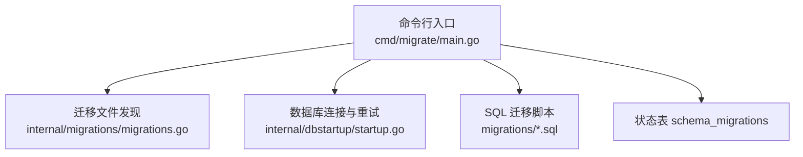
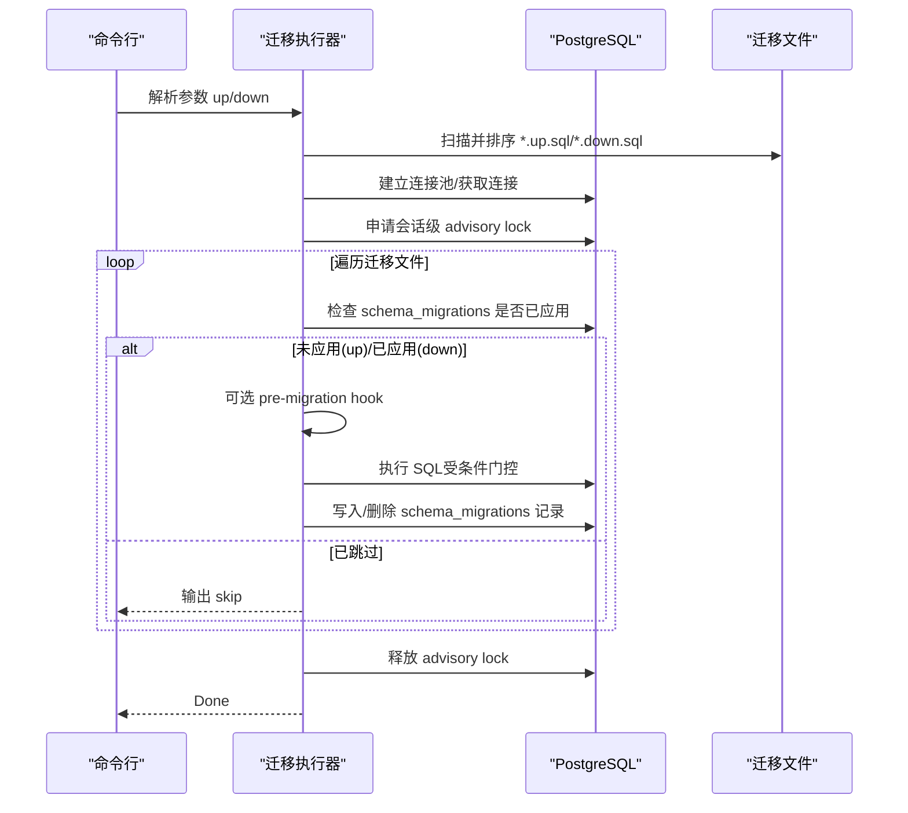
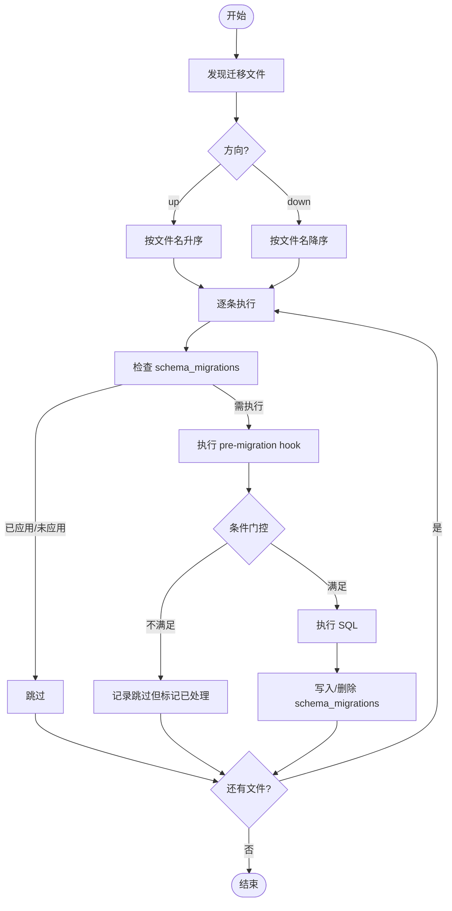
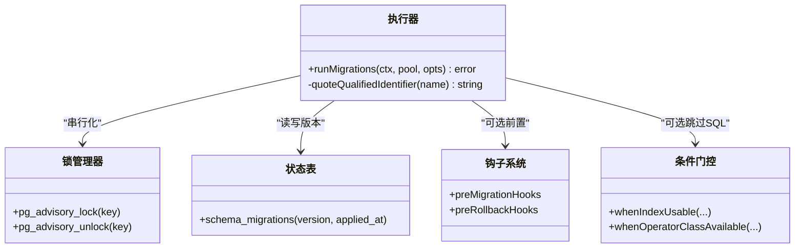
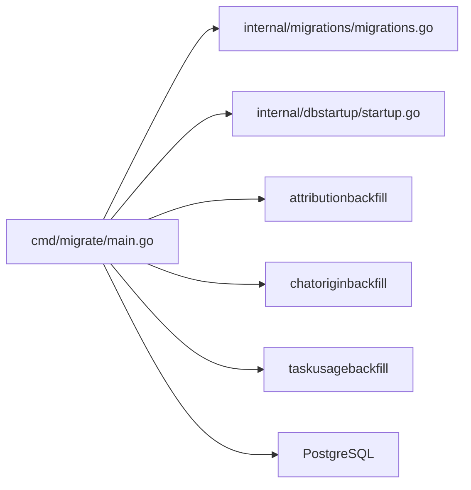

# 数据迁移系统

<cite>
**本文引用的文件**
- [server/cmd/migrate/main.go](file://server/cmd/migrate/main.go)
- [server/internal/migrations/migrations.go](file://server/internal/migrations/migrations.go)
- [server/internal/dbstartup/startup.go](file://server/internal/dbstartup/startup.go)
- [server/migrations/001_init.up.sql](file://server/migrations/001_init.up.sql)
- [server/migrations/002_agent_config.up.sql](file://server/migrations/002_agent_config.up.sql)
</cite>

## 目录
1. [简介](#简介)
2. [项目结构](#项目结构)
3. [核心组件](#核心组件)
4. [架构总览](#架构总览)
5. [详细组件分析](#详细组件分析)
6. [依赖关系分析](#依赖关系分析)
7. [性能考虑](#性能考虑)
8. [故障排查指南](#故障排查指南)
9. [结论](#结论)
10. [附录](#附录)

## 简介
本文件系统性梳理 Multica 的数据迁移系统，覆盖迁移文件管理策略（版本控制、命名规范、依赖关系）、执行流程（发现、顺序执行、状态跟踪、回滚）、并发安全（锁机制、幂等性、冲突处理）、最佳实践（原子性、一致性、性能），以及开发与生产环境的测试、调试、部署与监控告警、故障恢复方案。目标是帮助读者在不深入源码的情况下也能理解并安全地演进数据库结构。

## 项目结构
- 迁移执行入口：server/cmd/migrate/main.go
- 迁移文件发现与排序：server/internal/migrations/migrations.go
- 数据库连接与重试：server/internal/dbstartup/startup.go
- SQL 迁移脚本：server/migrations/*.sql（每个 .up.sql/.down.sql 对应一个迁移）

图表来源
- [server/cmd/migrate/main.go:688-769](file://server/cmd/migrate/main.go#L688-L769)
- [server/internal/migrations/migrations.go:20-72](file://server/internal/migrations/migrations.go#L20-L72)
- [server/internal/dbstartup/startup.go:120-127](file://server/internal/dbstartup/startup.go#L120-L127)

章节来源
- [server/cmd/migrate/main.go:688-769](file://server/cmd/migrate/main.go#L688-L769)
- [server/internal/migrations/migrations.go:20-72](file://server/internal/migrations/migrations.go#L20-L72)
- [server/internal/dbstartup/startup.go:120-127](file://server/internal/dbstartup/startup.go#L120-L127)

## 核心组件
- 迁移文件发现与排序：根据当前工作目录或可执行路径向上搜索 migrations 目录，按文件名升序（up）或降序（down）返回待执行文件列表。
- 迁移执行器：使用单条会话级 advisory lock 串行化多副本/手动迁移；维护 schema_migrations 记录已应用/回滚的版本；支持 pre-migration hook 与环境条件门控。
- 数据库启动与重试：统一的连接超时、指数退避重试、可配置启动预算，区分瞬态错误与非瞬态错误。
- 索引重建防护：对 CREATE INDEX CONCURRENTLY 的失败中断提供清理钩子，避免 INVALID 索引被误判为成功。

章节来源
- [server/internal/migrations/migrations.go:20-101](file://server/internal/migrations/migrations.go#L20-L101)
- [server/cmd/migrate/main.go:327-445](file://server/cmd/migrate/main.go#L327-L445)
- [server/cmd/migrate/main.go:571-602](file://server/cmd/migrate/main.go#L571-L602)
- [server/internal/dbstartup/startup.go:175-294](file://server/internal/dbstartup/startup.go#L175-L294)

## 架构总览
迁移系统以“命令驱动 + 文件驱动”的方式运行：命令行决定方向（up/down），文件系统提供有序迁移集，执行器通过 advisory lock 保证串行，并通过 schema_migrations 实现幂等与可回滚。

图表来源
- [server/cmd/migrate/main.go:688-919](file://server/cmd/migrate/main.go#L688-L919)
- [server/internal/migrations/migrations.go:52-92](file://server/internal/migrations/migrations.go#L52-L92)

## 详细组件分析

### 迁移文件管理与版本控制
- 版本控制：每个迁移由文件名前缀编号（如 001、002）表示版本，按字典序确定执行顺序。
- 命名规范：成对存在 .up.sql（升级）与 .down.sql（回滚）。执行器根据方向选择后缀。
- 依赖关系：强依赖顺序执行；复杂变更拆分为多个小步迁移，必要时通过 pre-migration hook 在 DDL 之前完成数据准备。
- 发现策略：从当前目录或可执行目录向上最多四层搜索 migrations 目录，确保本地开发、容器内、二进制直跑均能定位。

章节来源
- [server/internal/migrations/migrations.go:20-72](file://server/internal/migrations/migrations.go#L20-L72)
- [server/internal/migrations/migrations.go:74-101](file://server/internal/migrations/migrations.go#L74-L101)
- [server/migrations/001_init.up.sql](file://server/migrations/001_init.up.sql)
- [server/migrations/002_agent_config.up.sql](file://server/migrations/002_agent_config.up.sql)

### 迁移执行流程
- 迁移发现：Files(direction) 返回排序后的文件列表；AllVersions() 用于健康检查，确保所有 up 版本均已记录到 schema_migrations。
- 顺序执行：按 up 升序、down 降序依次执行。
- 状态跟踪：schema_migrations(version, applied_at) 记录每个版本的执行结果；重复执行自动跳过。
- 回滚机制：down 方向会读取已应用的版本并反向执行对应 .down.sql；部分场景通过 pre-rollback hook 阻止危险回滚。

图表来源
- [server/cmd/migrate/main.go:782-919](file://server/cmd/migrate/main.go#L782-L919)
- [server/internal/migrations/migrations.go:52-92](file://server/internal/migrations/migrations.go#L52-L92)

章节来源
- [server/cmd/migrate/main.go:782-919](file://server/cmd/migrate/main.go#L782-L919)
- [server/internal/migrations/migrations.go:52-92](file://server/internal/migrations/migrations.go#L52-L92)

### 并发安全与幂等性
- 串行化锁：使用 PostgreSQL 会话级 advisory lock（固定 key）保证同一数据库上仅有一个迁移进程在执行；其他进程排队等待。
- 幂等设计：每次执行前先查 schema_migrations，已执行的 up 或已回滚的 down 直接跳过；pre-migration hook 也要求幂等。
- 冲突处理：CREATE INDEX CONCURRENTLY 可能因中断留下 INVALID 索引；通过 concurrentIndexCleanups 映射在迁移前清理无效对象，避免 IF NOT EXISTS 误判成功。
- 环境门控：up 迁移可通过 whenIndexUsable / whenOperatorClassAvailable 等条件函数决定是否执行 SQL，但仍记录版本，避免阻塞后续迁移。

图表来源
- [server/cmd/migrate/main.go:639-651](file://server/cmd/migrate/main.go#L639-L651)
- [server/cmd/migrate/main.go:803-833](file://server/cmd/migrate/main.go#L803-L833)
- [server/cmd/migrate/main.go:327-445](file://server/cmd/migrate/main.go#L327-L445)
- [server/cmd/migrate/main.go:571-602](file://server/cmd/migrate/main.go#L571-L602)

章节来源
- [server/cmd/migrate/main.go:639-651](file://server/cmd/migrate/main.go#L639-L651)
- [server/cmd/migrate/main.go:803-833](file://server/cmd/migrate/main.go#L803-L833)
- [server/cmd/migrate/main.go:327-445](file://server/cmd/migrate/main.go#L327-L445)
- [server/cmd/migrate/main.go:571-602](file://server/cmd/migrate/main.go#L571-L602)

### 预迁移钩子与环境条件
- 预迁移钩子：针对特定版本在 SQL 执行前运行，常用于数据回填、清理无效对象、校验环境等；失败时中止迁移且不会更新 schema_migrations，便于下次重试。
- 环境条件：例如当 pg_bigm 扩展可用时才构建 bigram 索引；否则跳过该 SQL 但仍记录版本，避免阻塞后续迁移。
- 回滚保护：某些历史迁移不允许回滚（如 channel chat route history），pre-rollback hook 会在回滚前进行数据存在性检查并拒绝。

章节来源
- [server/cmd/migrate/main.go:327-445](file://server/cmd/migrate/main.go#L327-L445)
- [server/cmd/migrate/main.go:369-395](file://server/cmd/migrate/main.go#L369-L395)

### 数据库启动与重试
- 连接池创建：统一解析 DATABASE_URL 与 connect_timeout，设置拨号超时。
- 启动重试：基于指数退避+抖动，限制最大退避与总启动预算；可注入 Sleep/Jitter 以便测试。
- 瞬态错误识别：网络错误、连接数过多、管理员关闭等归类为瞬态，触发重试；SQL 错误或迁移定义错误立即失败。

章节来源
- [server/internal/dbstartup/startup.go:120-127](file://server/internal/dbstartup/startup.go#L120-L127)
- [server/internal/dbstartup/startup.go:175-294](file://server/internal/dbstartup/startup.go#L175-L294)

## 依赖关系分析
- 执行器依赖：
  - 迁移文件发现：internal/migrations/migrations.go
  - 数据库连接与重试：internal/dbstartup/startup.go
  - 业务回填：attributionbackfill、chatoriginbackfill、taskusagebackfill（作为 pre-migration hooks）
- 外部依赖：
  - PostgreSQL：advisory lock、schema_migrations、索引重建、扩展（如 pg_bigm）
  - 环境变量：DATABASE_URL、MULTICA_DATABASE_STARTUP_TIMEOUT、MULTICA_DATABASE_CONNECT_TIMEOUT

图表来源
- [server/cmd/migrate/main.go:1-21](file://server/cmd/migrate/main.go#L1-L21)
- [server/cmd/migrate/main.go:604-637](file://server/cmd/migrate/main.go#L604-L637)

章节来源
- [server/cmd/migrate/main.go:1-21](file://server/cmd/migrate/main.go#L1-L21)
- [server/cmd/migrate/main.go:604-637](file://server/cmd/migrate/main.go#L604-L637)

## 性能考虑
- 索引构建：大量迁移使用 CREATE INDEX CONCURRENTLY，避免阻塞在线查询；配合清理钩子防止中断导致的 INVALID 索引残留。
- 批量回填：任务用量小时汇总、归属关系修复等通过专用回填工具在迁移前执行，减少大事务风险。
- 条件门控：仅在具备所需扩展/操作符类时构建优化索引，避免在无扩展环境中失败或降级。
- 连接与重试：合理的 connect_timeout 与启动超时，避免长时间阻塞；指数退避+抖动降低雪崩风险。

章节来源
- [server/cmd/migrate/main.go:141-301](file://server/cmd/migrate/main.go#L141-L301)
- [server/cmd/migrate/main.go:571-602](file://server/cmd/migrate/main.go#L571-L602)
- [server/internal/dbstartup/startup.go:175-294](file://server/internal/dbstartup/startup.go#L175-L294)

## 故障排查指南
- 无法找到迁移目录：确认工作目录或可执行路径下存在 migrations 目录；检查 ResolveDir 搜索根与深度。
- 数据库不可用：检查 DATABASE_URL、网络连通、连接数上限；观察启动重试日志与瞬态错误分类。
- 迁移卡住：确认是否存在另一个迁移进程持有 advisory lock；等待其释放或排查异常进程。
- 索引失效：若迁移后查询退化，检查是否有 INVALID 索引未被清理；必要时手动 DROP INDEX CONCURRENTLY 并重新执行迁移。
- 回滚被拒：某些历史迁移禁止回滚；先通过应用层清理数据再重试。

章节来源
- [server/internal/migrations/migrations.go:20-42](file://server/internal/migrations/migrations.go#L20-L42)
- [server/internal/dbstartup/startup.go:268-294](file://server/internal/dbstartup/startup.go#L268-L294)
- [server/cmd/migrate/main.go:369-395](file://server/cmd/migrate/main.go#L369-L395)

## 结论
Multica 的迁移系统以“文件即版本、执行即幂等、锁即串行”为核心原则，结合 pre-migration hook、环境条件门控与索引重建防护，实现了在生产环境下安全、可控、可回滚的数据库演进能力。通过统一的启动重试与瞬态错误识别，提升了部署鲁棒性。遵循本文的最佳实践与开发指南，可在保障一致性的前提下高效推进数据模型迭代。

## 附录

### 迁移最佳实践
- 原子性：将相关变更拆分为多个小步迁移，尽量保持单语句或短事务；需要长事务时使用分批回填。
- 一致性：DDL 与数据变更分离，必要时通过 hook 先行回填；严格约束与唯一索引放在最后阶段 VALIDATE。
- 性能：优先使用 CONCURRENTLY 建索引；利用条件门控按需构建优化索引；避免在大表上长时间独占锁。

### 迁移开发指南
- 测试策略：
  - 单元测试：覆盖条件门控、hook 行为、索引清理逻辑。
  - 集成测试：使用独立 schema_migrations 表与临时迁移目录，模拟 up/down 全流程。
- 调试方法：
  - 打印执行日志：关注 skip/apply 输出与 hook 日志。
  - 检查 schema_migrations：确认版本记录与预期一致。
- 部署流程：
  - 容器启动时先运行 migrate up，成功后再启动服务。
  - 设置合理的启动超时与连接超时；监控迁移耗时与失败率。

### 生产安全措施、监控告警与故障恢复
- 安全措施：
  - 强制串行：依赖 advisory lock，避免多副本同时迁移。
  - 回滚保护：对危险回滚增加数据存在性检查。
  - 环境隔离：不同环境使用不同的 DATABASE_URL 与启动超时。
- 监控告警：
  - 指标：迁移开始/结束时间、失败次数、重试次数、索引重建耗时。
  - 告警：连续失败、超过启动超时、长时间持有 advisory lock。
- 故障恢复：
  - 瞬态错误：自动重试；非瞬态错误立即失败并人工介入。
  - 中断恢复：再次执行 migrate up/down 会自动跳过已完成项；必要时清理 INVALID 索引后重试。