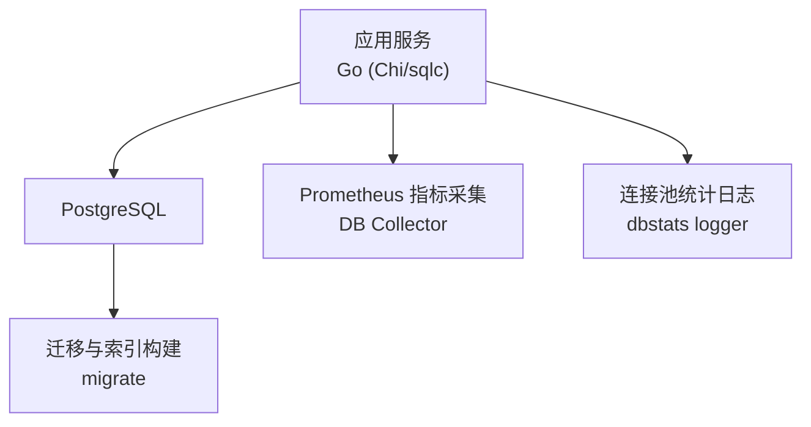
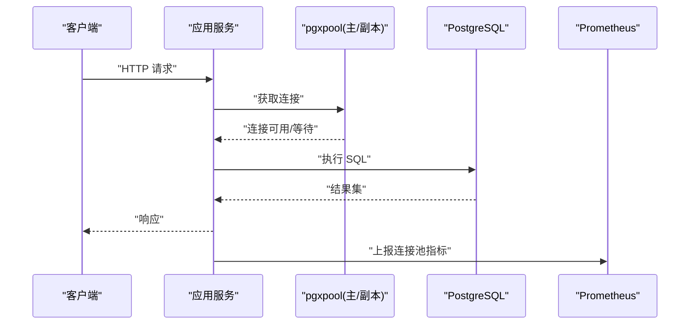
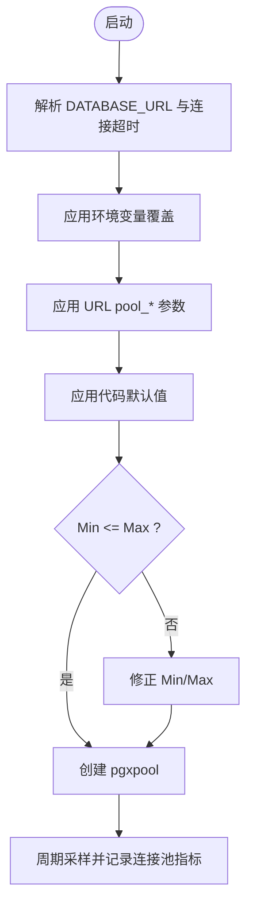
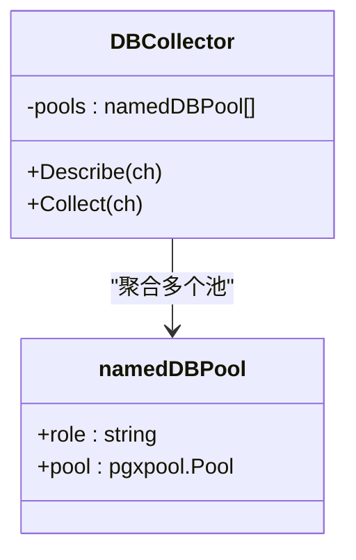
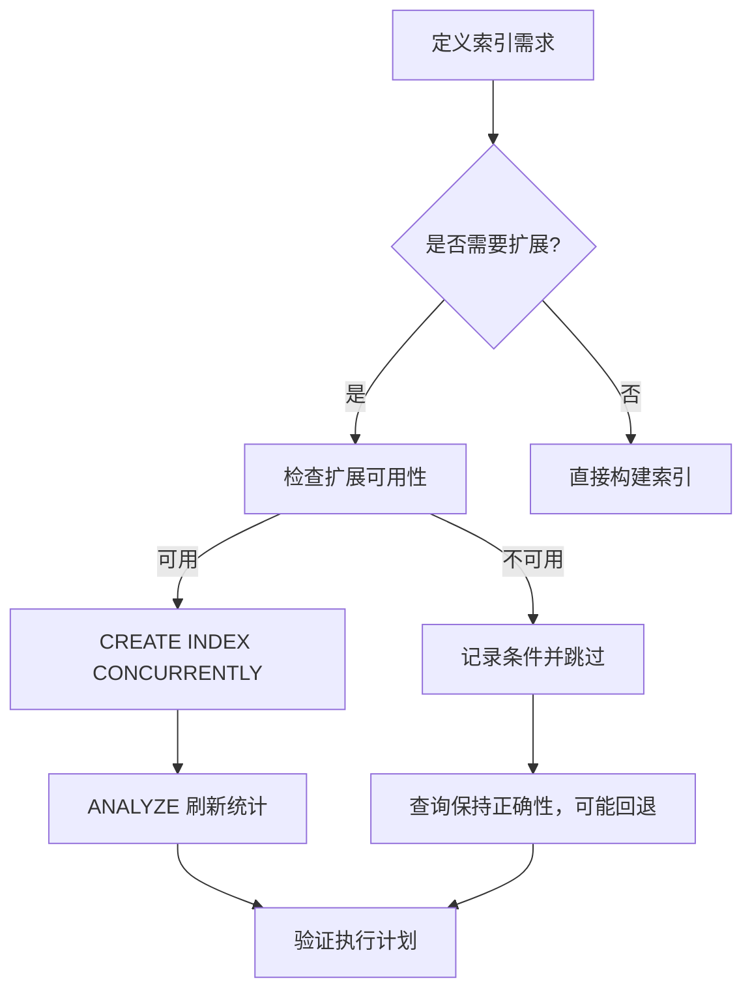
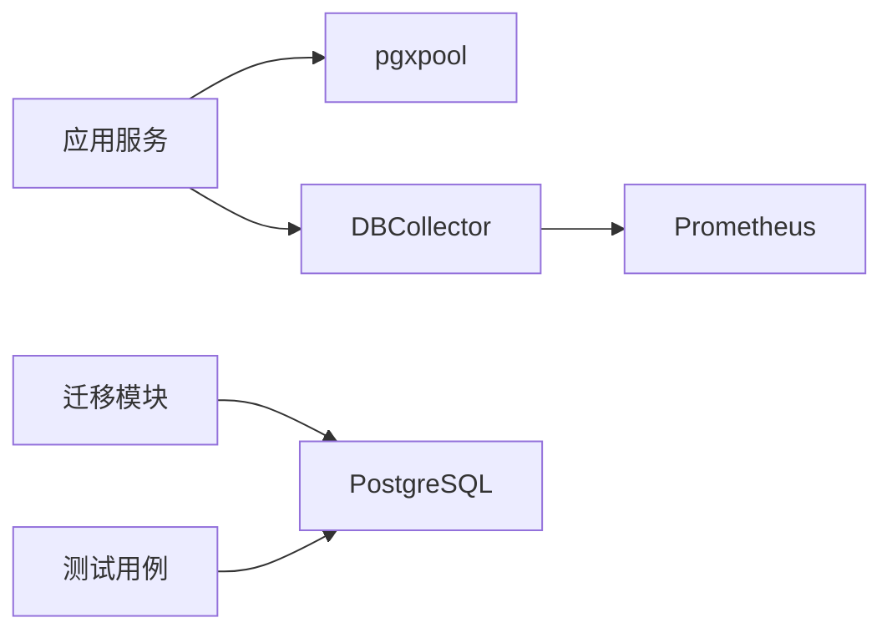

# 查询性能优化

<cite>
**本文引用的文件**
- [dbstats.go](file://server/cmd/server/dbstats.go)
- [db.go](file://server/internal/metrics/db.go)
- [migrate/main.go](file://server/cmd/migrate/main.go)
- [447_issue_properties_bigm_index_statistics.up.sql](file://server/migrations/447_issue_properties_bigm_index_statistics.up.sql)
- [447_issue_properties_bigm_index_statistics.down.sql](file://server/migrations/447_issue_properties_bigm_index_statistics.down.sql)
- [migrate_redundant_indexes_test.go](file://server/cmd/migrate/migrate_redundant_indexes_test.go)
- [migrate_issue_properties_bigm_index_test.go](file://server/cmd/migrate/migrate_issue_properties_bigm_index_test.go)
- [SELF_HOSTING_ADVANCED.md](file://SELF_HOSTING_ADVANCED.md)
</cite>

## 目录
1. [简介](#简介)
2. [项目结构](#项目结构)
3. [核心组件](#核心组件)
4. [架构总览](#架构总览)
5. [详细组件分析](#详细组件分析)
6. [依赖关系分析](#依赖关系分析)
7. [性能考量](#性能考量)
8. [故障排查指南](#故障排查指南)
9. [结论](#结论)
10. [附录](#附录)

## 简介
本文件聚焦 Multica 后端在 PostgreSQL 上的查询性能优化，覆盖以下主题：
- 查询性能分析方法：执行计划分析、慢查询日志、性能指标监控
- 索引优化策略：B-tree、GIN、部分索引、复合索引设计原则
- 查询优化技巧：避免 N+1 查询、合理使用 JOIN、分页优化、大数据量处理
- 数据库调优参数：连接池大小、内存配置、查询超时设置
- 性能监控工具使用：pg_stat_statements、EXPLAIN ANALYZE、查询分析器
- 常见瓶颈识别、优化案例与持续监控策略

## 项目结构
Multica 后端采用 Go（Chi 路由 + sqlc + gorilla/websocket），数据库为 PostgreSQL。迁移与索引变更遵循“每个索引独立单语句迁移”的规范；生产环境通过 pgxpool 管理连接池，并暴露 Prometheus 指标用于观测。

图表来源
- [dbstats.go:105-154](file://server/cmd/server/dbstats.go#L105-L154)
- [db.go:31-55](file://server/internal/metrics/db.go#L31-L55)
- [migrate/main.go:64-83](file://server/cmd/migrate/main.go#L64-L83)

章节来源
- [dbstats.go:105-154](file://server/cmd/server/dbstats.go#L105-L154)
- [db.go:31-55](file://server/internal/metrics/db.go#L31-L55)
- [migrate/main.go:64-83](file://server/cmd/migrate/main.go#L64-L83)

## 核心组件
- 连接池与容量规划：基于环境变量与 URL 参数的 pgxpool 配置，提供主库与只读副本双池，默认值经过生产验证，避免连接耗尽导致的尾部延迟。
- 指标采集：DBCollector 将连接池状态以 Prometheus 指标暴露，便于告警与可视化。
- 迁移与索引：迁移框架支持可选扩展（如 pg_bigm）的 GIN 表达式索引，并在必要时刷新统计信息，确保优化器正确选择索引。

章节来源
- [dbstats.go:17-52](file://server/cmd/server/dbstats.go#L17-L52)
- [dbstats.go:114-154](file://server/cmd/server/dbstats.go#L114-L154)
- [db.go:8-55](file://server/internal/metrics/db.go#L8-L55)
- [migrate/main.go:64-83](file://server/cmd/migrate/main.go#L64-L83)

## 架构总览
下图展示了从请求到数据库访问的关键路径，以及连接池与指标采集的交互。

图表来源
- [dbstats.go:105-154](file://server/cmd/server/dbstats.go#L105-L154)
- [db.go:82-101](file://server/internal/metrics/db.go#L82-L101)

## 详细组件分析

### 连接池与容量规划（主库与副本）
- 默认容量：主库 MaxConns=25、MinConns=5；副本 MaxConns=10、MinConns=0，避免冷启动握手成本与空闲连接浪费。
- 优先级：环境变量 > URL 中的 pool_* 参数 > 代码默认值；严格拒绝回退到 pgx 内置默认（过小导致生产问题）。
- 副本安全：强制 read-only 校验（除非显式指定 standby），并限制最大连接生命周期，降低主从切换期间的风险。
- 运行时观测：周期性记录连接池压力（等待次数、平均等待时间、取消次数等），发现连接耗尽迹象。

图表来源
- [dbstats.go:105-154](file://server/cmd/server/dbstats.go#L105-L154)
- [dbstats.go:213-291](file://server/cmd/server/dbstats.go#L213-L291)

章节来源
- [dbstats.go:17-52](file://server/cmd/server/dbstats.go#L17-L52)
- [dbstats.go:114-154](file://server/cmd/server/dbstats.go#L114-L154)
- [dbstats.go:213-291](file://server/cmd/server/dbstats.go#L213-L291)
- [SELF_HOSTING_ADVANCED.md:17-27](file://SELF_HOSTING_ADVANCED.md#L17-L27)

### 指标采集与可观测性
- 指标维度：按角色（primary/replica）暴露已获取连接数、空闲连接数、最大连接数、总连接数、正在建立连接数、获取次数、获取耗时、空池等待次数、取消获取次数、新建连接数、销毁计数等。
- 用途：结合 Grafana/Prometheus 进行容量规划、异常告警与根因定位（例如 EmptyAcquireCount 突增通常意味着连接池耗尽）。

图表来源
- [db.go:8-55](file://server/internal/metrics/db.go#L8-L55)
- [db.go:82-101](file://server/internal/metrics/db.go#L82-L101)

章节来源
- [db.go:8-55](file://server/internal/metrics/db.go#L8-L55)
- [db.go:82-101](file://server/internal/metrics/db.go#L82-L101)

### 索引设计与迁移（B-tree、GIN、部分索引、复合索引）
- 迁移约束：新增索引必须使用 CREATE INDEX CONCURRENTLY，且每个索引独立单语句迁移，保证在线无锁构建。
- GIN 表达式索引：针对全文检索场景（如 issue.properties 文本匹配），在可选扩展 pg_bigm 下构建 GIN 表达式索引；若扩展不可用，查询仍保持正确性但可能走回退路径。
- 统计信息刷新：表达式索引不会自动收集表达式统计，需单独运行 ANALYZE 刷新统计，否则优化器可能忽略索引。
- 冗余索引检测：测试中通过 EXPLAIN 断言查询计划是否命中预期索引，辅助回归与回归验证。

图表来源
- [migrate/main.go:64-83](file://server/cmd/migrate/main.go#L64-L83)
- [447_issue_properties_bigm_index_statistics.up.sql:1-22](file://server/migrations/447_issue_properties_bigm_index_statistics.up.sql#L1-L22)
- [447_issue_properties_bigm_index_statistics.down.sql:1-3](file://server/migrations/447_issue_properties_bigm_index_statistics.down.sql#L1-L3)
- [migrate_redundant_indexes_test.go:301-325](file://server/cmd/migrate/migrate_redundant_indexes_test.go#L301-L325)

章节来源
- [migrate/main.go:64-83](file://server/cmd/migrate/main.go#L64-L83)
- [447_issue_properties_bigm_index_statistics.up.sql:1-22](file://server/migrations/447_issue_properties_bigm_index_statistics.up.sql#L1-L22)
- [447_issue_properties_bigm_index_statistics.down.sql:1-3](file://server/migrations/447_issue_properties_bigm_index_statistics.down.sql#L1-L3)
- [migrate_redundant_indexes_test.go:301-325](file://server/cmd/migrate/migrate_redundant_indexes_test.go#L301-L325)
- [migrate_issue_properties_bigm_index_test.go:106-248](file://server/cmd/migrate/migrate_issue_properties_bigm_index_test.go#L106-L248)

### 查询优化技巧与实践
- 避免 N+1 查询：在服务层合并多次查询，减少往返；对批量读取使用 IN 或 JOIN 替代循环。
- 合理使用 JOIN：优先使用选择性高的过滤条件驱动 JOIN，避免大表全表扫描后再关联。
- 分页优化：使用基于游标或范围键的分页（如 id 范围），避免深 offset；配合合适索引提升排序与过滤效率。
- 大数据量处理：拆分批处理任务、使用增量更新、读写分离（副本读）、异步化非关键路径。

[本节为通用实践说明，不直接分析具体文件]

### 数据库调优参数
- 连接池大小：主库默认 MaxConns=25、MinConns=5；副本默认 MaxConns=10、MinConns=0；可通过环境变量或 URL 参数覆盖。
- 连接生命周期：副本连接最大生命周期默认 5 分钟，降低主从切换期间连接失效风险。
- 查询超时：建议结合业务 SLA 设置合理的查询超时与事务超时，避免长事务占用连接。
- 内存与缓存：根据实例规格调整 shared_buffers、work_mem、maintenance_work_mem 等（由运维侧配置）。

章节来源
- [dbstats.go:17-52](file://server/cmd/server/dbstats.go#L17-L52)
- [dbstats.go:114-154](file://server/cmd/server/dbstats.go#L114-L154)
- [SELF_HOSTING_ADVANCED.md:17-27](file://SELF_HOSTING_ADVANCED.md#L17-L27)

## 依赖关系分析
- 应用服务依赖 pgxpool 进行连接复用与限流；通过 DBCollector 暴露指标至 Prometheus。
- 迁移模块依赖 PostgreSQL 系统视图与扩展能力，确保索引构建与统计信息刷新正确。
- 测试用例通过 EXPLAIN 断言执行计划，保障索引有效性。

图表来源
- [dbstats.go:105-154](file://server/cmd/server/dbstats.go#L105-L154)
- [db.go:82-101](file://server/internal/metrics/db.go#L82-L101)
- [migrate_redundant_indexes_test.go:301-325](file://server/cmd/migrate/migrate_redundant_indexes_test.go#L301-L325)

章节来源
- [dbstats.go:105-154](file://server/cmd/server/dbstats.go#L105-L154)
- [db.go:82-101](file://server/internal/metrics/db.go#L82-L101)
- [migrate_redundant_indexes_test.go:301-325](file://server/cmd/migrate/migrate_redundant_indexes_test.go#L301-L325)

## 性能考量
- 连接池饱和是常见瓶颈：EmptyAcquireCount 与 AcquireDuration 上升往往指示需要扩容或优化慢查询。
- 索引未生效多因统计缺失：表达式索引需 ANALYZE 刷新统计，否则优化器可能误判。
- 大表查询应优先利用选择性高的过滤条件与合适的索引类型（B-tree 用于等值/范围，GIN 用于全文/数组/JSON 等）。
- 分页与排序：尽量使用有序主键或唯一列作为游标，避免深 offset 带来的性能退化。
- 读写分离：将聚合类读负载导向副本，减轻主库压力。

[本节为通用指导，不直接分析具体文件]

## 故障排查指南
- 连接池耗尽：观察 dbstats 日志中的 empty_acquire_delta 与 canceled_acquire_delta；结合 Prometheus 指标确认峰值与趋势。
- 索引未命中：使用 EXPLAIN (COSTS OFF) 查看计划；若为表达式索引，确认已运行 ANALYZE 刷新统计。
- 慢查询定位：开启 pg_stat_statements 并按 total_time、calls 排序；结合 EXPLAIN ANALYZE 定位热点节点。
- 迁移后性能回退：检查是否有冗余索引或统计过时；必要时重建索引并刷新统计。

章节来源
- [dbstats.go:213-291](file://server/cmd/server/dbstats.go#L213-L291)
- [migrate_redundant_indexes_test.go:301-325](file://server/cmd/migrate/migrate_redundant_indexes_test.go#L301-L325)
- [447_issue_properties_bigm_index_statistics.up.sql:1-22](file://server/migrations/447_issue_properties_bigm_index_statistics.up.sql#L1-L22)

## 结论
Multica 在后端层面通过严格的连接池容量规划、完善的指标采集与迁移框架，构建了稳定的数据库访问基线。结合正确的索引设计（B-tree/GIN/部分/复合）、查询优化技巧与持续的监控策略，可有效识别并消除常见性能瓶颈，保障在高并发与大数据量场景下的稳定与高效。

## 附录
- 常用命令参考
  - EXPLAIN (COSTS OFF) <SQL>：查看执行计划
  - EXPLAIN ANALYZE <SQL>：查看实际执行时间与计划
  - SELECT * FROM pg_stat_statements ORDER BY total_time DESC LIMIT 20;：定位慢查询
- 指标看板建议
  - multica_db_pool_empty_acquire_count{role="primary"}：连接池等待次数
  - multica_db_pool_acquire_duration_seconds_total{role="primary"}：连接获取总耗时
  - multica_db_pool_idle_conns{role="primary"}：空闲连接数

[本节为补充信息，不直接分析具体文件]