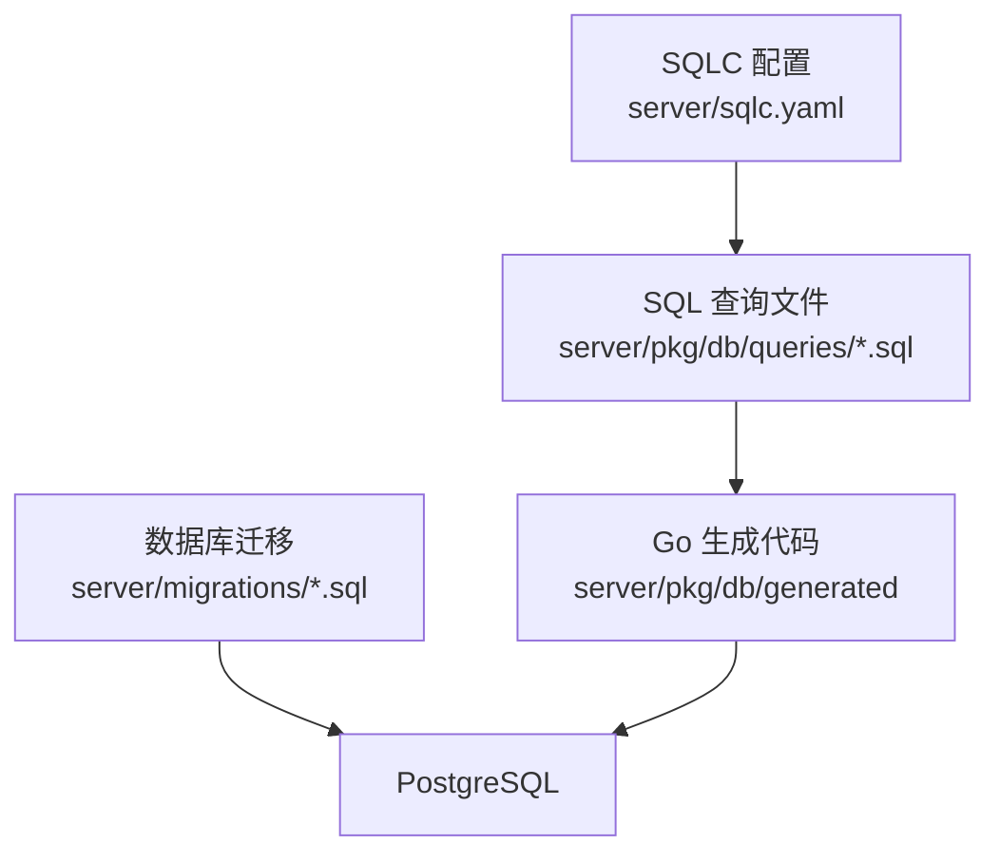
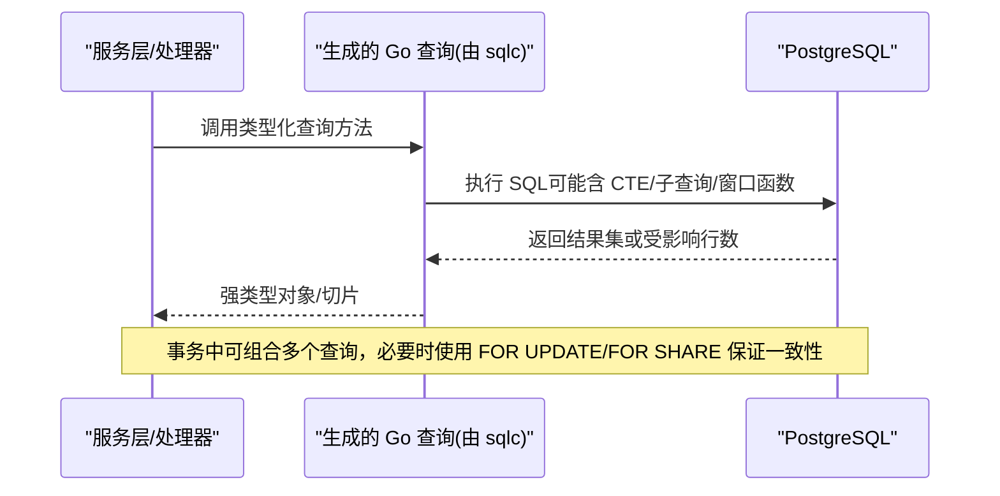
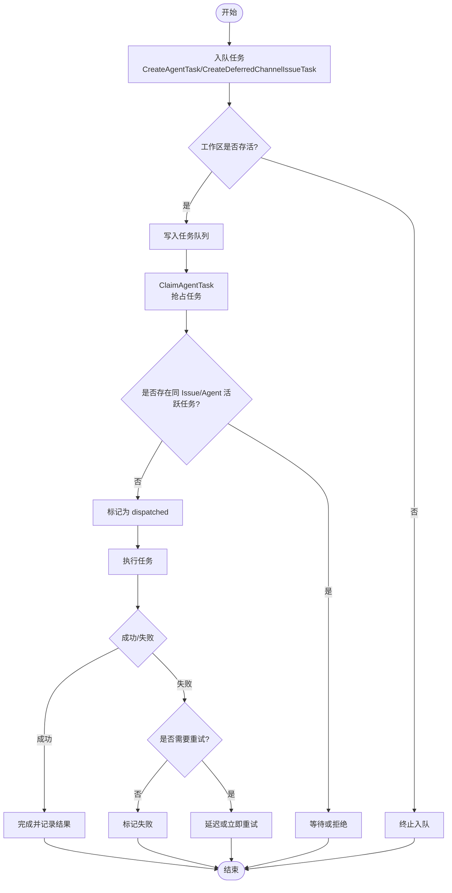
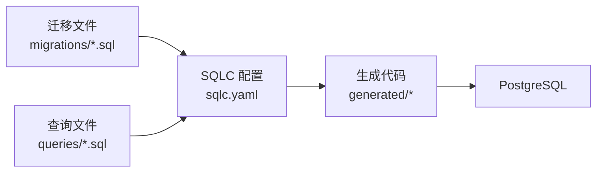

# 查询管理与 SQLC

<cite>
**本文引用的文件**
- [server/sqlc.yaml](file://server/sqlc.yaml)
- [server/pkg/db/queries/agent.sql](file://server/pkg/db/queries/agent.sql)
- [server/pkg/db/queries/issue.sql](file://server/pkg/db/queries/issue.sql)
- [server/pkg/db/queries/workspace.sql](file://server/pkg/db/queries/workspace.sql)
- [server/migrations/001_init.up.sql](file://server/migrations/001_init.up.sql)
</cite>

## 目录
1. [简介](#简介)
2. [项目结构](#项目结构)
3. [核心组件](#核心组件)
4. [架构总览](#架构总览)
5. [详细组件分析](#详细组件分析)
6. [依赖关系分析](#依赖关系分析)
7. [性能考量](#性能考量)
8. [故障排查指南](#故障排查指南)
9. [结论](#结论)
10. [附录](#附录)

## 简介
本文件面向 Multica 后端的查询管理与 SQLC 代码生成体系，聚焦以下目标：
- 解释 SQLC 配置与使用方式：SQL 文件组织、类型生成、查询接口设计。
- 说明查询文件的组织结构：按业务域划分、命名规范、注释规范。
- 解析生成的 Go 代码结构：查询函数、类型定义、错误处理（基于 sqlc 约定）。
- 提供复杂查询编写技巧：JOIN 优化、子查询、窗口函数、CTE 使用。
- 给出查询性能分析方法、执行计划解读与索引优化建议。
- 重点说明事务中的查询模式、批量操作优化与查询缓存策略。

## 项目结构
Multica 后端采用“按业务域拆分 SQL 查询”的组织方式，配合 SQLC 将 SQL 编译为类型安全的 Go 客户端。关键路径如下：
- SQLC 配置：server/sqlc.yaml
- SQL 查询文件：server/pkg/db/queries/*.sql（按 agent、issue、workspace 等业务域组织）
- 数据库迁移：server/migrations/*.sql（定义表结构与索引）
- 生成代码输出：server/pkg/db/generated（由 sqlc 生成，包含 db 包下的类型与查询方法）

图表来源
- [server/sqlc.yaml:1-13](file://server/sqlc.yaml#L1-L13)
- [server/migrations/001_init.up.sql:1-178](file://server/migrations/001_init.up.sql#L1-L178)

章节来源
- [server/sqlc.yaml:1-13](file://server/sqlc.yaml#L1-L13)
- [server/migrations/001_init.up.sql:1-178](file://server/migrations/001_init.up.sql#L1-L178)

## 核心组件
- SQLC 配置（engine、schema、queries、go 输出参数）
- 查询文件（按业务域组织，使用 sqlc 注解声明查询语义）
- 迁移文件（表结构、约束、索引；遵循并发创建索引的规范）
- 生成代码（类型安全的方法与结构体，便于在 service/handler 层调用）

章节来源
- [server/sqlc.yaml:1-13](file://server/sqlc.yaml#L1-L13)
- [server/pkg/db/queries/agent.sql:1-800](file://server/pkg/db/queries/agent.sql#L1-L800)
- [server/pkg/db/queries/issue.sql:1-613](file://server/pkg/db/queries/issue.sql#L1-L613)
- [server/pkg/db/queries/workspace.sql:1-240](file://server/pkg/db/queries/workspace.sql#L1-L240)
- [server/migrations/001_init.up.sql:1-178](file://server/migrations/001_init.up.sql#L1-L178)

## 架构总览
下图展示了从 SQL 到 Go 的类型化查询，再到 PostgreSQL 的执行链路，以及事务与锁的使用模式。

图表来源
- [server/sqlc.yaml:1-13](file://server/sqlc.yaml#L1-L13)
- [server/pkg/db/queries/agent.sql:1-800](file://server/pkg/db/queries/agent.sql#L1-L800)
- [server/pkg/db/queries/issue.sql:1-613](file://server/pkg/db/queries/issue.sql#L1-L613)
- [server/pkg/db/queries/workspace.sql:1-240](file://server/pkg/db/queries/workspace.sql#L1-L240)

## 详细组件分析

### SQLC 配置与生成规则
- 引擎：postgresql
- 查询目录：pkg/db/queries/
- 迁移目录：migrations/
- 生成包名：db
- 输出目录：pkg/db/generated
- 驱动：pgx/v5
- 启用 JSON 标签与空切片初始化

这些设置决定了生成的 Go 代码风格与行为，例如：
- 每个 -- name: ... :many/:one/:exec 会生成对应的方法签名与返回类型。
- emit_json_tags=true 使结构体字段附带 json 标签，便于序列化。
- emit_empty_slices=true 确保空结果以空切片返回而非 nil，简化上层判断。

章节来源
- [server/sqlc.yaml:1-13](file://server/sqlc.yaml#L1-L13)

### 查询文件组织与命名规范
- 按业务域拆分：agent.sql、issue.sql、workspace.sql 等，职责清晰，便于维护。
- 命名规范：文件名小写+下划线，反映领域实体；查询名使用动词短语（如 ListAgents、CreateAgentTask）。
- 注释规范：每条查询前用 -- name: 声明名称与返回模式（:many/:one/:exec），并辅以业务注释说明约束、并发与边界条件。

示例要点（不展示具体 SQL 内容）：
- agent.sql 中包含大量任务队列相关查询，体现复杂状态机与重试、延迟、优先级等逻辑。
- issue.sql 包含列表、更新、删除、去重、属性过滤等，广泛使用 CTE、子查询与 JSONB 操作。
- workspace.sql 提供工作区级联清理与锁机制，保障删除一致性与并发安全。

章节来源
- [server/pkg/db/queries/agent.sql:1-800](file://server/pkg/db/queries/agent.sql#L1-L800)
- [server/pkg/db/queries/issue.sql:1-613](file://server/pkg/db/queries/issue.sql#L1-L613)
- [server/pkg/db/queries/workspace.sql:1-240](file://server/pkg/db/queries/workspace.sql#L1-L240)

### 生成的 Go 代码结构（概念性说明）
- 查询函数：每个 -- name: ... :many/:one/:exec 生成一个方法，参数与返回值由 SQL 推导。
- 类型定义：SELECT 列映射为结构体字段；JSONB/数组类型映射为 Go 切片/自定义类型。
- 错误处理：sqlc 根据返回模式区分无行、多行与执行错误；结合 pgx 的错误码进行上层处理。
- 使用方式：在服务层通过 db 包调用类型化方法，避免手写 SQL 字符串与类型转换。

注意：具体生成代码位于 server/pkg/db/generated，由 sqlc 自动生成，不在本仓库中直接编辑。

章节来源
- [server/sqlc.yaml:1-13](file://server/sqlc.yaml#L1-L13)

### 复杂查询编写技巧与实践
- JOIN 优化：
  - 优先在 WHERE 中尽早缩小数据集，减少后续 JOIN 成本。
  - 对高频连接键建立合适索引（如 workspace_id、assignee_type/assignee_id 等）。
- 子查询：
  - 使用 EXISTS 替代 IN 以提升去重与存在性检查的性能。
  - 将复杂过滤下沉到子查询，保持外层简洁。
- 窗口函数：
  - 用于排名、累计、移动平均等场景，避免应用层多次扫描。
- CTE 使用：
  - 将复杂逻辑拆分为可读的 CTE 步骤，便于调试与维护。
  - 注意 PostgreSQL 对 CTE 的物化策略，必要时使用 WITH RECURSIVE 或内联优化。

章节来源
- [server/pkg/db/queries/issue.sql:1-613](file://server/pkg/db/queries/issue.sql#L1-L613)
- [server/pkg/db/queries/agent.sql:1-800](file://server/pkg/db/queries/agent.sql#L1-L800)
- [server/pkg/db/queries/workspace.sql:1-240](file://server/pkg/db/queries/workspace.sql#L1-L240)

### 事务中的查询模式与并发控制
- 行级锁：
  - FOR UPDATE：独占锁定，防止并发修改冲突（如更新 Agent 禁用技能、Issue 描述合并）。
  - FOR SHARE：共享锁，稳定读取关键列（如 runtime_id、archived_at），避免竞态。
  - FOR KEY SHARE：保护外键引用，常用于删除/创建协议中协调会话生命周期。
- 事务边界：
  - 将多个相关查询放入同一事务，保证原子性（如工作区删除时清理关联数据）。
  - 使用 advisory lock 或唯一约束实现跨进程串行化（如重复检测）。
- 批量操作：
  - 使用 ANY() 与数组参数批量更新/插入，减少往返次数。
  - 利用 RETURNING 获取受影响行，便于事件广播与审计。

章节来源
- [server/pkg/db/queries/agent.sql:1-800](file://server/pkg/db/queries/agent.sql#L1-L800)
- [server/pkg/db/queries/issue.sql:1-613](file://server/pkg/db/queries/issue.sql#L1-L613)
- [server/pkg/db/queries/workspace.sql:1-240](file://server/pkg/db/queries/workspace.sql#L1-L240)

### 批量操作与重试机制（以任务队列为例）
- 任务入队：
  - 支持立即入队与延迟入队（deferred），通过 fire_at 调度。
  - 使用 SELECT ... WHERE lock_task_owner_rows(...) 防止工作区销毁后悬挂任务。
- 任务抢占与去重：
  - ClaimAgentTask 通过 per-(issue, agent) 或 per-chat_session 的序列化保证单实例执行。
  - ON CONFLICT DO NOTHING 避免重复重试导致的异常中断。
- 重试与回退：
  - CreateRetryTask 复制父任务上下文，继承归属与证据链，必要时重置会话。
  - 失败分支可设置 fire_at 延迟重试，避免瞬时故障风暴。

图表来源
- [server/pkg/db/queries/agent.sql:1-800](file://server/pkg/db/queries/agent.sql#L1-L800)

章节来源
- [server/pkg/db/queries/agent.sql:1-800](file://server/pkg/db/queries/agent.sql#L1-L800)

### 查询缓存策略（概念性建议）
- 读多写少场景：
  - 对热点列表（如工作区列表、Agent 列表）引入内存缓存（如本地 LRU 或分布式缓存）。
  - 缓存键需包含租户隔离信息（workspace_id），避免跨租户污染。
- 失效策略：
  - 写操作后主动失效相关缓存（如更新 Agent、Issue 状态）。
  - 使用短 TTL + 被动刷新，降低一致性风险。
- 与 SQLC 集成：
  - 在 service 层封装查询方法，统一注入缓存逻辑，保持 SQL 与缓存解耦。

[本节为通用指导，不直接分析具体文件]

## 依赖关系分析
- SQLC 配置依赖迁移目录（schema）与查询目录（queries），生成 Go 代码。
- 查询文件依赖迁移定义的表结构与索引。
- 生成的 Go 代码被服务层调用，最终通过 pgx 驱动访问 PostgreSQL。

图表来源
- [server/sqlc.yaml:1-13](file://server/sqlc.yaml#L1-L13)
- [server/migrations/001_init.up.sql:1-178](file://server/migrations/001_init.up.sql#L1-L178)

章节来源
- [server/sqlc.yaml:1-13](file://server/sqlc.yaml#L1-L13)
- [server/migrations/001_init.up.sql:1-178](file://server/migrations/001_init.up.sql#L1-L178)

## 性能考量
- 执行计划解读：
  - 使用 EXPLAIN/EXPLAIN ANALYZE 查看扫描方式、连接顺序与代价。
  - 关注 Seq Scan 与 Index Scan 的比例，避免全表扫描。
- 索引优化建议：
  - 为高频过滤列建立复合索引（如 workspace_id + status、assignee_type + assignee_id）。
  - 对 JSONB 字段使用 GIN 索引（如 metadata、properties）提升 @> 与 contains 查询性能。
  - 遵循项目规范：迁移中使用 CREATE [UNIQUE] INDEX CONCURRENTLY 且独立语句，避免阻塞生产。
- 查询优化技巧：
  - 尽量使用 EXISTS 替代 IN，减少重复计算。
  - 将复杂过滤下沉到子查询或 CTE，提高可读性与可维护性。
  - 合理使用 LIMIT/OFFSET 或游标分页，避免大偏移量带来的性能退化。

章节来源
- [server/migrations/001_init.up.sql:167-178](file://server/migrations/001_init.up.sql#L167-L178)
- [server/pkg/db/queries/issue.sql:1-613](file://server/pkg/db/queries/issue.sql#L1-L613)

## 故障排查指南
- 常见错误定位：
  - 无行返回：检查 WHERE 条件与租户隔离（workspace_id）是否正确。
  - 并发冲突：确认是否正确使用 FOR UPDATE/FOR SHARE，或是否存在唯一约束冲突。
  - 性能问题：通过 EXPLAIN 分析执行计划，识别慢查询与缺失索引。
- 调试手段：
  - 在 service 层添加日志，记录关键参数与返回行数。
  - 使用测试用例覆盖边界条件（如空集合、NULL 值、并发写入）。
- 事务回滚：
  - 确保事务中所有查询失败时能正确回滚，避免部分提交导致的数据不一致。

章节来源
- [server/pkg/db/queries/agent.sql:1-800](file://server/pkg/db/queries/agent.sql#L1-L800)
- [server/pkg/db/queries/issue.sql:1-613](file://server/pkg/db/queries/issue.sql#L1-L613)
- [server/pkg/db/queries/workspace.sql:1-240](file://server/pkg/db/queries/workspace.sql#L1-L240)

## 结论
Multica 通过 SQLC 实现了类型安全的数据库访问，结合按业务域组织的 SQL 文件与严格的迁移管理，构建了高内聚、低耦合的查询层。复杂查询借助 CTE、子查询与窗口函数表达业务逻辑，事务与锁机制保障并发一致性。通过合理的索引设计与执行计划分析，持续优化查询性能。建议在服务层引入缓存策略，进一步提升读性能。

[本节为总结性内容，不直接分析具体文件]

## 附录
- 术语说明：
  - CTE：公共表表达式，用于拆分复杂查询。
  - JSONB：PostgreSQL 的二进制 JSON 类型，支持高效查询与索引。
  - 工作区（Workspace）：租户隔离的基本单位。
- 参考实践：
  - 使用 sqlc.narg 传递可选参数，动态构建查询。
  - 使用 RETURNING 获取插入/更新后的行，便于事件广播。
  - 使用 ANY() 与数组参数进行批量操作，减少网络往返。

[本节为补充信息，不直接分析具体文件]