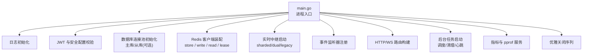
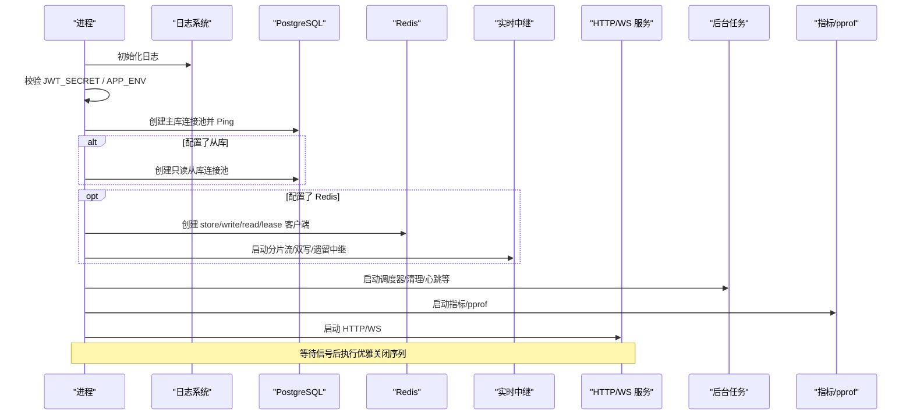
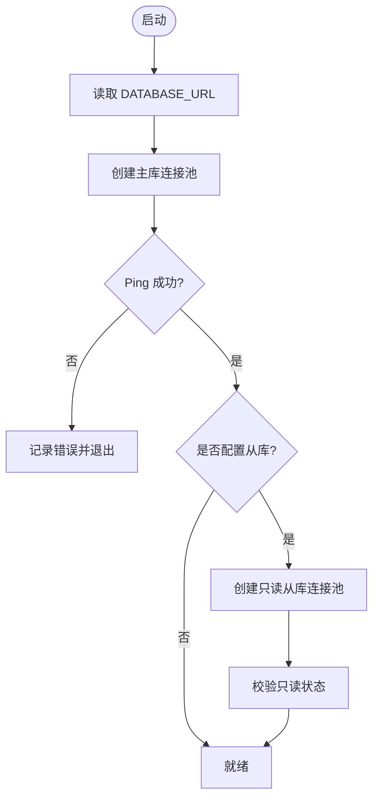
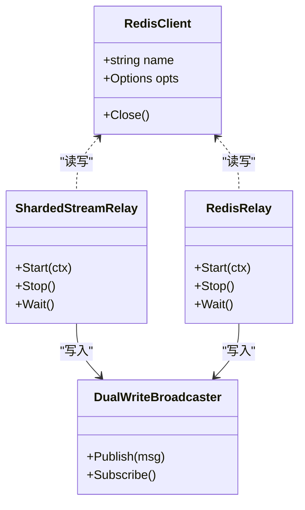
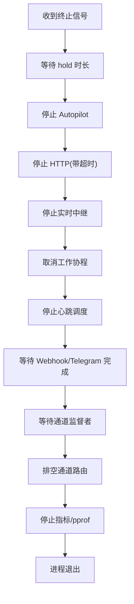
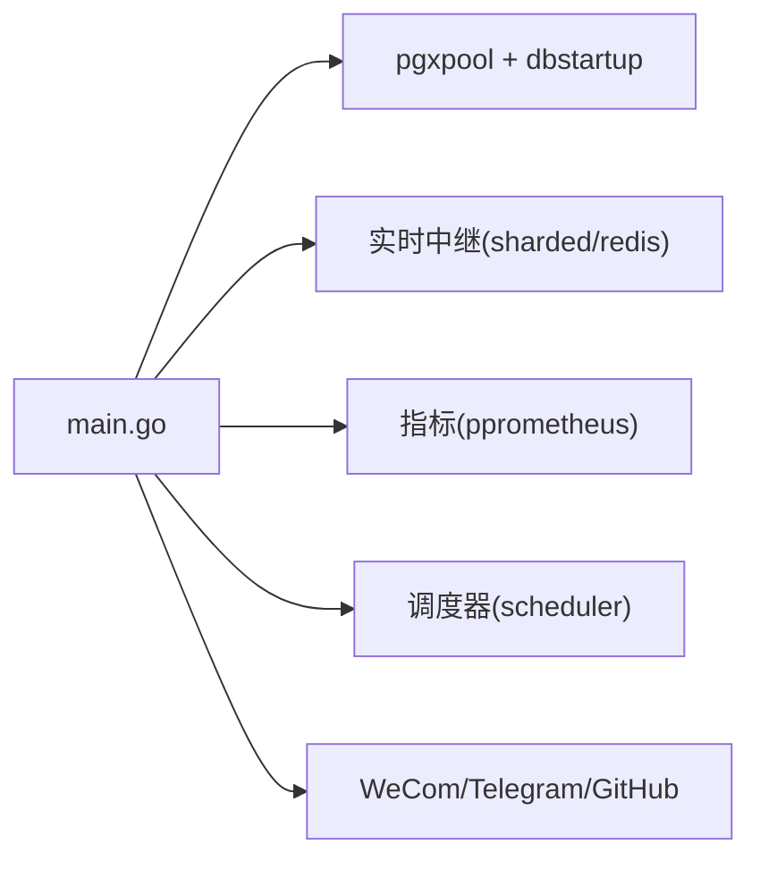

# 服务启动与配置

<cite>
**本文引用的文件**
- [server/cmd/server/main.go](file://server/cmd/server/main.go)
- [server/internal/dbstartup/startup.go](file://server/internal/dbstartup/startup.go)
- [apps/docs/content/docs/environment-variables.zh.mdx](file://apps/docs/content/docs/environment-variables.zh.mdx)
- [SELF_HOSTING_ADVANCED.md](file://SELF_HOSTING_ADVANCED.md)
- [server/internal/logger/logger.go](file://server/internal/logger/logger.go)
- [server/internal/realtime/sharded_stream_relay.go](file://server/internal/realtime/sharded_stream_relay.go)
- [server/internal/realtime/redis_relay.go](file://server/internal/realtime/redis_relay.go)
</cite>

## 目录
1. [简介](#简介)
2. [项目结构](#项目结构)
3. [核心组件](#核心组件)
4. [架构总览](#架构总览)
5. [详细组件分析](#详细组件分析)
6. [依赖关系分析](#依赖关系分析)
7. [性能考量](#性能考量)
8. [故障排除指南](#故障排除指南)
9. [结论](#结论)
10. [附录：关键环境变量参考表](#附录：关键环境变量参考表)

## 简介
本文面向 Multica 后端服务的部署与运维，聚焦 Go 服务的启动流程与配置要点。内容覆盖环境变量解析、数据库连接池初始化、Redis 客户端配置、中间件注册、后台任务启动、健康检查、优雅关闭机制以及日志系统初始化。同时给出多实例部署时的 Redis 集群配置、数据库主从分离设置与生产环境最佳实践，并附带启动流程图、配置参数表和故障排除指南。

## 项目结构
Multica 后端以 server/cmd/server/main.go 为入口，负责：
- 初始化日志与特性开关
- 校验 JWT 密钥等安全配置
- 建立 PostgreSQL 主库与可选只读从库连接池
- 根据 REDIS_URL 或专用实时通道 URL 启用 Redis 实时中继（分片流/双写/遗留模式）
- 注册事件监听器、指标与监控端点
- 启动 HTTP 服务、指标与 pprof 服务
- 启动后台调度与清理任务
- 实现优雅关闭序列

图表来源
- [server/cmd/server/main.go:292-884](file://server/cmd/server/main.go#L292-L884)

章节来源
- [server/cmd/server/main.go:292-884](file://server/cmd/server/main.go#L292-L884)

## 核心组件
- 环境变量解析与默认值：集中通过 env* 辅助函数与文档化变量表提供，支持正整数、非负整数、时长、布尔等类型解析与容错回退。
- 数据库连接池：使用 pgxpool，支持主库与只读从库；启动时进行 Ping 重试，失败则中止启动。
- Redis 客户端：按用途拆分 store、write、read、lease 等客户端，支持命名与禁用 CLIENT SETNAME；实时通道支持分片流、双写与遗留模式。
- 中间件与路由：在路由器构建阶段注入指标、限流、认证、CSP、代理信任等中间件。
- 后台任务：包括运行时存活扫描、自动巡检、配额对账、Webhook 投递、Telegram 出站、PR 卡片刷新、频道入站监督、媒体对账、DB 统计日志等。
- 健康检查与指标：Prometheus 指标服务器与 pprof 调试端口；实时健康端点受 token 保护。
- 优雅关闭：按严格顺序停止 HTTP、中继、工作协程、通道订阅者、指标与 pprof，确保数据不丢失且资源释放有序。

章节来源
- [server/cmd/server/main.go:292-884](file://server/cmd/server/main.go#L292-L884)
- [apps/docs/content/docs/environment-variables.zh.mdx:154-168](file://apps/docs/content/docs/environment-variables.zh.mdx#L154-L168)
- [SELF_HOSTING_ADVANCED.md:17-27](file://SELF_HOSTING_ADVANCED.md#L17-L27)

## 架构总览
下图展示服务启动的关键阶段与组件交互：

图表来源
- [server/cmd/server/main.go:292-884](file://server/cmd/server/main.go#L292-L884)

## 详细组件分析

### 环境变量解析与默认值
- 类型安全的读取：正整数、非负整数、时长、布尔等，非法值记录告警并回退到默认值。
- LLM 重试预算：MULTICA_LLM_MAX_RETRIES 仅允许 0–5，超出范围会阻止启动，避免将可重试失败转化为超时失败。
- 实时中继模式：REALTIME_RELAY_MODE 支持 sharded、dual、legacy，未设置时默认 sharded。
- 通道租约：CHANNEL_WS_LEASE_BACKEND=redis 时，优先使用 CHANNEL_WS_LEASE_REDIS_URL，否则回退到 REDIS_URL。
- 邮箱后端：RESEND_API_KEY 与 SMTP_HOST 均未设置时，验证码仅打印日志。

章节来源
- [server/cmd/server/main.go:118-221](file://server/cmd/server/main.go#L118-L221)
- [server/cmd/server/main.go:144-182](file://server/cmd/server/main.go#L144-L182)
- [server/cmd/server/main.go:103-116](file://server/cmd/server/main.go#L103-L116)
- [server/cmd/server/main.go:62-74](file://server/cmd/server/main.go#L62-L74)
- [apps/docs/content/docs/environment-variables.zh.mdx:197-219](file://apps/docs/content/docs/environment-variables.zh.mdx#L197-L219)

### 数据库连接池初始化与健康检查
- 主库连接池：从 DATABASE_URL 读取，若为空使用本地默认；启动时使用 dbstartup 的重试策略进行 Ping，失败则退出。
- 只读从库：DATABASE_REPLICA_URL 可选，新连接强制校验只读状态；连接失败透明回退主库并短暂熔断，无额外后台探测。
- 连接数与超时：可通过 DATABASE_MAX_CONNS/DATABASE_MIN_CONNS 及 MULTICA_DATABASE_*_TIMEOUT 调整；从库连接定期回收以验证只读状态。

图表来源
- [server/cmd/server/main.go:340-387](file://server/cmd/server/main.go#L340-L387)
- [server/internal/dbstartup/startup.go:1-200](file://server/internal/dbstartup/startup.go#L1-L200)

章节来源
- [server/cmd/server/main.go:340-387](file://server/cmd/server/main.go#L340-L387)
- [apps/docs/content/docs/environment-variables.zh.mdx:31-48](file://apps/docs/content/docs/environment-variables.zh.mdx#L31-L48)
- [SELF_HOSTING_ADVANCED.md:17-27](file://SELF_HOSTING_ADVANCED.md#L17-L27)

### Redis 客户端配置与实时中继
- 客户端拆分：store（共享限流/缓存）、write（写入实时流）、read（读取实时流）、lease（通道租约）。
- 命名与兼容：默认给客户端命名以便追踪，托管 Redis 可通过 REDIS_DISABLE_CLIENT_NAME=true 禁用。
- 实时中继模式：
  - sharded：基于分片流的默认模式，适合多实例广播。
  - dual：同时运行分片流与遗留模式，便于平滑迁移。
  - legacy：仅使用传统 Redis 广播。
- 通道租约：当 CHANNEL_WS_LEASE_BACKEND=redis 时启用，用于跨节点协调 WebSocket 通道持有者。

图表来源
- [server/cmd/server/main.go:42-60](file://server/cmd/server/main.go#L42-L60)
- [server/cmd/server/main.go:456-548](file://server/cmd/server/main.go#L456-L548)
- [server/internal/realtime/sharded_stream_relay.go:1-200](file://server/internal/realtime/sharded_stream_relay.go#L1-L200)
- [server/internal/realtime/redis_relay.go:1-200](file://server/internal/realtime/redis_relay.go#L1-L200)

章节来源
- [server/cmd/server/main.go:42-60](file://server/cmd/server/main.go#L42-L60)
- [server/cmd/server/main.go:456-548](file://server/cmd/server/main.go#L456-L548)
- [apps/docs/content/docs/environment-variables.zh.mdx:154-168](file://apps/docs/content/docs/environment-variables.zh.mdx#L154-L168)

### 中间件注册与路由构建
- 路由构建阶段注入：HTTP 指标、业务指标、通道租约指标、WeCom 指标、数据库路由指标、特征开关、心跳调度器、LLM 重试策略等。
- 认证与限流：认证限流依赖 Redis；未配置时认证限流关闭，邀请限流可在内存中运行，配置 Redis 后可在多副本间共享额度。
- 代理信任：通过 RATE_LIMIT_TRUSTED_PROXIES 与 MULTICA_TRUSTED_PROXIES 限定可信转发 IP 来源。

章节来源
- [server/cmd/server/main.go:628-648](file://server/cmd/server/main.go#L628-L648)
- [apps/docs/content/docs/environment-variables.zh.mdx:154-168](file://apps/docs/content/docs/environment-variables.zh.mdx#L154-L168)

### 后台任务启动
- 运行时存活扫描：标记长时间无心跳的运行时为离线，并处理队列过期。
- 自动巡检与配额对账：根据功能开关启动。
- Webhook 投递与 Telegram 出站：带超时等待的优雅退出。
- PR 卡片刷新：独立流水线。
- 频道入站监督：持有通道租约，驱动各 Channel.Channel。
- 媒体对账：结算已上传但未绑定的媒体对象。
- 调度器：基于数据库的任务调度，包含任务用量汇总、Autopilot 计划派发、插件钩子调度。

章节来源
- [server/cmd/server/main.go:658-774](file://server/cmd/server/main.go#L658-L774)

### 健康检查与指标
- Prometheus 指标：通过 METRICS_ADDR 启用，默认仅监听本地；若非本地地址会发出警告。
- 实时健康端点：/health/realtime 可由 REALTIME_METRICS_TOKEN 保护。
- pprof：调试端口，建议仅在内部网络暴露。

章节来源
- [server/cmd/server/main.go:573-608](file://server/cmd/server/main.go#L573-L608)
- [server/cmd/server/main.go:776-790](file://server/cmd/server/main.go#L776-L790)
- [apps/docs/content/docs/environment-variables.zh.mdx:296-305](file://apps/docs/content/docs/environment-variables.zh.mdx#L296-L305)

### 优雅关闭机制
- 信号捕获：SIGINT/SIGTERM，支持 MULTICA_SHUTDOWN_HOLD_DURATION 延迟退出。
- 关闭顺序：停止 Autopilot → 停止 HTTP（带超时）→ 停止中继 → 取消工作协程 → 停止心跳调度 → 等待 Webhook/Telegram 完成 → 等待通道监督者 → 排空通道路由 → 停止指标/pprof。
- WeCom 出站：必须在取消工作协程之前排空，以避免失去套接字导致消息丢弃。

图表来源
- [server/cmd/server/main.go:801-883](file://server/cmd/server/main.go#L801-L883)

章节来源
- [server/cmd/server/main.go:801-883](file://server/cmd/server/main.go#L801-L883)

### 日志系统初始化
- 启动即初始化日志，后续所有模块通过标准日志输出。
- 敏感信息脱敏：连接串、令牌等会被替换为占位符，避免泄露。

章节来源
- [server/cmd/server/main.go:292-308](file://server/cmd/server/main.go#L292-L308)
- [server/internal/logger/logger.go:1-200](file://server/internal/logger/logger.go#L1-L200)
- [server/pkg/redact/redact.go:61-84](file://server/pkg/redact/redact.go#L61-L84)

## 依赖关系分析
- main.go 依赖：
  - 数据库：pgxpool 连接池与 dbstartup 重试逻辑
  - 实时：hub、sharded stream relay、redis relay、dual writer broadcaster
  - 指标：obsmetrics 注册与 HTTP 服务器
  - 调度：scheduler 管理器与多个内置任务
  - 外部集成：WeCom、Telegram、GitHub PR 卡片等
- 配置依赖：
  - 环境变量决定功能开关与行为，如 REDIS_URL、DATABASE_URL、APP_ENV、JWT_SECRET、MULTICA_LLM_MAX_RETRIES 等

图表来源
- [server/cmd/server/main.go:292-884](file://server/cmd/server/main.go#L292-L884)

章节来源
- [server/cmd/server/main.go:292-884](file://server/cmd/server/main.go#L292-L884)

## 性能考量
- 数据库连接池：合理设置 DATABASE_MAX_CONNS/DATABASE_MIN_CONNS，结合 PgBouncer/RDS Proxy 提升并发能力；从库连接定期回收以验证只读状态。
- Redis 连接池：按用途拆分客户端，避免阻塞型消费者影响请求路径；必要时为通道租约使用独立 Redis 实例。
- 实时中继：多实例部署推荐 sharded 模式；如需平滑迁移可使用 dual 模式。
- 指标与 pprof：指标端口应限制为本地或私有网络访问；pprof 仅用于调试。
- 优雅关闭：合理设置 MULTICA_SHUTDOWN_HOLD_DURATION 与 Kubernetes terminationGracePeriodSeconds，确保请求与任务完成。

[本节为通用指导，无需特定文件引用]

## 故障排除指南
- 启动失败：
  - JWT_SECRET 在生产环境为空或使用已知占位值会拒绝启动；需生成强随机密钥。
  - DATABASE_URL 不可达或 Ping 失败会中止启动；检查网络与凭据。
  - MULTICA_LLM_MAX_RETRIES 非法（非数字、负数、大于 5）会阻止启动。
- 实时通道问题：
  - REDIS_URL 无效会导致实时中继回退到内存 hub（单节点模式），多实例无法广播。
  - 通道租约需要有效的 Redis URL；否则通道监督者无法启动。
- 限流失效：
  - 未配置 REDIS_URL 时认证限流关闭；邀请限流可在内存中运行，但多副本不共享额度。
- 健康检查：
  - 指标端口非本地地址会发出警告；请限制访问。
  - 实时健康端点需正确配置 REALTIME_METRICS_TOKEN。

章节来源
- [server/cmd/server/main.go:292-308](file://server/cmd/server/main.go#L292-L308)
- [server/cmd/server/main.go:340-387](file://server/cmd/server/main.go#L340-L387)
- [server/cmd/server/main.go:456-548](file://server/cmd/server/main.go#L456-L548)
- [apps/docs/content/docs/environment-variables.zh.mdx:154-168](file://apps/docs/content/docs/environment-variables.zh.mdx#L154-L168)
- [apps/docs/content/docs/environment-variables.zh.mdx:296-305](file://apps/docs/content/docs/environment-variables.zh.mdx#L296-L305)

## 结论
Multica 后端服务通过严格的启动流程与配置管理，确保数据库、Redis、实时通道、指标与后台任务的可靠初始化。生产环境应重点关注 JWT 密钥、数据库连接池、Redis 集群与实时中继模式的选择，并结合优雅关闭与指标监控保障稳定性与可观测性。

[本节为总结，无需特定文件引用]

## 附录：关键环境变量参考表
- 数据库
  - DATABASE_URL：PostgreSQL 连接字符串；未设置时使用本地默认。
  - DATABASE_MAX_CONNS/DATABASE_MIN_CONNS：主库连接池上限与基线。
  - DATABASE_REPLICA_URL：可选只读从库；新连接强制校验只读状态。
  - DATABASE_REPLICA_MAX_CONNS/DATABASE_REPLICA_MIN_CONNS：从库连接池上限与基线。
  - MULTICA_DATABASE_STARTUP_TIMEOUT/MULTICA_DATABASE_CONNECT_TIMEOUT：启动重试与连接超时。
- 服务与安全
  - PORT：API 监听端口，默认 8080。
  - JWT_SECRET：生产环境必填；空或占位值会拒绝启动。
  - APP_ENV：设为 production 以启用生产安全检查。
  - AUTH_TOKEN_TTL：JWT 与 cookie 有效期。
  - LOG_LEVEL：日志级别。
  - MULTICA_SHUTDOWN_HOLD_DURATION：优雅退出前等待时长。
  - MULTICA_RUNTIME_RECONNECT_GRACE：运行时离线重连宽限时间。
- Redis 与限流
  - REDIS_URL：共享限流、实时事件、token 缓存；未设置时实时事件与邀请限流回退内存，认证限流关闭。
  - REDIS_DISABLE_CLIENT_NAME：托管 Redis 禁止 CLIENT SETNAME 时启用。
  - RATE_LIMIT_AUTH/RATE_LIMIT_AUTH_VERIFY：认证相关限流阈值。
  - RATE_LIMIT_INVITATION_*：邀请相关限流阈值。
  - RATE_LIMIT_TRUSTED_PROXIES/MULTICA_TRUSTED_PROXIES：可信代理 CIDR。
- 实时中继
  - REALTIME_RELAY_MODE：sharded/dual/legacy，默认 sharded。
  - REALTIME_RELAY_*：分片流保留、读取计数、TTL 等参数。
  - CHANNEL_WS_LEASE_BACKEND：redis 时启用通道租约。
  - CHANNEL_WS_LEASE_REDIS_URL：通道租约专用 Redis URL，未设置回退 REDIS_URL。
- 服务端 LLM
  - MULTICA_LLM_API_KEY/BASE_URL/DEFAULT_MODEL：辅助生成能力配置。
  - MULTICA_LLM_MAX_RETRIES：0–5，控制重试预算。

章节来源
- [apps/docs/content/docs/environment-variables.zh.mdx:29-48](file://apps/docs/content/docs/environment-variables.zh.mdx#L29-L48)
- [apps/docs/content/docs/environment-variables.zh.mdx:154-168](file://apps/docs/content/docs/environment-variables.zh.mdx#L154-L168)
- [apps/docs/content/docs/environment-variables.zh.mdx:197-219](file://apps/docs/content/docs/environment-variables.zh.mdx#L197-L219)
- [SELF_HOSTING_ADVANCED.md:17-27](file://SELF_HOSTING_ADVANCED.md#L17-L27)