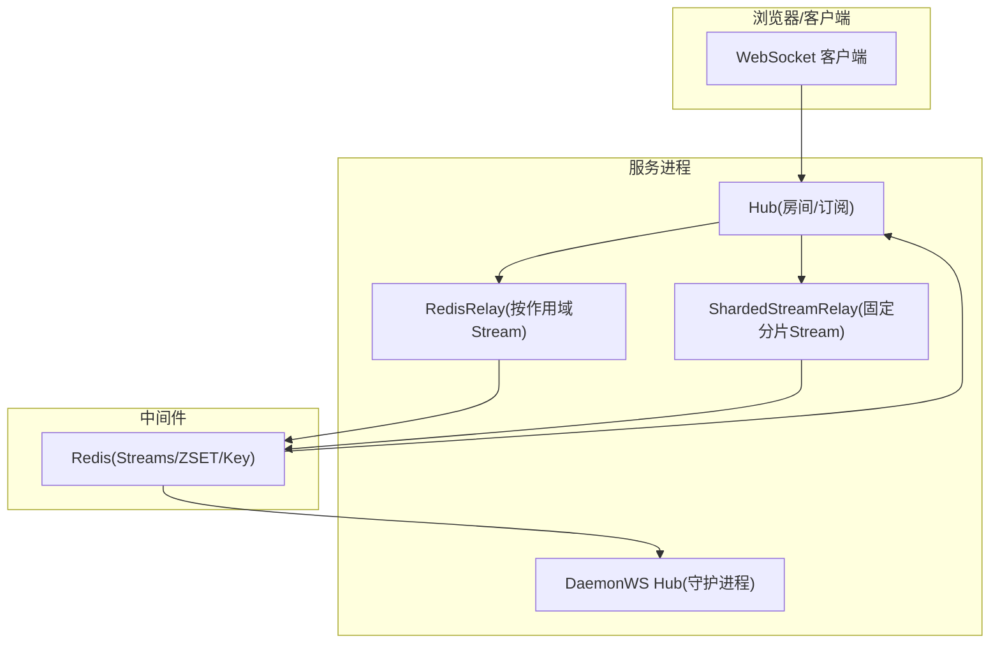
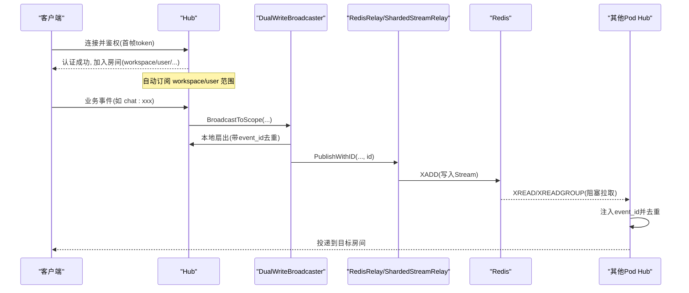
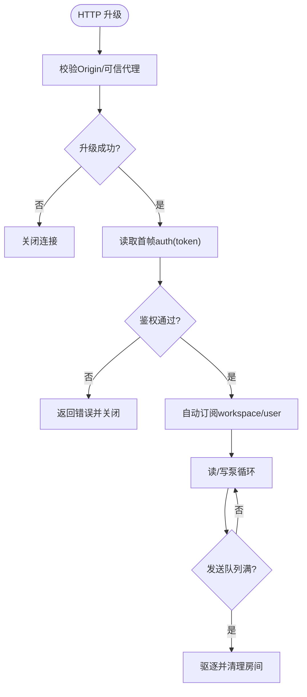
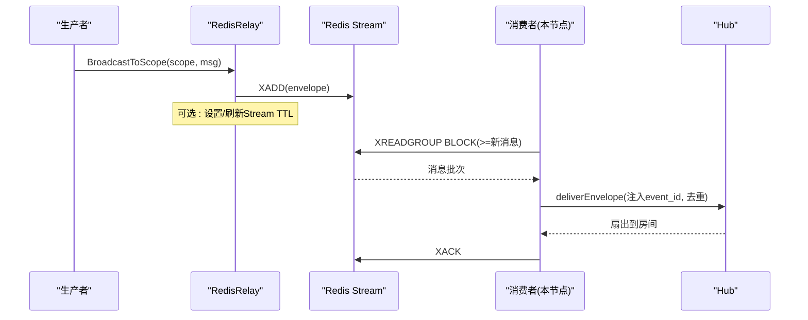
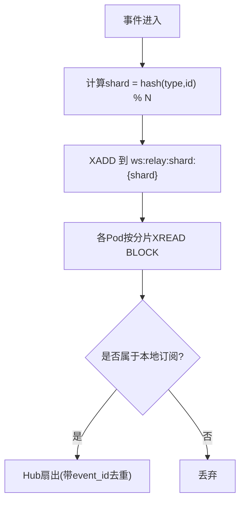
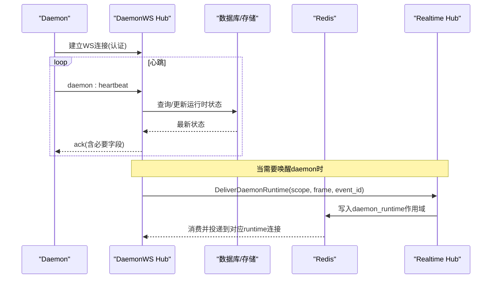
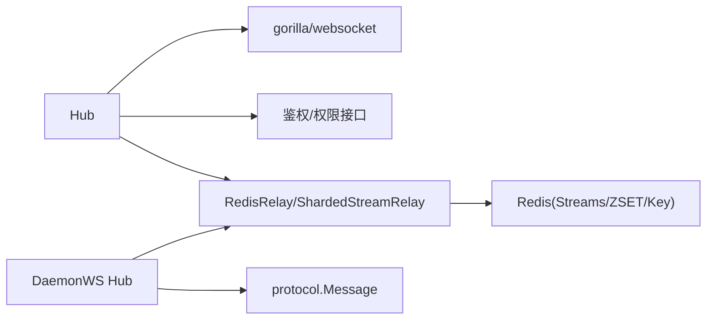

# 实时通信架构

<cite>
**本文引用的文件**
- [hub.go](file://server/internal/realtime/hub.go)
- [broadcaster.go](file://server/internal/realtime/broadcaster.go)
- [redis_relay.go](file://server/internal/realtime/redis_relay.go)
- [sharded_stream_relay.go](file://server/internal/realtime/sharded_stream_relay.go)
- [daemonws_hub.go](file://server/internal/daemonws/hub.go)
</cite>

## 目录
1. [简介](#简介)
2. [项目结构](#项目结构)
3. [核心组件](#核心组件)
4. [架构总览](#架构总览)
5. [详细组件分析](#详细组件分析)
6. [依赖关系分析](#依赖关系分析)
7. [性能考量](#性能考量)
8. [故障处理指南](#故障处理指南)
9. [结论](#结论)
10. [附录](#附录)

## 简介
本文件系统性阐述 Multica 的实时通信架构，覆盖 WebSocket 连接管理、消息协议与鉴权、Redis 中继（含分片流式传输）、事件广播与多节点分发、通道租约与守护进程心跳、以及实时协作场景（聊天、评论、通知）的端到端同步机制。文档以代码级为依据，提供架构图、序列图与流程图，帮助读者快速理解并定位关键实现位置。

## 项目结构
- 实时子系统位于 server/internal/realtime，包含 Hub（本地房间广播）、Broadcaster 抽象、RedisRelay（按作用域 Stream 消费）、ShardedStreamRelay（固定分片 Stream 广播/消费）等。
- 守护进程 WebSocket 子系统位于 server/internal/daemonws，负责与本地/远端 daemon 建立长连接、处理心跳与 RPC、按 runtime/workspace/user 维度投递唤醒与状态变更事件。
- 前端/客户端通过 HTTP 升级至 WebSocket，首帧携带鉴权令牌；服务端基于 JWT/PAT 解析用户与工作区身份后加入相应“房间”。

图表来源
- [hub.go:276-345](file://server/internal/realtime/hub.go#L276-L345)
- [redis_relay.go:131-268](file://server/internal/realtime/redis_relay.go#L131-L268)
- [sharded_stream_relay.go:152-238](file://server/internal/realtime/sharded_stream_relay.go#L152-L238)
- [daemonws_hub.go:310-443](file://server/internal/daemonws/hub.go#L310-L443)

章节来源
- [hub.go:276-345](file://server/internal/realtime/hub.go#L276-L345)
- [broadcaster.go:1-74](file://server/internal/realtime/broadcaster.go#L1-L74)
- [redis_relay.go:131-268](file://server/internal/realtime/redis_relay.go#L131-L268)
- [sharded_stream_relay.go:152-238](file://server/internal/realtime/sharded_stream_relay.go#L152-L238)
- [daemonws_hub.go:310-443](file://server/internal/daemonws/hub.go#L310-L443)

## 核心组件
- Hub：维护 scope-based 房间（workspace/user/task/chat 等），负责本地扇出、慢客户端驱逐、去重标记、全局广播。
- Broadcaster：统一的事件发布接口，屏蔽后端是直发 Hub 还是经 Redis 中继。
- RedisRelay：按作用域创建 Redis Stream，使用 XREADGROUP 阻塞消费，启动/停止 per-scope 消费者，维护节点心跳与会话清理。
- ShardedStreamRelay：将全部事件写入固定数量的分片 Stream，每 Pod 每个分片一个阻塞读取循环，降低阻塞连接数，支持回放窗口与 TTL 维护。
- DaemonWS Hub：守护进程长连接管理，按 runtime/workspace/user 索引连接，处理心跳、RPC、任务可用/工作项就绪/运行时消失等事件。

章节来源
- [broadcaster.go:1-74](file://server/internal/realtime/broadcaster.go#L1-L74)
- [hub.go:276-663](file://server/internal/realtime/hub.go#L276-L663)
- [redis_relay.go:131-473](file://server/internal/realtime/redis_relay.go#L131-L473)
- [sharded_stream_relay.go:152-487](file://server/internal/realtime/sharded_stream_relay.go#L152-L487)
- [daemonws_hub.go:310-800](file://server/internal/daemonws/hub.go#L310-L800)

## 架构总览
Multica 的实时通信采用“本地 Hub + 跨节点 Redis 中继”的双层模型：
- 本地路径：Hub 直接扇出到当前 Pod 的所有订阅者，延迟最低。
- 跨节点路径：通过 Redis Stream 持久化事件，其他 Pod 消费后投递到本地 Hub。
- 双写模式：DualWriteBroadcaster 同时走本地 Hub 与 Redis，利用 event_id 在 Hub 侧做去重，避免重复投递。
- 分片模式：ShardedStreamRelay 将事件写入固定数量分片 Stream，每 Pod 固定数量阻塞读取，提升可扩展性。

图表来源
- [hub.go:678-753](file://server/internal/realtime/hub.go#L678-L753)
- [redis_relay.go:646-709](file://server/internal/realtime/redis_relay.go#L646-L709)
- [sharded_stream_relay.go:250-299](file://server/internal/realtime/sharded_stream_relay.go#L250-L299)

章节来源
- [hub.go:678-753](file://server/internal/realtime/hub.go#L678-L753)
- [redis_relay.go:646-709](file://server/internal/realtime/redis_relay.go#L646-L709)
- [sharded_stream_relay.go:250-299](file://server/internal/realtime/sharded_stream_relay.go#L250-L299)

## 详细组件分析

### WebSocket 连接管理与鉴权
- 升级与源校验：使用 gorilla/websocket Upgrader，校验 Origin，支持反向代理 X-Forwarded-Host 白名单与可信代理 CIDR。
- 首帧鉴权：连接建立后要求第一条消息为 auth 类型，携带 token（JWT 或 PAT）。支持 cookie 与 URL workspace_id/slug 解析。
- 房间订阅：认证成功后自动订阅 workspace 与 user 范围；后续可按 task/chat 等 scope 订阅。
- 慢客户端驱逐：发送队列满时主动断开，释放房间引用并触发 onLastSubscriber 回调。

图表来源
- [hub.go:159-211](file://server/internal/realtime/hub.go#L159-L211)
- [hub.go:678-753](file://server/internal/realtime/hub.go#L678-L753)
- [hub.go:616-663](file://server/internal/realtime/hub.go#L616-L663)

章节来源
- [hub.go:159-211](file://server/internal/realtime/hub.go#L159-L211)
- [hub.go:678-753](file://server/internal/realtime/hub.go#L678-L753)
- [hub.go:616-663](file://server/internal/realtime/hub.go#L616-L663)

### 消息协议与广播抽象
- 作用域常量：workspace/user/task/chat/daemon_runtime/wecom_outbound 等，所有生产者应通过 Broadcaster 接口发布，避免硬编码字符串路由。
- 双写广播器：DualWriteBroadcaster 对同一事件注入唯一 event_id，先本地扇出再写入 Redis，确保跨节点不重复。
- 特殊作用域：daemon_runtime 用于唤醒守护进程；wecom_outbound 用于定向回发到持有 WeCom 连接的副本。

章节来源
- [broadcaster.go:1-74](file://server/internal/realtime/broadcaster.go#L1-L74)
- [redis_relay.go:646-709](file://server/internal/realtime/redis_relay.go#L646-L709)

### Redis 中继系统（按作用域 Stream）
- 写入：BroadcastToScope/BroadcastToWorkspace/SendToUser/Broadcast 均转为 envelope 写入对应 ws:scope:{type}:{id}:stream。
- 消费：按作用域启动 XREADGROUP 循环，首次订阅时创建组，空闲时优雅停止。
- 心跳与节点注册：周期性写入节点心跳 key，并在 ZSET 中登记关注该作用域的节点。
- 保留策略：支持 MAXLEN 近似裁剪、TTL 刷新、扫描修复历史 stream 的 TTL。

图表来源
- [redis_relay.go:270-326](file://server/internal/realtime/redis_relay.go#L270-L326)
- [redis_relay.go:328-451](file://server/internal/realtime/redis_relay.go#L328-L451)
- [redis_relay.go:477-503](file://server/internal/realtime/redis_relay.go#L477-L503)

章节来源
- [redis_relay.go:270-326](file://server/internal/realtime/redis_relay.go#L270-L326)
- [redis_relay.go:328-451](file://server/internal/realtime/redis_relay.go#L328-L451)
- [redis_relay.go:477-503](file://server/internal/realtime/redis_relay.go#L477-L503)

### 分片流式传输（固定分片 Stream）
- 设计动机：将全部事件写入固定数量分片 Stream，每 Pod 每个分片一个阻塞读取循环，避免活跃作用域过多导致阻塞连接爆炸。
- 回放窗口：启动时从 (now - ReplayGrace) 开始回放，保证短暂离线可恢复。
- 维护与观测：定期 XTRIM MINID、TTL 修复、统计长度与内存占用。

图表来源
- [sharded_stream_relay.go:250-299](file://server/internal/realtime/sharded_stream_relay.go#L250-L299)
- [sharded_stream_relay.go:309-337](file://server/internal/realtime/sharded_stream_relay.go#L309-L337)
- [sharded_stream_relay.go:339-405](file://server/internal/realtime/sharded_stream_relay.go#L339-L405)

章节来源
- [sharded_stream_relay.go:250-299](file://server/internal/realtime/sharded_stream_relay.go#L250-L299)
- [sharded_stream_relay.go:309-337](file://server/internal/realtime/sharded_stream_relay.go#L309-L337)
- [sharded_stream_relay.go:339-405](file://server/internal/realtime/sharded_stream_relay.go#L339-L405)

### 通道租约与多节点事件分发
- 作用域即“房间”：workspace/user/task/chat 等作为 scopeType+scopeID 形成房间键，Hub 内维护订阅者集合。
- 订阅生命周期：onFirstSubscriber/onLastSubscriber 回调驱动 Redis 中继按需启动/停止 per-scope 消费者，减少空转。
- 多节点分发：通过 Redis Stream 将事件广播到其他 Pod，再由各自 Hub 投递到本地房间。
- 去重：event_id 注入原始帧，Hub 侧 LRU 缓存最近已见 ID，避免 Redis 回环导致的重复。

章节来源
- [hub.go:276-465](file://server/internal/realtime/hub.go#L276-L465)
- [redis_relay.go:232-268](file://server/internal/realtime/redis_relay.go#L232-L268)
- [redis_relay.go:646-709](file://server/internal/realtime/redis_relay.go#L646-L709)

### 守护进程 WebSocket 通信、心跳与状态同步
- 连接与索引：按 runtime/workspace/user 索引连接，支持批量授权的工作区/运行时集。
- 心跳：daemon 定时发送 heartbeat，服务端调用注册的 HeartbeatHandler 更新运行时状态；无 ACK 时 daemon 回退到 HTTP 心跳。
- 唤醒与状态变更：任务可用、工作项就绪、运行时配置变更、运行时消失等事件通过 Hub 推送。
- 去重与健壮性：runtime gone 事件在 Hub 级别去重，避免并发注册时的漏投；慢连接被驱逐。

图表来源
- [daemonws_hub.go:310-443](file://server/internal/daemonws/hub.go#L310-L443)
- [daemonws_hub.go:594-674](file://server/internal/daemonws/hub.go#L594-L674)
- [broadcaster.go:11-29](file://server/internal/realtime/broadcaster.go#L11-L29)

章节来源
- [daemonws_hub.go:310-443](file://server/internal/daemonws/hub.go#L310-L443)
- [daemonws_hub.go:594-674](file://server/internal/daemonws/hub.go#L594-L674)
- [broadcaster.go:11-29](file://server/internal/realtime/broadcaster.go#L11-L29)

### 实时协作场景的技术实现
- 聊天：chat:{id} 作为作用域，消息经 Broadcaster 发布，本地 Hub 立即扇出，跨节点经 Redis 中继投递；客户端按 event_id 去重。
- 评论：task:{id} 或 workspace 作用域下广播评论变更，订阅该任务/工作区的客户端即时刷新。
- 通知：user:{userId} 作用域定向推送个人通知；必要时结合 workspace 广播进行聚合提醒。
- 一致性：双写模式下，本地优先，Redis 兜底；下游消费幂等，允许回放窗口内的重复事件。

章节来源
- [broadcaster.go:1-74](file://server/internal/realtime/broadcaster.go#L1-L74)
- [redis_relay.go:646-709](file://server/internal/realtime/redis_relay.go#L646-L709)
- [sharded_stream_relay.go:250-299](file://server/internal/realtime/sharded_stream_relay.go#L250-L299)

## 依赖关系分析
- Hub 依赖 gorilla/websocket 进行连接升级与读写；依赖 ScopeAuthorizer/MembershipChecker/PATResolver 完成鉴权与权限校验。
- RedisRelay/ShardedStreamRelay 依赖 Redis Streams/ZSET/Key 进行事件持久化、节点发现与心跳。
- DaemonWS Hub 依赖 protocol 消息类型定义，并通过 Broadcaster 将 daemon_runtime 事件纳入统一中继体系。

图表来源
- [hub.go:18-21](file://server/internal/realtime/hub.go#L18-L21)
- [redis_relay.go:1-15](file://server/internal/realtime/redis_relay.go#L1-L15)
- [sharded_stream_relay.go:1-15](file://server/internal/realtime/sharded_stream_relay.go#L1-L15)
- [daemonws_hub.go:1-14](file://server/internal/daemonws/hub.go#L1-L14)

章节来源
- [hub.go:18-21](file://server/internal/realtime/hub.go#L18-L21)
- [redis_relay.go:1-15](file://server/internal/realtime/redis_relay.go#L1-L15)
- [sharded_stream_relay.go:1-15](file://server/internal/realtime/sharded_stream_relay.go#L1-L15)
- [daemonws_hub.go:1-14](file://server/internal/daemonws/hub.go#L1-L14)

## 性能考量
- 本地优先：DualWriteBroadcaster 先本地扇出，再异步写入 Redis，降低端到端延迟。
- 慢客户端保护：Hub 对发送队列满的连接进行驱逐，防止拖垮整体吞吐。
- 分片读取：ShardedStreamRelay 固定分片数与每分片单阻塞读取，控制 Redis 阻塞连接上限。
- 保留策略：MAXLEN 近似裁剪与 TTL 刷新，避免 Stream 无限增长；回放窗口限制重放体积。
- 指标与可观测：大量计数器记录 XADD/XREAD/Ack/错误/连接数/房间数等，便于容量规划与排障。

[本节为通用指导，不直接分析具体文件]

## 故障处理指南
- Redis 不可用：初始 Ping 失败会记录错误并置位 RedisConnected=false；XADD/XREAD 异常计数并记录最后错误信息。
- Stream 缺失/组不存在：捕获 NOGROUP 错误后重建组并刷新 TTL，避免消费中断。
- 心跳丢失：节点心跳 key 过期会被清理；ZSET 中的节点列表用于维护作用域订阅者集合。
- 守护进程掉线：运行时消失事件通过 Hub 级别去重投递，未收到 ACK 时 daemon 回退到 HTTP 心跳。
- 鉴权失败：首帧非 auth 或 token 无效将返回错误并关闭连接；账号禁用返回特定状态码。

章节来源
- [redis_relay.go:232-268](file://server/internal/realtime/redis_relay.go#L232-L268)
- [redis_relay.go:404-451](file://server/internal/realtime/redis_relay.go#L404-L451)
- [redis_relay.go:477-503](file://server/internal/realtime/redis_relay.go#L477-L503)
- [daemonws_hub.go:594-674](file://server/internal/daemonws/hub.go#L594-L674)
- [hub.go:678-753](file://server/internal/realtime/hub.go#L678-L753)

## 结论
Multica 的实时通信以 Hub 为中心，结合 Redis Stream 实现跨节点可靠广播与低延迟本地扇出。通过双写与 event_id 去重、分片流式传输、作用域订阅生命周期钩子、守护进程心跳与状态同步，系统在扩展性、一致性与可运维性之间取得平衡。生产部署建议根据流量特征调整分片数、回放窗口、TTL 与维护周期，并充分利用指标进行容量规划与问题定位。

[本节为总结，不直接分析具体文件]

## 附录
- 关键路径参考
  - WebSocket 鉴权与房间订阅：[hub.go:678-753](file://server/internal/realtime/hub.go#L678-L753)、[hub.go:320-345](file://server/internal/realtime/hub.go#L320-L345)
  - 双写广播与去重：[redis_relay.go:646-709](file://server/internal/realtime/redis_relay.go#L646-L709)
  - 作用域 Stream 消费与心跳：[redis_relay.go:328-451](file://server/internal/realtime/redis_relay.go#L328-L451)、[redis_relay.go:477-503](file://server/internal/realtime/redis_relay.go#L477-L503)
  - 分片流式传输与回放：[sharded_stream_relay.go:250-299](file://server/internal/realtime/sharded_stream_relay.go#L250-L299)、[sharded_stream_relay.go:309-337](file://server/internal/realtime/sharded_stream_relay.go#L309-L337)
  - 守护进程心跳与唤醒：[daemonws_hub.go:310-443](file://server/internal/daemonws/hub.go#L310-L443)、[daemonws_hub.go:594-674](file://server/internal/daemonws/hub.go#L594-L674)

[本节为索引，不直接分析具体文件]