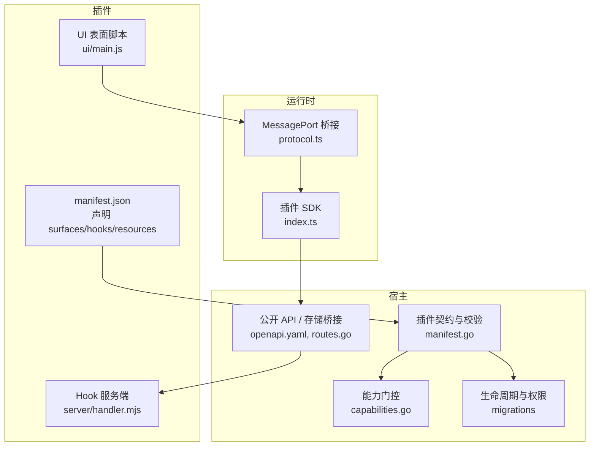
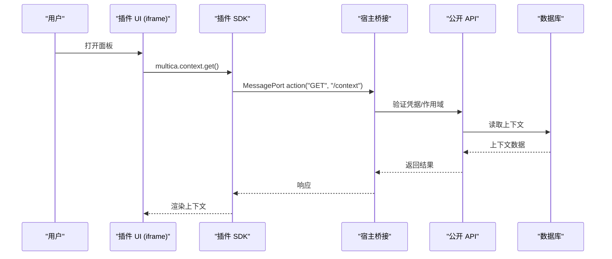
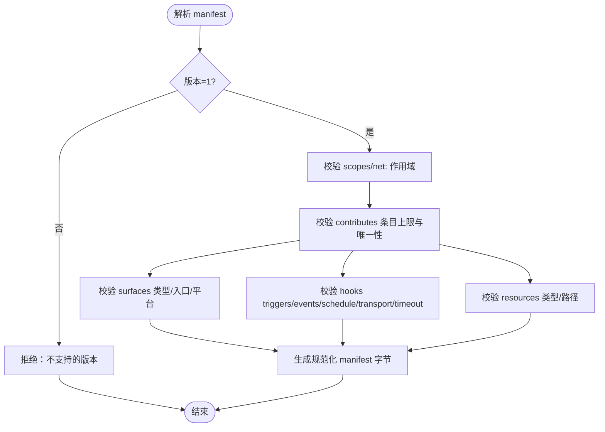
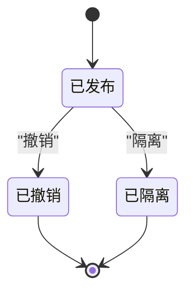
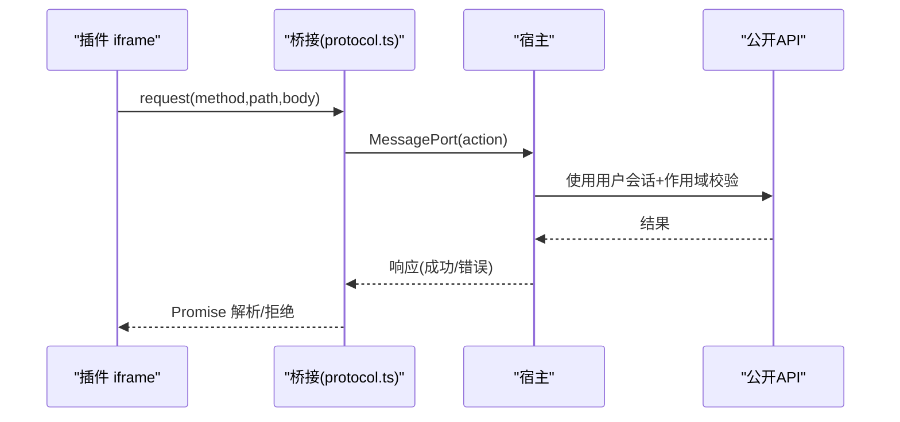
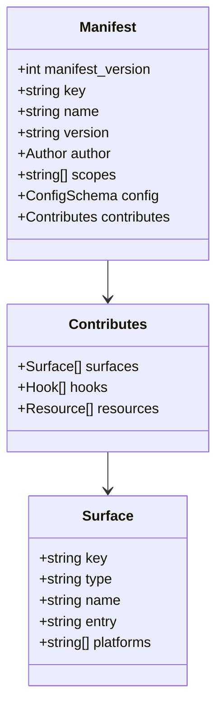
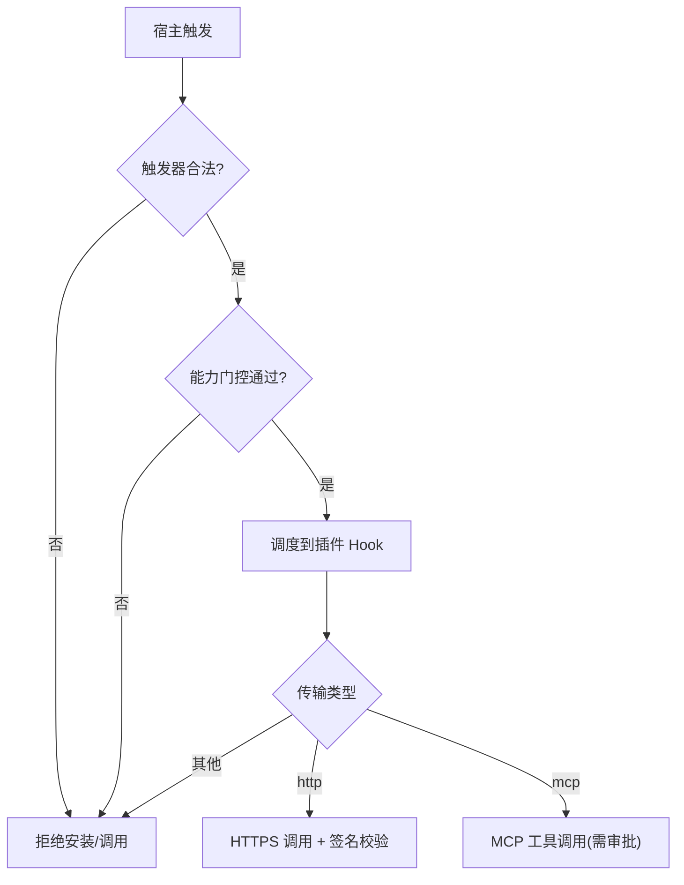
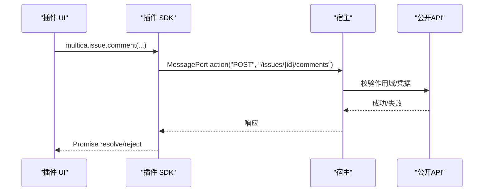
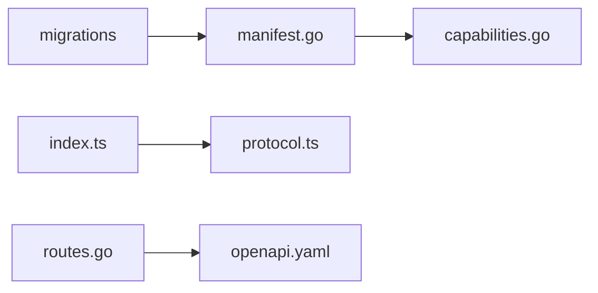

# 插件系统架构

<cite>
**本文引用的文件**
- [manifest.go](file://server/pkg/plugincontract/manifest.go)
- [capabilities.go](file://server/pkg/plugincontract/capabilities.go)
- [protocol.ts](file://packages/plugin-sdk/protocol.ts)
- [index.ts](file://packages/plugin-sdk/index.ts)
- [openapi.yaml](file://server/pkg/publicapi/v1/openapi.yaml)
- [routes.go](file://server/pkg/publicapi/v1/routes.go)
- [285_plugin_lifecycle_v1.up.sql](file://server/migrations/285_plugin_lifecycle_v1.up.sql)
- [310_workspace_private_plugin_identity.up.sql](file://server/migrations/310_workspace_private_plugin_identity.up.sql)
- [multica.plugin.json（hello-panel）](file://examples/plugins/hello-panel/multica.plugin.json)
- [multica.plugin.json（deploy-sentinel）](file://examples/plugins/deploy-sentinel/multica.plugin.json)
- [handler.mjs（deploy-sentinel）](file://examples/plugins/deploy-sentinel/server/handler.mjs)
</cite>

## 目录
1. [简介](#简介)
2. [项目结构](#项目结构)
3. [核心组件](#核心组件)
4. [架构总览](#架构总览)
5. [详细组件分析](#详细组件分析)
6. [依赖关系分析](#依赖关系分析)
7. [性能考量](#性能考量)
8. [故障排查指南](#故障排查指南)
9. [结论](#结论)
10. [附录](#附录)

## 简介
本文件系统性阐述 Multica 插件系统的架构与实现，覆盖插件契约、版本化、生命周期、安全模型、插件类型、表面系统集成、钩子系统、资源系统、SDK、示例插件、调试与测试、部署方式、权限控制与沙箱隔离机制。重点说明插件与核心系统的解耦设计，以及如何通过插件生态扩展平台能力。

## 项目结构
Multica 的插件体系由“宿主（Host）—插件契约（Contract）—插件 SDK（Surface SDK）—插件包（Manifest + UI/Hook/Resource）”构成：
- 宿主侧负责解析与校验 manifest、能力门控、安装与生命周期管理、钩子调度、存储与上下文桥接、OpenAPI 暴露等。
- 插件侧通过 manifest 声明能力，提供 UI 表面（iframe）、可被宿主调用的 Hook（HTTP/MCP），以及静态资源（如技能文本）。
- Surface SDK 提供 iframe 内脚本访问宿主能力的统一接口，所有调用经 MessagePort 桥接到宿主执行，不直接持有凭据。
- 示例插件展示典型用法：面板、事件通知、Agent 工具、MCP 集成等。

**图示来源**
- [manifest.go:176-243](file://server/pkg/plugincontract/manifest.go#L176-L243)
- [capabilities.go:23-57](file://server/pkg/plugincontract/capabilities.go#L23-L57)
- [285_plugin_lifecycle_v1.up.sql:105-164](file://server/migrations/285_plugin_lifecycle_v1.up.sql#L105-L164)
- [openapi.yaml:125-171](file://server/pkg/publicapi/v1/openapi.yaml#L125-L171)
- [routes.go:64-67](file://server/pkg/publicapi/v1/routes.go#L64-L67)
- [protocol.ts:20-56](file://packages/plugin-sdk/protocol.ts#L20-L56)
- [index.ts:26-34](file://packages/plugin-sdk/index.ts#L26-L34)

**章节来源**
- [manifest.go:176-243](file://server/pkg/plugincontract/manifest.go#L176-L243)
- [capabilities.go:23-57](file://server/pkg/plugincontract/capabilities.go#L23-L57)
- [openapi.yaml:125-171](file://server/pkg/publicapi/v1/openapi.yaml#L125-L171)
- [routes.go:64-67](file://server/pkg/publicapi/v1/routes.go#L64-L67)
- [protocol.ts:20-56](file://packages/plugin-sdk/protocol.ts#L20-L56)
- [index.ts:26-34](file://packages/plugin-sdk/index.ts#L26-L34)

## 核心组件
- 插件契约（Manifest）：定义插件身份、版本、作用域、配置、贡献项（Surfaces/Hooks/Resources），并严格校验字段、范围、网络目标、定时策略等。
- 能力门控（Capabilities）：宿主构建期声明支持的能力集合，未启用能力将导致安装失败，避免“静默不可用”。
- 生命周期与权限：以不可变发布记录、追加式授权与绑定日志、工作区私有身份约束，确保可审计与可回滚。
- 公开 API 与存储：为插件暴露最小必要 API（上下文、问题、评论、存储），并通过 OpenAPI 标注契约与作用域。
- 插件 SDK 与协议：iframe 内脚本通过 MessagePort 与宿主通信，统一封装 context、issue、storage、hooks、ui 能力，零凭据跨边界。
- 示例插件：hello-panel（基础面板）、deploy-sentinel（复杂场景：事件、Agent 工具、MCP、技能资源）。

**章节来源**
- [manifest.go:400-707](file://server/pkg/plugincontract/manifest.go#L400-L707)
- [capabilities.go:23-104](file://server/pkg/plugincontract/capabilities.go#L23-L104)
- [285_plugin_lifecycle_v1.up.sql:105-164](file://server/migrations/285_plugin_lifecycle_v1.up.sql#L105-L164)
- [310_workspace_private_plugin_identity.up.sql:1-9](file://server/migrations/310_workspace_private_plugin_identity.up.sql#L1-L9)
- [openapi.yaml:125-171](file://server/pkg/publicapi/v1/openapi.yaml#L125-L171)
- [index.ts:26-282](file://packages/plugin-sdk/index.ts#L26-L282)
- [multica.plugin.json（hello-panel）:1-21](file://examples/plugins/hello-panel/multica.plugin.json#L1-L21)
- [multica.plugin.json（deploy-sentinel）:1-119](file://examples/plugins/deploy-sentinel/multica.plugin.json#L1-L119)

## 架构总览
插件系统与核心系统通过“契约 + 桥接 + 能力门控”解耦：
- 契约层：manifest 是稳定且严格的 JSON Schema，未知字段拒绝，保证向前兼容与可审计。
- 桥接层：iframe 与宿主之间仅通过 MessagePort 传递结构化消息，无 Cookie/LocalStorage/同源信任；宿主在已登录会话中执行操作。
- 能力门控：宿主按构建期能力清单放行 surface/hook transport/trigger/resource，缺失即安装失败。
- 生命周期：发布不可变、授权与绑定追加式记录，支持撤销与隔离。

**图示来源**
- [index.ts:199-207](file://packages/plugin-sdk/index.ts#L199-L207)
- [protocol.ts:34-56](file://packages/plugin-sdk/protocol.ts#L34-L56)
- [openapi.yaml:125-171](file://server/pkg/publicapi/v1/openapi.yaml#L125-L171)

**章节来源**
- [manifest.go:176-243](file://server/pkg/plugincontract/manifest.go#L176-L243)
- [capabilities.go:23-57](file://server/pkg/plugincontract/capabilities.go#L23-L57)
- [index.ts:90-168](file://packages/plugin-sdk/index.ts#L90-L168)
- [openapi.yaml:125-171](file://server/pkg/publicapi/v1/openapi.yaml#L125-L171)

## 详细组件分析

### 插件契约与版本化管理
- 版本化：manifest_version 固定为 v1，版本号遵循语义化版本，长度受限，描述符与构建元信息受控。
- 作用域：白名单作用域 + net: 域名前缀，限制对外网络访问；事件订阅需具备对应读作用域，防止绕过权限。
- 贡献项：
  - Surfaces：host 挂载 iframe，入口必须为 .js/.mjs，平台限定 web/desktop。
  - Hooks：声明 key/name/description/input_schema/triggers/events/schedule/transport/timeout_ms。
  - Resources：当前仅 skill，路径强制 skills/{key}/SKILL.md。
- 校验：禁止未知字段、重复键、非法路径/URL/Cron/时区、超时范围等。

**图示来源**
- [manifest.go:356-387](file://server/pkg/plugincontract/manifest.go#L356-L387)
- [manifest.go:400-707](file://server/pkg/plugincontract/manifest.go#L400-L707)

**章节来源**
- [manifest.go:356-387](file://server/pkg/plugincontract/manifest.go#L356-L387)
- [manifest.go:400-707](file://server/pkg/plugincontract/manifest.go#L400-L707)

### 生命周期管理与权限控制
- 发布不可变：plugin_release 行只增不改，撤销是唯一变更通道，且不可逆回 active。
- 授权与绑定：grant/binding 为追加式修订日志，读者取最大 revision 作为当前决策。
- 工作区私有身份：private_dev 发布者需绑定 workspace，全局官方身份不绑定 workspace。
- 撤销/隔离：通过 revocation/quarantine 流程实现。

**图示来源**
- [285_plugin_lifecycle_v1.up.sql:105-164](file://server/migrations/285_plugin_lifecycle_v1.up.sql#L105-L164)
- [310_workspace_private_plugin_identity.up.sql:1-9](file://server/migrations/310_workspace_private_plugin_identity.up.sql#L1-L9)

**章节来源**
- [285_plugin_lifecycle_v1.up.sql:105-164](file://server/migrations/285_plugin_lifecycle_v1.up.sql#L105-L164)
- [310_workspace_private_plugin_identity.up.sql:1-9](file://server/migrations/310_workspace_private_plugin_identity.up.sql#L1-L9)

### 安全模型与沙箱隔离
- iframe 沙箱：opaque origin，无 cookie/localStorage，无法直接访问宿主页面或 Multica API。
- 桥接认证：MessagePort 建立后，宿主进行来源、协议与单次启动检查，再接受该通道。
- 零凭据跨边界：SDK 仅发送请求，宿主在已登录会话中执行，返回结果；回调令牌一次性且随响应失效。
- 网络白名单：net: 作用域同时驱动 CSP connect-src 与 Hook 传输主机校验，精确匹配域名。
- 事件与读权限对齐：事件推送内容等价于 Action 读取所需作用域，安装时强制要求。

**图示来源**
- [protocol.ts:20-56](file://packages/plugin-sdk/protocol.ts#L20-L56)
- [index.ts:155-168](file://packages/plugin-sdk/index.ts#L155-L168)
- [manifest.go:753-781](file://server/pkg/plugincontract/manifest.go#L753-L781)

**章节来源**
- [protocol.ts:20-56](file://packages/plugin-sdk/protocol.ts#L20-L56)
- [index.ts:155-168](file://packages/plugin-sdk/index.ts#L155-L168)
- [manifest.go:753-781](file://server/pkg/plugincontract/manifest.go#L753-L781)

### 插件类型与表面系统集成
- 表面类型：issue_panel、sidebar_panel、modal。当前宿主仅启用 issue_panel 与 modal。
- 集成方式：宿主生成 HTML 文档并加载插件脚本，CSP 基于 manifest 的 net: 作用域注入，避免插件自持 HTML 破坏策略。
- 平台限定：web/desktop 可选，宿主据此决定是否渲染。

**图示来源**
- [manifest.go:176-208](file://server/pkg/plugincontract/manifest.go#L176-L208)
- [capabilities.go:23-57](file://server/pkg/plugincontract/capabilities.go#L23-L57)

**章节来源**
- [manifest.go:176-208](file://server/pkg/plugincontract/manifest.go#L176-L208)
- [capabilities.go:23-57](file://server/pkg/plugincontract/capabilities.go#L23-L57)

### 钩子系统（触发器、事件、调度、传输）
- 触发器：ui、manual、agent、event、schedule。
- 事件：issue.*、comment.created、task.*，需具备对应读作用域。
- 调度：cron + timezone，最低间隔 5 分钟，仅支持 http 传输。
- 传输：http（HTTPS 必填）、mcp（外部 MCP 工具集，需审批）。
- 超时：100ms-30000ms。

**图示来源**
- [manifest.go:49-77](file://server/pkg/plugincontract/manifest.go#L49-L77)
- [manifest.go:597-684](file://server/pkg/plugincontract/manifest.go#L597-L684)
- [capabilities.go:23-57](file://server/pkg/plugincontract/capabilities.go#L23-L57)

**章节来源**
- [manifest.go:49-77](file://server/pkg/plugincontract/manifest.go#L49-L77)
- [manifest.go:597-684](file://server/pkg/plugincontract/manifest.go#L597-L684)
- [capabilities.go:23-57](file://server/pkg/plugincontract/capabilities.go#L23-L57)

### 资源系统（技能）
- 资源类型：skill。
- 路径约定：skills/{key}/SKILL.md，安装时写入技能表，卸载时移除。
- 用途：向 Agent 提供领域知识与步骤指引。

**章节来源**
- [manifest.go:74-77](file://server/pkg/plugincontract/manifest.go#L74-L77)
- [manifest.go:686-705](file://server/pkg/plugincontract/manifest.go#L686-L705)
- [capabilities.go:23-57](file://server/pkg/plugincontract/capabilities.go#L23-L57)

### 插件开发 SDK 与示例插件结构
- SDK 能力：
  - context：获取工作区、用户、问题、配置、已授予 net 域名。
  - issue：读取/更新问题、评论列表、发表评论。
  - storage：workspace/user 两级键值存储。
  - hooks：调用本插件声明的 ui 触发 Hook，经宿主签名与限流。
  - ui：调整 iframe 高度、主题订阅。
- 示例插件：
  - hello-panel：最小面板，演示上下文读取、评论发表、用户存储。
  - deploy-sentinel：复杂场景，包含事件 Hook、Agent 工具、MCP 集成、技能资源。

**图示来源**
- [index.ts:209-231](file://packages/plugin-sdk/index.ts#L209-L231)
- [protocol.ts:34-56](file://packages/plugin-sdk/protocol.ts#L34-L56)
- [openapi.yaml:125-171](file://server/pkg/publicapi/v1/openapi.yaml#L125-L171)

**章节来源**
- [index.ts:26-282](file://packages/plugin-sdk/index.ts#L26-L282)
- [multica.plugin.json（hello-panel）:1-21](file://examples/plugins/hello-panel/multica.plugin.json#L1-L21)
- [multica.plugin.json（deploy-sentinel）:1-119](file://examples/plugins/deploy-sentinel/multica.plugin.json#L1-L119)

### 调试与测试方法
- 本地 Hook 调试：示例 server/handler.mjs 演示 HTTPS 服务、签名校验、重放窗口、回调写回问题评论。
- 证书与 CA：通过环境变量指定 TLS 证书与受信任 CA，用于本地开发。
- 安装校验：manifest 严格解析与能力门控，安装失败会明确列出缺失能力，便于快速定位。
- 公开 API 一致性：OpenAPI 与路由契约一致，测试保障 x-multica-contract 与 scope 正确标注。

**章节来源**
- [handler.mjs:1-237](file://examples/plugins/deploy-sentinel/server/handler.mjs#L1-L237)
- [capabilities.go:69-104](file://server/pkg/plugincontract/capabilities.go#L69-L104)
- [openapi.yaml:125-171](file://server/pkg/publicapi/v1/openapi.yaml#L125-L171)

### 部署方式、权限控制与沙箱隔离
- 部署：插件包包含 manifest、UI 脚本、可选 Hook 后端与资源；宿主在安装阶段校验并注册。
- 权限控制：
  - 作用域：issues/comments/tasks/agents/members/storage 及 net: 域名。
  - 事件订阅需具备对应读作用域。
  - 回调令牌一次性，随响应失效，需在响应前完成写回。
- 沙箱隔离：iframe 无凭据、无同源信任，所有操作经宿主代理；CSP 由宿主根据 net: 作用域注入。

**章节来源**
- [manifest.go:89-106](file://server/pkg/plugincontract/manifest.go#L89-L106)
- [manifest.go:639-660](file://server/pkg/plugincontract/manifest.go#L639-L660)
- [openapi.yaml:125-171](file://server/pkg/publicapi/v1/openapi.yaml#L125-L171)
- [protocol.ts:20-56](file://packages/plugin-sdk/protocol.ts#L20-L56)

## 依赖关系分析
- 契约与能力：manifest 依赖 capabilities 决定能否安装；缺失能力将阻止安装。
- SDK 与协议：surface 脚本依赖 protocol 定义的桥接消息格式；SDK 封装上层 API。
- 公开 API：routes 与 openapi 共同定义插件可访问的最小 API 集。
- 生命周期：迁移脚本维护发布、授权、绑定与工作区身份约束。

**图示来源**
- [manifest.go:176-243](file://server/pkg/plugincontract/manifest.go#L176-L243)
- [capabilities.go:23-57](file://server/pkg/plugincontract/capabilities.go#L23-L57)
- [index.ts:15-24](file://packages/plugin-sdk/index.ts#L15-L24)
- [protocol.ts:20-56](file://packages/plugin-sdk/protocol.ts#L20-L56)
- [routes.go:64-67](file://server/pkg/publicapi/v1/routes.go#L64-L67)
- [openapi.yaml:125-171](file://server/pkg/publicapi/v1/openapi.yaml#L125-L171)
- [285_plugin_lifecycle_v1.up.sql:105-164](file://server/migrations/285_plugin_lifecycle_v1.up.sql#L105-L164)

**章节来源**
- [manifest.go:176-243](file://server/pkg/plugincontract/manifest.go#L176-L243)
- [capabilities.go:23-57](file://server/pkg/plugincontract/capabilities.go#L23-L57)
- [index.ts:15-24](file://packages/plugin-sdk/index.ts#L15-L24)
- [protocol.ts:20-56](file://packages/plugin-sdk/protocol.ts#L20-L56)
- [routes.go:64-67](file://server/pkg/publicapi/v1/routes.go#L64-L67)
- [openapi.yaml:125-171](file://server/pkg/publicapi/v1/openapi.yaml#L125-L171)
- [285_plugin_lifecycle_v1.up.sql:105-164](file://server/migrations/285_plugin_lifecycle_v1.up.sql#L105-L164)

## 性能考量
- 调度频率：最低 5 分钟间隔，避免高频出站流量与超时竞争。
- 超时控制：Hook 超时 100-30000ms，SDK 默认 15s 等待宿主响应。
- 资源限制：manifest 大小、贡献项数量、配置字段数、作用域数量均有限制，防止滥用。
- 缓存与幂等：事件订阅与 Action 读取保持一致的作用域语义，减少额外数据通路。

[本节为通用指导，无需特定文件引用]

## 故障排查指南
- 安装失败：检查 manifest 字段合法性、作用域是否受支持、能力门控是否满足。
- Hook 调用失败：确认 HTTPS、签名头、时间戳在重放窗口内、回调令牌有效且在响应前写回。
- 事件未触发：确认事件类型受支持、已声明 event 触发器、具备对应读作用域。
- 存储访问异常：确认作用域 storage:user 或 storage:workspace，处理 404 表示键不存在。
- 公开 API 不一致：核对 routes 与 openapi 的 x-multica-contract 与 scope 标注。

**章节来源**
- [manifest.go:400-707](file://server/pkg/plugincontract/manifest.go#L400-L707)
- [handler.mjs:52-94](file://examples/plugins/deploy-sentinel/server/handler.mjs#L52-L94)
- [index.ts:172-195](file://packages/plugin-sdk/index.ts#L172-L195)
- [openapi.yaml:125-171](file://server/pkg/publicapi/v1/openapi.yaml#L125-L171)

## 结论
Multica 插件系统通过严格的契约、稳定的版本化、可审计的生命周期与强隔离的安全模型，实现了插件与核心系统的深度解耦。插件以最小权限接入平台能力，宿主通过能力门控与沙箱隔离确保可控性与安全性。借助 SDK、示例插件与清晰的扩展点，团队可以快速构建面向业务场景的插件生态，持续扩展平台功能。

[本节为总结性内容，无需特定文件引用]

## 附录
- 关键扩展点
  - 表面集成：issue_panel、modal（当前启用）。
  - 钩子触发：ui、manual、agent、event、schedule。
  - 传输：http（HTTPS）、mcp（需审批）。
  - 资源：skill。
- 建议实践
  - 使用最小作用域原则，按需申请 scopes 与 net: 域名。
  - 事件订阅需具备对应读作用域，保持权限一致。
  - 对敏感操作使用回调令牌并在响应前完成写回。
  - 利用示例插件作为参考，逐步引入更复杂的 Hook 与 MCP 集成。

[本节为补充信息，无需特定文件引用]