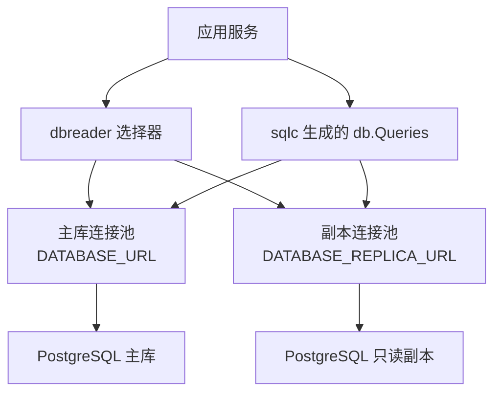
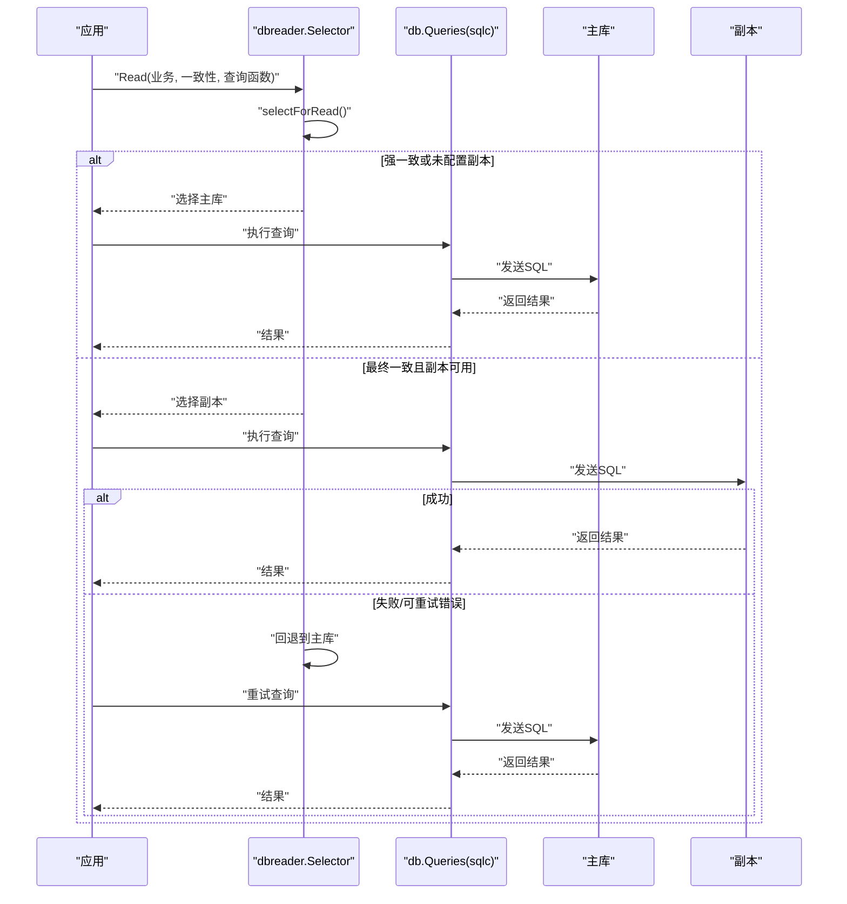
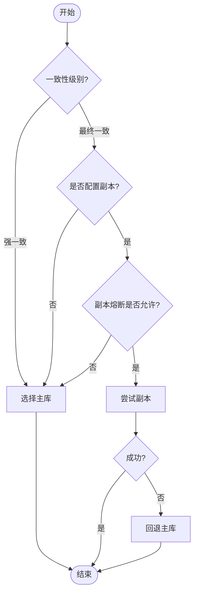
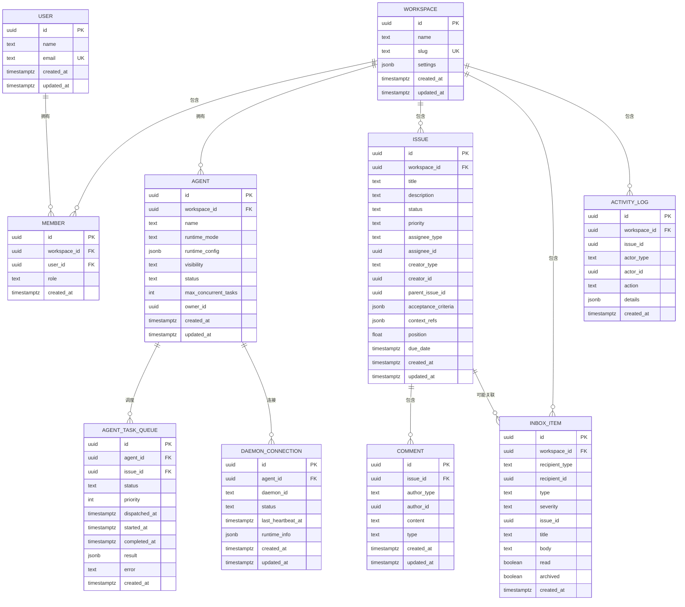
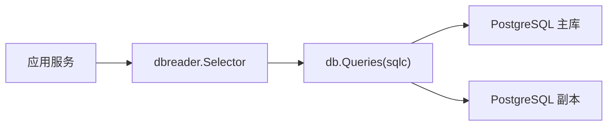

# 数据库架构

<cite>
**本文引用的文件**
- [server/sqlc.yaml](file://server/sqlc.yaml)
- [server/internal/dbreader/selector.go](file://server/internal/dbreader/selector.go)
- [SELF_HOSTING_ADVANCED.md](file://SELF_HOSTING_ADVANCED.md)
- [apps/docs/content/docs/environment-variables.mdx](file://apps/docs/content/docs/environment-variables.mdx)
- [CLAUDE.md](file://CLAUDE.md)
- [server/migrations/001_init.up.sql](file://server/migrations/001_init.up.sql)
- [server/pkg/db/queries/issue.sql](file://server/pkg/db/queries/issue.sql)
- [server/pkg/db/queries/workspace.sql](file://server/pkg/db/queries/workspace.sql)
- [server/pkg/db/queries/user.sql](file://server/pkg/db/queries/user.sql)
</cite>

## 目录
1. [简介](#简介)
2. [项目结构](#项目结构)
3. [核心组件](#核心组件)
4. [架构总览](#架构总览)
5. [详细组件分析](#详细组件分析)
6. [依赖关系分析](#依赖关系分析)
7. [性能考量](#性能考量)
8. [故障排查指南](#故障排查指南)
9. [结论](#结论)
10. [附录](#附录)

## 简介
本文件面向 Multica 的 PostgreSQL 17 数据库架构，系统性阐述主从复制、读写分离与连接池管理；说明迁移策略（每个索引必须使用 CREATE [UNIQUE] INDEX CONCURRENTLY 且各自独立的单语句迁移文件）；解释数据模型设计、实体关系映射以及 sqlc 代码生成流程；给出查询优化、缓存机制与一致性保证策略；并以架构图、表关系图与查询流程图帮助读者快速理解。同时重点说明“禁止外键与级联”的设计决策，以及应用层事务如何处理关系与清理。

## 项目结构
- 数据库引擎：PostgreSQL 17
- 代码生成：sqlc 将 SQL 查询与 schema 生成 Go 类型与客户端
- 读写分离：通过 dbreader 选择器在强一致与最终一致之间路由到主库或只读副本
- 连接池：pgxpool，支持主库与副本独立的最大/最小连接数配置
- 迁移：按编号顺序执行，索引构建要求并发创建并隔离为单语句迁移

图表来源
- [server/internal/dbreader/selector.go:100-179](file://server/internal/dbreader/selector.go#L100-L179)
- [SELF_HOSTING_ADVANCED.md:17-27](file://SELF_HOSTING_ADVANCED.md#L17-L27)
- [apps/docs/content/docs/environment-variables.mdx:49-53](file://apps/docs/content/docs/environment-variables.mdx#L49-L53)

章节来源
- [server/sqlc.yaml:1-13](file://server/sqlc.yaml#L1-L13)
- [SELF_HOSTING_ADVANCED.md:17-27](file://SELF_HOSTING_ADVANCED.md#L17-L27)
- [apps/docs/content/docs/environment-variables.mdx:49-53](file://apps/docs/content/docs/environment-variables.mdx#L49-L53)

## 核心组件
- 读写选择器（dbreader.Selector）：封装主/从选择、回退与熔断逻辑，提供 Read API 以显式声明一致性需求
- 连接池与环境变量：主库与副本连接池独立配置，支持最大/最小连接数与超时控制
- 迁移系统：按序执行 up/down 脚本，强制并发建索引与单语句隔离
- sqlc 代码生成：基于 migrations 与 queries 生成类型安全的 Go 客户端

章节来源
- [server/internal/dbreader/selector.go:100-179](file://server/internal/dbreader/selector.go#L100-L179)
- [server/sqlc.yaml:1-13](file://server/sqlc.yaml#L1-L13)
- [CLAUDE.md:110-116](file://CLAUDE.md#L110-L116)

## 架构总览
下图展示请求从应用进入，经 dbreader 选择器路由至主库或副本，再由 sqlc 生成的查询访问数据库的过程。

图表来源
- [server/internal/dbreader/selector.go:121-179](file://server/internal/dbreader/selector.go#L121-L179)
- [server/internal/dbreader/selector.go:212-253](file://server/internal/dbreader/selector.go#L212-L253)

## 详细组件分析

### 读写分离与连接池
- 环境变量与默认值
  - DATABASE_MAX_CONNS / DATABASE_MIN_CONNS：主库连接池上限/下限
  - DATABASE_REPLICA_URL：可选只读副本地址
  - DATABASE_REPLICA_MAX_CONNS / DATABASE_REPLICA_MIN_CONNS：副本连接池上限/下限
- 行为特性
  - 新副本连接会验证只读状态
  - 副本连接失败时透明回退主库，并短暂打开被动熔断
  - 无应用层强制的副本数据过期边界，需监控数据库层延迟
  - 关键一致性读取应留在主库

章节来源
- [SELF_HOSTING_ADVANCED.md:17-27](file://SELF_HOSTING_ADVANCED.md#L17-L27)
- [apps/docs/content/docs/environment-variables.mdx:49-53](file://apps/docs/content/docs/environment-variables.mdx#L49-L53)

### 选择器与一致性路由
- 一致性级别
  - StrongConsistency：始终走主库
  - EventualConsistency：优先副本，失败回退主库
- 熔断与恢复
  - 副本失败触发短时熔断，避免雪崩
  - 半开探测一次业务读，成功后关闭熔断
- 可观测性
  - 记录每次路由的业务、角色与原因标签

图表来源
- [server/internal/dbreader/selector.go:121-179](file://server/internal/dbreader/selector.go#L121-L179)
- [server/internal/dbreader/selector.go:295-361](file://server/internal/dbreader/selector.go#L295-L361)

章节来源
- [server/internal/dbreader/selector.go:100-179](file://server/internal/dbreader/selector.go#L100-L179)
- [server/internal/dbreader/selector.go:212-253](file://server/internal/dbreader/selector.go#L212-L253)
- [server/internal/dbreader/selector.go:295-361](file://server/internal/dbreader/selector.go#L295-L361)

### 迁移管理与索引策略
- 规则
  - 禁止数据库外键与级联，关系与清理在应用层用事务处理
  - 所有索引必须使用 CREATE [UNIQUE] INDEX CONCURRENTLY，且每个索引在独立的单语句迁移文件中
  - 条件跳过迁移仍记录在 schema_migrations，后续迁移需幂等 DDL
- 实践
  - 初始迁移包含基础表与索引定义
  - 新增索引应拆分为单独迁移文件，避免多语句与事务冲突

章节来源
- [CLAUDE.md:110-116](file://CLAUDE.md#L110-L116)
- [server/migrations/001_init.up.sql:167-178](file://server/migrations/001_init.up.sql#L167-L178)

### 数据模型与实体关系
- 核心实体
  - user：用户
  - workspace：工作区
  - member：成员与工作区关联
  - agent：智能体
  - issue：问题/任务
  - comment：评论
  - inbox_item：收件箱项
  - agent_task_queue：任务队列
  - daemon_connection：守护进程连接
  - activity_log：活动日志
- 关系说明
  - 早期版本包含 REFERENCES 约束，但生产规则禁止外键与级联，关系与清理由应用层事务保障
  - 当前设计强调应用层维护引用完整性与删除清理

图表来源
- [server/migrations/001_init.up.sql:4-178](file://server/migrations/001_init.up.sql#L4-L178)

章节来源
- [server/migrations/001_init.up.sql:4-178](file://server/migrations/001_init.up.sql#L4-L178)

### sqlc 代码生成与查询组织
- 配置要点
  - engine: postgresql
  - schema: migrations/
  - queries: pkg/db/queries/
  - 输出包名：db，生成路径：pkg/db/generated
  - 驱动：pgx/v5，启用 JSON 标签与空切片
- 查询组织
  - 按领域拆分 SQL 文件（如 issue.sql、workspace.sql、user.sql）
  - 生成类型安全的 Go 客户端供服务层调用

章节来源
- [server/sqlc.yaml:1-13](file://server/sqlc.yaml#L1-L13)
- [server/pkg/db/queries/issue.sql](file://server/pkg/db/queries/issue.sql)
- [server/pkg/db/queries/workspace.sql](file://server/pkg/db/queries/workspace.sql)
- [server/pkg/db/queries/user.sql](file://server/pkg/db/queries/user.sql)

### 查询优化策略
- 索引策略
  - 对高频查询字段建立合适索引（如 workspace_id、status、assignee_type/assignee_id 等）
  - 使用复合索引覆盖常见过滤与排序场景
- 查询模式
  - 明确一致性需求，强一致走主库，最终一致可走副本
  - 避免大事务与长事务，减少锁竞争
- 扫描与分页
  - 使用 keyset 分页替代 offset 分页以提升稳定性
  - 合理选择列投影，减少网络与序列化开销

章节来源
- [server/migrations/001_init.up.sql:167-178](file://server/migrations/001_init.up.sql#L167-L178)
- [server/internal/dbreader/selector.go:121-179](file://server/internal/dbreader/selector.go#L121-L179)

### 缓存机制
- 应用层缓存
  - 服务端状态由 TanStack Query 管理，客户端视图状态由 Zustand 管理，二者职责清晰
  - 可将热点只读数据缓存于内存或外部缓存，注意失效策略与一致性权衡
- 数据库层
  - 利用索引与查询计划优化减少计算压力
  - 副本读用于缓解主库压力，但需接受最终一致性与延迟风险

章节来源
- [apps/docs/content/docs/environment-variables.mdx:49-53](file://apps/docs/content/docs/environment-variables.mdx#L49-L53)

### 数据一致性保证
- 强一致读取：始终走主库
- 最终一致读取：优先副本，失败回退主库
- 副本延迟：由数据库层监控，应用不强制过期边界
- 事务边界：应用层事务负责关系与清理的原子性

章节来源
- [server/internal/dbreader/selector.go:121-179](file://server/internal/dbreader/selector.go#L121-L179)
- [apps/docs/content/docs/environment-variables.mdx:49-53](file://apps/docs/content/docs/environment-variables.mdx#L49-L53)

## 依赖关系分析
- 组件耦合
  - 应用服务依赖 dbreader 进行路由
  - dbreader 依赖 sqlc 生成的 db.Queries
  - 连接池与环境变量决定实际后端连接
- 外部依赖
  - pgx/v5 作为数据库驱动
  - PostgreSQL 主从集群

图表来源
- [server/internal/dbreader/selector.go:100-179](file://server/internal/dbreader/selector.go#L100-L179)
- [server/sqlc.yaml:1-13](file://server/sqlc.yaml#L1-L13)

章节来源
- [server/internal/dbreader/selector.go:100-179](file://server/internal/dbreader/selector.go#L100-L179)
- [server/sqlc.yaml:1-13](file://server/sqlc.yaml#L1-L13)

## 性能考量
- 连接池调优
  - 根据 pod 数量与 Postgres max_connections 预算连接数
  - 副本连接池独立配置，避免抢占写资源
- 副本回退与熔断
  - 短熔断降低雪崩风险，半开探测快速恢复
- 查询与索引
  - 针对高频过滤与排序建立复合索引
  - 使用 keyset 分页与列投影优化
- 监控与告警
  - 关注副本延迟、连接失败率与回退次数

章节来源
- [SELF_HOSTING_ADVANCED.md:17-27](file://SELF_HOSTING_ADVANCED.md#L17-L27)
- [apps/docs/content/docs/environment-variables.mdx:49-53](file://apps/docs/content/docs/environment-variables.mdx#L49-L53)
- [server/internal/dbreader/selector.go:212-253](file://server/internal/dbreader/selector.go#L212-L253)

## 故障排查指南
- 常见问题
  - 副本连接失败：检查 DATABASE_REPLICA_URL 与网络连通性
  - 回退频繁：观察副本健康与延迟，必要时提高副本容量或调整一致性策略
  - 迁移失败：确认索引构建是否为单语句且使用 CONCURRENTLY
- 诊断步骤
  - 查看路由指标（业务、角色、原因）
  - 检查连接池参数与超时设置
  - 核对迁移顺序与幂等性

章节来源
- [server/internal/dbreader/selector.go:212-253](file://server/internal/dbreader/selector.go#L212-L253)
- [CLAUDE.md:110-116](file://CLAUDE.md#L110-L116)

## 结论
Multica 采用 PostgreSQL 17 作为数据层，结合 dbreader 实现显式的一致性路由与稳健的副本回退机制；通过 sqlc 生成类型安全查询，配合严格的迁移规范（禁止外键与级联、并发建索引、单语句迁移）确保演进安全。连接池与环境变量提供弹性伸缩能力，查询与索引优化提升吞吐与延迟表现。整体架构在保证一致性的前提下，最大化利用副本资源，并通过应用层事务维护数据完整性。

## 附录
- 环境变量参考
  - DATABASE_URL / DATABASE_MAX_CONNS / DATABASE_MIN_CONNS
  - DATABASE_REPLICA_URL / DATABASE_REPLICA_MAX_CONNS / DATABASE_REPLICA_MIN_CONNS
- 迁移规范
  - 禁止外键与级联
  - 索引必须使用 CREATE [UNIQUE] INDEX CONCURRENTLY
  - 每个索引独立单语句迁移文件
- 代码生成
  - sqlc 配置与查询组织方式

章节来源
- [SELF_HOSTING_ADVANCED.md:17-27](file://SELF_HOSTING_ADVANCED.md#L17-L27)
- [apps/docs/content/docs/environment-variables.mdx:49-53](file://apps/docs/content/docs/environment-variables.mdx#L49-L53)
- [CLAUDE.md:110-116](file://CLAUDE.md#L110-L116)
- [server/sqlc.yaml:1-13](file://server/sqlc.yaml#L1-L13)