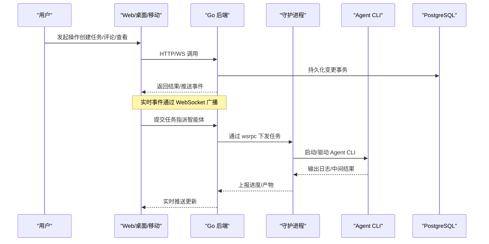
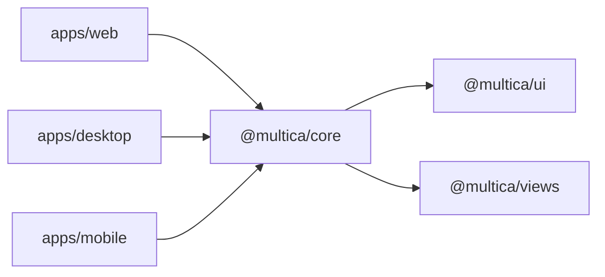
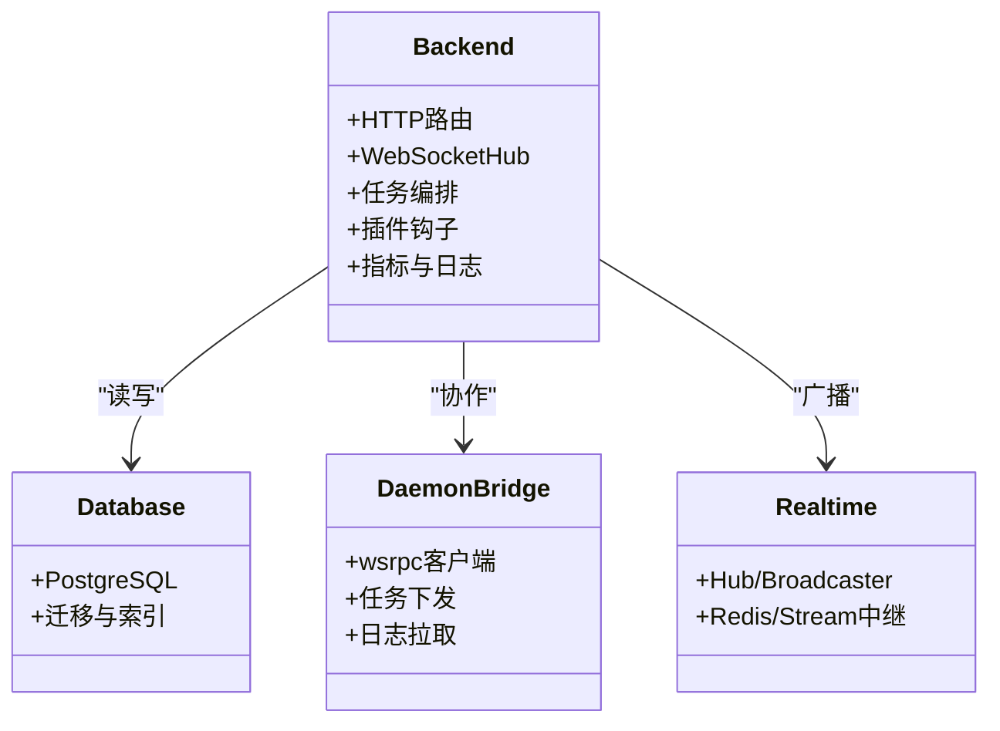
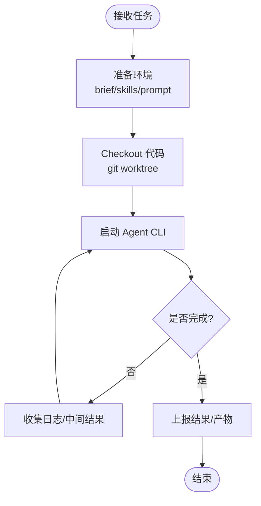
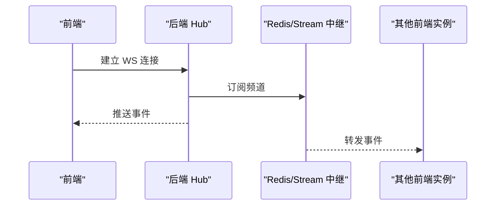
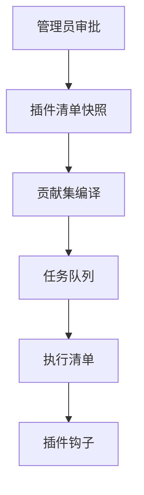
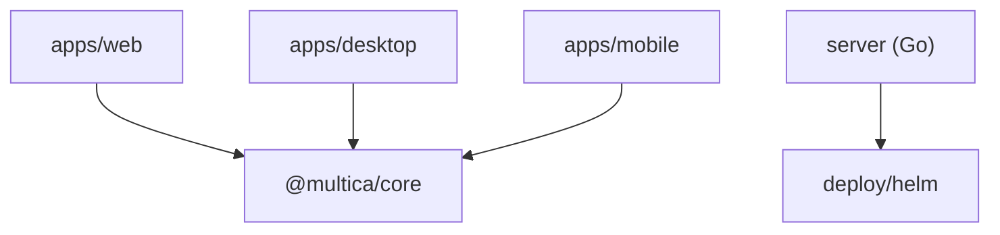
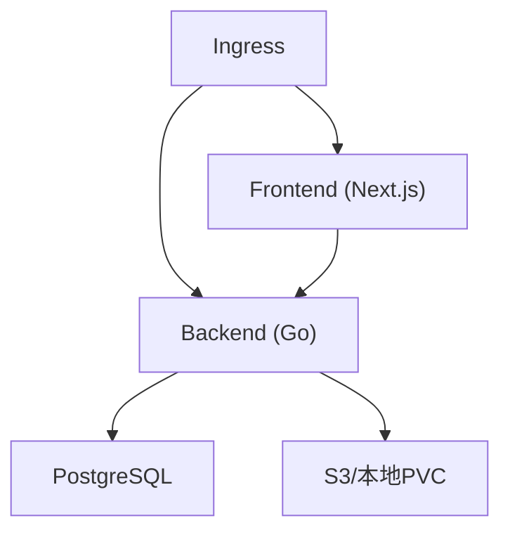

# 整体架构概览

<cite>
**本文引用的文件**
- [README.md](file://README.md)
- [package.json](file://package.json)
- [turbo.json](file://turbo.json)
- [pnpm-workspace.yaml](file://pnpm-workspace.yaml)
- [apps/web/package.json](file://apps/web/package.json)
- [apps/desktop/package.json](file://apps/desktop/package.json)
- [apps/mobile/package.json](file://apps/mobile/package.json)
- [packages/core/package.json](file://packages/core/package.json)
- [server/go.mod](file://server/go.mod)
- [deploy/helm/multica/values.yaml](file://deploy/helm/multica/values.yaml)
</cite>

## 目录
1. [简介](#简介)
2. [项目结构](#项目结构)
3. [核心组件](#核心组件)
4. [架构总览](#架构总览)
5. [详细组件分析](#详细组件分析)
6. [依赖关系分析](#依赖关系分析)
7. [性能考虑](#性能考虑)
8. [故障排查指南](#故障排查指南)
9. [结论](#结论)
10. [附录](#附录)

## 简介
Multica 是一个 AI 原生团队协作与任务管理平台，将智能体视为“一等公民”的协作者：像指派人类同事一样指派问题给智能体，由其在受控运行时中自主执行、汇报进度、提出阻塞并交付结果。系统采用三层架构：前端多平台应用层（Next.js Web、Electron 桌面、React Native 移动）、Go 后端服务层（Chi + gorilla/websocket + sqlc）、PostgreSQL 数据库层。Monorepo 通过 pnpm workspaces 管理包与依赖，Turborepo 统一编排构建、类型检查与测试；守护进程在用户机器上运行，负责装配智能体上下文、调度 26+ 种编码智能体 CLI 执行任务，并通过 WebSocket 与后端实时同步。

## 项目结构
仓库采用 Monorepo 组织方式：
- apps/*：多平台前端应用（Web/Docs/Desktop/Mobile）
- packages/*：跨端共享库（core/ui/views/plugin-sdk/tsconfig/eslint-config）
- server/*：Go 后端服务与命令入口
- deploy/helm：Kubernetes Helm 部署模板
- scripts：开发、安装、测试脚本
- examples/plugins：插件示例

```mermaid
graph TB
subgraph "前端应用"
WEB["apps/web<br/>Next.js"]
DESKTOP["apps/desktop<br/>Electron"]
MOBILE["apps/mobile<br/>Expo/React Native"]
end
subgraph "共享包"
CORE["@multica/core<br/>类型/状态/查询/WS客户端"]
UI["@multica/ui<br/>UI 组件"]
VIEWS["@multica/views<br/>视图适配"]
end
subgraph "后端"
GOAPI["Go 后端<br/>Chi + WS + sqlc"]
DAEMON["本地守护进程<br/>execenv/agent 调度"]
end
subgraph "数据"
PG["PostgreSQL 17"]
end
WEB --> CORE
DESKTOP --> CORE
MOBILE --> CORE
WEB --> GOAPI
DESKTOP --> GOAPI
MOBILE --> GOAPI
GOAPI --> PG
GOAPI < --> DAEMON
```

**图表来源**
- [README.md:190-218](file://README.md#L190-L218)
- [apps/web/package.json:16-30](file://apps/web/package.json#L16-L30)
- [apps/desktop/package.json:35-59](file://apps/desktop/package.json#L35-L59)
- [apps/mobile/package.json:22-82](file://apps/mobile/package.json#L22-L82)
- [packages/core/package.json:11-162](file://packages/core/package.json#L11-L162)
- [server/go.mod:5-39](file://server/go.mod#L5-L39)

**章节来源**
- [README.md:190-218](file://README.md#L190-L218)
- [package.json:6-30](file://package.json#L6-L30)
- [pnpm-workspace.yaml:1-4](file://pnpm-workspace.yaml#L1-L4)
- [turbo.json:23-81](file://turbo.json#L23-L81)

## 核心组件
- 前端多平台应用层
  - Next.js Web：提供工作区、看板、聊天、任务、设置等界面，使用 TanStack Query 管理服务端状态，Zustand 管理客户端/视图状态。
  - Electron 桌面：复用 Web 包，作为本机运行时注册器与代理，自动发现本机安装的 agent CLI。
  - React Native 移动：通过 Expo 提供移动端访问能力，同样依赖 @multica/core 进行状态与 API 交互。
- Go 后端服务层
  - 路由与 HTTP/WebSocket：基于 Chi 路由与 gorilla/websocket 提供 REST 与实时通信。
  - 数据访问：sqlc 生成类型安全的 SQL 访问代码，连接 PostgreSQL 17。
  - 守护进程桥接：通过 wsrpc 与本地 daemon 通信，下发任务、拉取日志与结果。
- 守护进程与智能体执行
  - execenv：权威装配智能体上下文（brief、skills、prompt），按 provider 注入配置与工作目录。
  - 工作目录隔离：每个任务一个 env root，git worktree 从共享裸缓存 checkout，同 (agent, issue) 多轮复用 PriorWorkDir。
  - 任务调度：daemon 负责探测/刷新可用 agent、拉起进程、收集输出、重试与超时控制。
- 数据库层
  - PostgreSQL 17：存储工作区、问题、任务、插件、指标等；迁移要求并发索引创建与应用层事务维护关系。

**章节来源**
- [packages/core/package.json:11-162](file://packages/core/package.json#L11-L162)
- [server/go.mod:5-39](file://server/go.mod#L5-L39)
- [README.md:190-218](file://README.md#L190-L218)

## 架构总览
下图展示从用户请求到数据存储与智能体执行的完整链路，以及实时通信与插件扩展点。



**图表来源**
- [README.md:190-218](file://README.md#L190-L218)
- [server/go.mod:11-18](file://server/go.mod#L11-L18)
- [turbo.json:8-21](file://turbo.json#L8-L21)

## 详细组件分析

### 前端应用层（Next.js / Electron / React Native）
- 共享状态与数据流
  - 服务端状态：TanStack Query 统一管理，避免重复请求与缓存不一致。
  - 客户端/视图状态：Zustand 仅用于视图级状态，共享 store 集中在 @multica/core。
- 包边界约束
  - packages/core 禁用 react-dom/localStorage/process.env，确保可被多端复用。
  - packages/ui 不得 import @multica/core 且无业务逻辑，专注 UI 组件。
  - packages/views 禁用 next/* 与 react-router-dom，走 NavigationAdapter。
  - apps/web/platform 是唯一可使用 Next.js API 的位置。
- 多端差异
  - Web：Next.js App Router，文档站点与主站共用部分资源。
  - Desktop：Electron 包装，集成本机运行时注册与 CLI 发现。
  - Mobile：Expo/React Native，提供移动端访问与通知能力。



**图表来源**
- [apps/web/package.json:16-30](file://apps/web/package.json#L16-L30)
- [apps/desktop/package.json:35-59](file://apps/desktop/package.json#L35-L59)
- [apps/mobile/package.json:22-82](file://apps/mobile/package.json#L22-L82)
- [packages/core/package.json:11-162](file://packages/core/package.json#L11-L162)

**章节来源**
- [apps/web/package.json:1-48](file://apps/web/package.json#L1-L48)
- [apps/desktop/package.json:1-82](file://apps/desktop/package.json#L1-L82)
- [apps/mobile/package.json:1-94](file://apps/mobile/package.json#L1-L94)
- [packages/core/package.json:1-189](file://packages/core/package.json#L1-L189)

### 后端服务层（Go）
- 技术栈
  - 路由：go-chi/chi/v5
  - WebSocket：gorilla/websocket
  - 数据库：jackc/pgx/v5 + sqlc
  - 其他：AWS SDK、Redis、Prometheus、Cron、JWT 等
- 职责
  - 暴露 REST/WS 接口，处理认证、权限、工作区与问题域模型。
  - 与守护进程通信（wsrpc），协调任务生命周期。
  - 通过 Redis/Stream 实现多实例实时广播与分片。
  - 指标采集、限流、鉴权中间件、审计日志。



**图表来源**
- [server/go.mod:5-39](file://server/go.mod#L5-L39)
- [turbo.json:8-21](file://turbo.json#L8-L21)

**章节来源**
- [server/go.mod:1-84](file://server/go.mod#L1-L84)

### 守护进程与智能体执行
- 上下文装配（execenv）
  - brief 以标记块写入 CLAUDE.md/AGENTS.md，技能水合到各 provider 原生 skills 目录。
  - 每轮 prompt 由 BuildPrompt 生成，易变字段放在每轮消息而非 brief，保证 prompt 缓存前缀稳定。
- 工作目录与隔离
  - WorkspacesRoot 下每个任务一个 env root，代码从共享裸缓存 .repos checkout 为 git worktree。
  - 同一 (agent, issue) 的多轮通过 PriorWorkDir 复用同一 workdir，不同任务并行隔离。
- 任务执行流程
  - 探测/刷新可用 agent，拉起进程，收集标准输出/错误，处理重试与超时。
  - 通过 wsrpc 向服务端上报进度、产物与状态。



**图表来源**
- [README.md:190-218](file://README.md#L190-L218)

**章节来源**
- [README.md:190-218](file://README.md#L190-L218)

### 实时通信机制
- WebSocket Hub：集中管理连接、房间与消息广播。
- 多实例支持：通过 Redis/Stream 中继实现跨 Pod 的消息分发与分片。
- 前端消费：@multica/core 提供 WS 客户端封装，结合 TanStack Query/Zustand 更新状态。



**图表来源**
- [server/go.mod:17-18](file://server/go.mod#L17-L18)
- [turbo.json:8-21](file://turbo.json#L8-L21)

**章节来源**
- [server/go.mod:5-39](file://server/go.mod#L5-L39)

### 插件系统架构
- 设计原则
  - 插件拥有独立清单与能力快照，管理员同意后才生效。
  - 关系与依赖清理在应用层用事务处理，禁止外键与级联。
  - 迁移策略：移除旧版复杂触发器与快照表，简化为安装行与叶子表。
- 执行时机
  - 任务入队时根据工作区与智能体组合计算贡献集，生成执行清单。
  - 插件可通过钩子参与 MCP、MCP Broker、技能注入等。



**图表来源**
- [README.md:190-218](file://README.md#L190-L218)

**章节来源**
- [README.md:190-218](file://README.md#L190-L218)

### 智能体作为一等公民的设计理念
- 智能体与人类成员并列出现在看板，具备名称、提供者、运行时与权限范围。
- 通过 Squad（小队）将人与智能体编组，由队长路由工作。
- 所有智能体的意图、运行过程、决策与 diff 都关联到同一问题，形成可追溯审计轨迹。

**章节来源**
- [README.md:38-91](file://README.md#L38-L91)

### 守护进程在任务执行中的关键作用
- 唯一可信的执行边界：代码不离开本机，agent CLI 由守护进程直接驱动。
- 上下文与缓存：brief/skills/prompt 的装配与缓存策略保障高效与一致性。
- 可靠性：重试、超时、进程树监控、磁盘与仓库回收，保障长时间运行的稳定性。

**章节来源**
- [README.md:190-218](file://README.md#L190-L218)

## 依赖关系分析
- 前端依赖
  - Web/Desktop/Mobile 均依赖 @multica/core 获取类型、查询、WS 客户端与状态管理。
  - Turborepo 统一任务图，确保 mdx、build、typecheck、test 的正确顺序与缓存。
- 后端依赖
  - Go 模块声明了路由、WS、数据库、云存储、指标、定时任务等关键依赖。
- 部署依赖
  - Helm values 定义前后端镜像、PostgreSQL、Ingress、上传存储与外部数据库接入。



**图表来源**
- [packages/core/package.json:11-162](file://packages/core/package.json#L11-L162)
- [turbo.json:23-81](file://turbo.json#L23-L81)
- [deploy/helm/multica/values.yaml:1-208](file://deploy/helm/multica/values.yaml#L1-L208)

**章节来源**
- [pnpm-workspace.yaml:1-44](file://pnpm-workspace.yaml#L1-L44)
- [turbo.json:1-84](file://turbo.json#L1-L84)
- [server/go.mod:1-84](file://server/go.mod#L1-L84)
- [deploy/helm/multica/values.yaml:1-208](file://deploy/helm/multica/values.yaml#L1-L208)

## 性能考虑
- 构建与开发
  - Turborepo 全局环境变量与任务依赖图确保类型检查、构建与测试的缓存命中与并行度。
  - mdx 生成单独任务以避免并发竞争。
- 运行时
  - 数据库：PostgreSQL 17，迁移要求并发索引创建与应用层事务维护关系，避免锁争用。
  - 守护进程：worktree 隔离与 PriorWorkDir 复用减少 IO 与初始化开销；prompt 缓存前缀稳定提升 LLM 调用效率。
  - 实时：Hub + Redis/Stream 中继支持水平扩展与低延迟推送。
- 存储
  - 上传存储可选 S3/CloudFront 或本地 PVC；多副本需 RWX 或对象存储。

[本节为通用指导，无需具体文件引用]

## 故障排查指南
- 常见问题定位
  - 前端状态不一致：确认 TanStack Query 缓存与 Zustand store 的职责边界，避免在服务端数据之外镜像状态。
  - 守护进程卡住：检查 agent CLI 进程树、超时与重试策略；核对 execenv 装配的 brief/skills/prompt。
  - 数据库迁移失败：确认迁移文件单语句、并发索引创建；应用层事务处理关系清理。
  - 实时消息丢失：检查 Hub 订阅与 Redis/Stream 中继健康；验证前端 WS 重连逻辑。
- 建议工具
  - 指标与日志：后端 Prometheus 指标与结构化日志；守护进程任务日志关联 ID。
  - 端到端测试：Playwright/E2E 用例覆盖认证、聊天、插件、任务等关键路径。

[本节为通用指导，无需具体文件引用]

## 结论
Multica 通过清晰的三层架构与严格的包边界，实现了跨平台前端、高性能后端与可靠的数据持久化；守护进程将智能体作为一等公民纳入团队工作流，借助 execenv 与 worktree 隔离保障安全与可观测性；Turborepo 与 pnpm workspaces 提升了 Monorepo 的可维护性与构建效率；Helm 部署模板使自托管与云部署一致可控。未来可在插件生态、实时广播与守护进程弹性方面继续演进。

[本节为总结，无需具体文件引用]

## 附录
- 部署拓扑（Helm）
  - Frontend：Next.js 独立部署，通过 Ingress 暴露。
  - Backend：Go 服务，默认单副本，可水平扩展；uploads 支持本地 PVC 或 S3。
  - PostgreSQL：内置或外部集群，支持 pgvector/pg_trgm。
  - Ingress：Traefik 或其他控制器，分离前端与后端域名。



**图表来源**
- [deploy/helm/multica/values.yaml:1-208](file://deploy/helm/multica/values.yaml#L1-L208)

**章节来源**
- [deploy/helm/multica/values.yaml:1-208](file://deploy/helm/multica/values.yaml#L1-L208)