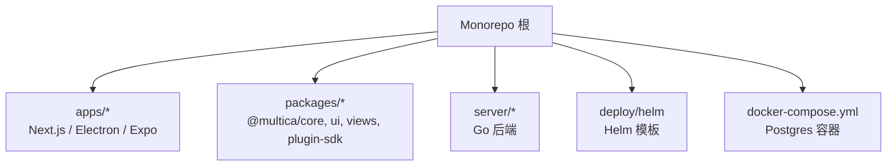
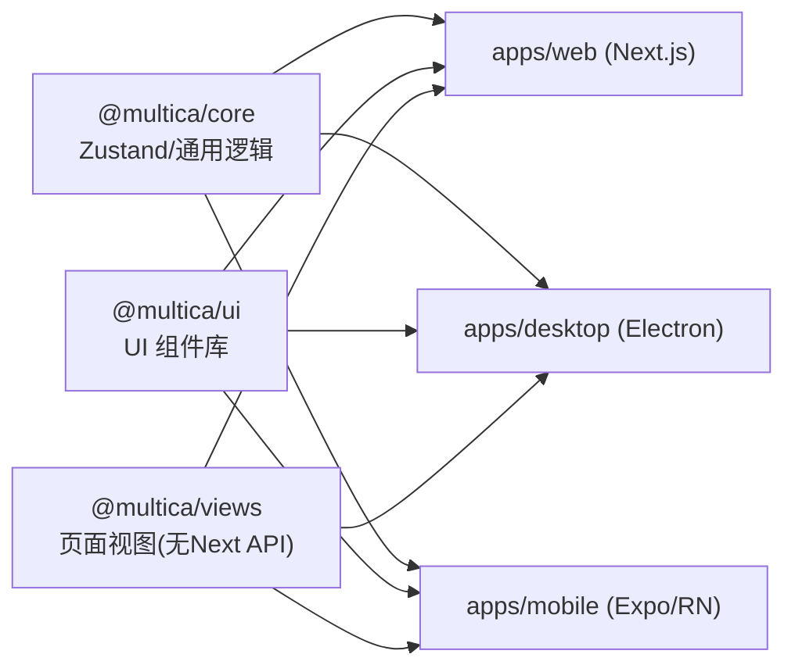
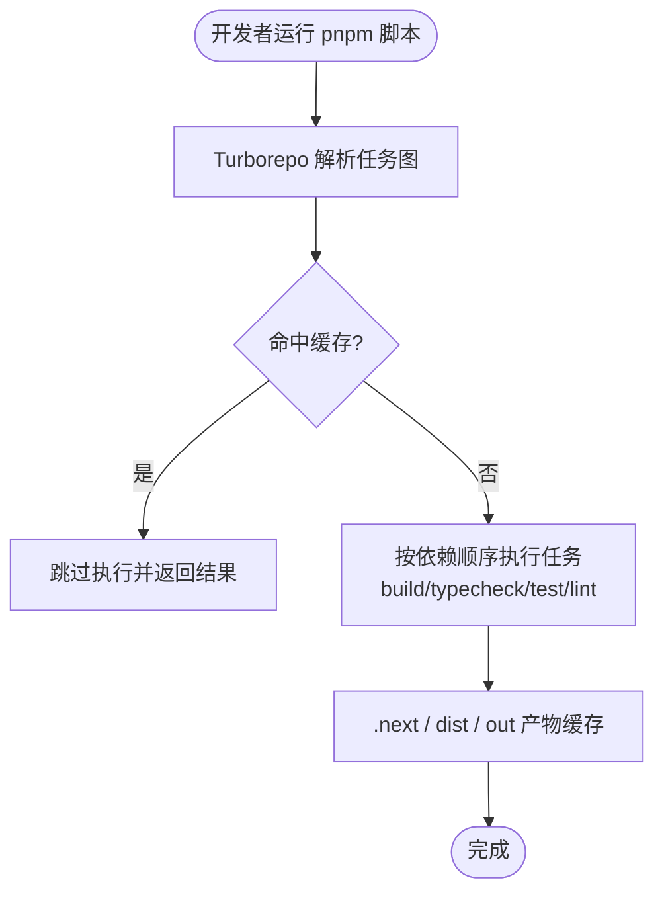
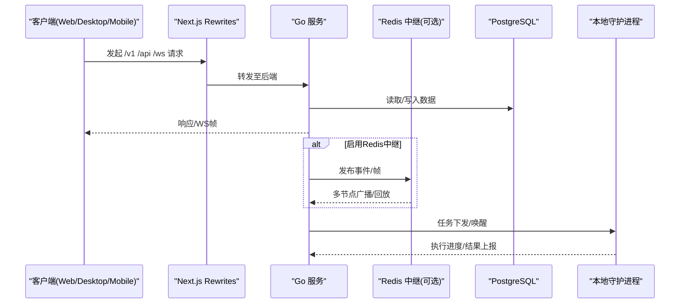
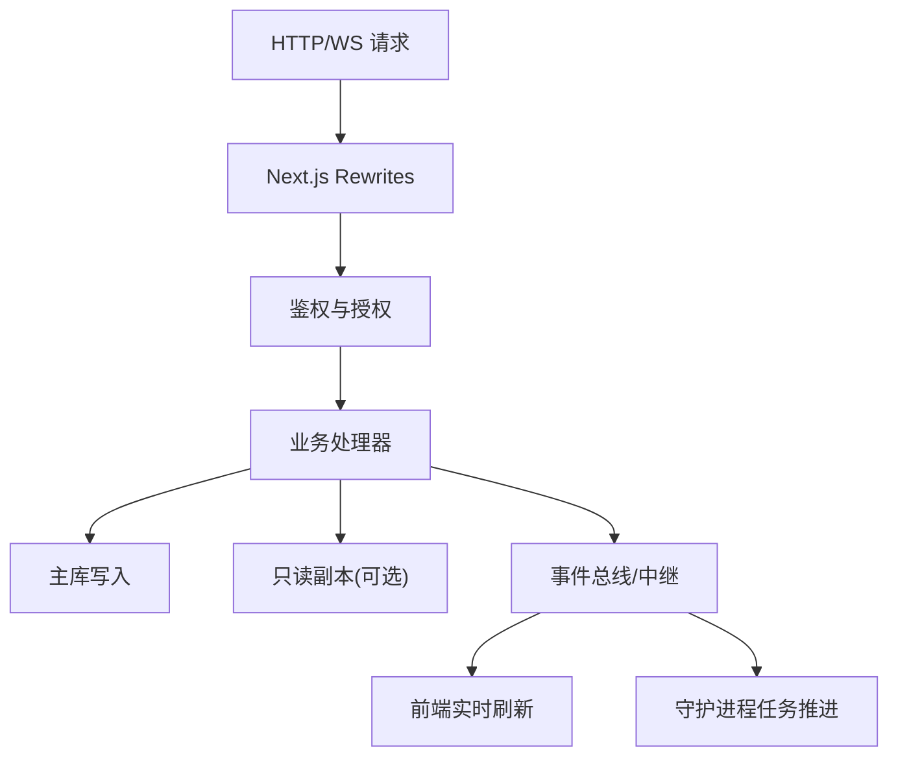
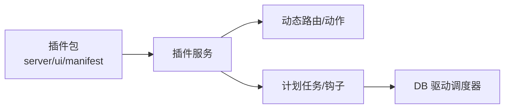
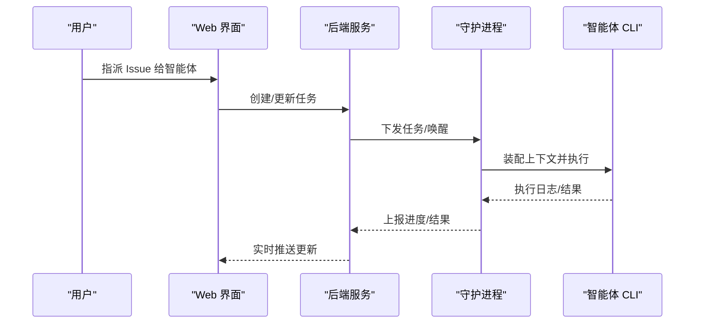
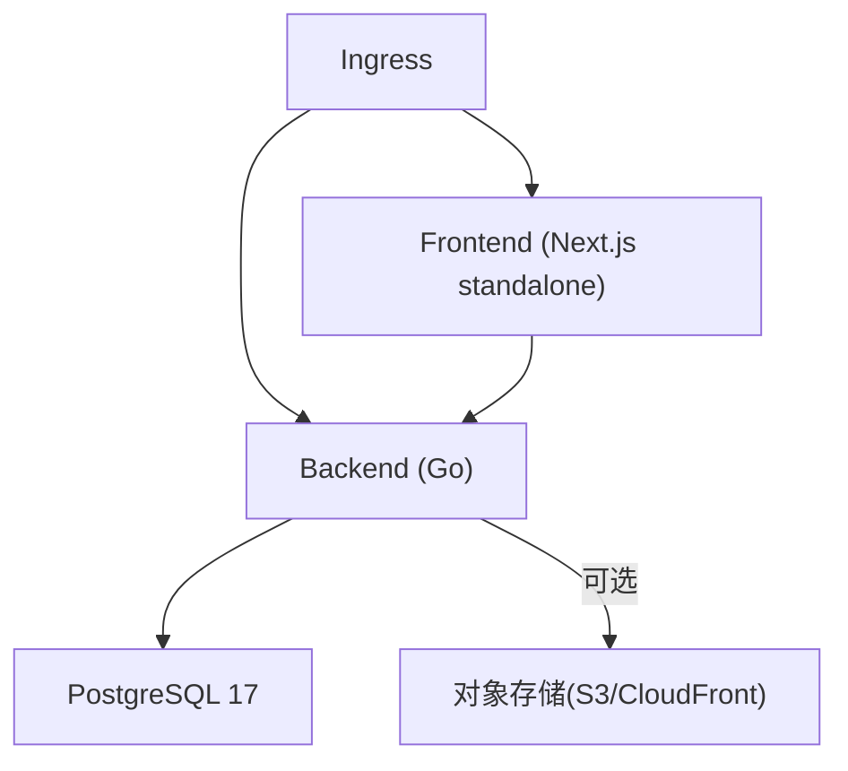
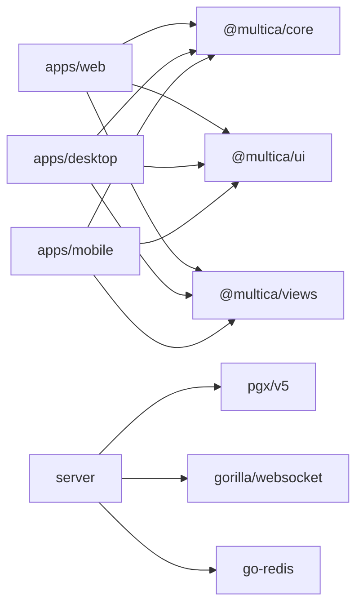

# 系统架构

<cite>
**本文引用的文件**
- [package.json](file://package.json)
- [turbo.json](file://turbo.json)
- [pnpm-workspace.yaml](file://pnpm-workspace.yaml)
- [README.md](file://README.md)
- [apps/web/package.json](file://apps/web/package.json)
- [apps/desktop/package.json](file://apps/desktop/package.json)
- [apps/mobile/package.json](file://apps/mobile/package.json)
- [apps/web/next.config.ts](file://apps/web/next.config.ts)
- [docker-compose.yml](file://docker-compose.yml)
- [deploy/helm/multica/values.yaml](file://deploy/helm/multica/values.yaml)
- [server/go.mod](file://server/go.mod)
- [server/cmd/server/main.go](file://server/cmd/server/main.go)
</cite>

## 目录
1. [简介](#简介)
2. [项目结构](#项目结构)
3. [核心组件](#核心组件)
4. [架构总览](#架构总览)
5. [详细组件分析](#详细组件分析)
6. [依赖关系分析](#依赖关系分析)
7. [性能考虑](#性能考虑)
8. [故障排查指南](#故障排查指南)
9. [结论](#结论)
10. [附录](#附录)

## 简介
Multica 是一个 AI 原生团队协作与任务管理平台，将“智能体”作为一等公民纳入工作流。前端采用 Next.js Web、Electron 桌面、React Native 移动三端统一；后端为 Go（Chi + gorilla/websocket），数据库使用 PostgreSQL 17；智能体在本地守护进程（daemon）中执行，支持约 26 种编码智能体 CLI。整体通过 Monorepo + pnpm workspaces + Turborepo 组织构建与开发，提供自托管与云部署能力。

## 项目结构
仓库采用 Monorepo 布局：
- apps/*：多平台应用（Web、Desktop、Mobile、Docs）
- packages/*：共享包（core、ui、views、plugin-sdk、tsconfig、eslint-config）
- server/*：Go 后端服务（cmd、internal、pkg、migrations）
- deploy/helm：Kubernetes Helm 部署模板
- docker-compose.yml：本地一键启动 Postgres
- turbo.json：Turborepo 任务编排与缓存策略
- pnpm-workspace.yaml：工作区与依赖目录管理



**图表来源**
- [package.json:6-30](file://package.json#L6-L30)
- [turbo.json:23-81](file://turbo.json#L23-L81)
- [pnpm-workspace.yaml:1-44](file://pnpm-workspace.yaml#L1-L44)
- [docker-compose.yml:3-16](file://docker-compose.yml#L3-L16)

**章节来源**
- [package.json:6-30](file://package.json#L6-L30)
- [turbo.json:23-81](file://turbo.json#L23-L81)
- [pnpm-workspace.yaml:1-44](file://pnpm-workspace.yaml#L1-L44)
- [docker-compose.yml:3-16](file://docker-compose.yml#L3-L16)

## 核心组件
- 前端多平台
  - Web：Next.js 16（App Router），通过 rewrites 将 /v1、/api、/ws、/auth、/uploads 等转发到后端
  - Desktop：Electron 打包同一套 Web UI 包，具备本地运行时集成能力
  - Mobile：Expo/React Native（iOS），复用 @multica/core 状态与数据层
- 后端服务
  - Go 服务（Chi 路由 + gorilla/websocket），负责 HTTP API、WebSocket 实时通信、调度器、插件钩子、渠道集成等
  - 数据库：PostgreSQL 17（pgvector/pgvector 镜像），读写池与只读副本可选
  - 实时：内存 Hub 或 Redis 分片 Stream 中继，支持多节点广播与回放
  - 守护进程：本地 daemon 执行智能体 CLI，通过 WebSocket 与后端交互
- 基础设施
  - Docker Compose：快速拉起 Postgres
  - Helm：生产级部署（Backend、Frontend、Postgres、Ingress）

**章节来源**
- [apps/web/package.json:16-30](file://apps/web/package.json#L16-L30)
- [apps/desktop/package.json:35-60](file://apps/desktop/package.json#L35-L60)
- [apps/mobile/package.json:22-83](file://apps/mobile/package.json#L22-L83)
- [server/go.mod:11-18](file://server/go.mod#L11-L18)
- [docker-compose.yml:3-16](file://docker-compose.yml#L3-L16)
- [deploy/helm/multica/values.yaml:4-19](file://deploy/helm/multica/values.yaml#L4-L19)

## 架构总览
下图展示从用户请求到数据存储的完整链路，以及实时通信与智能体执行路径。

```mermaid
graph TB
subgraph "客户端"
W["Web (Next.js)"]
Dk["Desktop (Electron)"]
M["Mobile (Expo/RN)"]
end
subgraph "前端代理"
RW["Next.js Rewrites<br/>/v1,/api,/ws,/auth,/uploads"]
end
subgraph "后端"
S["Go 服务 (Chi + WS)"]
R["Redis 中继(可选)<br/>分片Stream/回放"]
DB["PostgreSQL 17"]
end
subgraph "运行时"
DA["本地守护进程 (Daemon)"]
CLIs["26+ 智能体 CLI"]
end
W --> RW --> S
Dk --> RW --> S
M --> RW --> S
S < --> R
S --> DB
S < --> DA
DA --> CLIs
```

**图表来源**
- [apps/web/next.config.ts:51-96](file://apps/web/next.config.ts#L51-L96)
- [server/cmd/server/main.go:389-548](file://server/cmd/server/main.go#L389-L548)
- [server/cmd/server/main.go:628-655](file://server/cmd/server/main.go#L628-L655)
- [docker-compose.yml:3-16](file://docker-compose.yml#L3-L16)

## 详细组件分析

### 前端多平台架构与共享包边界
- 共享包边界约束
  - packages/core：禁用 react-dom/localStorage/process.env，仅承载跨平台通用逻辑与 Zustand store
  - packages/ui：不得 import @multica/core，无业务逻辑，纯 UI 组件
  - packages/views：禁用 next/* 与 react-router-dom，走 NavigationAdapter
  - apps/web/platform：唯一允许使用 Next.js API 的位置
- 状态管理分层
  - TanStack Query：独占服务端状态
  - Zustand：独占客户端/视图状态，且共享 store 必须位于 packages/core
- 三端共用 @multica/core、@multica/ui、@multica/views，确保一致体验与可维护性



**图表来源**
- [apps/web/package.json:16-30](file://apps/web/package.json#L16-L30)
- [apps/desktop/package.json:35-60](file://apps/desktop/package.json#L35-L60)
- [apps/mobile/package.json:22-83](file://apps/mobile/package.json#L22-L83)

**章节来源**
- [apps/web/package.json:16-30](file://apps/web/package.json#L16-L30)
- [apps/desktop/package.json:35-60](file://apps/desktop/package.json#L35-L60)
- [apps/mobile/package.json:22-83](file://apps/mobile/package.json#L22-L83)

### 构建系统与 Monorepo 工程化
- pnpm workspaces：集中管理 apps/* 与 packages/* 工作区，统一依赖版本（catalog）
- Turborepo：定义 build/typecheck/test/lint 任务，缓存输出（.next、dist、out），并通过 mdx 任务避免并发冲突
- 脚本入口：根 package.json 提供 dev:web、dev:desktop、dev:mobile 等命令，便于并行开发



**图表来源**
- [turbo.json:23-81](file://turbo.json#L23-L81)
- [package.json:6-30](file://package.json#L6-L30)
- [pnpm-workspace.yaml:1-44](file://pnpm-workspace.yaml#L1-L44)

**章节来源**
- [turbo.json:23-81](file://turbo.json#L23-L81)
- [package.json:6-30](file://package.json#L6-L30)
- [pnpm-workspace.yaml:1-44](file://pnpm-workspace.yaml#L1-L44)

### 后端服务与实时通信
- 启动流程
  - 校验 JWT_SECRET、邮件后端配置
  - 连接主库（可选只读副本），初始化事件总线与实时 Hub
  - 根据环境变量启用 Redis 中继（sharded/dual/legacy），实现多节点广播与回放
  - 注册订阅者、活动、通知监听器
  - 启动后台任务：心跳调度、运行时清理、自动巡检、计划任务调度器等
  - 启动 HTTP 服务（保留 WebSocket 升级）
- 实时通信
  - 内存 Hub：单节点模式
  - Redis 中继：多节点模式，支持分片 Stream、回放窗口、TTL 维护
  - 通道租约：可选 Redis 后端，保障频道消息投递一致性



**图表来源**
- [server/cmd/server/main.go:292-369](file://server/cmd/server/main.go#L292-L369)
- [server/cmd/server/main.go:389-548](file://server/cmd/server/main.go#L389-L548)
- [server/cmd/server/main.go:628-655](file://server/cmd/server/main.go#L628-L655)
- [apps/web/next.config.ts:51-96](file://apps/web/next.config.ts#L51-L96)

**章节来源**
- [server/cmd/server/main.go:292-369](file://server/cmd/server/main.go#L292-L369)
- [server/cmd/server/main.go:389-548](file://server/cmd/server/main.go#L389-L548)
- [server/cmd/server/main.go:628-655](file://server/cmd/server/main.go#L628-L655)
- [apps/web/next.config.ts:51-96](file://apps/web/next.config.ts#L51-L96)

### 数据流向：从用户请求到数据存储
- 请求进入：Next.js 通过 rewrites 将 /v1、/api、/ws、/auth、/uploads 转发到后端
- 鉴权与会话：后端校验 JWT，基于 scope 授权
- 数据访问：sqlc 生成查询，主库写、只读副本读（可选）
- 实时推送：Hub/Redis 中继将变更推送到前端与守护进程
- 存储规则：禁止外键与级联，关系与清理在应用层事务处理；迁移索引使用 CONCURRENTLY



**图表来源**
- [apps/web/next.config.ts:51-96](file://apps/web/next.config.ts#L51-L96)
- [server/cmd/server/main.go:389-548](file://server/cmd/server/main.go#L389-L548)

**章节来源**
- [apps/web/next.config.ts:51-96](file://apps/web/next.config.ts#L51-L96)
- [server/cmd/server/main.go:389-548](file://server/cmd/server/main.go#L389-L548)

### 插件系统架构
- 插件清单：examples/plugins 下每个插件包含 server、ui、multica.plugin.json 描述
- 生命周期：后端通过插件服务加载 manifest，注册路由、定时任务、钩子
- 调度：计划任务由 DB 驱动调度器统一管理，保证幂等与重试



**图表来源**
- [server/cmd/server/main.go:754-774](file://server/cmd/server/main.go#L754-L774)

**章节来源**
- [server/cmd/server/main.go:754-774](file://server/cmd/server/main.go#L754-L774)

### AI 代理执行流程
- 任务派发：后端将 Issue/任务指派给智能体，通过守护进程在本地机器执行
- 上下文装配：execenv 权威组装运行时 brief，技能水合到 provider 原生 skills 目录
- Prompt 生成：每轮 prompt 由 daemon.BuildPrompt 生成，易变字段放在每轮消息而非 brief，以保缓存前缀
- 执行与回传：智能体 CLI 执行后，结果与日志通过 WS 回传，前端实时更新



**图表来源**
- [server/cmd/server/main.go:628-655](file://server/cmd/server/main.go#L628-L655)

**章节来源**
- [server/cmd/server/main.go:628-655](file://server/cmd/server/main.go#L628-L655)

### 部署拓扑
- 本地开发：docker-compose 拉起 Postgres，配合 make dev 启动前后端
- 生产部署：Helm Chart 管理 Backend、Frontend、Postgres、Ingress，支持外部数据库与对象存储（S3/CloudFront）



**图表来源**
- [deploy/helm/multica/values.yaml:4-19](file://deploy/helm/multica/values.yaml#L4-L19)
- [deploy/helm/multica/values.yaml:76-158](file://deploy/helm/multica/values.yaml#L76-L158)
- [deploy/helm/multica/values.yaml:161-192](file://deploy/helm/multica/values.yaml#L161-L192)
- [deploy/helm/multica/values.yaml:194-208](file://deploy/helm/multica/values.yaml#L194-L208)

**章节来源**
- [deploy/helm/multica/values.yaml:4-19](file://deploy/helm/multica/values.yaml#L4-L19)
- [deploy/helm/multica/values.yaml:76-158](file://deploy/helm/multica/values.yaml#L76-L158)
- [deploy/helm/multica/values.yaml:161-192](file://deploy/helm/multica/values.yaml#L161-L192)
- [deploy/helm/multica/values.yaml:194-208](file://deploy/helm/multica/values.yaml#L194-L208)

## 依赖关系分析
- 前端依赖
  - Web/Desktop/Mobile 均依赖 @multica/core、@multica/ui、@multica/views
  - Web 额外依赖 Next.js、fumadocs-mdx
  - Desktop 额外依赖 electron/electron-builder
  - Mobile 额外依赖 expo/react-native
- 后端依赖
  - Chi 路由、gorilla/websocket、pgx/v5、redis/go-redis、prometheus、aws-sdk-go-v2 等
- 构建依赖
  - pnpm catalog 统一 React、Tailwind、Zustand、Vitest 等版本
  - Turborepo 管理任务图与缓存



**图表来源**
- [apps/web/package.json:16-30](file://apps/web/package.json#L16-L30)
- [apps/desktop/package.json:35-60](file://apps/desktop/package.json#L35-L60)
- [apps/mobile/package.json:22-83](file://apps/mobile/package.json#L22-L83)
- [server/go.mod:11-18](file://server/go.mod#L11-L18)
- [pnpm-workspace.yaml:5-44](file://pnpm-workspace.yaml#L5-L44)

**章节来源**
- [apps/web/package.json:16-30](file://apps/web/package.json#L16-L30)
- [apps/desktop/package.json:35-60](file://apps/desktop/package.json#L35-L60)
- [apps/mobile/package.json:22-83](file://apps/mobile/package.json#L22-L83)
- [server/go.mod:11-18](file://server/go.mod#L11-L18)
- [pnpm-workspace.yaml:5-44](file://pnpm-workspace.yaml#L5-L44)

## 性能考虑
- 前端
  - Next.js standalone 输出，减少运行时体积
  - 图片格式与质量优化（avif/webp）
  - 通过 rewrites 就近代理后端，降低跨域与网络开销
- 后端
  - 主从分离：主库写、只读副本读（可选），提升读扩展性
  - 实时：默认内存 Hub，生产启用 Redis 中继实现水平扩展与回放
  - 心跳与存活检测：批量心跳调度与 liveness store，避免误判离线
  - LLM 重试预算限制：防止上游失败导致长尾延迟
- 数据库
  - 迁移索引使用 CONCURRENTLY，避免锁表影响在线服务
  - 禁止外键与级联，复杂关系在应用层事务中处理，提高可控性与可观测性
- 部署
  - Helm 资源配额与亲和/容忍设置，支撑弹性扩缩容
  - 上传存储：本地 PVC 或 S3/CloudFront，按需选择

[本节为通用性能建议，不直接分析具体文件]

## 故障排查指南
- 启动阶段
  - JWT_SECRET 未设置或生产环境不安全：服务拒绝启动并提示生成强密钥
  - 邮件后端未配置：验证码将打印到日志而非发送邮件
  - 数据库不可达：启动时重试并记录错误，需检查 DATABASE_URL 与网络
- 实时通信
  - REDIS_URL/REALTIME_RELAY_REDIS_URL 未设置：回退到内存 Hub（单节点模式）
  - 中继模式非法：回退到默认 sharded 模式并记录警告
- 运行时
  - 指标端口非 loopback：发出安全警告，应通过私有网络或代理保护
  - 计划任务注册失败：记录告警但不阻塞服务，下次周期重试

**章节来源**
- [server/cmd/server/main.go:292-369](file://server/cmd/server/main.go#L292-L369)
- [server/cmd/server/main.go:389-548](file://server/cmd/server/main.go#L389-L548)
- [server/cmd/server/main.go:576-608](file://server/cmd/server/main.go#L576-L608)
- [server/cmd/server/main.go:754-774](file://server/cmd/server/main.go#L754-L774)

## 结论
Multica 通过 Monorepo + pnpm/Turbo 的工程化体系，结合 Next.js/Electron/Expo 的前端多端统一、Go 后端的高并发与实时能力、PostgreSQL 的稳定持久化，以及本地守护进程对 26+ 智能体 CLI 的统一编排，形成了可扩展、可自托管、面向 AI 协作的完整平台。其设计强调边界清晰、状态分层、水平扩展与可观测性，适合团队在生产环境中规模化使用。

## 附录
- 快速开始
  - 本地：docker-compose 拉起 Postgres，make dev 启动全栈
  - 文档：参考 README 中的架构图与开发说明
- 关键配置
  - 前端代理：Next.js rewrites 指向后端
  - 实时：REDIS_URL/REALTIME_RELAY_REDIS_URL 控制多节点广播
  - 存储：S3/CloudFront 或本地 PVC
  - 数据库：DATABASE_URL/DATABASE_REPLICA_URL

**章节来源**
- [README.md:190-237](file://README.md#L190-L237)
- [apps/web/next.config.ts:51-96](file://apps/web/next.config.ts#L51-L96)
- [server/cmd/server/main.go:389-548](file://server/cmd/server/main.go#L389-L548)
- [deploy/helm/multica/values.yaml:76-158](file://deploy/helm/multica/values.yaml#L76-L158)