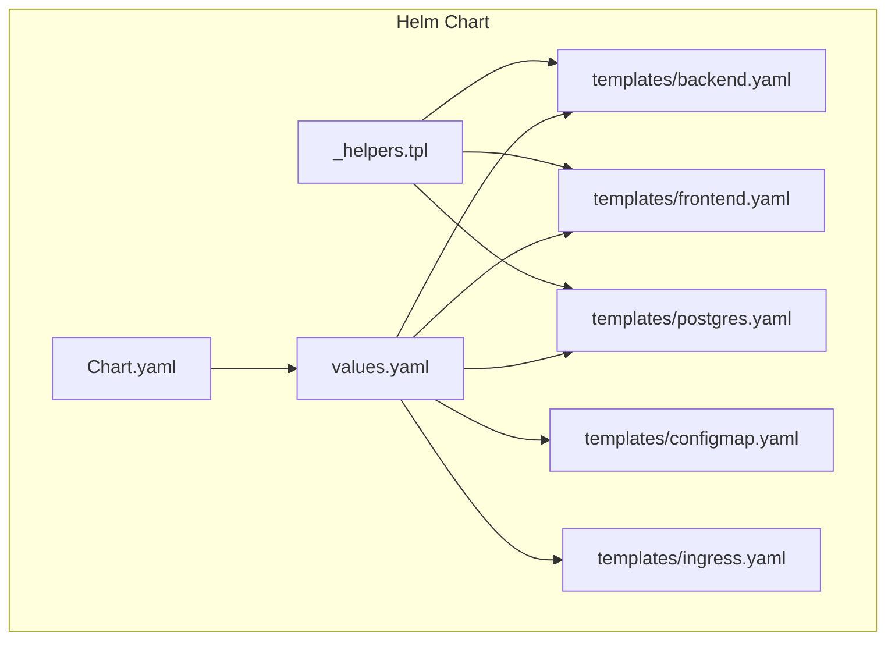
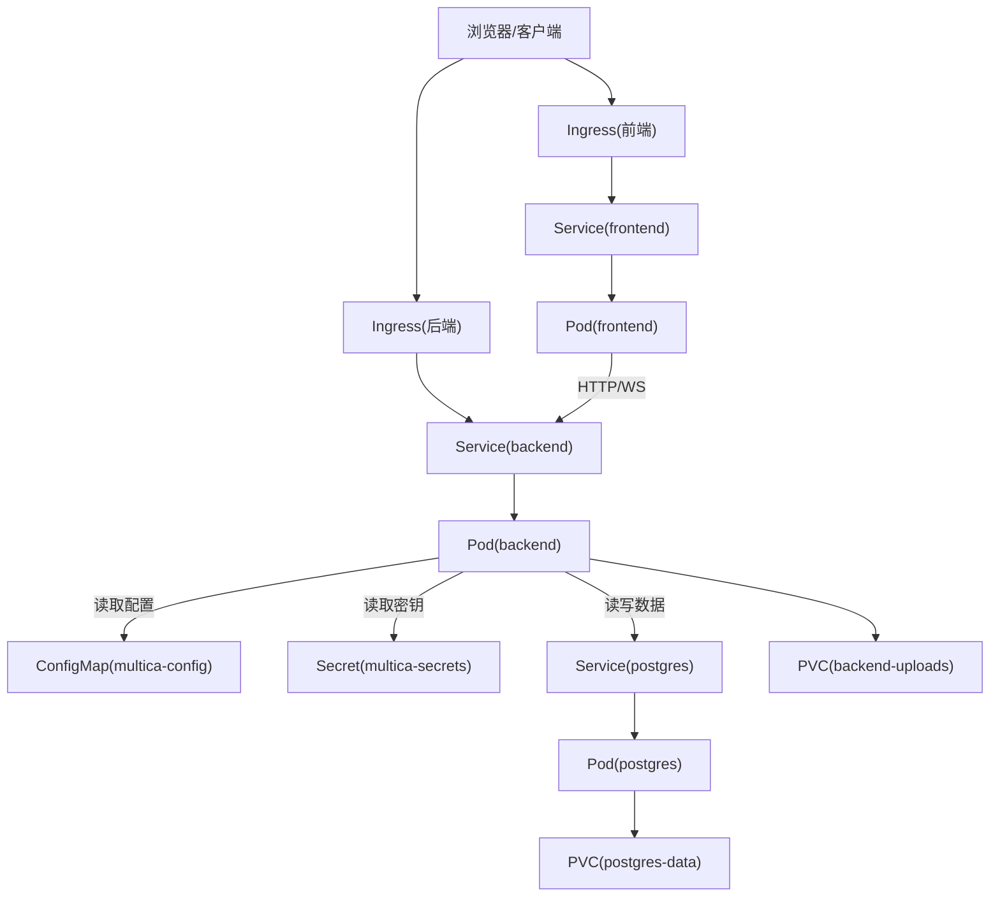
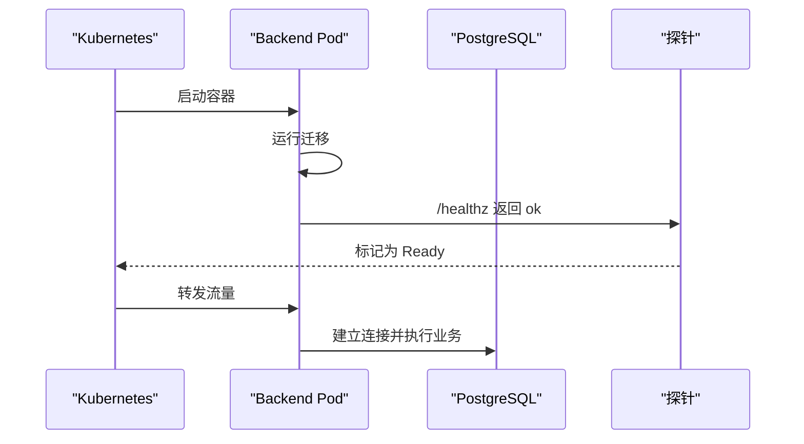
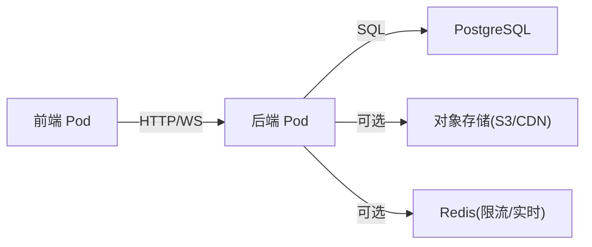

# Kubernetes 部署

<cite>
**本文引用的文件**
- [Chart.yaml](file://deploy/helm/multica/Chart.yaml)
- [values.yaml](file://deploy/helm/multica/values.yaml)
- [_helpers.tpl](file://deploy/helm/multica/templates/_helpers.tpl)
- [backend.yaml](file://deploy/helm/multica/templates/backend.yaml)
- [frontend.yaml](file://deploy/helm/multica/templates/frontend.yaml)
- [postgres.yaml](file://deploy/helm/multica/templates/postgres.yaml)
- [configmap.yaml](file://deploy/helm/multica/templates/configmap.yaml)
- [ingress.yaml](file://deploy/helm/multica/templates/ingress.yaml)
- [SELF_HOSTING.md](file://SELF_HOSTING.md)
- [SELF_HOSTING_ADVANCED.md](file://SELF_HOSTING_ADVANCED.md)
</cite>

## 目录
1. [简介](#简介)
2. [项目结构](#项目结构)
3. [核心组件](#核心组件)
4. [架构总览](#架构总览)
5. [详细组件分析](#详细组件分析)
6. [依赖关系分析](#依赖关系分析)
7. [性能与生产级配置](#性能与生产级配置)
8. [故障排查指南](#故障排查指南)
9. [结论](#结论)
10. [附录：云平台适配与最佳实践](#附录：云平台适配与最佳实践)

## 简介
本指南面向在 Kubernetes 上以 Helm Chart 部署 Multica 的生产环境。内容涵盖 Chart 结构与 values.yaml 参数、各资源对象（Deployment、Service、ConfigMap、Ingress、PVC）的配置要点，以及 PostgreSQL、Redis、对象存储等外部依赖的接入方式。同时给出健康检查、滚动更新、资源限制、安全与可观测性等生产级建议，并提供不同云平台的适配思路。

## 项目结构
Helm Chart 位于 deploy/helm/multica，包含 Chart 元数据、默认值与模板。模板分别定义后端、前端、数据库、配置、入口等资源；Secret 由用户提前创建，不被 Chart 管理，避免敏感信息进入版本库。

图表来源
- [Chart.yaml:1-17](file://deploy/helm/multica/Chart.yaml#L1-L17)
- [values.yaml:1-208](file://deploy/helm/multica/values.yaml#L1-L208)
- [_helpers.tpl:1-36](file://deploy/helm/multica/templates/_helpers.tpl#L1-L36)
- [backend.yaml:1-163](file://deploy/helm/multica/templates/backend.yaml#L1-L163)
- [frontend.yaml:1-77](file://deploy/helm/multica/templates/frontend.yaml#L1-L77)
- [postgres.yaml:1-111](file://deploy/helm/multica/templates/postgres.yaml#L1-L111)
- [configmap.yaml:1-37](file://deploy/helm/multica/templates/configmap.yaml#L1-L37)
- [ingress.yaml:1-60](file://deploy/helm/multica/templates/ingress.yaml#L1-L60)

章节来源
- [Chart.yaml:1-17](file://deploy/helm/multica/Chart.yaml#L1-L17)
- [values.yaml:1-208](file://deploy/helm/multica/values.yaml#L1-L208)

## 核心组件
- 后端（Go API + WebSocket）：Deployment + Service，可选本地上传 PVC，启动时执行迁移并通过 /healthz 就绪。
- 前端（Next.js 独立服务）：Deployment + Service，通过环境变量将 API/WS 指向后端。
- 数据库（PostgreSQL 17）：可选内置 Deployment + PVC，或外部数据库。
- 配置：ConfigMap 注入非敏感配置；敏感项来自外部 Secret。
- 入口：两个 Ingress，分别暴露前端与后端域名。

章节来源
- [backend.yaml:21-140](file://deploy/helm/multica/templates/backend.yaml#L21-L140)
- [frontend.yaml:3-77](file://deploy/helm/multica/templates/frontend.yaml#L3-L77)
- [postgres.yaml:1-111](file://deploy/helm/multica/templates/postgres.yaml#L1-L111)
- [configmap.yaml:1-37](file://deploy/helm/multica/templates/configmap.yaml#L1-L37)
- [ingress.yaml:1-60](file://deploy/helm/multica/templates/ingress.yaml#L1-L60)

## 架构总览
下图展示了 Helm Chart 渲染出的主要资源及其交互关系。

图表来源
- [ingress.yaml:1-60](file://deploy/helm/multica/templates/ingress.yaml#L1-L60)
- [frontend.yaml:3-77](file://deploy/helm/multica/templates/frontend.yaml#L3-L77)
- [backend.yaml:21-140](file://deploy/helm/multica/templates/backend.yaml#L21-L140)
- [postgres.yaml:1-111](file://deploy/helm/multica/templates/postgres.yaml#L1-L111)
- [configmap.yaml:1-37](file://deploy/helm/multica/templates/configmap.yaml#L1-L37)

## 详细组件分析

### Helm Values 与关键参数
- 镜像与拉取策略：images.backend/images.frontend/images.postgres 支持 repository/tag/pullPolicy。
- 外部 Secret：existingSecret 指定预创建的 Secret 名称，用于 JWT、数据库密码、第三方密钥等。
- PostgreSQL：
  - external.enabled=true 时不创建内置 Postgres，需通过 DATABASE_URL 提供连接串。
  - persistence.size/storageClass/accessModes 控制持久化。
  - resources/affinity/tolerations 用于调度与资源限制。
- Backend：
  - replicas=1（默认），strategy=Recreate；多副本需配合共享存储或对象存储。
  - uploads.persistence.enabled 控制是否挂载本地上传目录；S3 场景可关闭。
  - config.* 映射为 ConfigMap 键，如 appUrl、frontendOrigin、corsAllowedOrigins、cookieDomain、s3Bucket、cloudfront* 等。
  - resources/affinity/tolerations 同上。
- Frontend：
  - replicas，config.remoteApiUrl/docsUrl/publicApiUrl/publicWsUrl 控制运行时上游。
  - compatibility.backendAlias 仅为兼容旧镜像创建 ExternalName Service。
  - resources/affinity/tolerations。
- Ingress：
  - enabled/className/annotations，frontend.host 与 backend.host 分别绑定域名。
  - tls 段可配置证书。

章节来源
- [values.yaml:1-208](file://deploy/helm/multica/values.yaml#L1-L208)

### 后端 Deployment、Service、健康检查与滚动更新
- 启动流程：容器入口先执行迁移，再提供服务；使用 startupProbe 等待 /healthz 就绪，readinessProbe 探测 /healthz，livenessProbe 仅探测 /health（不依赖数据库）。
- 配置注入：envFrom 引用 ConfigMap 与 Secret；当未启用外部数据库时，通过 helper 生成 DATABASE_URL。
- 存储：可选 PVC 挂载到 /app/data/uploads；若启用 S3，则无需 PVC。
- 滚动更新：对 ConfigMap/Secret 变更使用 checksum 注解触发 Pod 滚动；Deployment 策略为 Recreate。

图表来源
- [backend.yaml:21-122](file://deploy/helm/multica/templates/backend.yaml#L21-L122)
- [_helpers.tpl:27-36](file://deploy/helm/multica/templates/_helpers.tpl#L27-L36)

章节来源
- [backend.yaml:21-163](file://deploy/helm/multica/templates/backend.yaml#L21-L163)

### 前端 Deployment、Service 与运行时上游
- 通过环境变量设置 HOSTNAME、PORT、REMOTE_API_URL、DOCS_URL、NEXT_PUBLIC_API_URL、NEXT_PUBLIC_WS_URL。
- 默认 REMOTE_API_URL 指向同 Release 的后端 Service，便于单域或分域部署。
- 兼容性：legacy 镜像可通过 frontend.compatibility.backendAlias 创建名为 backend 的 ExternalName Service。

章节来源
- [frontend.yaml:1-77](file://deploy/helm/multica/templates/frontend.yaml#L1-L77)

### PostgreSQL 内置与外部接入
- 内置模式：创建 PVC、Deployment、Service，使用 POSTGRES_* 环境变量初始化数据库；readinessProbe 使用 pg_isready。
- 外部模式：设置 postgres.external.enabled=true，并在 existingSecret 中提供 DATABASE_URL；Chart 不再创建数据库相关资源。
- 注意：PGDATA 指向子目录以避免 local-path 的 lost+found 干扰初始化。

章节来源
- [postgres.yaml:1-111](file://deploy/helm/multica/templates/postgres.yaml#L1-L111)

### ConfigMap 与敏感配置分离
- ConfigMap 承载所有非敏感配置键，包括端口、超时、应用 URL、CORS、Cookie 域、邮件发件人、注册开关、VCS 集成开关、Cloud/S3/CloudFront 等。
- 敏感信息（JWT_SECRET、POSTGRES_PASSWORD、第三方密钥等）通过 existingSecret 注入，不在 Chart 中渲染。

章节来源
- [configmap.yaml:1-37](file://deploy/helm/multica/templates/configmap.yaml#L1-L37)
- [values.yaml:21-46](file://deploy/helm/multica/values.yaml#L21-L46)

### Ingress 与 TLS
- 两个 Ingress：前端 host 指向前端 Service 3000 端口；后端 host 指向后端 Service 8080 端口。
- 支持 ingressClassName、annotations、tls 段配置证书。

章节来源
- [ingress.yaml:1-60](file://deploy/helm/multica/templates/ingress.yaml#L1-L60)

## 依赖关系分析
- 后端依赖：
  - 数据库：内置或外部 PostgreSQL。
  - 对象存储：可选 S3/CloudFront；未配置时使用本地磁盘（PVC）。
  - 缓存/限流：可选 Redis（见下文“外部依赖”）。
- 前端依赖：后端 Service（通过环境变量）。
- 入口：Ingress 将域名路由至对应 Service。

图表来源
- [backend.yaml:66-80](file://deploy/helm/multica/templates/backend.yaml#L66-L80)
- [configmap.yaml:8-36](file://deploy/helm/multica/templates/configmap.yaml#L8-L36)
- [SELF_HOSTING_ADVANCED.md:92-117](file://SELF_HOSTING_ADVANCED.md#L92-L117)

章节来源
- [backend.yaml:66-80](file://deploy/helm/multica/templates/backend.yaml#L66-L80)
- [configmap.yaml:8-36](file://deploy/helm/multica/templates/configmap.yaml#L8-L36)
- [SELF_HOSTING_ADVANCED.md:92-117](file://SELF_HOSTING_ADVANCED.md#L92-L117)

## 性能与生产级配置
- 资源限制与请求：
  - 为后端、前端、PostgreSQL 设置 requests/limits，确保 QoS 与调度合理。
  - 参考 values.yaml 中的默认值并根据负载调整。
- 健康检查：
  - 后端：startupProbe/readinessProbe 使用 /healthz；livenessProbe 使用 /health，避免数据库不可用时误杀。
  - 数据库：readinessProbe 使用 pg_isready。
- 滚动更新：
  - 后端使用 Recreate 策略；ConfigMap/Secret 变更通过 checksum 触发滚动。
  - 前端无特殊策略，按 Deployment 默认行为滚动。
- 并发与扩展：
  - 后端默认 1 副本；如需水平扩展，建议使用对象存储替代本地上传卷，或配置 ReadWriteMany 存储类。
  - 数据库默认单副本；生产建议托管数据库或使用高可用方案。
- 可观测性：
  - 后端支持 Prometheus 指标监听（METRICS_ADDR），建议绑定内网地址并受网络策略保护。
  - 日志建议集中采集，结合健康端点做告警。

章节来源
- [backend.yaml:81-116](file://deploy/helm/multica/templates/backend.yaml#L81-L116)
- [postgres.yaml:70-79](file://deploy/helm/multica/templates/postgres.yaml#L70-L79)
- [values.yaml:149-192](file://deploy/helm/multica/values.yaml#L149-L192)
- [SELF_HOSTING_ADVANCED.md:592-633](file://SELF_HOSTING_ADVANCED.md#L592-L633)

## 故障排查指南
- 后端无法就绪：
  - 检查 /healthz 响应；确认数据库连接、迁移完成。
  - 查看 startupProbe 失败计数与日志。
- 数据库不可用导致 NotReady：
  - readinessProbe 会反映依赖状态；livenessProbe 不应重启进程。
- 登录/验证码问题：
  - 确认邮件服务（Resend/SMTP）已配置；或未配置时在日志中获取验证码。
- 跨域/WebSocket 失败：
  - 校验 CORS_ALLOWED_ORIGINS 与 FRONTEND_ORIGIN；反向代理需正确透传 Upgrade。
- 升级回滚：
  - 使用 helm upgrade/rollback；必要时单独 rollout restart 工作负载。

章节来源
- [SELF_HOSTING.md:256-269](file://SELF_HOSTING.md#L256-L269)
- [SELF_HOSTING.md:319-359](file://SELF_HOSTING.md#L319-L359)
- [SELF_HOSTING_ADVANCED.md:592-633](file://SELF_HOSTING_ADVANCED.md#L592-L633)

## 结论
该 Helm Chart 提供了开箱即用的 Multica 生产部署基线：前后端与数据库的资源编排、配置与密钥分离、健康检查与滚动更新机制完善。生产环境建议采用外部数据库与对象存储，按需启用 Redis 进行限流与实时能力扩展，并结合 Ingress 与 TLS 实现安全的对外访问。

## 附录：云平台适配与最佳实践
- 数据库：
  - 推荐使用云托管 PostgreSQL（如 RDS/Aurora/Cloud SQL 等），设置 postgres.external.enabled=true，并通过 DATABASE_URL 接入。
  - 根据连接池与实例规格调整 DATABASE_MAX_CONNS/DATABASE_MIN_CONNS。
- 对象存储：
  - 配置 S3_BUCKET/S3_REGION，必要时设置 AWS_ENDPOINT_URL 对接兼容存储（MinIO/R2/B2）。
  - 私有桶可使用 ATTACHMENT_DOWNLOAD_MODE=proxy 或通过 CloudFront 签名访问。
- 缓存与限流：
  - 设置 REDIS_URL 启用共享限流、实时事件与 token 缓存；托管 Redis 若禁止 CLIENT SETNAME，设置 REDIS_DISABLE_CLIENT_NAME=true。
- Ingress/网关：
  - 根据平台选择 ingressClassName（如 traefik/nginx/istio 等），配置 annotations 启用 WAF、限流、TLS 自动签发等。
  - 双域名（前端/后端）时需设置 COOKIE_DOMAIN 为共同父域，并确保可信代理 CIDR 配置正确。
- 安全：
  - 使用现有 Secret 管理敏感信息；最小权限原则访问数据库与对象存储。
  - 生产禁用开发验证码；严格限制 ALLOW_SIGNUP/DISABLE_WORKSPACE_CREATION。
- 可观测性与运维：
  - 开启 METRICS_ADDR 并内网暴露；结合集群监控与日志系统。
  - 定期备份数据库与对象存储；制定回滚与扩容预案。

章节来源
- [values.yaml:51-74](file://deploy/helm/multica/values.yaml#L51-L74)
- [values.yaml:112-158](file://deploy/helm/multica/values.yaml#L112-L158)
- [values.yaml:163-192](file://deploy/helm/multica/values.yaml#L163-L192)
- [values.yaml:197-208](file://deploy/helm/multica/values.yaml#L197-L208)
- [SELF_HOSTING_ADVANCED.md:92-117](file://SELF_HOSTING_ADVANCED.md#L92-L117)
- [SELF_HOSTING_ADVANCED.md:154-168](file://SELF_HOSTING_ADVANCED.md#L154-L168)
- [SELF_HOSTING_ADVANCED.md:492-512](file://SELF_HOSTING_ADVANCED.md#L492-L512)