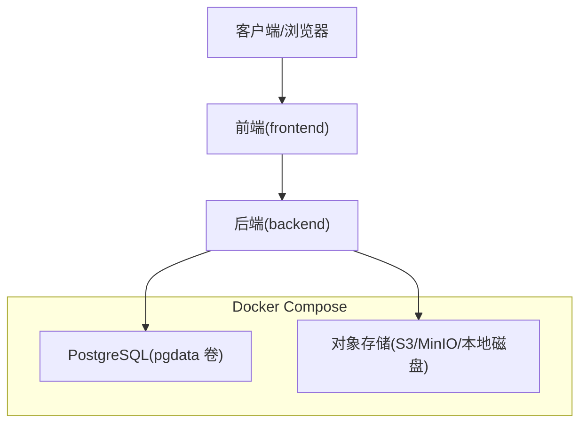
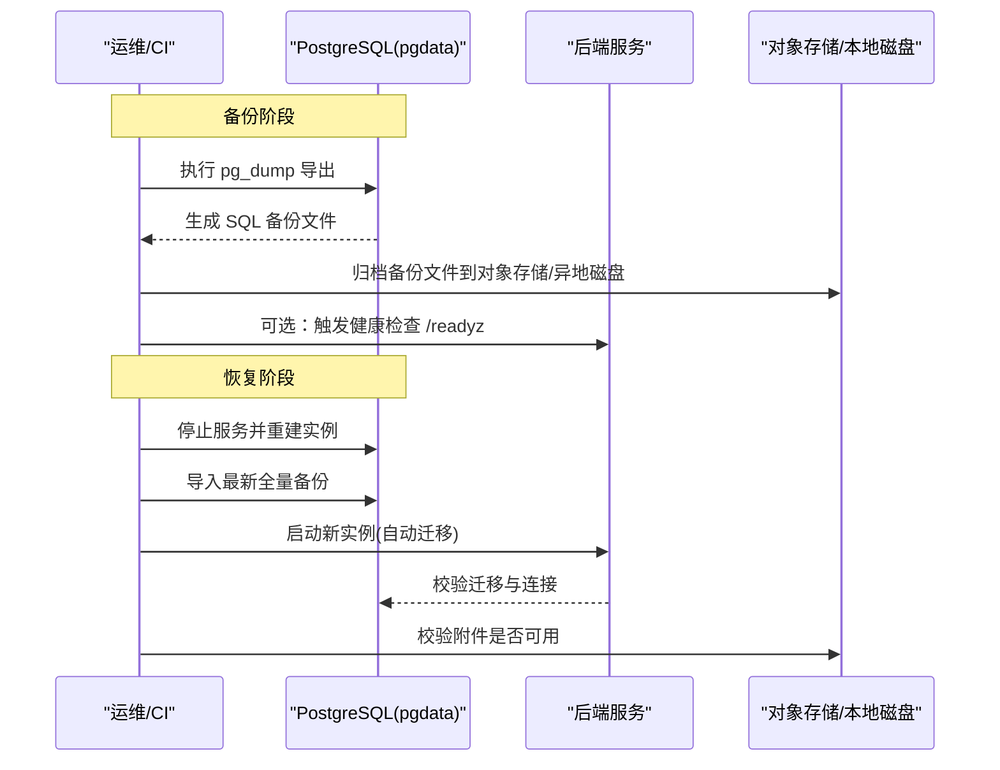
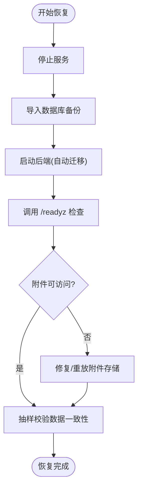
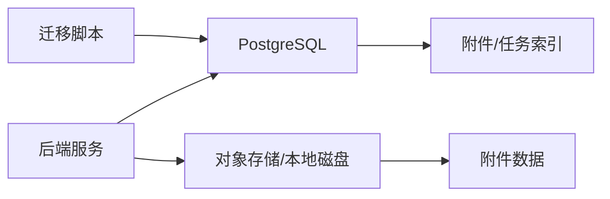
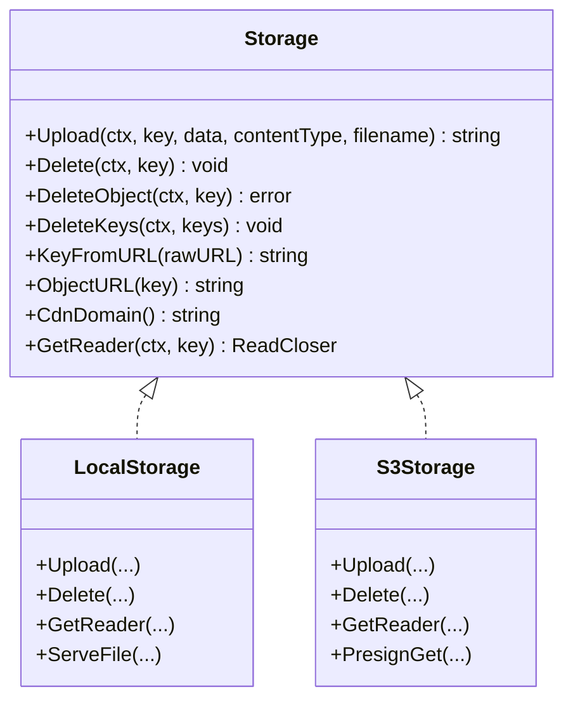

# 备份与恢复

<cite>
**本文引用的文件**
- [docker-compose.selfhost.yml](file://docker-compose.selfhost.yml)
- [entrypoint.sh](file://docker/entrypoint.sh)
- [storage.go](file://server/internal/storage/storage.go)
- [local.go](file://server/internal/storage/local.go)
- [s3.go](file://server/internal/storage/s3.go)
- [self-host-quickstart.mdx](file://apps/docs/content/docs/self-host-quickstart.mdx)
- [self-host-quickstart.zh.mdx](file://apps/docs/content/docs/self-host-quickstart.zh.mdx)
- [environment-variables.zh.mdx](file://apps/docs/content/docs/environment-variables.zh.mdx)
- [SELF_HOSTING_ADVANCED.md](file://SELF_HOSTING_ADVANCED.md)
- [agent.sql](file://server/pkg/db/queries/agent.sql)
- [165_attachment_task_id_index.up.sql](file://server/migrations/165_attachment_task_id_index.up.sql)
- [411_attachment_source_context_index.up.sql](file://server/migrations/411_attachment_source_context_index.up.sql)
- [083_attachment_chat_columns.up.sql](file://server/migrations/083_attachment_chat_columns.up.sql)
- [137_search_index_pg_trgm_extension.up.sql](file://server/migrations/137_search_index_pg_trgm_extension.up.sql)
- [444_comment_recovery_settled_at.down.sql](file://server/migrations/444_comment_recovery_settled_at.down.sql)
- [445_comment_delegated_failure_unsettled_index.up.sql](file://server/migrations/445_comment_delegated_failure_unsettled_index.up.sql)
- [daemon-recovery.ts](file://apps/desktop/src/main/daemon-recovery.ts)
- [daemon-recovery.test.ts](file://apps/desktop/src/main/daemon-recovery.test.ts)
</cite>

## 目录
1. [简介](#简介)
2. [项目结构](#项目结构)
3. [核心组件](#核心组件)
4. [架构总览](#架构总览)
5. [详细组件分析](#详细组件分析)
6. [依赖关系分析](#依赖关系分析)
7. [性能考虑](#性能考虑)
8. [故障排查指南](#故障排查指南)
9. [结论](#结论)
10. [附录](#附录)

## 简介
本指南面向 Multica 自托管部署的运维与平台工程团队，提供数据备份与灾难恢复的完整方案。内容覆盖：
- 数据库备份策略（全量、增量、实时）
- 文件存储与附件数据的备份方法
- 数据恢复流程与验证步骤
- 自动化备份脚本配置与执行
- 灾难恢复预案与故障转移
- 备份完整性与可用性测试

Multica 使用 PostgreSQL 作为主数据库，附件可落盘或写入 S3/兼容对象存储；后端容器启动时自动执行迁移，升级前需先备份数据库。

## 项目结构
与备份恢复相关的关键位置：
- 数据库与持久化卷：PostgreSQL 通过 Docker Compose 管理，数据位于命名卷 pgdata
- 应用启动与迁移：容器入口脚本在提供服务前执行 migrate up
- 附件存储：本地磁盘或 S3/兼容对象存储，由 storage 包抽象
- 文档与示例：自托管快速开始文档包含数据库备份命令与注意事项

图表来源
- [docker-compose.selfhost.yml:36-64](file://docker-compose.selfhost.yml#L36-L64)
- [docker-compose.selfhost.yml:216-219](file://docker-compose.selfhost.yml#L216-L219)

章节来源
- [docker-compose.selfhost.yml:36-64](file://docker-compose.selfhost.yml#L36-L64)
- [docker-compose.selfhost.yml:216-219](file://docker-compose.selfhost.yml#L216-L219)

## 核心组件
- 数据库层：PostgreSQL 17，命名卷 pgdata 持久化
- 应用层：后端服务在启动时运行迁移，确保 schema 一致
- 存储层：统一 Storage 接口，支持本地磁盘与 S3/兼容对象存储
- 文档与脚本：自托管文档提供 pg_dump 备份命令与注意事项

章节来源
- [docker-compose.selfhost.yml:36-64](file://docker-compose.selfhost.yml#L36-L64)
- [entrypoint.sh:26-41](file://docker/entrypoint.sh#L26-L41)
- [storage.go:9-35](file://server/internal/storage/storage.go#L9-L35)
- [self-host-quickstart.zh.mdx:329-342](file://apps/docs/content/docs/self-host-quickstart.zh.mdx#L329-L342)

## 架构总览
下图展示备份与恢复涉及的主要组件与数据流：

图表来源
- [self-host-quickstart.zh.mdx:329-342](file://apps/docs/content/docs/self-host-quickstart.zh.mdx#L329-L342)
- [docker-compose.selfhost.yml:36-64](file://docker-compose.selfhost.yml#L36-L64)
- [entrypoint.sh:26-41](file://docker/entrypoint.sh#L26-L41)

## 详细组件分析

### 数据库备份策略（全量、增量、实时）
- 全量备份
  - 使用 pg_dump 对数据库进行逻辑全量导出，建议先输出到文件再压缩，避免管道错误掩盖失败
  - 建议在升级前执行一次全量备份
- 增量备份
  - 基于 WAL 的增量备份（如 pg_basebackup + WAL 归档）可在停机窗口外实现近零停机增量
  - 结合对象存储进行异地留存
- 实时备份
  - 启用 PostgreSQL 流复制，将只读副本用于报表/查询，同时可作为热备节点
  - 配合外部监控与告警，检测复制延迟与异常

章节来源
- [self-host-quickstart.zh.mdx:329-342](file://apps/docs/content/docs/self-host-quickstart.zh.mdx#L329-L342)
- [SELF_HOSTING_ADVANCED.md:17-27](file://SELF_HOSTING_ADVANCED.md#L17-L27)

### 文件存储与附件数据备份
- 本地磁盘模式
  - 附件存储在挂载的持久卷中，路径可通过环境变量配置
  - 备份时需同时备份该卷，保证文件与元数据一致
- 对象存储模式（S3/兼容）
  - 附件写入 S3 或兼容端点，URL 可由 CDN 或预签名链接提供
  - 备份策略为定期同步 bucket 至异地 bucket 或对象存储归档层
- 一致性要点
  - 备份期间应暂停写入或采用快照/冻结 I/O 策略，避免不一致
  - 若使用本地磁盘，建议在同一时间点完成 DB 与文件系统的快照

章节来源
- [environment-variables.zh.mdx:119-154](file://apps/docs/content/docs/environment-variables.zh.mdx#L119-L154)
- [docker-compose.selfhost.yml:62-64](file://docker-compose.selfhost.yml#L62-L64)
- [s3.go:31-99](file://server/internal/storage/s3.go#L31-L99)
- [local.go:17-63](file://server/internal/storage/local.go#L17-L63)

### 数据恢复流程与验证
- 恢复步骤
  1) 停止服务，准备干净环境
  2) 导入最新全量备份（必要时再回放增量 WAL）
  3) 启动后端，自动执行迁移
  4) 验证数据库状态与服务就绪
  5) 校验附件可访问性
- 验证要点
  - 使用 /readyz 检查数据库与迁移状态
  - 抽样读取附件，确认 URL 与下载链路正常
  - 关键业务表行数与最近时间戳核对

图表来源
- [self-host-quickstart.mdx:355-364](file://apps/docs/content/docs/self-host-quickstart.mdx#L355-L364)
- [entrypoint.sh:26-41](file://docker/entrypoint.sh#L26-L41)

章节来源
- [self-host-quickstart.mdx:355-364](file://apps/docs/content/docs/self-host-quickstart.mdx#L355-L364)
- [entrypoint.sh:26-41](file://docker/entrypoint.sh#L26-L41)

### 自动化备份脚本配置与执行
- 推荐调度方式
  - 使用系统 crontab 或 Kubernetes CronJob 定时执行 pg_dump
  - 每次备份后校验退出码并上传至对象存储
- 安全与可靠性
  - 先导出到文件，成功后再压缩与上传，避免管道掩盖失败
  - 保留多份历史备份并按策略清理
  - 记录备份日志与指标，失败时告警

章节来源
- [self-host-quickstart.zh.mdx:329-342](file://apps/docs/content/docs/self-host-quickstart.zh.mdx#L329-L342)

### 灾难恢复预案与故障转移
- 故障场景
  - 数据库损坏/误删
  - 对象存储不可用或桶被误删
  - 单节点宕机需要切换
- 预案要点
  - 明确 RTO/RPO 目标，选择合适的全量+增量/实时组合
  - 建立只读副本用于降级查询与演练恢复
  - 制定回滚计划与变更门禁（升级前先备份）
- 故障转移
  - 将流量切至备用节点/区域，优先保障读能力
  - 重新拉起主库并回放增量，逐步恢复写能力

章节来源
- [SELF_HOSTING_ADVANCED.md:17-27](file://SELF_HOSTING_ADVANCED.md#L17-L27)

### 备份数据完整性与可用性测试
- 完整性校验
  - 对备份文件做校验和比对（如 sha256sum）
  - 在隔离环境还原到临时库，执行一致性检查
- 可用性演练
  - 定期演练从备份恢复到新环境，验证 /readyz 与关键 API
  - 抽样读取附件，验证 CDN/预签名/代理下载链路
  - 对后台任务与索引进行回归验证

章节来源
- [self-host-quickstart.mdx:355-364](file://apps/docs/content/docs/self-host-quickstart.mdx#L355-L364)

## 依赖关系分析
- 数据库与迁移
  - 后端启动时执行迁移，确保 schema 与代码一致
  - 部分迁移依赖扩展（如 pg_trgm），需在迁移前安装
- 附件索引与关联
  - 附件表存在多个索引以支撑不同查询路径（任务、聊天会话、消息等）
  - 恢复后需确保索引可用，必要时重建
- 守护进程恢复
  - 桌面端守护进程具备恢复策略与退避机制，有助于在异常后自愈

图表来源
- [entrypoint.sh:26-41](file://docker/entrypoint.sh#L26-L41)
- [137_search_index_pg_trgm_extension.up.sql:1-4](file://server/migrations/137_search_index_pg_trgm_extension.up.sql#L1-L4)
- [165_attachment_task_id_index.up.sql:1-8](file://server/migrations/165_attachment_task_id_index.up.sql#L1-L8)
- [411_attachment_source_context_index.up.sql:1-1](file://server/migrations/411_attachment_source_context_index.up.sql#L1-L1)
- [083_attachment_chat_columns.up.sql:1-11](file://server/migrations/083_attachment_chat_columns.up.sql#L1-L11)

章节来源
- [entrypoint.sh:26-41](file://docker/entrypoint.sh#L26-L41)
- [137_search_index_pg_trgm_extension.up.sql:1-4](file://server/migrations/137_search_index_pg_trgm_extension.up.sql#L1-L4)
- [165_attachment_task_id_index.up.sql:1-8](file://server/migrations/165_attachment_task_id_index.up.sql#L1-L8)
- [411_attachment_source_context_index.up.sql:1-1](file://server/migrations/411_attachment_source_context_index.up.sql#L1-L1)
- [083_attachment_chat_columns.up.sql:1-11](file://server/migrations/083_attachment_chat_columns.up.sql#L1-L11)

## 性能考虑
- 备份窗口
  - 大库建议使用物理备份+WAL 归档减少锁与影响
  - 逻辑备份（pg_dump）适合中小规模或跨版本迁移
- 并发与连接
  - 合理设置数据库连接池参数，避免备份期间耗尽连接
- 附件下载
  - 使用 CDN 或预签名链接降低后端压力
  - 内网 MinIO 等场景使用代理模式，避免直连瓶颈

[本节为通用指导，不直接分析具体文件]

## 故障排查指南
- 迁移失败导致服务不可用
  - 使用 /readyz 检查数据库与迁移状态
  - 查看后端日志定位迁移失败原因
- 附件无法访问
  - 检查对象存储配置（bucket、region、endpoint、path-style）
  - 本地磁盘模式检查挂载卷权限与路径
- 守护进程异常
  - 桌面端守护进程具备恢复策略与退避，观察恢复尝试与暂停行为

章节来源
- [self-host-quickstart.mdx:355-364](file://apps/docs/content/docs/self-host-quickstart.mdx#L355-L364)
- [environment-variables.zh.mdx:119-154](file://apps/docs/content/docs/environment-variables.zh.mdx#L119-L154)
- [daemon-recovery.ts:171-200](file://apps/desktop/src/main/daemon-recovery.ts#L171-L200)
- [daemon-recovery.test.ts:81-119](file://apps/desktop/src/main/daemon-recovery.test.ts#L81-L119)

## 结论
- 备份策略应以“全量+增量/实时”组合满足 RPO/RTO 目标
- 数据库与附件需分别备份并异地留存，恢复前务必验证
- 升级前必须备份，利用 /readyz 验证服务就绪
- 定期演练恢复流程，确保预案有效且团队熟悉操作

[本节为总结，不直接分析具体文件]

## 附录

### 关键配置与环境变量速查
- 数据库连接与副本
  - DATABASE_URL、DATABASE_REPLICA_URL、DATABASE_REPLICA_MAX_CONNS、DATABASE_REPLICA_MIN_CONNS
- 附件存储
  - 本地：LOCAL_UPLOAD_DIR、LOCAL_UPLOAD_BASE_URL
  - 对象存储：S3_BUCKET、S3_REGION、AWS_ACCESS_KEY_ID、AWS_SECRET_ACCESS_KEY、AWS_ENDPOINT_URL、S3_USE_PATH_STYLE
  - 下载模式：ATTACHMENT_DOWNLOAD_MODE、ATTACHMENT_DOWNLOAD_URL_TTL
  - CDN：CLOUDFRONT_DOMAIN、CLOUDFRONT_KEY_PAIR_ID、CLOUDFRONT_PRIVATE_KEY

章节来源
- [docker-compose.selfhost.yml:65-99](file://docker-compose.selfhost.yml#L65-L99)
- [environment-variables.zh.mdx:119-154](file://apps/docs/content/docs/environment-variables.zh.mdx#L119-L154)
- [SELF_HOSTING_ADVANCED.md:104-117](file://SELF_HOSTING_ADVANCED.md#L104-L117)

### 存储接口与实现概览
- 统一接口：Storage、Presigner、DownloadPresigner
- 本地实现：LocalStorage（原子写入、侧车元数据、路径防护）
- 对象存储实现：S3Storage（CDN/自定义 endpoint、预签名、路径风格）

图表来源
- [storage.go:9-35](file://server/internal/storage/storage.go#L9-L35)
- [local.go:17-63](file://server/internal/storage/local.go#L17-L63)
- [s3.go:22-99](file://server/internal/storage/s3.go#L22-L99)

章节来源
- [storage.go:9-35](file://server/internal/storage/storage.go#L9-L35)
- [local.go:17-63](file://server/internal/storage/local.go#L17-L63)
- [s3.go:22-99](file://server/internal/storage/s3.go#L22-L99)

### 数据库与附件相关迁移要点
- 扩展与索引
  - 安装 pg_trgm 扩展以支持 trigram 搜索索引
  - 附件表存在按任务、聊天会话、消息、上下文等多维索引
- 恢复字段
  - 评论恢复相关字段与索引用于平台恢复流程

章节来源
- [137_search_index_pg_trgm_extension.up.sql:1-4](file://server/migrations/137_search_index_pg_trgm_extension.up.sql#L1-L4)
- [165_attachment_task_id_index.up.sql:1-8](file://server/migrations/165_attachment_task_id_index.up.sql#L1-L8)
- [411_attachment_source_context_index.up.sql:1-1](file://server/migrations/411_attachment_source_context_index.up.sql#L1-L1)
- [083_attachment_chat_columns.up.sql:1-11](file://server/migrations/083_attachment_chat_columns.up.sql#L1-L11)
- [444_comment_recovery_settled_at.down.sql:1-1](file://server/migrations/444_comment_recovery_settled_at.down.sql#L1-L1)
- [445_comment_delegated_failure_unsettled_index.up.sql:1-6](file://server/migrations/445_comment_delegated_failure_unsettled_index.up.sql#L1-L6)
- [agent.sql:2056-2126](file://server/pkg/db/queries/agent.sql#L2056-L2126)