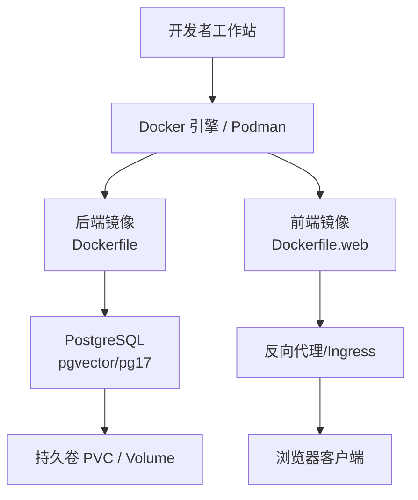
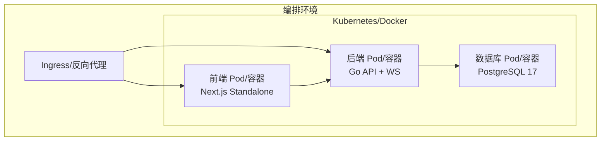
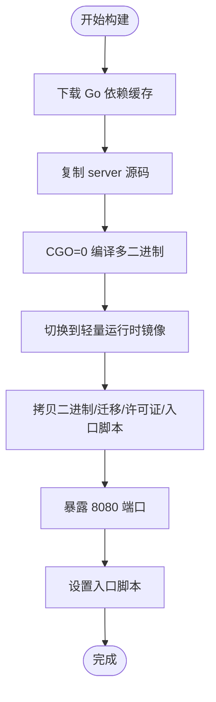
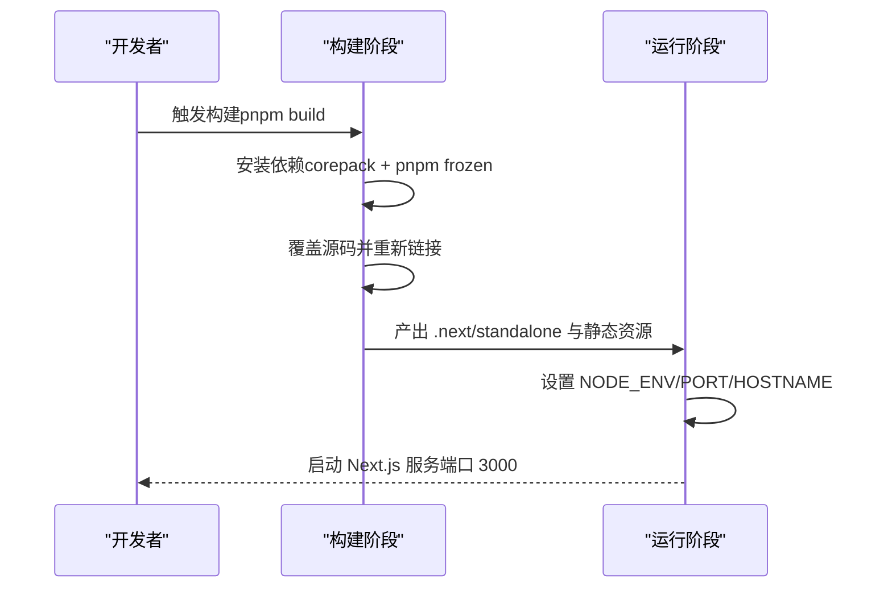
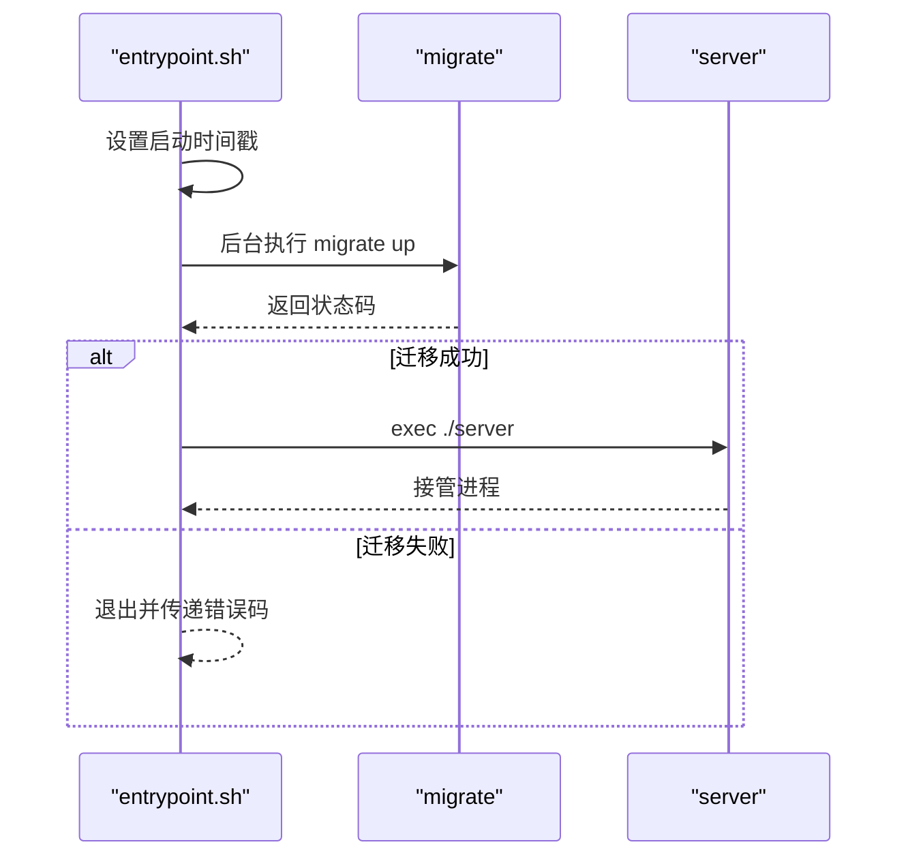
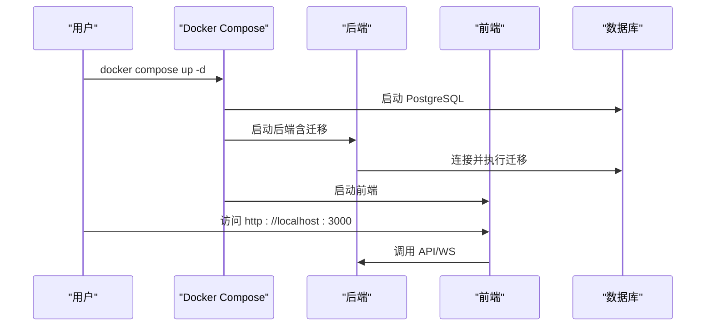
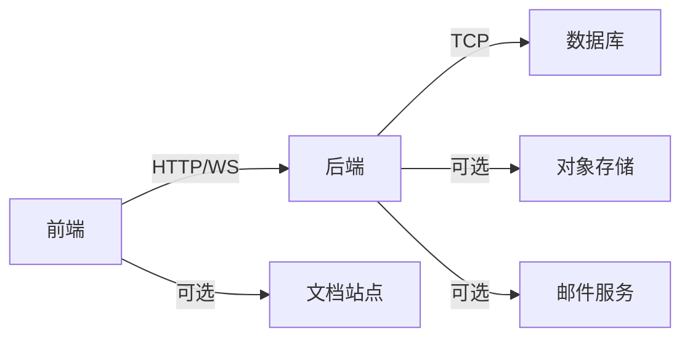

# 容器化部署

<cite>
**本文引用的文件**
- [Dockerfile](file://Dockerfile)
- [Dockerfile.web](file://Dockerfile.web)
- [docker/entrypoint.sh](file://docker/entrypoint.sh)
- [docker-compose.yml](file://docker-compose.yml)
- [docker-compose.selfhost.yml](file://docker-compose.selfhost.yml)
- [docker-compose.selfhost.build.yml](file://docker-compose.selfhost.build.yml)
- [Makefile](file://Makefile)
- [SELF_HOSTING.md](file://SELF_HOSTING.md)
- [deploy/helm/multica/values.yaml](file://deploy/helm/multica/values.yaml)
- [deploy/helm/multica/templates/backend.yaml](file://deploy/helm/multica/templates/backend.yaml)
- [deploy/helm/multica/templates/frontend.yaml](file://deploy/helm/multica/templates/frontend.yaml)
</cite>

## 目录
1. [简介](#简介)
2. [项目结构](#项目结构)
3. [核心组件](#核心组件)
4. [架构总览](#架构总览)
5. [详细组件分析](#详细组件分析)
6. [依赖关系分析](#依赖关系分析)
7. [性能与镜像优化](#性能与镜像优化)
8. [故障排查指南](#故障排查指南)
9. [结论](#结论)
10. [附录：环境变量与编排清单](#附录：环境变量与编排清单)

## 简介
本指南面向生产与自托管场景，系统讲解 Multica 的容器化构建与部署。内容涵盖：
- Go 后端的多阶段 Dockerfile 构建、编译优化与镜像最小化策略
- Web 前端（Next.js）独立构建流程与运行时最小化
- entrypoint.sh 启动脚本的职责、信号处理与迁移执行顺序
- 使用 Docker Compose 与 Helm/Kubernetes 进行编排
- 环境变量配置、数据持久化、网络与安全最佳实践
- 监控与日志收集建议方案

## 项目结构
与容器化相关的核心文件分布如下：
- 后端镜像构建：根目录 Dockerfile
- 前端镜像构建：根目录 Dockerfile.web
- 后端启动入口：docker/entrypoint.sh
- 本地与自托管编排：docker-compose*.yml
- Kubernetes 编排：deploy/helm/multica/*
- 便捷命令与默认变量：Makefile
- 自托管文档与说明：SELF_HOSTING.md

图表来源
- [Dockerfile:1-45](file://Dockerfile#L1-L45)
- [Dockerfile.web:1-79](file://Dockerfile.web#L1-L79)
- [docker-compose.selfhost.yml:35-219](file://docker-compose.selfhost.yml#L35-L219)
- [deploy/helm/multica/values.yaml:1-208](file://deploy/helm/multica/values.yaml#L1-L208)

章节来源
- [Dockerfile:1-45](file://Dockerfile#L1-L45)
- [Dockerfile.web:1-79](file://Dockerfile.web#L1-L79)
- [docker-compose.selfhost.yml:1-219](file://docker-compose.selfhost.yml#L1-L219)
- [Makefile:82-138](file://Makefile#L82-L138)
- [SELF_HOSTING.md:1-526](file://SELF_HOSTING.md#L1-L526)

## 核心组件
- 后端服务（Go）：单二进制 REST + WebSocket 服务，内置数据库迁移工具与 CLI 工具，通过 entrypoint 先执行迁移再启动 API。
- 前端应用（Next.js）：采用 Standalone 输出，仅打包运行所需依赖，减少镜像体积并提升冷启动速度。
- 数据库（PostgreSQL 17）：使用 pgvector 扩展，提供向量检索能力；数据通过命名卷或 PVC 持久化。
- 编排层：
  - Docker Compose：适合单机/开发/自托管快速部署
  - Helm Chart：适合 Kubernetes 集群部署，包含 Ingress、PVC、健康检查等

章节来源
- [Dockerfile:1-45](file://Dockerfile#L1-L45)
- [Dockerfile.web:1-79](file://Dockerfile.web#L1-L79)
- [docker-compose.selfhost.yml:35-219](file://docker-compose.selfhost.yml#L35-L219)
- [deploy/helm/multica/values.yaml:1-208](file://deploy/helm/multica/values.yaml#L1-L208)

## 架构总览
后端与前端分离部署，数据库独立容器化或通过外部实例接入。入口点由反向代理或 Ingress 暴露，后端负责业务逻辑与实时通信，前端为静态资源与 Next.js 运行时。

图表来源
- [docker-compose.selfhost.yml:55-219](file://docker-compose.selfhost.yml#L55-L219)
- [deploy/helm/multica/templates/backend.yaml:21-163](file://deploy/helm/multica/templates/backend.yaml#L21-L163)
- [deploy/helm/multica/templates/frontend.yaml:1-77](file://deploy/helm/multica/templates/frontend.yaml#L1-L77)

## 详细组件分析

### 后端多阶段构建与镜像最小化
- 构建阶段（builder）：基于 golang:1.26-alpine，安装 git，缓存 go.mod/go.sum，复制源码，CGO_ENABLED=0 编译多个二进制（server、multica CLI、migrate、backfill 工具），并通过 ldflags 注入版本信息。
- 运行阶段（runtime）：基于 alpine:3.21，仅安装 ca-certificates 与 tzdata，拷贝已编译的二进制、迁移文件、许可证与入口脚本，设置 EXPOSE 端口与 ENTRYPOINT。

图表来源
- [Dockerfile:1-45](file://Dockerfile#L1-L45)

章节来源
- [Dockerfile:1-45](file://Dockerfile#L1-L45)

### Web 应用独立构建流程
- 依赖阶段：基于 node:22-alpine，启用 corepack 并使用 pnpm 冻结安装，预解析 workspace 依赖。
- 构建阶段：再次激活相同 pnpm 版本，覆盖源码后重新链接依赖，设置 NEXT_PUBLIC_APP_VERSION 与 STANDALONE=true，执行 Next.js 构建生成 standalone 输出。
- 运行阶段：基于 node:22-alpine，创建非 root 用户 nextjs，拷贝 standalone 输出、静态资源与 public 资源，设置环境变量与端口，以 node apps/web/server.js 启动。

图表来源
- [Dockerfile.web:1-79](file://Dockerfile.web#L1-L79)

章节来源
- [Dockerfile.web:1-79](file://Dockerfile.web#L1-L79)

### 入口脚本 entrypoint.sh 的功能与配置
- 职责：
  - 设置容器级启动时间戳，供迁移与服务共享预算
  - 后台执行数据库迁移（./migrate up），捕获退出码并在失败时终止容器
  - 前台启动 API 服务（exec ./server），接管 PID 1 以便正确处理信号
- 信号处理：
  - 监听 TERM/INT，确保迁移进程被正确终止并等待结束
- 配置要点：
  - 通过环境变量控制数据库连接、超时、重试等（详见附录）
  - 迁移失败即停止，避免服务在不一致状态下运行

图表来源
- [docker/entrypoint.sh:1-42](file://docker/entrypoint.sh#L1-L42)

章节来源
- [docker/entrypoint.sh:1-42](file://docker/entrypoint.sh#L1-L42)

### 构建、运行与编排
- 本地开发：
  - 使用 Makefile 提供的 selfhost/selfhost-build 目标自动创建 .env、生成密钥并拉起服务
  - 支持从当前代码库构建后端与前端镜像（dev 标签）
- Docker Compose：
  - docker-compose.selfhost.yml 定义 postgres、backend、frontend 三个服务
  - 绑定到 127.0.0.1，推荐通过反向代理对外暴露
  - 挂载 pgdata 与 backend_uploads 实现数据持久化
- Kubernetes：
  - Helm Chart 提供 Deployment、Service、Ingress、PVC、ConfigMap/Secret 引用
  - 通过 startupProbe/readinessProbe/livenessProbe 管理健康状态
  - 支持外部数据库与 uploads 存储开关

图表来源
- [docker-compose.selfhost.yml:35-219](file://docker-compose.selfhost.yml#L35-L219)
- [Makefile:82-138](file://Makefile#L82-L138)

章节来源
- [docker-compose.selfhost.yml:1-219](file://docker-compose.selfhost.yml#L1-L219)
- [docker-compose.selfhost.build.yml:1-22](file://docker-compose.selfhost.build.yml#L1-L22)
- [Makefile:82-138](file://Makefile#L82-L138)

### 环境变量配置、数据持久化与网络最佳实践
- 环境变量：
  - 数据库：DATABASE_URL、DATABASE_REPLICA_URL 及连接池参数
  - 安全：JWT_SECRET（必填）、CORS_ALLOWED_ORIGINS、COOKIE_DOMAIN
  - 邮件：RESEND_API_KEY、SMTP_* 系列
  - 存储：S3_BUCKET、AWS_*、ATTACHMENT_DOWNLOAD_MODE/TTL、CLOUDFRONT_*
  - 集成：GOOGLE_*、GITHUB_*、MULTICA_LARK_*、MULTICA_SLACK_*、MULTICA_WECOM_*
  - 其他：APP_ENV、MULTICA_DEV_VERIFICATION_CODE、MULTICA_PUBLIC_URL、插件相关 URL 与密钥
- 数据持久化：
  - PostgreSQL 数据卷 pgdata
  - 后端上传目录 backend_uploads（可切换至 S3）
- 网络安全：
  - 默认绑定 127.0.0.1，禁止直接暴露 0.0.0.0
  - 推荐使用反向代理（Caddy/nginx/Cloudflare Tunnel）终止 TLS 并转发到 8080/3000
  - Kubernetes 通过 Ingress 暴露，配合 Secret 管理敏感信息

章节来源
- [docker-compose.selfhost.yml:55-219](file://docker-compose.selfhost.yml#L55-L219)
- [deploy/helm/multica/values.yaml:21-46](file://deploy/helm/multica/values.yaml#L21-L46)
- [SELF_HOSTING.md:1-526](file://SELF_HOSTING.md#L1-L526)

### 监控与日志收集方案
- 指标暴露：
  - 后端支持 METRICS_ADDR 暴露指标端点，便于 Prometheus 抓取
- 健康检查：
  - /healthz 用于 readiness/startup 探测
  - /health 用于 liveness 探测（不依赖数据库）
- 日志采集：
  - 容器标准输出（stdout/stderr）集中采集（如 Loki/ELK）
  - 结合结构化日志与请求追踪头，便于问题定位
- 告警建议：
  - 对 /healthz 失败、迁移失败、数据库连接失败、指标缺失等设置告警

章节来源
- [docker-compose.selfhost.yml:55-219](file://docker-compose.selfhost.yml#L55-L219)
- [deploy/helm/multica/templates/backend.yaml:81-106](file://deploy/helm/multica/templates/backend.yaml#L81-L106)

## 依赖关系分析
- 后端依赖：
  - 数据库：PostgreSQL（主/只读副本）
  - 可选：对象存储（S3/CloudFront）、邮件服务（Resend/SMTP）、OAuth（Google）、第三方集成（GitHub/Lark/Slack/WeCom）
- 前端依赖：
  - 后端 API/WS 地址（REMOTE_API_URL/NEXT_PUBLIC_*）
  - 可选：文档站点（DOCS_URL）
- 编排依赖：
  - Compose：服务间 depends_on、健康检查、卷挂载
  - Helm：Deployment/Service/Ingress/PVC/ConfigMap/Secret

图表来源
- [docker-compose.selfhost.yml:55-219](file://docker-compose.selfhost.yml#L55-L219)
- [deploy/helm/multica/values.yaml:112-158](file://deploy/helm/multica/values.yaml#L112-L158)

章节来源
- [docker-compose.selfhost.yml:55-219](file://docker-compose.selfhost.yml#L55-L219)
- [deploy/helm/multica/values.yaml:112-158](file://deploy/helm/multica/values.yaml#L112-L158)

## 性能与镜像优化
- 后端镜像优化：
  - CGO_ENABLED=0 编译，减小体积并提高可移植性
  - 使用 -ldflags "-s -w" 去除调试符号
  - 多阶段构建，仅拷贝必要二进制与资源
- 前端镜像优化：
  - Next.js Standalone 输出，仅包含运行期依赖
  - 非 root 用户运行，提升安全性
- 启动优化：
  - 迁移在入口脚本中串行执行，避免并发竞争
  - 使用 startupProbe 容忍冷启动耗时
- 资源限制：
  - 通过 Helm values 设置 requests/limits，避免资源争用

章节来源
- [Dockerfile:1-45](file://Dockerfile#L1-L45)
- [Dockerfile.web:1-79](file://Dockerfile.web#L1-L79)
- [deploy/helm/multica/values.yaml:149-192](file://deploy/helm/multica/values.yaml#L149-L192)

## 故障排查指南
- 迁移失败：
  - 检查 DATABASE_URL 与网络连通性
  - 查看后端容器日志中的迁移输出与错误码
- 数据库不可用：
  - 确认 PostgreSQL 健康检查通过
  - 调整 MULTICA_DATABASE_STARTUP_TIMEOUT 与 CONNECT_TIMEOUT
- 前端无法访问后端：
  - 校验 REMOTE_API_URL 与 CORS 配置
  - 检查 Ingress/反向代理路由与 TLS 配置
- 上传失败：
  - 若未配置 S3，确认 backend_uploads 卷可用且权限正确
  - 若配置 S3，检查 AWS 凭据与桶策略
- 指标与日志：
  - 确认 METRICS_ADDR 暴露与抓取配置
  - 检查日志采集管道是否正常工作

章节来源
- [docker/entrypoint.sh:1-42](file://docker/entrypoint.sh#L1-L42)
- [docker-compose.selfhost.yml:55-219](file://docker-compose.selfhost.yml#L55-L219)
- [deploy/helm/multica/templates/backend.yaml:81-106](file://deploy/helm/multica/templates/backend.yaml#L81-L106)

## 结论
Multica 的容器化方案通过多阶段构建与 Standalone 输出实现了高效、安全的镜像最小化；entrypoint 将迁移与服务启动解耦并确保一致性；Docker Compose 与 Helm 提供了从本地到生产的一体化编排能力。遵循本文的环境变量、持久化与网络最佳实践，并结合监控与日志方案，可在多种环境中稳定部署与运维。

## 附录：环境变量与编排清单
- 关键环境变量（后端）：
  - DATABASE_URL、DATABASE_REPLICA_URL、DATABASE_REPLICA_MIN/MAX_CONNS
  - JWT_SECRET（必填）、CORS_ALLOWED_ORIGINS、COOKIE_DOMAIN
  - RESEND_API_KEY、SMTP_*、GOOGLE_*、S3_*、CLOUDFRONT_*
  - MULTICA_PUBLIC_URL、插件相关 URL 与密钥
  - LLM 相关：MULTICA_LLM_*
  - 集成：MULTICA_LARK_*、MULTICA_SLACK_*、MULTICA_WECOM_*
  - VCS 集成：MULTICA_VCS_INTEGRATION_ENABLED、MULTICA_VCS_SECRET_KEY
- 关键环境变量（前端）：
  - REMOTE_API_URL、DOCS_URL、NEXT_PUBLIC_API_URL、NEXT_PUBLIC_WS_URL
- 编排要点：
  - Compose：绑定 127.0.0.1，使用命名卷持久化数据
  - Helm：通过 ConfigMap/Secret 注入配置，PVC 持久化上传目录，Ingress 暴露服务

章节来源
- [docker-compose.selfhost.yml:55-219](file://docker-compose.selfhost.yml#L55-L219)
- [deploy/helm/multica/values.yaml:112-192](file://deploy/helm/multica/values.yaml#L112-L192)