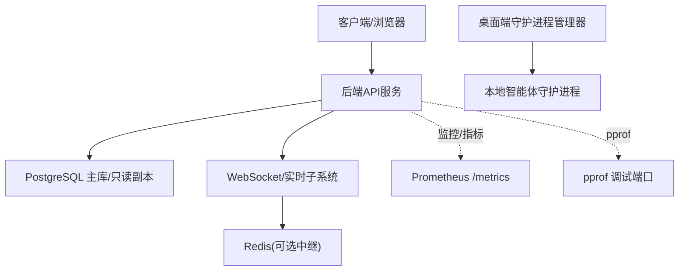
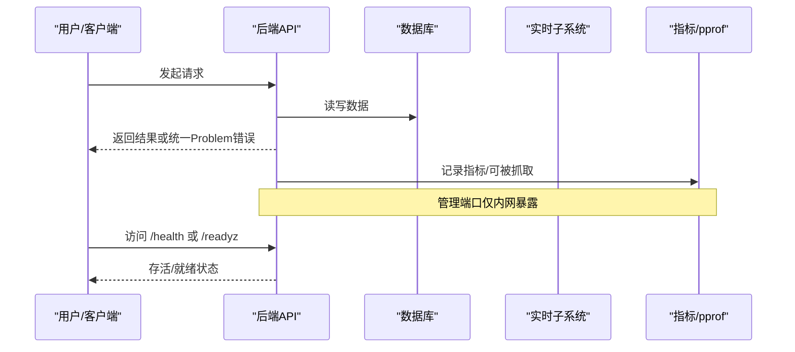
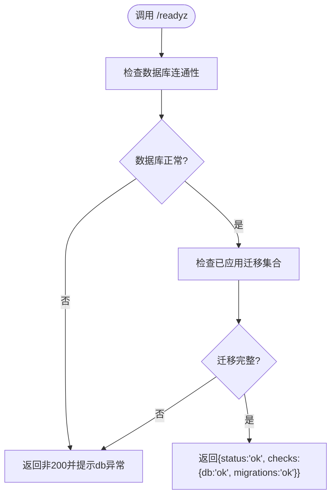
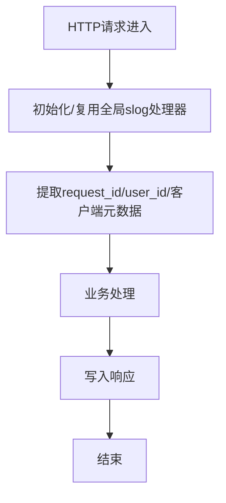
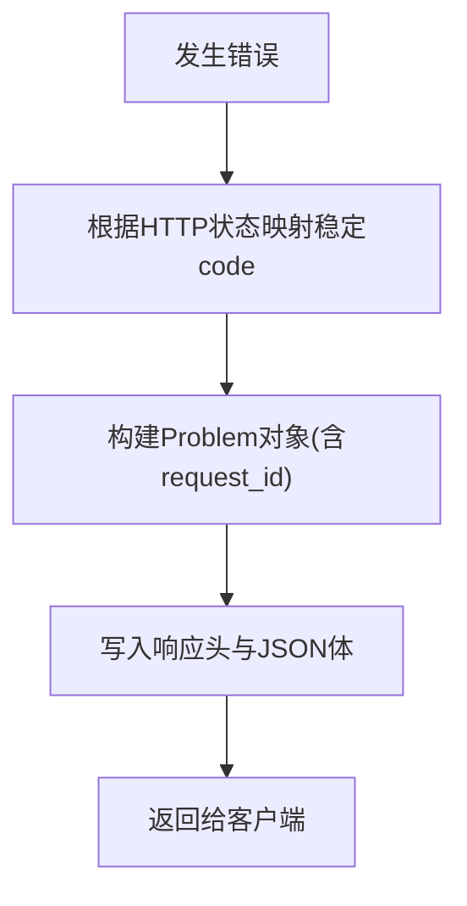
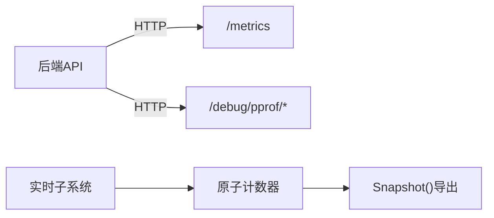
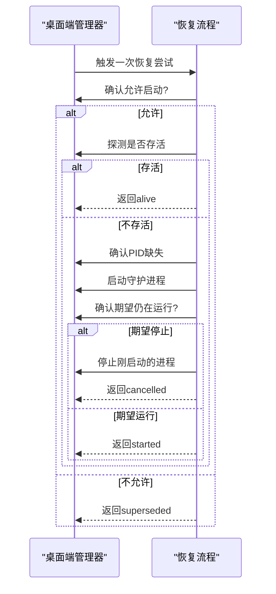
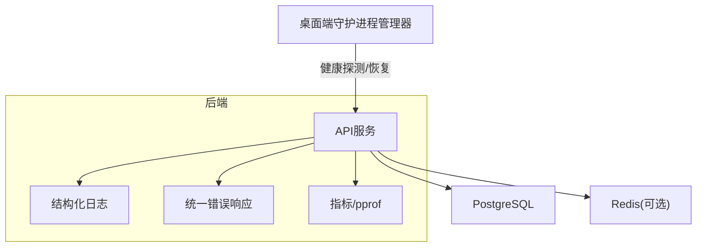

# 故障排除

<cite>
**本文引用的文件**
- [SELF_HOSTING_ADVANCED.md](file://SELF_HOSTING_ADVANCED.md)
- [router.go](file://server/cmd/server/router.go)
- [logger.go](file://server/internal/logger/logger.go)
- [metrics.go（daemonws）](file://server/internal/daemonws/metrics.go)
- [metrics.go（realtime）](file://server/internal/realtime/metrics.go)
- [problem.go](file://server/pkg/publicapi/v1/problem.go)
- [classify.go](file://server/pkg/taskfailure/classify.go)
- [retry_test.go](file://server/pkg/llm/retry_test.go)
- [environment-variables.mdx](file://apps/docs/content/docs/environment-variables.mdx)
- [self-host-quickstart.mdx](file://apps/docs/content/docs/self-host-quickstart.mdx)
- [daemon-manager.ts](file://apps/desktop/src/main/daemon-manager.ts)
- [daemon-recovery.ts](file://apps/desktop/src/main/daemon-recovery.ts)
</cite>

## 目录
1. [简介](#简介)
2. [项目结构](#项目结构)
3. [核心组件](#核心组件)
4. [架构总览](#架构总览)
5. [详细组件分析](#详细组件分析)
6. [依赖关系分析](#依赖关系分析)
7. [性能注意事项](#性能注意事项)
8. [故障排查指南](#故障排查指南)
9. [结论](#结论)
10. [附录](#附录)

## 简介
本指南面向部署与运维人员，聚焦 Multica 后端服务在常见场景下的故障定位与恢复：服务启动失败、数据库连接问题、内存泄漏、性能瓶颈、实时通道异常、智能体任务执行失败等。文档结合健康检查、结构化日志、Prometheus 指标、Go pprof 调试工具以及桌面端守护进程恢复机制，提供可操作的诊断步骤与调优建议。

## 项目结构
- 后端为 Go 服务，暴露 HTTP API、管理端口与 Prometheus 指标；通过 Chi 路由、结构化日志与统一错误响应格式对外暴露可观测性。
- 前端包含 Web、Desktop、Mobile 与文档站点；桌面端负责本地智能体守护进程的探测与恢复。
- 数据库使用 PostgreSQL，支持主从复制与连接池参数调优；迁移与就绪探针保障升级安全。
- 实时子系统基于 WebSocket 与可选 Redis 中继，提供事件广播与房间订阅能力。

图表来源
- [SELF_HOSTING_ADVANCED.md:607-643](file://SELF_HOSTING_ADVANCED.md#L607-L643)
- [environment-variables.mdx:49-53](file://apps/docs/content/docs/environment-variables.mdx#L49-L53)

章节来源
- [SELF_HOSTING_ADVANCED.md:607-643](file://SELF_HOSTING_ADVANCED.md#L607-L643)
- [environment-variables.mdx:49-53](file://apps/docs/content/docs/environment-variables.mdx#L49-L53)

## 核心组件
- 健康检查与就绪探针：/health 用于存活检测，/readyz（/healthz 别名）用于依赖就绪检测（数据库、迁移）。
- 结构化日志：基于 slog + tint，自动识别终端输出颜色，支持按请求维度注入 request_id、user_id、客户端元数据。
- 统一错误响应：RFC 9457 风格 Problem 对象，附带稳定 code 与 request_id，便于跨层追踪。
- 指标与调试：独立管理端口暴露 Prometheus /metrics 与标准 pprof 路由；实时子系统维护连接、消息、Redis 中继等计数器。
- 桌面端守护进程恢复：探测本地运行时状态，必要时重启或回退，避免僵尸进程与竞态。

章节来源
- [self-host-quickstart.mdx:355-365](file://apps/docs/content/docs/self-host-quickstart.mdx#L355-L365)
- [logger.go:1-118](file://server/internal/logger/logger.go#L1-L118)
- [problem.go:36-111](file://server/pkg/publicapi/v1/problem.go#L36-L111)
- [SELF_HOSTING_ADVANCED.md:607-643](file://SELF_HOSTING_ADVANCED.md#L607-L643)
- [metrics.go（daemonws）:1-61](file://server/internal/daemonws/metrics.go#L1-L61)
- [metrics.go（realtime）:1-280](file://server/internal/realtime/metrics.go#L1-L280)
- [daemon-recovery.ts:119-200](file://apps/desktop/src/main/daemon-recovery.ts#L119-L200)
- [daemon-manager.ts:842-869](file://apps/desktop/src/main/daemon-manager.ts#L842-L869)

## 架构总览
后端通过健康检查与就绪探针确保升级与依赖可用；日志与错误响应贯穿请求链路；指标与 pprof 提供运行时洞察；桌面端守护进程保障智能体运行环境可用性。

图表来源
- [SELF_HOSTING_ADVANCED.md:607-643](file://SELF_HOSTING_ADVANCED.md#L607-L643)
- [problem.go:36-111](file://server/pkg/publicapi/v1/problem.go#L36-L111)
- [self-host-quickstart.mdx:355-365](file://apps/docs/content/docs/self-host-quickstart.mdx#L355-L365)

## 详细组件分析

### 健康检查与就绪探针
- /health：进程存活探针，只要进程未崩溃即返回正常。
- /readyz（/healthz 别名）：依赖就绪探针，校验数据库连通性与迁移是否全部应用完成，适合发布前验证与外部监控。

图表来源
- [self-host-quickstart.mdx:355-365](file://apps/docs/content/docs/self-host-quickstart.mdx#L355-L365)
- [router.go:680](file://server/cmd/server/router.go#L680)

章节来源
- [self-host-quickstart.mdx:355-365](file://apps/docs/content/docs/self-host-quickstart.mdx#L355-L365)
- [router.go:680](file://server/cmd/server/router.go#L680)

### 结构化日志与请求追踪
- 日志级别由 LOG_LEVEL 控制，默认 debug；终端输出带颜色，重定向到文件时自动关闭颜色。
- 每个请求携带 request_id，可通过中间件注入或从请求头获取；同时附加 user_id、客户端平台/版本/操作系统等元数据，便于跨系统关联。

图表来源
- [logger.go:1-118](file://server/internal/logger/logger.go#L1-L118)
- [problem.go:65-111](file://server/pkg/publicapi/v1/problem.go#L65-L111)

章节来源
- [logger.go:1-118](file://server/internal/logger/logger.go#L1-L118)
- [problem.go:65-111](file://server/pkg/publicapi/v1/problem.go#L65-L111)

### 统一错误响应与问题分类
- 所有错误以 RFC 9457 风格 Problem 返回，包含稳定 code、title、status、detail 与 request_id，便于客户端与上游网关解析。
- 智能体任务失败原因会进行归类（例如上游 5xx），辅助快速定位第三方服务问题。

图表来源
- [problem.go:36-111](file://server/pkg/publicapi/v1/problem.go#L36-L111)
- [classify.go:150-161](file://server/pkg/taskfailure/classify.go#L150-L161)

章节来源
- [problem.go:36-111](file://server/pkg/publicapi/v1/problem.go#L36-L111)
- [classify.go:150-161](file://server/pkg/taskfailure/classify.go#L150-L161)

### 指标与运行时调试
- 管理端口暴露 Prometheus /metrics 与标准 pprof 路由（CPU、heap、goroutine、block、mutex、trace 等），默认仅监听本地回环地址，生产环境需限制网络暴露面。
- 实时子系统维护连接数、消息收发、订阅/取消订阅、Redis 中继状态等指标，便于观察吞吐、丢包与延迟。

图表来源
- [SELF_HOSTING_ADVANCED.md:607-643](file://SELF_HOSTING_ADVANCED.md#L607-L643)
- [metrics.go（realtime）:1-280](file://server/internal/realtime/metrics.go#L1-L280)

章节来源
- [SELF_HOSTING_ADVANCED.md:607-643](file://SELF_HOSTING_ADVANCED.md#L607-L643)
- [metrics.go（realtime）:1-280](file://server/internal/realtime/metrics.go#L1-L280)

### 桌面端守护进程恢复
- 定期探测本地运行时健康，若发现进程不存在或不可用，则尝试启动；启动后再次确认期望状态，必要时回滚停止。
- 对 PID 缺失与重复启动进行防抖与预算控制，避免频繁拉起导致资源抖动。

图表来源
- [daemon-recovery.ts:119-200](file://apps/desktop/src/main/daemon-recovery.ts#L119-L200)
- [daemon-manager.ts:842-869](file://apps/desktop/src/main/daemon-manager.ts#L842-L869)

章节来源
- [daemon-recovery.ts:119-200](file://apps/desktop/src/main/daemon-recovery.ts#L119-L200)
- [daemon-manager.ts:842-869](file://apps/desktop/src/main/daemon-manager.ts#L842-L869)

## 依赖关系分析
- 后端依赖 PostgreSQL（主库/只读副本）与可选 Redis（实时中继）；连接池大小与副本策略影响吞吐与一致性。
- 日志与错误响应贯穿所有请求路径，确保可观测性一致。
- 指标与 pprof 作为横切关注点，服务于监控与排障。
- 桌面端与后端解耦，通过健康检查与本地守护进程生命周期管理协同工作。

图表来源
- [environment-variables.mdx:49-53](file://apps/docs/content/docs/environment-variables.mdx#L49-L53)
- [SELF_HOSTING_ADVANCED.md:607-643](file://SELF_HOSTING_ADVANCED.md#L607-L643)
- [logger.go:1-118](file://server/internal/logger/logger.go#L1-L118)
- [problem.go:36-111](file://server/pkg/publicapi/v1/problem.go#L36-L111)

章节来源
- [environment-variables.mdx:49-53](file://apps/docs/content/docs/environment-variables.mdx#L49-L53)
- [SELF_HOSTING_ADVANCED.md:607-643](file://SELF_HOSTING_ADVANCED.md#L607-L643)

## 性能注意事项
- 数据库连接池：合理设置每 Pod 最大/最小连接数，考虑多 Pod 总和不超过 Postgres max_connections；有连接池器时可适当提高。
- 只读副本：副本连接独立预算，默认周期性回收以校验只读状态；连接失败透明回退主库并短暂熔断；一致性敏感读取应走主库。
- 重试与超时：LLM 上游重试预算可配置，负值拒绝；0 表示禁用重试；正值为上限；注意上游失败时的预算消耗语义。
- 指标与采样：仅在启用管理端口时采集 HTTP 指标；生产环境将管理端口绑定至内网并加白名单或代理认证。
- pprof 调试：按需抓取 CPU/堆/线程/阻塞/互斥/跟踪等视图，定位热点与泄漏。

章节来源
- [SELF_HOSTING_ADVANCED.md:17-27](file://SELF_HOSTING_ADVANCED.md#L17-L27)
- [SELF_HOSTING_ADVANCED.md:607-643](file://SELF_HOSTING_ADVANCED.md#L607-L643)
- [environment-variables.mdx:49-53](file://apps/docs/content/docs/environment-variables.mdx#L49-L53)
- [retry_test.go:28-101](file://server/pkg/llm/retry_test.go#L28-L101)

## 故障排查指南

### 服务启动失败
- 优先使用 /readyz 而非 /health 验证依赖就绪；若 db 或 migrations 任一为异常，说明新版本未完成迁移或数据库不可达。
- 检查后端日志中是否有迁移失败、数据库连接错误或配置加载异常；利用 request_id 关联同一请求的全链路日志。
- 若为容器化部署，确认镜像标签与拉取策略，避免缓存旧镜像导致“看似升级成功”的陷阱。

章节来源
- [self-host-quickstart.mdx:355-365](file://apps/docs/content/docs/self-host-quickstart.mdx#L355-L365)
- [logger.go:1-118](file://server/internal/logger/logger.go#L1-L118)

### 数据库连接问题
- 核对 DATABASE_MAX_CONNS/DATABASE_MIN_CONNS 与集群 max_connections 的关系；多 Pod 部署需预留足够连接额度。
- 若启用只读副本，关注副本连接回收周期与失败回退行为；一致性敏感读取保持主库。
- 通过 /readyz 快速判断是否为数据库或迁移导致的不可用；结合日志中的连接错误信息定位具体原因。

章节来源
- [SELF_HOSTING_ADVANCED.md:17-27](file://SELF_HOSTING_ADVANCED.md#L17-L27)
- [environment-variables.mdx:49-53](file://apps/docs/content/docs/environment-variables.mdx#L49-L53)
- [self-host-quickstart.mdx:355-365](file://apps/docs/content/docs/self-host-quickstart.mdx#L355-L365)

### 内存泄漏与高内存占用
- 使用 pprof heap 快照对比不同时间点分配情况，定位持续增长的对象与调用栈。
- 结合 goroutine 与 block 视图排查协程泄漏或阻塞；使用 trace 捕获短时尖峰。
- 关注实时子系统与 WebSocket 连接的活跃数与丢弃计数，异常增长可能指向连接未释放或消息堆积。

章节来源
- [SELF_HOSTING_ADVANCED.md:607-643](file://SELF_HOSTING_ADVANCED.md#L607-L643)
- [metrics.go（realtime）:1-280](file://server/internal/realtime/metrics.go#L1-L280)

### 性能瓶颈与慢请求
- 通过 /metrics 观察 HTTP 请求量、错误率与依赖状态；结合 pprof profile 抓取 CPU 热点。
- 针对数据库慢查询，检查连接池与索引；对于 LLM 上游，调整重试预算与超时，避免雪崩。
- 实时子系统关注消息发送/丢弃比、入站过大关闭次数与 Redis 中继延迟；必要时扩容或优化流式保留策略。

章节来源
- [SELF_HOSTING_ADVANCED.md:607-643](file://SELF_HOSTING_ADVANCED.md#L607-L643)
- [retry_test.go:28-101](file://server/pkg/llm/retry_test.go#L28-L101)
- [metrics.go（realtime）:1-280](file://server/internal/realtime/metrics.go#L1-L280)

### 实时通道异常
- 检查 WebSocket 连接建立/断开计数与活跃连接数；若 ActiveConnections 持续升高且 DisconnectsTotal 不增，可能存在连接未正确关闭。
- 关注 InboundTooLargeTotal 与 MessagesDroppedTotal，前者指示入站消息超限，后者指示背压或下游拥塞。
- 若启用 Redis 中继，查看 XAdd/XRead 错误、最后错误信息与流条目/内存/TTL 观测，定位中继侧问题。

章节来源
- [metrics.go（realtime）:1-280](file://server/internal/realtime/metrics.go#L1-L280)

### 智能体任务执行失败
- 查看任务失败分类，若命中上游 5xx 模式（如 service unavailable、bad gateway），优先排查第三方服务健康与限流。
- 结合 request_id 与日志上下文，确认任务上下文装配、权限与凭据是否正确。
- 桌面端守护进程若频繁重启，检查恢复流程的启动预算与竞态保护，避免反复拉起造成资源抖动。

章节来源
- [classify.go:150-161](file://server/pkg/taskfailure/classify.go#L150-L161)
- [daemon-recovery.ts:119-200](file://apps/desktop/src/main/daemon-recovery.ts#L119-L200)

### 如何使用调试工具与日志分析
- 日志：设置 LOG_LEVEL 提升详细度；利用 request_id 串联请求；关注 user_id 与客户端元数据以复现特定用户问题。
- 指标：启用 METRICS_ADDR 并在内网暴露 /metrics；采集关键指标（连接数、错误率、上游延迟、Redis 状态）。
- pprof：在受控窗口抓取 CPU/heap/goroutine/block/mutex/trace；对比基线与问题时段差异。
- 健康检查：发布前务必通过 /readyz；滚动更新期间配合就绪探针避免流量进入未就绪实例。

章节来源
- [logger.go:1-118](file://server/internal/logger/logger.go#L1-L118)
- [SELF_HOSTING_ADVANCED.md:607-643](file://SELF_HOSTING_ADVANCED.md#L607-L643)
- [self-host-quickstart.mdx:355-365](file://apps/docs/content/docs/self-host-quickstart.mdx#L355-L365)

### 系统资源监控与健康检查配置
- 健康检查：/health 用于存活；/readyz 用于依赖就绪（数据库、迁移）。
- 指标：/metrics 仅在内网管理端口暴露；生产环境建议使用私有抓取路径与访问控制。
- Kubernetes：滚动更新时使用就绪探针；确保 terminationGracePeriodSeconds 大于优雅停机所需时间。

章节来源
- [SELF_HOSTING_ADVANCED.md:607-643](file://SELF_HOSTING_ADVANCED.md#L607-L643)
- [self-host-quickstart.mdx:355-365](file://apps/docs/content/docs/self-host-quickstart.mdx#L355-L365)
- [environment-variables.mdx:49-53](file://apps/docs/content/docs/environment-variables.mdx#L49-L53)

### 收集故障现场信息与上报问题
- 收集项：
  - 请求级：request_id、HTTP 方法/路径、状态码、Problem detail。
  - 日志：前后至少 5 分钟的结构化日志（含 component、request_id、user_id）。
  - 指标：/metrics 快照（连接、错误、上游、Redis 状态）。
  - 运行时：pprof 快照（cpu、heap、goroutine、block、trace）。
  - 环境：环境变量摘要（脱敏）、部署版本、节点信息。
- 上报：将上述材料打包并附上复现步骤、预期与实际行为、影响范围与持续时间。

章节来源
- [problem.go:36-111](file://server/pkg/publicapi/v1/problem.go#L36-L111)
- [logger.go:1-118](file://server/internal/logger/logger.go#L1-L118)
- [SELF_HOSTING_ADVANCED.md:607-643](file://SELF_HOSTING_ADVANCED.md#L607-L643)

## 结论
通过健康检查、结构化日志、统一错误响应、指标与 pprof 的组合，Multica 提供了端到端的可观测性与排障能力。结合数据库连接池调优、重试预算与守护进程恢复策略，可在复杂部署环境下快速定位并恢复服务。建议在发布前以 /readyz 为准绳，在生产中以指标与日志为依据，辅以 pprof 深入分析，形成闭环的稳定性保障体系。

## 附录
- 常用命令参考：
  - 健康检查：curl localhost:8080/readyz
  - 指标抓取：curl http://127.0.0.1:9090/metrics
  - pprof 抓取：go tool pprof 'http://127.0.0.1:6060/debug/pprof/profile?seconds=30'

章节来源
- [self-host-quickstart.mdx:355-365](file://apps/docs/content/docs/self-host-quickstart.mdx#L355-L365)
- [SELF_HOSTING_ADVANCED.md:607-643](file://SELF_HOSTING_ADVANCED.md#L607-L643)