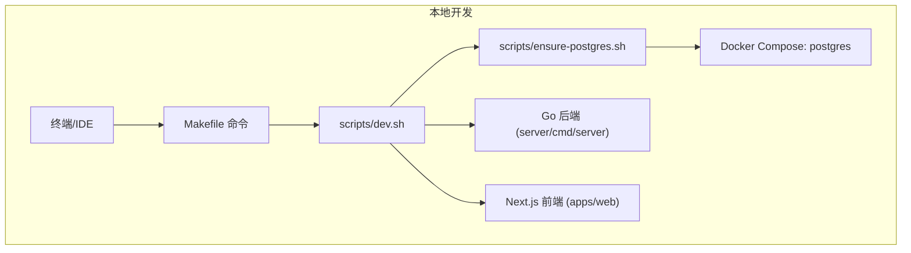
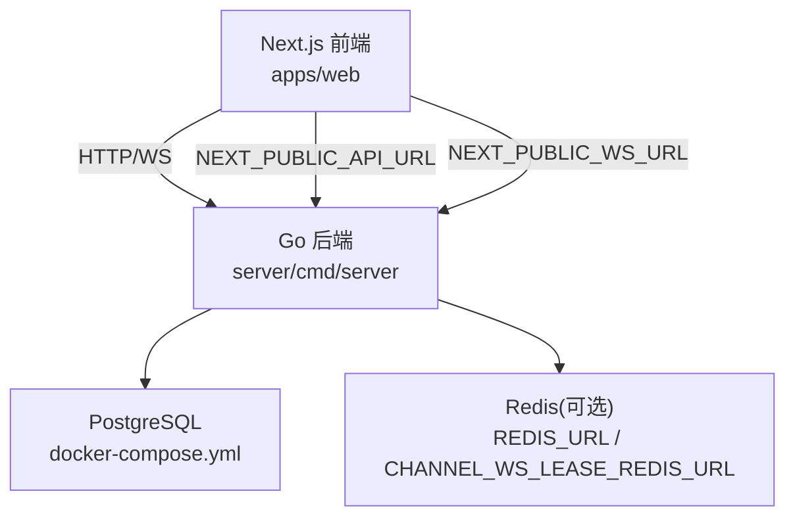
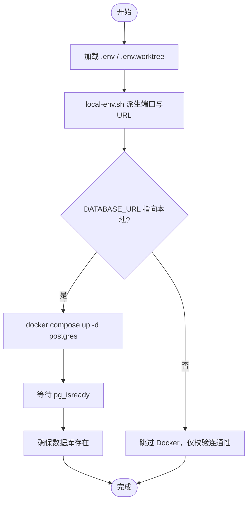
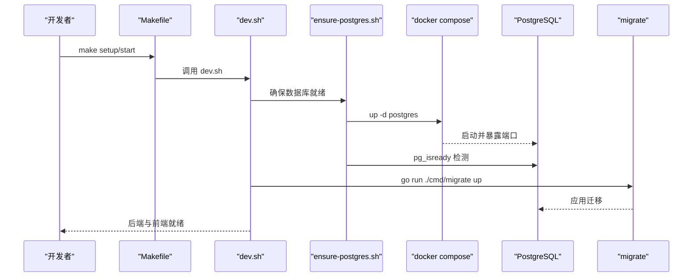
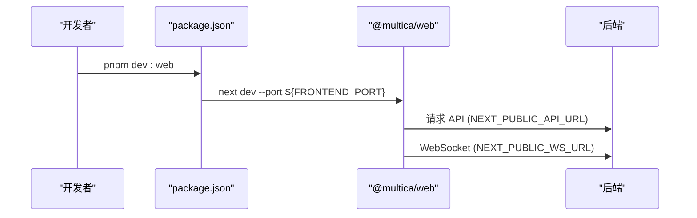
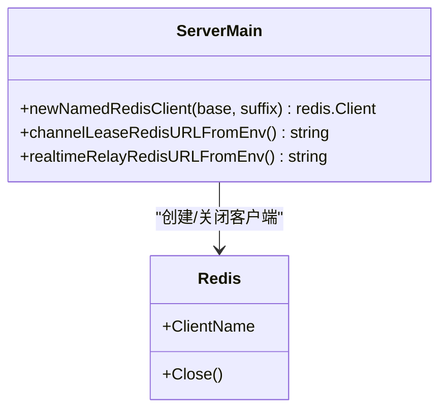
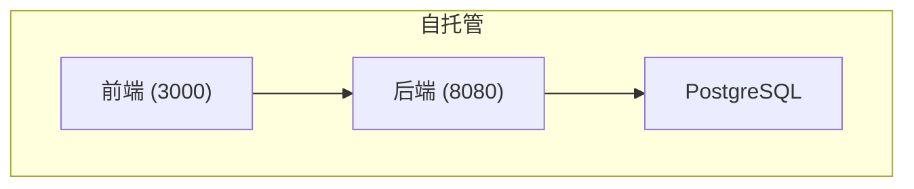
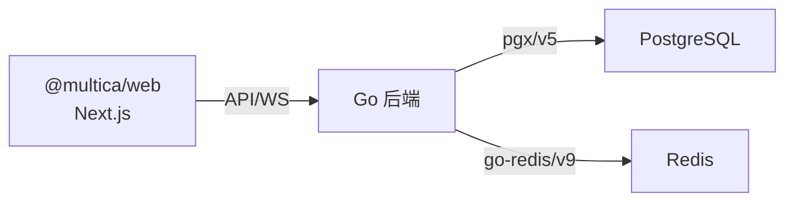

# 本地开发环境

<cite>
**本文引用的文件**
- [Makefile](file://Makefile)
- [docker-compose.yml](file://docker-compose.yml)
- [docker-compose.selfhost.yml](file://docker-compose.selfhost.yml)
- [scripts/dev.sh](file://scripts/dev.sh)
- [scripts/ensure-postgres.sh](file://scripts/ensure-postgres.sh)
- [scripts/local-env.sh](file://scripts/local-env.sh)
- [scripts/init-worktree-env.sh](file://scripts/init-worktree-env.sh)
- [package.json](file://package.json)
- [apps/web/package.json](file://apps/web/package.json)
- [server/go.mod](file://server/go.mod)
- [server/cmd/server/main.go](file://server/cmd/server/main.go)
</cite>

## 目录
1. [简介](#简介)
2. [项目结构](#项目结构)
3. [核心组件](#核心组件)
4. [架构总览](#架构总览)
5. [详细组件分析](#详细组件分析)
6. [依赖关系分析](#依赖关系分析)
7. [性能注意事项](#性能注意事项)
8. [故障排查指南](#故障排查指南)
9. [结论](#结论)
10. [附录](#附录)

## 简介
本指南面向希望在本地快速搭建 Multica 开发环境的开发者，覆盖以下目标：
- 安装与配置 Go、Node.js、PostgreSQL、Redis 等依赖
- 使用根目录 Makefile 的常用命令与脚本
- 理解 docker-compose.yml 与 selfhost 配置的各服务职责
- 环境变量配置、数据库初始化、前端开发服务器启动
- 常见问题的定位与解决
- 后端与前端调试方法

## 项目结构
Multica 采用多应用 + 共享包的单体仓库结构：
- apps/web：Next.js 前端（pnpm workspace）
- server：Go 后端（Chi 路由 + gorilla/websocket + sqlc）
- scripts：本地开发脚本（环境准备、数据库就绪检查、迁移执行等）
- docker-compose*.yml：容器编排（本地 PostgreSQL 或自托管全栈）

图表来源
- [Makefile:157-218](file://Makefile#L157-L218)
- [scripts/dev.sh:1-69](file://scripts/dev.sh#L1-L69)
- [scripts/ensure-postgres.sh:69-90](file://scripts/ensure-postgres.sh#L69-L90)
- [docker-compose.yml:1-17](file://docker-compose.yml#L1-L17)

章节来源
- [Makefile:1-376](file://Makefile#L1-L376)
- [scripts/dev.sh:1-69](file://scripts/dev.sh#L1-L69)
- [scripts/ensure-postgres.sh:1-105](file://scripts/ensure-postgres.sh#L1-L105)
- [docker-compose.yml:1-17](file://docker-compose.yml#L1-L17)

## 核心组件
- 后端服务：Go 实现，监听端口由环境变量决定，默认 8080；通过 Chi 提供 HTTP API，WebSocket 用于实时通信。
- 前端服务：Next.js 应用，默认监听 3000；通过 pnpm/Turbo 管理脚本。
- 数据库：PostgreSQL 17（pgvector），本地通过 Docker Compose 启动并持久化数据卷。
- 缓存/消息：Redis（可选，用于通道租约与实时中继），可通过环境变量切换专用连接。
- 工作区与环境：支持主分支 .env 与工作树 .env.worktree，自动分配独立数据库名与端口。

章节来源
- [server/go.mod:1-84](file://server/go.mod#L1-L84)
- [package.json:1-65](file://package.json#L1-L65)
- [apps/web/package.json:1-48](file://apps/web/package.json#L1-L48)
- [docker-compose.yml:1-17](file://docker-compose.yml#L1-L17)

## 架构总览
下图展示了本地开发时主要进程与外部依赖的关系，以及关键环境变量如何影响服务行为。

图表来源
- [docker-compose.selfhost.yml:55-214](file://docker-compose.selfhost.yml#L55-L214)
- [server/cmd/server/main.go:62-74](file://server/cmd/server/main.go#L62-L74)
- [scripts/local-env.sh:1-27](file://scripts/local-env.sh#L1-L27)

## 详细组件分析

### 前置依赖与工具链
- Node.js 22+ 与 pnpm 10.28.2：由根 package.json 的 engines 与 packageManager 字段约束。
- Go 1.26.6：由 server/go.mod 指定。
- Docker：用于启动本地 PostgreSQL 与自托管服务。

建议先确保上述工具已安装并可执行。若缺失，dev.sh 会提示并退出。

章节来源
- [package.json:32-35](file://package.json#L32-L35)
- [server/go.mod:1-3](file://server/go.mod#L1-L3)
- [scripts/dev.sh:7-18](file://scripts/dev.sh#L7-L18)

### 环境变量与本地派生
- local-env.sh 在加载 .env 后派生常用变量：PORT、FRONTEND_PORT、FRONTEND_ORIGIN、MULTICA_PUBLIC_URL、MULTICA_APP_URL、GOOGLE_REDIRECT_URI、MULTICA_SERVER_URL、LOCAL_UPLOAD_BASE_URL、PLAYWRIGHT_BASE_URL。
- init-worktree-env.sh 为 worktree 生成 .env.worktree，包含独立的数据库名与端口映射，避免冲突。
- ensure-postgres.sh 根据 DATABASE_URL 判断本地/远程：本地则通过 docker compose 启动 postgres，等待就绪并确保数据库存在。

图表来源
- [scripts/local-env.sh:1-27](file://scripts/local-env.sh#L1-L27)
- [scripts/init-worktree-env.sh:1-59](file://scripts/init-worktree-env.sh#L1-L59)
- [scripts/ensure-postgres.sh:28-105](file://scripts/ensure-postgres.sh#L28-L105)

章节来源
- [scripts/local-env.sh:1-27](file://scripts/local-env.sh#L1-L27)
- [scripts/init-worktree-env.sh:1-59](file://scripts/init-worktree-env.sh#L1-L59)
- [scripts/ensure-postgres.sh:1-105](file://scripts/ensure-postgres.sh#L1-L105)

### 数据库与迁移
- 本地数据库：通过 docker-compose.yml 启动 pgvector/pg17，端口 5432，数据持久化到 pgdata。
- 迁移工具：server/cmd/migrate，由 Makefile 与 dev.sh 调用。
- 一键重置：db-reset 会删除当前环境数据库并重新运行迁移（仅限本地）。

图表来源
- [Makefile:195-218](file://Makefile#L195-L218)
- [scripts/dev.sh:46-68](file://scripts/dev.sh#L46-L68)
- [scripts/ensure-postgres.sh:69-90](file://scripts/ensure-postgres.sh#L69-L90)
- [docker-compose.yml:1-17](file://docker-compose.yml#L1-L17)

章节来源
- [Makefile:195-266](file://Makefile#L195-L266)
- [scripts/dev.sh:46-68](file://scripts/dev.sh#L46-L68)
- [scripts/ensure-postgres.sh:69-90](file://scripts/ensure-postgres.sh#L69-L90)
- [docker-compose.yml:1-17](file://docker-compose.yml#L1-L17)

### 前端开发服务器
- 入口脚本：pnpm dev:web 通过 Turbo 启动 @multica/web。
- Next.js 开发模式：apps/web/package.json 中 dev 脚本读取 FRONTEND_PORT 作为监听端口。
- 代理与 API：通过 NEXT_PUBLIC_API_URL 与 NEXT_PUBLIC_WS_URL 指向后端地址。

图表来源
- [package.json:6-10](file://package.json#L6-L10)
- [apps/web/package.json:6-14](file://apps/web/package.json#L6-L14)
- [scripts/local-env.sh:17-21](file://scripts/local-env.sh#L17-L21)

章节来源
- [package.json:6-10](file://package.json#L6-L10)
- [apps/web/package.json:6-14](file://apps/web/package.json#L6-L14)
- [scripts/local-env.sh:17-21](file://scripts/local-env.sh#L17-L21)

### 后端服务与 Redis
- 后端入口：server/cmd/server/main.go，负责解析环境变量、构建 Redis 客户端、注册路由与中间件。
- Redis 配置：
  - CHANNEL_WS_LEASE_REDIS_URL：通道租约专用 Redis
  - REALTIME_RELAY_REDIS_URL：实时中继专用 Redis
  - 未设置时回退到 REDIS_URL
- 运行时特性：支持 sharded/dual/legacy 模式，受 REALTIME_RELAY_MODE 控制。

图表来源
- [server/cmd/server/main.go:42-83](file://server/cmd/server/main.go#L42-L83)
- [server/cmd/server/main.go:62-74](file://server/cmd/server/main.go#L62-L74)

章节来源
- [server/cmd/server/main.go:42-116](file://server/cmd/server/main.go#L42-L116)

### Docker Compose 与自托管
- 本地开发：docker-compose.yml 仅启动 PostgreSQL，供后端与迁移使用。
- 自托管：docker-compose.selfhost.yml 启动 PostgreSQL、后端、前端，并通过环境变量注入 JWT、邮件、存储、VCS 等集成配置。
- 端口绑定：所有服务默认绑定 127.0.0.1，需通过反向代理对外暴露。

图表来源
- [docker-compose.selfhost.yml:35-214](file://docker-compose.selfhost.yml#L35-L214)

章节来源
- [docker-compose.yml:1-17](file://docker-compose.yml#L1-L17)
- [docker-compose.selfhost.yml:1-219](file://docker-compose.selfhost.yml#L1-L219)

## 依赖关系分析
- 包管理器与引擎：Node 22+、pnpm 10.28.2
- 后端依赖：Chi 路由、pgx/v5、go-redis/v9、gorilla/websocket、JWT、Prometheus 指标等
- 前端依赖：Next.js、React、TanStack Query、Zustand（按项目约定分层）

图表来源
- [server/go.mod:1-84](file://server/go.mod#L1-L84)
- [apps/web/package.json:16-31](file://apps/web/package.json#L16-L31)

章节来源
- [server/go.mod:1-84](file://server/go.mod#L1-L84)
- [apps/web/package.json:16-31](file://apps/web/package.json#L16-L31)

## 性能注意事项
- 数据库索引：迁移中使用并发建索引，避免阻塞线上写入（遵循项目规则）。
- 重试预算：LLM 最大重试次数有上限，避免长尾延迟（由服务端解析与限制）。
- 实时中继：可配置分片数量、流长度、TTL 刷新间隔等参数，按需调优。
- 前端构建：使用 Turborepo 增量构建，减少冷启动时间。

章节来源
- [server/cmd/server/main.go:144-182](file://server/cmd/server/main.go#L144-L182)
- [server/cmd/server/main.go:85-116](file://server/cmd/server/main.go#L85-L116)

## 故障排查指南
- 缺少依赖
  - 现象：dev.sh 报错提示缺少 node/pnpm/go/docker
  - 处理：安装对应版本工具后再试
  - 参考路径：[scripts/dev.sh:7-18](file://scripts/dev.sh#L7-L18)

- 环境变量缺失
  - 现象：Makefile 提示缺少 .env 或 .env.worktree
  - 处理：从示例生成或使用 worktree 命令生成
  - 参考路径：[Makefile:35-41](file://Makefile#L35-L41)、[scripts/init-worktree-env.sh:1-59](file://scripts/init-worktree-env.sh#L1-L59)

- 数据库未就绪
  - 现象：迁移或后端启动失败
  - 处理：确保 ensure-postgres.sh 成功拉起 postgres 并创建数据库
  - 参考路径：[scripts/ensure-postgres.sh:69-90](file://scripts/ensure-postgres.sh#L69-L90)

- 端口冲突
  - 现象：后端或前端无法启动
  - 处理：调整 PORT/FRONTEND_PORT，或使用 worktree 自动生成不冲突端口
  - 参考路径：[scripts/local-env.sh:7-8](file://scripts/local-env.sh#L7-L8)、[scripts/init-worktree-env.sh:20-24](file://scripts/init-worktree-env.sh#L20-L24)

- Redis 连接问题
  - 现象：实时功能异常或通道租约失败
  - 处理：检查 REDIS_URL、CHANNEL_WS_LEASE_REDIS_URL、REALTIME_RELAY_REDIS_URL 是否配置正确
  - 参考路径：[server/cmd/server/main.go:62-74](file://server/cmd/server/main.go#L62-L74)

- 自托管镜像拉取失败
  - 现象：make selfhost 无法拉取官方镜像
  - 处理：使用 make selfhost-build 从当前源码构建镜像
  - 参考路径：[Makefile:104-113](file://Makefile#L104-L113)

章节来源
- [scripts/dev.sh:7-18](file://scripts/dev.sh#L7-L18)
- [Makefile:35-41](file://Makefile#L35-L41)
- [scripts/init-worktree-env.sh:1-59](file://scripts/init-worktree-env.sh#L1-L59)
- [scripts/ensure-postgres.sh:69-90](file://scripts/ensure-postgres.sh#L69-L90)
- [scripts/local-env.sh:7-8](file://scripts/local-env.sh#L7-L8)
- [server/cmd/server/main.go:62-74](file://server/cmd/server/main.go#L62-L74)
- [Makefile:104-113](file://Makefile#L104-L113)

## 结论
通过 Makefile 与配套脚本，Multica 提供了“一键式”本地开发体验：自动准备依赖、启动数据库、执行迁移、拉起前后端。结合 docker-compose 可实现自托管部署。遵循环境变量约定与项目规则，可在本地高效迭代后端与前端功能。

## 附录

### 常用 Makefile 命令速查
- 帮助与概览：make help
- 启动环境：make up（默认 api, web；可加 C=daemon,desktop）
- 停止环境：make down
- 查看状态：make status
- 完整验证：make check
- 数据库操作：
  - db-up/db-down：启动/停止共享 PostgreSQL
  - db-drop：删除当前环境数据库
  - db-reset：重建数据库并运行迁移
- 迁移：
  - migrate-up：创建数据库并应用迁移
  - migrate-down：回滚迁移
- 代码生成：sqlc
- 清理：clean

章节来源
- [Makefile:70-77](file://Makefile#L70-L77)
- [Makefile:157-176](file://Makefile#L157-L176)
- [Makefile:236-266](file://Makefile#L236-L266)
- [Makefile:353-365](file://Makefile#L353-L365)
- [Makefile:369-376](file://Makefile#L369-L376)

### 环境变量要点
- 端口与 URL
  - PORT/BACKEND_PORT/API_PORT/SERVER_PORT：后端监听端口（默认 8080）
  - FRONTEND_PORT：前端监听端口（默认 3000）
  - MULTICA_PUBLIC_URL/MULTICA_APP_URL：公开访问地址与应用地址
  - GOOGLE_REDIRECT_URI：OAuth 回调地址
  - NEXT_PUBLIC_API_URL/NEXT_PUBLIC_WS_URL：前端访问后端 API/WS 的地址
- 数据库
  - POSTGRES_DB/POSTGRES_USER/POSTGRES_PASSWORD/POSTGRES_PORT
  - DATABASE_URL：优先于单独字段解析主机与库名
- Redis（可选）
  - REDIS_URL：通用 Redis 地址
  - CHANNEL_WS_LEASE_REDIS_URL：通道租约专用
  - REALTIME_RELAY_REDIS_URL：实时中继专用
- 安全与集成
  - JWT_SECRET：必须设置强随机值
  - S3/AWS 相关：S3_BUCKET、AWS_*
  - 邮件：RESEND_* 或 SMTP_*
  - VCS：MULTICA_VCS_SECRET_KEY、GITHUB_*
  - 其他：MULTICA_LLM_*、MULTICA_WECOM_*、MULTICA_SLACK_* 等

章节来源
- [Makefile:11-28](file://Makefile#L11-L28)
- [scripts/local-env.sh:1-27](file://scripts/local-env.sh#L1-L27)
- [docker-compose.selfhost.yml:64-200](file://docker-compose.selfhost.yml#L64-L200)

### 调试建议
- 后端调试
  - 直接运行：make api-dev 或 cd server && go run ./cmd/server
  - 日志：关注标准输出与 slog 日志
  - 健康检查：/health（含版本信息，便于确认实例身份）
- 前端调试
  - 直接运行：make web-dev 或 pnpm dev:web
  - 网络：检查 NEXT_PUBLIC_API_URL/NEXT_PUBLIC_WS_URL 是否正确
  - 浏览器：打开控制台查看请求与 WebSocket 连接
- 端到端测试
  - 使用 Playwright：make check 会运行类型检查、TS 测试、Go 测试与 E2E

章节来源
- [Makefile:183-190](file://Makefile#L183-L190)
- [Makefile:232-234](file://Makefile#L232-L234)
- [scripts/dev.sh:58-68](file://scripts/dev.sh#L58-L68)