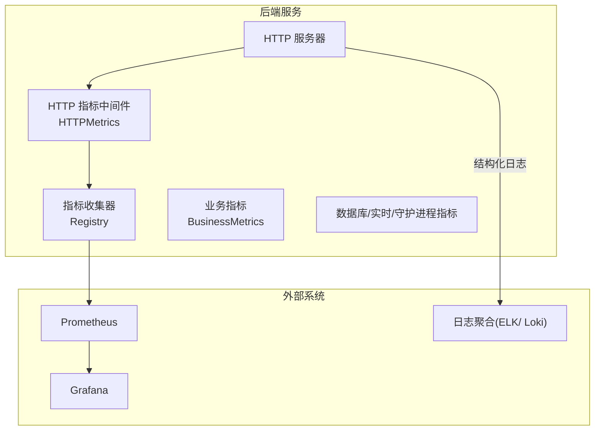
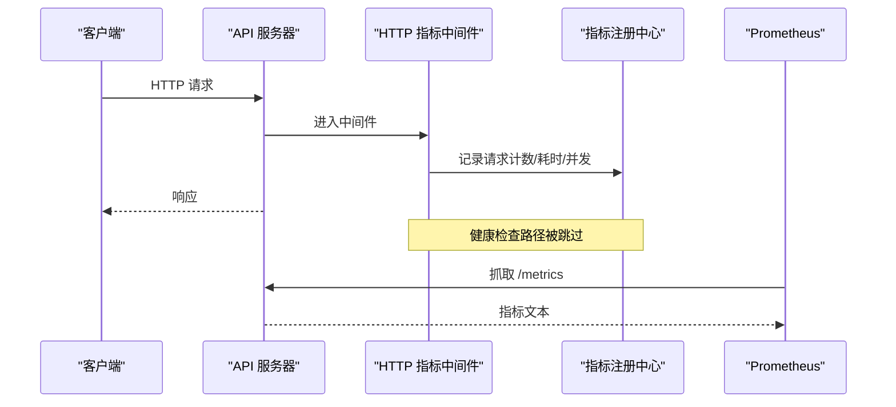
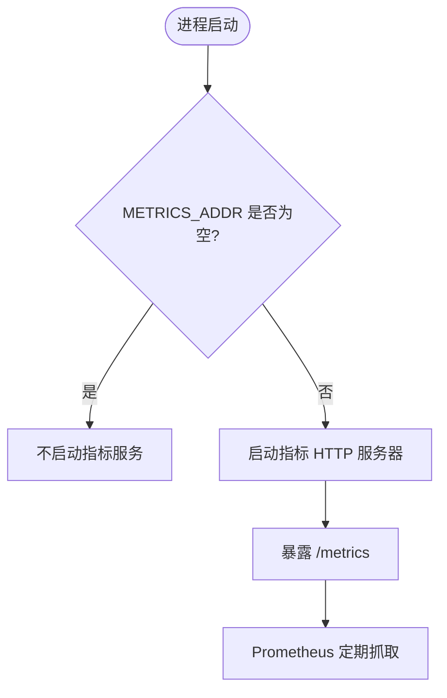
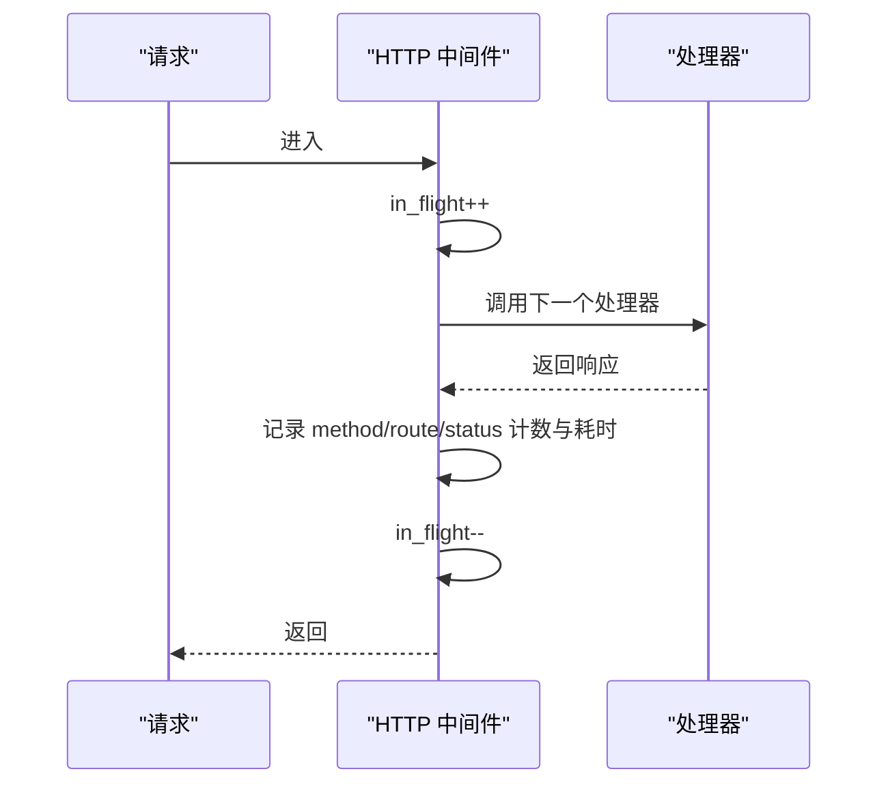
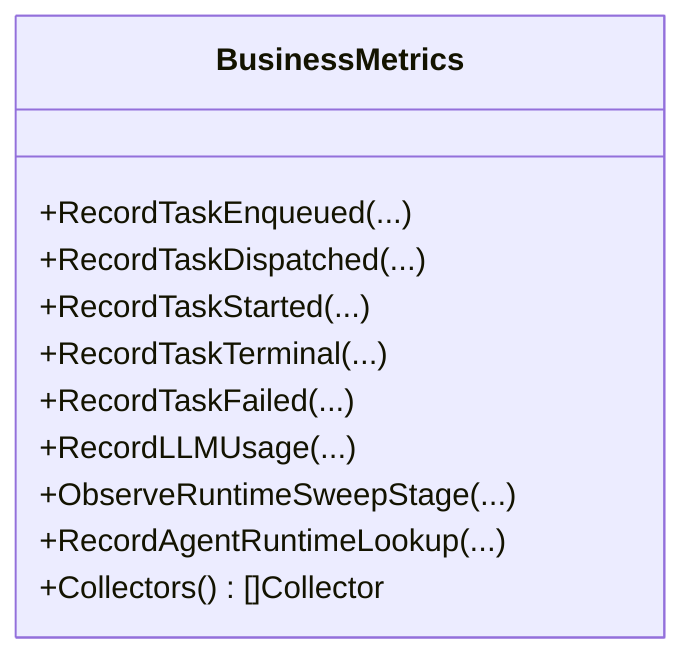
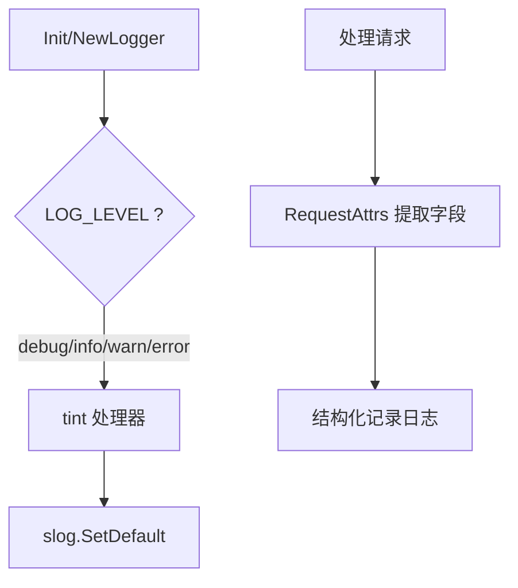
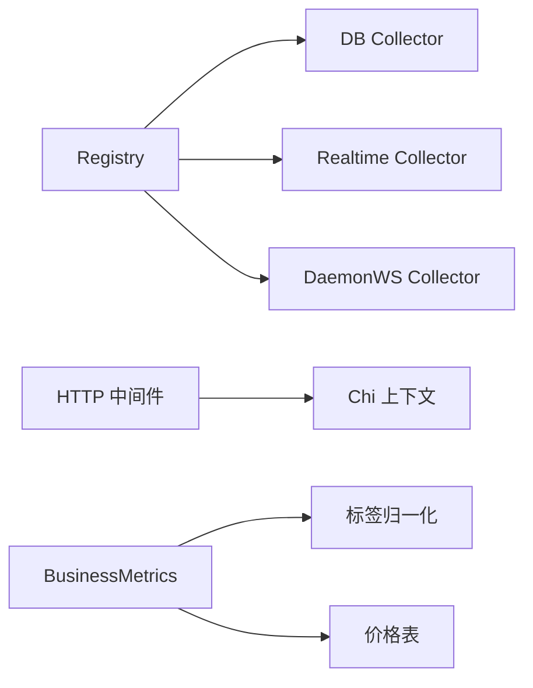

# 监控与日志

<cite>
**本文引用的文件**
- [server/internal/metrics/config.go](file://server/internal/metrics/config.go)
- [server/internal/metrics/registry.go](file://server/internal/metrics/registry.go)
- [server/internal/metrics/server.go](file://server/internal/metrics/server.go)
- [server/internal/metrics/http.go](file://server/internal/metrics/http.go)
- [server/internal/metrics/business.go](file://server/internal/metrics/business.go)
- [server/internal/logger/logger.go](file://server/internal/logger/logger.go)
- [SELF_HOSTING_ADVANCED.md](file://SELF_HOSTING_ADVANCED.md)
- [docker-compose.selfhost.yml](file://docker-compose.selfhost.yml)
- [apps/desktop/src/renderer/src/components/parse-daemon-log.ts](file://apps/desktop/src/renderer/src/components/parse-daemon-log.ts)
- [apps/mobile/lib/request-id.ts](file://apps/mobile/lib/request-id.ts)
</cite>

## 目录
1. [简介](#简介)
2. [项目结构](#项目结构)
3. [核心组件](#核心组件)
4. [架构总览](#架构总览)
5. [详细组件分析](#详细组件分析)
6. [依赖关系分析](#依赖关系分析)
7. [性能考量](#性能考量)
8. [故障排查指南](#故障排查指南)
9. [结论](#结论)
10. [附录](#附录)

## 简介
本指南面向 Multica 后端（Go）的监控与日志体系，覆盖指标采集与暴露、结构化日志配置与输出、第三方工具集成（Prometheus/Grafana/ELK）、性能监控、错误追踪、业务指标分析、告警规则与通知机制，以及多环境部署下的配置要点。文档内容严格基于仓库中的实现与文档，确保可落地与可验证。

## 项目结构
后端监控与日志相关代码集中在 server/internal 下：
- metrics：Prometheus 指标定义、注册、HTTP 中间件、服务端点与配置
- logger：结构化日志初始化、请求上下文属性提取、写入器适配

图表来源
- [server/internal/metrics/server.go:11-18](file://server/internal/metrics/server.go#L11-L18)
- [server/internal/metrics/registry.go:33-80](file://server/internal/metrics/registry.go#L33-L80)
- [server/internal/metrics/http.go:22-55](file://server/internal/metrics/http.go#L22-L55)
- [server/internal/metrics/business.go:88-342](file://server/internal/metrics/business.go#L88-L342)

章节来源
- [server/internal/metrics/server.go:11-18](file://server/internal/metrics/server.go#L11-L18)
- [server/internal/metrics/registry.go:33-80](file://server/internal/metrics/registry.go#L33-L80)
- [server/internal/metrics/http.go:22-55](file://server/internal/metrics/http.go#L22-L55)
- [server/internal/metrics/business.go:88-342](file://server/internal/metrics/business.go#L88-L342)

## 核心组件
- 指标配置与开关
  - 通过环境变量 METRICS_ADDR 控制是否启用指标监听；支持回环地址校验，避免误绑公网。
- 指标注册中心
  - 统一注册 Go/进程指标、构建信息、HTTP、业务、通道媒体、通道租约、企业微信、数据库路由等指标集合。
- HTTP 指标中间件
  - 统计请求数、耗时、并发、响应体大小（特定端点），自动忽略健康检查路径。
- 业务指标
  - 任务生命周期、LLM 用量与成本、运行时维护阶段、权限与配额决策、代理运行时查找等。
- 结构化日志
  - 基于 slog + tint，按终端/文件自动着色；提供请求级属性（request_id、user_id、客户端平台/版本/OS）。

章节来源
- [server/internal/metrics/config.go:9-35](file://server/internal/metrics/config.go#L9-L35)
- [server/internal/metrics/registry.go:14-80](file://server/internal/metrics/registry.go#L14-L80)
- [server/internal/metrics/http.go:13-55](file://server/internal/metrics/http.go#L13-L55)
- [server/internal/metrics/business.go:37-342](file://server/internal/metrics/business.go#L37-L342)
- [server/internal/logger/logger.go:27-104](file://server/internal/logger/logger.go#L27-L104)

## 架构总览
后端以 Prometheus 为指标出口，通过独立管理端口暴露 /metrics；HTTP 层中间件自动记录请求维度指标；业务模块在关键路径埋点；日志采用结构化格式输出到 stderr，便于容器化采集。

图表来源
- [server/internal/metrics/http.go:57-90](file://server/internal/metrics/http.go#L57-L90)
- [server/internal/metrics/server.go:11-18](file://server/internal/metrics/server.go#L11-L18)
- [server/internal/metrics/registry.go:33-80](file://server/internal/metrics/registry.go#L33-L80)

## 详细组件分析

### Prometheus 指标与暴露
- 暴露端点
  - 通过 NewHandler 暴露 /metrics，并开启 OpenMetrics 兼容模式。
  - 通过 NewServer 创建独立 HTTP Server，仅承载指标抓取。
- 指标集合
  - Go 与进程指标、构建信息、HTTP、业务、数据库、实时、守护进程 WebSocket、渠道媒体、渠道租约、企业微信、数据库路由等。
- 安全建议
  - 默认不启动；若启用，建议绑定内网或回环地址，并通过网络策略/白名单保护。

图表来源
- [server/internal/metrics/config.go:13-19](file://server/internal/metrics/config.go#L13-L19)
- [server/internal/metrics/server.go:11-29](file://server/internal/metrics/server.go#L11-L29)

章节来源
- [server/internal/metrics/server.go:11-29](file://server/internal/metrics/server.go#L11-L29)
- [server/internal/metrics/registry.go:33-80](file://server/internal/metrics/registry.go#L33-L80)
- [SELF_HOSTING_ADVANCED.md:612-632](file://SELF_HOSTING_ADVANCED.md#L612-L632)

### HTTP 指标中间件
- 功能
  - 统计方法、路由、状态码的请求总数与耗时直方图；跟踪并发请求；对特定端点记录响应字节数；跳过健康检查路径。
- 使用方式
  - 将中间件挂载到路由入口，即可无侵入地采集所有 HTTP 指标。

图表来源
- [server/internal/metrics/http.go:57-90](file://server/internal/metrics/http.go#L57-L90)

章节来源
- [server/internal/metrics/http.go:13-110](file://server/internal/metrics/http.go#L13-L110)

### 业务指标
- 任务指标
  - 入队、分发、开始、结束、失败、排队等待、可领取等待、运行时长、总时长、进行中、重试次数等。
- LLM 指标
  - 令牌总量、成本估算、未定价令牌、请求次数；支持按提供商/模型/类型/运行模式/来源拆分。
- 运行时维护
  - 各维护阶段耗时、候选行数、变更行数；垃圾回收删除/失败/跳过原因。
- 权限与配额
  - 配置错误、缓存命中/刷新、刷新耗时、决策结果、版本回退、自动飞行配额决策。
- 代理运行时查找
  - 单行查询按来源与结果分类计数，预冷标签避免缺失系列。

图表来源
- [server/internal/metrics/business.go:88-342](file://server/internal/metrics/business.go#L88-L342)
- [server/internal/metrics/business.go:470-723](file://server/internal/metrics/business.go#L470-L723)

章节来源
- [server/internal/metrics/business.go:88-342](file://server/internal/metrics/business.go#L88-L342)
- [server/internal/metrics/business.go:470-723](file://server/internal/metrics/business.go#L470-L723)

### 结构化日志
- 初始化
  - 根据 LOG_LEVEL 设置级别；stderr 为终端时着色，否则关闭颜色；支持命名组件日志。
- 请求级属性
  - 从请求上下文提取 request_id、user_id、client_platform/version/os，便于关联日志与指标。
- 文件输出
  - 提供 WriterLoggerDefault，将结构化日志写入任意 writer（如文件/轮转），并设为全局默认，保证包级日志也落入同一目的地。

图表来源
- [server/internal/logger/logger.go:27-79](file://server/internal/logger/logger.go#L27-L79)
- [server/internal/logger/logger.go:81-104](file://server/internal/logger/logger.go#L81-L104)

章节来源
- [server/internal/logger/logger.go:27-104](file://server/internal/logger/logger.go#L27-L104)

### 第三方监控集成
- Prometheus
  - 通过 METRICS_ADDR 启用独立监听，Prometheus 抓取 /metrics。
- Grafana
  - 将 Prometheus 作为数据源，基于 HTTP/业务/LLM 等指标构建看板。
- ELK/Loki
  - 将后端 stderr 的结构化日志接入日志系统；桌面端具备日志解析能力，可用于本地调试与问题定位。

章节来源
- [SELF_HOSTING_ADVANCED.md:612-632](file://SELF_HOSTING_ADVANCED.md#L612-L632)
- [apps/desktop/src/renderer/src/components/parse-daemon-log.ts:61-96](file://apps/desktop/src/renderer/src/components/parse-daemon-log.ts#L61-L96)

### 性能监控与错误追踪
- 性能
  - HTTP 耗时直方图、任务运行/总时长直方图、运行时维护阶段耗时、数据库/实时/守护进程指标。
  - 可通过 Go pprof 进行 CPU/堆/阻塞/互斥等深度分析（仅限回环管理端口）。
- 错误追踪
  - 前端/桌面端通过异常捕获上报；移动端通过请求 ID 关联前后端日志。

章节来源
- [server/internal/metrics/http.go:57-90](file://server/internal/metrics/http.go#L57-L90)
- [server/internal/metrics/business.go:121-161](file://server/internal/metrics/business.go#L121-L161)
- [SELF_HOSTING_ADVANCED.md:634-649](file://SELF_HOSTING_ADVANCED.md#L634-L649)
- [apps/mobile/lib/request-id.ts:1-14](file://apps/mobile/lib/request-id.ts#L1-L14)

### 告警规则与通知
- 指标层面
  - 基于 HTTP 错误率、任务失败率、LLM 成本突增、运行时维护阶段超时等指标建立告警。
- 通知机制
  - 结合 Prometheus Alertmanager 或平台通知能力（如企业微信）进行告警推送。
- 说明
  - 具体告警规则与通知配置需结合部署环境与团队流程制定，此处给出方向性建议。

[本节为通用实践说明，不直接分析具体文件]

### 多环境配置
- 开发/自托管
  - 通过 docker-compose 启动 PostgreSQL 与后端；通过 .env 注入环境变量。
  - 使用 /health、/readyz、/healthz 进行存活与就绪探测。
- 生产
  - 将指标端口绑定至私有网络或回环地址，配合网络策略/白名单保护；仅允许可信 scrape 来源访问。

章节来源
- [docker-compose.selfhost.yml:35-53](file://docker-compose.selfhost.yml#L35-L53)
- [SELF_HOSTING_ADVANCED.md:607-632](file://SELF_HOSTING_ADVANCED.md#L607-L632)

## 依赖关系分析
- 指标注册中心依赖
  - 数据库连接池、实时子系统、守护进程 WebSocket 子系统，按需注册对应 Collector。
- HTTP 中间件依赖
  - Chi 路由上下文获取路由模式；响应包装器获取状态码与响应字节数。
- 业务指标依赖
  - 任务失败分类、价格表、标签归一化工具，确保指标标签稳定且可控。

图表来源
- [server/internal/metrics/registry.go:33-80](file://server/internal/metrics/registry.go#L33-L80)
- [server/internal/metrics/http.go:93-100](file://server/internal/metrics/http.go#L93-L100)
- [server/internal/metrics/business.go:597-642](file://server/internal/metrics/business.go#L597-L642)

章节来源
- [server/internal/metrics/registry.go:33-80](file://server/internal/metrics/registry.go#L33-L80)
- [server/internal/metrics/http.go:93-100](file://server/internal/metrics/http.go#L93-L100)
- [server/internal/metrics/business.go:597-642](file://server/internal/metrics/business.go#L597-L642)

## 性能考量
- 指标粒度
  - 直方图桶位已针对常见延迟范围优化；避免高基数标签导致内存膨胀。
- 中间件开销
  - 中间件仅在非健康检查路径记录指标；尽量复用已有上下文信息。
- 日志输出
  - 文件模式下禁用 ANSI 颜色，减少额外处理；结构化字段便于高效检索。
- 资源隔离
  - 指标端口与公开 API 分离，降低对外暴露面；pprof 仅回环可达。

[本节为通用指导，不直接分析具体文件]

## 故障排查指南
- 无法抓取指标
  - 确认 METRICS_ADDR 已设置且服务已启动；检查端口绑定与网络策略。
- 指标缺失或为零
  - 确认中间件已挂载；健康检查路径不会被记录；检查路由模式是否正确。
- 日志不可读
  - 确认 LOG_LEVEL 设置；文件输出时使用 WriterLoggerDefault 保证统一目的地。
- 前后端日志关联
  - 使用 X-Request-ID 或客户端生成的请求 ID 关联链路。

章节来源
- [server/internal/metrics/config.go:13-19](file://server/internal/metrics/config.go#L13-L19)
- [server/internal/metrics/http.go:102-109](file://server/internal/metrics/http.go#L102-L109)
- [server/internal/logger/logger.go:62-79](file://server/internal/logger/logger.go#L62-L79)
- [apps/mobile/lib/request-id.ts:1-14](file://apps/mobile/lib/request-id.ts#L1-L14)

## 结论
Multica 后端提供了完善的 Prometheus 指标体系与结构化日志能力：通过独立管理端口暴露指标，HTTP 中间件自动采集请求维度指标，业务模块覆盖任务、LLM、运行时维护等关键路径；日志支持终端着色与文件输出，便于容器化采集。结合 Prometheus/Grafana/ELK 可实现可视化监控与问题定位；pprof 提供深度性能分析能力。建议在多环境中合理配置指标端口与日志采集，建立告警与通知闭环，保障系统稳定性与可观测性。

[本节为总结，不直接分析具体文件]

## 附录
- 常用环境变量
  - METRICS_ADDR：指标监听地址（为空则不启用）
  - LOG_LEVEL：日志级别（debug/info/warn/error）
- 健康检查
  - /health、/readyz、/healthz 用于存活与就绪探测
- 性能分析
  - 回环端口 6060 暴露标准 pprof 路由，仅限本机或容器内访问

章节来源
- [server/internal/metrics/config.go:13-19](file://server/internal/metrics/config.go#L13-L19)
- [SELF_HOSTING_ADVANCED.md:607-649](file://SELF_HOSTING_ADVANCED.md#L607-L649)