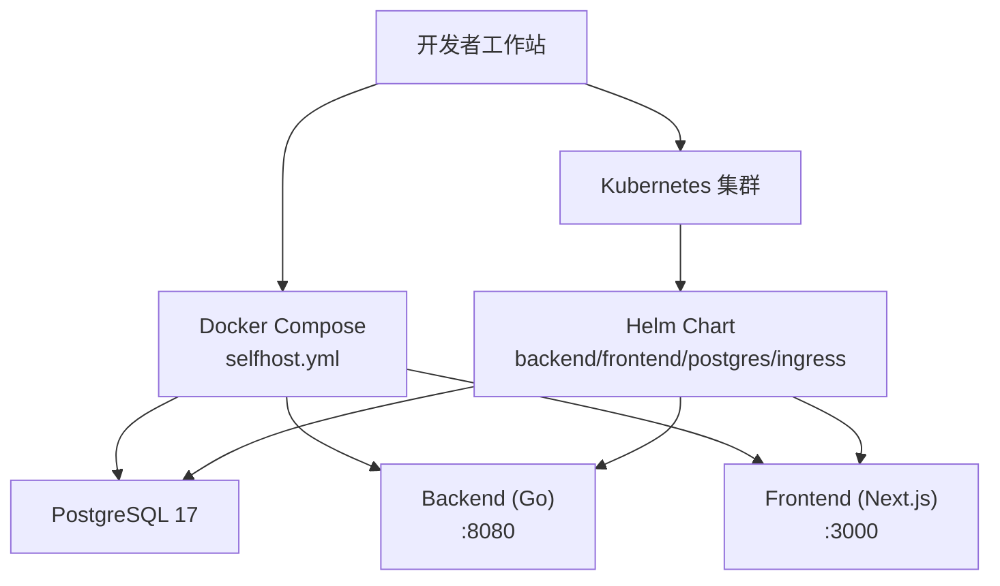
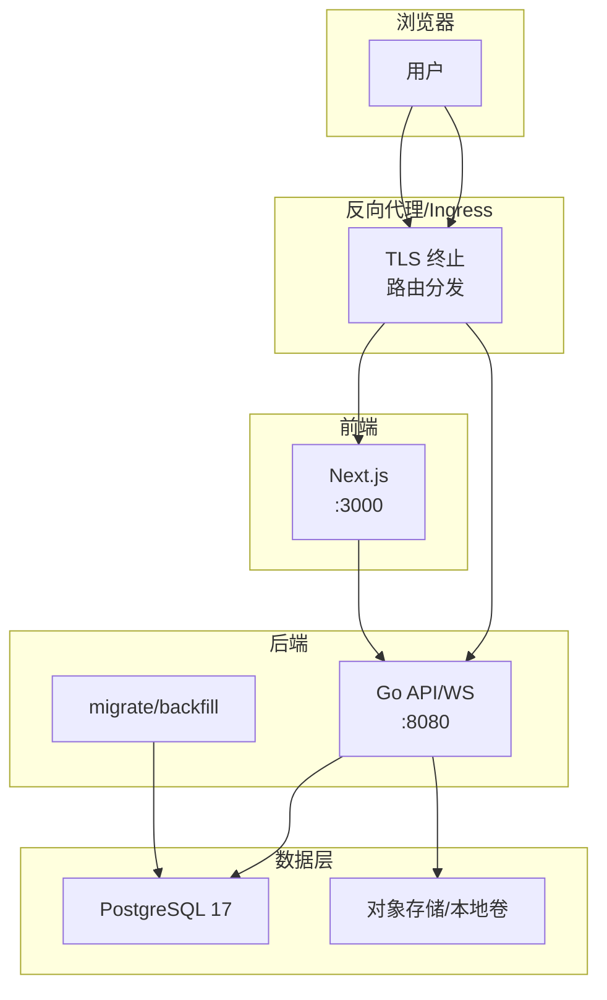
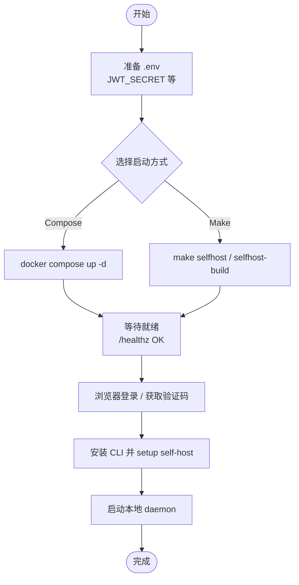
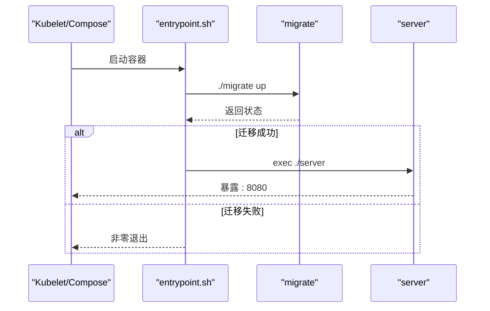
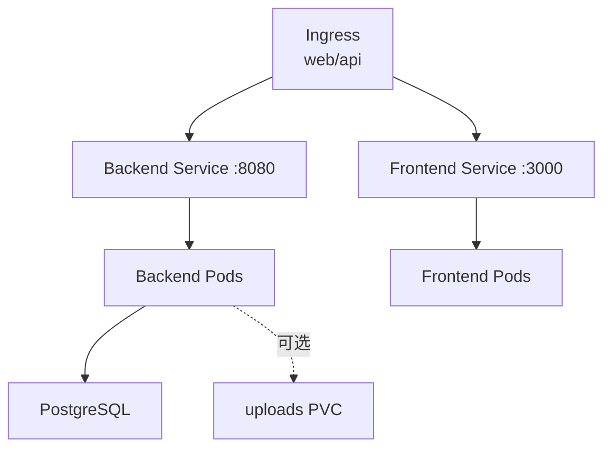
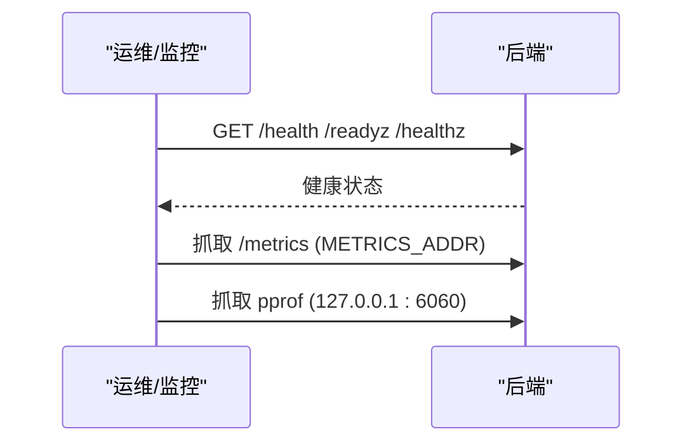
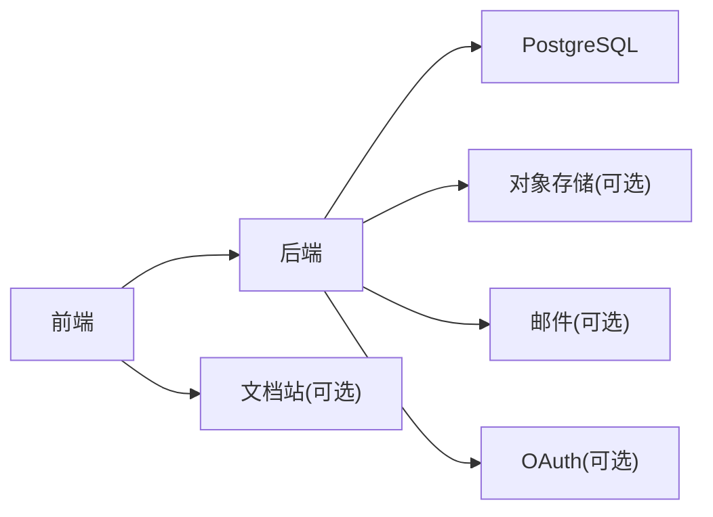

# 部署运维

<cite>
**本文引用的文件**
- [docker-compose.yml](file://docker-compose.yml)
- [docker-compose.selfhost.yml](file://docker-compose.selfhost.yml)
- [Dockerfile](file://Dockerfile)
- [docker/entrypoint.sh](file://docker/entrypoint.sh)
- [SELF_HOSTING.md](file://SELF_HOSTING.md)
- [SELF_HOSTING_ADVANCED.md](file://SELF_HOSTING_ADVANCED.md)
- [Makefile](file://Makefile)
- [scripts/dev-env.sh](file://scripts/dev-env.sh)
- [scripts/local-env.sh](file://scripts/local-env.sh)
- [deploy/helm/multica/Chart.yaml](file://deploy/helm/multica/Chart.yaml)
- [deploy/helm/multica/values.yaml](file://deploy/helm/multica/values.yaml)
- [deploy/helm/multica/templates/backend.yaml](file://deploy/helm/multica/templates/backend.yaml)
- [deploy/helm/multica/templates/frontend.yaml](file://deploy/helm/multica/templates/frontend.yaml)
- [deploy/helm/multica/templates/configmap.yaml](file://deploy/helm/multica/templates/configmap.yaml)
- [deploy/helm/multica/templates/ingress.yaml](file://deploy/helm/multica/templates/ingress.yaml)
</cite>

## 目录
1. [简介](#简介)
2. [项目结构](#项目结构)
3. [核心组件](#核心组件)
4. [架构总览](#架构总览)
5. [详细组件分析](#详细组件分析)
6. [依赖关系分析](#依赖关系分析)
7. [性能与容量规划](#性能与容量规划)
8. [监控、日志与性能分析](#监控日志与性能分析)
9. [备份恢复与灾难恢复](#备份恢复与灾难恢复)
10. [安全加固](#安全加固)
11. [故障排除指南](#故障排除指南)
12. [扩展与定制部署配置](#扩展与定制部署配置)
13. [结论](#结论)

## 简介
本指南面向本地开发、容器化编排与 Kubernetes 生产部署，覆盖从环境搭建、Docker Compose 自托管到 Helm Chart 的完整路径，并补充监控、日志、性能分析、备份恢复、安全加固、故障排除与扩展定制等运维要点。后端为 Go（Chi + sqlc + gorilla/websocket），前端为 Next.js 应用，数据库为 PostgreSQL 17；智能体任务在本地守护进程执行，通过 WebSocket 与后端交互。

## 项目结构
- 容器镜像构建：根级 Dockerfile 负责后端多二进制构建（server、multica CLI、migrate、backfill 工具）及运行时入口脚本。
- 自托管编排：docker-compose.selfhost.yml 提供 PostgreSQL、后端、前端三服务一键拉起；另有轻量 compose 仅包含数据库。
- Helm Chart：deploy/helm/multica 提供 K8s 部署模板，含 Backend、Frontend、Postgres、Ingress、ConfigMap 等资源。
- 开发与本地环境：Makefile 与 scripts/dev-env.sh 提供命名式开发环境管理、端口分配、迁移与启动流程。

图表来源
- [docker-compose.selfhost.yml:35-218](file://docker-compose.selfhost.yml#L35-L218)
- [deploy/helm/multica/templates/backend.yaml:21-163](file://deploy/helm/multica/templates/backend.yaml#L21-L163)
- [deploy/helm/multica/templates/frontend.yaml:1-77](file://deploy/helm/multica/templates/frontend.yaml#L1-L77)
- [deploy/helm/multica/templates/ingress.yaml:1-60](file://deploy/helm/multica/templates/ingress.yaml#L1-L60)

章节来源
- [docker-compose.yml:1-17](file://docker-compose.yml#L1-L17)
- [docker-compose.selfhost.yml:1-219](file://docker-compose.selfhost.yml#L1-L219)
- [Dockerfile:1-45](file://Dockerfile#L1-L45)
- [Makefile:79-144](file://Makefile#L79-L144)

## 核心组件
- 后端（Go）：REST API + WebSocket，暴露 /health、/readyz、/healthz 健康端点；支持 Prometheus 指标与 pprof 调试；内置 migrate 与 backfill 工具。
- 前端（Next.js）：独立静态/SSR 服务，通过环境变量注入后端上游地址，支持同域或分域部署。
- 数据库（PostgreSQL 17）：默认使用 pgvector/pgvector:pg17 镜像；迁移依赖 pgcrypto、pg_trgm 扩展；可选 pg_bigm 提升中文检索质量。
- 存储：默认本地磁盘挂载；可切换 S3/CloudFront 模式；头像与附件下载策略可配置。
- 编排：Docker Compose 用于自托管；Helm Chart 用于 K8s；Ingress 暴露 Web 与 API。

章节来源
- [SELF_HOSTING.md:5-14](file://SELF_HOSTING.md#L5-L14)
- [SELF_HOSTING_ADVANCED.md:242-275](file://SELF_HOSTING_ADVANCED.md#L242-L275)
- [SELF_HOSTING_ADVANCED.md:92-141](file://SELF_HOSTING_ADVANCED.md#L92-L141)
- [SELF_HOSTING_ADVANCED.md:592-610](file://SELF_HOSTING_ADVANCED.md#L592-L610)

## 架构总览
后端与前端分离，数据库持久化；自托管通过反向代理统一 TLS 与路由；生产环境通过 Ingress 暴露两个域名（Web 与 API）。

图表来源
- [docker-compose.selfhost.yml:55-214](file://docker-compose.selfhost.yml#L55-L214)
- [deploy/helm/multica/templates/backend.yaml:59-108](file://deploy/helm/multica/templates/backend.yaml#L59-L108)
- [deploy/helm/multica/templates/frontend.yaml:23-50](file://deploy/helm/multica/templates/frontend.yaml#L23-L50)
- [deploy/helm/multica/templates/ingress.yaml:13-58](file://deploy/helm/multica/templates/ingress.yaml#L13-L58)

## 详细组件分析

### 本地开发环境搭建
- 推荐方式：使用 Makefile 提供的 selfhost/selfhost-build 目标自动创建 .env、生成密钥、拉取镜像并启动服务；或使用 dev-env.sh 管理命名式开发环境（端口、数据库、CLI 配置）。
- 关键步骤：
  - 准备 .env（复制示例并设置 JWT_SECRET 等必要变量）。
  - 启动 PostgreSQL、后端、前端。
  - 登录并安装 CLI，启动本地守护进程以执行智能体任务。
- 端口与 URL：后端默认 :8080，前端默认 :3000；可通过 BACKEND_PORT/FRONTEND_PORT 等别名调整。

图表来源
- [Makefile:82-138](file://Makefile#L82-L138)
- [docker-compose.selfhost.yml:55-214](file://docker-compose.selfhost.yml#L55-L214)
- [SELF_HOSTING.md:64-95](file://SELF_HOSTING.md#L64-L95)
- [scripts/dev-env.sh:318-356](file://scripts/dev-env.sh#L318-L356)

章节来源
- [Makefile:79-144](file://Makefile#L79-L144)
- [scripts/dev-env.sh:1-120](file://scripts/dev-env.sh#L1-L120)
- [scripts/local-env.sh:1-27](file://scripts/local-env.sh#L1-L27)
- [SELF_HOSTING.md:64-95](file://SELF_HOSTING.md#L64-L95)

### Docker 容器化方案
- 镜像构建：多阶段构建，先编译 Go 二进制（server、multica CLI、migrate、backfill），再复制到精简运行时镜像。
- 运行入口：entrypoint.sh 先执行 migrate up，成功后 exec server；支持优雅停止信号传递。
- 端口暴露：容器内监听 8080（后端）、3000（前端）。

图表来源
- [Dockerfile:1-45](file://Dockerfile#L1-L45)
- [docker/entrypoint.sh:1-42](file://docker/entrypoint.sh#L1-L42)

章节来源
- [Dockerfile:1-45](file://Dockerfile#L1-L45)
- [docker/entrypoint.sh:1-42](file://docker/entrypoint.sh#L1-L42)

### Docker Compose 编排
- 服务组成：postgres、backend、frontend；绑定 127.0.0.1 避免直接暴露公网；通过反向代理对外提供服务。
- 健康检查：Postgres 使用 pg_isready；后端通过 /healthz 就绪探针。
- 环境变量：大量后端配置项（认证、邮件、存储、CORS、OAuth、VCS 集成等）通过 .env 注入。

图表来源
- [docker-compose.selfhost.yml:35-214](file://docker-compose.selfhost.yml#L35-L214)

章节来源
- [docker-compose.selfhost.yml:1-219](file://docker-compose.selfhost.yml#L1-L219)

### Kubernetes 生产部署（Helm）
- 资源清单：Backend Deployment/Service、Frontend Deployment/Service、Postgres StatefulSet/Deployment（由 chart 提供）、Ingress（Web/API 双域名）。
- 配置注入：ConfigMap 注入非敏感配置；Secret 通过 existingSecret 引用（不纳入 chart 模板），包含 JWT_SECRET、POSTGRES_PASSWORD 等。
- 滚动更新：对 ConfigMap/Secret 变更使用 checksum 注解触发 Pod 滚动。
- 存储：uploads PVC（ReadWriteOnce 默认），可关闭并使用 S3。

图表来源
- [deploy/helm/multica/templates/backend.yaml:21-163](file://deploy/helm/multica/templates/backend.yaml#L21-L163)
- [deploy/helm/multica/templates/frontend.yaml:1-77](file://deploy/helm/multica/templates/frontend.yaml#L1-L77)
- [deploy/helm/multica/templates/configmap.yaml:1-37](file://deploy/helm/multica/templates/configmap.yaml#L1-L37)
- [deploy/helm/multica/templates/ingress.yaml:1-60](file://deploy/helm/multica/templates/ingress.yaml#L1-L60)
- [deploy/helm/multica/values.yaml:1-208](file://deploy/helm/multica/values.yaml#L1-L208)

章节来源
- [deploy/helm/multica/values.yaml:1-208](file://deploy/helm/multica/values.yaml#L1-L208)
- [deploy/helm/multica/templates/backend.yaml:1-163](file://deploy/helm/multica/templates/backend.yaml#L1-L163)
- [deploy/helm/multica/templates/frontend.yaml:1-77](file://deploy/helm/multica/templates/frontend.yaml#L1-L77)
- [deploy/helm/multica/templates/configmap.yaml:1-37](file://deploy/helm/multica/templates/configmap.yaml#L1-L37)
- [deploy/helm/multica/templates/ingress.yaml:1-60](file://deploy/helm/multica/templates/ingress.yaml#L1-L60)

### 监控、日志与性能分析
- 健康检查：/health（基础可达性）、/readyz 或 /healthz（依赖就绪，如数据库与迁移）。
- 指标采集：通过 METRICS_ADDR 暴露 Prometheus 指标（建议绑定内网接口并通过私有网络抓取）。
- 性能剖析：pprof 监听固定回环地址 127.0.0.1:6060，仅限本机访问。
- 日志：后端输出至 stderr，结合容器日志系统收集。

图表来源
- [SELF_HOSTING_ADVANCED.md:592-649](file://SELF_HOSTING_ADVANCED.md#L592-L649)

章节来源
- [SELF_HOSTING_ADVANCED.md:592-649](file://SELF_HOSTING_ADVANCED.md#L592-L649)

### 备份恢复与灾难恢复
- 数据库备份：对 PostgreSQL 数据卷或实例进行定期快照/逻辑备份；确保迁移所需扩展可用。
- 上传文件：若启用本地 uploads PVC，需对 PVC 做快照；若使用 S3/CloudFront，则依赖对象存储版本控制与跨区域复制。
- 升级回滚：Helm 支持 rollout restart 与 rollback；迁移在启动时自动执行且幂等。
- 使用报表回填：v0.3.4→v0.3.5+ 升级涉及 usage rollup，可在需要时运行 backfill_task_usage_hourly。

章节来源
- [SELF_HOSTING.md:172-371](file://SELF_HOSTING.md#L172-L371)
- [SELF_HOSTING.md:459-469](file://SELF_HOSTING.md#L459-L469)
- [SELF_HOSTING_ADVANCED.md:304-361](file://SELF_HOSTING_ADVANCED.md#L304-L361)

### 安全加固
- 最小暴露面：Compose 默认绑定 127.0.0.1；生产通过反向代理或 Ingress 终止 TLS。
- 认证与会话：JWT_SECRET 必填；Cookie 作用域按同域/分域策略配置；跨域与 WebSocket Origin 校验需一致。
- 存储安全：私有桶配合签名下载或代理；CloudFront 私钥妥善保管。
- 指标与调试：Metrics 与 pprof 仅对内暴露；避免将调试端口暴露给公网。
- 注册与创建限制：可通过 ALLOW_SIGNUP、DISABLE_WORKSPACE_CREATION 等限制新注册与工作区创建。

章节来源
- [docker-compose.selfhost.yml:1-219](file://docker-compose.selfhost.yml#L1-L219)
- [SELF_HOSTING_ADVANCED.md:92-150](file://SELF_HOSTING_ADVANCED.md#L92-L150)
- [SELF_HOSTING_ADVANCED.md:392-553](file://SELF_HOSTING_ADVANCED.md#L392-L553)
- [SELF_HOSTING_ADVANCED.md:612-649](file://SELF_HOSTING_ADVANCED.md#L612-L649)

### 故障排除指南
- 无法连接数据库：检查 DATABASE_URL、Postgres 扩展、迁移是否成功；查看 /readyz。
- 实时功能不可用：确认 CORS_ALLOWED_ORIGINS 与 FRONTEND_ORIGIN；WebSocket 需正确转发 Upgrade。
- 跨域 Cookie 失效：分域部署需设置 COOKIE_DOMAIN；必要时清理旧 Cookie 后重新登录。
- 端口冲突：使用 make status/list 查看占用；dev-env.sh 会检测端口并提示冲突来源。
- 升级失败：根据错误信息执行 backfill 或回滚 Helm release。

章节来源
- [SELF_HOSTING_ADVANCED.md:554-591](file://SELF_HOSTING_ADVANCED.md#L554-L591)
- [Makefile:157-176](file://Makefile#L157-L176)
- [scripts/dev-env.sh:456-552](file://scripts/dev-env.sh#L456-L552)

### 扩展与定制部署配置
- 水平扩展：后端副本数可调（注意 uploads 共享策略，建议使用 S3 或 RWX 存储）；前端副本无状态可自由扩展。
- 外部数据库：values.yaml 中 postgres.external.enabled=true 时，通过 existingSecret 提供 DATABASE_URL。
- 存储切换：开启 S3/CloudFront 后，可禁用 uploads PVC；头像与附件下载策略按需配置。
- 反向代理：单域或分域两种布局；WebSocket 必须正确透传 Upgrade。
- 自定义镜像：可使用 selfhost.build.yml 从源码构建镜像；Helm values 中指定 images.*.tag。

章节来源
- [deploy/helm/multica/values.yaml:48-158](file://deploy/helm/multica/values.yaml#L48-L158)
- [SELF_HOSTING_ADVANCED.md:392-553](file://SELF_HOSTING_ADVANCED.md#L392-L553)
- [SELF_HOSTING.md:459-469](file://SELF_HOSTING.md#L459-L469)

## 依赖关系分析
- 后端依赖：PostgreSQL（必需）、可选 S3/CloudFront、可选邮件（Resend/SMTP）、可选 OAuth（Google）、可选 VCS 集成。
- 前端依赖：后端 API/WS 地址（通过环境变量注入），文档站点可选。
- 编排依赖：Compose 要求 Compose v2；K8s 要求 Ingress Controller 与默认 StorageClass。

图表来源
- [docker-compose.selfhost.yml:64-199](file://docker-compose.selfhost.yml#L64-L199)
- [deploy/helm/multica/templates/configmap.yaml:8-30](file://deploy/helm/multica/templates/configmap.yaml#L8-L30)

章节来源
- [docker-compose.selfhost.yml:55-214](file://docker-compose.selfhost.yml#L55-L214)
- [deploy/helm/multica/templates/configmap.yaml:1-37](file://deploy/helm/multica/templates/configmap.yaml#L1-L37)

## 性能与容量规划
- 数据库连接池：DATABASE_MAX_CONNS/MIN_CONNS 与副本数乘积需低于 Postgres max_connections；只读副本可独立预算。
- 存储吞吐：本地 uploads 适合小规模；大规模建议使用 S3 并开启 CDN。
- 计算资源：根据 QPS 与并发调优 CPU/内存 requests/limits；前端无状态易扩展。
- 网络：WebSocket 长连接需合理超时与缓冲策略；反向代理需关闭响应缓冲以保证实时性。

章节来源
- [SELF_HOSTING_ADVANCED.md:17-29](file://SELF_HOSTING_ADVANCED.md#L17-L29)
- [SELF_HOSTING_ADVANCED.md:392-440](file://SELF_HOSTING_ADVANCED.md#L392-L440)

## 监控、日志与性能分析
- 健康检查：/health、/readyz、/healthz；K8s 中使用 startupProbe/readinessProbe/livenessProbe 组合。
- 指标：启用 METRICS_ADDR 后抓取 /metrics；建议内网抓取并加鉴权。
- 性能剖析：pprof 仅在回环地址暴露；容器内抓取后导出分析。
- 日志：stderr 输出；结合平台日志系统集中收集与检索。

章节来源
- [SELF_HOSTING_ADVANCED.md:592-649](file://SELF_HOSTING_ADVANCED.md#L592-L649)
- [deploy/helm/multica/templates/backend.yaml:81-106](file://deploy/helm/multica/templates/backend.yaml#L81-L106)

## 备份恢复与灾难恢复
- 数据库：定期快照或逻辑备份；确保 pgcrypto、pg_trgm 扩展可用。
- 文件：PVC 快照或迁移到对象存储；对象存储启用版本控制与跨区域复制。
- 升级：Helm upgrade 自动迁移；必要时运行 backfill；异常时 helm rollback。
- 演练：定期演练恢复流程，验证数据一致性与业务可用性。

章节来源
- [SELF_HOSTING.md:172-371](file://SELF_HOSTING.md#L172-L371)
- [SELF_HOSTING_ADVANCED.md:304-361](file://SELF_HOSTING_ADVANCED.md#L304-L361)

## 安全加固
- 网络：仅通过反向代理/Ingress 暴露；禁止直连容器端口。
- 身份与会话：强 JWT_SECRET；严格 CORS 与 WebSocket Origin；分域部署谨慎设置 COOKIE_DOMAIN。
- 存储：私有桶配合签名或代理；CloudFront 私钥加密保管。
- 调试：Metrics/pprof 仅内网；生产环境关闭不必要的调试特性。
- 访问控制：限制注册与工作区创建；白名单邮箱/域名。

章节来源
- [docker-compose.selfhost.yml:1-219](file://docker-compose.selfhost.yml#L1-L219)
- [SELF_HOSTING_ADVANCED.md:92-150](file://SELF_HOSTING_ADVANCED.md#L92-L150)
- [SELF_HOSTING_ADVANCED.md:392-553](file://SELF_HOSTING_ADVANCED.md#L392-L553)

## 故障排除指南
- 登录问题：未配置邮件时验证码打印到后端日志；开发环境可设置固定验证码但严禁用于公网。
- 实时功能：检查反向代理 WebSocket 转发与 CORS；LAN 访问需允许对应 Origin。
- 端口冲突：使用 make status/list 定位占用进程；清理后重启。
- 迁移失败：检查数据库权限与扩展；必要时手动执行 backfill 后再升级。
- 升级回滚：helm rollback；或重启 Pod 拉取最新镜像。

章节来源
- [SELF_HOSTING.md:87-98](file://SELF_HOSTING.md#L87-L98)
- [SELF_HOSTING_ADVANCED.md:554-591](file://SELF_HOSTING_ADVANCED.md#L554-L591)
- [Makefile:157-176](file://Makefile#L157-L176)

## 扩展与定制部署配置
- 水平扩展：后端副本数增加需考虑 uploads 共享策略（建议 S3）；前端副本无状态可自由扩展。
- 外部依赖：接入企业邮件、OAuth、对象存储、CDN；按需启用 VCS 集成。
- 反向代理：单域/分域布局；WebSocket 必须透传 Upgrade；关闭缓冲保证实时性。
- 镜像与版本：Helm values 指定 images.*.tag；也可通过 selfhost.build.yml 从源码构建。
- 配置热更新：ConfigMap/Secret 变更触发 Pod 滚动；前端通过环境变量注入后端地址无需重建。

章节来源
- [deploy/helm/multica/values.yaml:1-208](file://deploy/helm/multica/values.yaml#L1-L208)
- [deploy/helm/multica/templates/backend.yaml:43-54](file://deploy/helm/multica/templates/backend.yaml#L43-L54)
- [SELF_HOSTING_ADVANCED.md:392-553](file://SELF_HOSTING_ADVANCED.md#L392-L553)

## 结论
本项目提供了从本地开发到生产部署的完整路径：Docker Compose 快速自托管、Helm Chart 标准化 K8s 部署、完善的健康检查与指标、灵活的存储与认证配置、以及详尽的故障排除与安全加固建议。按照本指南操作，可在不同规模与环境下稳定交付 Multica 平台。