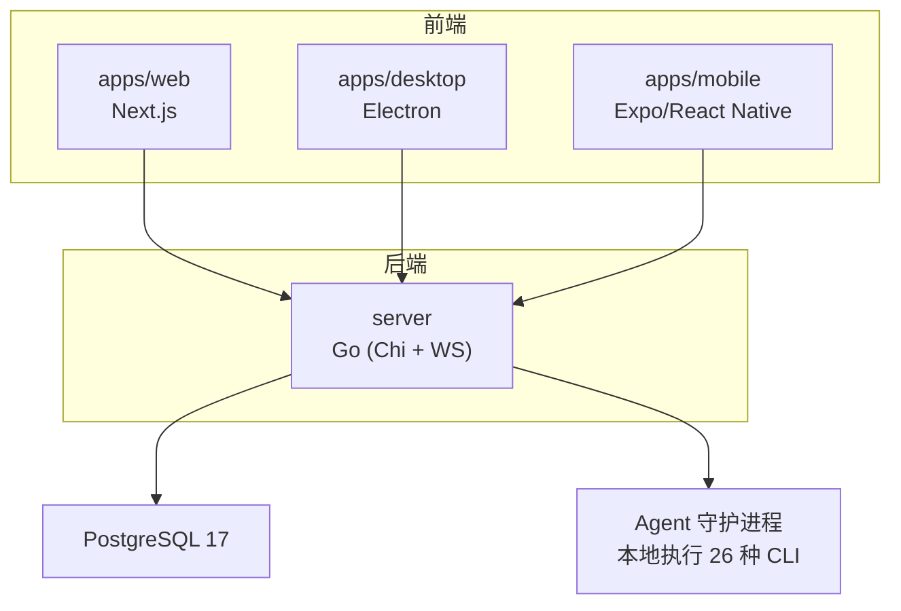
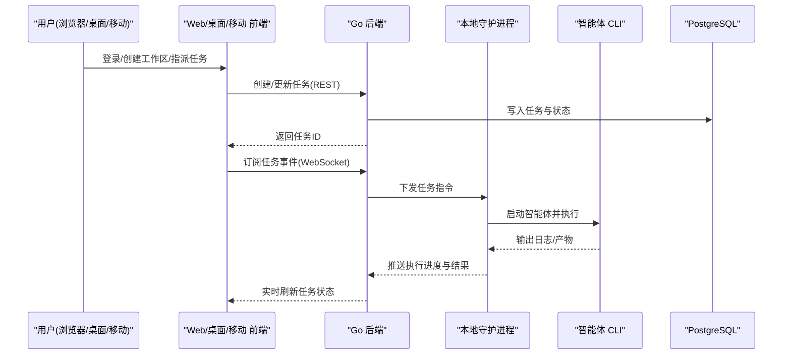
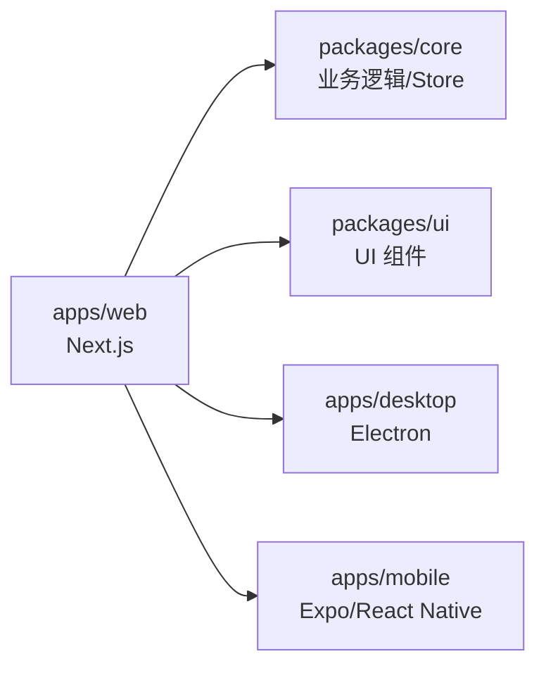
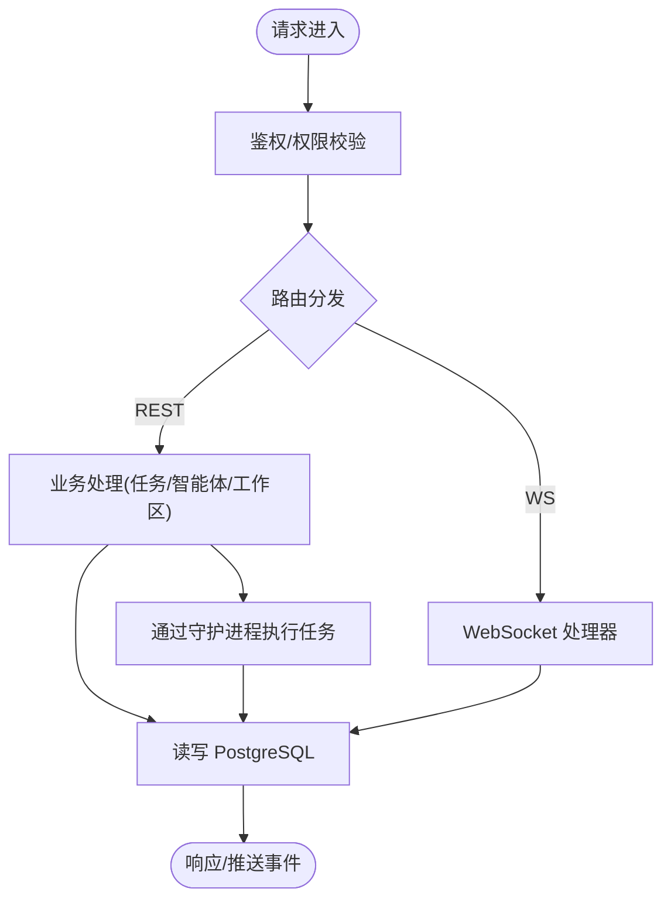
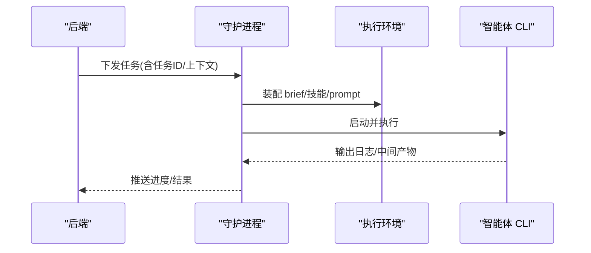
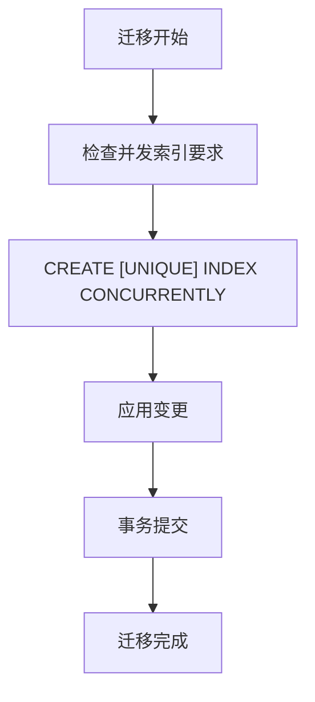
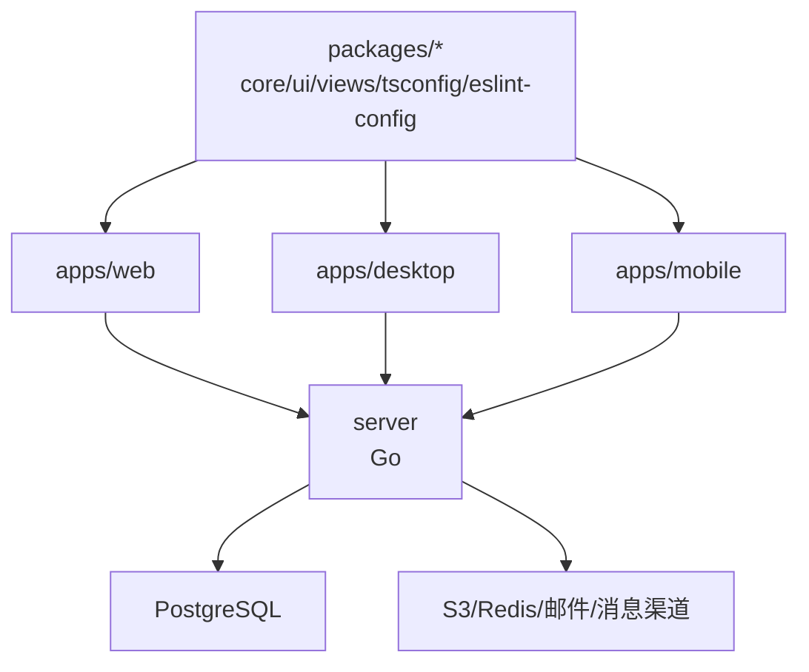

# 项目概述

<cite>
**本文引用的文件**
- [README.md](file://README.md)
- [README.zh.md](file://README.zh.md)
- [VISION.md](file://VISION.md)
- [CONTRIBUTING.md](file://CONTRIBUTING.md)
- [SELF_HOSTING.md](file://SELF_HOSTING.md)
- [CLI_AND_DAEMON.md](file://CLI_AND_DAEMON.md)
- [package.json](file://package.json)
- [Makefile](file://Makefile)
- [docker-compose.yml](file://docker-compose.yml)
- [server/go.mod](file://server/go.mod)
- [AGENTS.md](file://AGENTS.md)
</cite>

## 目录
1. [简介](#简介)
2. [项目结构](#项目结构)
3. [核心组件](#核心组件)
4. [架构总览](#架构总览)
5. [详细组件分析](#详细组件分析)
6. [依赖关系分析](#依赖关系分析)
7. [性能与可靠性考量](#性能与可靠性考量)
8. [故障排查指南](#故障排查指南)
9. [结论](#结论)
10. [附录：快速开始](#附录快速开始)

## 简介
Multica 是一个开源的 AI 原生团队协作/任务管理平台，将“智能体”视为一等公民的团队成员。它把人类与 AI 编码智能体放在同一个工作区中：你可以像给同事派活一样给智能体分配任务，智能体会在自己的运行时环境中执行、边做边汇报、遇到阻塞主动上报，完成后进入审核流程由人来把关。平台支持自部署，兼容约 26 种智能体 CLI，不绑定单一厂商。

核心价值主张
- 智能体即队友：为每个智能体命名、选择提供方和运行时，它们会出现在看板中，与其他成员一样参与任务生命周期。
- 可观测的执行过程：每次工具调用、命令与错误都带时间戳，可回放；可按智能体和任务查看 Token 用量。
- 安全可控：代码在本地守护进程中执行，不出本机；通过角色与权限控制谁能运行哪些智能体。
- 多端一致体验：Web、桌面（macOS/Windows/Linux）、移动端（iOS）共享同一工作区。
- 开放与可移植：支持任意 Git 服务与多种消息渠道，提供 CLI 与 API，便于脚本化与集成。

设计理念
- “分时复用”的团队操作系统：让小型团队也能拥有“多人同时使用一台机器”的能力，只不过这里的“用户”既有人也有机器。
- 以任务为中心的全链路记录：从意图、决策、执行到最终 diff，全部关联在同一任务下，避免上下文丢失。
- 人机协作边界清晰：人类负责方向与质量把关，智能体推动常规协调与执行。

社区与贡献
- 文档站点、官网、下载页、愿景说明与自部署指南均在仓库根目录提供。
- 贡献者需遵循贡献指南中的开发模型、环境隔离、测试与清理约定。
- 许可证采用 Multica License（Apache 2.0 全文并入附加条件），允许自部署、修改与二次构建，具体条款见 LICENSE。

章节来源
- [README.md:38-92](file://README.md#L38-L92)
- [README.zh.md:37-89](file://README.zh.md#L37-L89)
- [VISION.md:19-40](file://VISION.md#L19-L40)
- [CONTRIBUTING.md:16-29](file://CONTRIBUTING.md#L16-L29)

## 项目结构
仓库采用单体 Monorepo 组织，前端基于 pnpm workspaces + Turborepo，后端为 Go，数据库为 PostgreSQL。关键目录职责如下：
- apps/web：Next.js Web 应用（App Router）
- apps/desktop：Electron 桌面应用，复用 Web UI 包
- apps/mobile：Expo / React Native iOS 客户端
- apps/docs：文档站点
- server：Go 后端（Chi 路由、sqlc、gorilla/websocket）
- packages/core：无头业务逻辑（Zustand store、React Query hooks、API 客户端）
- packages/ui：原子 UI 组件（shadcn/Base UI，不含业务逻辑）
- packages/views：共享业务页面/组件（走 NavigationAdapter）
- deploy/helm：Kubernetes Helm Chart
- scripts：开发与运维脚本（环境初始化、迁移、测试等）
- e2e：端到端测试用例

图表来源
- [README.md:190-219](file://README.md#L190-L219)
- [AGENTS.md:13-26](file://AGENTS.md#L13-L26)

章节来源
- [AGENTS.md:13-26](file://AGENTS.md#L13-L26)
- [README.md:190-219](file://README.md#L190-L219)

## 核心组件
- 智能体与运行时
  - 智能体是一等团队成员，可被指派任务、自动拾取、评论进度、提交结果。
  - 运行时是智能体执行任务的本地环境，守护进程负责装配上下文、生成每轮 prompt、水合技能并拉起对应 CLI。
- 任务与工作区
  - 任务驱动工作流：创建、指派、执行、评论、审核、上线。
  - 工作区按团队隔离智能体、任务与设置。
- 执行日志与用量
  - 完整回放工具调用、命令与错误；Token 用量按智能体与任务可见。
- 自动化与通知
  - 定时任务（如站会、审计、报告）可由自动化驱动。
  - 收件箱仅在需要拍板时提醒，减少噪音。
- 安全与权限
  - 角色（owner/admin/member）与访问范围控制；智能体能力边界明确。
- 多端与集成
  - Web、桌面、移动端统一体验；支持 Slack、飞书、钉钉、企业微信、Telegram 等消息渠道；对接 GitHub/GitLab/Gitea/Forgejo。

章节来源
- [README.md:51-92](file://README.md#L51-L92)
- [README.zh.md:48-89](file://README.zh.md#L48-L89)
- [CLI_AND_DAEMON.md:94-151](file://CLI_AND_DAEMON.md#L94-L151)

## 架构总览
系统由四层组成：前端多端、Go 后端、PostgreSQL 数据库、本地守护进程与智能体 CLI。前端通过 REST 与 WebSocket 与后端通信；后端负责编排任务、持久化数据、调度守护进程；守护进程在本地拉取代码、装配上下文、生成 prompt、执行智能体 CLI，并将结果回传。

图表来源
- [README.md:190-219](file://README.md#L190-L219)
- [CLI_AND_DAEMON.md:94-151](file://CLI_AND_DAEMON.md#L94-L151)

## 详细组件分析

### 前端与应用层（Web/桌面/移动）
- Web 应用：Next.js 16（App Router），提供工作区、任务、智能体、技能、自动化、聊天、收件箱等功能界面。
- 桌面应用：Electron 打包 Web 应用，自动注册本机为运行时，检测已安装智能体 CLI。
- 移动端：Expo/React Native（iOS），提供跨设备访问能力。
- 状态管理：服务端状态由 TanStack Query 管理；客户端/视图状态由 Zustand 管理，共享 store 位于 packages/core。

图表来源
- [AGENTS.md:13-26](file://AGENTS.md#L13-L26)
- [package.json:6-31](file://package.json#L6-L31)

章节来源
- [AGENTS.md:13-26](file://AGENTS.md#L13-L26)
- [package.json:6-31](file://package.json#L6-L31)

### 后端服务（Go）
- 技术栈：Go + Chi 路由 + sqlc + gorilla/websocket，提供 REST API 与 WebSocket 实时通信。
- 职责：认证授权、工作区/任务/智能体/技能/自动化等业务编排；与数据库交互；向守护进程下发任务；收集执行日志与用量。
- 依赖：PostgreSQL、可选 S3 存储、Redis（缓存/队列）、邮件服务（Resend）、消息渠道（Slack/飞书/钉钉/企微/Telegram）。

图表来源
- [server/go.mod:11-18](file://server/go.mod#L11-L18)
- [README.md:190-219](file://README.md#L190-L219)

章节来源
- [server/go.mod:1-84](file://server/go.mod#L1-L84)
- [README.md:190-219](file://README.md#L190-L219)

### 守护进程与智能体运行时
- 守护进程运行在本地，负责：
  - 发现并注册可用的智能体 CLI
  - 装配执行环境（brief、技能水合、prompt 生成）
  - 拉起智能体 CLI 执行任务，采集日志与产物
  - 将执行结果与进度回传给后端
- 每轮 prompt 的易变字段必须放在消息而非 brief，以保留 prompt 缓存前缀。

图表来源
- [CLI_AND_DAEMON.md:94-151](file://CLI_AND_DAEMON.md#L94-L151)

章节来源
- [CLI_AND_DAEMON.md:94-151](file://CLI_AND_DAEMON.md#L94-L151)

### 数据库与迁移
- 数据库：PostgreSQL 17，启用 pgcrypto 与 pg_trgm。
- 规则：禁止外键与级联；关系与依赖清理在应用层用事务处理；索引迁移必须使用 CREATE [UNIQUE] INDEX CONCURRENTLY，且每个索引独立单语句迁移文件。

图表来源
- [AGENTS.md:42-46](file://AGENTS.md#L42-L46)

章节来源
- [AGENTS.md:42-46](file://AGENTS.md#L42-L46)

## 依赖关系分析
- 前端依赖：pnpm workspaces + Turborepo，统一脚本与构建管线。
- 后端依赖：Chi 路由、sqlc、gorilla/websocket、JWT、Prometheus、AWS SDK、Resend、Slack 等。
- 基础设施：PostgreSQL 17（pgvector/pg17），可选 S3 存储与 Redis。
- 多端共享：Web/桌面/移动端共享核心包与 UI 组件，保证一致性。

图表来源
- [AGENTS.md:13-26](file://AGENTS.md#L13-L26)
- [server/go.mod:1-84](file://server/go.mod#L1-L84)

章节来源
- [AGENTS.md:13-26](file://AGENTS.md#L13-L26)
- [server/go.mod:1-84](file://server/go.mod#L1-L84)

## 性能与可靠性考量
- 实时性：WebSocket 用于任务状态实时推送，减少轮询开销。
- 可观测性：执行日志与 Token 用量可追踪，便于定位瓶颈与成本优化。
- 可扩展性：后端无状态化设计，可通过水平扩展提升吞吐；数据库连接池与索引策略影响查询性能。
- 可靠性：守护进程具备二进制自动重载与心跳机制；失败任务支持重试与超时控制。
- 资源隔离：每个任务在 WorkspacesRoot 下有独立 env root，代码通过 git worktree 并行执行，互不干扰。

[本节为通用指导，不直接分析具体文件]

## 故障排查指南
- 环境与端口
  - 确认 .env/.env.worktree 正确配置 POSTGRES_DB、DATABASE_URL、PORT、FRONTEND_PORT。
  - 使用 make status/list 查看当前环境与服务是否属于本 checkout。
- 数据库
  - 使用 make db-up/db-down 管理共享 PostgreSQL 容器。
  - 使用 make db-reset/db-drop 重置或删除当前环境的数据库。
- 守护进程
  - 使用 multica daemon status/logs 查看状态与日志路径。
  - 若出现二进制替换导致的路径问题，守护进程会自动重启到新版本。
- 常见问题
  - 缺少环境变量：根据提示创建 .env 或 .env.worktree。
  - Worktree 误用主库：检查是否存在 .env 并重新生成 .env.worktree。
  - 应用停止但 PostgreSQL 仍在运行：这是预期行为，使用 stop 系列命令仅停应用。

章节来源
- [CONTRIBUTING.md:112-158](file://CONTRIBUTING.md#L112-L158)
- [CONTRIBUTING.md:287-358](file://CONTRIBUTING.md#L287-L358)
- [CONTRIBUTING.md:458-585](file://CONTRIBUTING.md#L458-L585)
- [CLI_AND_DAEMON.md:94-200](file://CLI_AND_DAEMON.md#L94-L200)

## 结论
Multica 将“智能体”纳入团队工作流的核心位置，通过统一的看板、执行日志、权限与安全模型，以及多端一致的体验，帮助小团队高效协作。其技术架构以 Go 后端、PostgreSQL 数据库、本地守护进程与多端前端为基础，兼顾可观测性、可扩展性与安全性。借助 CLI、API 与丰富的集成能力，Multica 既能快速上手，也能满足复杂的企业场景。

[本节为总结性内容，不直接分析具体文件]

## 附录：快速开始
- 云托管与桌面端
  - 在 multica.ai 注册或使用桌面端（自动注册本机为运行时）。
  - 前置条件：目标机器上安装并登录至少一个受支持的智能体 CLI。
- 自部署
  - 使用一键脚本安装 CLI 并配置自部署服务器；或通过 Docker Compose/Helm 部署。
  - 首次登录可选择邮件验证码或开发模式固定验证码。
- 第一个智能体
  - 接入运行时 → 创建智能体 → 分配任务 → 观察执行与审核。

章节来源
- [README.md:95-144](file://README.md#L95-L144)
- [README.zh.md:92-137](file://README.zh.md#L92-L137)
- [SELF_HOSTING.md:15-169](file://SELF_HOSTING.md#L15-L169)
- [CLI_AND_DAEMON.md:36-58](file://CLI_AND_DAEMON.md#L36-L58)